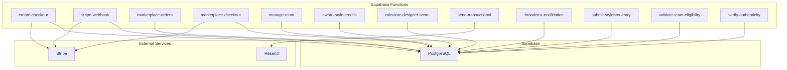
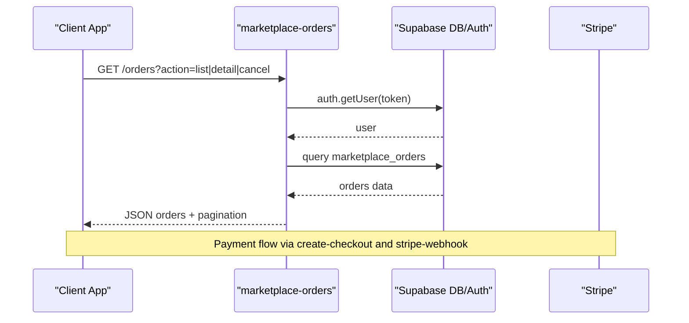
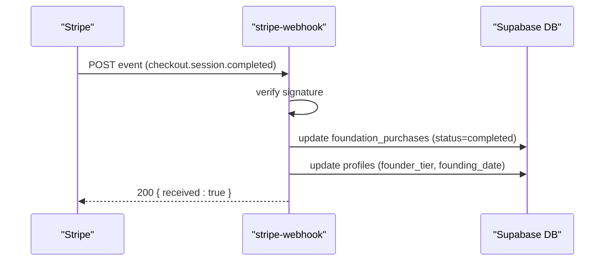
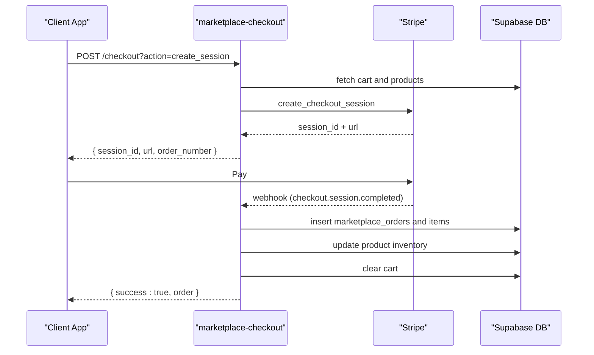
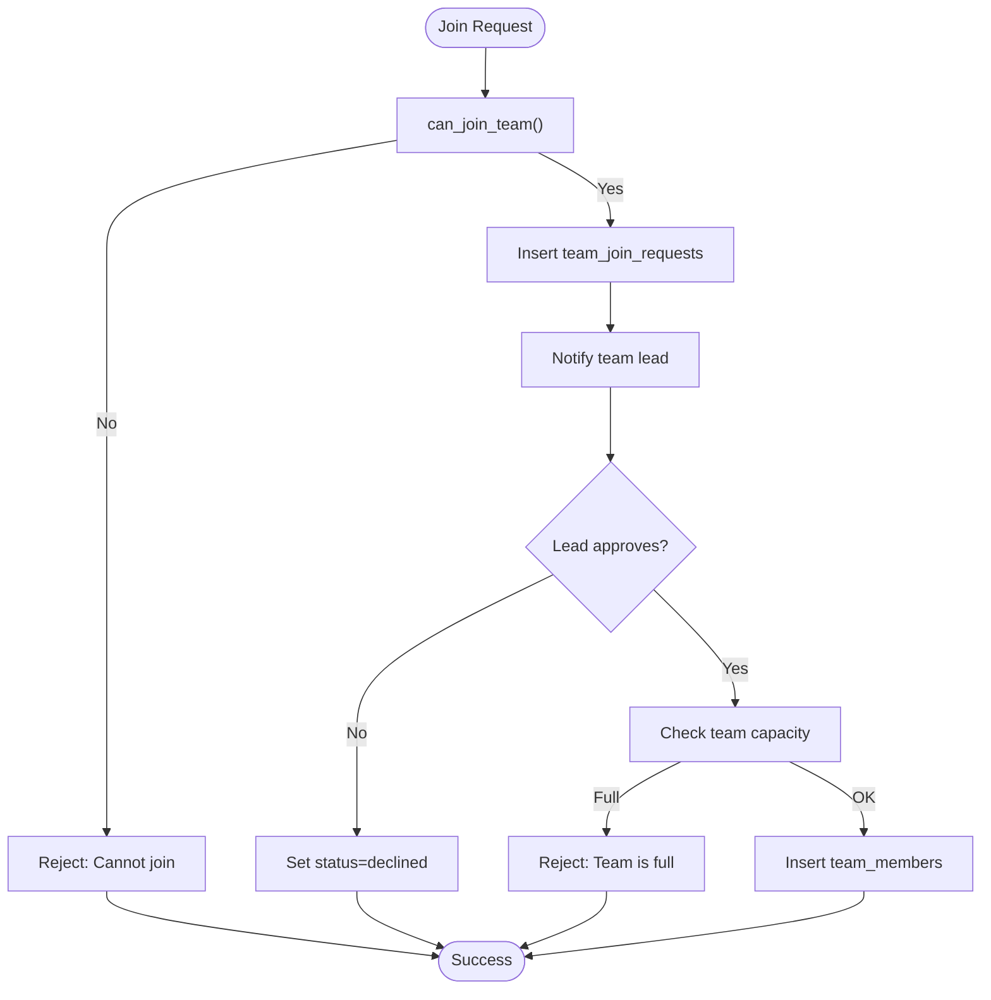
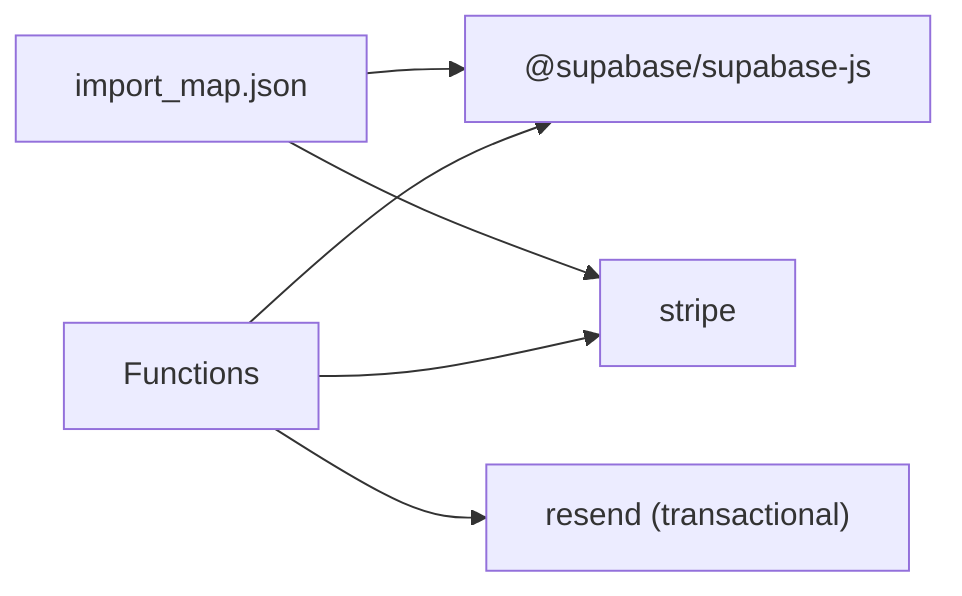

# API Integration & Serverless Functions

<cite>
**Referenced Files in This Document**
- [supabase/functions/deno.json](file://supabase/functions/deno.json)
- [supabase/functions/import_map.json](file://supabase/functions/import_map.json)
- [supabase/functions/stripe-webhook/index.ts](file://supabase/functions/stripe-webhook/index.ts)
- [supabase/functions/marketplace-orders/index.ts](file://supabase/functions/marketplace-orders/index.ts)
- [supabase/functions/marketplace-checkout/index.ts](file://supabase/functions/marketplace-checkout/index.ts)
- [supabase/functions/create-checkout/index.ts](file://supabase/functions/create-checkout/index.ts)
- [supabase/functions/manage-team/index.ts](file://supabase/functions/manage-team/index.ts)
- [supabase/functions/award-style-credits/index.ts](file://supabase/functions/award-style-credits/index.ts)
- [supabase/functions/calculate-designer-score/index.ts](file://supabase/functions/calculate-designer-score/index.ts)
- [supabase/functions/send-transactional/index.ts](file://supabase/functions/send-transactional/index.ts)
- [supabase/functions/broadcast-notification/index.ts](file://supabase/functions/broadcast-notification/index.ts)
- [supabase/functions/submit-stylebox-entry/index.ts](file://supabase/functions/submit-stylebox-entry/index.ts)
- [supabase/functions/validate-team-eligibility/index.ts](file://supabase/functions/validate-team-eligibility/index.ts)
- [supabase/functions/verify-authenticity/index.ts](file://supabase/functions/verify-authenticity/index.ts)
</cite>

## Table of Contents
1. [Introduction](#introduction)
2. [Project Structure](#project-structure)
3. [Core Components](#core-components)
4. [Architecture Overview](#architecture-overview)
5. [Detailed Component Analysis](#detailed-component-analysis)
6. [Dependency Analysis](#dependency-analysis)
7. [Performance Considerations](#performance-considerations)
8. [Troubleshooting Guide](#troubleshooting-guide)
9. [Conclusion](#conclusion)
10. [Appendices](#appendices)

## Introduction
This document describes the Supabase serverless function ecosystem and backend integration patterns powering the Adorzia platform. It covers the Deno-based serverless functions that expose REST-like endpoints, authentication and authorization flows, Stripe-powered payment processing, marketplace order lifecycle, team management, designer scoring, and administrative capabilities. It also documents webhook processing, request/response schemas, error handling, and operational considerations such as rate limiting and environment configuration.

## Project Structure
The serverless functions live under supabase/functions and are organized by domain:
- Payments and subscriptions: create-checkout, stripe-webhook
- Marketplace: marketplace-orders, marketplace-checkout, marketplace-cart, marketplace-products
- Teams: manage-team, validate-team-eligibility
- Designer ecosystem: award-style-credits, calculate-designer-score, submit-stylebox-entry, verify-authenticity
- Notifications and admin: broadcast-notification, send-transactional

**Diagram sources**
- [supabase/functions/create-checkout/index.ts](file://supabase/functions/create-checkout/index.ts#L1-L85)
- [supabase/functions/stripe-webhook/index.ts](file://supabase/functions/stripe-webhook/index.ts#L1-L160)
- [supabase/functions/marketplace-orders/index.ts](file://supabase/functions/marketplace-orders/index.ts#L1-L227)
- [supabase/functions/marketplace-checkout/index.ts](file://supabase/functions/marketplace-checkout/index.ts#L1-L331)
- [supabase/functions/manage-team/index.ts](file://supabase/functions/manage-team/index.ts#L1-L549)
- [supabase/functions/award-style-credits/index.ts](file://supabase/functions/award-style-credits/index.ts#L1-L181)
- [supabase/functions/calculate-designer-score/index.ts](file://supabase/functions/calculate-designer-score/index.ts#L1-L224)
- [supabase/functions/send-transactional/index.ts](file://supabase/functions/send-transactional/index.ts#L1-L70)
- [supabase/functions/broadcast-notification/index.ts](file://supabase/functions/broadcast-notification/index.ts#L1-L149)
- [supabase/functions/submit-stylebox-entry/index.ts](file://supabase/functions/submit-stylebox-entry/index.ts#L1-L142)
- [supabase/functions/validate-team-eligibility/index.ts](file://supabase/functions/validate-team-eligibility/index.ts#L1-L145)
- [supabase/functions/verify-authenticity/index.ts](file://supabase/functions/verify-authenticity/index.ts#L1-L263)

**Section sources**
- [supabase/functions/deno.json](file://supabase/functions/deno.json#L1-L4)
- [supabase/functions/import_map.json](file://supabase/functions/import_map.json#L1-L7)

## Core Components
- Deno runtime and import map: Functions rely on a shared import map to load @supabase/supabase-js and Stripe SDKs.
- Authentication: Most functions require a Bearer token from the Authorization header and validate it against Supabase auth.
- Supabase client usage: Functions use both user-scoped clients (via Authorization header) and service-role clients (for privileged operations).
- Environment variables: Functions read keys from Deno.env for Stripe, Supabase, and email providers.

Key patterns:
- CORS handling via Access-Control-Allow-* headers
- Logging via console.log with function-specific prefixes
- Error handling with structured JSON responses and appropriate HTTP status codes

**Section sources**
- [supabase/functions/deno.json](file://supabase/functions/deno.json#L1-L4)
- [supabase/functions/import_map.json](file://supabase/functions/import_map.json#L1-L7)
- [supabase/functions/marketplace-orders/index.ts](file://supabase/functions/marketplace-orders/index.ts#L1-L227)
- [supabase/functions/manage-team/index.ts](file://supabase/functions/manage-team/index.ts#L1-L549)

## Architecture Overview
The system integrates Supabase as the database and auth backbone with external services for payments and email delivery. Webhooks from Stripe trigger updates to purchase and profile records. Marketplace checkout orchestrates Stripe sessions and then creates orders and calculates designer commissions. Team management enforces rank and membership rules. Designer scoring aggregates multiple signals and persists weighted totals. Notifications are either broadcast to all users or sent transactionally.

**Diagram sources**
- [supabase/functions/marketplace-orders/index.ts](file://supabase/functions/marketplace-orders/index.ts#L1-L227)
- [supabase/functions/create-checkout/index.ts](file://supabase/functions/create-checkout/index.ts#L1-L85)
- [supabase/functions/stripe-webhook/index.ts](file://supabase/functions/stripe-webhook/index.ts#L1-L160)

## Detailed Component Analysis

### Payments and Subscriptions

#### Endpoint: create-checkout
- Purpose: Create a Stripe checkout session for a subscription.
- Authentication: Requires Authorization header; validates user and extracts email.
- Behavior:
  - Retrieves or reuses Stripe customer by email.
  - Creates a checkout session with success/cancel URLs and metadata.
  - Returns the session URL.
- Environment variables: SUPABASE_URL, SUPABASE_ANON_KEY, STRIPE_SECRET_KEY.
- CORS: Enabled for GET/POST/OPTIONS.

Example invocation:
- Method: POST
- Headers: Authorization: Bearer <user_token>, Content-Type: application/json
- Body: { priceId: "<stripe_price_id>" }
- Response: { url: "<checkout_session_url>" }

**Section sources**
- [supabase/functions/create-checkout/index.ts](file://supabase/functions/create-checkout/index.ts#L1-L85)

#### Endpoint: stripe-webhook
- Purpose: Process Stripe webhook events to finalize purchases and update profiles.
- Events handled: checkout.session.completed, checkout.session.expired, checkout.session.canceled.
- Behavior:
  - Verifies webhook signature using STRIPE_WEBHOOK_SECRET.
  - Uses service role client to update foundation_purchases and profiles.
- Environment variables: STRIPE_WEBHOOK_SECRET, SUPABASE_SERVICE_ROLE_KEY, SUPABASE_URL.

Sequence diagram for checkout.session.completed:

**Diagram sources**
- [supabase/functions/stripe-webhook/index.ts](file://supabase/functions/stripe-webhook/index.ts#L1-L160)

**Section sources**
- [supabase/functions/stripe-webhook/index.ts](file://supabase/functions/stripe-webhook/index.ts#L1-L160)

### Marketplace Operations

#### Endpoint: marketplace-orders
- Purpose: List, detail, and cancel customer orders.
- Authentication: Requires Authorization header; maps to marketplace_customers.
- Actions:
  - list: paginated orders filtered by customer and optional status.
  - detail: fetch order with items and product details.
  - cancel: validate order status and restore inventory.
- Environment variables: SUPABASE_URL, SUPABASE_SERVICE_ROLE_KEY.

Request/response examples:
- List orders:
  - Method: GET /orders?action=list&page=1&limit=10&status=pending
  - Response: { orders, pagination }
- Cancel order:
  - Method: POST /orders?action=cancel
  - Body: { order_id, reason }
  - Response: { order }

**Section sources**
- [supabase/functions/marketplace-orders/index.ts](file://supabase/functions/marketplace-orders/index.ts#L1-L227)

#### Endpoint: marketplace-checkout
- Purpose: Create Stripe checkout sessions and verify completion to build orders.
- Actions:
  - create_session: Build line items, compute shipping by region, create Stripe session, return session_id and order_number.
  - verify_session: Confirm payment status, deduplicate by payment_intent, create marketplace_orders and marketplace_order_items, update product inventory, clear cart.
- Environment variables: STRIPE_SECRET_KEY, SUPABASE_URL, SUPABASE_SERVICE_ROLE_KEY.

Sequence diagram for order creation:

**Diagram sources**
- [supabase/functions/marketplace-checkout/index.ts](file://supabase/functions/marketplace-checkout/index.ts#L1-L331)

**Section sources**
- [supabase/functions/marketplace-checkout/index.ts](file://supabase/functions/marketplace-checkout/index.ts#L1-L331)

### Team Management

#### Endpoint: manage-team
- Purpose: Create teams, invite users, respond to invitations, request to join, respond to join requests, and leave teams.
- Authentication: Requires Authorization header; uses both user-scoped and service-role clients.
- Rules enforced:
  - Team creation requires minimum rank threshold.
  - Only team leads can invite/respond to join requests.
  - Capacity checks for team size.
  - Lead cannot leave unless transferring leadership or dissolving team.
- Environment variables: SUPABASE_URL, SUPABASE_ANON_KEY, SUPABASE_SERVICE_ROLE_KEY.

Flowchart for joining a team:

**Diagram sources**
- [supabase/functions/manage-team/index.ts](file://supabase/functions/manage-team/index.ts#L1-L549)

**Section sources**
- [supabase/functions/manage-team/index.ts](file://supabase/functions/manage-team/index.ts#L1-L549)

#### Endpoint: validate-team-eligibility
- Purpose: Validate if a team meets the requirements for a given team challenge (size, rank thresholds, roles).
- Inputs: team_id, stylebox_id
- Outputs: eligibility status and reasons.

**Section sources**
- [supabase/functions/validate-team-eligibility/index.ts](file://supabase/functions/validate-team-eligibility/index.ts#L1-L145)

### Designer Ecosystem

#### Endpoint: award-style-credits
- Purpose: Award Style Credits to designers based on difficulty or explicit bonus; promote automatically when thresholds are met; notify the user.
- Inputs: submission_id, designer_id, difficulty, bonus_sc
- Outputs: awarded_sc, new_total_sc, lifetime_sc, promoted, new_rank_order

**Section sources**
- [supabase/functions/award-style-credits/index.ts](file://supabase/functions/award-style-credits/index.ts#L1-L181)

#### Endpoint: calculate-designer-score
- Purpose: Compute a weighted score from stylebox submissions, portfolio quality, publications, and sales; upsert designer_scores.
- Inputs: designer_id
- Outputs: scores and weighted_total

**Section sources**
- [supabase/functions/calculate-designer-score/index.ts](file://supabase/functions/calculate-designer-score/index.ts#L1-L224)

#### Endpoint: submit-stylebox-entry
- Purpose: Submit a stylebox entry for a challenge; validates stylebox activity and creates submission with notification.
- Inputs: stylebox_id, description, submission_files[]
- Outputs: submission summary

**Section sources**
- [supabase/functions/submit-stylebox-entry/index.ts](file://supabase/functions/submit-stylebox-entry/index.ts#L1-L142)

#### Endpoint: verify-authenticity
- Purpose: Public verification of product authenticity via verification_code or serial_number; optionally generate certificates (admin-only path).
- Actions:
  - verify: public lookup and increment verification stats
  - get_certificate: public product certificate retrieval
  - generate: admin-only certificate generation

**Section sources**
- [supabase/functions/verify-authenticity/index.ts](file://supabase/functions/verify-authenticity/index.ts#L1-L263)

### Notifications and Admin

#### Endpoint: send-transactional
- Purpose: Send transactional emails via Resend; logs to email_logs.
- Inputs: type, to, data
- Outputs: success with message_id

**Section sources**
- [supabase/functions/send-transactional/index.ts](file://supabase/functions/send-transactional/index.ts#L1-L70)

#### Endpoint: broadcast-notification
- Purpose: Admin-only broadcast of notifications to all users with batching.
- Authentication: Requires admin or superadmin role via user_roles.
- Inputs: type, message, title
- Outputs: count of notifications inserted

**Section sources**
- [supabase/functions/broadcast-notification/index.ts](file://supabase/functions/broadcast-notification/index.ts#L1-L149)

## Dependency Analysis
- Runtime and imports:
  - Deno runtime with shared import_map.json for @supabase/supabase-js and Stripe SDK.
- External dependencies:
  - Stripe for payment sessions and webhooks.
  - Resend for transactional emails.
- Internal dependencies:
  - Supabase client used for user auth verification, RLS-bypassed service role operations, and data persistence.

**Diagram sources**
- [supabase/functions/import_map.json](file://supabase/functions/import_map.json#L1-L7)

**Section sources**
- [supabase/functions/import_map.json](file://supabase/functions/import_map.json#L1-L7)

## Performance Considerations
- Function cold starts: Deno serverless functions may incur cold start latency; group related endpoints behind a single function when feasible.
- Database queries: Prefer selective queries with filters and pagination (as seen in marketplace-orders). Use joins judiciously.
- Batching writes: broadcast-notification inserts notifications in batches to avoid payload limits.
- Network calls: Stripe and Resend calls add latency; cache where appropriate and minimize retries.
- Rate limiting: No explicit rate limiting is implemented in the functions. Consider adding request throttling or quotas at the edge (e.g., CDN or reverse proxy) if traffic increases.

[No sources needed since this section provides general guidance]

## Troubleshooting Guide
Common issues and resolutions:
- Missing Authorization header: Most functions return 401 when missing. Ensure the client sends a Bearer token.
- Invalid or expired token: Functions return 401; refresh tokens or prompt re-authentication.
- Missing environment variables: Functions log critical errors and return 500. Verify SUPABASE_URL, SUPABASE_SERVICE_ROLE_KEY, STRIPE_SECRET_KEY, STRIPE_WEBHOOK_SECRET, RESEND_API_KEY_TRANSACTIONAL.
- Stripe signature verification failures: Ensure webhook secret matches and signing secret is configured in Stripe.
- Team capacity/full errors: Manage-team enforces max_members; adjust team size or reduce capacity.
- Notification broadcast timeouts: broadcast-notification limits batch size; ensure user count is reasonable.

**Section sources**
- [supabase/functions/marketplace-orders/index.ts](file://supabase/functions/marketplace-orders/index.ts#L1-L227)
- [supabase/functions/stripe-webhook/index.ts](file://supabase/functions/stripe-webhook/index.ts#L1-L160)
- [supabase/functions/manage-team/index.ts](file://supabase/functions/manage-team/index.ts#L1-L549)
- [supabase/functions/broadcast-notification/index.ts](file://supabase/functions/broadcast-notification/index.ts#L1-L149)

## Conclusion
The Supabase serverless function ecosystem provides a robust, modular backend for payments, marketplace operations, team management, designer scoring, and notifications. By leveraging Supabase’s auth and RLS, plus external services like Stripe and Resend, the platform scales while maintaining clear separation of concerns. Proper environment configuration, error handling, and operational monitoring are essential for production stability.

[No sources needed since this section summarizes without analyzing specific files]

## Appendices

### Authentication Methods
- User-scoped auth: Authorization: Bearer <JWT>; validated via supabase.auth.getUser(token).
- Admin-only endpoints: Additional check against user_roles for admin or superadmin.

**Section sources**
- [supabase/functions/marketplace-orders/index.ts](file://supabase/functions/marketplace-orders/index.ts#L1-L227)
- [supabase/functions/broadcast-notification/index.ts](file://supabase/functions/broadcast-notification/index.ts#L1-L149)

### Request/Response Schemas

- create-checkout
  - Request: { priceId: string }
  - Response: { url: string }

- marketplace-orders
  - List: GET /orders?action=list&page=&limit=&status=
    - Response: { orders: array, pagination: { page, limit, total, totalPages } }
  - Detail: GET /orders?action=detail&id= or ?order_number=
    - Response: { order, items: array }
  - Cancel: POST /orders?action=cancel
    - Request: { order_id: string, reason?: string }
    - Response: { order }

- marketplace-checkout
  - Create session: POST /checkout?action=create_session
    - Request: { cart_id: string, shipping_address, billing_address, shipping_method, success_url, cancel_url, currency?: string }
    - Response: { session_id: string, url: string, order_number: string }
  - Verify session: POST /checkout?action=verify_session
    - Request: { session_id: string }
    - Response: { success: boolean, order?: object } or { success: true, order }

- manage-team
  - Create: { action: "create", name, description?, category?, max_members?, is_open? }
  - Invite: { action: "invite", team_id, invitee_id, message? }
  - Respond invitation: { action: "respond_invitation", invitation_id, accept: boolean }
  - Join request: { action: "join_request", team_id, message }
  - Respond request: { action: "respond_request", request_id, approve: boolean }
  - Leave: { action: "leave", team_id }
  - Response: { success: true } or error object

- award-style-credits
  - Request: { submission_id, designer_id, difficulty?, bonus_sc? }
  - Response: { success: true, awarded_sc, new_total_sc, lifetime_sc, promoted, new_rank_order }

- calculate-designer-score
  - Request: { designer_id: string }
  - Response: { success: true, scores: { stylebox_score, portfolio_score, publication_score, selling_score, weighted_total } }

- send-transactional
  - Request: { type: string, to: string, data?: object }
  - Response: { success: true, message_id?: string }

- broadcast-notification
  - Request: { type: string, message: string, title?: string }
  - Response: { success: true, message: string, count: number }

- submit-stylebox-entry
  - Request: { stylebox_id: string, description?: string, submission_files: string[] }
  - Response: { success: true, submission: object, message: string }

- validate-team-eligibility
  - Request: { team_id: string, stylebox_id: string }
  - Response: { eligible: boolean, reason?, memberCount?, requiredSize?, minimumRankOrder?, members?, teamRoles? }

- verify-authenticity
  - Verify: { action: "verify", verification_code? or serial_number? }
    - Response: { verified: boolean, certificate? }
  - Get certificate: { action: "get_certificate", product_id: string }
    - Response: { certificate_number, designer, design_info, materials, production, intellectual_property, qr_code_url?, certificate_pdf_url? }
  - Generate: { action: "generate", product_id: string } (admin)
    - Response: { success: true, certificate }

**Section sources**
- [supabase/functions/create-checkout/index.ts](file://supabase/functions/create-checkout/index.ts#L1-L85)
- [supabase/functions/marketplace-orders/index.ts](file://supabase/functions/marketplace-orders/index.ts#L1-L227)
- [supabase/functions/marketplace-checkout/index.ts](file://supabase/functions/marketplace-checkout/index.ts#L1-L331)
- [supabase/functions/manage-team/index.ts](file://supabase/functions/manage-team/index.ts#L1-L549)
- [supabase/functions/award-style-credits/index.ts](file://supabase/functions/award-style-credits/index.ts#L1-L181)
- [supabase/functions/calculate-designer-score/index.ts](file://supabase/functions/calculate-designer-score/index.ts#L1-L224)
- [supabase/functions/send-transactional/index.ts](file://supabase/functions/send-transactional/index.ts#L1-L70)
- [supabase/functions/broadcast-notification/index.ts](file://supabase/functions/broadcast-notification/index.ts#L1-L149)
- [supabase/functions/submit-stylebox-entry/index.ts](file://supabase/functions/submit-stylebox-entry/index.ts#L1-L142)
- [supabase/functions/validate-team-eligibility/index.ts](file://supabase/functions/validate-team-eligibility/index.ts#L1-L145)
- [supabase/functions/verify-authenticity/index.ts](file://supabase/functions/verify-authenticity/index.ts#L1-L263)

### Error Handling Strategies
- Consistent JSON error responses with human-readable messages.
- Appropriate HTTP status codes: 400 for bad requests, 401 for auth failures, 403 for forbidden, 404 for not found, 500 for internal errors.
- Logging via console.log with function-specific prefixes for observability.

**Section sources**
- [supabase/functions/marketplace-orders/index.ts](file://supabase/functions/marketplace-orders/index.ts#L1-L227)
- [supabase/functions/stripe-webhook/index.ts](file://supabase/functions/stripe-webhook/index.ts#L1-L160)
- [supabase/functions/manage-team/index.ts](file://supabase/functions/manage-team/index.ts#L1-L549)
- [supabase/functions/broadcast-notification/index.ts](file://supabase/functions/broadcast-notification/index.ts#L1-L149)

### Rate Limiting Considerations
- No built-in rate limiting in functions. Consider:
  - Edge caching and CDN policies.
  - Supabase Edge Functions rate limits (if applicable).
  - Application-level throttling or circuit breakers.
  - External rate limiting via reverse proxy or API gateway.

[No sources needed since this section provides general guidance]