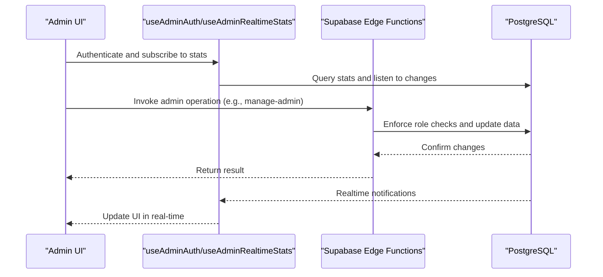
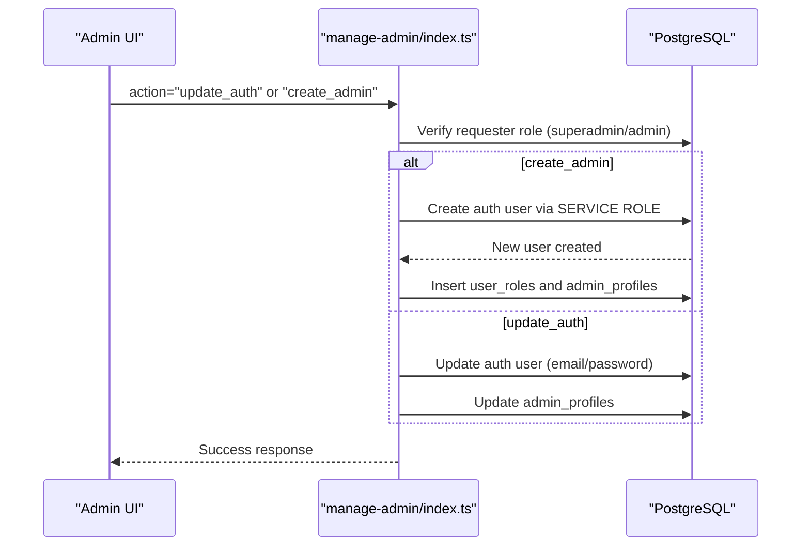
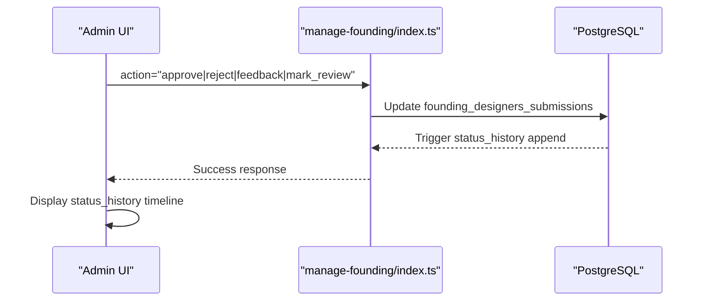
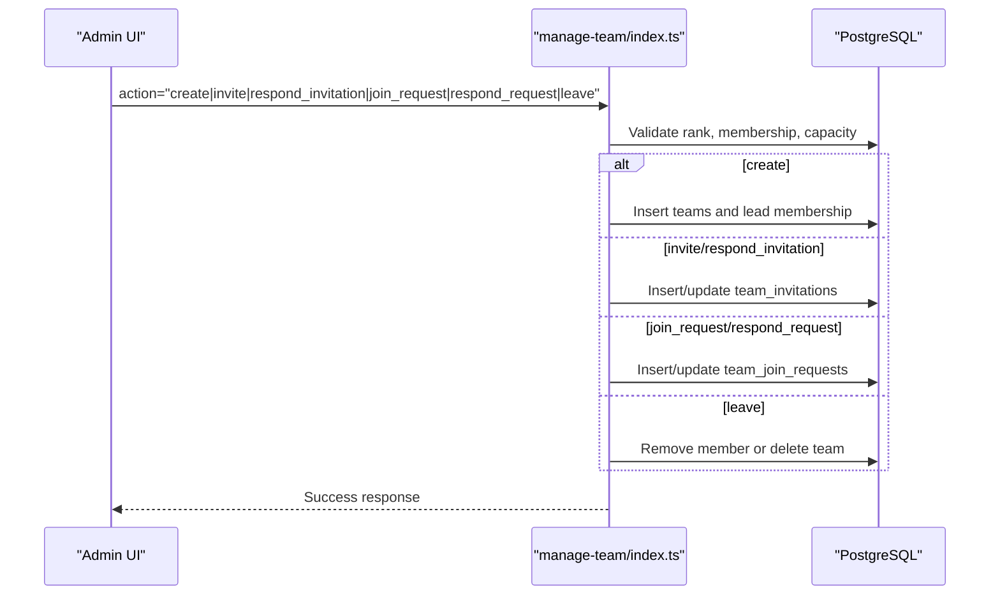
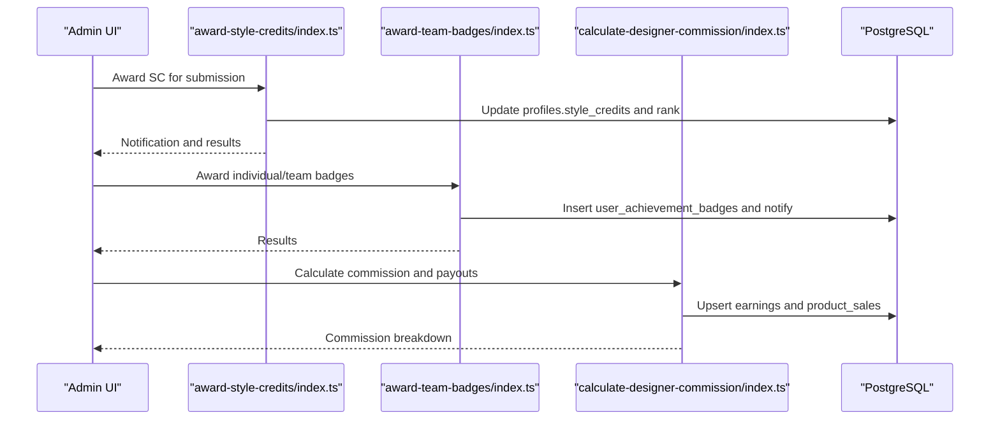
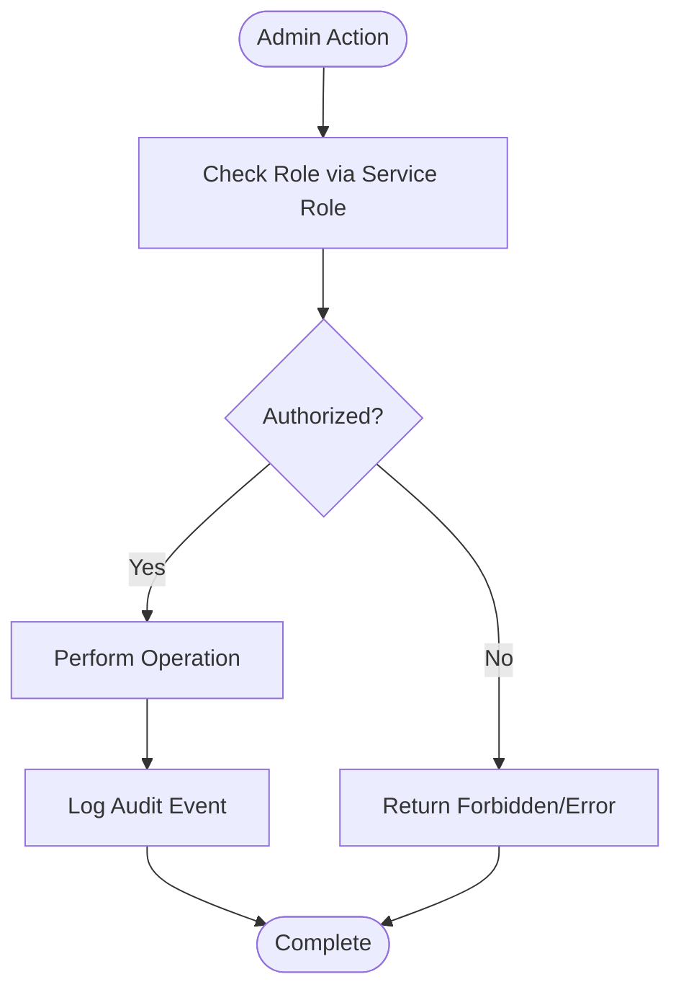
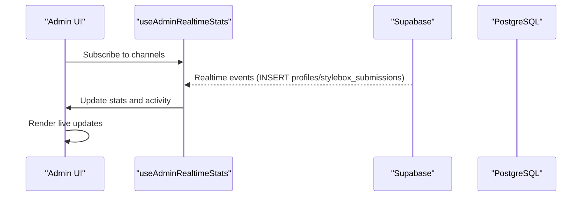
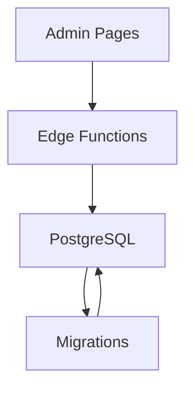

# Administrative Functions

<cite>
**Referenced Files in This Document**
- [AdminDashboard.tsx](file://src/pages/admin/AdminDashboard.tsx)
- [AdminAnalytics.tsx](file://src/pages/admin/AdminAnalytics.tsx)
- [AdminSecurity.tsx](file://src/pages/admin/AdminSecurity.tsx)
- [AdminFoundingSubmissions.tsx](file://src/pages/admin/AdminFoundingSubmissions.tsx)
- [AdminFoundingReview.tsx](file://src/pages/admin/AdminFoundingReview.tsx)
- [AdminTeams.tsx](file://src/pages/admin/AdminTeams.tsx)
- [AdminPayouts.tsx](file://src/pages/admin/AdminPayouts.tsx)
- [AdminPublications.tsx](file://src/pages/admin/AdminPublications.tsx)
- [TeamSubmissionReview.tsx](file://src/components/admin/TeamSubmissionReview.tsx)
- [TeamChallengeProgress.tsx](file://src/components/teams/TeamChallengeProgress.tsx)
- [TeamSettingsTab.tsx](file://src/components/admin/stylebox-wizard/tabs/TeamSettingsTab.tsx)
- [useFoundingSubmissions.tsx](file://src/hooks/useFoundingSubmissions.tsx)
- [useAdminAuth.tsx](file://src/hooks/useAdminAuth.tsx)
- [useAdminRealtimeStats.tsx](file://src/hooks/useAdminRealtimeStats.tsx)
- [admin-client.ts](file://src/integrations/supabase/admin-client.ts)
- [manage-admin/index.ts](file://supabase/functions/manage-admin/index.ts)
- [manage-team/index.ts](file://supabase/functions/manage-team/index.ts)
- [manage-founding/index.ts](file://supabase/functions/manage-founding/index.ts)
- [award-style-credits/index.ts](file://supabase/functions/award-style-credits/index.ts)
- [award-team-badges/index.ts](file://supabase/functions/award-team-badges/index.ts)
- [calculate-designer-commission/index.ts](file://supabase/functions/calculate-designer-commission/index.ts)
- [calculate-designer-score/index.ts](file://supabase/functions/calculate-designer-score/index.ts)
- [validate-team-eligibility/index.ts](file://supabase/functions/validate-team-eligibility/index.ts)
- [reset-monthly-tokens/index.ts](file://supabase/functions/reset-monthly-tokens/index.ts)
- [send-admin-invitation/index.ts](file://supabase/functions/send-admin-invitation/index.ts)
- [20260126010000_add_founding_designers_program.sql](file://supabase/migrations/20260126010000_add_founding_designers_program.sql)
- [20260126070000_enhance_founding_profiles.sql](file://supabase/migrations/20260126070000_enhance_founding_profiles.sql)
- [20260126080000_enhance_founding_submissions_ui.sql](file://supabase/migrations/20260126080000_enhance_founding_submissions_ui.sql)
- [20260126090000_admin_founding_workflow.sql](file://supabase/migrations/20260126090000_admin_founding_workflow.sql)
- [20260126100000_founding_final_refinements.sql](file://supabase/migrations/20260126100000_founding_final_refinements.sql)
- [20251225042959_58b61b4d-1f17-4666-96b3-211a9f48ed2a.sql](file://supabase/migrations/20251225042959_58b61b4d-1f17-4666-96b3-211a9f48ed2a.sql)
</cite>

## Table of Contents
1. [Introduction](#introduction)
2. [Project Structure](#project-structure)
3. [Core Components](#core-components)
4. [Architecture Overview](#architecture-overview)
5. [Detailed Component Analysis](#detailed-component-analysis)
6. [Dependency Analysis](#dependency-analysis)
7. [Performance Considerations](#performance-considerations)
8. [Troubleshooting Guide](#troubleshooting-guide)
9. [Conclusion](#conclusion)

## Introduction
This document provides comprehensive documentation for administrative backend functions across the platform. It covers admin user management, the Founding Designers Program administration, team management operations, reward distribution systems, permission handling, audit logging, and administrative workflows. It also explains integration with the admin panel, real-time updates, and provides examples of administrative operation implementations and workflow automation.

## Project Structure
The administrative backend spans frontend admin pages, hooks for real-time stats, Supabase edge functions, and database migrations. The frontend admin pages orchestrate administrative tasks, while edge functions encapsulate server-side logic for sensitive operations and automated workflows.

```mermaid
graph TB
subgraph "Admin Frontend"
AD["AdminDashboard.tsx"]
AA["AdminAnalytics.tsx"]
AS["AdminSecurity.tsx"]
AF["AdminFoundingSubmissions.tsx"]
AFV["AdminFoundingReview.tsx"]
AT["AdminTeams.tsx"]
AP["AdminPayouts.tsx"]
APU["AdminPublications.tsx"]
end
subgraph "Hooks"
UA["useAdminAuth.tsx"]
URS["useAdminRealtimeStats.tsx"]
UFS["useFoundingSubmissions.tsx"]
end
subgraph "Supabase Edge Functions"
MADM["manage-admin/index.ts"]
MTEAM["manage-team/index.ts"]
MF["manage-founding/index.ts"]
ASC["award-style-credits/index.ts"]
AB["award-team-badges/index.ts"]
CDC["calculate-designer-commission/index.ts"]
CDS["calculate-designer-score/index.ts"]
VTE["validate-team-eligibility/index.ts"]
RMT["reset-monthly-tokens/index.ts"]
SAI["send-admin-invitation/index.ts"]
end
subgraph "Database Migrations"
FDP["add_founding_designers_program.sql"]
EFP["enhance_founding_profiles.sql"]
EFUI["enhance_founding_submissions_ui.sql"]
AFW["admin_founding_workflow.sql"]
FFR["founding_final_refinements.sql"]
TEAM["team_challenge_migrations.sql"]
end
AD --> UA
AA --> URS
AF --> UFS
AS --> MADM
AT --> MTEAM
AP --> CDC
AFV --> MF
APU --> AB
AT --> VTE
AD --> RMT
AS --> SAI
MADM --> FDP
MTEAM --> TEAM
MF --> FDP
ASC --> FDP
AB --> TEAM
CDC --> FDP
CDS --> FDP
VTE --> TEAM
RMT --> FDP
SAI --> FDP
```

**Diagram sources**
- [AdminDashboard.tsx](file://src/pages/admin/AdminDashboard.tsx#L1-L608)
- [AdminAnalytics.tsx](file://src/pages/admin/AdminAnalytics.tsx#L1-L313)
- [AdminSecurity.tsx](file://src/pages/admin/AdminSecurity.tsx#L52-L438)
- [AdminFoundingSubmissions.tsx](file://src/pages/admin/AdminFoundingSubmissions.tsx#L56-L90)
- [AdminFoundingReview.tsx](file://src/pages/admin/AdminFoundingReview.tsx#L384-L412)
- [AdminTeams.tsx](file://src/pages/admin/AdminTeams.tsx)
- [AdminPayouts.tsx](file://src/pages/admin/AdminPayouts.tsx#L1-L296)
- [AdminPublications.tsx](file://src/pages/admin/AdminPublications.tsx#L911-L944)
- [useAdminAuth.tsx](file://src/hooks/useAdminAuth.tsx)
- [useAdminRealtimeStats.tsx](file://src/hooks/useAdminRealtimeStats.tsx)
- [useFoundingSubmissions.tsx](file://src/hooks/useFoundingSubmissions.tsx#L45-L83)
- [manage-admin/index.ts](file://supabase/functions/manage-admin/index.ts#L1-L148)
- [manage-team/index.ts](file://supabase/functions/manage-team/index.ts#L1-L549)
- [manage-founding/index.ts](file://supabase/functions/manage-founding/index.ts#L68-L170)
- [award-style-credits/index.ts](file://supabase/functions/award-style-credits/index.ts#L1-L181)
- [award-team-badges/index.ts](file://supabase/functions/award-team-badges/index.ts#L1-L183)
- [calculate-designer-commission/index.ts](file://supabase/functions/calculate-designer-commission/index.ts#L1-L209)
- [calculate-designer-score/index.ts](file://supabase/functions/calculate-designer-score/index.ts#L1-L224)
- [validate-team-eligibility/index.ts](file://supabase/functions/validate-team-eligibility/index.ts#L1-L145)
- [reset-monthly-tokens/index.ts](file://supabase/functions/reset-monthly-tokens/index.ts#L1-L111)
- [send-admin-invitation/index.ts](file://supabase/functions/send-admin-invitation/index.ts#L1-L100)
- [20260126010000_add_founding_designers_program.sql](file://supabase/migrations/20260126010000_add_founding_designers_program.sql#L1-L125)
- [20260126070000_enhance_founding_profiles.sql](file://supabase/migrations/20260126070000_enhance_founding_profiles.sql#L1-L25)
- [20260126080000_enhance_founding_submissions_ui.sql](file://supabase/migrations/20260126080000_enhance_founding_submissions_ui.sql#L1-L13)
- [20260126090000_admin_founding_workflow.sql](file://supabase/migrations/20260126090000_admin_founding_workflow.sql#L1-L31)
- [20260126100000_founding_final_refinements.sql](file://supabase/migrations/20260126100000_founding_final_refinements.sql#L1-L20)
- [20251225042959_58b61b4d-1f17-4666-96b3-211a9f48ed2a.sql](file://supabase/migrations/20251225042959_58b61b4d-1f17-4666-96b3-211a9f48ed2a.sql#L1-L133)

**Section sources**
- [AdminDashboard.tsx](file://src/pages/admin/AdminDashboard.tsx#L1-L608)
- [AdminAnalytics.tsx](file://src/pages/admin/AdminAnalytics.tsx#L1-L313)
- [AdminSecurity.tsx](file://src/pages/admin/AdminSecurity.tsx#L52-L438)
- [AdminFoundingSubmissions.tsx](file://src/pages/admin/AdminFoundingSubmissions.tsx#L56-L90)
- [AdminFoundingReview.tsx](file://src/pages/admin/AdminFoundingReview.tsx#L384-L412)
- [AdminTeams.tsx](file://src/pages/admin/AdminTeams.tsx)
- [AdminPayouts.tsx](file://src/pages/admin/AdminPayouts.tsx#L1-L296)
- [AdminPublications.tsx](file://src/pages/admin/AdminPublications.tsx#L911-L944)
- [useAdminAuth.tsx](file://src/hooks/useAdminAuth.tsx)
- [useAdminRealtimeStats.tsx](file://src/hooks/useAdminRealtimeStats.tsx)
- [useFoundingSubmissions.tsx](file://src/hooks/useFoundingSubmissions.tsx#L45-L83)
- [manage-admin/index.ts](file://supabase/functions/manage-admin/index.ts#L1-L148)
- [manage-team/index.ts](file://supabase/functions/manage-team/index.ts#L1-L549)
- [manage-founding/index.ts](file://supabase/functions/manage-founding/index.ts#L68-L170)
- [award-style-credits/index.ts](file://supabase/functions/award-style-credits/index.ts#L1-L181)
- [award-team-badges/index.ts](file://supabase/functions/award-team-badges/index.ts#L1-L183)
- [calculate-designer-commission/index.ts](file://supabase/functions/calculate-designer-commission/index.ts#L1-L209)
- [calculate-designer-score/index.ts](file://supabase/functions/calculate-designer-score/index.ts#L1-L224)
- [validate-team-eligibility/index.ts](file://supabase/functions/validate-team-eligibility/index.ts#L1-L145)
- [reset-monthly-tokens/index.ts](file://supabase/functions/reset-monthly-tokens/index.ts#L1-L111)
- [send-admin-invitation/index.ts](file://supabase/functions/send-admin-invitation/index.ts#L1-L100)
- [20260126010000_add_founding_designers_program.sql](file://supabase/migrations/20260126010000_add_founding_designers_program.sql#L1-L125)
- [20260126070000_enhance_founding_profiles.sql](file://supabase/migrations/20260126070000_enhance_founding_profiles.sql#L1-L25)
- [20260126080000_enhance_founding_submissions_ui.sql](file://supabase/migrations/20260126080000_enhance_founding_submissions_ui.sql#L1-L13)
- [20260126090000_admin_founding_workflow.sql](file://supabase/migrations/20260126090000_admin_founding_workflow.sql#L1-L31)
- [20260126100000_founding_final_refinements.sql](file://supabase/migrations/20260126100000_founding_final_refinements.sql#L1-L20)
- [20251225042959_58b61b4d-1f17-4666-96b3-211a9f48ed2a.sql](file://supabase/migrations/20251225042959_58b61b4d-1f17-4666-96b3-211a9f48ed2a.sql#L1-L133)

## Core Components
- Admin user management: Role and access control, admin creation, profile updates, and access revocation with audit logging.
- Founding Designers Program: Submission lifecycle, status transitions, eligibility tracking, and audit history.
- Team management: Creation, invitations, join requests, leadership transfers, and capacity management.
- Reward distribution: Style credits awarding, rank progression, team badge awards, and designer commission calculations.
- Permissions and audit: Role-based access checks, admin logs, and status change auditing.
- Real-time admin panel: Dashboard metrics, analytics, and live activity feeds.

**Section sources**
- [AdminSecurity.tsx](file://src/pages/admin/AdminSecurity.tsx#L52-L438)
- [manage-admin/index.ts](file://supabase/functions/manage-admin/index.ts#L1-L148)
- [AdminFoundingSubmissions.tsx](file://src/pages/admin/AdminFoundingSubmissions.tsx#L56-L90)
- [AdminFoundingReview.tsx](file://src/pages/admin/AdminFoundingReview.tsx#L384-L412)
- [manage-founding/index.ts](file://supabase/functions/manage-founding/index.ts#L68-L170)
- [AdminTeams.tsx](file://src/pages/admin/AdminTeams.tsx)
- [manage-team/index.ts](file://supabase/functions/manage-team/index.ts#L1-L549)
- [award-style-credits/index.ts](file://supabase/functions/award-style-credits/index.ts#L1-L181)
- [award-team-badges/index.ts](file://supabase/functions/award-team-badges/index.ts#L1-L183)
- [calculate-designer-commission/index.ts](file://supabase/functions/calculate-designer-commission/index.ts#L1-L209)
- [AdminDashboard.tsx](file://src/pages/admin/AdminDashboard.tsx#L1-L608)
- [AdminAnalytics.tsx](file://src/pages/admin/AdminAnalytics.tsx#L1-L313)

## Architecture Overview
The admin backend integrates frontend pages with Supabase edge functions and database migrations. Admin pages use hooks for authentication and real-time stats, and interact with edge functions for privileged operations. Edge functions enforce role checks, perform updates, and maintain audit trails.

**Diagram sources**
- [useAdminAuth.tsx](file://src/hooks/useAdminAuth.tsx)
- [useAdminRealtimeStats.tsx](file://src/hooks/useAdminRealtimeStats.tsx)
- [manage-admin/index.ts](file://supabase/functions/manage-admin/index.ts#L1-L148)
- [admin-client.ts](file://src/integrations/supabase/admin-client.ts)

**Section sources**
- [AdminDashboard.tsx](file://src/pages/admin/AdminDashboard.tsx#L304-L353)
- [AdminAnalytics.tsx](file://src/pages/admin/AdminAnalytics.tsx#L20-L33)
- [manage-admin/index.ts](file://supabase/functions/manage-admin/index.ts#L1-L148)
- [admin-client.ts](file://src/integrations/supabase/admin-client.ts)

## Detailed Component Analysis

### Admin User Management
Admin user management handles role assignments, profile updates, and access revocation with audit logging. The system distinguishes between standard admin and superadmin privileges and ensures only authorized updates are permitted.

**Diagram sources**
- [manage-admin/index.ts](file://supabase/functions/manage-admin/index.ts#L79-L133)
- [AdminSecurity.tsx](file://src/pages/admin/AdminSecurity.tsx#L253-L285)

**Section sources**
- [manage-admin/index.ts](file://supabase/functions/manage-admin/index.ts#L1-L148)
- [AdminSecurity.tsx](file://src/pages/admin/AdminSecurity.tsx#L52-L438)

### Founding Designers Program Administration
The Founding Designers Program includes submission lifecycle management, status transitions, internal notes, rejection reasons, and automatic audit logging of state changes. The admin panel displays submission details and timeline.

**Diagram sources**
- [manage-founding/index.ts](file://supabase/functions/manage-founding/index.ts#L75-L170)
- [20260126090000_admin_founding_workflow.sql](file://supabase/migrations/20260126090000_admin_founding_workflow.sql#L12-L31)
- [AdminFoundingReview.tsx](file://src/pages/admin/AdminFoundingReview.tsx#L384-L412)

**Section sources**
- [AdminFoundingSubmissions.tsx](file://src/pages/admin/AdminFoundingSubmissions.tsx#L56-L90)
- [AdminFoundingReview.tsx](file://src/pages/admin/AdminFoundingReview.tsx#L384-L412)
- [manage-founding/index.ts](file://supabase/functions/manage-founding/index.ts#L68-L170)
- [20260126010000_add_founding_designers_program.sql](file://supabase/migrations/20260126010000_add_founding_designers_program.sql#L1-L125)
- [20260126070000_enhance_founding_profiles.sql](file://supabase/migrations/20260126070000_enhance_founding_profiles.sql#L1-L25)
- [20260126080000_enhance_founding_submissions_ui.sql](file://supabase/migrations/20260126080000_enhance_founding_submissions_ui.sql#L1-L13)
- [20260126090000_admin_founding_workflow.sql](file://supabase/migrations/20260126090000_admin_founding_workflow.sql#L1-L31)
- [20260126100000_founding_final_refinements.sql](file://supabase/migrations/20260126100000_founding_final_refinements.sql#L1-L20)
- [useFoundingSubmissions.tsx](file://src/hooks/useFoundingSubmissions.tsx#L45-L83)

### Team Management Operations
Team management supports creation, invitations, join requests, leadership transfers, and capacity enforcement. Eligibility validation ensures teams meet stylebox requirements before submission.

**Diagram sources**
- [manage-team/index.ts](file://supabase/functions/manage-team/index.ts#L83-L549)
- [validate-team-eligibility/index.ts](file://supabase/functions/validate-team-eligibility/index.ts#L1-L145)

**Section sources**
- [AdminTeams.tsx](file://src/pages/admin/AdminTeams.tsx)
- [manage-team/index.ts](file://supabase/functions/manage-team/index.ts#L1-L549)
- [validate-team-eligibility/index.ts](file://supabase/functions/validate-team-eligibility/index.ts#L1-L145)
- [TeamSubmissionReview.tsx](file://src/components/admin/TeamSubmissionReview.tsx#L78-L128)
- [TeamChallengeProgress.tsx](file://src/components/teams/TeamChallengeProgress.tsx#L116-L130)
- [TeamSettingsTab.tsx](file://src/components/admin/stylebox-wizard/tabs/TeamSettingsTab.tsx#L40-L79)
- [20251225042959_58b61b4d-1f17-4666-96b3-211a9f48ed2a.sql](file://supabase/migrations/20251225042959_58b61b4d-1f17-4666-96b3-211a9f48ed2a.sql#L1-L133)

### Reward Distribution Systems
Reward distribution includes style credits awarding, rank progression, team badge awards, and designer commission calculations. These functions operate via edge functions and maintain notifications.

**Diagram sources**
- [award-style-credits/index.ts](file://supabase/functions/award-style-credits/index.ts#L47-L181)
- [award-team-badges/index.ts](file://supabase/functions/award-team-badges/index.ts#L15-L183)
- [calculate-designer-commission/index.ts](file://supabase/functions/calculate-designer-commission/index.ts#L41-L209)

**Section sources**
- [award-style-credits/index.ts](file://supabase/functions/award-style-credits/index.ts#L1-L181)
- [award-team-badges/index.ts](file://supabase/functions/award-team-badges/index.ts#L1-L183)
- [calculate-designer-commission/index.ts](file://supabase/functions/calculate-designer-commission/index.ts#L1-L209)
- [AdminPayouts.tsx](file://src/pages/admin/AdminPayouts.tsx#L1-L296)

### Permission Handling and Audit Logging
Permission handling relies on role checks enforced by edge functions using the Supabase Service Role. Audit logging captures role changes, access revocations, and submission status transitions.

**Diagram sources**
- [manage-admin/index.ts](file://supabase/functions/manage-admin/index.ts#L44-L73)
- [AdminSecurity.tsx](file://src/pages/admin/AdminSecurity.tsx#L271-L285)
- [20260126090000_admin_founding_workflow.sql](file://supabase/migrations/20260126090000_admin_founding_workflow.sql#L12-L31)

**Section sources**
- [manage-admin/index.ts](file://supabase/functions/manage-admin/index.ts#L1-L148)
- [AdminSecurity.tsx](file://src/pages/admin/AdminSecurity.tsx#L52-L438)
- [20260126090000_admin_founding_workflow.sql](file://supabase/migrations/20260126090000_admin_founding_workflow.sql#L1-L31)

### Administrative Workflows and Real-time Updates
Administrative workflows include dashboard metrics, analytics, and live activity feeds. Real-time subscriptions update the UI when new designers register or new submissions arrive.

**Diagram sources**
- [AdminDashboard.tsx](file://src/pages/admin/AdminDashboard.tsx#L304-L353)
- [AdminAnalytics.tsx](file://src/pages/admin/AdminAnalytics.tsx#L20-L33)

**Section sources**
- [AdminDashboard.tsx](file://src/pages/admin/AdminDashboard.tsx#L1-L608)
- [AdminAnalytics.tsx](file://src/pages/admin/AdminAnalytics.tsx#L1-L313)

## Dependency Analysis
Administrative functions depend on Supabase edge functions and database migrations. The edge functions enforce role checks and perform privileged operations, while migrations define schema, policies, and triggers for audit logging.

**Diagram sources**
- [manage-admin/index.ts](file://supabase/functions/manage-admin/index.ts#L1-L148)
- [manage-team/index.ts](file://supabase/functions/manage-team/index.ts#L1-L549)
- [manage-founding/index.ts](file://supabase/functions/manage-founding/index.ts#L68-L170)
- [award-style-credits/index.ts](file://supabase/functions/award-style-credits/index.ts#L1-L181)
- [award-team-badges/index.ts](file://supabase/functions/award-team-badges/index.ts#L1-L183)
- [calculate-designer-commission/index.ts](file://supabase/functions/calculate-designer-commission/index.ts#L1-L209)
- [20260126010000_add_founding_designers_program.sql](file://supabase/migrations/20260126010000_add_founding_designers_program.sql#L1-L125)
- [20251225042959_58b61b4d-1f17-4666-96b3-211a9f48ed2a.sql](file://supabase/migrations/20251225042959_58b61b4d-1f17-4666-96b3-211a9f48ed2a.sql#L1-L133)

**Section sources**
- [manage-admin/index.ts](file://supabase/functions/manage-admin/index.ts#L1-L148)
- [manage-team/index.ts](file://supabase/functions/manage-team/index.ts#L1-L549)
- [manage-founding/index.ts](file://supabase/functions/manage-founding/index.ts#L68-L170)
- [award-style-credits/index.ts](file://supabase/functions/award-style-credits/index.ts#L1-L181)
- [award-team-badges/index.ts](file://supabase/functions/award-team-badges/index.ts#L1-L183)
- [calculate-designer-commission/index.ts](file://supabase/functions/calculate-designer-commission/index.ts#L1-L209)
- [20260126010000_add_founding_designers_program.sql](file://supabase/migrations/20260126010000_add_founding_designers_program.sql#L1-L125)
- [20251225042959_58b61b4d-1f17-4666-96b3-211a9f48ed2a.sql](file://supabase/migrations/20251225042959_58b61b4d-1f17-4666-96b3-211a9f48ed2a.sql#L1-L133)

## Performance Considerations
- Use database indexes on frequently queried columns (e.g., submission status, created timestamps) to optimize admin queries.
- Batch operations for bulk updates (e.g., awarding badges) to minimize database round trips.
- Implement pagination and filters in admin tables to reduce payload sizes.
- Cache non-sensitive dashboard metrics where appropriate to reduce database load.
- Monitor edge function cold starts and consider keeping functions warm if throughput demands increase.

## Troubleshooting Guide
- Authentication failures: Verify Authorization header presence and validity in edge functions.
- Role enforcement errors: Ensure requester has admin or superadmin role via Service Role checks.
- Database constraint violations: Review migration-defined constraints and triggers for submissions and profiles.
- Real-time updates not appearing: Confirm channel subscriptions and Supabase realtime configuration.
- Audit logs missing: Check triggers that append status_history and admin_logs entries.

**Section sources**
- [manage-admin/index.ts](file://supabase/functions/manage-admin/index.ts#L14-L61)
- [AdminSecurity.tsx](file://src/pages/admin/AdminSecurity.tsx#L253-L285)
- [20260126090000_admin_founding_workflow.sql](file://supabase/migrations/20260126090000_admin_founding_workflow.sql#L12-L31)
- [AdminDashboard.tsx](file://src/pages/admin/AdminDashboard.tsx#L304-L353)

## Conclusion
The administrative backend provides robust tools for managing users, programs, teams, rewards, and financial operations. Through role-based permissions, comprehensive audit logging, and real-time updates, administrators can efficiently oversee platform operations. Edge functions encapsulate sensitive logic and automate workflows, while database migrations ensure schema integrity and compliance with evolving requirements.