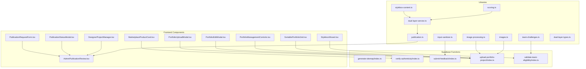
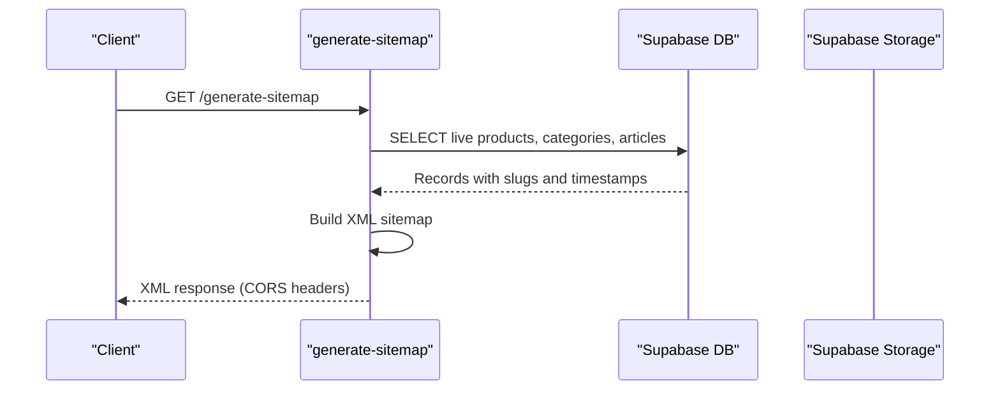
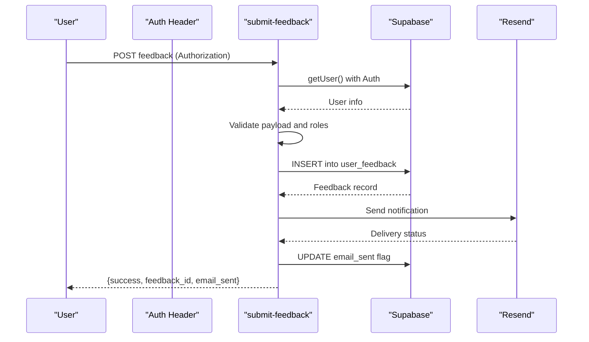
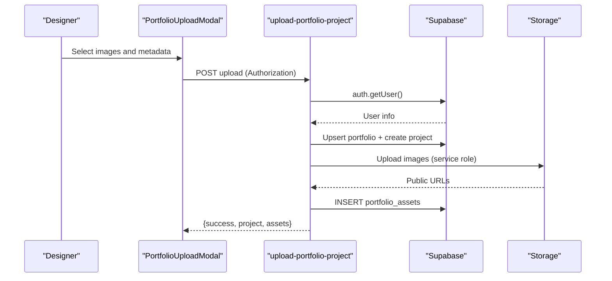
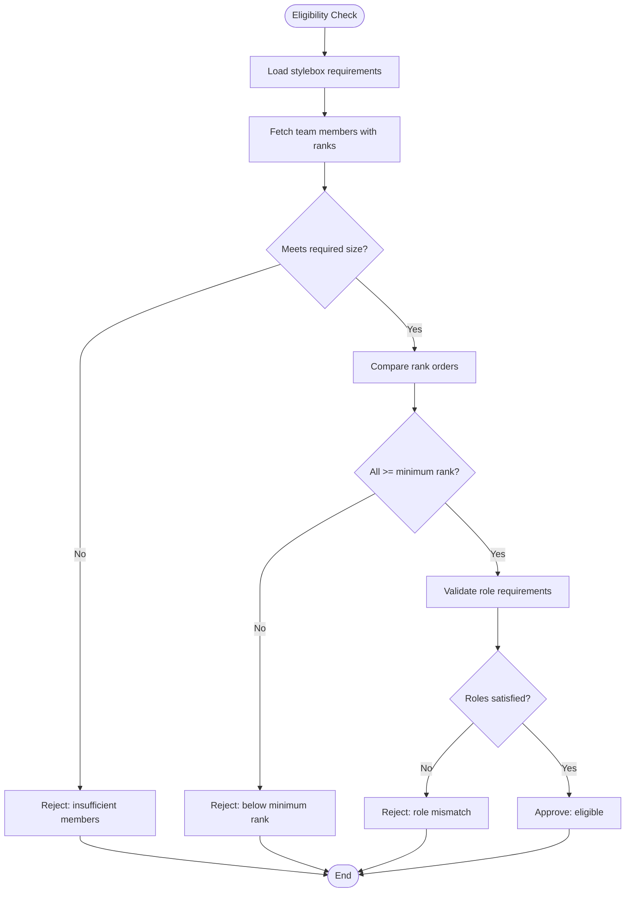
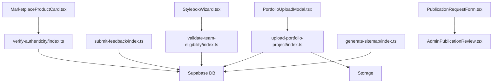

# Content Management Functions

<cite>
**Referenced Files in This Document**
- [generate-sitemap/index.ts](file://supabase/functions/generate-sitemap/index.ts)
- [verify-authenticity/index.ts](file://supabase/functions/verify-authenticity/index.ts)
- [submit-feedback/index.ts](file://supabase/functions/submit-feedback/index.ts)
- [upload-portfolio-project/index.ts](file://supabase/functions/upload-portfolio-project/index.ts)
- [validate-team-eligibility/index.ts](file://supabase/functions/validate-team-eligibility/index.ts)
- [publication.ts](file://src/lib/publication.ts)
- [stylebox-content.ts](file://src/lib/stylebox-content.ts)
- [scoring.ts](file://src/lib/scoring.ts)
- [team-challenges.ts](file://src/lib/team-challenges.ts)
- [image-processing.ts](file://src/lib/image-processing.ts)
- [images.ts](file://src/lib/images.ts)
- [input-sanitizer.ts](file://src/lib/input-sanitizer.ts)
- [dual-layer-service.ts](file://src/lib/dual-layer-service.ts)
- [dual-layer-types.ts](file://src/lib/dual-layer-types.ts)
- [PortfolioUploadModal.tsx](file://src/components/portfolio/PortfolioUploadModal.tsx)
- [PortfolioEditModal.tsx](file://src/components/portfolio/PortfolioEditModal.tsx)
- [PortfolioManagementControls.tsx](file://src/components/portfolio/PortfolioManagementControls.tsx)
- [SortablePortfolioGrid.tsx](file://src/components/portfolio/SortablePortfolioGrid.tsx)
- [PublicationRequestForm.tsx](file://src/components/portfolio/PublicationRequestForm.tsx)
- [PublicationStatusModal.tsx](file://src/components/portfolio/PublicationStatusModal.tsx)
- [AdminPublicationReview.tsx](file://src/components/projects/AdminPublicationReview.tsx)
- [DesignerProjectManager.tsx](file://src/components/projects/DesignerProjectManager.tsx)
- [AdminCollectionsContent.tsx](file://src/components/admin/marketplace/AdminCollectionsContent.tsx)
- [AdminProductsTable.tsx](file://src/components/admin/marketplace/AdminProductsTable.tsx)
- [AdminProductForm.tsx](file://src/components/admin/marketplace/AdminProductForm.tsx)
- [MarketplaceProductCard.tsx](file://src/components/marketplace/MarketplaceProductCard.tsx)
- [MarketplaceHeader.tsx](file://src/components/public/MarketplaceHeader.tsx)
- [MarketplaceFooter.tsx](file://src/components/public/MarketplaceFooter.tsx)
- [MarketplaceLayout.tsx](file://src/components/marketplace/MarketplaceLayout.tsx)
- [Breadcrumbs.tsx](file://src/components/stylebox/Breadcrumbs.tsx)
- [StyleboxCard.tsx](file://src/components/stylebox/StyleboxCard.tsx)
- [StyleboxDashboardCard.tsx](file://src/components/stylebox/StyleboxDashboardCard.tsx)
- [StyleboxWizard.tsx](file://src/components/stylebox-wizard/StyleboxWizard.tsx)
- [WizardContext.tsx](file://src/components/stylebox-wizard/WizardContext.tsx)
- [ArchetypeTab.tsx](file://src/components/stylebox-wizard/tabs/ArchetypeTab.tsx)
- [BasicSetupTab.tsx](file://src/components/stylebox-wizard/tabs/BasicSetupTab.tsx)
- [ColorSystemTab.tsx](file://src/components/stylebox-wizard/tabs/ColorSystemTab.tsx)
- [ConstraintsTab.tsx](file://src/components/stylebox-wizard/tabs/ConstraintsTab.tsx)
- [DeliverablesConfigTab.tsx](file://src/components/stylebox-wizard/tabs/DeliverablesConfigTab.tsx)
- [DeliverablesTab.tsx](file://src/components/stylebox-wizard/tabs/DeliverablesTab.tsx)
- [DesignGuidelinesTab.tsx](file://src/components/stylebox-wizard/tabs/DesignGuidelinesTab.tsx)
- [DetailedDeliverablesTab.tsx](file://src/components/stylebox-wizard/tabs/DetailedDeliverablesTab.tsx)
- [EvaluationTab.tsx](file://src/components/stylebox-wizard/tabs/EvaluationTab.tsx)
- [ManifestationTab.tsx](file://src/components/stylebox-wizard/tabs/ManifestationTab.tsx)
- [MaterialDirectionTab.tsx](file://src/components/stylebox-wizard/tabs/MaterialDirectionTab.tsx)
- [MutationTab.tsx](file://src/components/stylebox-wizard/tabs/MutationTab.tsx)
- [RestrictionsTab.tsx](file://src/components/stylebox-wizard/tabs/RestrictionsTab.tsx)
- [ScenarioTab.tsx](file://src/components/stylebox-wizard/tabs/ScenarioTab.tsx)
- [TeamSettingsTab.tsx](file://src/components/stylebox-wizard/tabs/TeamSettingsTab.tsx)
- [TechnicalRequirementsTab.tsx](file://src/components/stylebox-wizard/tabs/TechnicalRequirementsTab.tsx)
- [TimelineTab.tsx](file://src/components/stylebox-wizard/tabs/TimelineTab.tsx)
- [TrendDirectionTab.tsx](file://src/components/stylebox-wizard/tabs/TrendDirectionTab.tsx)
- [VisualDirectionTab.tsx](file://src/components/stylebox-wizard/tabs/VisualDirectionTab.tsx)
</cite>

## Table of Contents
1. [Introduction](#introduction)
2. [Project Structure](#project-structure)
3. [Core Components](#core-components)
4. [Architecture Overview](#architecture-overview)
5. [Detailed Component Analysis](#detailed-component-analysis)
6. [Dependency Analysis](#dependency-analysis)
7. [Performance Considerations](#performance-considerations)
8. [Troubleshooting Guide](#troubleshooting-guide)
9. [Conclusion](#conclusion)

## Introduction
This document explains the content management and verification functions across the platform, focusing on:
- Sitemap generation for SEO
- Product authenticity verification and certificate retrieval
- Feedback collection and processing workflows
- Portfolio upload handling and image processing
- Team eligibility validation for collaborative challenges

It also outlines content moderation workflows, verification algorithms, quality assurance processes, and automated decision-making patterns. Examples of content workflow implementation and automated processing are included to guide developers and administrators.

## Project Structure
The content management functions are implemented as serverless edge functions under the Supabase functions directory, with supporting libraries and UI components in the frontend codebase. Key areas:
- Supabase functions: sitemap generation, authenticity verification, feedback submission, portfolio uploads, team eligibility
- Frontend components: portfolio management UI, publication request forms, marketplace product cards, stylebox wizard
- Shared libraries: publication workflows, scoring, team challenges, image processing, input sanitization, dual-layer moderation

**Diagram sources**
- [generate-sitemap/index.ts](file://supabase/functions/generate-sitemap/index.ts#L1-L137)
- [verify-authenticity/index.ts](file://supabase/functions/verify-authenticity/index.ts#L1-L274)
- [submit-feedback/index.ts](file://supabase/functions/submit-feedback/index.ts#L1-L264)
- [upload-portfolio-project/index.ts](file://supabase/functions/upload-portfolio-project/index.ts#L1-L300)
- [validate-team-eligibility/index.ts](file://supabase/functions/validate-team-eligibility/index.ts#L1-L145)
- [PortfolioUploadModal.tsx](file://src/components/portfolio/PortfolioUploadModal.tsx)
- [PortfolioEditModal.tsx](file://src/components/portfolio/PortfolioEditModal.tsx)
- [PortfolioManagementControls.tsx](file://src/components/portfolio/PortfolioManagementControls.tsx)
- [SortablePortfolioGrid.tsx](file://src/components/portfolio/SortablePortfolioGrid.tsx)
- [PublicationRequestForm.tsx](file://src/components/portfolio/PublicationRequestForm.tsx)
- [PublicationStatusModal.tsx](file://src/components/portfolio/PublicationStatusModal.tsx)
- [AdminPublicationReview.tsx](file://src/components/projects/AdminPublicationReview.tsx)
- [DesignerProjectManager.tsx](file://src/components/projects/DesignerProjectManager.tsx)
- [MarketplaceProductCard.tsx](file://src/components/marketplace/MarketplaceProductCard.tsx)
- [StyleboxWizard.tsx](file://src/components/stylebox-wizard/StyleboxWizard.tsx)
- [publication.ts](file://src/lib/publication.ts)
- [stylebox-content.ts](file://src/lib/stylebox-content.ts)
- [scoring.ts](file://src/lib/scoring.ts)
- [team-challenges.ts](file://src/lib/team-challenges.ts)
- [image-processing.ts](file://src/lib/image-processing.ts)
- [images.ts](file://src/lib/images.ts)
- [input-sanitizer.ts](file://src/lib/input-sanitizer.ts)
- [dual-layer-service.ts](file://src/lib/dual-layer-service.ts)
- [dual-layer-types.ts](file://src/lib/dual-layer-types.ts)

**Section sources**
- [generate-sitemap/index.ts](file://supabase/functions/generate-sitemap/index.ts#L1-L137)
- [verify-authenticity/index.ts](file://supabase/functions/verify-authenticity/index.ts#L1-L274)
- [submit-feedback/index.ts](file://supabase/functions/submit-feedback/index.ts#L1-L264)
- [upload-portfolio-project/index.ts](file://supabase/functions/upload-portfolio-project/index.ts#L1-L300)
- [validate-team-eligibility/index.ts](file://supabase/functions/validate-team-eligibility/index.ts#L1-L145)

## Core Components
This section summarizes the primary content management and verification components and their responsibilities.

- Sitemap Generation
  - Fetches live products, active categories, and published articles from the database
  - Builds an XML sitemap with URLs, last modified dates, change frequencies, and priorities
  - Returns a CORS-enabled XML response suitable for web crawlers

- Authenticity Verification
  - Public verification endpoint accepts verification code or serial number
  - Retrieves certificate details with product and designer information
  - Updates verification statistics and returns structured verification results
  - Certificate retrieval endpoint for product pages
  - Admin-only certificate generation with cryptographic hashing and persistence

- Feedback Processing
  - Validates and sanitizes feedback payload
  - Requires authenticated user via Authorization header
  - Inserts feedback into the database and sends admin notifications via external email provider
  - Logs email attempts and updates flags for auditability

- Portfolio Upload Handling
  - Validates authorization and request payload
  - Ensures portfolio exists per user; creates if missing
  - Creates a project record and uploads images to storage
  - Generates thumbnails, records assets, and supports transaction-like rollback on failures
  - Uses service role client to bypass row-level security for storage operations

- Team Eligibility Validation
  - Validates team participation against stylebox requirements
  - Checks team size, minimum rank order, and role requirements
  - Returns eligibility status and detailed member rankings

**Section sources**
- [generate-sitemap/index.ts](file://supabase/functions/generate-sitemap/index.ts#L12-L128)
- [verify-authenticity/index.ts](file://supabase/functions/verify-authenticity/index.ts#L35-L134)
- [verify-authenticity/index.ts](file://supabase/functions/verify-authenticity/index.ts#L137-L198)
- [verify-authenticity/index.ts](file://supabase/functions/verify-authenticity/index.ts#L200-L260)
- [submit-feedback/index.ts](file://supabase/functions/submit-feedback/index.ts#L32-L250)
- [upload-portfolio-project/index.ts](file://supabase/functions/upload-portfolio-project/index.ts#L21-L287)
- [validate-team-eligibility/index.ts](file://supabase/functions/validate-team-eligibility/index.ts#L16-L134)

## Architecture Overview
The content management architecture combines serverless functions for data and media operations with frontend components for user interactions and administrative oversight. Moderation and quality assurance leverage shared libraries and dual-layer services.

**Diagram sources**
- [generate-sitemap/index.ts](file://supabase/functions/generate-sitemap/index.ts#L12-L128)

**Diagram sources**
- [submit-feedback/index.ts](file://supabase/functions/submit-feedback/index.ts#L32-L250)

**Diagram sources**
- [upload-portfolio-project/index.ts](file://supabase/functions/upload-portfolio-project/index.ts#L21-L287)
- [PortfolioUploadModal.tsx](file://src/components/portfolio/PortfolioUploadModal.tsx)

**Diagram sources**
- [validate-team-eligibility/index.ts](file://supabase/functions/validate-team-eligibility/index.ts#L16-L134)

## Detailed Component Analysis

### Sitemap Generation
- Purpose: Produce an XML sitemap for SEO indexing
- Data sources: live marketplace products, active categories, published articles
- Output: XML with URLs, lastmod, changefreq, and priority for each entry
- CORS: Enabled for cross-origin access

Implementation highlights:
- Fetches records with slug and updated_at fields
- Computes lastmod from updated_at or current date
- Includes static pages with predefined priorities and change frequencies
- Concatenates URL entries into a single XML document

**Section sources**
- [generate-sitemap/index.ts](file://supabase/functions/generate-sitemap/index.ts#L12-L128)

### Authenticity Verification
- Public verification endpoint:
  - Accepts verification_code or serial_number
  - Performs case-insensitive lookup and returns certificate details
  - Updates verification_count and last_verified_at
- Certificate retrieval endpoint:
  - Returns product certificate details for public product pages
- Admin certificate generation:
  - Requires Authorization header
  - Generates certificate number via stored procedure
  - Creates SHA-256 hash of key data for blockchain linkage
  - Inserts certificate with materials and production attributes

Verification algorithm:
- Case-insensitive matching on verification_code or serial_number
- Aggregated joins to fetch product, designer, and IP linkage details
- Atomic update of verification stats upon successful verification

**Section sources**
- [verify-authenticity/index.ts](file://supabase/functions/verify-authenticity/index.ts#L35-L134)
- [verify-authenticity/index.ts](file://supabase/functions/verify-authenticity/index.ts#L137-L198)
- [verify-authenticity/index.ts](file://supabase/functions/verify-authenticity/index.ts#L200-L260)

### Feedback Processing
- Authentication:
  - Requires Authorization header
  - Uses Supabase auth.getUser() to validate session
- Validation:
  - Enforces presence of user_name, user_role, category, message
  - Validates user_role and category enumerations
  - Limits message length to prevent abuse
- Persistence:
  - Inserts feedback with email_sent=false
  - Uses service role client for reliable writes
- Notification:
  - Sends HTML email via external provider with contextual metadata
  - Logs email attempts to email_logs table
  - Updates email_sent flag upon successful delivery

Processing workflow:
- Pre-flight CORS handling
- User authentication
- Payload validation
- Database insertion
- Email dispatch and logging
- Response with feedback_id and email_sent status

**Section sources**
- [submit-feedback/index.ts](file://supabase/functions/submit-feedback/index.ts#L32-L250)

### Portfolio Upload Handling
- Authentication and authorization:
  - Validates Authorization header
  - Uses service role client for storage operations to bypass RLS
- Portfolio lifecycle:
  - Ensures portfolio exists per user; creates if absent
  - Creates portfolio_project record with optional metadata
- Image processing and storage:
  - Decodes base64 image data
  - Generates unique filenames with user_id, project_id, and timestamp
  - Uploads to storage bucket with cache control and MIME type
  - Derives public URL and sets first image as thumbnail
- Asset recording:
  - Inserts portfolio_assets with file metadata, dimensions, and display order
- Rollback mechanism:
  - On failure, deletes uploaded files, asset records, and project to maintain consistency

Quality assurance:
- Dimension extraction placeholder for future enhancement
- Thumbnail assignment for visual preview
- Transaction-like rollback to prevent partial state

**Section sources**
- [upload-portfolio-project/index.ts](file://supabase/functions/upload-portfolio-project/index.ts#L21-L287)

### Team Eligibility Validation
- Inputs:
  - team_id and stylebox_id from request body
- Requirements:
  - Loads stylebox team_size, minimum_team_rank_order, and team_role_requirements
- Validation steps:
  - Confirms stylebox is a team challenge
  - Fetches team members with profiles and ranks
  - Compares member count to required size
  - Validates each member’s rank meets minimum threshold
  - Checks role requirements against stylebox configuration
- Output:
  - Eligible: true with member details and teamRoles
  - Ineligible: reason, counts, and details of failing members

Automated decision-making:
- Early exit on missing inputs or invalid stylebox
- Iterative ranking comparison with clear failure reasons
- Structured response enabling downstream UI and queue decisions

**Section sources**
- [validate-team-eligibility/index.ts](file://supabase/functions/validate-team-eligibility/index.ts#L16-L134)

### Content Moderation Workflows and Quality Assurance
Shared libraries support moderation and quality checks:
- Publication workflows: orchestrate review and approval flows for content
- Scoring: compute scores for designers and submissions
- Team challenges: define challenge-specific rules and validations
- Dual-layer service: coordinate moderation layers and thresholds
- Input sanitizer: sanitize and normalize user inputs
- Image processing: prepare and optimize images for storage and display
- Images: utilities for CDN and image-related operations

These libraries integrate with the frontend components and functions to enforce quality standards and automate moderation decisions.

**Section sources**
- [publication.ts](file://src/lib/publication.ts)
- [scoring.ts](file://src/lib/scoring.ts)
- [team-challenges.ts](file://src/lib/team-challenges.ts)
- [dual-layer-service.ts](file://src/lib/dual-layer-service.ts)
- [dual-layer-types.ts](file://src/lib/dual-layer-types.ts)
- [input-sanitizer.ts](file://src/lib/input-sanitizer.ts)
- [image-processing.ts](file://src/lib/image-processing.ts)
- [images.ts](file://src/lib/images.ts)

## Dependency Analysis
The following diagram shows dependencies among key components involved in content management and verification.

**Diagram sources**
- [verify-authenticity/index.ts](file://supabase/functions/verify-authenticity/index.ts#L1-L274)
- [submit-feedback/index.ts](file://supabase/functions/submit-feedback/index.ts#L1-L264)
- [upload-portfolio-project/index.ts](file://supabase/functions/upload-portfolio-project/index.ts#L1-L300)
- [validate-team-eligibility/index.ts](file://supabase/functions/validate-team-eligibility/index.ts#L1-L145)
- [generate-sitemap/index.ts](file://supabase/functions/generate-sitemap/index.ts#L1-L137)
- [PortfolioUploadModal.tsx](file://src/components/portfolio/PortfolioUploadModal.tsx)
- [PublicationRequestForm.tsx](file://src/components/portfolio/PublicationRequestForm.tsx)
- [AdminPublicationReview.tsx](file://src/components/projects/AdminPublicationReview.tsx)
- [MarketplaceProductCard.tsx](file://src/components/marketplace/MarketplaceProductCard.tsx)
- [StyleboxWizard.tsx](file://src/components/stylebox-wizard/StyleboxWizard.tsx)

**Section sources**
- [verify-authenticity/index.ts](file://supabase/functions/verify-authenticity/index.ts#L1-L274)
- [submit-feedback/index.ts](file://supabase/functions/submit-feedback/index.ts#L1-L264)
- [upload-portfolio-project/index.ts](file://supabase/functions/upload-portfolio-project/index.ts#L1-L300)
- [validate-team-eligibility/index.ts](file://supabase/functions/validate-team-eligibility/index.ts#L1-L145)
- [generate-sitemap/index.ts](file://supabase/functions/generate-sitemap/index.ts#L1-L137)

## Performance Considerations
- Sitemap generation
  - Minimizes database queries by selecting only required fields
  - Uses a single pass to build XML, reducing memory overhead
- Authenticity verification
  - Single-row fetch with joined relations; consider indexing verification_code and serial_number for faster lookups
- Feedback processing
  - Asynchronous email dispatch avoids blocking the main thread
  - Logging ensures eventual consistency of email status
- Portfolio uploads
  - Base64 decoding and storage operations are synchronous; consider streaming uploads for large files
  - Rollback reduces partial state risk but incurs additional storage and DB operations
- Team eligibility
  - Joins profiles and ranks; ensure appropriate indexing on team_members and ranks tables

[No sources needed since this section provides general guidance]

## Troubleshooting Guide
Common issues and resolutions:
- Sitemap generation
  - Missing environment variables: ensure SUPABASE_URL and SUPABASE_ANON_KEY are configured
  - Database connectivity errors: verify connection string and network access
- Authenticity verification
  - Missing Authorization header for admin actions: configure service role key and include Authorization
  - Invalid verification_code or serial_number: confirm case-insensitive input and presence in database
- Feedback processing
  - Missing Authorization header: provide a valid session token
  - Email provider misconfiguration: verify RESEND_API_KEY_FEEDBACK and network access
- Portfolio uploads
  - Missing Authorization header: authenticate the user before upload
  - Storage permission errors: ensure service role key is present and storage policies permit uploads
  - Partial upload failures: rely on rollback to clean up assets and storage
- Team eligibility
  - Missing team_id or stylebox_id: validate request payload before invoking the function
  - Insufficient members or rank: adjust team composition according to stylebox requirements

**Section sources**
- [generate-sitemap/index.ts](file://supabase/functions/generate-sitemap/index.ts#L18-L21)
- [verify-authenticity/index.ts](file://supabase/functions/verify-authenticity/index.ts#L202-L208)
- [submit-feedback/index.ts](file://supabase/functions/submit-feedback/index.ts#L39-L47)
- [upload-portfolio-project/index.ts](file://supabase/functions/upload-portfolio-project/index.ts#L42-L49)
- [validate-team-eligibility/index.ts](file://supabase/functions/validate-team-eligibility/index.ts#L26-L33)

## Conclusion
The content management and verification system integrates serverless functions with frontend components and shared libraries to deliver robust workflows for sitemap generation, authenticity verification, feedback processing, portfolio uploads, and team eligibility validation. By enforcing strict validation, leveraging service role clients for secure storage operations, and implementing rollback mechanisms, the system maintains data integrity and user trust. Automated decision-making and moderation layers further streamline quality assurance and compliance.