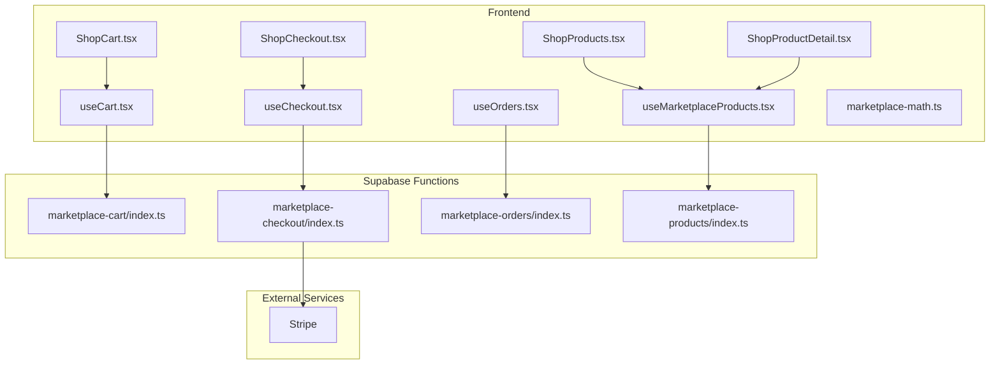
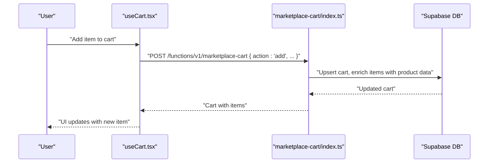
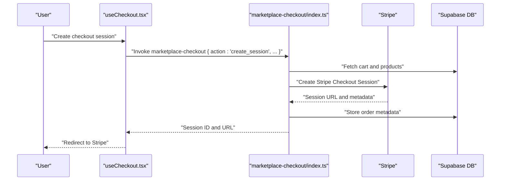
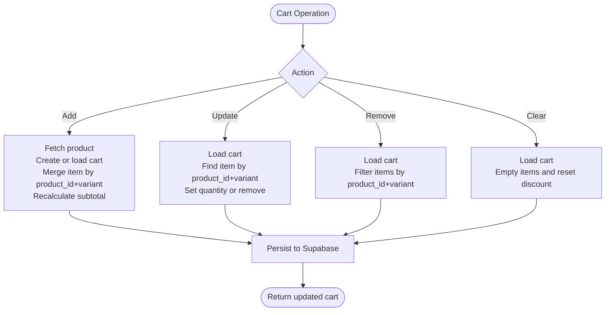
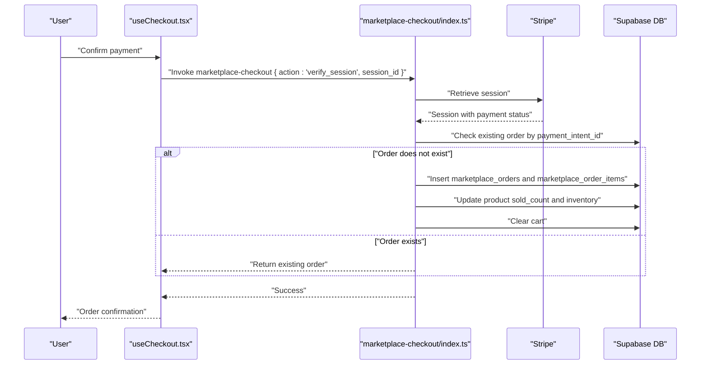
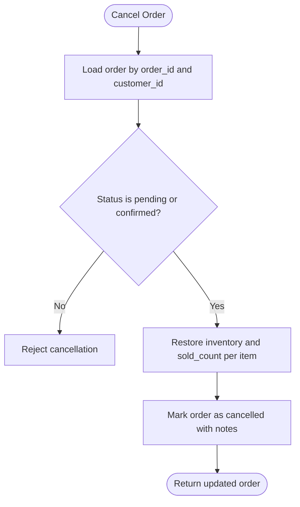
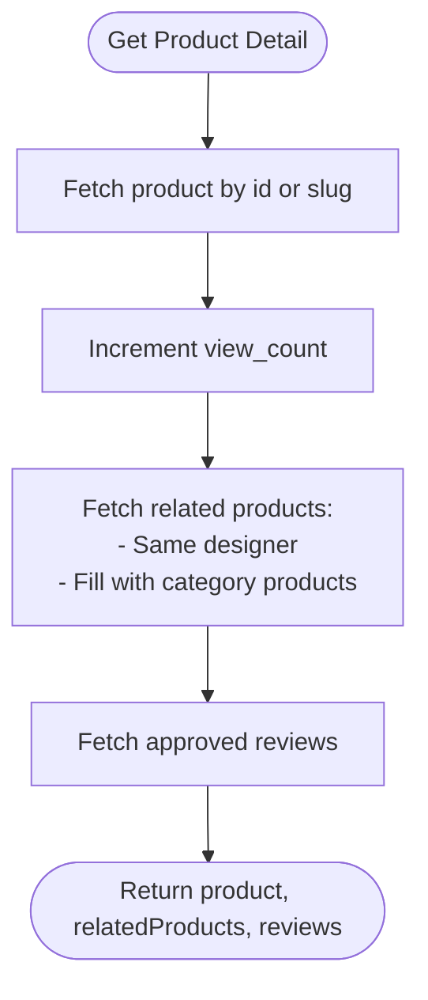
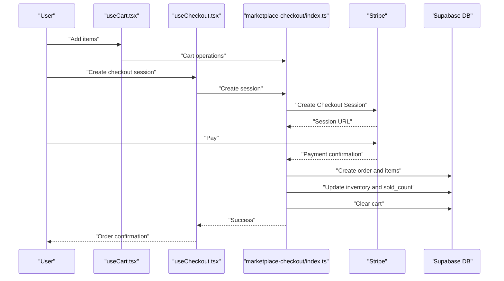
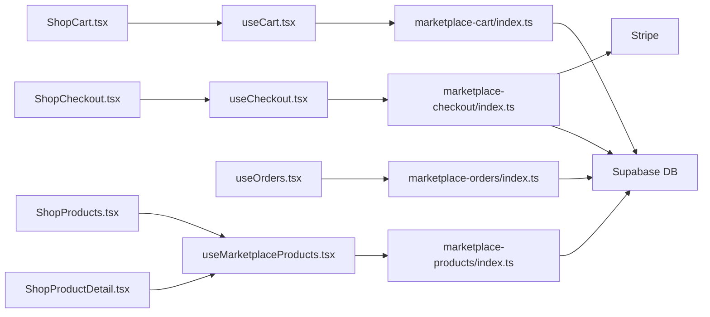

# Marketplace Business Logic

<cite>
**Referenced Files in This Document**
- [README.md](file://README.md)
- [src/lib/marketplace-math.ts](file://src/lib/marketplace-math.ts)
- [src/hooks/useCart.tsx](file://src/hooks/useCart.tsx)
- [src/hooks/useCheckout.tsx](file://src/hooks/useCheckout.tsx)
- [src/hooks/useOrders.tsx](file://src/hooks/useOrders.tsx)
- [src/hooks/useMarketplaceProducts.tsx](file://src/hooks/useMarketplaceProducts.tsx)
- [src/pages/shop/ShopCart.tsx](file://src/pages/shop/ShopCart.tsx)
- [src/pages/shop/ShopCheckout.tsx](file://src/pages/shop/ShopCheckout.tsx)
- [src/pages/shop/ShopProducts.tsx](file://src/pages/shop/ShopProducts.tsx)
- [src/pages/shop/ShopProductDetail.tsx](file://src/pages/shop/ShopProductDetail.tsx)
- [supabase/functions/marketplace-cart/index.ts](file://supabase/functions/marketplace-cart/index.ts)
- [supabase/functions/marketplace-checkout/index.ts](file://supabase/functions/marketplace-checkout/index.ts)
- [supabase/functions/marketplace-orders/index.ts](file://supabase/functions/marketplace-orders/index.ts)
- [supabase/functions/marketplace-products/index.ts](file://supabase/functions/marketplace-products/index.ts)
</cite>

## Table of Contents
1. [Introduction](#introduction)
2. [Project Structure](#project-structure)
3. [Core Components](#core-components)
4. [Architecture Overview](#architecture-overview)
5. [Detailed Component Analysis](#detailed-component-analysis)
6. [Dependency Analysis](#dependency-analysis)
7. [Performance Considerations](#performance-considerations)
8. [Troubleshooting Guide](#troubleshooting-guide)
9. [Conclusion](#conclusion)
10. [Appendices](#appendices)

## Introduction
This document explains the marketplace business logic for cart management, checkout processing, order fulfillment, and product catalog management. It covers inventory handling, pricing calculations, shipping integration, order lifecycle management, status tracking, and product validation. It also documents integration patterns with external services (Stripe for payments, Supabase for persistence and serverless functions), and provides examples of order processing workflows, cart persistence, and product search functionality.

## Project Structure
The marketplace is implemented as a React SPA with Supabase-backed serverless functions. Frontend hooks orchestrate cart, checkout, orders, and product catalog operations, while Supabase Edge Functions implement the business logic for cart mutations, checkout sessions, order creation, and product queries.

**Diagram sources**
- [src/pages/shop/ShopCart.tsx](file://src/pages/shop/ShopCart.tsx#L1-L221)
- [src/pages/shop/ShopCheckout.tsx](file://src/pages/shop/ShopCheckout.tsx#L1-L85)
- [src/pages/shop/ShopProducts.tsx](file://src/pages/shop/ShopProducts.tsx#L1-L194)
- [src/pages/shop/ShopProductDetail.tsx](file://src/pages/shop/ShopProductDetail.tsx#L1-L350)
- [src/hooks/useCart.tsx](file://src/hooks/useCart.tsx#L1-L228)
- [src/hooks/useCheckout.tsx](file://src/hooks/useCheckout.tsx#L1-L188)
- [src/hooks/useOrders.tsx](file://src/hooks/useOrders.tsx#L1-L320)
- [src/hooks/useMarketplaceProducts.tsx](file://src/hooks/useMarketplaceProducts.tsx#L1-L315)
- [src/lib/marketplace-math.ts](file://src/lib/marketplace-math.ts#L1-L94)
- [supabase/functions/marketplace-cart/index.ts](file://supabase/functions/marketplace-cart/index.ts#L1-L334)
- [supabase/functions/marketplace-checkout/index.ts](file://supabase/functions/marketplace-checkout/index.ts#L1-L318)
- [supabase/functions/marketplace-orders/index.ts](file://supabase/functions/marketplace-orders/index.ts#L1-L229)
- [supabase/functions/marketplace-products/index.ts](file://supabase/functions/marketplace-products/index.ts#L1-L259)

**Section sources**
- [README.md](file://README.md#L1-L74)

## Core Components
- Cart Management: Client-side cart state and persistence via Supabase Edge Function “marketplace-cart”. Supports add/update/remove/clear, guest vs authenticated sessions, and availability checks.
- Checkout Processing: Client-side checkout orchestration via “marketplace-checkout” Edge Function. Integrates with Stripe for payment sessions, shipping cost calculation, and order creation.
- Order Fulfillment: Client-side order retrieval and cancellation via “marketplace-orders” Edge Function. Tracks order lifecycle and updates inventory on cancellation.
- Product Catalog: Client-side product listing, filtering, and detail retrieval via “marketplace-products” Edge Function. Includes related products and reviews.
- Pricing and Profit: Shared math utilities for markup, retail/production cost conversions, and currency formatting.

**Section sources**
- [src/hooks/useCart.tsx](file://src/hooks/useCart.tsx#L1-L228)
- [src/hooks/useCheckout.tsx](file://src/hooks/useCheckout.tsx#L1-L188)
- [src/hooks/useOrders.tsx](file://src/hooks/useOrders.tsx#L1-L320)
- [src/hooks/useMarketplaceProducts.tsx](file://src/hooks/useMarketplaceProducts.tsx#L1-L315)
- [src/lib/marketplace-math.ts](file://src/lib/marketplace-math.ts#L1-L94)
- [supabase/functions/marketplace-cart/index.ts](file://supabase/functions/marketplace-cart/index.ts#L1-L334)
- [supabase/functions/marketplace-checkout/index.ts](file://supabase/functions/marketplace-checkout/index.ts#L1-L318)
- [supabase/functions/marketplace-orders/index.ts](file://supabase/functions/marketplace-orders/index.ts#L1-L229)
- [supabase/functions/marketplace-products/index.ts](file://supabase/functions/marketplace-products/index.ts#L1-L259)

## Architecture Overview
The system follows a thin client pattern:
- React components render UI and collect user actions.
- Hooks call Supabase Edge Functions for server-side business logic.
- Stripe handles payment sessions and webhooks off-chain.
- Supabase stores cart, orders, products, and related metadata.

**Diagram sources**
- [src/hooks/useCart.tsx](file://src/hooks/useCart.tsx#L113-L137)
- [supabase/functions/marketplace-cart/index.ts](file://supabase/functions/marketplace-cart/index.ts#L149-L218)

**Diagram sources**
- [src/hooks/useCheckout.tsx](file://src/hooks/useCheckout.tsx#L38-L86)
- [supabase/functions/marketplace-checkout/index.ts](file://supabase/functions/marketplace-checkout/index.ts#L52-L174)

## Detailed Component Analysis

### Cart Management
- Persistence model: Each customer or guest session has a single cart row keyed by customer_id or session_id. Items are stored as an array with product_id, quantity, variant, and derived product metadata.
- Availability checks: When retrieving the cart, items are enriched with product status and inventory; each item carries an availability flag based on active status and sufficient inventory.
- Operations:
  - Add: Validates product existence and active status, deduplicates variants, recalculates subtotal.
  - Update: Adjusts quantity or removes item if quantity falls to zero.
  - Remove: Filters out item by product_id and variant.
  - Clear: Empties cart and resets discount fields.
- Guest vs authenticated: Uses local session ID for guests; creates or links a customer record for authenticated users.

**Diagram sources**
- [supabase/functions/marketplace-cart/index.ts](file://supabase/functions/marketplace-cart/index.ts#L149-L318)

**Section sources**
- [src/hooks/useCart.tsx](file://src/hooks/useCart.tsx#L1-L228)
- [supabase/functions/marketplace-cart/index.ts](file://supabase/functions/marketplace-cart/index.ts#L1-L334)

### Checkout Processing
- Session creation:
  - Validates cart and product availability.
  - Builds Stripe line items from cart items.
  - Calculates shipping cost per region and method, applies free shipping threshold.
  - Creates Stripe Checkout Session with metadata including cart_id, order_number, addresses, shipping method, and shipping cost.
- Order creation:
  - On successful payment, verifies session and payment status.
  - Prevents duplicate orders by checking payment_intent_id.
  - Creates order and order items, computes designer commission and platform fee using a fixed markup and profit split.
  - Updates product sold_count and inventory.
  - Clears the cart after successful order creation.

**Diagram sources**
- [src/hooks/useCheckout.tsx](file://src/hooks/useCheckout.tsx#L88-L119)
- [supabase/functions/marketplace-checkout/index.ts](file://supabase/functions/marketplace-checkout/index.ts#L176-L308)

**Section sources**
- [src/hooks/useCheckout.tsx](file://src/hooks/useCheckout.tsx#L1-L188)
- [supabase/functions/marketplace-checkout/index.ts](file://supabase/functions/marketplace-checkout/index.ts#L1-L318)
- [src/lib/marketplace-math.ts](file://src/lib/marketplace-math.ts#L1-L94)

### Order Fulfillment and Lifecycle
- Retrieval: Lists orders for the authenticated customer, optionally filtered by status, with pagination.
- Detail: Retrieves order with associated items and product details.
- Cancellation: Allows cancellation only for pending/confirmed orders; restores inventory and adjusts sold_count.

**Diagram sources**
- [supabase/functions/marketplace-orders/index.ts](file://supabase/functions/marketplace-orders/index.ts#L150-L213)

**Section sources**
- [src/hooks/useOrders.tsx](file://src/hooks/useOrders.tsx#L1-L320)
- [supabase/functions/marketplace-orders/index.ts](file://supabase/functions/marketplace-orders/index.ts#L1-L229)

### Product Catalog Management
- Listing: Supports category, designer, price range, search, featured, bestseller flags, sorting, and pagination.
- Detail: Returns product with designer and category details, increments view_count, fetches related products prioritizing same designer, then category exclusions, and loads approved reviews.
- Categories and Collections: Provides category lists and optional featured collections.

**Diagram sources**
- [supabase/functions/marketplace-products/index.ts](file://supabase/functions/marketplace-products/index.ts#L129-L213)

**Section sources**
- [src/hooks/useMarketplaceProducts.tsx](file://src/hooks/useMarketplaceProducts.tsx#L1-L315)
- [supabase/functions/marketplace-products/index.ts](file://supabase/functions/marketplace-products/index.ts#L1-L259)

### Inventory Handling, Pricing, Tax, and Shipping
- Inventory:
  - During checkout, inventory is decremented and sold_count incremented per item.
  - On cancellation, inventory is restored and sold_count decremented.
- Pricing and Profit:
  - Retail price computed as production cost × 2.3.
  - Profit split configurable via commission percent; utilities provide formatting and conversions.
- Shipping:
  - Regional rates per country/region with standard and express options.
  - Free shipping threshold of $200 (or equivalent).
- Tax:
  - Taxes are not calculated in the backend; frontend indicates taxes are calculated at checkout.

**Section sources**
- [supabase/functions/marketplace-checkout/index.ts](file://supabase/functions/marketplace-checkout/index.ts#L99-L141)
- [supabase/functions/marketplace-orders/index.ts](file://supabase/functions/marketplace-orders/index.ts#L189-L206)
- [src/lib/marketplace-math.ts](file://src/lib/marketplace-math.ts#L1-L94)

### Order Lifecycle Management and Status Tracking
- Status transitions:
  - Created: confirmed upon successful payment.
  - Subsequent statuses (sampling, production, quality_check, shipping, delivered, cancelled) are part of the order type definition and can be managed in admin flows.
- Tracking:
  - Optional tracking_number and tracking_url fields are present in order records.

**Section sources**
- [src/hooks/useOrders.tsx](file://src/hooks/useOrders.tsx#L5-L27)
- [supabase/functions/marketplace-orders/index.ts](file://supabase/functions/marketplace-orders/index.ts#L150-L213)

### Product Validation, Availability Checking, and Stock Management
- Validation:
  - Product must be active and in stock for add-to-cart operations.
  - During checkout, cart items are revalidated against current product records.
- Availability:
  - Cart enrichment marks items as available based on product status and inventory.
- Stock management:
  - Sold count and inventory adjusted on order placement and cancellation.

**Section sources**
- [supabase/functions/marketplace-cart/index.ts](file://supabase/functions/marketplace-cart/index.ts#L149-L218)
- [supabase/functions/marketplace-checkout/index.ts](file://supabase/functions/marketplace-checkout/index.ts#L68-L77)
- [supabase/functions/marketplace-orders/index.ts](file://supabase/functions/marketplace-orders/index.ts#L189-L206)

### Integration Patterns with External Services
- Stripe:
  - Payment sessions created with line items derived from cart.
  - Metadata passed to Stripe includes cart_id, order_number, addresses, shipping method, and shipping cost.
  - Order creation occurs after payment verification.
- Supabase:
  - Edge Functions invoked via supabase.auth.getSession() and supabase.functions.invoke().
  - Direct fetch calls for product listings and categories using publishable keys.

**Section sources**
- [src/hooks/useCheckout.tsx](file://src/hooks/useCheckout.tsx#L38-L86)
- [supabase/functions/marketplace-checkout/index.ts](file://supabase/functions/marketplace-checkout/index.ts#L147-L165)
- [src/hooks/useMarketplaceProducts.tsx](file://src/hooks/useMarketplaceProducts.tsx#L114-L141)

### Examples of Workflows

#### Order Processing Workflow
- User adds items to cart and proceeds to checkout.
- Checkout creates a Stripe session with shipping cost and metadata.
- After payment, the system verifies the session, creates an order, updates inventory, and clears the cart.

**Diagram sources**
- [src/pages/shop/ShopCart.tsx](file://src/pages/shop/ShopCart.tsx#L1-L221)
- [src/pages/shop/ShopCheckout.tsx](file://src/pages/shop/ShopCheckout.tsx#L1-L85)
- [src/hooks/useCheckout.tsx](file://src/hooks/useCheckout.tsx#L38-L119)
- [supabase/functions/marketplace-checkout/index.ts](file://supabase/functions/marketplace-checkout/index.ts#L52-L174)

#### Cart Persistence and Availability
- Guest session ID stored in localStorage; authenticated users link to a customer record.
- On refresh, cart is retrieved and items are enriched with product and availability status.

**Section sources**
- [src/hooks/useCart.tsx](file://src/hooks/useCart.tsx#L47-L111)
- [supabase/functions/marketplace-cart/index.ts](file://supabase/functions/marketplace-cart/index.ts#L120-L142)

#### Product Search and Filtering
- Product listing supports category, designer, price range, search term, featured, bestseller, sorting, and pagination.
- Product detail page fetches related products and reviews.

**Section sources**
- [src/pages/shop/ShopProducts.tsx](file://src/pages/shop/ShopProducts.tsx#L1-L194)
- [src/pages/shop/ShopProductDetail.tsx](file://src/pages/shop/ShopProductDetail.tsx#L1-L350)
- [src/hooks/useMarketplaceProducts.tsx](file://src/hooks/useMarketplaceProducts.tsx#L83-L206)
- [supabase/functions/marketplace-products/index.ts](file://supabase/functions/marketplace-products/index.ts#L40-L127)

## Dependency Analysis
- Frontend hooks depend on Supabase client and React Query for caching and retries.
- Supabase Edge Functions depend on Supabase service role and external providers (Stripe).
- Pricing utilities are shared across frontend and functions for consistency.

**Diagram sources**
- [src/hooks/useCart.tsx](file://src/hooks/useCart.tsx#L1-L228)
- [src/hooks/useCheckout.tsx](file://src/hooks/useCheckout.tsx#L1-L188)
- [src/hooks/useOrders.tsx](file://src/hooks/useOrders.tsx#L1-L320)
- [src/hooks/useMarketplaceProducts.tsx](file://src/hooks/useMarketplaceProducts.tsx#L1-L315)
- [supabase/functions/marketplace-cart/index.ts](file://supabase/functions/marketplace-cart/index.ts#L1-L334)
- [supabase/functions/marketplace-checkout/index.ts](file://supabase/functions/marketplace-checkout/index.ts#L1-L318)
- [supabase/functions/marketplace-orders/index.ts](file://supabase/functions/marketplace-orders/index.ts#L1-L229)
- [supabase/functions/marketplace-products/index.ts](file://supabase/functions/marketplace-products/index.ts#L1-L259)

**Section sources**
- [src/hooks/useCart.tsx](file://src/hooks/useCart.tsx#L1-L228)
- [src/hooks/useCheckout.tsx](file://src/hooks/useCheckout.tsx#L1-L188)
- [src/hooks/useOrders.tsx](file://src/hooks/useOrders.tsx#L1-L320)
- [src/hooks/useMarketplaceProducts.tsx](file://src/hooks/useMarketplaceProducts.tsx#L1-L315)
- [supabase/functions/marketplace-cart/index.ts](file://supabase/functions/marketplace-cart/index.ts#L1-L334)
- [supabase/functions/marketplace-checkout/index.ts](file://supabase/functions/marketplace-checkout/index.ts#L1-L318)
- [supabase/functions/marketplace-orders/index.ts](file://supabase/functions/marketplace-orders/index.ts#L1-L229)
- [supabase/functions/marketplace-products/index.ts](file://supabase/functions/marketplace-products/index.ts#L1-L259)

## Performance Considerations
- Caching and staleTime/cacheTime reduce redundant network calls for product listings and categories.
- Query timeouts and exponential backoff improve resilience for slow or failing endpoints.
- Pagination and filtering minimize payload sizes for product listings.
- Client-side cart operations avoid frequent server round-trips until persistence is required.

[No sources needed since this section provides general guidance]

## Troubleshooting Guide
- Cart errors:
  - “Product not found or unavailable”: Verify product status is active and inventory is sufficient.
  - “Cart not found”: Ensure session_id or customer_id is correctly resolved.
- Checkout errors:
  - “Cart is empty” or “Some products are no longer available”: Revalidate cart items against current product records.
  - “Payment not completed”: Confirm Stripe session payment_status and retry verification.
- Orders:
  - “Order not found” or “Order cannot be cancelled”: Ensure order belongs to the authenticated customer and status allows cancellation.
- Network timeouts:
  - Requests to Supabase functions and product endpoints include timeouts; retry logic is built-in.

**Section sources**
- [supabase/functions/marketplace-cart/index.ts](file://supabase/functions/marketplace-cart/index.ts#L150-L175)
- [supabase/functions/marketplace-checkout/index.ts](file://supabase/functions/marketplace-checkout/index.ts#L60-L66)
- [supabase/functions/marketplace-orders/index.ts](file://supabase/functions/marketplace-orders/index.ts#L154-L174)
- [src/hooks/useMarketplaceProducts.tsx](file://src/hooks/useMarketplaceProducts.tsx#L102-L146)

## Conclusion
The marketplace implements robust, serverless-driven business logic for cart, checkout, orders, and product catalogs. It integrates seamlessly with Stripe for payments and Supabase for persistence and serverless functions. The design emphasizes availability checks, inventory updates, and a clear order lifecycle, while providing flexible product search and filtering.

[No sources needed since this section summarizes without analyzing specific files]

## Appendices

### API Surface Summary
- Cart
  - GET /functions/v1/marketplace-cart?action=get
  - POST /functions/v1/marketplace-cart?action=add
  - POST /functions/v1/marketplace-cart?action=update
  - POST /functions/v1/marketplace-cart?action=remove
  - POST /functions/v1/marketplace-cart?action=clear
- Checkout
  - POST /functions/v1/marketplace-checkout?action=create_session
  - POST /functions/v1/marketplace-checkout?action=verify_session
- Orders
  - GET /functions/v1/marketplace-orders?action=list
  - GET /functions/v1/marketplace-orders?action=detail&id={id}
  - POST /functions/v1/marketplace-orders?action=cancel
- Products
  - GET /functions/v1/marketplace-products?action=list&...
  - GET /functions/v1/marketplace-products?action=detail&id={id}
  - GET /functions/v1/marketplace-products?action=categories
  - GET /functions/v1/marketplace-products?action=collections&...

**Section sources**
- [supabase/functions/marketplace-cart/index.ts](file://supabase/functions/marketplace-cart/index.ts#L113-L323)
- [supabase/functions/marketplace-checkout/index.ts](file://supabase/functions/marketplace-checkout/index.ts#L52-L310)
- [supabase/functions/marketplace-orders/index.ts](file://supabase/functions/marketplace-orders/index.ts#L63-L218)
- [supabase/functions/marketplace-products/index.ts](file://supabase/functions/marketplace-products/index.ts#L40-L251)