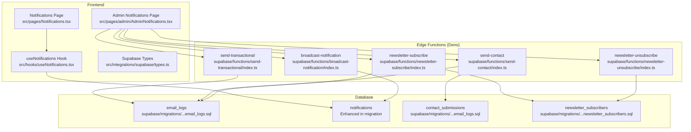
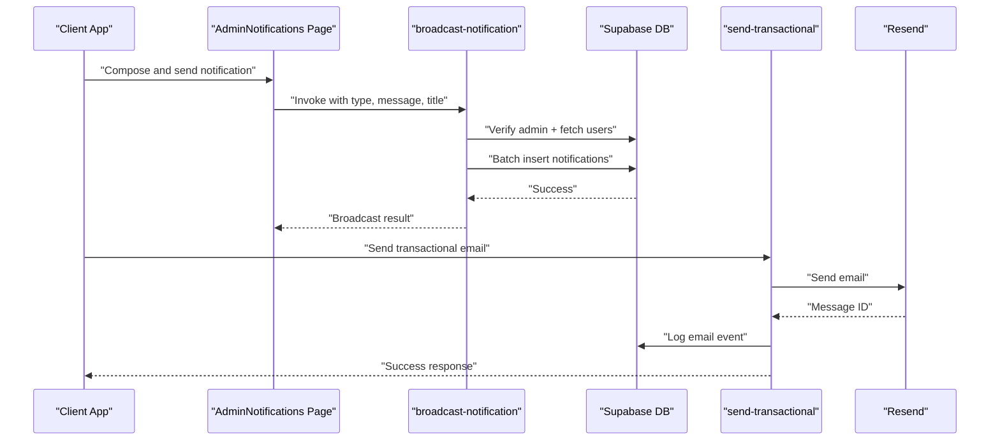
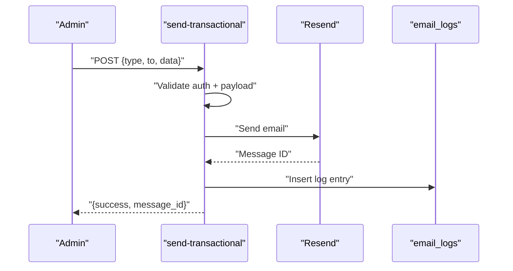
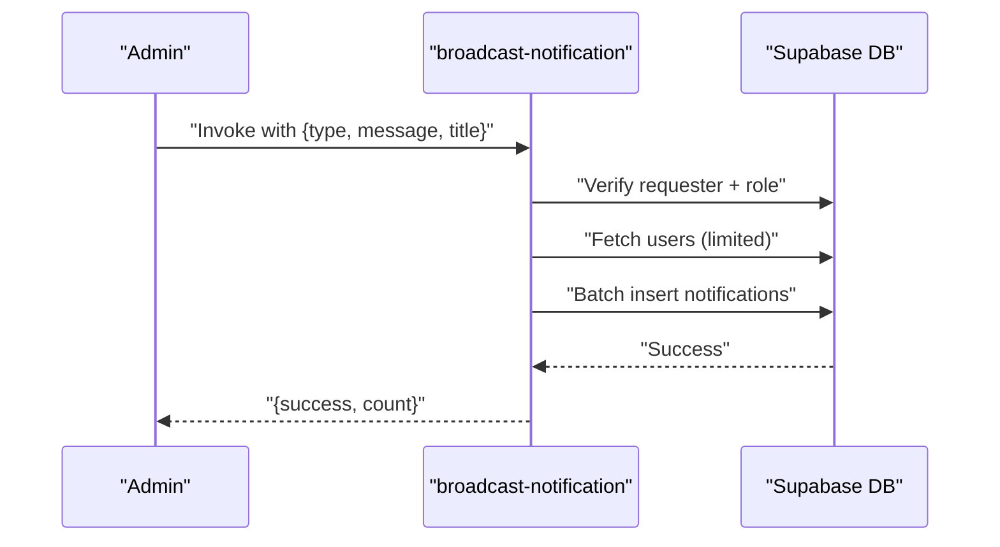
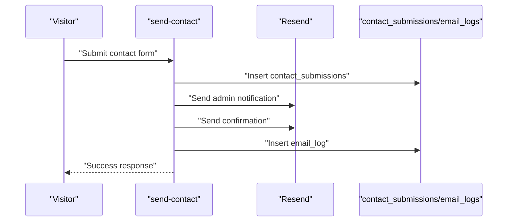
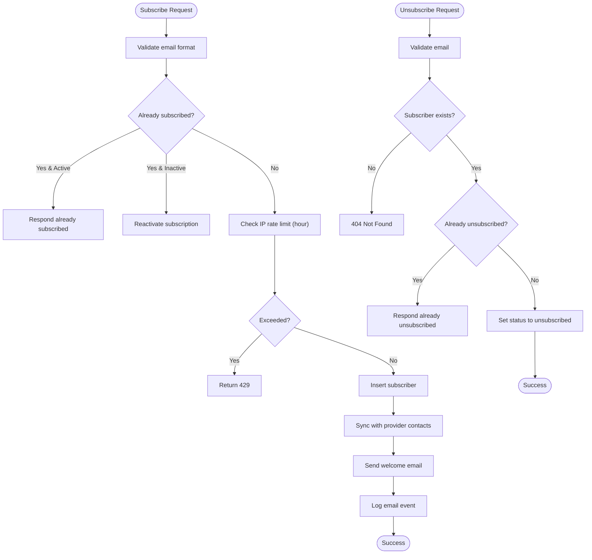
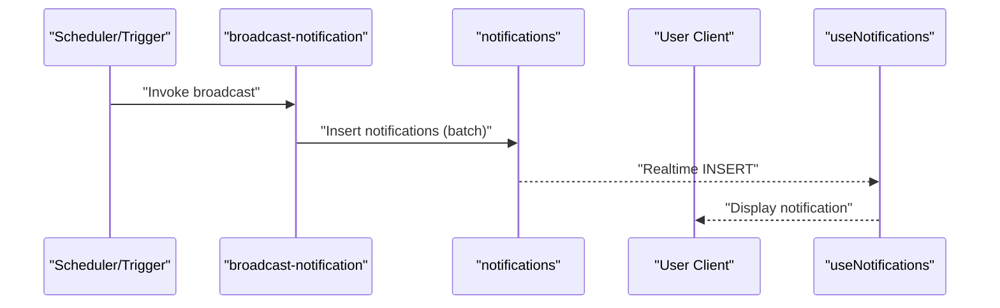
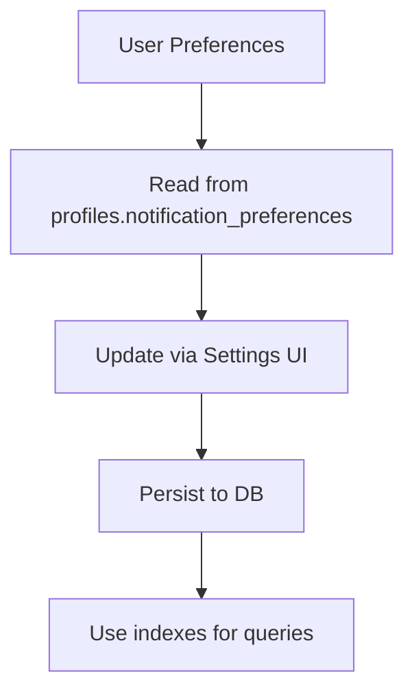
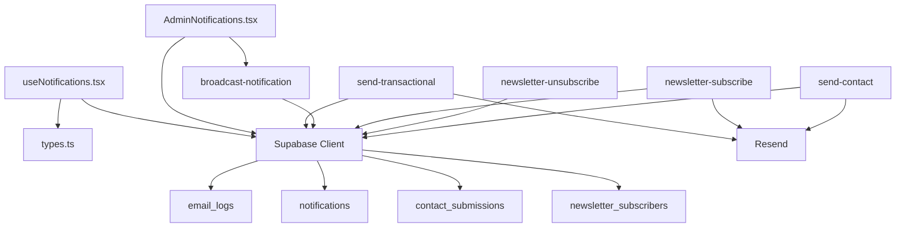

# Notification & Email System

<cite>
**Referenced Files in This Document**
- [README.md](file://README.md)
- [send-transactional/index.ts](file://supabase/functions/send-transactional/index.ts)
- [broadcast-notification/index.ts](file://supabase/functions/broadcast-notification/index.ts)
- [newsletter-subscribe/index.ts](file://supabase/functions/newsletter-subscribe/index.ts)
- [newsletter-unsubscribe/index.ts](file://supabase/functions/newsletter-unsubscribe/index.ts)
- [send-contact/index.ts](file://supabase/functions/send-contact/index.ts)
- [email_logs table migration](file://supabase/migrations/20251225055810_71d92a73-36d1-430e-b070-68bbf805250f.sql)
- [newsletter_subscribers table migration](file://supabase/migrations/20251215073741_24a68261-0e95-4f70-a95d-8e2917543565.sql)
- [enhanced notifications migration](file://supabase/migrations/20260127010000_enhance_notifications.sql)
- [notification preferences migration](file://supabase/migrations/20251225061135_a3487ea9-61ef-47a6-b563-17605c71c34a.sql)
- [newsletter unsubscribe fields migration](file://supabase/migrations/20260130010000_add_newsletter_unsubscribe_fields.sql)
- [newsletter security fix migration](file://supabase/migrations/20260201020000_fix_newsletter_subscribers_rls.sql)
- [useNotifications hook](file://src/hooks/useNotifications.tsx)
- [AdminNotifications page](file://src/pages/admin/AdminNotifications.tsx)
- [Notifications page](file://src/pages/Notifications.tsx)
- [Settings page](file://src/pages/Settings.tsx)
- [supabase types](file://src/integrations/supabase/types.ts)
</cite>

## Table of Contents
1. [Introduction](#introduction)
2. [Project Structure](#project-structure)
3. [Core Components](#core-components)
4. [Architecture Overview](#architecture-overview)
5. [Detailed Component Analysis](#detailed-component-analysis)
6. [Dependency Analysis](#dependency-analysis)
7. [Performance Considerations](#performance-considerations)
8. [Troubleshooting Guide](#troubleshooting-guide)
9. [Conclusion](#conclusion)

## Introduction
This document describes the notification and email delivery system powering Adorzia. It covers transactional email functions, broadcast notification system, contact form processing, and newsletter management. It also documents email template handling, delivery tracking, bounce management, notification scheduling, user preference management, and unsubscribe handling. Provider integration details, rate limiting, deliverability optimization, notification types, trigger conditions, and delivery status monitoring are explained alongside practical examples of email workflow implementation and notification queue management.

## Project Structure
The notification and email system spans three primary areas:
- Backend edge functions (Deno) for transactional emails, broadcasts, newsletter subscription/unsubscription, and contact form processing
- Supabase database schema for storing notifications, email logs, contact submissions, and newsletter subscribers
- Frontend components for displaying notifications, composing broadcasts, and managing user preferences

**Diagram sources**
- [send-transactional/index.ts](file://supabase/functions/send-transactional/index.ts#L1-L70)
- [broadcast-notification/index.ts](file://supabase/functions/broadcast-notification/index.ts#L1-L149)
- [newsletter-subscribe/index.ts](file://supabase/functions/newsletter-subscribe/index.ts#L1-L327)
- [newsletter-unsubscribe/index.ts](file://supabase/functions/newsletter-unsubscribe/index.ts#L1-L95)
- [send-contact/index.ts](file://supabase/functions/send-contact/index.ts#L1-L83)
- [email_logs table migration](file://supabase/migrations/20251225055810_71d92a73-36d1-430e-b070-68bbf805250f.sql#L1-L63)
- [newsletter_subscribers table migration](file://supabase/migrations/20251215073741_24a68261-0e95-4f70-a95d-8e2917543565.sql#L1-L41)
- [enhanced notifications migration](file://supabase/migrations/20260127010000_enhance_notifications.sql#L1-L11)
- [notification preferences migration](file://supabase/migrations/20251225061135_a3487ea9-61ef-47a6-b563-17605c71c34a.sql#L1-L20)

**Section sources**
- [README.md](file://README.md#L1-L74)
- [send-transactional/index.ts](file://supabase/functions/send-transactional/index.ts#L1-L70)
- [broadcast-notification/index.ts](file://supabase/functions/broadcast-notification/index.ts#L1-L149)
- [newsletter-subscribe/index.ts](file://supabase/functions/newsletter-subscribe/index.ts#L1-L327)
- [newsletter-unsubscribe/index.ts](file://supabase/functions/newsletter-unsubscribe/index.ts#L1-L95)
- [send-contact/index.ts](file://supabase/functions/send-contact/index.ts#L1-L83)
- [email_logs table migration](file://supabase/migrations/20251225055810_71d92a73-36d1-430e-b070-68bbf805250f.sql#L1-L63)
- [newsletter_subscribers table migration](file://supabase/migrations/20251215073741_24a68261-0e95-4f70-a95d-8e2917543565.sql#L1-L41)
- [enhanced notifications migration](file://supabase/migrations/20260127010000_enhance_notifications.sql#L1-L11)
- [notification preferences migration](file://supabase/migrations/20251225061135_a3487ea9-61ef-47a6-b563-17605c71c34a.sql#L1-L20)
- [newsletter unsubscribe fields migration](file://supabase/migrations/20260130010000_add_newsletter_unsubscribe_fields.sql#L1-L21)
- [newsletter security fix migration](file://supabase/migrations/20260201020000_fix_newsletter_subscribers_rls.sql#L1-L145)
- [useNotifications hook](file://src/hooks/useNotifications.tsx#L1-L158)
- [AdminNotifications page](file://src/pages/admin/AdminNotifications.tsx#L1-L328)
- [Notifications page](file://src/pages/Notifications.tsx#L1-L220)
- [Settings page](file://src/pages/Settings.tsx#L1085-L1098)
- [supabase types](file://src/integrations/supabase/types.ts#L1303-L1346)

## Core Components
- Transactional Email Function: Sends targeted emails via a provider, logs delivery, and requires service authorization.
- Broadcast Notification Function: Creates system-wide notifications for all active users with batching and admin verification.
- Newsletter Management: Handles subscription, reactivation, rate limiting, Resend contact sync, and welcome email delivery.
- Contact Form Processing: Validates submissions, stores them, sends confirmation and admin notifications, and logs email events.
- Email Tracking & Logging: Centralized logging of email events with status tracking and provider message IDs.
- Notification Delivery: Real-time delivery to users via Supabase realtime channels with read/unread state management.
- User Preferences: Per-user notification preferences stored in profiles with indexes for efficient queries.

**Section sources**
- [send-transactional/index.ts](file://supabase/functions/send-transactional/index.ts#L15-L67)
- [broadcast-notification/index.ts](file://supabase/functions/broadcast-notification/index.ts#L8-L148)
- [newsletter-subscribe/index.ts](file://supabase/functions/newsletter-subscribe/index.ts#L119-L324)
- [newsletter-unsubscribe/index.ts](file://supabase/functions/newsletter-unsubscribe/index.ts#L14-L92)
- [send-contact/index.ts](file://supabase/functions/send-contact/index.ts#L17-L79)
- [email_logs table migration](file://supabase/migrations/20251225055810_71d92a73-36d1-430e-b070-68bbf805250f.sql#L1-L63)
- [useNotifications hook](file://src/hooks/useNotifications.tsx#L8-L157)
- [notification preferences migration](file://supabase/migrations/20251225061135_a3487ea9-61ef-47a6-b563-17605c71c34a.sql#L5-L20)

## Architecture Overview
The system integrates frontend components with Supabase edge functions and database tables. Edge functions handle provider-specific operations (Resend) and enforce security policies. Real-time channels deliver notifications instantly to users. Email logs centralize tracking and enable monitoring and diagnostics.

**Diagram sources**
- [AdminNotifications page](file://src/pages/admin/AdminNotifications.tsx#L74-L131)
- [broadcast-notification/index.ts](file://supabase/functions/broadcast-notification/index.ts#L8-L148)
- [send-transactional/index.ts](file://supabase/functions/send-transactional/index.ts#L15-L67)
- [email_logs table migration](file://supabase/migrations/20251225055810_71d92a73-36d1-430e-b070-68bbf805250f.sql#L1-L14)

## Detailed Component Analysis

### Transactional Email Function
Purpose: Send one-off, user-targeted emails with provider integration and robust logging.

Key behaviors:
- Authentication: Requires Authorization header for service invocation.
- Validation: Requires type and recipient; validates presence.
- Provider Integration: Uses a dedicated API key to send via the provider.
- Logging: Inserts a record into email_logs with subdomain, type, addresses, subject, status, provider message ID, and optional metadata.

**Diagram sources**
- [send-transactional/index.ts](file://supabase/functions/send-transactional/index.ts#L15-L67)
- [email_logs table migration](file://supabase/migrations/20251225055810_71d92a73-36d1-430e-b070-68bbf805250f.sql#L1-L14)

**Section sources**
- [send-transactional/index.ts](file://supabase/functions/send-transactional/index.ts#L15-L67)
- [email_logs table migration](file://supabase/migrations/20251225055810_71d92a73-36d1-430e-b070-68bbf805250f.sql#L1-L14)

### Broadcast Notification System
Purpose: Efficiently broadcast system notifications to all active users with admin verification and batching.

Key behaviors:
- Admin Verification: Validates requester via Supabase auth and checks admin/superadmin role.
- User Discovery: Fetches active users with a safe limit to prevent timeouts.
- Batching: Inserts notifications in chunks to respect payload limits.
- Metadata: Stores sender, timestamp, and broadcast flag for auditability.

**Diagram sources**
- [broadcast-notification/index.ts](file://supabase/functions/broadcast-notification/index.ts#L8-L148)
- [enhanced notifications migration](file://supabase/migrations/20260127010000_enhance_notifications.sql#L1-L11)

**Section sources**
- [broadcast-notification/index.ts](file://supabase/functions/broadcast-notification/index.ts#L8-L148)
- [enhanced notifications migration](file://supabase/migrations/20260127010000_enhance_notifications.sql#L1-L11)

### Contact Form Processing
Purpose: Process inbound contact submissions, store them, send confirmation/admin notifications, and log email events.

Key behaviors:
- Validation: Ensures all required fields are present.
- Storage: Persists submission with IP and category.
- Delivery: Sends admin notification and user confirmation via provider.
- Logging: Records email_log entry for tracking.

**Diagram sources**
- [send-contact/index.ts](file://supabase/functions/send-contact/index.ts#L17-L79)
- [email_logs table migration](file://supabase/migrations/20251225055810_71d92a73-36d1-430e-b070-68bbf805250f.sql#L16-L43)

**Section sources**
- [send-contact/index.ts](file://supabase/functions/send-contact/index.ts#L17-L79)
- [email_logs table migration](file://supabase/migrations/20251225055810_71d92a73-36d1-430e-b070-68bbf805250f.sql#L16-L43)

### Newsletter Management
Purpose: Manage newsletter subscriptions, welcome emails, rate limiting, and unsubscriptions with provider synchronization.

Key behaviors:
- Subscription:
  - Validates email format and deduplicates.
  - Applies rate limiting per IP and per email.
  - Syncs with provider contact list and updates subscriber record.
  - Sends welcome email and logs the event.
- Unsubscription:
  - Validates email format and updates status.
  - Prevents duplicate unsubscriptions.

**Diagram sources**
- [newsletter-subscribe/index.ts](file://supabase/functions/newsletter-subscribe/index.ts#L119-L324)
- [newsletter-unsubscribe/index.ts](file://supabase/functions/newsletter-unsubscribe/index.ts#L14-L92)
- [newsletter security fix migration](file://supabase/migrations/20260201020000_fix_newsletter_subscribers_rls.sql#L108-L143)

**Section sources**
- [newsletter-subscribe/index.ts](file://supabase/functions/newsletter-subscribe/index.ts#L119-L324)
- [newsletter-unsubscribe/index.ts](file://supabase/functions/newsletter-unsubscribe/index.ts#L14-L92)
- [newsletter security fix migration](file://supabase/migrations/20260201020000_fix_newsletter_subscribers_rls.sql#L1-L145)

### Email Template Handling
- Transactional Emails: The transactional function constructs a basic HTML payload; templates are intended to be managed via the provider interface.
- Newsletter Welcome: The subscription function builds a complete HTML welcome email with branding and unsubscribe link.
- Contact Confirmations: The contact function composes admin and user messages dynamically from form data.

Note: The admin UI indicates future integration for direct template editing within the provider.

**Section sources**
- [send-transactional/index.ts](file://supabase/functions/send-transactional/index.ts#L46-L54)
- [newsletter-subscribe/index.ts](file://supabase/functions/newsletter-subscribe/index.ts#L21-L117)
- [send-contact/index.ts](file://supabase/functions/send-contact/index.ts#L51-L66)
- [AdminNotifications page](file://src/pages/admin/AdminNotifications.tsx#L304-L318)

### Delivery Tracking and Bounce Management
- Tracking: email_logs captures subdomain, type, addresses, subject, status, provider message ID, error messages, and metadata.
- Status Monitoring: Status values include pending, sent, failed, bounced; use these to monitor delivery health.
- Bounce Handling: While bounce webhooks are not implemented in the current code, email_logs enables manual triage and reattempts.

Recommendations:
- Integrate provider webhooks to update email_logs status to bounced.
- Implement retry logic for failed messages based on status.
- Use metadata to correlate with internal records for resolution.

**Section sources**
- [email_logs table migration](file://supabase/migrations/20251225055810_71d92a73-36d1-430e-b070-68bbf805250f.sql#L1-L14)

### Notification Scheduling and Queue Management
- Broadcast Scheduling: Use the broadcast-notification function to schedule system-wide notifications; it supports batching and admin verification.
- Real-time Delivery: The useNotifications hook subscribes to real-time events for immediate delivery to users.
- Queue Management: Notifications are persisted to the notifications table; batching during broadcast ensures scalability.

**Diagram sources**
- [broadcast-notification/index.ts](file://supabase/functions/broadcast-notification/index.ts#L113-L128)
- [useNotifications hook](file://src/hooks/useNotifications.tsx#L45-L88)

**Section sources**
- [broadcast-notification/index.ts](file://supabase/functions/broadcast-notification/index.ts#L113-L128)
- [useNotifications hook](file://src/hooks/useNotifications.tsx#L45-L88)

### User Preference Management
- Preferences: Stored in profiles.notification_preferences with defaults enabling email, push, and category-specific notifications.
- Indexes: Dedicated indexes optimize queries for unread counts and filtering.
- Settings UI: The Settings page exposes toggles for notification categories.

**Diagram sources**
- [notification preferences migration](file://supabase/migrations/20251225061135_a3487ea9-61ef-47a6-b563-17605c71c34a.sql#L5-L20)
- [Settings page](file://src/pages/Settings.tsx#L1085-L1098)

**Section sources**
- [notification preferences migration](file://supabase/migrations/20251225061135_a3487ea9-61ef-47a6-b563-17605c71c34a.sql#L5-L20)
- [Settings page](file://src/pages/Settings.tsx#L1085-L1098)

### Unsubscribe Handling
- Newsletter Unsubscribe: Validates email, checks existence, prevents duplicates, and updates status with timestamp.
- Provider Sync: Future enhancement can integrate provider unsubscribe APIs to maintain consistency.

**Section sources**
- [newsletter-unsubscribe/index.ts](file://supabase/functions/newsletter-unsubscribe/index.ts#L14-L92)
- [newsletter unsubscribe fields migration](file://supabase/migrations/20260130010000_add_newsletter_unsubscribe_fields.sql#L1-L21)

### Email Provider Integration, Rate Limiting, and Deliverability
- Provider Integration: Functions use provider SDKs to send emails and log results.
- Rate Limiting:
  - Newsletter subscription: IP-based limit (e.g., 3 per hour) and email-based limit (e.g., 1 per minute) enforced via database functions.
  - Contact form: Uses IP for submission tracking.
- Deliverability:
  - Sender domains and IPs should be configured with the provider.
  - Use consistent from addresses and include unsubscribe links in newsletters.
  - Monitor email_logs for failures and adjust content to reduce spam triggers.

**Section sources**
- [newsletter security fix migration](file://supabase/migrations/20260201020000_fix_newsletter_subscribers_rls.sql#L108-L143)
- [newsletter-subscribe/index.ts](file://supabase/functions/newsletter-subscribe/index.ts#L178-L192)
- [send-contact/index.ts](file://supabase/functions/send-contact/index.ts#L41-L41)

### Notification Types, Trigger Conditions, and Status Monitoring
- Notification Types: Defined by the notifications table enum; commonly used types include announcement, alert, achievement, system, and category-specific types.
- Triggers:
  - Broadcast: Admin action invoking the broadcast-notification function.
  - Transactional: System events invoking send-transactional.
  - Contact: Form submissions invoking send-contact.
- Status Monitoring: email_logs tracks sent/failure; use filters to monitor delivery health.

**Section sources**
- [AdminNotifications page](file://src/pages/admin/AdminNotifications.tsx#L191-L197)
- [enhanced notifications migration](file://supabase/migrations/20260127010000_enhance_notifications.sql#L1-L11)
- [email_logs table migration](file://supabase/migrations/20251225055810_71d92a73-36d1-430e-b070-68bbf805250f.sql#L1-L14)

## Dependency Analysis
The system exhibits clear separation of concerns:
- Frontend depends on Supabase client libraries and hooks for real-time notifications.
- Edge functions depend on Supabase client and provider SDKs.
- Database tables provide persistence and security via row-level security policies.

**Diagram sources**
- [useNotifications hook](file://src/hooks/useNotifications.tsx#L1-L158)
- [AdminNotifications page](file://src/pages/admin/AdminNotifications.tsx#L1-L328)
- [send-transactional/index.ts](file://supabase/functions/send-transactional/index.ts#L1-L70)
- [broadcast-notification/index.ts](file://supabase/functions/broadcast-notification/index.ts#L1-L149)
- [newsletter-subscribe/index.ts](file://supabase/functions/newsletter-subscribe/index.ts#L1-L327)
- [newsletter-unsubscribe/index.ts](file://supabase/functions/newsletter-unsubscribe/index.ts#L1-L95)
- [send-contact/index.ts](file://supabase/functions/send-contact/index.ts#L1-L83)
- [email_logs table migration](file://supabase/migrations/20251225055810_71d92a73-36d1-430e-b070-68bbf805250f.sql#L1-L63)

**Section sources**
- [useNotifications hook](file://src/hooks/useNotifications.tsx#L1-L158)
- [AdminNotifications page](file://src/pages/admin/AdminNotifications.tsx#L1-L328)
- [send-transactional/index.ts](file://supabase/functions/send-transactional/index.ts#L1-L70)
- [broadcast-notification/index.ts](file://supabase/functions/broadcast-notification/index.ts#L1-L149)
- [newsletter-subscribe/index.ts](file://supabase/functions/newsletter-subscribe/index.ts#L1-L327)
- [newsletter-unsubscribe/index.ts](file://supabase/functions/newsletter-unsubscribe/index.ts#L1-L95)
- [send-contact/index.ts](file://supabase/functions/send-contact/index.ts#L1-L83)
- [email_logs table migration](file://supabase/migrations/20251225055810_71d92a73-36d1-430e-b070-68bbf805250f.sql#L1-L63)

## Performance Considerations
- Batching: Broadcast notifications use chunked inserts to avoid payload limits.
- Indexes: Strategic indexes on notifications and email_logs improve query performance.
- Real-time: Real-time channels minimize polling overhead for immediate delivery.
- Rate Limits: Database-level rate-limiting functions prevent abuse and protect throughput.
- Provider Throttling: Respect provider quotas and implement exponential backoff for retries.

[No sources needed since this section provides general guidance]

## Troubleshooting Guide
Common issues and resolutions:
- Missing Authorization Header: Transactional function returns 401; ensure service credentials are included.
- Validation Failures: Ensure required fields (type, to, message) are present; functions return 400 on invalid input.
- Rate Limit Exceeded: Newsletter subscription returns 429 when thresholds are hit; clients should retry after delay.
- Email Delivery Failures: Check email_logs for error_message and resend_id; investigate provider-side issues.
- Real-time Not Updating: Verify useNotifications hook subscription and network connectivity.

**Section sources**
- [send-transactional/index.ts](file://supabase/functions/send-transactional/index.ts#L31-L44)
- [broadcast-notification/index.ts](file://supabase/functions/broadcast-notification/index.ts#L64-L70)
- [newsletter-subscribe/index.ts](file://supabase/functions/newsletter-subscribe/index.ts#L186-L192)
- [email_logs table migration](file://supabase/migrations/20251225055810_71d92a73-36d1-430e-b070-68bbf805250f.sql#L1-L14)
- [useNotifications hook](file://src/hooks/useNotifications.tsx#L45-L88)

## Conclusion
The notification and email system combines edge functions, database persistence, and real-time delivery to provide a scalable and observable platform. With structured logging, rate limiting, and user preference management, it supports transactional emails, broadcasts, contact processing, and newsletter operations. Extending provider webhook integration and template management will further enhance reliability and flexibility.