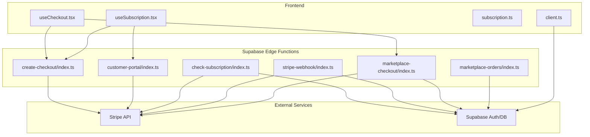
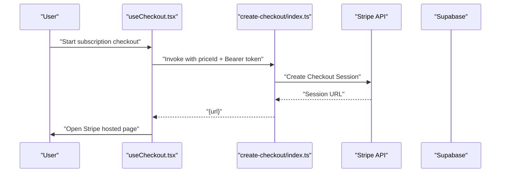
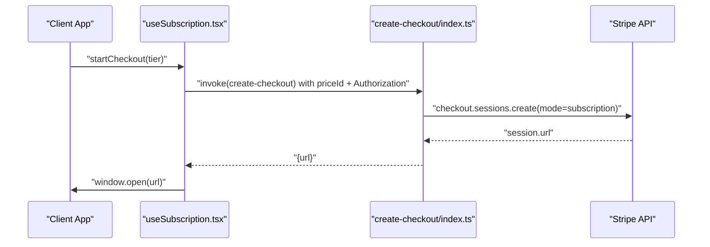
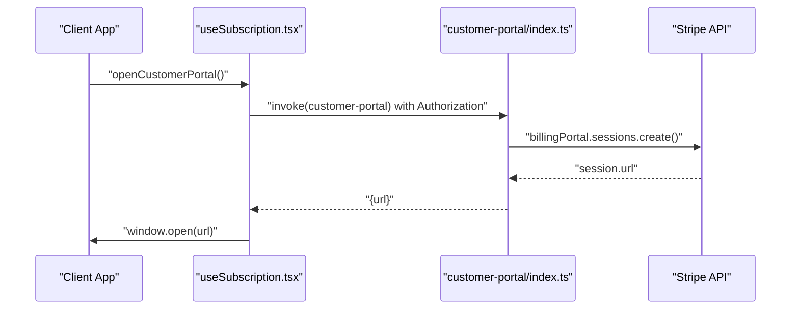
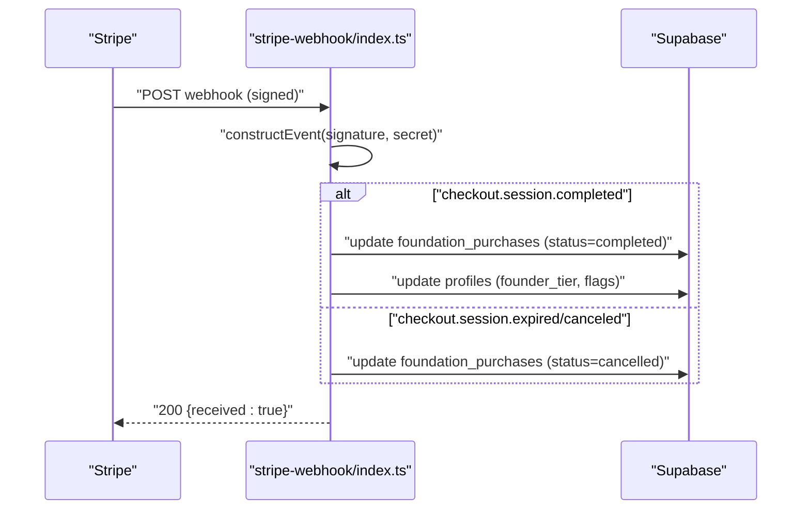
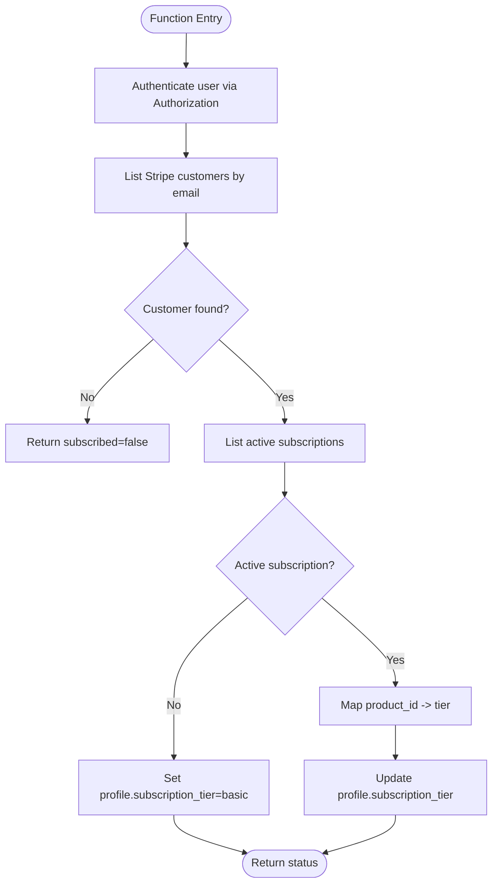
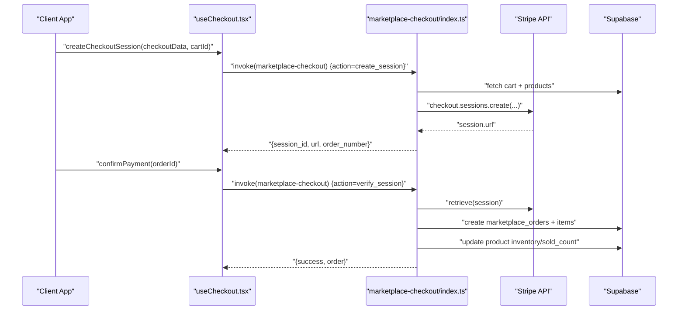
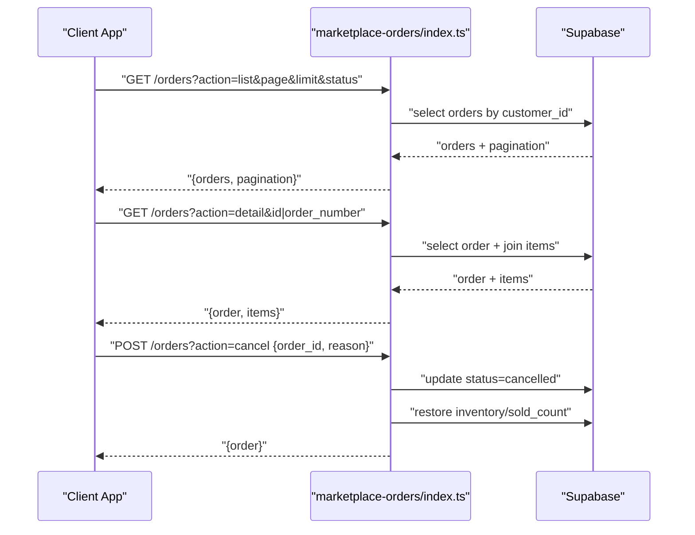
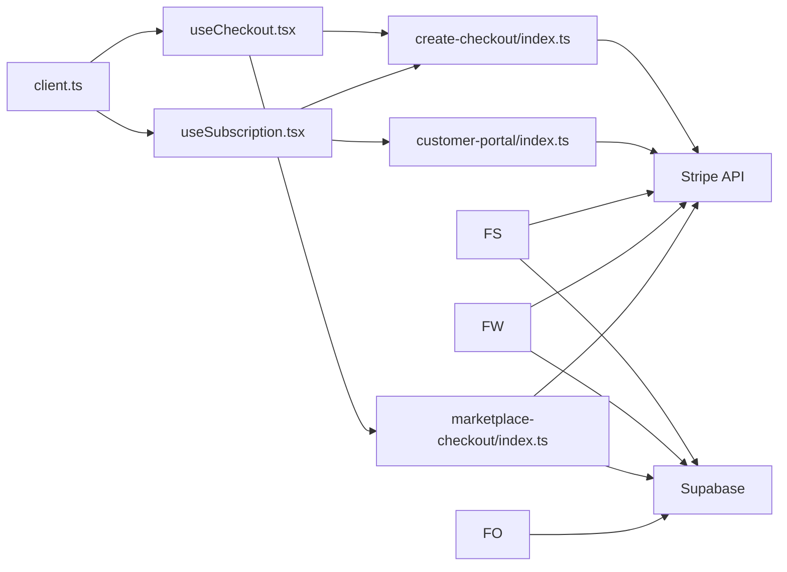

# Payment Processing Integration

<cite>
**Referenced Files in This Document**
- [create-checkout/index.ts](file://supabase/functions/create-checkout/index.ts)
- [customer-portal/index.ts](file://supabase/functions/customer-portal/index.ts)
- [stripe-webhook/index.ts](file://supabase/functions/stripe-webhook/index.ts)
- [check-subscription/index.ts](file://supabase/functions/check-subscription/index.ts)
- [marketplace-checkout/index.ts](file://supabase/functions/marketplace-checkout/index.ts)
- [marketplace-orders/index.ts](file://supabase/functions/marketplace-orders/index.ts)
- [useCheckout.tsx](file://src/hooks/useCheckout.tsx)
- [useSubscription.tsx](file://src/hooks/useSubscription.tsx)
- [subscription.ts](file://src/lib/subscription.ts)
- [client.ts](file://src/integrations/supabase/client.ts)
</cite>

## Table of Contents
1. [Introduction](#introduction)
2. [Project Structure](#project-structure)
3. [Core Components](#core-components)
4. [Architecture Overview](#architecture-overview)
5. [Detailed Component Analysis](#detailed-component-analysis)
6. [Dependency Analysis](#dependency-analysis)
7. [Performance Considerations](#performance-considerations)
8. [Troubleshooting Guide](#troubleshooting-guide)
9. [Conclusion](#conclusion)
10. [Appendices](#appendices)

## Introduction
This document describes the Stripe payment processing integration for the platform. It covers:
- Checkout creation endpoints for subscriptions and marketplace purchases
- Customer portal management for subscription account maintenance
- Webhook handling for payment events and reconciliation
- Subscription status management and tier mapping
- Billing cycle automation and payment failure handling
- Security considerations, error handling, and retry strategies
- Practical examples for implementing checkout flows, subscription updates, and customer portal integration

## Project Structure
The payment integration spans Supabase Edge Functions (backend) and React hooks (frontend):
- Backend functions:
  - create-checkout: Creates Stripe Checkout sessions for subscription tiers
  - customer-portal: Generates Stripe Billing Portal sessions for managing subscriptions
  - stripe-webhook: Verifies and processes Stripe webhook events
  - check-subscription: Checks a user’s active subscription and updates profile tier
  - marketplace-checkout: Handles marketplace purchase sessions and order creation
  - marketplace-orders: Manages customer order history and cancellations
- Frontend hooks:
  - useCheckout: Manages marketplace checkout lifecycle
  - useSubscription: Orchestrates subscription checkout and portal access
  - subscription.ts: Defines tier configurations and feature gating
  - client.ts: Supabase client configuration for frontend

**Diagram sources**
- [create-checkout/index.ts](file://supabase/functions/create-checkout/index.ts#L1-L85)
- [customer-portal/index.ts](file://supabase/functions/customer-portal/index.ts#L1-L74)
- [stripe-webhook/index.ts](file://supabase/functions/stripe-webhook/index.ts#L1-L160)
- [check-subscription/index.ts](file://supabase/functions/check-subscription/index.ts#L1-L140)
- [marketplace-checkout/index.ts](file://supabase/functions/marketplace-checkout/index.ts#L1-L318)
- [marketplace-orders/index.ts](file://supabase/functions/marketplace-orders/index.ts#L1-L229)
- [useCheckout.tsx](file://src/hooks/useCheckout.tsx#L1-L188)
- [useSubscription.tsx](file://src/hooks/useSubscription.tsx#L1-L153)
- [subscription.ts](file://src/lib/subscription.ts#L1-L151)
- [client.ts](file://src/integrations/supabase/client.ts#L1-L17)

**Section sources**
- [create-checkout/index.ts](file://supabase/functions/create-checkout/index.ts#L1-L85)
- [customer-portal/index.ts](file://supabase/functions/customer-portal/index.ts#L1-L74)
- [stripe-webhook/index.ts](file://supabase/functions/stripe-webhook/index.ts#L1-L160)
- [check-subscription/index.ts](file://supabase/functions/check-subscription/index.ts#L1-L140)
- [marketplace-checkout/index.ts](file://supabase/functions/marketplace-checkout/index.ts#L1-L318)
- [marketplace-orders/index.ts](file://supabase/functions/marketplace-orders/index.ts#L1-L229)
- [useCheckout.tsx](file://src/hooks/useCheckout.tsx#L1-L188)
- [useSubscription.tsx](file://src/hooks/useSubscription.tsx#L1-L153)
- [subscription.ts](file://src/lib/subscription.ts#L1-L151)
- [client.ts](file://src/integrations/supabase/client.ts#L1-L17)

## Core Components
- create-checkout: Creates Stripe Checkout sessions for subscription purchases, authenticates via Bearer token, and returns a redirect URL.
- customer-portal: Generates a Stripe Billing Portal session for managing subscriptions.
- stripe-webhook: Verifies webhook signatures, processes checkout completion/cancellation, and reconciles records.
- check-subscription: Determines active subscription status, extracts tier/product info, and updates user profile.
- marketplace-checkout: Builds Stripe sessions for marketplace purchases, calculates shipping, and creates orders after payment.
- marketplace-orders: Lists, retrieves, and cancels orders for authenticated users.

**Section sources**
- [create-checkout/index.ts](file://supabase/functions/create-checkout/index.ts#L1-L85)
- [customer-portal/index.ts](file://supabase/functions/customer-portal/index.ts#L1-L74)
- [stripe-webhook/index.ts](file://supabase/functions/stripe-webhook/index.ts#L1-L160)
- [check-subscription/index.ts](file://supabase/functions/check-subscription/index.ts#L1-L140)
- [marketplace-checkout/index.ts](file://supabase/functions/marketplace-checkout/index.ts#L1-L318)
- [marketplace-orders/index.ts](file://supabase/functions/marketplace-orders/index.ts#L1-L229)

## Architecture Overview
The system integrates frontend hooks with Supabase Edge Functions and Stripe:
- Frontend triggers Supabase Edge Functions using Supabase JS client
- Functions authenticate users, interact with Stripe APIs, and mutate Supabase data
- Stripe webhooks notify backend of payment events for reconciliation

**Diagram sources**
- [useCheckout.tsx](file://src/hooks/useCheckout.tsx#L47-L70)
- [create-checkout/index.ts](file://supabase/functions/create-checkout/index.ts#L53-L75)

**Section sources**
- [useCheckout.tsx](file://src/hooks/useCheckout.tsx#L1-L188)
- [create-checkout/index.ts](file://supabase/functions/create-checkout/index.ts#L1-L85)

## Detailed Component Analysis

### Subscription Checkout Flow
- Frontend:
  - useSubscription.startCheckout selects tier, invokes create-checkout with priceId, and opens returned URL
- Backend:
  - create-checkout validates Bearer token, finds or prepares Stripe customer, creates subscription session, and returns URL

**Diagram sources**
- [useSubscription.tsx](file://src/hooks/useSubscription.tsx#L47-L70)
- [create-checkout/index.ts](file://supabase/functions/create-checkout/index.ts#L53-L75)

**Section sources**
- [useSubscription.tsx](file://src/hooks/useSubscription.tsx#L47-L70)
- [create-checkout/index.ts](file://supabase/functions/create-checkout/index.ts#L14-L85)

### Customer Portal Management
- Frontend:
  - useSubscription.openCustomerPortal invokes customer-portal with Authorization header
- Backend:
  - customer-portal authenticates user, locates Stripe customer, and creates Billing Portal session

**Diagram sources**
- [useSubscription.tsx](file://src/hooks/useSubscription.tsx#L72-L89)
- [customer-portal/index.ts](file://supabase/functions/customer-portal/index.ts#L54-L57)

**Section sources**
- [useSubscription.tsx](file://src/hooks/useSubscription.tsx#L72-L89)
- [customer-portal/index.ts](file://supabase/functions/customer-portal/index.ts#L1-L74)

### Webhook Handling and Reconciliation
- Frontend:
  - No direct involvement; handled server-side
- Backend:
  - stripe-webhook verifies signature, switches on event type, updates foundation purchases and profiles, and responds with acknowledgment

**Diagram sources**
- [stripe-webhook/index.ts](file://supabase/functions/stripe-webhook/index.ts#L29-L152)

**Section sources**
- [stripe-webhook/index.ts](file://supabase/functions/stripe-webhook/index.ts#L1-L160)

### Subscription Status and Tier Mapping
- Frontend:
  - useSubscription.refreshSubscription is temporarily disabled to avoid errors; always resolves to basic tier
- Backend:
  - check-subscription lists active subscriptions for the customer, maps product IDs to tiers, and updates profile.subscription_tier

**Diagram sources**
- [check-subscription/index.ts](file://supabase/functions/check-subscription/index.ts#L57-L120)

**Section sources**
- [useSubscription.tsx](file://src/hooks/useSubscription.tsx#L29-L45)
- [check-subscription/index.ts](file://supabase/functions/check-subscription/index.ts#L1-L140)

### Marketplace Checkout and Order Creation
- Frontend:
  - useCheckout orchestrates create and confirm actions against marketplace-checkout
- Backend:
  - marketplace-checkout validates cart, builds line items, applies shipping rules, creates Stripe session, and later verifies and converts to orders

**Diagram sources**
- [useCheckout.tsx](file://src/hooks/useCheckout.tsx#L38-L119)
- [marketplace-checkout/index.ts](file://supabase/functions/marketplace-checkout/index.ts#L52-L174)
- [marketplace-checkout/index.ts](file://supabase/functions/marketplace-checkout/index.ts#L176-L308)

**Section sources**
- [useCheckout.tsx](file://src/hooks/useCheckout.tsx#L1-L188)
- [marketplace-checkout/index.ts](file://supabase/functions/marketplace-checkout/index.ts#L1-L318)

### Order Management (Listing, Details, Cancellations)
- Frontend:
  - useCheckout supports promo code application/removal via marketplace-cart function
- Backend:
  - marketplace-orders handles listing, retrieving details, and cancellations with inventory restoration

**Diagram sources**
- [marketplace-orders/index.ts](file://supabase/functions/marketplace-orders/index.ts#L63-L98)
- [marketplace-orders/index.ts](file://supabase/functions/marketplace-orders/index.ts#L100-L148)
- [marketplace-orders/index.ts](file://supabase/functions/marketplace-orders/index.ts#L150-L213)

**Section sources**
- [marketplace-orders/index.ts](file://supabase/functions/marketplace-orders/index.ts#L1-L229)
- [useCheckout.tsx](file://src/hooks/useCheckout.tsx#L121-L178)

## Dependency Analysis
- Frontend depends on Supabase client for function invocation and authentication
- Backend functions depend on Stripe SDK and Supabase client
- Webhook processing requires service role keys to bypass RLS and update sensitive tables

**Diagram sources**
- [client.ts](file://src/integrations/supabase/client.ts#L11-L17)
- [useCheckout.tsx](file://src/hooks/useCheckout.tsx#L1-L188)
- [useSubscription.tsx](file://src/hooks/useSubscription.tsx#L1-L153)
- [create-checkout/index.ts](file://supabase/functions/create-checkout/index.ts#L1-L85)
- [customer-portal/index.ts](file://supabase/functions/customer-portal/index.ts#L1-L74)
- [check-subscription/index.ts](file://supabase/functions/check-subscription/index.ts#L1-L140)
- [marketplace-checkout/index.ts](file://supabase/functions/marketplace-checkout/index.ts#L1-L318)
- [marketplace-orders/index.ts](file://supabase/functions/marketplace-orders/index.ts#L1-L229)
- [stripe-webhook/index.ts](file://supabase/functions/stripe-webhook/index.ts#L1-L160)

**Section sources**
- [client.ts](file://src/integrations/supabase/client.ts#L1-L17)
- [useCheckout.tsx](file://src/hooks/useCheckout.tsx#L1-L188)
- [useSubscription.tsx](file://src/hooks/useSubscription.tsx#L1-L153)
- [create-checkout/index.ts](file://supabase/functions/create-checkout/index.ts#L1-L85)
- [customer-portal/index.ts](file://supabase/functions/customer-portal/index.ts#L1-L74)
- [check-subscription/index.ts](file://supabase/functions/check-subscription/index.ts#L1-L140)
- [marketplace-checkout/index.ts](file://supabase/functions/marketplace-checkout/index.ts#L1-L318)
- [marketplace-orders/index.ts](file://supabase/functions/marketplace-orders/index.ts#L1-L229)
- [stripe-webhook/index.ts](file://supabase/functions/stripe-webhook/index.ts#L1-L160)

## Performance Considerations
- Minimize repeated subscription checks to reduce latency and load; current frontend disables periodic polling
- Use Stripe’s preflight OPTIONS handling to avoid extra network overhead
- Batch database writes where possible (e.g., order items insertion)
- Cache frequently accessed tier/product mappings in memory on the server if traffic increases

[No sources needed since this section provides general guidance]

## Troubleshooting Guide
Common issues and resolutions:
- Missing environment variables:
  - create-checkout and customer-portal require Stripe secret key and Supabase keys
  - stripe-webhook requires webhook secret and Supabase service role key
- Authentication failures:
  - Ensure Authorization header is present and valid; functions reject missing tokens
- Webhook signature verification failures:
  - Verify webhook secret matches Stripe dashboard configuration
- Subscription status not updating:
  - check-subscription maps product IDs to tiers; ensure product IDs match configured tiers
- Order not created after payment:
  - marketplace-checkout.verify_session requires a paid session and valid cart metadata

**Section sources**
- [create-checkout/index.ts](file://supabase/functions/create-checkout/index.ts#L23-L36)
- [customer-portal/index.ts](file://supabase/functions/customer-portal/index.ts#L22-L41)
- [stripe-webhook/index.ts](file://supabase/functions/stripe-webhook/index.ts#L14-L22)
- [check-subscription/index.ts](file://supabase/functions/check-subscription/index.ts#L28-L41)
- [marketplace-checkout/index.ts](file://supabase/functions/marketplace-checkout/index.ts#L34-L48)

## Conclusion
The integration leverages Supabase Edge Functions to securely orchestrate Stripe payments and customer account management. While subscription checks are currently disabled in the frontend to avoid errors, the backend remains robust for handling checkout, portal sessions, and webhook reconciliation. The marketplace checkout pipeline supports multi-region shipping, currency selection, and order creation with inventory adjustments.

[No sources needed since this section summarizes without analyzing specific files]

## Appendices

### API Reference Summary

- create-checkout
  - Method: POST
  - Body: priceId
  - Headers: Authorization: Bearer <token>
  - Response: { url }
  - Purpose: Create a Stripe Checkout session for subscription purchase

- customer-portal
  - Method: POST
  - Headers: Authorization: Bearer <token>
  - Response: { url }
  - Purpose: Create a Stripe Billing Portal session for managing subscriptions

- stripe-webhook
  - Method: POST
  - Headers: stripe-signature
  - Body: raw event payload
  - Response: { received: true } or error
  - Purpose: Verify and process checkout events to reconcile purchases and profiles

- check-subscription
  - Method: POST
  - Headers: Authorization: Bearer <token>
  - Response: { subscribed, product_id, price_id, subscription_end }
  - Purpose: Determine active subscription and update profile tier

- marketplace-checkout
  - Methods:
    - POST create_session: Build session with cart, shipping, and currency
    - POST verify_session: Confirm payment and create order
  - Response: { session_id, url, order_number } or { success, order }

- marketplace-orders
  - GET /orders?action=list
  - GET /orders?action=detail&id|order_number
  - POST /orders?action=cancel
  - Response: Orders list, order detail, or updated order

**Section sources**
- [create-checkout/index.ts](file://supabase/functions/create-checkout/index.ts#L14-L85)
- [customer-portal/index.ts](file://supabase/functions/customer-portal/index.ts#L14-L74)
- [stripe-webhook/index.ts](file://supabase/functions/stripe-webhook/index.ts#L9-L160)
- [check-subscription/index.ts](file://supabase/functions/check-subscription/index.ts#L14-L140)
- [marketplace-checkout/index.ts](file://supabase/functions/marketplace-checkout/index.ts#L27-L318)
- [marketplace-orders/index.ts](file://supabase/functions/marketplace-orders/index.ts#L24-L229)

### Implementation Examples

- Checkout flow (subscription)
  - Frontend: useSubscription.startCheckout(tier) → invoke create-checkout → open returned URL
  - Backend: create-checkout authenticates, finds/creates Stripe customer, creates subscription session

- Checkout flow (marketplace)
  - Frontend: useCheckout.createCheckoutSession(data, cartId) → invoke marketplace-checkout create_session
  - Frontend: useCheckout.confirmPayment(orderId) → invoke marketplace-checkout verify_session
  - Backend: marketplace-checkout builds line items, applies shipping, creates order, updates inventory

- Subscription status updates
  - Frontend: useSubscription.refreshSubscription is disabled; backend check-subscription maps product IDs to tiers and updates profile.subscription_tier

- Customer portal integration
  - Frontend: useSubscription.openCustomerPortal → invoke customer-portal → open returned URL

**Section sources**
- [useSubscription.tsx](file://src/hooks/useSubscription.tsx#L47-L89)
- [create-checkout/index.ts](file://supabase/functions/create-checkout/index.ts#L53-L75)
- [useCheckout.tsx](file://src/hooks/useCheckout.tsx#L38-L119)
- [marketplace-checkout/index.ts](file://supabase/functions/marketplace-checkout/index.ts#L52-L174)
- [marketplace-checkout/index.ts](file://supabase/functions/marketplace-checkout/index.ts#L176-L308)
- [check-subscription/index.ts](file://supabase/functions/check-subscription/index.ts#L99-L120)
- [customer-portal/index.ts](file://supabase/functions/customer-portal/index.ts#L54-L57)