# Serverless Functions Overview

<cite>
**Referenced Files in This Document**
- [supabase/functions/deno.json](file://supabase/functions/deno.json)
- [supabase/functions/import_map.json](file://supabase/functions/import_map.json)
- [supabase/functions/profile-management/deno.json](file://supabase/functions/profile-management/deno.json)
- [supabase/functions/profile-management/index.ts](file://supabase/functions/profile-management/index.ts)
- [supabase/functions/send-transactional/index.ts](file://supabase/functions/send-transactional/index.ts)
- [supabase/functions/stripe-webhook/index.ts](file://supabase/functions/stripe-webhook/index.ts)
- [supabase/functions/marketplace-orders/index.ts](file://supabase/functions/marketplace-orders/index.ts)
- [supabase/functions/broadcast-notification/index.ts](file://supabase/functions/broadcast-notification/index.ts)
- [supabase/functions/manage-admin/index.ts](file://supabase/functions/manage-admin/index.ts)
- [supabase/functions/verify-authenticity/index.ts](file://supabase/functions/verify-authenticity/index.ts)
- [supabase/functions/create-checkout/index.ts](file://supabase/functions/create-checkout/index.ts)
- [supabase/functions/customer-portal/index.ts](file://supabase/functions/customer-portal/index.ts)
- [supabase/functions/marketplace-checkout/index.ts](file://supabase/functions/marketplace-checkout/index.ts)
</cite>

## Table of Contents
1. [Introduction](#introduction)
2. [Project Structure](#project-structure)
3. [Core Components](#core-components)
4. [Architecture Overview](#architecture-overview)
5. [Detailed Component Analysis](#detailed-component-analysis)
6. [Dependency Analysis](#dependency-analysis)
7. [Performance Considerations](#performance-considerations)
8. [Troubleshooting Guide](#troubleshooting-guide)
9. [Conclusion](#conclusion)

## Introduction
This document explains the Supabase serverless function architecture powered by the Deno runtime. It covers the deployment model, execution environment, cold start optimization strategies, Deno configuration and import maps, dependency management, function lifecycle, error handling, logging, monitoring, security, rate limiting, and performance optimization. It also provides examples of function structure, parameter handling, and response formatting across multiple real-world functions.

## Project Structure
Supabase serverless functions live under the supabase/functions directory. Each function is a self-contained folder with an index.ts entrypoint and optional Deno configuration. A shared Deno configuration and import map define global settings and external module resolution.

```mermaid
graph TB
Root["supabase/functions/"]
SharedCfg["deno.json<br/>shared config"]
ImportMap["import_map.json<br/>external imports"]
FuncA["profile-management/<br/>deno.json + index.ts"]
FuncB["send-transactional/<br/>index.ts"]
FuncC["stripe-webhook/<br/>index.ts"]
FuncD["marketplace-orders/<br/>index.ts"]
FuncE["broadcast-notification/<br/>index.ts"]
FuncF["manage-admin/<br/>index.ts"]
FuncG["verify-authenticity/<br/>index.ts"]
FuncH["create-checkout/<br/>index.ts"]
FuncI["customer-portal/<br/>index.ts"]
FuncJ["marketplace-checkout/<br/>index.ts"]
Root --> SharedCfg
Root --> ImportMap
Root --> FuncA
Root --> FuncB
Root --> FuncC
Root --> FuncD
Root --> FuncE
Root --> FuncF
Root --> FuncG
Root --> FuncH
Root --> FuncI
Root --> FuncJ
```

**Diagram sources**
- [supabase/functions/deno.json](file://supabase/functions/deno.json#L1-L4)
- [supabase/functions/import_map.json](file://supabase/functions/import_map.json#L1-L7)
- [supabase/functions/profile-management/deno.json](file://supabase/functions/profile-management/deno.json#L1-L7)
- [supabase/functions/profile-management/index.ts](file://supabase/functions/profile-management/index.ts#L1-L185)
- [supabase/functions/send-transactional/index.ts](file://supabase/functions/send-transactional/index.ts#L1-L70)
- [supabase/functions/stripe-webhook/index.ts](file://supabase/functions/stripe-webhook/index.ts#L1-L160)
- [supabase/functions/marketplace-orders/index.ts](file://supabase/functions/marketplace-orders/index.ts#L1-L229)
- [supabase/functions/broadcast-notification/index.ts](file://supabase/functions/broadcast-notification/index.ts#L1-L149)
- [supabase/functions/manage-admin/index.ts](file://supabase/functions/manage-admin/index.ts#L1-L148)
- [supabase/functions/verify-authenticity/index.ts](file://supabase/functions/verify-authenticity/index.ts#L1-L274)
- [supabase/functions/create-checkout/index.ts](file://supabase/functions/create-checkout/index.ts#L1-L85)
- [supabase/functions/customer-portal/index.ts](file://supabase/functions/customer-portal/index.ts#L1-L74)
- [supabase/functions/marketplace-checkout/index.ts](file://supabase/functions/marketplace-checkout/index.ts#L1-L318)

**Section sources**
- [supabase/functions/deno.json](file://supabase/functions/deno.json#L1-L4)
- [supabase/functions/import_map.json](file://supabase/functions/import_map.json#L1-L7)
- [supabase/functions/profile-management/deno.json](file://supabase/functions/profile-management/deno.json#L1-L7)

## Core Components
- Deno runtime and HTTP server: Functions use Deno’s standard http/server serve to bind handlers to requests.
- Supabase client: All functions initialize a Supabase client using environment variables for URLs and keys.
- CORS handling: Functions consistently handle preflight OPTIONS and set Access-Control-Allow-* headers.
- Request parsing: Functions parse JSON bodies and extract query parameters or headers.
- Error handling: Centralized try/catch blocks return structured JSON errors with appropriate HTTP status codes.
- Logging: Functions log meaningful events and errors to aid debugging and monitoring.
- External dependencies: Functions import Stripe, Resend, and Supabase clients via ESM imports defined in import_map.json.

Examples of function structure and patterns are visible across multiple functions, including:
- Profile management: validates inputs, checks admin privileges, updates database records, and logs actions.
- Transactional emails: authenticates via Authorization header, sends emails via Resend, and logs outcomes.
- Stripe webhooks: verifies signatures, updates purchase records, and adjusts user profiles.
- Marketplace orders: authenticates users, lists orders, fetches details, and cancels orders with inventory adjustments.
- Broadcast notifications: verifies admin roles and inserts notifications in batches.
- Admin management: enforces role-based access and supports self-service updates and admin creation.
- Authenticity verification: public verification and certificate retrieval endpoints.
- Checkout and customer portal: creates Stripe sessions and portal sessions.
- Marketplace checkout: constructs sessions, calculates shipping, and creates orders.

**Section sources**
- [supabase/functions/profile-management/index.ts](file://supabase/functions/profile-management/index.ts#L1-L185)
- [supabase/functions/send-transactional/index.ts](file://supabase/functions/send-transactional/index.ts#L1-L70)
- [supabase/functions/stripe-webhook/index.ts](file://supabase/functions/stripe-webhook/index.ts#L1-L160)
- [supabase/functions/marketplace-orders/index.ts](file://supabase/functions/marketplace-orders/index.ts#L1-L229)
- [supabase/functions/broadcast-notification/index.ts](file://supabase/functions/broadcast-notification/index.ts#L1-L149)
- [supabase/functions/manage-admin/index.ts](file://supabase/functions/manage-admin/index.ts#L1-L148)
- [supabase/functions/verify-authenticity/index.ts](file://supabase/functions/verify-authenticity/index.ts#L1-L274)
- [supabase/functions/create-checkout/index.ts](file://supabase/functions/create-checkout/index.ts#L1-L85)
- [supabase/functions/customer-portal/index.ts](file://supabase/functions/customer-portal/index.ts#L1-L74)
- [supabase/functions/marketplace-checkout/index.ts](file://supabase/functions/marketplace-checkout/index.ts#L1-L318)

## Architecture Overview
The serverless functions follow a consistent pattern:
- Entry point: Each function exports a handler that accepts a Request and returns a Response.
- Authentication: Many functions validate Authorization headers and use Supabase auth to verify tokens.
- Supabase integration: Functions use the Supabase client to query and mutate data, often bypassing Row Level Security (RLS) by using a service role key.
- External services: Functions integrate with Stripe for payments and Resend for transactional emails.
- CORS: Functions uniformly handle preflight requests and set CORS headers.

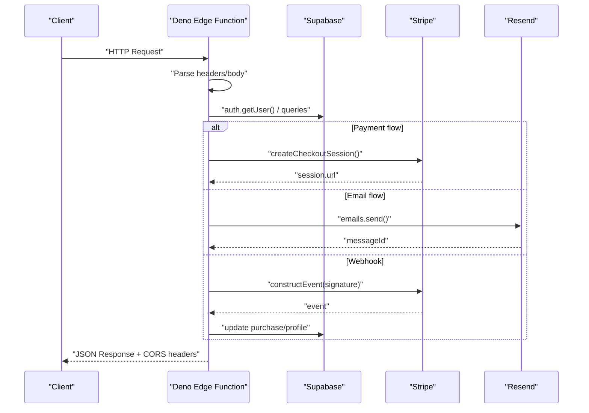

**Diagram sources**
- [supabase/functions/create-checkout/index.ts](file://supabase/functions/create-checkout/index.ts#L1-L85)
- [supabase/functions/customer-portal/index.ts](file://supabase/functions/customer-portal/index.ts#L1-L74)
- [supabase/functions/send-transactional/index.ts](file://supabase/functions/send-transactional/index.ts#L1-L70)
- [supabase/functions/stripe-webhook/index.ts](file://supabase/functions/stripe-webhook/index.ts#L1-L160)

## Detailed Component Analysis

### Deno Configuration and Import Maps
- Global Deno configuration: Defines the import map path for resolving external modules.
- Import map: Declares ESM imports for @supabase/supabase-js and stripe.
- Per-function Deno config: Some functions include a local deno.json to enable nodeModulesDir or set library metadata.

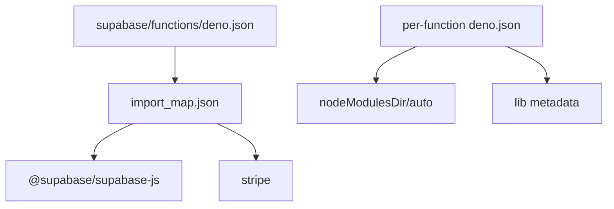

**Diagram sources**
- [supabase/functions/deno.json](file://supabase/functions/deno.json#L1-L4)
- [supabase/functions/import_map.json](file://supabase/functions/import_map.json#L1-L7)
- [supabase/functions/profile-management/deno.json](file://supabase/functions/profile-management/deno.json#L1-L7)

**Section sources**
- [supabase/functions/deno.json](file://supabase/functions/deno.json#L1-L4)
- [supabase/functions/import_map.json](file://supabase/functions/import_map.json#L1-L7)
- [supabase/functions/profile-management/deno.json](file://supabase/functions/profile-management/deno.json#L1-L7)

### Function Lifecycle and Execution Environment
- Cold start: First request to a function triggers cold start. To minimize cold start impact, keep functions small, avoid heavy initialization, and reuse connections where possible.
- Request handling: Functions receive a Request object, parse headers and body, and return a Response with appropriate status and headers.
- CORS preflight: Functions return 204/200 for OPTIONS with CORS headers.
- Environment variables: Functions read SUPABASE_URL, SUPABASE_SERVICE_ROLE_KEY, SUPABASE_ANON_KEY, and provider-specific keys (e.g., STRIPE_SECRET_KEY, RESEND_API_KEY_*).

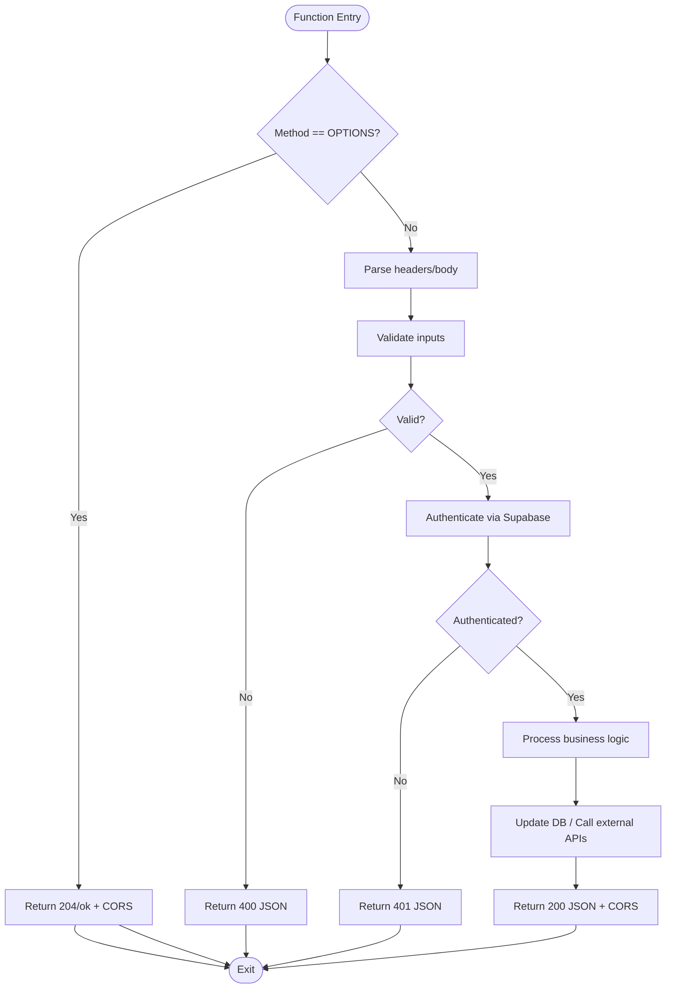

**Diagram sources**
- [supabase/functions/marketplace-orders/index.ts](file://supabase/functions/marketplace-orders/index.ts#L24-L228)
- [supabase/functions/broadcast-notification/index.ts](file://supabase/functions/broadcast-notification/index.ts#L8-L148)

**Section sources**
- [supabase/functions/marketplace-orders/index.ts](file://supabase/functions/marketplace-orders/index.ts#L24-L228)
- [supabase/functions/broadcast-notification/index.ts](file://supabase/functions/broadcast-notification/index.ts#L8-L148)

### Error Handling and Logging
- Try/catch blocks wrap request processing to ensure structured error responses.
- Console logging is used for operational visibility; include contextual details for debugging.
- Functions return JSON bodies with an error field and appropriate HTTP status codes.

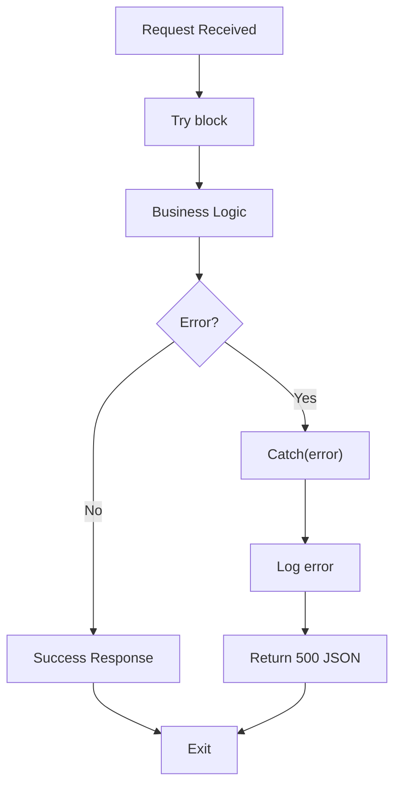

**Diagram sources**
- [supabase/functions/stripe-webhook/index.ts](file://supabase/functions/stripe-webhook/index.ts#L53-L159)
- [supabase/functions/marketplace-orders/index.ts](file://supabase/functions/marketplace-orders/index.ts#L220-L227)

**Section sources**
- [supabase/functions/stripe-webhook/index.ts](file://supabase/functions/stripe-webhook/index.ts#L53-L159)
- [supabase/functions/marketplace-orders/index.ts](file://supabase/functions/marketplace-orders/index.ts#L220-L227)

### Parameter Handling and Response Formatting
- Query parameters: Functions use URLSearchParams to extract filters and pagination options.
- JSON body: Functions await req.json() to parse request payloads.
- Response helpers: Several functions define helper functions to ensure consistent CORS headers and JSON formatting.

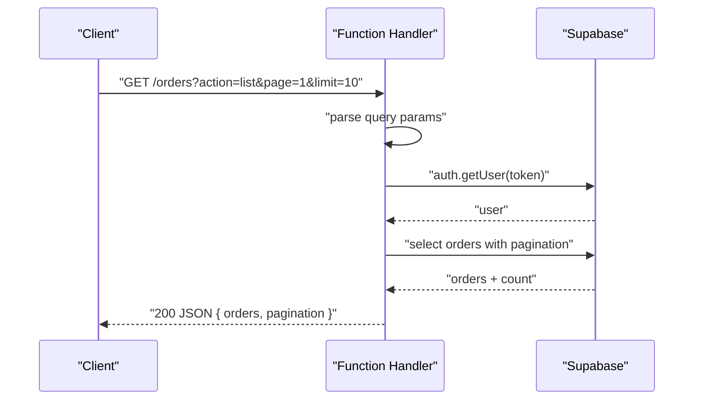

**Diagram sources**
- [supabase/functions/marketplace-orders/index.ts](file://supabase/functions/marketplace-orders/index.ts#L58-L98)

**Section sources**
- [supabase/functions/marketplace-orders/index.ts](file://supabase/functions/marketplace-orders/index.ts#L58-L98)

### Security Considerations
- Authorization: Functions require Authorization headers and validate tokens via Supabase auth.
- Role enforcement: Admin-only functions verify roles using a Supabase client initialized with a service role key.
- Secrets: Functions read sensitive keys from environment variables (e.g., SUPABASE_SERVICE_ROLE_KEY, STRIPE_SECRET_KEY, RESEND_API_KEY_*).
- CORS: Functions set Access-Control-Allow-Origin and related headers to control cross-origin access.
- Webhook security: Stripe webhooks verify signatures using endpoint secrets before processing.

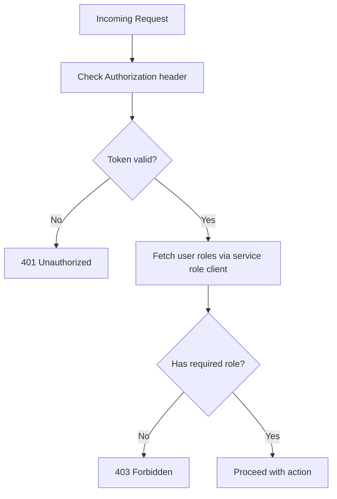

**Diagram sources**
- [supabase/functions/broadcast-notification/index.ts](file://supabase/functions/broadcast-notification/index.ts#L39-L62)
- [supabase/functions/manage-admin/index.ts](file://supabase/functions/manage-admin/index.ts#L37-L61)

**Section sources**
- [supabase/functions/broadcast-notification/index.ts](file://supabase/functions/broadcast-notification/index.ts#L39-L62)
- [supabase/functions/manage-admin/index.ts](file://supabase/functions/manage-admin/index.ts#L37-L61)
- [supabase/functions/stripe-webhook/index.ts](file://supabase/functions/stripe-webhook/index.ts#L14-L36)

### Rate Limiting and Performance Optimization
- Batch operations: Functions insert notifications in batches to avoid payload size limits and timeouts.
- Pagination: Functions implement pagination to limit result sets and reduce latency.
- Conditional logic: Functions short-circuit early when inputs are invalid to minimize unnecessary work.
- Minimal initialization: Keep imports and initialization inside the handler to reduce cold start overhead.
- Reuse Supabase client: Initialize the client once per request if needed, but prefer lightweight initialization.

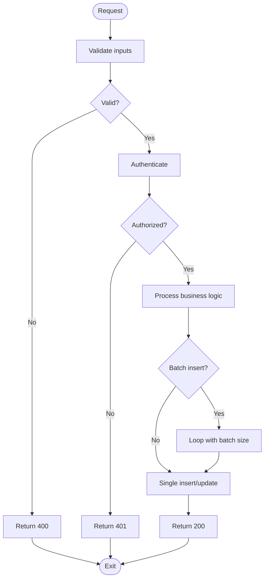

**Diagram sources**
- [supabase/functions/broadcast-notification/index.ts](file://supabase/functions/broadcast-notification/index.ts#L113-L128)
- [supabase/functions/marketplace-orders/index.ts](file://supabase/functions/marketplace-orders/index.ts#L168-L174)

**Section sources**
- [supabase/functions/broadcast-notification/index.ts](file://supabase/functions/broadcast-notification/index.ts#L113-L128)
- [supabase/functions/marketplace-orders/index.ts](file://supabase/functions/marketplace-orders/index.ts#L168-L174)

### Example Functions and Patterns

#### Profile Management
- Validates required fields and action type.
- Verifies admin privileges against the database.
- Updates profile records and logs actions.

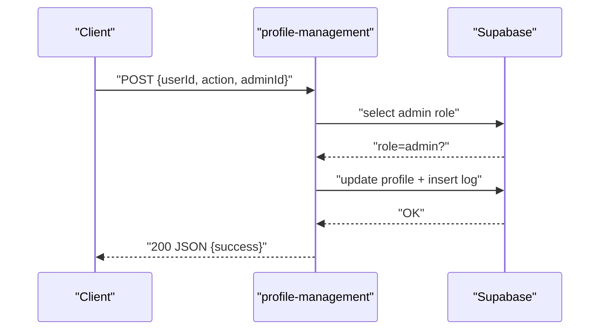

**Diagram sources**
- [supabase/functions/profile-management/index.ts](file://supabase/functions/profile-management/index.ts#L20-L170)

**Section sources**
- [supabase/functions/profile-management/index.ts](file://supabase/functions/profile-management/index.ts#L20-L170)

#### Transactional Emails
- Requires Authorization header.
- Sends email via Resend and logs metadata.

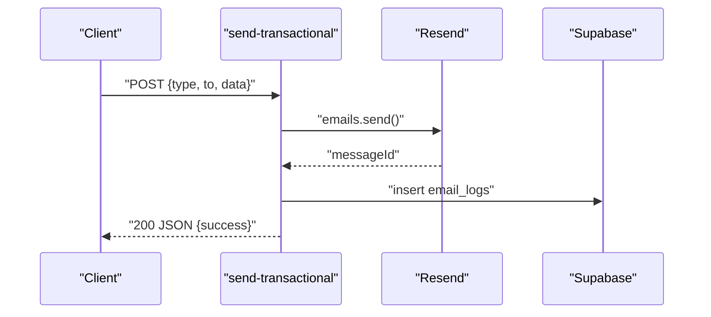

**Diagram sources**
- [supabase/functions/send-transactional/index.ts](file://supabase/functions/send-transactional/index.ts#L49-L56)

**Section sources**
- [supabase/functions/send-transactional/index.ts](file://supabase/functions/send-transactional/index.ts#L49-L56)

#### Stripe Webhooks
- Verifies webhook signature.
- Updates purchase records and user profiles.

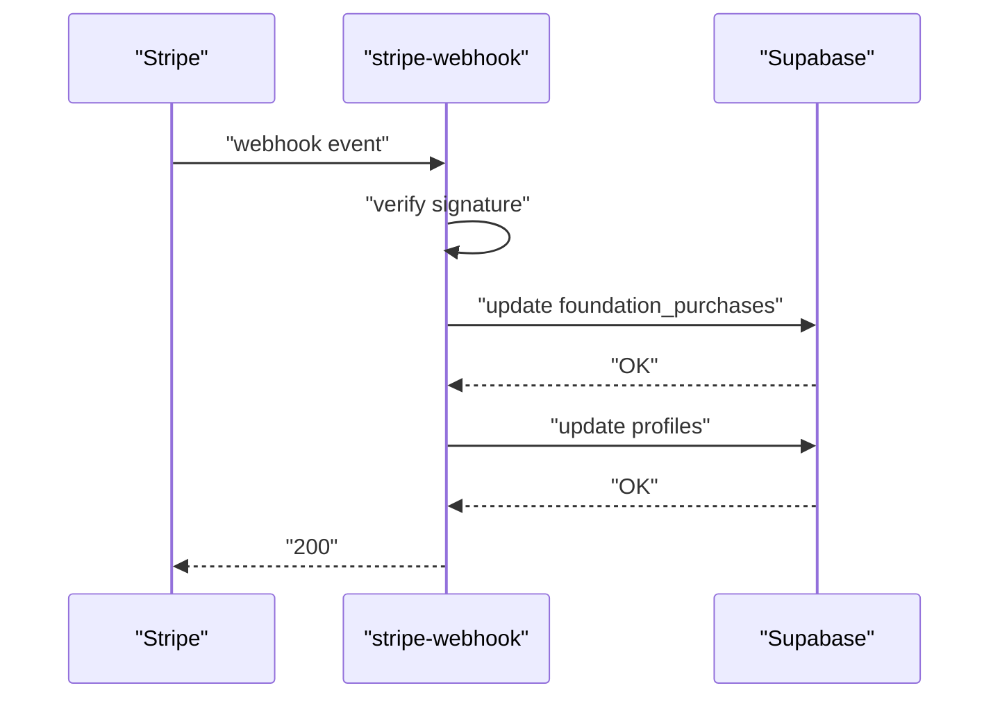

**Diagram sources**
- [supabase/functions/stripe-webhook/index.ts](file://supabase/functions/stripe-webhook/index.ts#L29-L120)

**Section sources**
- [supabase/functions/stripe-webhook/index.ts](file://supabase/functions/stripe-webhook/index.ts#L29-L120)

#### Marketplace Orders
- Authenticates user, lists orders, fetches details, and cancels orders with inventory adjustments.

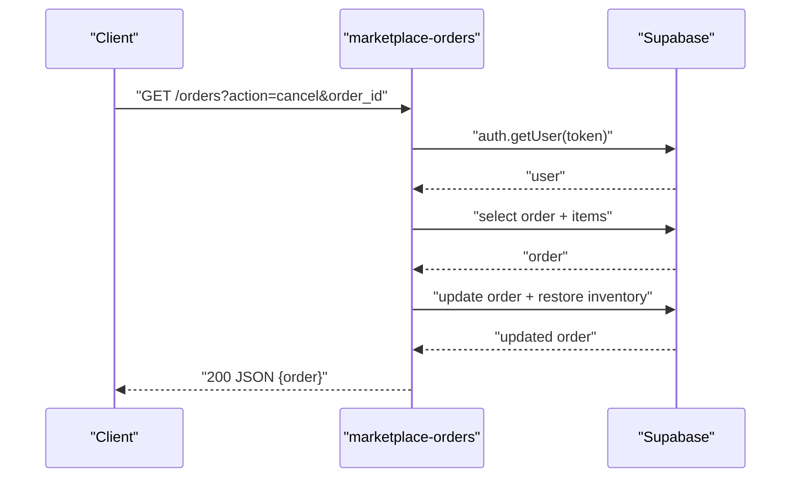

**Diagram sources**
- [supabase/functions/marketplace-orders/index.ts](file://supabase/functions/marketplace-orders/index.ts#L150-L213)

**Section sources**
- [supabase/functions/marketplace-orders/index.ts](file://supabase/functions/marketplace-orders/index.ts#L150-L213)

#### Broadcast Notifications
- Verifies admin role and broadcasts notifications in batches.

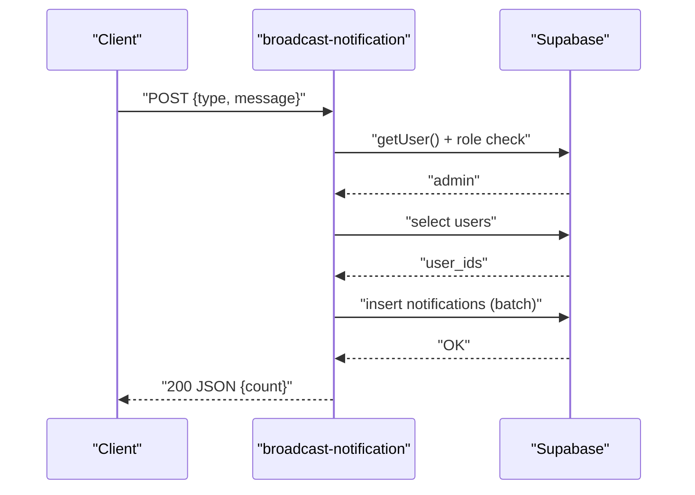

**Diagram sources**
- [supabase/functions/broadcast-notification/index.ts](file://supabase/functions/broadcast-notification/index.ts#L74-L128)

**Section sources**
- [supabase/functions/broadcast-notification/index.ts](file://supabase/functions/broadcast-notification/index.ts#L74-L128)

#### Manage Admin
- Enforces role-based access and supports self-service updates and admin creation.

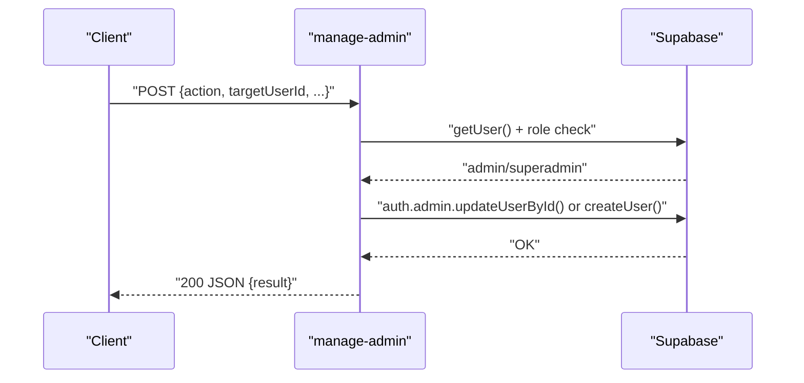

**Diagram sources**
- [supabase/functions/manage-admin/index.ts](file://supabase/functions/manage-admin/index.ts#L79-L133)

**Section sources**
- [supabase/functions/manage-admin/index.ts](file://supabase/functions/manage-admin/index.ts#L79-L133)

#### Verify Authenticity
- Public verification endpoint and certificate retrieval; admin-only generation requires Authorization.

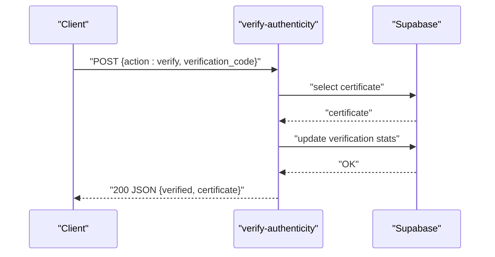

**Diagram sources**
- [supabase/functions/verify-authenticity/index.ts](file://supabase/functions/verify-authenticity/index.ts#L50-L133)

**Section sources**
- [supabase/functions/verify-authenticity/index.ts](file://supabase/functions/verify-authenticity/index.ts#L50-L133)

#### Checkout and Customer Portal
- Creates Stripe checkout sessions and billing portal sessions.

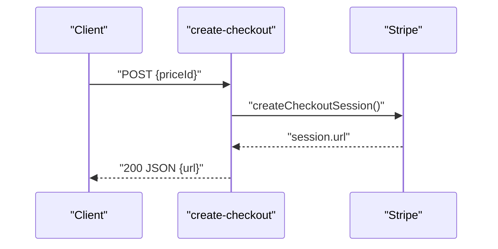

**Diagram sources**
- [supabase/functions/create-checkout/index.ts](file://supabase/functions/create-checkout/index.ts#L53-L68)

**Section sources**
- [supabase/functions/create-checkout/index.ts](file://supabase/functions/create-checkout/index.ts#L53-L68)

#### Marketplace Checkout
- Constructs sessions, calculates shipping, and creates orders.

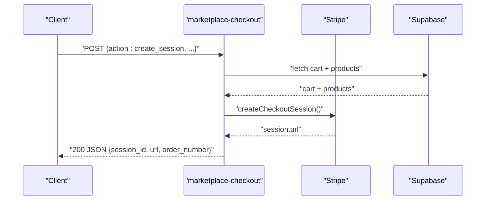

**Diagram sources**
- [supabase/functions/marketplace-checkout/index.ts](file://supabase/functions/marketplace-checkout/index.ts#L52-L173)

**Section sources**
- [supabase/functions/marketplace-checkout/index.ts](file://supabase/functions/marketplace-checkout/index.ts#L52-L173)

## Dependency Analysis
Functions depend on:
- Deno standard library for HTTP server and utilities.
- Supabase client for database and auth operations.
- Stripe for payment processing.
- Resend for transactional emails.

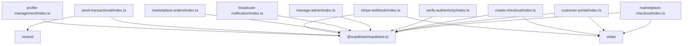

**Diagram sources**
- [supabase/functions/profile-management/index.ts](file://supabase/functions/profile-management/index.ts#L1-L6)
- [supabase/functions/send-transactional/index.ts](file://supabase/functions/send-transactional/index.ts#L1-L2)
- [supabase/functions/stripe-webhook/index.ts](file://supabase/functions/stripe-webhook/index.ts#L1-L2)
- [supabase/functions/marketplace-orders/index.ts](file://supabase/functions/marketplace-orders/index.ts#L1-L2)
- [supabase/functions/broadcast-notification/index.ts](file://supabase/functions/broadcast-notification/index.ts#L1-L1)
- [supabase/functions/manage-admin/index.ts](file://supabase/functions/manage-admin/index.ts#L1-L1)
- [supabase/functions/verify-authenticity/index.ts](file://supabase/functions/verify-authenticity/index.ts#L1-L2)
- [supabase/functions/create-checkout/index.ts](file://supabase/functions/create-checkout/index.ts#L1-L2)
- [supabase/functions/customer-portal/index.ts](file://supabase/functions/customer-portal/index.ts#L1-L2)
- [supabase/functions/marketplace-checkout/index.ts](file://supabase/functions/marketplace-checkout/index.ts#L1-L3)

**Section sources**
- [supabase/functions/profile-management/index.ts](file://supabase/functions/profile-management/index.ts#L1-L6)
- [supabase/functions/send-transactional/index.ts](file://supabase/functions/send-transactional/index.ts#L1-L2)
- [supabase/functions/stripe-webhook/index.ts](file://supabase/functions/stripe-webhook/index.ts#L1-L2)
- [supabase/functions/marketplace-orders/index.ts](file://supabase/functions/marketplace-orders/index.ts#L1-L2)
- [supabase/functions/broadcast-notification/index.ts](file://supabase/functions/broadcast-notification/index.ts#L1-L1)
- [supabase/functions/manage-admin/index.ts](file://supabase/functions/manage-admin/index.ts#L1-L1)
- [supabase/functions/verify-authenticity/index.ts](file://supabase/functions/verify-authenticity/index.ts#L1-L2)
- [supabase/functions/create-checkout/index.ts](file://supabase/functions/create-checkout/index.ts#L1-L2)
- [supabase/functions/customer-portal/index.ts](file://supabase/functions/customer-portal/index.ts#L1-L2)
- [supabase/functions/marketplace-checkout/index.ts](file://supabase/functions/marketplace-checkout/index.ts#L1-L3)

## Performance Considerations
- Cold start mitigation:
  - Keep function bundles minimal.
  - Avoid heavy synchronous initialization.
  - Reuse resources across invocations when safe.
- Network efficiency:
  - Use Supabase RPCs and joins to reduce round trips.
  - Batch database writes to minimize latency.
- Input validation:
  - Fail fast on missing or invalid parameters.
- Pagination and limits:
  - Apply reasonable limits to prevent timeouts and excessive memory usage.

[No sources needed since this section provides general guidance]

## Troubleshooting Guide
- Missing Authorization header: Functions return 401 Unauthorized; ensure clients pass a valid Bearer token.
- Invalid or expired tokens: Auth getUser fails; re-authenticate the user.
- Insufficient permissions: Role checks fail; verify user roles in the database.
- Missing environment variables: Functions log critical errors and return 500; ensure all required secrets are configured.
- Stripe signature verification failures: Webhooks reject unsigned or tampered events; verify endpoint secrets.
- Database errors: Functions log detailed errors; inspect logs for SQL errors and adjust queries accordingly.

**Section sources**
- [supabase/functions/broadcast-notification/index.ts](file://supabase/functions/broadcast-notification/index.ts#L16-L62)
- [supabase/functions/stripe-webhook/index.ts](file://supabase/functions/stripe-webhook/index.ts#L14-L36)
- [supabase/functions/marketplace-orders/index.ts](file://supabase/functions/marketplace-orders/index.ts#L220-L227)

## Conclusion
The Supabase serverless functions architecture leverages Deno for efficient, secure, and scalable edge computing. By following consistent patterns—authentication, role enforcement, CORS handling, structured error responses, and robust logging—functions deliver reliable functionality across commerce, communications, and administrative workflows. Optimizing for cold starts, batching operations, and validating inputs ensures high performance and resilience.