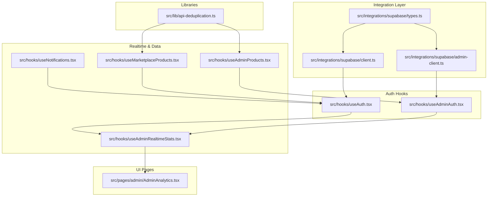
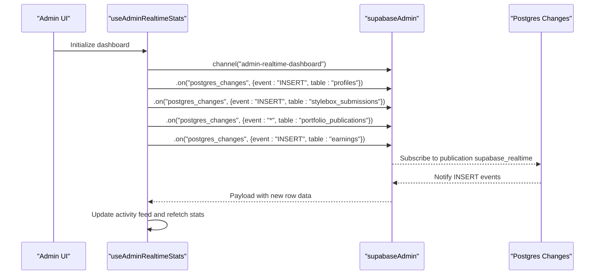
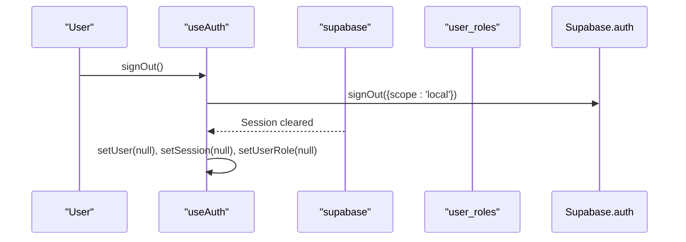
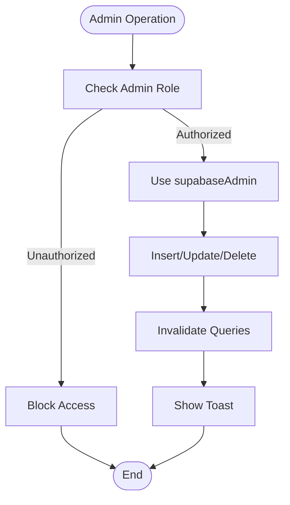
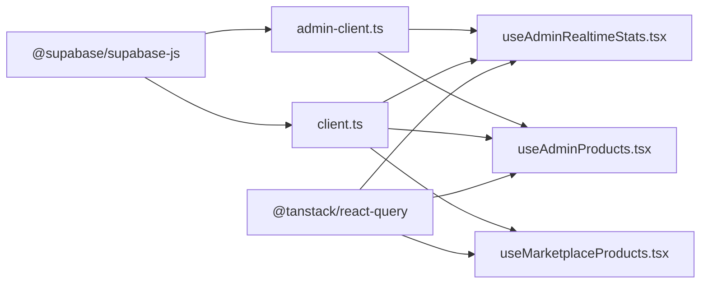

# Supabase Client Integration

<cite>
**Referenced Files in This Document**
- [client.ts](file://src/integrations/supabase/client.ts)
- [admin-client.ts](file://src/integrations/supabase/admin-client.ts)
- [types.ts](file://src/integrations/supabase/types.ts)
- [useAuth.tsx](file://src/hooks/useAuth.tsx)
- [useAdminAuth.tsx](file://src/hooks/useAdminAuth.tsx)
- [useAdminRealtimeStats.tsx](file://src/hooks/useAdminRealtimeStats.tsx)
- [AdminAnalytics.tsx](file://src/pages/admin/AdminAnalytics.tsx)
- [useAdminProducts.tsx](file://src/hooks/useAdminProducts.tsx)
- [useMarketplaceProducts.tsx](file://src/hooks/useMarketplaceProducts.tsx)
- [useNotifications.tsx](file://src/hooks/useNotifications.tsx)
- [api-deduplication.ts](file://src/lib/api-deduplication.ts)
- [package.json](file://package.json)
- [20251226092855_6a9b8fc7-9fbe-4ff3-adcc-2411fc8d8d9a.sql](file://supabase/migrations/20251226092855_6a9b8fc7-9fbe-4ff3-adcc-2411fc8d8d9a.sql)
- [20251231072327_24f6c046-2261-41d6-a0e2-a733e38addd6.sql](file://supabase/migrations/20251231072327_24f6c046-2261-41d6-a0e2-a733e38addd6.sql)
- [20260127250000_visual_similarity_engine.sql](file://supabase/migrations/20260127250000_visual_similarity_engine.sql)
- [20260127240000_product_authenticity_system.sql](file://supabase/migrations/20260127240000_product_authenticity_system.sql)
- [20260201010000_fix_user_product_interactions_rls.sql](file://supabase/migrations/20260201010000_fix_user_product_interactions_rls.sql)
- [manage-admin/index.ts](file://supabase/functions/manage-admin/index.ts)
- [profile-management/index.ts](file://supabase/functions/profile-management/index.ts)
</cite>

## Table of Contents
1. [Introduction](#introduction)
2. [Project Structure](#project-structure)
3. [Core Components](#core-components)
4. [Architecture Overview](#architecture-overview)
5. [Detailed Component Analysis](#detailed-component-analysis)
6. [Dependency Analysis](#dependency-analysis)
7. [Performance Considerations](#performance-considerations)
8. [Troubleshooting Guide](#troubleshooting-guide)
9. [Conclusion](#conclusion)

## Introduction
This document explains how the project integrates Supabase across frontend and admin contexts, covering client configuration, authentication, real-time subscriptions, row-level security (RLS), and operational best practices. It focuses on two distinct clients:
- User-facing client for studio operations
- Admin client for administrative dashboards and privileged actions

It also documents TypeScript type safety, performance optimization, and security implications of the separation between user and admin clients.

## Project Structure
The Supabase integration is organized under a dedicated integration layer with clear separation between user and admin clients, accompanied by typed database definitions and reusable hooks for authentication and real-time features.

**Diagram sources**
- [client.ts](file://src/integrations/supabase/client.ts#L1-L17)
- [admin-client.ts](file://src/integrations/supabase/admin-client.ts#L1-L28)
- [types.ts](file://src/integrations/supabase/types.ts#L1-L800)
- [useAuth.tsx](file://src/hooks/useAuth.tsx#L1-L323)
- [useAdminAuth.tsx](file://src/hooks/useAdminAuth.tsx#L1-L249)
- [useAdminRealtimeStats.tsx](file://src/hooks/useAdminRealtimeStats.tsx#L1-L209)
- [AdminAnalytics.tsx](file://src/pages/admin/AdminAnalytics.tsx#L1-L313)
- [useNotifications.tsx](file://src/hooks/useNotifications.tsx#L1-L88)
- [useAdminProducts.tsx](file://src/hooks/useAdminProducts.tsx#L1-L230)
- [useMarketplaceProducts.tsx](file://src/hooks/useMarketplaceProducts.tsx#L1-L207)
- [api-deduplication.ts](file://src/lib/api-deduplication.ts#L1-L175)

**Section sources**
- [client.ts](file://src/integrations/supabase/client.ts#L1-L17)
- [admin-client.ts](file://src/integrations/supabase/admin-client.ts#L1-L28)
- [types.ts](file://src/integrations/supabase/types.ts#L1-L800)

## Core Components
- Supabase user client: configured with local storage persistence and automatic token refresh for seamless user sessions.
- Supabase admin client: identical configuration but with isolated storage keys to prevent cross-session interference between admin and studio.
- TypeScript database types: strongly typed tables, inserts, updates, enums, and relationships for compile-time safety.
- Auth providers: user and admin contexts with role resolution and secure sign-out scoping.
- Real-time subscriptions: admin dashboard and user notifications channels with targeted filtering.
- Database operation hooks: admin CRUD for marketplace products and marketplace product queries via Edge Functions.

**Section sources**
- [client.ts](file://src/integrations/supabase/client.ts#L1-L17)
- [admin-client.ts](file://src/integrations/supabase/admin-client.ts#L1-L28)
- [types.ts](file://src/integrations/supabase/types.ts#L1-L800)
- [useAuth.tsx](file://src/hooks/useAuth.tsx#L1-L323)
- [useAdminAuth.tsx](file://src/hooks/useAdminAuth.tsx#L1-L249)
- [useAdminRealtimeStats.tsx](file://src/hooks/useAdminRealtimeStats.tsx#L1-L209)
- [useNotifications.tsx](file://src/hooks/useNotifications.tsx#L1-L88)
- [useAdminProducts.tsx](file://src/hooks/useAdminProducts.tsx#L1-L230)
- [useMarketplaceProducts.tsx](file://src/hooks/useMarketplaceProducts.tsx#L1-L207)

## Architecture Overview
The system separates concerns between user-facing and admin-facing Supabase clients. The admin client uses a custom storage adapter to isolate sessions, ensuring that signing out from the admin portal does not affect studio sessions and vice versa. Real-time subscriptions are scoped to specific channels and filters, and database operations leverage typed queries and mutations.

**Diagram sources**
- [useAdminRealtimeStats.tsx](file://src/hooks/useAdminRealtimeStats.tsx#L113-L184)
- [20251226092855_6a9b8fc7-9fbe-4ff3-adcc-2411fc8d8d9a.sql](file://supabase/migrations/20251226092855_6a9b8fc7-9fbe-4ff3-adcc-2411fc8d8d9a.sql#L1-L19)
- [20251231072327_24f6c046-2261-41d6-a0e2-a733e38addd6.sql](file://supabase/migrations/20251231072327_24f6c046-2261-41d6-a0e2-a733e38addd6.sql#L1-L3)

**Section sources**
- [useAdminRealtimeStats.tsx](file://src/hooks/useAdminRealtimeStats.tsx#L1-L209)
- [20251226092855_6a9b8fc7-9fbe-4ff3-adcc-2411fc8d8d9a.sql](file://supabase/migrations/20251226092855_6a9b8fc7-9fbe-4ff3-adcc-2411fc8d8d9a.sql#L1-L19)
- [20251231072327_24f6c046-2261-41d6-a0e2-a733e38addd6.sql](file://supabase/migrations/20251231072327_24f6c046-2261-41d6-a0e2-a733e38addd6.sql#L1-L3)

## Detailed Component Analysis

### User Client Configuration
- Creates a Supabase client with URL and publishable key from environment variables.
- Enables local storage persistence, auto token refresh, and session persistence for a smooth user experience.

Best practices:
- Keep credentials in environment variables.
- Use the user client for all studio-facing operations requiring user context.

**Section sources**
- [client.ts](file://src/integrations/supabase/client.ts#L1-L17)

### Admin Client Configuration
- Creates a separate Supabase client with a custom storage adapter that prefixes keys with "admin:".
- Isolates admin sessions from studio sessions to prevent accidental cross-sign-in.

Security implications:
- Admin sign-out scopes to admin storage only, preventing unintended logout from studio.
- Role checks occur against the admin client to ensure only authorized users enter admin portals.

**Section sources**
- [admin-client.ts](file://src/integrations/supabase/admin-client.ts#L1-L28)
- [useAdminAuth.tsx](file://src/hooks/useAdminAuth.tsx#L1-L249)

### TypeScript Type Definitions
- Comprehensive Database type with tables, views, enums, and relationships.
- Strong typing for rows, inserts, and updates across all tables.
- Utility types for table selection and schema-aware typing.

Usage:
- Import Database type into client files and hooks to ensure type-safe queries and mutations.

**Section sources**
- [types.ts](file://src/integrations/supabase/types.ts#L1-L800)

### Authentication Mechanisms
- User auth provider:
  - Listens to Supabase auth state changes and debounces role checks.
  - Supports sign-up with profile updates and logging.
  - Supports sign-in with logging and robust error handling.
  - Scoped sign-out to prevent admin session leakage.
- Admin auth provider:
  - Role verification against user_roles with immediate invalid access handling.
  - Scoped sign-out to admin storage.
  - Logs admin login/logout events.

**Diagram sources**
- [useAuth.tsx](file://src/hooks/useAuth.tsx#L243-L265)

**Section sources**
- [useAuth.tsx](file://src/hooks/useAuth.tsx#L1-L323)
- [useAdminAuth.tsx](file://src/hooks/useAdminAuth.tsx#L1-L249)

### Real-Time Subscription Handling
- Admin dashboard:
  - Subscribes to multiple tables via a single channel.
  - Filters events and updates activity feed and stats.
- User notifications:
  - Subscribes per-user channels with filters for INSERT and UPDATE.
  - Maintains subscription lifecycle with cleanup.

Operational notes:
- Channels are named for clarity and scoped to relevant resources.
- Real-time publication is enabled for subscribed tables.

**Section sources**
- [useAdminRealtimeStats.tsx](file://src/hooks/useAdminRealtimeStats.tsx#L1-L209)
- [useNotifications.tsx](file://src/hooks/useNotifications.tsx#L1-L88)
- [20251226092855_6a9b8fc7-9fbe-4ff3-adcc-2411fc8d8d9a.sql](file://supabase/migrations/20251226092855_6a9b8fc7-9fbe-4ff3-adcc-2411fc8d8d9a.sql#L1-L19)
- [20251231072327_24f6c046-2261-41d6-a0e2-a733e38addd6.sql](file://supabase/migrations/20251231072327_24f6c046-2261-41d6-a0e2-a733e38addd6.sql#L1-L3)

### Database Operations and Row-Level Security
- Admin product management:
  - Typed CRUD hooks for marketplace products with optimistic updates and error handling.
  - Uses admin client for privileged operations.
- Marketplace product queries:
  - Uses Edge Functions for complex filtering and pagination.
- RLS enforcement:
  - Visual similarity engine tracks interactions with strict policies.
  - Product authenticity system enforces visibility and access controls.
  - User product interactions enforce valid authenticated or anonymous inserts.

**Diagram sources**
- [useAdminProducts.tsx](file://src/hooks/useAdminProducts.tsx#L87-L230)
- [20260127250000_visual_similarity_engine.sql](file://supabase/migrations/20260127250000_visual_similarity_engine.sql#L82-L114)
- [20260127240000_product_authenticity_system.sql](file://supabase/migrations/20260127240000_product_authenticity_system.sql#L98-L138)
- [20260201010000_fix_user_product_interactions_rls.sql](file://supabase/migrations/20260201010000_fix_user_product_interactions_rls.sql#L27-L128)

**Section sources**
- [useAdminProducts.tsx](file://src/hooks/useAdminProducts.tsx#L1-L230)
- [useMarketplaceProducts.tsx](file://src/hooks/useMarketplaceProducts.tsx#L1-L207)
- [20260127250000_visual_similarity_engine.sql](file://supabase/migrations/20260127250000_visual_similarity_engine.sql#L82-L114)
- [20260127240000_product_authenticity_system.sql](file://supabase/migrations/20260127240000_product_authenticity_system.sql#L98-L138)
- [20260201010000_fix_user_product_interactions_rls.sql](file://supabase/migrations/20260201010000_fix_user_product_interactions_rls.sql#L27-L128)

### Edge Functions and Admin Privileges
- Admin management function:
  - Verifies requester via user client.
  - Checks roles using admin client to bypass RLS.
  - Enforces stricter permissions for superadmins.
- Profile management function:
  - Validates inputs and performs admin actions with service role key.

Security considerations:
- Service role keys are used exclusively within Edge Functions.
- Authorization headers are forwarded to maintain caller identity.

**Section sources**
- [manage-admin/index.ts](file://supabase/functions/manage-admin/index.ts#L1-L77)
- [profile-management/index.ts](file://supabase/functions/profile-management/index.ts#L1-L37)

## Dependency Analysis
The project depends on @supabase/supabase-js and @tanstack/react-query for client operations and caching. Real-time features rely on Supabase publication configurations.

**Diagram sources**
- [package.json](file://package.json#L44-L45)
- [client.ts](file://src/integrations/supabase/client.ts#L1-L17)
- [admin-client.ts](file://src/integrations/supabase/admin-client.ts#L1-L28)
- [useAdminRealtimeStats.tsx](file://src/hooks/useAdminRealtimeStats.tsx#L1-L209)
- [useAdminProducts.tsx](file://src/hooks/useAdminProducts.tsx#L1-L230)
- [useMarketplaceProducts.tsx](file://src/hooks/useMarketplaceProducts.tsx#L1-L207)

**Section sources**
- [package.json](file://package.json#L44-L45)

## Performance Considerations
- Request deduplication: Prevents duplicate network calls and detects suspicious patterns.
- Query caching: React Query manages cache keys for admin and marketplace data.
- Debouncing and throttling utilities: Control frequency of expensive operations.
- Real-time batching: Admin dashboard aggregates multiple events into a single activity feed.

Recommendations:
- Use deduplication keys for repetitive queries.
- Configure refetch intervals thoughtfully to balance freshness and bandwidth.
- Prefer Edge Functions for complex aggregations to reduce client-side computation.

**Section sources**
- [api-deduplication.ts](file://src/lib/api-deduplication.ts#L1-L175)
- [useAdminRealtimeStats.tsx](file://src/hooks/useAdminRealtimeStats.tsx#L28-L49)
- [useMarketplaceProducts.tsx](file://src/hooks/useMarketplaceProducts.tsx#L83-L121)

## Troubleshooting Guide
Common issues and resolutions:
- Cross-session sign-out:
  - Ensure admin sign-out uses scope: 'local' to avoid studio logout.
- Role mismatch:
  - Admin portal validates roles on sign-in; unauthorized users are signed out immediately.
- Real-time not firing:
  - Confirm publication supabase_realtime includes target tables and REPLICA IDENTITY FULL for update payloads.
- Edge Function errors:
  - Verify Authorization header forwarding and service role key presence.
- API duplication warnings:
  - Investigate frequent re-fetch triggers and apply deduplication.

**Section sources**
- [useAuth.tsx](file://src/hooks/useAuth.tsx#L243-L265)
- [useAdminAuth.tsx](file://src/hooks/useAdminAuth.tsx#L79-L87)
- [20251226092855_6a9b8fc7-9fbe-4ff3-adcc-2411fc8d8d9a.sql](file://supabase/migrations/20251226092855_6a9b8fc7-9fbe-4ff3-adcc-2411fc8d8d9a.sql#L1-L19)
- [manage-admin/index.ts](file://supabase/functions/manage-admin/index.ts#L14-L43)
- [api-deduplication.ts](file://src/lib/api-deduplication.ts#L25-L45)

## Conclusion
The project implements a robust, secure, and scalable Supabase integration by separating user and admin clients, enforcing RLS across sensitive tables, leveraging real-time subscriptions for responsive dashboards, and using typed database definitions for reliability. Admin operations are protected by role checks and scoped sign-out, while user-facing features benefit from efficient caching and deduplication. Following the patterns documented here ensures consistent behavior, strong security, and maintainable code.