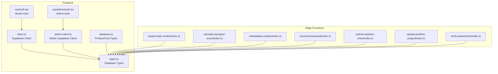
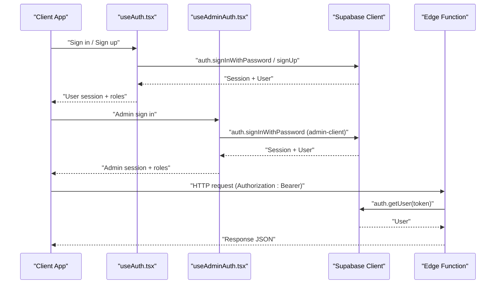
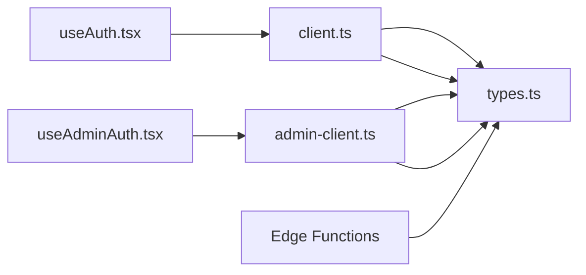
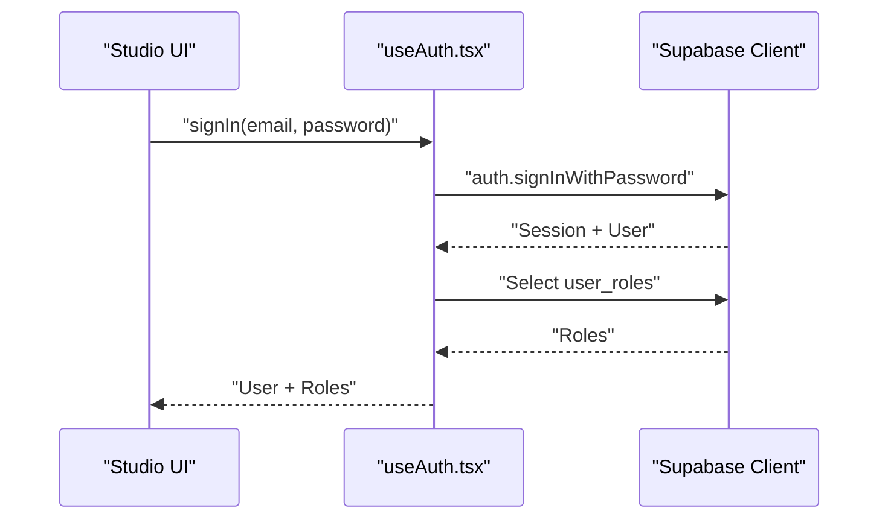
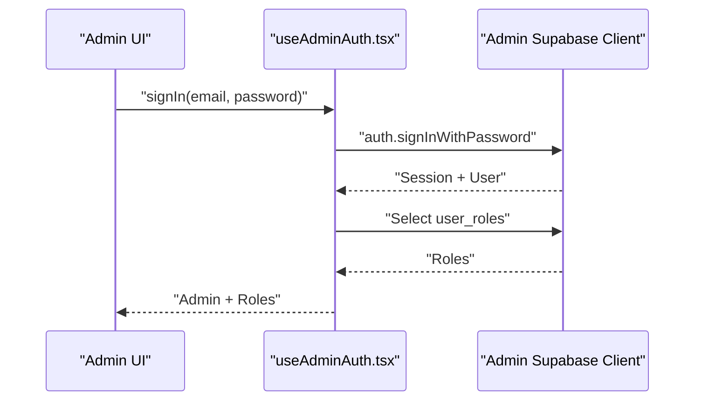
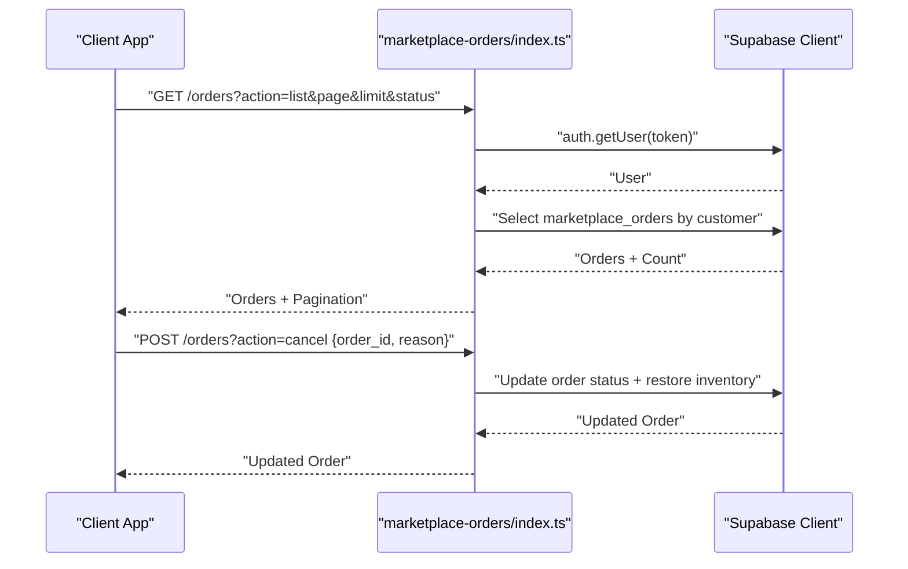
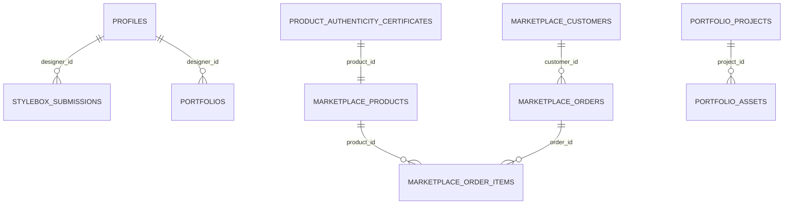

# API Reference

<cite>
**Referenced Files in This Document**
- [client.ts](file://src/integrations/supabase/client.ts)
- [admin-client.ts](file://src/integrations/supabase/admin-client.ts)
- [types.ts](file://src/integrations/supabase/types.ts)
- [useAuth.tsx](file://src/hooks/useAuth.tsx)
- [useAdminAuth.tsx](file://src/hooks/useAdminAuth.tsx)
- [database.ts](file://src/types/database.ts)
- [award-style-credits/index.ts](file://supabase/functions/award-style-credits/index.ts)
- [calculate-designer-score/index.ts](file://supabase/functions/calculate-designer-score/index.ts)
- [marketplace-orders/index.ts](file://supabase/functions/marketplace-orders/index.ts)
- [send-transactional/index.ts](file://supabase/functions/send-transactional/index.ts)
- [submit-stylebox-entry/index.ts](file://supabase/functions/submit-stylebox-entry/index.ts)
- [upload-portfolio-project/index.ts](file://supabase/functions/upload-portfolio-project/index.ts)
- [verify-authenticity/index.ts](file://supabase/functions/verify-authenticity/index.ts)
- [import_map.json](file://supabase/functions/import_map.json)
- [deno.json](file://supabase/functions/deno.json)
</cite>

## Table of Contents
1. [Introduction](#introduction)
2. [Project Structure](#project-structure)
3. [Core Components](#core-components)
4. [Architecture Overview](#architecture-overview)
5. [Detailed Component Analysis](#detailed-component-analysis)
6. [Dependency Analysis](#dependency-analysis)
7. [Performance Considerations](#performance-considerations)
8. [Troubleshooting Guide](#troubleshooting-guide)
9. [Conclusion](#conclusion)
10. [Appendices](#appendices)

## Introduction
This document provides comprehensive API documentation for the Adorzia platform. It covers:
- Supabase REST API usage via the client integrations
- Authentication methods for studio and admin portals
- Data models and request/response schemas
- Serverless function APIs exposed by Supabase Edge Functions
- Webhook and integration interfaces
- Authentication headers, rate limiting, error codes, and response formats
- Code examples for common API operations, SDK usage, and integration patterns
- API versioning, deprecation policies, and migration guidance

## Project Structure
The API surface spans three primary areas:
- Frontend client integrations for Supabase Auth and Postgres
- Supabase Edge Functions implementing serverless endpoints
- Shared type definitions and helper types for data modeling

**Diagram sources**
- [useAuth.tsx](file://src/hooks/useAuth.tsx#L1-L252)
- [useAdminAuth.tsx](file://src/hooks/useAdminAuth.tsx#L1-L216)
- [client.ts](file://src/integrations/supabase/client.ts#L1-L17)
- [admin-client.ts](file://src/integrations/supabase/admin-client.ts#L1-L28)
- [types.ts](file://src/integrations/supabase/types.ts#L1-L800)
- [database.ts](file://src/types/database.ts#L1-L29)
- [award-style-credits/index.ts](file://supabase/functions/award-style-credits/index.ts#L1-L180)
- [calculate-designer-score/index.ts](file://supabase/functions/calculate-designer-score/index.ts#L1-L223)
- [marketplace-orders/index.ts](file://supabase/functions/marketplace-orders/index.ts#L1-L226)
- [send-transactional/index.ts](file://supabase/functions/send-transactional/index.ts#L1-L70)
- [submit-stylebox-entry/index.ts](file://supabase/functions/submit-stylebox-entry/index.ts#L1-L142)
- [upload-portfolio-project/index.ts](file://supabase/functions/upload-portfolio-project/index.ts#L1-L300)
- [verify-authenticity/index.ts](file://supabase/functions/verify-authenticity/index.ts#L1-L262)

**Section sources**
- [client.ts](file://src/integrations/supabase/client.ts#L1-L17)
- [admin-client.ts](file://src/integrations/supabase/admin-client.ts#L1-L28)
- [types.ts](file://src/integrations/supabase/types.ts#L1-L800)
- [database.ts](file://src/types/database.ts#L1-L29)
- [useAuth.tsx](file://src/hooks/useAuth.tsx#L1-L252)
- [useAdminAuth.tsx](file://src/hooks/useAdminAuth.tsx#L1-L216)

## Core Components
- Supabase clients for studio and admin with isolated storage
- Auth hooks for studio and admin with role checks
- Shared TypeScript types for database tables and enums
- Helper types for product and cart domain models
- Edge Functions for marketplace, scoring, credits, notifications, and authenticity

Key capabilities:
- Studio authentication and role-based access
- Admin authentication with distinct session storage
- Real-time and RPC-like workflows via Edge Functions
- Strongly typed database models for frontend consumption

**Section sources**
- [client.ts](file://src/integrations/supabase/client.ts#L1-L17)
- [admin-client.ts](file://src/integrations/supabase/admin-client.ts#L1-L28)
- [useAuth.tsx](file://src/hooks/useAuth.tsx#L1-L252)
- [useAdminAuth.tsx](file://src/hooks/useAdminAuth.tsx#L1-L216)
- [types.ts](file://src/integrations/supabase/types.ts#L1-L800)
- [database.ts](file://src/types/database.ts#L1-L29)

## Architecture Overview
The platform integrates Supabase Auth and Postgres for data, and Edge Functions for serverless operations. Studio and Admin share the same database but use separate clients and storage keys to avoid session collisions.

**Diagram sources**
- [useAuth.tsx](file://src/hooks/useAuth.tsx#L177-L207)
- [useAdminAuth.tsx](file://src/hooks/useAdminAuth.tsx#L142-L172)
- [client.ts](file://src/integrations/supabase/client.ts#L1-L17)
- [admin-client.ts](file://src/integrations/supabase/admin-client.ts#L1-L28)
- [marketplace-orders/index.ts](file://supabase/functions/marketplace-orders/index.ts#L31-L39)
- [send-transactional/index.ts](file://supabase/functions/send-transactional/index.ts#L31-L36)

## Detailed Component Analysis

### Authentication and Authorization
- Studio Auth
  - Uses the studio client to sign in, sign up, and listen to auth state changes
  - Role resolution via a user_roles lookup
  - Logs auth actions to audit tables
- Admin Auth
  - Uses an admin client with isolated storage to prevent session overlap
  - Enforces admin roles and logs admin actions
- Clients
  - Studio client persists sessions and refreshes tokens
  - Admin client uses a prefixed storage key and a dedicated auth token key

Common operations:
- Sign in with password
- Sign up with profile metadata
- Listen to auth state changes across tabs
- Role-aware routing and UI gating

**Section sources**
- [useAuth.tsx](file://src/hooks/useAuth.tsx#L1-L252)
- [useAdminAuth.tsx](file://src/hooks/useAdminAuth.tsx#L1-L216)
- [client.ts](file://src/integrations/supabase/client.ts#L1-L17)
- [admin-client.ts](file://src/integrations/supabase/admin-client.ts#L1-L28)

### Supabase REST API Endpoints (via Edge Functions)
Edge Functions expose HTTP endpoints backed by Supabase. They enforce Authorization headers and return structured JSON responses. CORS headers are included for cross-origin support.

Endpoints overview:
- Award Style Credits
  - Purpose: Compute and award Style Credits for StyleBox submissions, optionally promote designers
  - Method: POST
  - Auth: Service role key for internal operations
  - Request body: submission_id, difficulty, designer_id, bonus_sc
  - Response: success flag, awarded_sc, new_total_sc, lifetime_sc, promoted, new_rank_order
- Calculate Designer Score
  - Purpose: Compute weighted designer scores from stylebox, portfolio, publication, and selling metrics
  - Method: POST
  - Auth: Service role key for internal operations
  - Request body: designer_id
  - Response: success flag and scores object
- Marketplace Orders
  - Purpose: List, detail, and cancel orders for authenticated customers
  - Method: GET/POST
  - Auth: Bearer token from Authorization header
  - Query params: action=list|detail|cancel; pagination for list
  - Response: orders with pagination or single order with items
- Send Transactional Email
  - Purpose: Send transactional emails via Resend
  - Method: POST
  - Auth: Bearer token from Authorization header
  - Request body: type, to, data
  - Response: success flag and message_id
- Submit StyleBox Entry
  - Purpose: Create a StyleBox submission for a logged-in designer
  - Method: POST
  - Auth: Bearer token from Authorization header
  - Request body: stylebox_id, description, submission_files[]
  - Response: success flag, submission metadata, and message
- Upload Portfolio Project
  - Purpose: Upload portfolio assets and create project entries
  - Method: POST
  - Auth: Bearer token from Authorization header
  - Request body: title, description, category, tags, images[{fileName, fileType, fileData}]
  - Response: success flag, project metadata, assets
- Verify Authenticity
  - Purpose: Public verification and certificate retrieval; admin-only generation
  - Method: POST
  - Auth: Public verify/get_certificate; generate requires Bearer token
  - Request body: action=verify|generate|get_certificate, plus parameters per action
  - Response: verification result, certificate details, or success flag

Error handling:
- 400 Bad Request for missing parameters or invalid actions
- 401 Unauthorized for missing or invalid Authorization header
- 404 Not Found for resources not found
- 500 Internal Server Error for unhandled exceptions

**Section sources**
- [award-style-credits/index.ts](file://supabase/functions/award-style-credits/index.ts#L1-L180)
- [calculate-designer-score/index.ts](file://supabase/functions/calculate-designer-score/index.ts#L1-L223)
- [marketplace-orders/index.ts](file://supabase/functions/marketplace-orders/index.ts#L1-L226)
- [send-transactional/index.ts](file://supabase/functions/send-transactional/index.ts#L1-L70)
- [submit-stylebox-entry/index.ts](file://supabase/functions/submit-stylebox-entry/index.ts#L1-L142)
- [upload-portfolio-project/index.ts](file://supabase/functions/upload-portfolio-project/index.ts#L1-L300)
- [verify-authenticity/index.ts](file://supabase/functions/verify-authenticity/index.ts#L1-L262)

### Data Models and Schemas
Shared database types define tables, rows, inserts, updates, enums, and relationships. These types are used across the frontend to strongly type queries and mutations.

Highlights:
- Tables: achievement_badges, admin_logs, articles, auth_logs, collection_submissions, contact_submissions, designer_scores, earnings, email_logs, foundation_purchases, job_applications, jobs, marketplace_carts, marketplace_categories, marketplace_collection_products, marketplace_collections, marketplace_customers, marketplace_handoffs, marketplace_orders, marketplace_order_items, marketplace_products, notifications, portfolios, portfolio_projects, portfolio_assets, product_authenticity_certificates, product_ip_linkage, profiles, ranks, stylebox_submissions, styleboxes, teams, user_roles
- Enums: job_application_status, designer_category, job_type, location_type, salary_type, job_status
- Relationships: foreign keys between related tables (e.g., earnings to marketplace_products, job_applications to jobs)

Frontend helper types:
- Product: extends marketplace_products row with embedded designer and category
- CartItem: normalized shopping cart item with product metadata

**Section sources**
- [types.ts](file://src/integrations/supabase/types.ts#L1-L800)
- [database.ts](file://src/types/database.ts#L1-L29)

### Serverless Function APIs
Edge Functions are implemented in Deno and use Supabase client libraries. They:
- Validate Authorization headers
- Use service role keys for privileged operations
- Return JSON responses with appropriate HTTP status codes
- Include CORS headers for cross-origin requests

Import and runtime configuration:
- import_map.json defines module imports for @supabase/supabase-js and Stripe
- deno.json configures the import map for functions

**Section sources**
- [import_map.json](file://supabase/functions/import_map.json#L1-L7)
- [deno.json](file://supabase/functions/deno.json#L1-L4)

### Webhook Endpoints and Integration Interfaces
- Transactional Emails: send-transactional endpoint sends emails via Resend and logs delivery status
- Marketplace Orders: supports listing, retrieving details, and canceling orders for authenticated customers
- Authenticity Verification: public verification and certificate retrieval; admin-only generation

Integration patterns:
- Use Authorization: Bearer <access_token> for protected endpoints
- For storage uploads, use the admin client with the service role key for bypassing RLS
- For analytics and audit, leverage auth_logs and admin_logs tables

**Section sources**
- [send-transactional/index.ts](file://supabase/functions/send-transactional/index.ts#L1-L70)
- [marketplace-orders/index.ts](file://supabase/functions/marketplace-orders/index.ts#L1-L226)
- [verify-authenticity/index.ts](file://supabase/functions/verify-authenticity/index.ts#L1-L262)

### Authentication Headers, Rate Limiting, and Error Codes
- Authentication headers
  - Authorization: Bearer <access_token> for protected endpoints
  - Service role keys are used internally by Edge Functions for privileged operations
- Rate limiting
  - No explicit rate limiting is enforced in the provided code; apply platform-level limits as configured
- Error codes
  - 400: Bad Request (missing parameters, invalid action)
  - 401: Unauthorized (missing or invalid token)
  - 404: Not Found (resource not found)
  - 500: Internal Server Error (unhandled exceptions)

Response formats
- JSON bodies with either success flags or error messages
- Some endpoints return paginated lists or enriched objects (e.g., orders with items)

**Section sources**
- [marketplace-orders/index.ts](file://supabase/functions/marketplace-orders/index.ts#L23-L39)
- [send-transactional/index.ts](file://supabase/functions/send-transactional/index.ts#L31-L36)
- [upload-portfolio-project/index.ts](file://supabase/functions/upload-portfolio-project/index.ts#L27-L66)
- [award-style-credits/index.ts](file://supabase/functions/award-style-credits/index.ts#L57-L64)
- [calculate-designer-score/index.ts](file://supabase/functions/calculate-designer-score/index.ts#L44-L48)

### API Versioning, Deprecation Policies, and Migration Guides
- Postgrest version
  - The database types specify a Postgrest version for compatibility
- Deprecation policy
  - Not explicitly documented in the codebase; treat endpoints as evolving
- Migration guidance
  - Prefer using the provided clients and types for schema changes
  - Keep Edge Functions aligned with database migrations
  - Monitor auth_logs and admin_logs for audit trails during transitions

**Section sources**
- [types.ts](file://src/integrations/supabase/types.ts#L10-L14)

## Dependency Analysis
The following diagram shows how frontend hooks depend on Supabase clients and types, and how Edge Functions depend on Supabase for authentication and data operations.

**Diagram sources**
- [useAuth.tsx](file://src/hooks/useAuth.tsx#L1-L252)
- [useAdminAuth.tsx](file://src/hooks/useAdminAuth.tsx#L1-L216)
- [client.ts](file://src/integrations/supabase/client.ts#L1-L17)
- [admin-client.ts](file://src/integrations/supabase/admin-client.ts#L1-L28)
- [types.ts](file://src/integrations/supabase/types.ts#L1-L800)

**Section sources**
- [useAuth.tsx](file://src/hooks/useAuth.tsx#L1-L252)
- [useAdminAuth.tsx](file://src/hooks/useAdminAuth.tsx#L1-L216)
- [client.ts](file://src/integrations/supabase/client.ts#L1-L17)
- [admin-client.ts](file://src/integrations/supabase/admin-client.ts#L1-L28)
- [types.ts](file://src/integrations/supabase/types.ts#L1-L800)

## Performance Considerations
- Use service role keys judiciously in Edge Functions for privileged operations
- Minimize payload sizes for uploads and reduce unnecessary joins in queries
- Cache frequently accessed data where feasible and supported by RLS policies
- Monitor function cold starts and optimize initialization logic

## Troubleshooting Guide
Common issues and resolutions:
- Missing Authorization header
  - Ensure Bearer token is present and valid
- Invalid token
  - Re-authenticate and refresh session as needed
- Resource not found
  - Verify identifiers (IDs, slugs) and permissions
- Upload failures
  - Confirm service role key availability and storage bucket permissions
- Audit logs
  - Check auth_logs and admin_logs for failed attempts and successful actions

**Section sources**
- [useAuth.tsx](file://src/hooks/useAuth.tsx#L177-L207)
- [useAdminAuth.tsx](file://src/hooks/useAdminAuth.tsx#L142-L172)
- [marketplace-orders/index.ts](file://supabase/functions/marketplace-orders/index.ts#L23-L39)
- [upload-portfolio-project/index.ts](file://supabase/functions/upload-portfolio-project/index.ts#L42-L49)

## Conclusion
This API reference consolidates Supabase-backed endpoints, authentication flows, and serverless functions into a coherent interface for building integrations. Use the provided clients and types for strong typing, adhere to Authorization requirements, and follow the troubleshooting steps for reliable operation.

## Appendices

### Authentication Flow (Studio)

**Diagram sources**
- [useAuth.tsx](file://src/hooks/useAuth.tsx#L177-L207)
- [client.ts](file://src/integrations/supabase/client.ts#L1-L17)

### Authentication Flow (Admin)

**Diagram sources**
- [useAdminAuth.tsx](file://src/hooks/useAdminAuth.tsx#L142-L172)
- [admin-client.ts](file://src/integrations/supabase/admin-client.ts#L1-L28)

### Marketplace Orders Workflow

**Diagram sources**
- [marketplace-orders/index.ts](file://supabase/functions/marketplace-orders/index.ts#L55-L95)
- [marketplace-orders/index.ts](file://supabase/functions/marketplace-orders/index.ts#L147-L210)

### Data Model Overview

**Diagram sources**
- [types.ts](file://src/integrations/supabase/types.ts#L336-L344)
- [types.ts](file://src/integrations/supabase/types.ts#L420-L427)
- [types.ts](file://src/integrations/supabase/types.ts#L560-L561)
- [types.ts](file://src/integrations/supabase/types.ts#L600-L608)
- [types.ts](file://src/integrations/supabase/types.ts#L750-L763)
- [types.ts](file://src/integrations/supabase/types.ts#L795-L800)
- [types.ts](file://src/integrations/supabase/types.ts#L800-L809)