# Authentication API

<cite>
**Referenced Files in This Document**
- [client.ts](file://src/integrations/supabase/client.ts)
- [admin-client.ts](file://src/integrations/supabase/admin-client.ts)
- [types.ts](file://src/integrations/supabase/types.ts)
- [useAuth.tsx](file://src/hooks/useAuth.tsx)
- [useAdminAuth.tsx](file://src/hooks/useAdminAuth.tsx)
- [ProtectedRoute.tsx](file://src/components/auth/ProtectedRoute.tsx)
- [AdminProtectedRoute.tsx](file://src/components/auth/AdminProtectedRoute.tsx)
- [App.tsx](file://src/App.tsx)
- [Auth.tsx](file://src/pages/Auth.tsx)
- [ForgotPassword.tsx](file://src/pages/ForgotPassword.tsx)
- [ResetPassword.tsx](file://src/pages/ResetPassword.tsx)
- [AdminLogin.tsx](file://src/pages/admin/AdminLogin.tsx)
- [20251209213954_141af71b-504d-4a68-a16d-b931834b1328.sql](file://supabase/migrations/20251209213954_141af71b-504d-4a68-a16d-b931834b1328.sql)
- [20260126040000_admin_auth_security.sql](file://supabase/migrations/20260126040000_admin_auth_security.sql)
- [20260126050000_bootstrap_superadmin.sql](file://supabase/migrations/20260126050000_bootstrap_superadmin.sql)
- [20260126060000_isolate_admin_auth.sql](file://supabase/migrations/20260126060000_isolate_admin_auth.sql)
</cite>

## Table of Contents
1. [Introduction](#introduction)
2. [Project Structure](#project-structure)
3. [Core Components](#core-components)
4. [Architecture Overview](#architecture-overview)
5. [Detailed Component Analysis](#detailed-component-analysis)
6. [Dependency Analysis](#dependency-analysis)
7. [Performance Considerations](#performance-considerations)
8. [Troubleshooting Guide](#troubleshooting-guide)
9. [Conclusion](#conclusion)
10. [Appendices](#appendices)

## Introduction
This document provides comprehensive authentication API documentation for the Supabase Auth integration. It covers login/logout endpoints, token management, session handling, role-based access control (RBAC), JWT token structure, refresh token mechanisms, security headers, OAuth integration, magic links, password reset, email confirmation, and admin authentication. It also documents protected route implementation, permission checking, and session synchronization across browser tabs.

## Project Structure
Authentication spans three layers:
- Supabase client configuration and typed database schema
- React hooks for session and role management
- Routing wrappers and pages implementing login, logout, and password reset flows

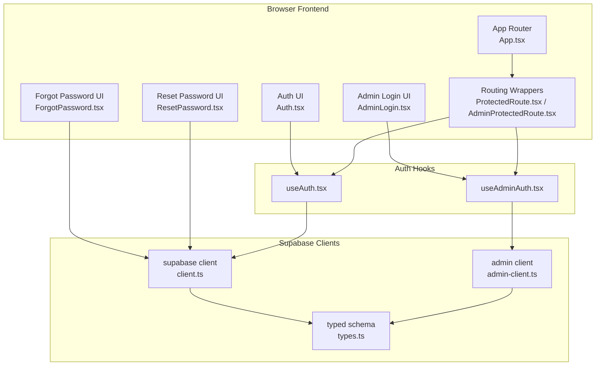

**Diagram sources**
- [client.ts](file://src/integrations/supabase/client.ts#L1-L17)
- [admin-client.ts](file://src/integrations/supabase/admin-client.ts#L1-L28)
- [types.ts](file://src/integrations/supabase/types.ts#L1-L800)
- [useAuth.tsx](file://src/hooks/useAuth.tsx#L1-L252)
- [useAdminAuth.tsx](file://src/hooks/useAdminAuth.tsx#L1-L216)
- [ProtectedRoute.tsx](file://src/components/auth/ProtectedRoute.tsx#L1-L42)
- [AdminProtectedRoute.tsx](file://src/components/auth/AdminProtectedRoute.tsx#L1-L46)
- [App.tsx](file://src/App.tsx#L112-L350)
- [Auth.tsx](file://src/pages/Auth.tsx#L1-L451)
- [ForgotPassword.tsx](file://src/pages/ForgotPassword.tsx#L1-L147)
- [ResetPassword.tsx](file://src/pages/ResetPassword.tsx#L1-L200)
- [AdminLogin.tsx](file://src/pages/admin/AdminLogin.tsx#L1-L158)

**Section sources**
- [client.ts](file://src/integrations/supabase/client.ts#L1-L17)
- [admin-client.ts](file://src/integrations/supabase/admin-client.ts#L1-L28)
- [types.ts](file://src/integrations/supabase/types.ts#L1-L800)
- [useAuth.tsx](file://src/hooks/useAuth.tsx#L1-L252)
- [useAdminAuth.tsx](file://src/hooks/useAdminAuth.tsx#L1-L216)
- [ProtectedRoute.tsx](file://src/components/auth/ProtectedRoute.tsx#L1-L42)
- [AdminProtectedRoute.tsx](file://src/components/auth/AdminProtectedRoute.tsx#L1-L46)
- [App.tsx](file://src/App.tsx#L112-L350)
- [Auth.tsx](file://src/pages/Auth.tsx#L1-L451)
- [ForgotPassword.tsx](file://src/pages/ForgotPassword.tsx#L1-L147)
- [ResetPassword.tsx](file://src/pages/ResetPassword.tsx#L1-L200)
- [AdminLogin.tsx](file://src/pages/admin/AdminLogin.tsx#L1-L158)

## Core Components
- Supabase clients
  - Public client configured with localStorage persistence and automatic token refresh.
  - Admin client with isolated storage keys and separate auth token lifecycle.
- Auth hooks
  - useAuth: manages designer/studio session, role resolution, and logging.
  - useAdminAuth: manages admin session, role resolution, and isolation.
- Routing wrappers
  - ProtectedRoute: guards studio routes by authentication and optional admin role.
  - AdminProtectedRoute: guards admin routes with role checks and optional superadmin requirement.
- Pages
  - Auth, AdminLogin, ForgotPassword, ResetPassword implement login/logout, OAuth, magic links, and password reset flows.

**Section sources**
- [client.ts](file://src/integrations/supabase/client.ts#L1-L17)
- [admin-client.ts](file://src/integrations/supabase/admin-client.ts#L1-L28)
- [useAuth.tsx](file://src/hooks/useAuth.tsx#L1-L252)
- [useAdminAuth.tsx](file://src/hooks/useAdminAuth.tsx#L1-L216)
- [ProtectedRoute.tsx](file://src/components/auth/ProtectedRoute.tsx#L1-L42)
- [AdminProtectedRoute.tsx](file://src/components/auth/AdminProtectedRoute.tsx#L1-L46)
- [Auth.tsx](file://src/pages/Auth.tsx#L1-L451)
- [ForgotPassword.tsx](file://src/pages/ForgotPassword.tsx#L1-L147)
- [ResetPassword.tsx](file://src/pages/ResetPassword.tsx#L1-L200)
- [AdminLogin.tsx](file://src/pages/admin/AdminLogin.tsx#L1-L158)

## Architecture Overview
The system integrates Supabase Auth with React via typed clients and context-based hooks. Sessions are persisted in localStorage with automatic refresh enabled. Admin and studio sessions are isolated to prevent cross-session hijacking. RBAC is enforced by resolving user roles from a dedicated table and applying policies in routing wrappers.

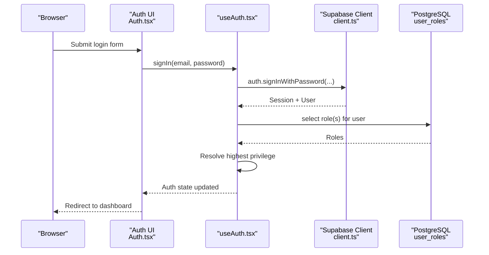

**Diagram sources**
- [Auth.tsx](file://src/pages/Auth.tsx#L84-L118)
- [useAuth.tsx](file://src/hooks/useAuth.tsx#L177-L207)
- [client.ts](file://src/integrations/supabase/client.ts#L1-L17)

**Section sources**
- [client.ts](file://src/integrations/supabase/client.ts#L1-L17)
- [useAuth.tsx](file://src/hooks/useAuth.tsx#L1-L252)
- [Auth.tsx](file://src/pages/Auth.tsx#L1-L451)

## Detailed Component Analysis

### Supabase Clients and Token Management
- Public client
  - Uses localStorage for storage, persists sessions, and auto-refreshes tokens.
  - Provides auth listeners for state changes and session retrieval.
- Admin client
  - Uses a custom storage adapter with prefixed keys to isolate admin sessions.
  - Ensures admin and studio sessions are independent and cannot interfere with each other.

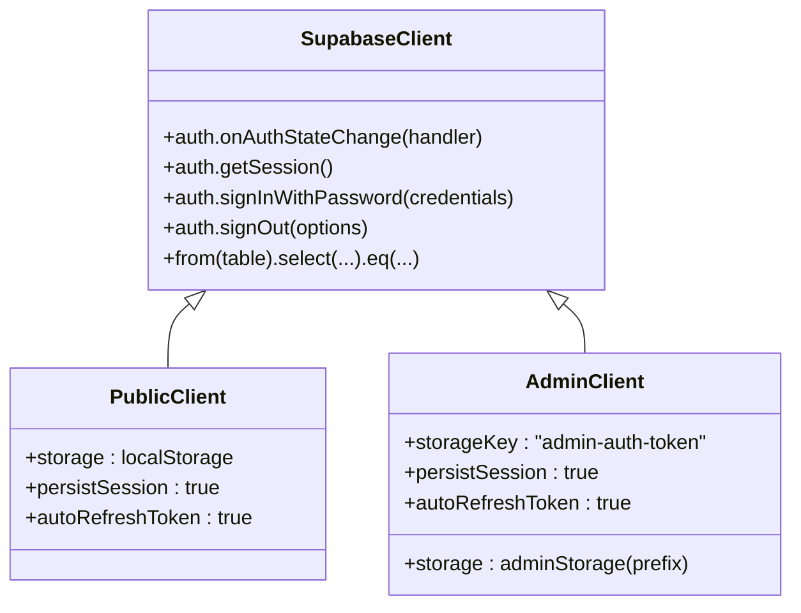

**Diagram sources**
- [client.ts](file://src/integrations/supabase/client.ts#L1-L17)
- [admin-client.ts](file://src/integrations/supabase/admin-client.ts#L1-L28)

**Section sources**
- [client.ts](file://src/integrations/supabase/client.ts#L1-L17)
- [admin-client.ts](file://src/integrations/supabase/admin-client.ts#L1-L28)

### Session Synchronization Across Browser Tabs
- Multi-tab sync listens for storage events and reacts only to explicit sign-out removal of tokens.
- Prevents flickering during token refresh by ignoring specific events.

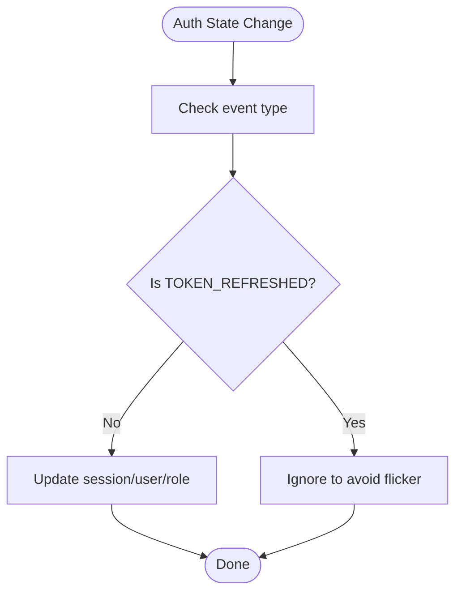

**Diagram sources**
- [useAuth.tsx](file://src/hooks/useAuth.tsx#L54-L80)
- [useAdminAuth.tsx](file://src/hooks/useAdminAuth.tsx#L53-L79)

**Section sources**
- [useAuth.tsx](file://src/hooks/useAuth.tsx#L36-L80)
- [useAdminAuth.tsx](file://src/hooks/useAdminAuth.tsx#L35-L79)

### Role-Based Access Control (RBAC)
- Role resolution
  - Highest privilege is computed from user roles stored in a dedicated table.
  - Priority: superadmin > admin > designer.
- Admin isolation
  - Admin client enforces role checks and signs out non-admin users from the admin scope.
- Protected routes
  - Studio routes require authentication; optional admin requirement.
  - Admin routes require admin role; optional superadmin requirement.

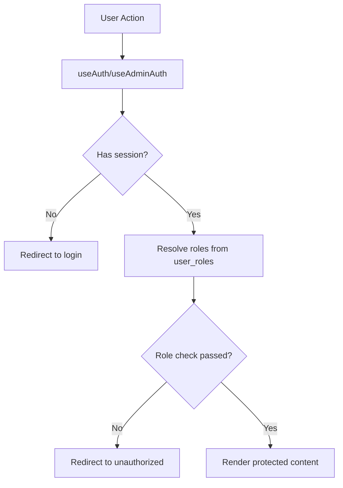

**Diagram sources**
- [useAuth.tsx](file://src/hooks/useAuth.tsx#L102-L133)
- [useAdminAuth.tsx](file://src/hooks/useAdminAuth.tsx#L101-L140)
- [ProtectedRoute.tsx](file://src/components/auth/ProtectedRoute.tsx#L11-L42)
- [AdminProtectedRoute.tsx](file://src/components/auth/AdminProtectedRoute.tsx#L11-L46)

**Section sources**
- [useAuth.tsx](file://src/hooks/useAuth.tsx#L102-L133)
- [useAdminAuth.tsx](file://src/hooks/useAdminAuth.tsx#L101-L140)
- [ProtectedRoute.tsx](file://src/components/auth/ProtectedRoute.tsx#L1-L42)
- [AdminProtectedRoute.tsx](file://src/components/auth/AdminProtectedRoute.tsx#L1-L46)

### Login and Logout Endpoints
- Designer login
  - Form submission invokes hook method that calls Supabase login.
  - On success, logs activity and redirects to dashboard.
- Admin login
  - Dedicated page and hook enforce role checks and sign out non-admin users from admin scope.
- Logout
  - Local scope sign-out prevents affecting the other portal.
  - Logs activity and clears role state.

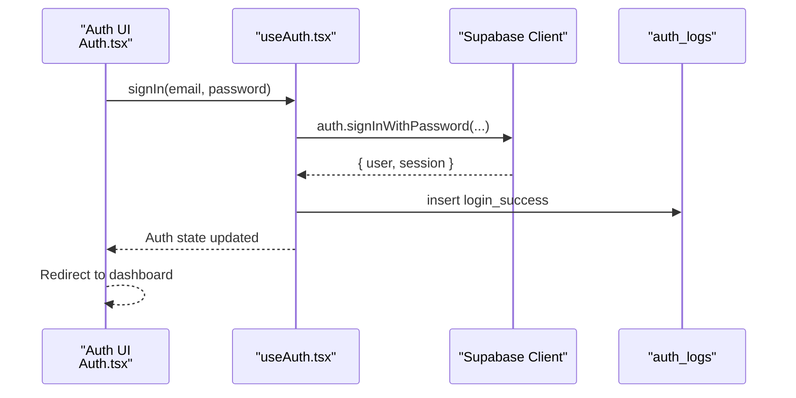

**Diagram sources**
- [Auth.tsx](file://src/pages/Auth.tsx#L84-L118)
- [useAuth.tsx](file://src/hooks/useAuth.tsx#L177-L207)
- [20251209213954_141af71b-504d-4a68-a16d-b931834b1328.sql](file://supabase/migrations/20251209213954_141af71b-504d-4a68-a16d-b931834b1328.sql#L2-L36)

**Section sources**
- [Auth.tsx](file://src/pages/Auth.tsx#L1-L451)
- [useAuth.tsx](file://src/hooks/useAuth.tsx#L177-L225)
- [20251209213954_141af71b-504d-4a68-a16d-b931834b1328.sql](file://supabase/migrations/20251209213954_141af71b-504d-4a68-a16d-b931834b1328.sql#L2-L36)

### OAuth Integration
- Google OAuth
  - Initiates OAuth with redirect to dashboard upon success.
  - Handles errors and displays user-friendly messages.

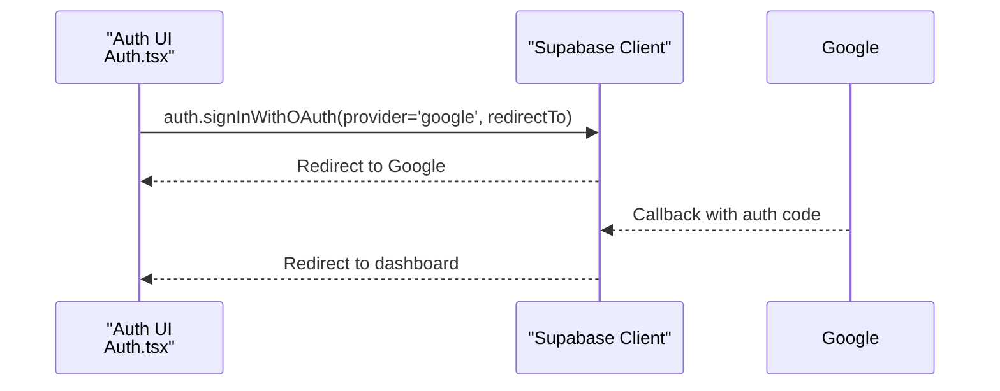

**Diagram sources**
- [Auth.tsx](file://src/pages/Auth.tsx#L50-L76)
- [client.ts](file://src/integrations/supabase/client.ts#L1-L17)

**Section sources**
- [Auth.tsx](file://src/pages/Auth.tsx#L50-L76)

### Magic Links and Password Reset
- Forgot password
  - Sends password reset email with redirect to reset page.
- Reset password
  - Validates session, updates user password, and redirects to login.

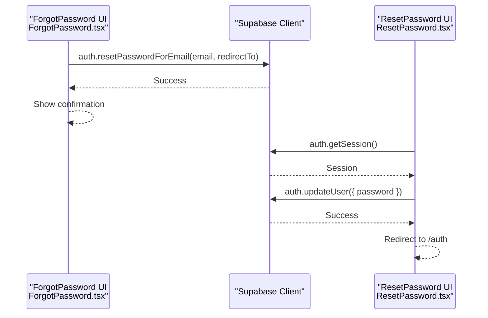

**Diagram sources**
- [ForgotPassword.tsx](file://src/pages/ForgotPassword.tsx#L22-L57)
- [ResetPassword.tsx](file://src/pages/ResetPassword.tsx#L29-L78)
- [client.ts](file://src/integrations/supabase/client.ts#L1-L17)

**Section sources**
- [ForgotPassword.tsx](file://src/pages/ForgotPassword.tsx#L1-L147)
- [ResetPassword.tsx](file://src/pages/ResetPassword.tsx#L1-L200)

### Admin Authentication and Security
- Admin login
  - Dedicated page and hook enforce admin role checks and sign out non-admin users.
- Admin isolation
  - Admin client uses isolated storage keys to prevent hijacking.
- Security policies
  - Admin dashboards and logs enforce RBAC via database policies.
  - Realtime publication includes admin-relevant tables.

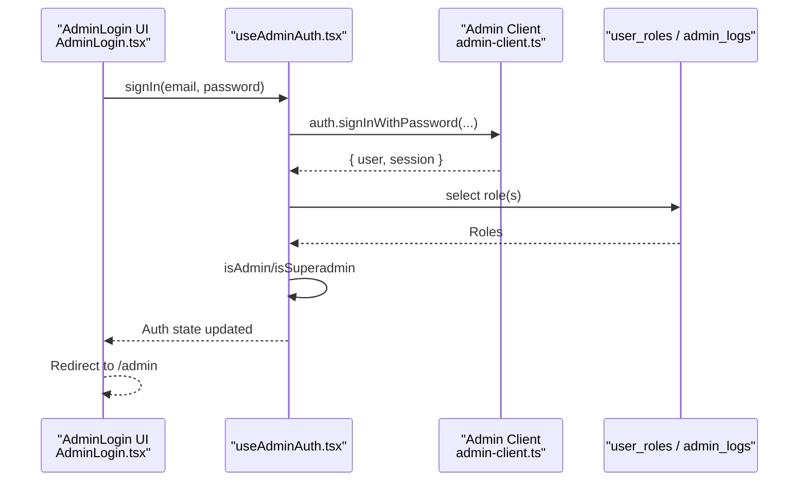

**Diagram sources**
- [AdminLogin.tsx](file://src/pages/admin/AdminLogin.tsx#L32-L68)
- [useAdminAuth.tsx](file://src/hooks/useAdminAuth.tsx#L142-L172)
- [admin-client.ts](file://src/integrations/supabase/admin-client.ts#L1-L28)
- [20260126040000_admin_auth_security.sql](file://supabase/migrations/20260126040000_admin_auth_security.sql#L1-L79)

**Section sources**
- [AdminLogin.tsx](file://src/pages/admin/AdminLogin.tsx#L1-L158)
- [useAdminAuth.tsx](file://src/hooks/useAdminAuth.tsx#L1-L216)
- [admin-client.ts](file://src/integrations/supabase/admin-client.ts#L1-L28)
- [20260126040000_admin_auth_security.sql](file://supabase/migrations/20260126040000_admin_auth_security.sql#L1-L79)

### Protected Route Implementation and Permission Checking
- Studio routes
  - Wrapped with ProtectedRoute; optionally require admin role.
- Admin routes
  - Wrapped with AdminProtectedRoute; optionally require superadmin.
- Unauthorized handling
  - Redirects to unauthorized page with attempted path and role info.

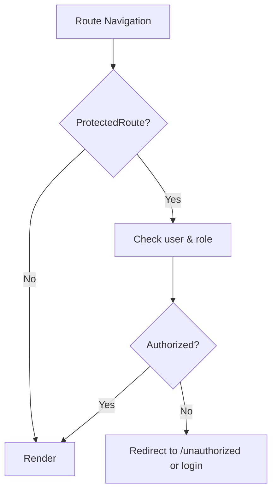

**Diagram sources**
- [App.tsx](file://src/App.tsx#L157-L338)
- [ProtectedRoute.tsx](file://src/components/auth/ProtectedRoute.tsx#L11-L42)
- [AdminProtectedRoute.tsx](file://src/components/auth/AdminProtectedRoute.tsx#L11-L46)

**Section sources**
- [App.tsx](file://src/App.tsx#L157-L338)
- [ProtectedRoute.tsx](file://src/components/auth/ProtectedRoute.tsx#L1-L42)
- [AdminProtectedRoute.tsx](file://src/components/auth/AdminProtectedRoute.tsx#L1-L46)

## Dependency Analysis
- Client dependencies
  - Public and admin clients depend on typed schema for compile-time safety.
- Hook dependencies
  - useAuth and useAdminAuth depend on Supabase clients and database role tables.
- Routing dependencies
  - ProtectedRoute and AdminProtectedRoute depend on hooks for role checks.
- Database dependencies
  - RBAC relies on user_roles table and policies; admin dashboards rely on policies and realtime publication.

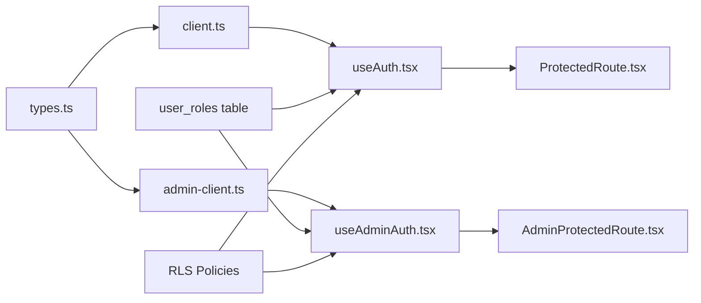

**Diagram sources**
- [types.ts](file://src/integrations/supabase/types.ts#L1-L800)
- [client.ts](file://src/integrations/supabase/client.ts#L1-L17)
- [admin-client.ts](file://src/integrations/supabase/admin-client.ts#L1-L28)
- [useAuth.tsx](file://src/hooks/useAuth.tsx#L102-L133)
- [useAdminAuth.tsx](file://src/hooks/useAdminAuth.tsx#L101-L140)
- [ProtectedRoute.tsx](file://src/components/auth/ProtectedRoute.tsx#L15-L38)
- [AdminProtectedRoute.tsx](file://src/components/auth/AdminProtectedRoute.tsx#L15-L42)
- [20251209213954_141af71b-504d-4a68-a16d-b931834b1328.sql](file://supabase/migrations/20251209213954_141af71b-504d-4a68-a16d-b931834b1328.sql#L246-L288)
- [20260126040000_admin_auth_security.sql](file://supabase/migrations/20260126040000_admin_auth_security.sql#L1-L79)

**Section sources**
- [types.ts](file://src/integrations/supabase/types.ts#L1-L800)
- [client.ts](file://src/integrations/supabase/client.ts#L1-L17)
- [admin-client.ts](file://src/integrations/supabase/admin-client.ts#L1-L28)
- [useAuth.tsx](file://src/hooks/useAuth.tsx#L102-L133)
- [useAdminAuth.tsx](file://src/hooks/useAdminAuth.tsx#L101-L140)
- [ProtectedRoute.tsx](file://src/components/auth/ProtectedRoute.tsx#L1-L42)
- [AdminProtectedRoute.tsx](file://src/components/auth/AdminProtectedRoute.tsx#L1-L46)
- [20251209213954_141af71b-504d-4a68-a16d-b931834b1328.sql](file://supabase/migrations/20251209213954_141af71b-504d-4a68-a16d-b931834b1328.sql#L246-L288)
- [20260126040000_admin_auth_security.sql](file://supabase/migrations/20260126040000_admin_auth_security.sql#L1-L79)

## Performance Considerations
- Auto-refresh and persistence reduce redundant network requests and improve UX.
- Role checks are deferred with setTimeout to avoid blocking render loops.
- Logging inserts are lightweight and occur after successful actions.

[No sources needed since this section provides general guidance]

## Troubleshooting Guide
- Login failures
  - Hook logs failed attempts; check auth_logs for error types.
- Session not persisting
  - Verify localStorage availability and client configuration.
- Cross-session interference
  - Ensure admin client uses isolated storage keys.
- Unauthorized access
  - Confirm user_roles table contains expected roles and policies are applied.

**Section sources**
- [useAuth.tsx](file://src/hooks/useAuth.tsx#L184-L201)
- [useAdminAuth.tsx](file://src/hooks/useAdminAuth.tsx#L149-L166)
- [20251209213954_141af71b-504d-4a68-a16d-b931834b1328.sql](file://supabase/migrations/20251209213954_141af71b-504d-4a68-a16d-b931834b1328.sql#L2-L36)

## Conclusion
The authentication system leverages Supabase Auth with robust session management, RBAC enforcement, and admin isolation. It supports OAuth, magic links, and password reset while maintaining secure, predictable behavior across browser tabs and portals.

[No sources needed since this section summarizes without analyzing specific files]

## Appendices

### JWT Token Structure and Refresh Mechanisms
- Tokens are managed by Supabase Auth and stored in localStorage.
- Auto-refresh is enabled; refresh tokens are handled transparently by the SDK.
- Security headers are applied by the Supabase client automatically.

**Section sources**
- [client.ts](file://src/integrations/supabase/client.ts#L11-L17)
- [admin-client.ts](file://src/integrations/supabase/admin-client.ts#L16-L27)

### Admin Bootstrap and Policies
- Initial superadmin can be bootstrapped via a stored function.
- Admin dashboards and logs enforce RBAC via database policies.
- Realtime publication includes admin-relevant tables.

**Section sources**
- [20260126050000_bootstrap_superadmin.sql](file://supabase/migrations/20260126050000_bootstrap_superadmin.sql#L1-L84)
- [20260126040000_admin_auth_security.sql](file://supabase/migrations/20260126040000_admin_auth_security.sql#L1-L79)
- [20260126060000_isolate_admin_auth.sql](file://supabase/migrations/20260126060000_isolate_admin_auth.sql#L1-L96)