# Serverless Functions

<cite>
**Referenced Files in This Document**
- [supabase/config.toml](file://supabase/config.toml)
- [supabase/functions/deno.json](file://supabase/functions/deno.json)
- [supabase/functions/import_map.json](file://supabase/functions/import_map.json)
- [supabase/functions/calculate-designer-score/index.ts](file://supabase/functions/calculate-designer-score/index.ts)
- [supabase/functions/create-checkout/index.ts](file://supabase/functions/create-checkout/index.ts)
- [supabase/functions/send-transactional/index.ts](file://supabase/functions/send-transactional/index.ts)
- [supabase/functions/marketplace-orders/index.ts](file://supabase/functions/marketplace-orders/index.ts)
- [supabase/functions/manage-team/index.ts](file://supabase/functions/manage-team/index.ts)
- [supabase/functions/submit-stylebox-entry/index.ts](file://supabase/functions/submit-stylebox-entry/index.ts)
- [supabase/functions/broadcast-notification/index.ts](file://supabase/functions/broadcast-notification/index.ts)
- [supabase/functions/award-style-credits/index.ts](file://supabase/functions/award-style-credits/index.ts)
- [supabase/functions/generate-sitemap/index.ts](file://supabase/functions/generate-sitemap/index.ts)
- [supabase/functions/reset-monthly-tokens/index.ts](file://supabase/functions/reset-monthly-tokens/index.ts)
- [supabase/functions/newsletter-subscribe/index.ts](file://supabase/functions/newsletter-subscribe/index.ts)
- [supabase/functions/verify-authenticity/index.ts](file://supabase/functions/verify-authenticity/index.ts)
- [supabase/functions/upload-portfolio-project/index.ts](file://supabase/functions/upload-portfolio-project/index.ts)
</cite>

## Table of Contents
1. [Introduction](#introduction)
2. [Project Structure](#project-structure)
3. [Core Components](#core-components)
4. [Architecture Overview](#architecture-overview)
5. [Detailed Component Analysis](#detailed-component-analysis)
6. [Dependency Analysis](#dependency-analysis)
7. [Performance Considerations](#performance-considerations)
8. [Troubleshooting Guide](#troubleshooting-guide)
9. [Conclusion](#conclusion)
10. [Appendices](#appendices)

## Introduction
This document describes all serverless functions deployed on Supabase within the project. It covers each function’s purpose, input parameters, return values, security requirements, error handling, and integration patterns. It also documents authentication requirements, rate limiting, execution limits, webhook endpoints, scheduled functions, and trigger-based functions. Finally, it provides deployment instructions, testing strategies, and debugging approaches.

## Project Structure
Supabase serverless functions are located under supabase/functions/<function-name>/index.ts. Each function is a Deno-based HTTP function served via Deno.serve or serve. Shared dependencies are imported via an import map and Deno configuration.

```mermaid
graph TB
subgraph "Supabase Functions"
A["calculate-designer-score/index.ts"]
B["create-checkout/index.ts"]
C["send-transactional/index.ts"]
D["marketplace-orders/index.ts"]
E["manage-team/index.ts"]
F["submit-stylebox-entry/index.ts"]
G["broadcast-notification/index.ts"]
H["award-style-credits/index.ts"]
I["generate-sitemap/index.ts"]
J["reset-monthly-tokens/index.ts"]
K["newsletter-subscribe/index.ts"]
L["verify-authenticity/index.ts"]
M["upload-portfolio-project/index.ts"]
end
subgraph "Shared Config"
X["supabase/functions/deno.json"]
Y["supabase/functions/import_map.json"]
Z["supabase/config.toml"]
end
X --> A
X --> B
X --> C
X --> D
X --> E
X --> F
X --> G
X --> H
X --> I
X --> J
X --> K
X --> L
X --> M
Y --> A
Y --> B
Y --> C
Y --> D
Y --> E
Y --> F
Y --> G
Y --> H
Y --> I
Y --> J
Y --> K
Y --> L
Y --> M
Z --> A
Z --> B
Z --> C
Z --> D
Z --> E
Z --> F
Z --> G
Z --> H
Z --> I
Z --> J
Z --> K
Z --> L
Z --> M
```

**Diagram sources**
- [supabase/functions/deno.json](file://supabase/functions/deno.json#L1-L4)
- [supabase/functions/import_map.json](file://supabase/functions/import_map.json#L1-L7)
- [supabase/config.toml](file://supabase/config.toml#L1-L71)

**Section sources**
- [supabase/functions/deno.json](file://supabase/functions/deno.json#L1-L4)
- [supabase/functions/import_map.json](file://supabase/functions/import_map.json#L1-L7)
- [supabase/config.toml](file://supabase/config.toml#L1-L71)

## Core Components
Below is a concise overview of each serverless function, including purpose, authentication, inputs, outputs, and notable behaviors.

- calculate-designer-score
  - Purpose: Computes weighted designer scores from stylebox submissions, portfolio approvals, publications, and sales; persists results to a dedicated table.
  - Authentication: JWT verification enabled.
  - Inputs: JSON body with designer_id.
  - Outputs: JSON with success flag and scores breakdown.
  - Security: Uses service role key; logs steps and errors.
  - Error handling: Returns 500 on failures; logs detailed messages.

- create-checkout
  - Purpose: Creates a Stripe Checkout Session for a subscription using the authenticated user’s email.
  - Authentication: Requires Authorization header; validates JWT via Supabase auth.
  - Inputs: JSON body with priceId.
  - Outputs: JSON with checkout URL.
  - Security: Uses Supabase ANON key; reads Stripe secret from env.
  - Error handling: Returns 500 on failures.

- send-transactional
  - Purpose: Sends a transactional email via Resend and logs the event.
  - Authentication: Requires Authorization header; verifies token.
  - Inputs: JSON body with type, to, data.
  - Outputs: JSON with success and message_id.
  - Security: Requires JWT; logs errors; inserts email_log record.
  - Error handling: Returns 401/400/500 depending on failure.

- marketplace-orders
  - Purpose: Lists, details, and cancels marketplace orders for authenticated users.
  - Authentication: Requires Authorization header; validates JWT; checks customer mapping.
  - Inputs: Query params for list/detail/cancel; JSON body for cancel.
  - Outputs: Orders list/pagination; single order with items; updated order after cancel.
  - Security: Uses service role key for internal operations; enforces customer ownership.
  - Error handling: Returns 401/404/400/500 as appropriate.

- manage-team
  - Purpose: Full lifecycle team management: create, invite, respond to invitations, join requests, respond to join requests, leave.
  - Authentication: Requires Authorization header; validates JWT; uses service role key for admin ops.
  - Inputs: JSON body with action and payload; switches on action.
  - Outputs: Success response with created/updated data; detailed errors for permission/rank constraints.
  - Security: Enforces rank thresholds for creation; role checks for admin actions; handles rollbacks.
  - Error handling: Returns 400/401/403/404/500 with contextual messages.

- submit-stylebox-entry
  - Purpose: Allows authenticated designers to submit StyleBox entries with files.
  - Authentication: Requires Authorization header; validates JWT.
  - Inputs: JSON body with stylebox_id, description, submission_files.
  - Outputs: JSON with submission summary and message.
  - Security: Verifies stylebox status and existence; creates notifications.
  - Error handling: Returns 400/401/404/500 with detailed messages.

- broadcast-notification
  - Purpose: Broadcasts a notification to all active users in batches.
  - Authentication: Requires Authorization header; verifies admin role via user_roles.
  - Inputs: JSON body with type, message, optional title.
  - Outputs: JSON with success and count.
  - Security: Uses service role key; limits user fetch; batches inserts.
  - Error handling: Returns 400/401/403/500 with error messages.

- award-style-credits
  - Purpose: Awards Style Credits to designers and promotes them if threshold reached.
  - Authentication: JWT verification enabled.
  - Inputs: JSON body with submission_id, difficulty, designer_id, optional bonus_sc.
  - Outputs: JSON with awarded amount, totals, promotion flag, and new rank order.
  - Security: Uses service role key; updates profile and inserts notification.
  - Error handling: Returns 500 on failures.

- generate-sitemap
  - Purpose: Generates an XML sitemap for SEO from live products, categories, and articles.
  - Authentication: No JWT verification.
  - Inputs: None (reads from Supabase).
  - Outputs: XML sitemap with URLs, priorities, and change frequencies.
  - Security: Uses ANON key; returns XML content type.
  - Error handling: Returns 500 on failures.

- reset-monthly-tokens
  - Purpose: Resets subscription-based token quotas monthly per tier.
  - Authentication: JWT verification enabled.
  - Inputs: None (runs server-side).
  - Outputs: JSON with counts and timestamp.
  - Security: Uses service role key; iterates profiles and updates tokens.
  - Error handling: Returns 500 on failures.

- newsletter-subscribe
  - Purpose: Subscribes users to the newsletter, deduplicates, rate-limits, and sends a welcome email.
  - Authentication: No JWT verification.
  - Inputs: JSON body with email, optional source.
  - Outputs: JSON with message and optional emailSent flag.
  - Security: Validates email; rate limits per IP; integrates with Resend and logs emails.
  - Error handling: Returns 400/429/500 with messages.

- verify-authenticity
  - Purpose: Public verification of product certificates and retrieval of product certificates.
  - Authentication: Public verify requires no auth; certificate generation requires Authorization.
  - Inputs: JSON body with action and parameters (verification_code, serial_number, product_id).
  - Outputs: JSON with verification result or certificate details.
  - Security: Uses service role key for internal queries; increments verification counters.
  - Error handling: Returns 400/401/404/500 with messages.

- upload-portfolio-project
  - Purpose: Uploads portfolio project assets to storage and records metadata.
  - Authentication: Requires Authorization header; validates JWT; uses service role key for storage ops.
  - Inputs: JSON body with title, description, category, tags, images array.
  - Outputs: JSON with success, project id, thumbnail, and assets.
  - Security: Creates portfolio if missing; rolls back on failures; sets thumbnails.
  - Error handling: Returns 400/401/404/500 with rollback details.

**Section sources**
- [supabase/functions/calculate-designer-score/index.ts](file://supabase/functions/calculate-designer-score/index.ts#L1-L223)
- [supabase/functions/create-checkout/index.ts](file://supabase/functions/create-checkout/index.ts#L1-L85)
- [supabase/functions/send-transactional/index.ts](file://supabase/functions/send-transactional/index.ts#L1-L70)
- [supabase/functions/marketplace-orders/index.ts](file://supabase/functions/marketplace-orders/index.ts#L1-L226)
- [supabase/functions/manage-team/index.ts](file://supabase/functions/manage-team/index.ts#L1-L548)
- [supabase/functions/submit-stylebox-entry/index.ts](file://supabase/functions/submit-stylebox-entry/index.ts#L1-L142)
- [supabase/functions/broadcast-notification/index.ts](file://supabase/functions/broadcast-notification/index.ts#L1-L149)
- [supabase/functions/award-style-credits/index.ts](file://supabase/functions/award-style-credits/index.ts#L1-L180)
- [supabase/functions/generate-sitemap/index.ts](file://supabase/functions/generate-sitemap/index.ts#L1-L136)
- [supabase/functions/reset-monthly-tokens/index.ts](file://supabase/functions/reset-monthly-tokens/index.ts#L1-L111)
- [supabase/functions/newsletter-subscribe/index.ts](file://supabase/functions/newsletter-subscribe/index.ts#L1-L327)
- [supabase/functions/verify-authenticity/index.ts](file://supabase/functions/verify-authenticity/index.ts#L1-L262)
- [supabase/functions/upload-portfolio-project/index.ts](file://supabase/functions/upload-portfolio-project/index.ts#L1-L300)

## Architecture Overview
The serverless functions integrate with Supabase Auth, Realtime, Storage, and Database, and third-party services like Stripe and Resend. Functions use either Supabase ANON or SERVICE ROLE keys depending on whether they need to bypass Row-Level Security (RLS) or operate internally.

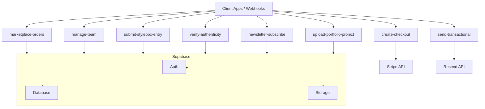

**Diagram sources**
- [supabase/functions/create-checkout/index.ts](file://supabase/functions/create-checkout/index.ts#L1-L85)
- [supabase/functions/send-transactional/index.ts](file://supabase/functions/send-transactional/index.ts#L1-L70)
- [supabase/functions/marketplace-orders/index.ts](file://supabase/functions/marketplace-orders/index.ts#L1-L226)
- [supabase/functions/manage-team/index.ts](file://supabase/functions/manage-team/index.ts#L1-L548)
- [supabase/functions/submit-stylebox-entry/index.ts](file://supabase/functions/submit-stylebox-entry/index.ts#L1-L142)
- [supabase/functions/verify-authenticity/index.ts](file://supabase/functions/verify-authenticity/index.ts#L1-L262)
- [supabase/functions/newsletter-subscribe/index.ts](file://supabase/functions/newsletter-subscribe/index.ts#L1-L327)
- [supabase/functions/upload-portfolio-project/index.ts](file://supabase/functions/upload-portfolio-project/index.ts#L1-L300)

## Detailed Component Analysis

### calculate-designer-score
- Purpose: Aggregates weighted scores from multiple sources and upserts results.
- Inputs: JSON body with designer_id.
- Outputs: JSON with success and scores breakdown.
- Security: Uses service role key; logs steps; throws on DB errors.
- Error handling: Returns 500 with error message; logs detailed context.

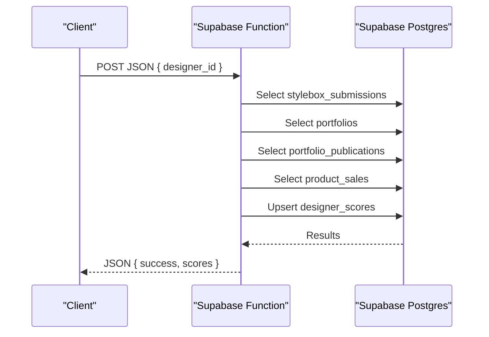

**Diagram sources**
- [supabase/functions/calculate-designer-score/index.ts](file://supabase/functions/calculate-designer-score/index.ts#L30-L223)

**Section sources**
- [supabase/functions/calculate-designer-score/index.ts](file://supabase/functions/calculate-designer-score/index.ts#L1-L223)
- [supabase/config.toml](file://supabase/config.toml#L15-L16)

### create-checkout
- Purpose: Creates a Stripe Checkout Session for a subscription.
- Inputs: JSON body with priceId; Authorization header.
- Outputs: JSON with checkout URL.
- Security: Uses ANON key; validates user via Supabase auth; reads Stripe secret from env.
- Error handling: Returns 500 with error message.

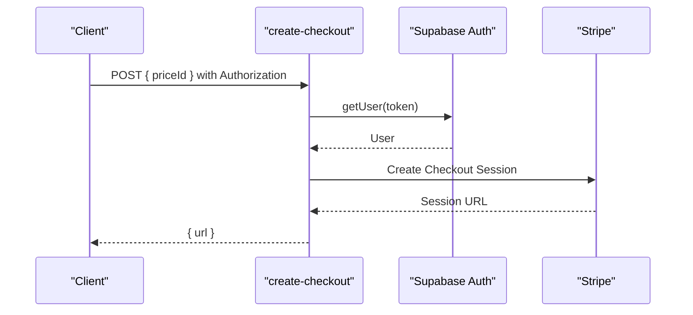

**Diagram sources**
- [supabase/functions/create-checkout/index.ts](file://supabase/functions/create-checkout/index.ts#L14-L85)

**Section sources**
- [supabase/functions/create-checkout/index.ts](file://supabase/functions/create-checkout/index.ts#L1-L85)
- [supabase/config.toml](file://supabase/config.toml#L3-L4)

### send-transactional
- Purpose: Sends a transactional email via Resend and logs the event.
- Inputs: JSON body with type, to, data; Authorization header.
- Outputs: JSON with success and message_id.
- Security: Requires Authorization; logs to email_logs.
- Error handling: Returns 401/400/500 with messages.

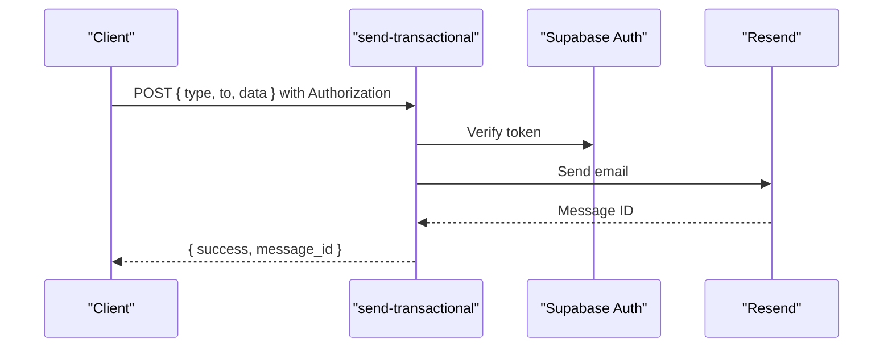

**Diagram sources**
- [supabase/functions/send-transactional/index.ts](file://supabase/functions/send-transactional/index.ts#L15-L70)

**Section sources**
- [supabase/functions/send-transactional/index.ts](file://supabase/functions/send-transactional/index.ts#L1-L70)
- [supabase/config.toml](file://supabase/config.toml#L45-L46)

### marketplace-orders
- Purpose: Manages orders for authenticated users.
- Inputs: Query params for list/detail/cancel; JSON body for cancel.
- Outputs: Orders list/pagination; single order with items; updated order after cancel.
- Security: Validates JWT; checks customer mapping; restores inventory on cancel.
- Error handling: Returns 401/404/400/500 with messages.

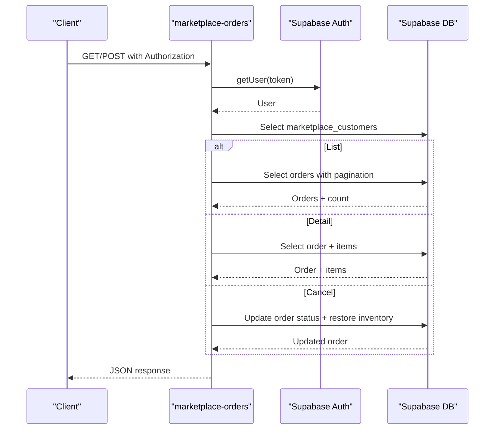

**Diagram sources**
- [supabase/functions/marketplace-orders/index.ts](file://supabase/functions/marketplace-orders/index.ts#L13-L226)

**Section sources**
- [supabase/functions/marketplace-orders/index.ts](file://supabase/functions/marketplace-orders/index.ts#L1-L226)
- [supabase/config.toml](file://supabase/config.toml#L57-L58)

### manage-team
- Purpose: Full team lifecycle management.
- Inputs: JSON body with action and payload; switches on action.
- Outputs: Success response with created/updated data; detailed errors.
- Security: Uses service role key; enforces rank thresholds; handles rollbacks.
- Error handling: Returns 400/401/403/404/500 with contextual messages.

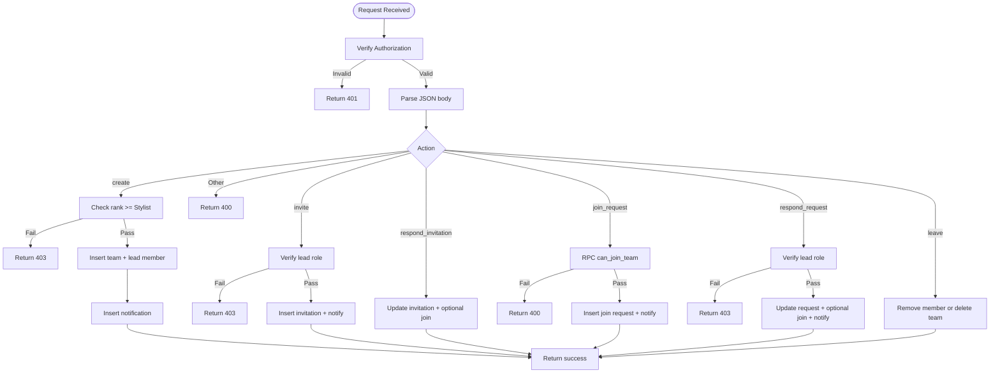

**Diagram sources**
- [supabase/functions/manage-team/index.ts](file://supabase/functions/manage-team/index.ts#L82-L548)

**Section sources**
- [supabase/functions/manage-team/index.ts](file://supabase/functions/manage-team/index.ts#L1-L548)
- [supabase/config.toml](file://supabase/config.toml#L63-L70)

### submit-stylebox-entry
- Purpose: Allows authenticated designers to submit StyleBox entries.
- Inputs: JSON body with stylebox_id, description, submission_files.
- Outputs: JSON with submission summary and message.
- Security: Verifies stylebox status and existence; creates notifications.
- Error handling: Returns 400/401/404/500 with messages.

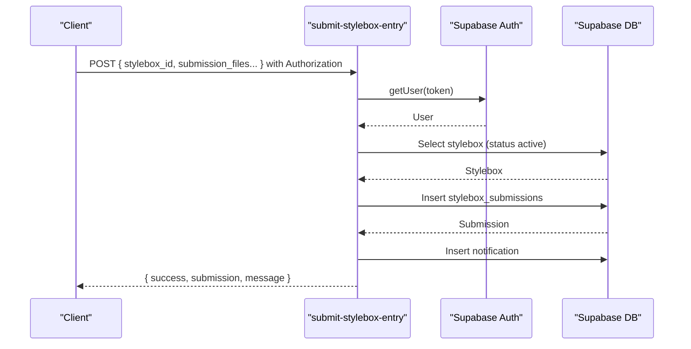

**Diagram sources**
- [supabase/functions/submit-stylebox-entry/index.ts](file://supabase/functions/submit-stylebox-entry/index.ts#L9-L142)

**Section sources**
- [supabase/functions/submit-stylebox-entry/index.ts](file://supabase/functions/submit-stylebox-entry/index.ts#L1-L142)
- [supabase/config.toml](file://supabase/config.toml#L21-L22)

### broadcast-notification
- Purpose: Broadcasts a notification to all active users in batches.
- Inputs: JSON body with type, message, optional title; Authorization header.
- Outputs: JSON with success and count.
- Security: Uses service role key; limits user fetch; batches inserts.
- Error handling: Returns 400/401/403/500 with messages.

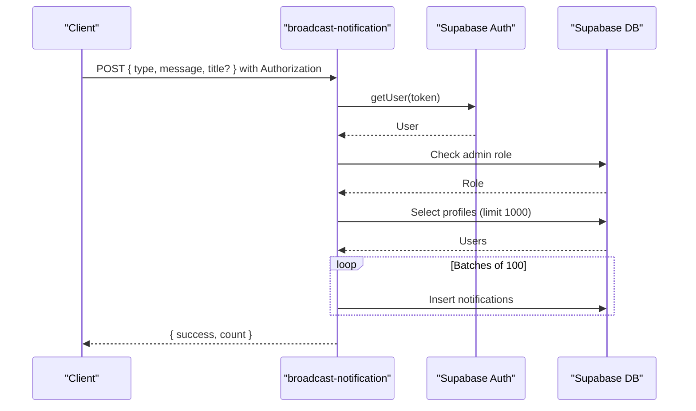

**Diagram sources**
- [supabase/functions/broadcast-notification/index.ts](file://supabase/functions/broadcast-notification/index.ts#L8-L149)

**Section sources**
- [supabase/functions/broadcast-notification/index.ts](file://supabase/functions/broadcast-notification/index.ts#L1-L149)
- [supabase/config.toml](file://supabase/config.toml#L66-L67)

### award-style-credits
- Purpose: Awards Style Credits and promotes designers if threshold reached.
- Inputs: JSON body with submission_id, difficulty, designer_id, optional bonus_sc.
- Outputs: JSON with awarded amount, totals, promotion flag, and new rank order.
- Security: Uses service role key; updates profile and inserts notification.
- Error handling: Returns 500 with error message.

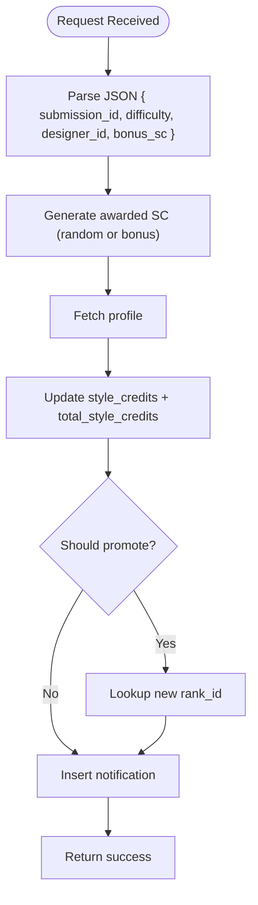

**Diagram sources**
- [supabase/functions/award-style-credits/index.ts](file://supabase/functions/award-style-credits/index.ts#L46-L180)

**Section sources**
- [supabase/functions/award-style-credits/index.ts](file://supabase/functions/award-style-credits/index.ts#L1-L180)
- [supabase/config.toml](file://supabase/config.toml#L30-L31)

### generate-sitemap
- Purpose: Generates an XML sitemap for SEO.
- Inputs: None.
- Outputs: XML sitemap.
- Security: Uses ANON key; returns XML content type.
- Error handling: Returns 500 with error message.

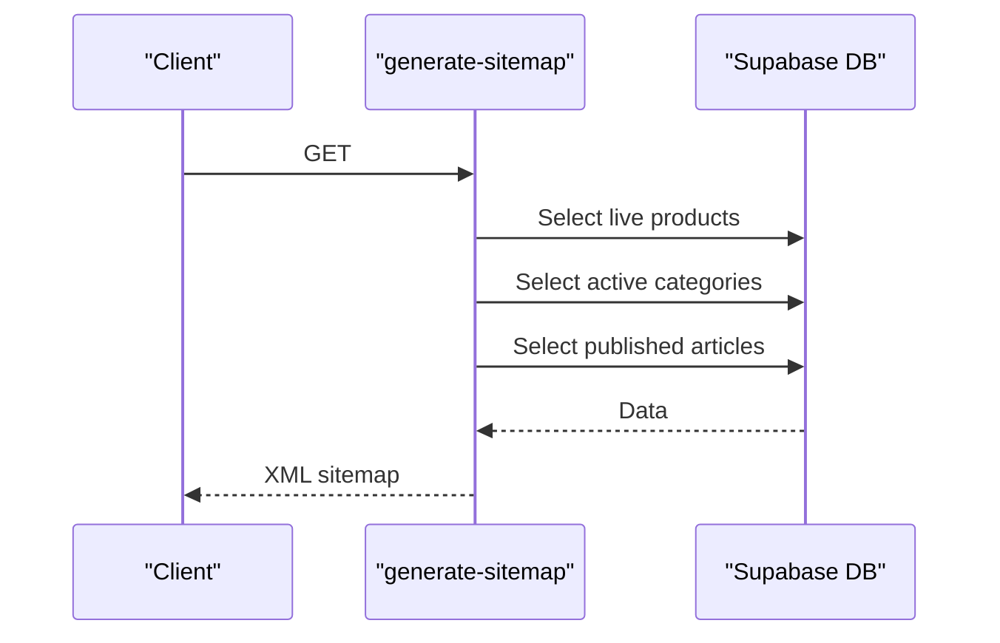

**Diagram sources**
- [supabase/functions/generate-sitemap/index.ts](file://supabase/functions/generate-sitemap/index.ts#L11-L136)

**Section sources**
- [supabase/functions/generate-sitemap/index.ts](file://supabase/functions/generate-sitemap/index.ts#L1-L136)
- [supabase/config.toml](file://supabase/config.toml#L60-L61)

### reset-monthly-tokens
- Purpose: Resets subscription-based token quotas monthly per tier.
- Inputs: None.
- Outputs: JSON with counts and timestamp.
- Security: Uses service role key; iterates profiles and updates tokens.
- Error handling: Returns 500 with error message.

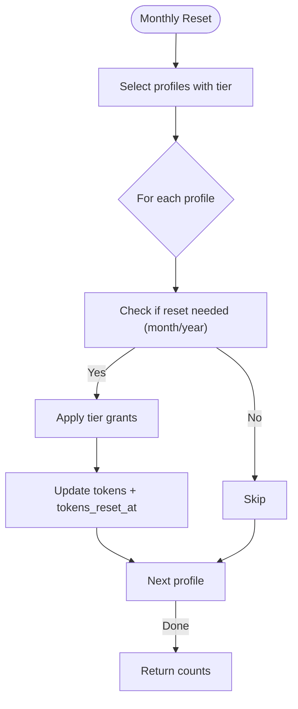

**Diagram sources**
- [supabase/functions/reset-monthly-tokens/index.ts](file://supabase/functions/reset-monthly-tokens/index.ts#L20-L111)

**Section sources**
- [supabase/functions/reset-monthly-tokens/index.ts](file://supabase/functions/reset-monthly-tokens/index.ts#L1-L111)
- [supabase/config.toml](file://supabase/config.toml#L36-L37)

### newsletter-subscribe
- Purpose: Subscribes users to the newsletter, deduplicates, rate-limits, and sends a welcome email.
- Inputs: JSON body with email, optional source.
- Outputs: JSON with message and optional emailSent flag.
- Security: Validates email; rate limits per IP; integrates with Resend and logs emails.
- Error handling: Returns 400/429/500 with messages.

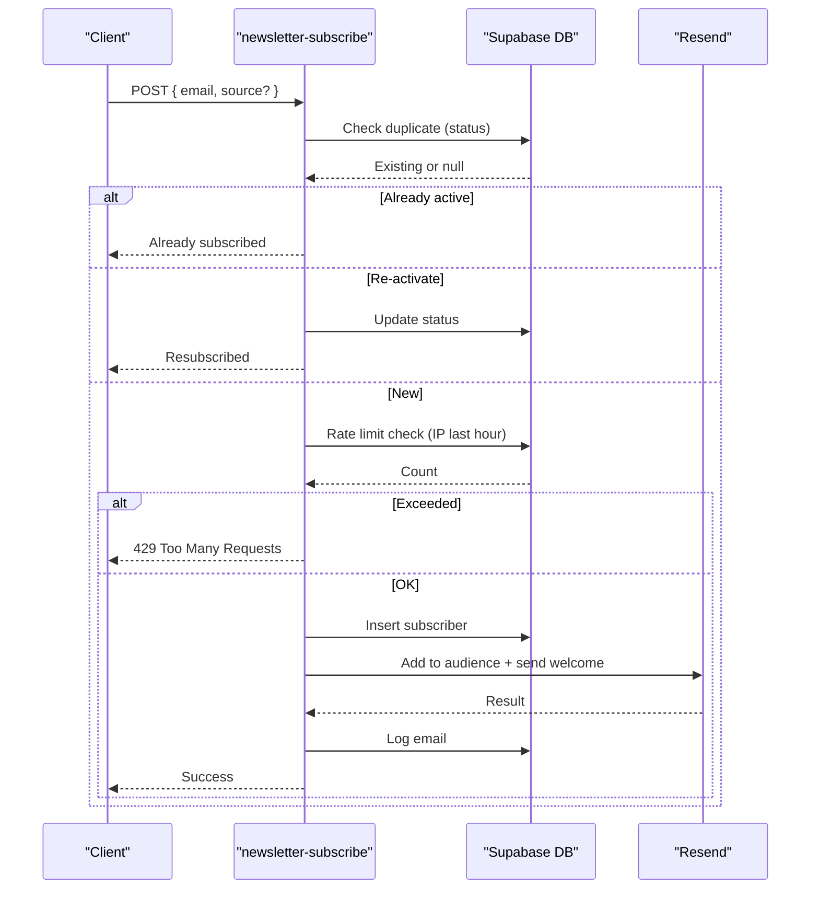

**Diagram sources**
- [supabase/functions/newsletter-subscribe/index.ts](file://supabase/functions/newsletter-subscribe/index.ts#L119-L327)

**Section sources**
- [supabase/functions/newsletter-subscribe/index.ts](file://supabase/functions/newsletter-subscribe/index.ts#L1-L327)
- [supabase/config.toml](file://supabase/config.toml#L12-L13)

### verify-authenticity
- Purpose: Public verification of product certificates and retrieval of product certificates.
- Inputs: JSON body with action and parameters.
- Outputs: JSON with verification result or certificate details.
- Security: Uses service role key for internal queries; increments verification counters.
- Error handling: Returns 400/401/404/500 with messages.

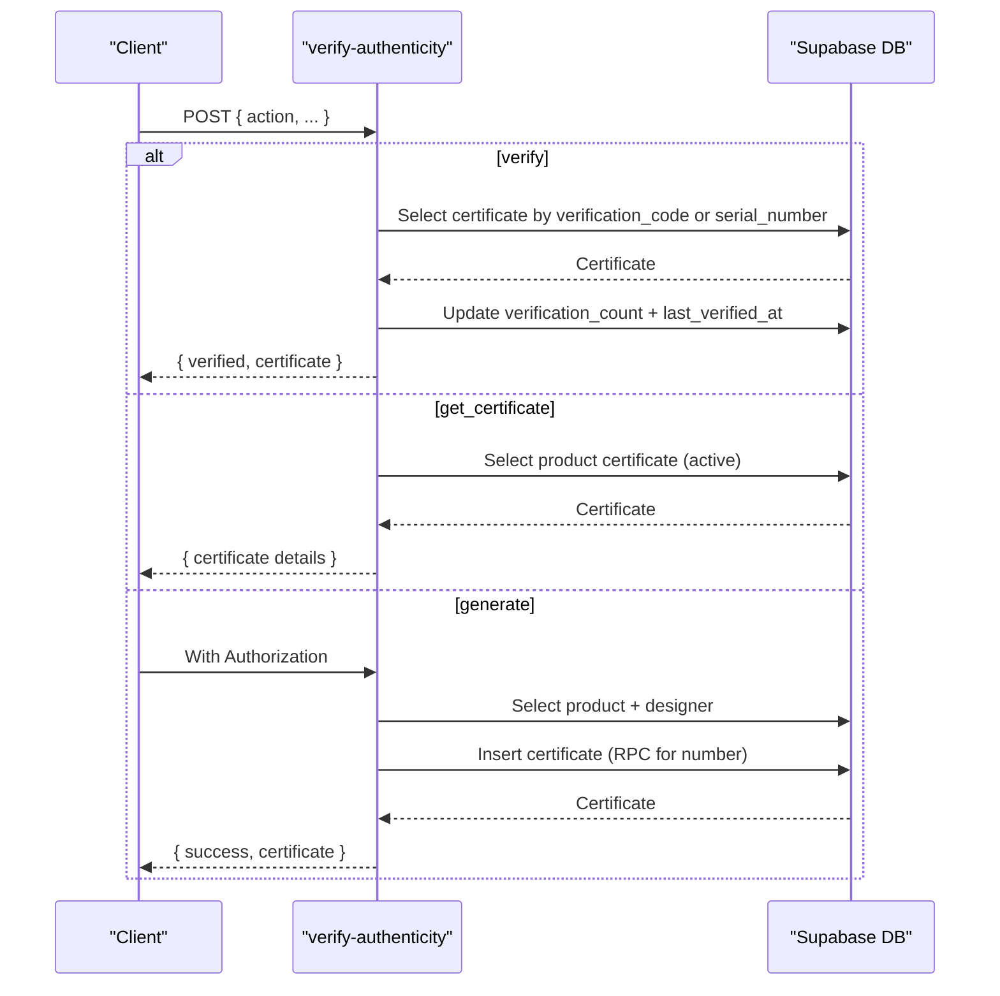

**Diagram sources**
- [supabase/functions/verify-authenticity/index.ts](file://supabase/functions/verify-authenticity/index.ts#L24-L262)

**Section sources**
- [supabase/functions/verify-authenticity/index.ts](file://supabase/functions/verify-authenticity/index.ts#L1-L262)
- [supabase/config.toml](file://supabase/config.toml#L1-L71)

### upload-portfolio-project
- Purpose: Uploads portfolio project assets to storage and records metadata.
- Inputs: JSON body with title, description, category, tags, images array.
- Outputs: JSON with success, project id, thumbnail, and assets.
- Security: Creates portfolio if missing; rolls back on failures; sets thumbnails.
- Error handling: Returns 400/401/404/500 with rollback details.

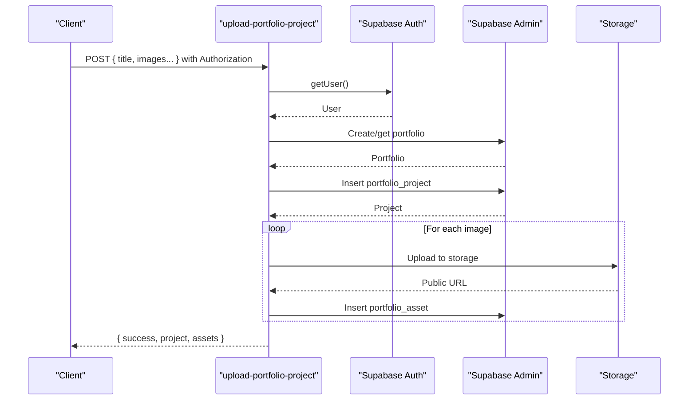

**Diagram sources**
- [supabase/functions/upload-portfolio-project/index.ts](file://supabase/functions/upload-portfolio-project/index.ts#L21-L300)

**Section sources**
- [supabase/functions/upload-portfolio-project/index.ts](file://supabase/functions/upload-portfolio-project/index.ts#L1-L300)
- [supabase/config.toml](file://supabase/config.toml#L1-L71)

## Dependency Analysis
- Import map defines external dependencies for Supabase client and Stripe.
- Functions rely on Supabase environment variables for keys and endpoints.
- Some functions use service role key for admin operations; others use ANON key for public endpoints.

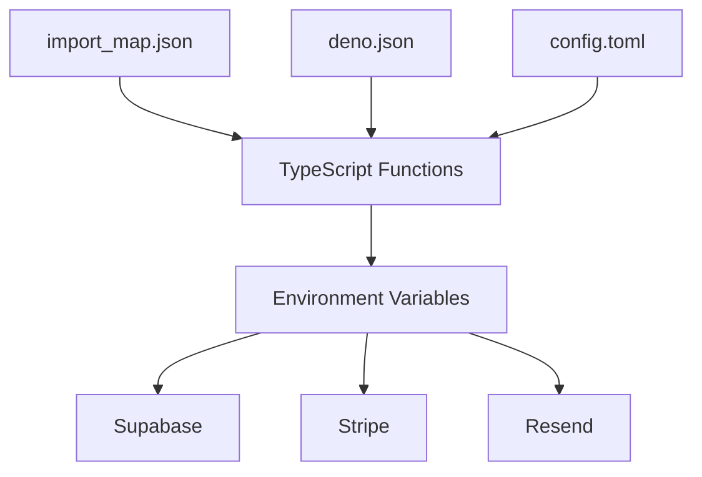

**Diagram sources**
- [supabase/functions/import_map.json](file://supabase/functions/import_map.json#L1-L7)
- [supabase/functions/deno.json](file://supabase/functions/deno.json#L1-L4)
- [supabase/config.toml](file://supabase/config.toml#L1-L71)

**Section sources**
- [supabase/functions/import_map.json](file://supabase/functions/import_map.json#L1-L7)
- [supabase/functions/deno.json](file://supabase/functions/deno.json#L1-L4)
- [supabase/config.toml](file://supabase/config.toml#L1-L71)

## Performance Considerations
- Token reset function iterates profiles and updates in batches; ensure database indexing on subscription tier and tokens_reset_at improves performance.
- Broadcast notification function limits user fetch and inserts in batches to avoid timeouts.
- Newsletter subscription function applies rate limiting per IP to reduce load.
- Sitemap generation function performs multiple small selects; caching or scheduling can reduce repeated computation.

[No sources needed since this section provides general guidance]

## Troubleshooting Guide
- Missing Authorization header: Many functions return 401. Ensure clients pass a valid Bearer token.
- JWT verification disabled: Functions configured with verify_jwt=false can be called without JWT; enable verify_jwt for sensitive endpoints.
- Stripe errors: Verify STRIPE_SECRET_KEY is set and priceId is valid.
- Resend errors: Verify RESEND_API_KEY_* is set; check email logs for failures.
- Database errors: Inspect logs for SQL errors; confirm service role key presence for admin functions.
- Storage errors: Confirm SUPABASE_SERVICE_ROLE_KEY is set for storage operations.

**Section sources**
- [supabase/config.toml](file://supabase/config.toml#L1-L71)
- [supabase/functions/create-checkout/index.ts](file://supabase/functions/create-checkout/index.ts#L38-L40)
- [supabase/functions/send-transactional/index.ts](file://supabase/functions/send-transactional/index.ts#L23-L29)
- [supabase/functions/newsletter-subscribe/index.ts](file://supabase/functions/newsletter-subscribe/index.ts#L3-L7)
- [supabase/functions/upload-portfolio-project/index.ts](file://supabase/functions/upload-portfolio-project/index.ts#L42-L54)

## Conclusion
The serverless function suite provides robust capabilities for commerce, notifications, team management, content, and marketing. Authentication and security are enforced per function using Supabase Auth and service role keys. Rate limiting and batching help maintain performance. Proper environment configuration and logging are essential for reliable operation.

[No sources needed since this section summarizes without analyzing specific files]

## Appendices

### Authentication and JWT Verification
- Functions with verify_jwt=true require a valid JWT in the Authorization header.
- Functions with verify_jwt=false can be invoked publicly; consider enabling JWT verification for sensitive operations.

**Section sources**
- [supabase/config.toml](file://supabase/config.toml#L1-L71)

### Environment Variables
Common environment variables used across functions:
- SUPABASE_URL
- SUPABASE_ANON_KEY
- SUPABASE_SERVICE_ROLE_KEY
- STRIPE_SECRET_KEY
- RESEND_API_KEY_NEWSLETTER
- RESEND_API_KEY_TRANSACTIONAL

Ensure these are set in Supabase secrets before deploying.

**Section sources**
- [supabase/functions/create-checkout/index.ts](file://supabase/functions/create-checkout/index.ts#L19-L22)
- [supabase/functions/send-transactional/index.ts](file://supabase/functions/send-transactional/index.ts#L23-L29)
- [supabase/functions/newsletter-subscribe/index.ts](file://supabase/functions/newsletter-subscribe/index.ts#L3-L7)
- [supabase/functions/upload-portfolio-project/index.ts](file://supabase/functions/upload-portfolio-project/index.ts#L42-L54)

### Deployment Instructions
- Deploy functions using the Supabase CLI or platform interface. Ensure deno.json and import_map.json are present in each function directory.
- Set environment variables in Supabase secrets.
- Configure JWT verification per function in config.toml.
- For scheduled tasks, use Supabase Cron or external schedulers invoking the functions.

[No sources needed since this section provides general guidance]

### Testing Strategies
- Unit-test function logic locally using Deno test runner.
- Mock Supabase client and external APIs (Stripe, Resend) with stubs.
- Use curl or Postman to test endpoints with Authorization headers.
- Validate error responses for missing headers, invalid tokens, and rate limits.

[No sources needed since this section provides general guidance]

### Debugging Approaches
- Enable console logging in functions; inspect Supabase logs.
- Verify environment variables are loaded correctly.
- For database issues, test queries independently and confirm RLS policies.
- For storage issues, test uploads with service role key separately.

[No sources needed since this section provides general guidance]