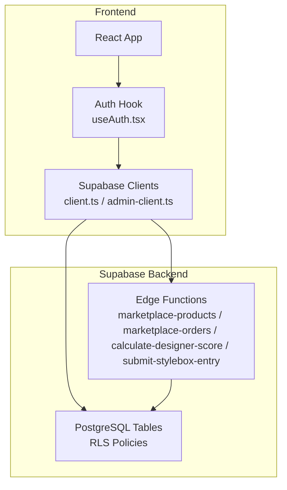
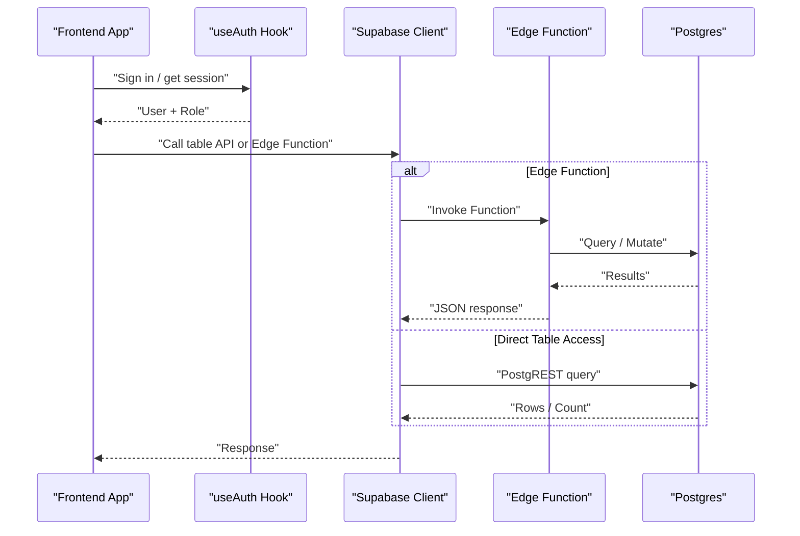
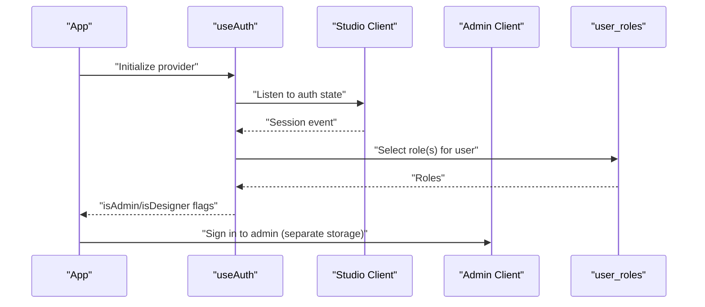
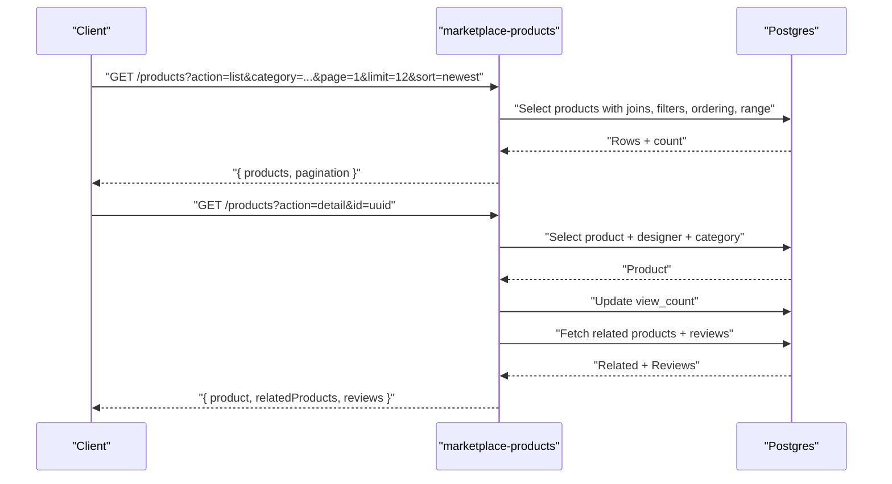
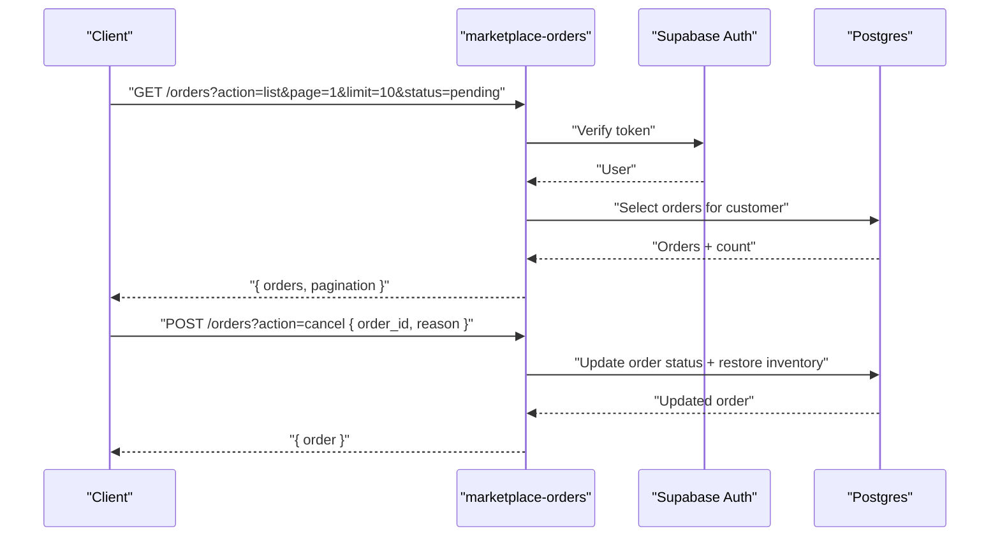
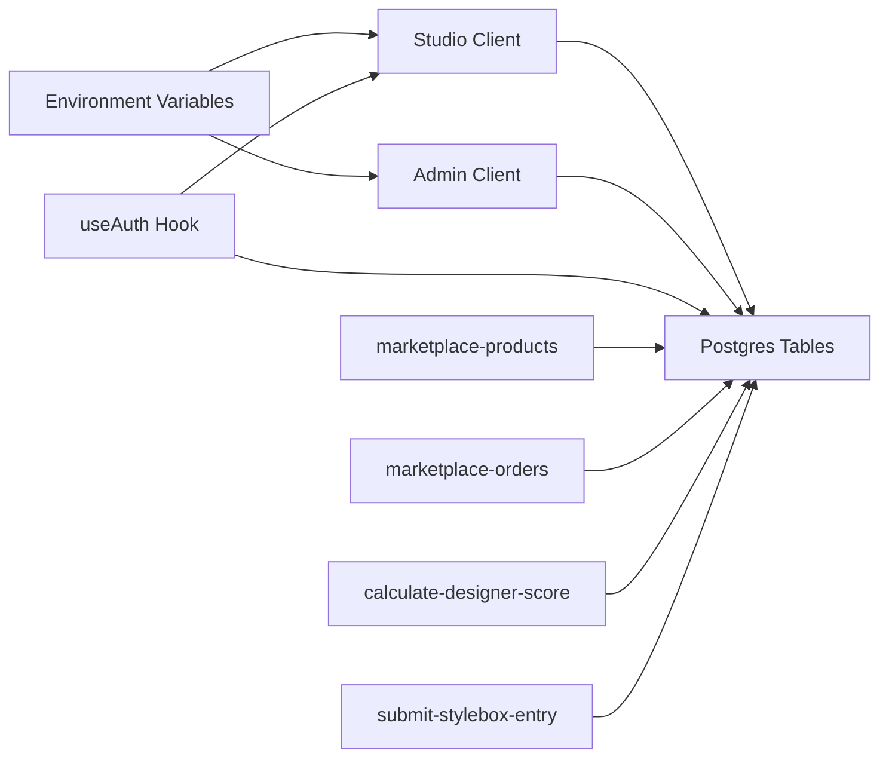

# Supabase REST API

<cite>
**Referenced Files in This Document**
- [client.ts](file://src/integrations/supabase/client.ts)
- [admin-client.ts](file://src/integrations/supabase/admin-client.ts)
- [types.ts](file://src/integrations/supabase/types.ts)
- [useAuth.tsx](file://src/hooks/useAuth.tsx)
- [config.toml](file://supabase/config.toml)
- [20251209213954_141af71b-504d-4a68-a16d-b931834b1328.sql](file://supabase/migrations/20251209213954_141af71b-504d-4a68-a16d-b931834b1328.sql)
- [marketplace-products/index.ts](file://supabase/functions/marketplace-products/index.ts)
- [marketplace-orders/index.ts](file://supabase/functions/marketplace-orders/index.ts)
- [calculate-designer-score/index.ts](file://supabase/functions/calculate-designer-score/index.ts)
- [submit-stylebox-entry/index.ts](file://supabase/functions/submit-stylebox-entry/index.ts)
- [database.ts](file://src/types/database.ts)
</cite>

## Table of Contents
1. [Introduction](#introduction)
2. [Project Structure](#project-structure)
3. [Core Components](#core-components)
4. [Architecture Overview](#architecture-overview)
5. [Detailed Component Analysis](#detailed-component-analysis)
6. [Dependency Analysis](#dependency-analysis)
7. [Performance Considerations](#performance-considerations)
8. [Troubleshooting Guide](#troubleshooting-guide)
9. [Conclusion](#conclusion)
10. [Appendices](#appendices)

## Introduction
This document provides comprehensive REST API documentation for the Supabase backend powering the application. It covers:
- Supabase client initialization and authentication
- Database table schemas and row/update/insert types
- Supabase Edge Functions implementing REST-like endpoints for marketplace and designer operations
- Authentication headers, request/response patterns, and error handling
- Pagination, filtering, sorting, and performance optimization
- Frontend SDK usage and integration patterns

## Project Structure
The Supabase backend consists of:
- Supabase client configuration for studio and admin apps
- Supabase Edge Functions for marketplace and designer workflows
- Supabase database schema with Row/Insert/Update types and RLS policies
- Frontend hooks and types for consuming Supabase APIs

**Diagram sources**
- [client.ts](file://src/integrations/supabase/client.ts#L1-L17)
- [admin-client.ts](file://src/integrations/supabase/admin-client.ts#L1-L28)
- [useAuth.tsx](file://src/hooks/useAuth.tsx#L1-L252)
- [20251209213954_141af71b-504d-4a68-a16d-b931834b1328.sql](file://supabase/migrations/20251209213954_141af71b-504d-4a68-a16d-b931834b1328.sql#L273-L418)
- [marketplace-products/index.ts](file://supabase/functions/marketplace-products/index.ts#L1-L256)
- [marketplace-orders/index.ts](file://supabase/functions/marketplace-orders/index.ts#L1-L226)
- [calculate-designer-score/index.ts](file://supabase/functions/calculate-designer-score/index.ts#L1-L223)
- [submit-stylebox-entry/index.ts](file://supabase/functions/submit-stylebox-entry/index.ts#L1-L142)

**Section sources**
- [client.ts](file://src/integrations/supabase/client.ts#L1-L17)
- [admin-client.ts](file://src/integrations/supabase/admin-client.ts#L1-L28)
- [useAuth.tsx](file://src/hooks/useAuth.tsx#L1-L252)
- [20251209213954_141af71b-504d-4a68-a16d-b931834b1328.sql](file://supabase/migrations/20251209213954_141af71b-504d-4a68-a16d-b931834b1328.sql#L273-L418)

## Core Components
- Supabase clients:
  - Studio client for authenticated users
  - Admin client with isolated storage for admin sessions
- Auth hook:
  - Provides user/session state, role checks, and login/logout flows
- Edge Functions:
  - Marketplace product listing/detail/categories/collections
  - Marketplace orders listing/detail/cancel
  - Designer score calculation
  - Stylebox submission entry
- Types:
  - Strongly typed Row/Insert/Update for tables
  - Frontend product/cart types

**Section sources**
- [client.ts](file://src/integrations/supabase/client.ts#L1-L17)
- [admin-client.ts](file://src/integrations/supabase/admin-client.ts#L1-L28)
- [useAuth.tsx](file://src/hooks/useAuth.tsx#L1-L252)
- [types.ts](file://src/integrations/supabase/types.ts#L1-L800)
- [database.ts](file://src/types/database.ts#L1-L29)

## Architecture Overview
The system integrates frontend React components with Supabase:
- Frontend authenticates via Supabase Auth and interacts with Postgres tables and Edge Functions
- Edge Functions enforce authorization and implement business logic
- RLS policies govern table-level access

**Diagram sources**
- [useAuth.tsx](file://src/hooks/useAuth.tsx#L51-L100)
- [client.ts](file://src/integrations/supabase/client.ts#L11-L17)
- [marketplace-products/index.ts](file://supabase/functions/marketplace-products/index.ts#L13-L27)
- [marketplace-orders/index.ts](file://supabase/functions/marketplace-orders/index.ts#L13-L40)
- [20251209213954_141af71b-504d-4a68-a16d-b931834b1328.sql](file://supabase/migrations/20251209213954_141af71b-504d-4a68-a16d-b931834b1328.sql#L273-L418)

## Detailed Component Analysis

### Supabase Clients and Authentication
- Studio client:
  - Initializes Supabase with Vite env vars and persists auth session
- Admin client:
  - Uses isolated storage with a prefixed key to keep admin sessions separate
- Auth hook:
  - Subscribes to auth state changes, resolves user role via user_roles lookup, supports sign-in/sign-up/sign-out

**Diagram sources**
- [client.ts](file://src/integrations/supabase/client.ts#L11-L17)
- [admin-client.ts](file://src/integrations/supabase/admin-client.ts#L16-L27)
- [useAuth.tsx](file://src/hooks/useAuth.tsx#L51-L133)
- [20251209213954_141af71b-504d-4a68-a16d-b931834b1328.sql](file://supabase/migrations/20251209213954_141af71b-504d-4a68-a16d-b931834b1328.sql#L29-L41)

**Section sources**
- [client.ts](file://src/integrations/supabase/client.ts#L1-L17)
- [admin-client.ts](file://src/integrations/supabase/admin-client.ts#L1-L28)
- [useAuth.tsx](file://src/hooks/useAuth.tsx#L1-L252)

### Edge Function: Marketplace Products
Implements a REST-like interface under a single Edge Function with actions:
- list: filter by category/designer/price/search/featured/bestseller, sort by price/rating/bestselling/newest, paginate
- detail: fetch product by id or slug, increment view count, related products, reviews
- categories: list active categories
- collections: list active collections (optional featured filter)

Authentication:
- Public access via anonymous key for listing/detail
- Service role key for internal operations (when applicable)

Query parameters:
- action (list/detail/categories/collections)
- Filters: category, designer, minPrice, maxPrice, search, featured, bestseller
- Sort: price_asc, price_desc, rating, bestselling, newest
- Pagination: page, limit
- Detail: id or slug

Response:
- Products with pagination metadata
- Product detail with related products and reviews
- Categories/collections lists

**Diagram sources**
- [marketplace-products/index.ts](file://supabase/functions/marketplace-products/index.ts#L23-L115)
- [marketplace-products/index.ts](file://supabase/functions/marketplace-products/index.ts#L117-L204)
- [marketplace-products/index.ts](file://supabase/functions/marketplace-products/index.ts#L206-L240)

**Section sources**
- [marketplace-products/index.ts](file://supabase/functions/marketplace-products/index.ts#L1-L256)

### Edge Function: Marketplace Orders
Provides order management for authenticated users:
- list: paginated orders filtered by status
- detail: fetch order by id or order_number for the authenticated customer
- cancel: cancel eligible orders and restore inventory

Authentication:
- Authorization: Bearer token required; verified against Supabase Auth

Request/response:
- Authorization header: Bearer <token>
- On success: JSON with orders and pagination metadata or order detail with items
- On failure: JSON with error message and appropriate HTTP status

**Diagram sources**
- [marketplace-orders/index.ts](file://supabase/functions/marketplace-orders/index.ts#L23-L58)
- [marketplace-orders/index.ts](file://supabase/functions/marketplace-orders/index.ts#L60-L95)
- [marketplace-orders/index.ts](file://supabase/functions/marketplace-orders/index.ts#L97-L145)
- [marketplace-orders/index.ts](file://supabase/functions/marketplace-orders/index.ts#L147-L210)

**Section sources**
- [marketplace-orders/index.ts](file://supabase/functions/marketplace-orders/index.ts#L1-L226)

### Edge Function: Designer Score Calculation
Computes a weighted score for a designer based on:
- Stylebox submissions (approved with evaluation scores or fallback difficulty points)
- Portfolio quality and status
- Publication quality and counts
- Sales revenue thresholds

Returns a JSON object with individual scores and the weighted total, upserting into designer_scores.

Authentication:
- Service role key required

**Section sources**
- [calculate-designer-score/index.ts](file://supabase/functions/calculate-designer-score/index.ts#L1-L223)

### Edge Function: Submit Stylebox Entry
Allows authenticated designers to submit entries for active styleboxes:
- Validates Authorization header and user
- Ensures stylebox exists and is active
- Inserts a submission record and creates a notification

Authentication:
- Authorization: Bearer token required

**Section sources**
- [submit-stylebox-entry/index.ts](file://supabase/functions/submit-stylebox-entry/index.ts#L1-L142)

### Database Schemas and Types
Supabase types define Row/Insert/Update shapes for tables and enums. Notable tables include:
- profiles, user_roles, ranks
- styleboxes, stylebox_submissions
- portfolios, portfolio_publications
- marketplace_products, marketplace_orders, marketplace_customers, marketplace_reviews
- jobs, job_applications
- earnings, payouts
- notifications, admin_logs

RLS policies:
- Enforce visibility and mutation rules per role and ownership
- Examples include “Users can view own profile”, “Admins can manage ranks”, “Designers can manage own portfolios”

**Section sources**
- [types.ts](file://src/integrations/supabase/types.ts#L1-L800)
- [20251209213954_141af71b-504d-4a68-a16d-b931834b1328.sql](file://supabase/migrations/20251209213954_141af71b-504d-4a68-a16d-b931834b1328.sql#L273-L418)

### Frontend Types and Usage
- Product type augments marketplace_products rows with related designer and category info
- CartItem type describes shopping cart entries

**Section sources**
- [database.ts](file://src/types/database.ts#L1-L29)

## Dependency Analysis
- Supabase clients depend on environment variables for URL and keys
- Edge Functions depend on Supabase environment variables and Auth verification
- Frontend hooks depend on Supabase client and RLS policies
- Database depends on RLS policies and triggers for updatedAt and seeding

**Diagram sources**
- [client.ts](file://src/integrations/supabase/client.ts#L5-L6)
- [admin-client.ts](file://src/integrations/supabase/admin-client.ts#L4-L5)
- [useAuth.tsx](file://src/hooks/useAuth.tsx#L1-L252)
- [marketplace-products/index.ts](file://supabase/functions/marketplace-products/index.ts#L18-L21)
- [marketplace-orders/index.ts](file://supabase/functions/marketplace-orders/index.ts#L18-L21)
- [calculate-designer-score/index.ts](file://supabase/functions/calculate-designer-score/index.ts#L35-L39)
- [submit-stylebox-entry/index.ts](file://supabase/functions/submit-stylebox-entry/index.ts#L16-L18)
- [20251209213954_141af71b-504d-4a68-a16d-b931834b1328.sql](file://supabase/migrations/20251209213954_141af71b-504d-4a68-a16d-b931834b1328.sql#L273-L418)

**Section sources**
- [config.toml](file://supabase/config.toml#L1-L71)
- [client.ts](file://src/integrations/supabase/client.ts#L1-L17)
- [admin-client.ts](file://src/integrations/supabase/admin-client.ts#L1-L28)
- [useAuth.tsx](file://src/hooks/useAuth.tsx#L1-L252)
- [marketplace-products/index.ts](file://supabase/functions/marketplace-products/index.ts#L1-L256)
- [marketplace-orders/index.ts](file://supabase/functions/marketplace-orders/index.ts#L1-L226)
- [calculate-designer-score/index.ts](file://supabase/functions/calculate-designer-score/index.ts#L1-L223)
- [submit-stylebox-entry/index.ts](file://supabase/functions/submit-stylebox-entry/index.ts#L1-L142)
- [20251209213954_141af71b-504d-4a68-a16d-b931834b1328.sql](file://supabase/migrations/20251209213954_141af71b-504d-4a68-a16d-b931834b1328.sql#L273-L418)

## Performance Considerations
- Pagination:
  - Use page and limit parameters to constrain result sets
  - Prefer exact count only when needed; PostgREST supports count metadata
- Filtering and sorting:
  - Apply filters early (where possible) to reduce result size
  - Use indexed columns for ORDER BY clauses
- Edge Function caching:
  - Consider caching frequently accessed data (e.g., categories) at the function level
- RLS overhead:
  - Keep RLS policies efficient; avoid complex nested conditions in views
- Batch operations:
  - Prefer server-side batch updates where possible to minimize round trips

[No sources needed since this section provides general guidance]

## Troubleshooting Guide
Common issues and resolutions:
- Authentication failures:
  - Ensure Authorization header is present and valid for protected endpoints
  - Verify token audience and expiration
- Role-based access denied:
  - Confirm user_roles membership and policy alignment
- Edge Function errors:
  - Check function logs for thrown errors and malformed request bodies
- Pagination anomalies:
  - Validate page and limit parameters; ensure non-zero limits

**Section sources**
- [marketplace-orders/index.ts](file://supabase/functions/marketplace-orders/index.ts#L23-L58)
- [marketplace-products/index.ts](file://supabase/functions/marketplace-products/index.ts#L247-L254)
- [useAuth.tsx](file://src/hooks/useAuth.tsx#L102-L133)
- [20251209213954_141af71b-504d-4a68-a16d-b931834b1328.sql](file://supabase/migrations/20251209213954_141af71b-504d-4a68-a16d-b931834b1328.sql#L273-L418)

## Conclusion
The Supabase backend provides a robust foundation for the application’s data and business logic:
- Strong typing and RLS enable secure and maintainable table operations
- Edge Functions encapsulate complex workflows while preserving REST-like semantics
- Frontend integration via Supabase clients and hooks simplifies authentication and data access

[No sources needed since this section summarizes without analyzing specific files]

## Appendices

### Authentication Headers
- Authorization: Bearer <access_token>
- Used by:
  - Marketplace Orders
  - Submit Stylebox Entry
  - Designer Score Calculation (service role key for internal operations)

**Section sources**
- [marketplace-orders/index.ts](file://supabase/functions/marketplace-orders/index.ts#L23-L39)
- [submit-stylebox-entry/index.ts](file://supabase/functions/submit-stylebox-entry/index.ts#L20-L40)
- [calculate-designer-score/index.ts](file://supabase/functions/calculate-designer-score/index.ts#L35-L39)

### Edge Function Configuration
- Function-level JWT verification toggled per function in config
- Examples:
  - verify_jwt = true for functions requiring authenticated service calls
  - verify_jwt = false for public endpoints (e.g., marketplace-products)

**Section sources**
- [config.toml](file://supabase/config.toml#L1-L71)

### Frontend SDK Usage Patterns
- Initialize Supabase client with Vite env vars
- Use hooks to manage auth state and roles
- Call Supabase methods directly on tables or invoke Edge Functions via HTTPS

**Section sources**
- [client.ts](file://src/integrations/supabase/client.ts#L5-L6)
- [useAuth.tsx](file://src/hooks/useAuth.tsx#L22-L100)