# Admin Panel

<cite>
**Referenced Files in This Document**
- [AdminDashboard.tsx](file://src/pages/admin/AdminDashboard.tsx)
- [AdminAnalytics.tsx](file://src/pages/admin/AdminAnalytics.tsx)
- [AdminDesignerProfiles.tsx](file://src/pages/admin/AdminDesignerProfiles.tsx)
- [AdminStyleboxSubmissions.tsx](file://src/pages/admin/AdminStyleboxSubmissions.tsx)
- [AdminProductionQueues.tsx](file://src/pages/admin/AdminProductionQueues.tsx)
- [AdminPayouts.tsx](file://src/pages/admin/AdminPayouts.tsx)
- [AdminSecurity.tsx](file://src/pages/admin/AdminSecurity.tsx)
- [AdminTeams.tsx](file://src/pages/admin/AdminTeams.tsx)
- [AdminLogin.tsx](file://src/pages/admin/AdminLogin.tsx)
- [AdminProtectedRoute.tsx](file://src/components/auth/AdminProtectedRoute.tsx)
- [AdminLayout.tsx](file://src/components/admin/AdminLayout.tsx)
- [useAdminAuth.tsx](file://src/hooks/useAdminAuth.tsx)
- [admin-client.ts](file://src/integrations/supabase/admin-client.ts)
- [useAdminRealtimeStats.tsx](file://src/hooks/useAdminRealtimeStats.tsx)
- [publication.ts](file://src/lib/publication.ts)
</cite>

## Table of Contents
1. [Introduction](#introduction)
2. [Project Structure](#project-structure)
3. [Core Components](#core-components)
4. [Architecture Overview](#architecture-overview)
5. [Detailed Component Analysis](#detailed-component-analysis)
6. [Dependency Analysis](#dependency-analysis)
7. [Performance Considerations](#performance-considerations)
8. [Troubleshooting Guide](#troubleshooting-guide)
9. [Conclusion](#conclusion)

## Introduction
This document describes the administrative interface for platform management, focusing on the admin panel’s dashboards, analytics, user management, content moderation, production queues, financial oversight, and security controls. It explains how administrators authenticate, navigate the admin portal, and perform key administrative tasks such as reviewing designer submissions, managing user accounts, monitoring platform analytics, and overseeing production workflows. It also documents the admin-only features including user approval workflows, content review processes, revenue tracking, and team administration.

## Project Structure
The admin panel is built as a separate React application integrated with Supabase for authentication and data access. Key areas:
- Authentication and routing: Admin login, protected routes, and role-based access control
- Dashboards and analytics: Real-time metrics, charts, and activity feeds
- User management: Designer profile approvals and marketplace visibility controls
- Content moderation: Stylebox submission review and scoring
- Production queues: End-to-end publication workflow management
- Financial operations: Payout requests and revenue tracking
- Security and access: Role management, audit logs, and admin invitations
- Team administration: Team-based challenges and submissions

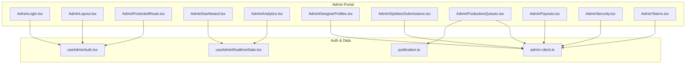

**Diagram sources**
- [AdminLogin.tsx](file://src/pages/admin/AdminLogin.tsx#L1-L158)
- [AdminProtectedRoute.tsx](file://src/components/auth/AdminProtectedRoute.tsx#L1-L52)
- [AdminLayout.tsx](file://src/components/admin/AdminLayout.tsx#L1-L238)
- [AdminDashboard.tsx](file://src/pages/admin/AdminDashboard.tsx#L1-L608)
- [AdminAnalytics.tsx](file://src/pages/admin/AdminAnalytics.tsx#L1-L313)
- [AdminDesignerProfiles.tsx](file://src/pages/admin/AdminDesignerProfiles.tsx#L1-L321)
- [AdminStyleboxSubmissions.tsx](file://src/pages/admin/AdminStyleboxSubmissions.tsx#L1-L823)
- [AdminProductionQueues.tsx](file://src/pages/admin/AdminProductionQueues.tsx#L1-L510)
- [AdminPayouts.tsx](file://src/pages/admin/AdminPayouts.tsx#L1-L296)
- [AdminSecurity.tsx](file://src/pages/admin/AdminSecurity.tsx#L1-L617)
- [AdminTeams.tsx](file://src/pages/admin/AdminTeams.tsx#L1-L369)
- [useAdminAuth.tsx](file://src/hooks/useAdminAuth.tsx#L1-L249)
- [admin-client.ts](file://src/integrations/supabase/admin-client.ts#L1-L28)
- [useAdminRealtimeStats.tsx](file://src/hooks/useAdminRealtimeStats.tsx#L1-L209)
- [publication.ts](file://src/lib/publication.ts#L1-L282)

**Section sources**
- [AdminDashboard.tsx](file://src/pages/admin/AdminDashboard.tsx#L1-L608)
- [AdminAnalytics.tsx](file://src/pages/admin/AdminAnalytics.tsx#L1-L313)
- [AdminDesignerProfiles.tsx](file://src/pages/admin/AdminDesignerProfiles.tsx#L1-L321)
- [AdminStyleboxSubmissions.tsx](file://src/pages/admin/AdminStyleboxSubmissions.tsx#L1-L823)
- [AdminProductionQueues.tsx](file://src/pages/admin/AdminProductionQueues.tsx#L1-L510)
- [AdminPayouts.tsx](file://src/pages/admin/AdminPayouts.tsx#L1-L296)
- [AdminSecurity.tsx](file://src/pages/admin/AdminSecurity.tsx#L1-L617)
- [AdminTeams.tsx](file://src/pages/admin/AdminTeams.tsx#L1-L369)
- [AdminLogin.tsx](file://src/pages/admin/AdminLogin.tsx#L1-L158)
- [AdminProtectedRoute.tsx](file://src/components/auth/AdminProtectedRoute.tsx#L1-L52)
- [AdminLayout.tsx](file://src/components/admin/AdminLayout.tsx#L1-L238)
- [useAdminAuth.tsx](file://src/hooks/useAdminAuth.tsx#L1-L249)
- [admin-client.ts](file://src/integrations/supabase/admin-client.ts#L1-L28)
- [useAdminRealtimeStats.tsx](file://src/hooks/useAdminRealtimeStats.tsx#L1-L209)
- [publication.ts](file://src/lib/publication.ts#L1-L282)

## Core Components
- Admin authentication and routing: Isolated admin session, role checks, and protected route enforcement
- Admin dashboard: Key metrics, pending reviews, top performers, and recent activity
- Analytics: Real-time metrics, revenue trends, and live activity feed
- Designer profiles: Approvals, feature toggles, and search/filters
- Stylebox submissions: Review modal, scoring, bulk actions, and filters
- Production queues: Stage-based workflow with actions and priority
- Financial operations: Payout requests, status updates, and revenue stats
- Security and access: Role management, audit logs, and admin invitations
- Team administration: Teams listing and team-based submission reviews

**Section sources**
- [useAdminAuth.tsx](file://src/hooks/useAdminAuth.tsx#L1-L249)
- [AdminProtectedRoute.tsx](file://src/components/auth/AdminProtectedRoute.tsx#L1-L52)
- [AdminDashboard.tsx](file://src/pages/admin/AdminDashboard.tsx#L1-L608)
- [AdminAnalytics.tsx](file://src/pages/admin/AdminAnalytics.tsx#L1-L313)
- [AdminDesignerProfiles.tsx](file://src/pages/admin/AdminDesignerProfiles.tsx#L1-L321)
- [AdminStyleboxSubmissions.tsx](file://src/pages/admin/AdminStyleboxSubmissions.tsx#L1-L823)
- [AdminProductionQueues.tsx](file://src/pages/admin/AdminProductionQueues.tsx#L1-L510)
- [AdminPayouts.tsx](file://src/pages/admin/AdminPayouts.tsx#L1-L296)
- [AdminSecurity.tsx](file://src/pages/admin/AdminSecurity.tsx#L1-L617)
- [AdminTeams.tsx](file://src/pages/admin/AdminTeams.tsx#L1-L369)

## Architecture Overview
The admin portal uses a dedicated Supabase client with isolated storage to keep admin sessions independent from the designer/studio app. Authentication state is managed centrally, with role-based access control enforced at the route level. Real-time updates are handled via Supabase channels for live dashboards and activity feeds.

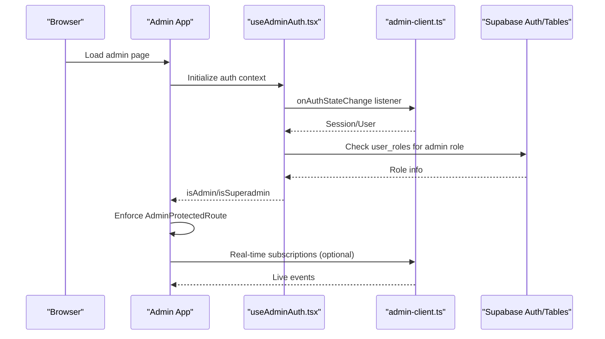

**Diagram sources**
- [useAdminAuth.tsx](file://src/hooks/useAdminAuth.tsx#L1-L249)
- [admin-client.ts](file://src/integrations/supabase/admin-client.ts#L1-L28)
- [AdminProtectedRoute.tsx](file://src/components/auth/AdminProtectedRoute.tsx#L1-L52)

**Section sources**
- [useAdminAuth.tsx](file://src/hooks/useAdminAuth.tsx#L1-L249)
- [admin-client.ts](file://src/integrations/supabase/admin-client.ts#L1-L28)
- [AdminProtectedRoute.tsx](file://src/components/auth/AdminProtectedRoute.tsx#L1-L52)

## Detailed Component Analysis

### Admin Authentication and Access Control
- Admin login validates credentials and records auth attempts in logs
- Role resolution checks user_roles for admin or superadmin
- Isolated storage prevents cross-session contamination
- Protected routes enforce role requirements and redirect unauthenticated or unauthorized users

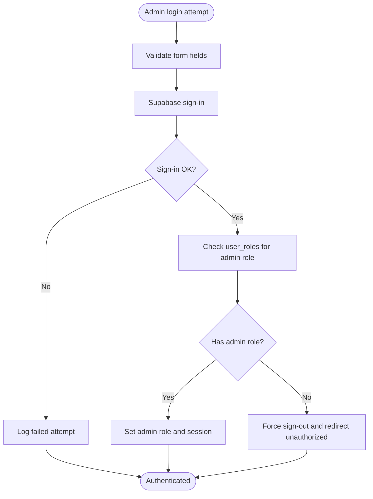

**Diagram sources**
- [AdminLogin.tsx](file://src/pages/admin/AdminLogin.tsx#L1-L158)
- [useAdminAuth.tsx](file://src/hooks/useAdminAuth.tsx#L1-L249)
- [admin-client.ts](file://src/integrations/supabase/admin-client.ts#L1-L28)

**Section sources**
- [AdminLogin.tsx](file://src/pages/admin/AdminLogin.tsx#L1-L158)
- [useAdminAuth.tsx](file://src/hooks/useAdminAuth.tsx#L1-L249)
- [AdminProtectedRoute.tsx](file://src/components/auth/AdminProtectedRoute.tsx#L1-L52)
- [admin-client.ts](file://src/integrations/supabase/admin-client.ts#L1-L28)

### Dashboard and Analytics
- Dashboard aggregates platform metrics, pending publications, top designers, and recent activity
- Analytics provides real-time stats, revenue charts, and a live activity feed
- Real-time subscriptions update metrics and activity as events occur

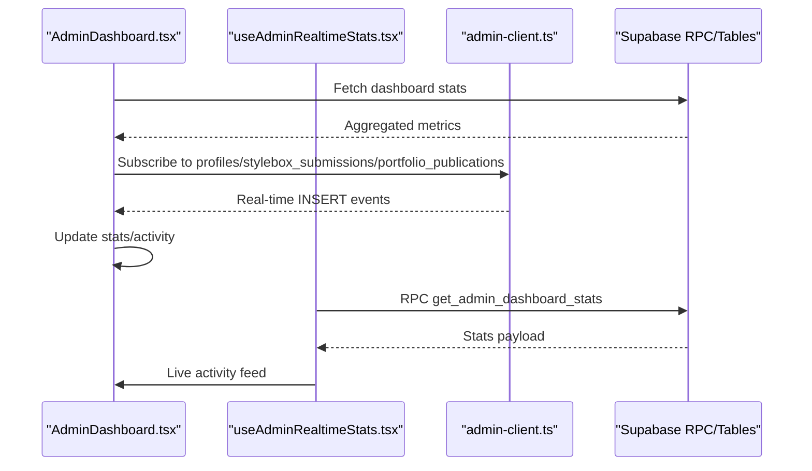

**Diagram sources**
- [AdminDashboard.tsx](file://src/pages/admin/AdminDashboard.tsx#L1-L608)
- [AdminAnalytics.tsx](file://src/pages/admin/AdminAnalytics.tsx#L1-L313)
- [useAdminRealtimeStats.tsx](file://src/hooks/useAdminRealtimeStats.tsx#L1-L209)
- [admin-client.ts](file://src/integrations/supabase/admin-client.ts#L1-L28)

**Section sources**
- [AdminDashboard.tsx](file://src/pages/admin/AdminDashboard.tsx#L1-L608)
- [AdminAnalytics.tsx](file://src/pages/admin/AdminAnalytics.tsx#L1-L313)
- [useAdminRealtimeStats.tsx](file://src/hooks/useAdminRealtimeStats.tsx#L1-L209)

### User Management for Designers and Administrators
- Designer profiles listing with search, status, and feature filters
- Approve/unapprove and feature/unfeature actions
- Admin role management and invitation workflow
- Audit logs for access and role changes

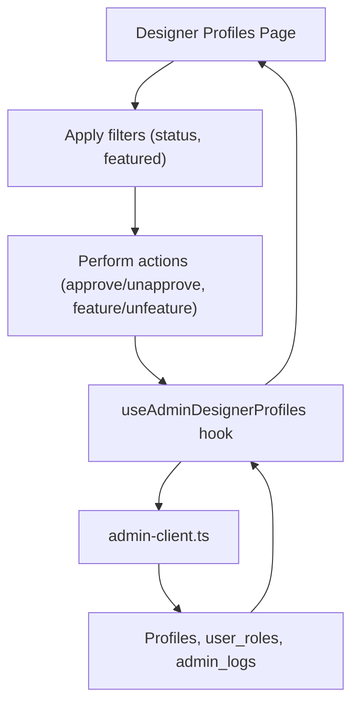

**Diagram sources**
- [AdminDesignerProfiles.tsx](file://src/pages/admin/AdminDesignerProfiles.tsx#L1-L321)
- [AdminSecurity.tsx](file://src/pages/admin/AdminSecurity.tsx#L1-L617)
- [admin-client.ts](file://src/integrations/supabase/admin-client.ts#L1-L28)

**Section sources**
- [AdminDesignerProfiles.tsx](file://src/pages/admin/AdminDesignerProfiles.tsx#L1-L321)
- [AdminSecurity.tsx](file://src/pages/admin/AdminSecurity.tsx#L1-L617)

### Content Moderation for Stylebox Submissions
- Submission grid with status badges, designer info, and file counts
- Review modal with approval/rejection actions, scoring slider, and feedback
- Bulk actions for approving or rejecting multiple submissions
- Advanced filters by status, category, difficulty, stylebox, and date range

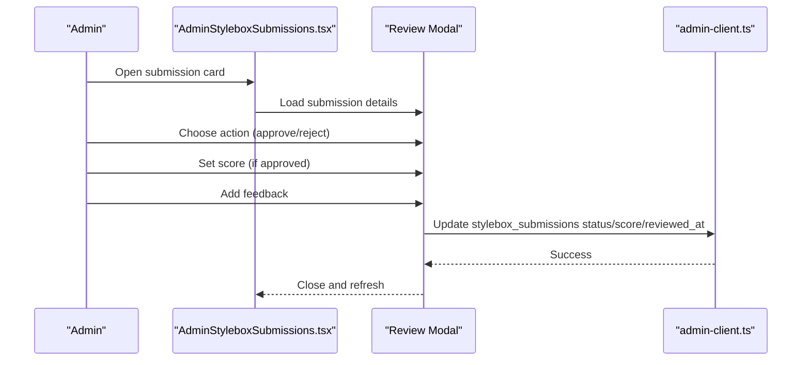

**Diagram sources**
- [AdminStyleboxSubmissions.tsx](file://src/pages/admin/AdminStyleboxSubmissions.tsx#L1-L823)
- [admin-client.ts](file://src/integrations/supabase/admin-client.ts#L1-L28)

**Section sources**
- [AdminStyleboxSubmissions.tsx](file://src/pages/admin/AdminStyleboxSubmissions.tsx#L1-L823)

### Production Queue Management
- Stage-based queues: Submission, Sampling, Tech Pack, Pre-Production, Marketplace
- Priority calculation based on priority_score and time thresholds
- Action dialogs to move items through the workflow with optional notes
- Stats header showing queue sizes and completion metrics

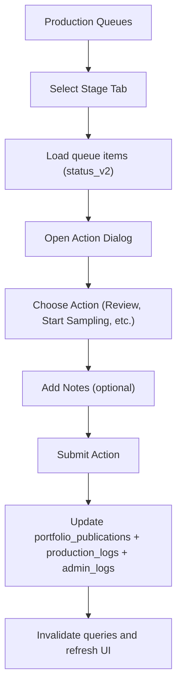

**Diagram sources**
- [AdminProductionQueues.tsx](file://src/pages/admin/AdminProductionQueues.tsx#L1-L510)
- [publication.ts](file://src/lib/publication.ts#L1-L282)
- [admin-client.ts](file://src/integrations/supabase/admin-client.ts#L1-L28)

**Section sources**
- [AdminProductionQueues.tsx](file://src/pages/admin/AdminProductionQueues.tsx#L1-L510)
- [publication.ts](file://src/lib/publication.ts#L1-L282)

### Financial Oversight
- Payouts listing with status indicators and amount totals
- Revenue statistics including total earned, paid, pending, and payout rate
- Approve payout requests and synchronize data

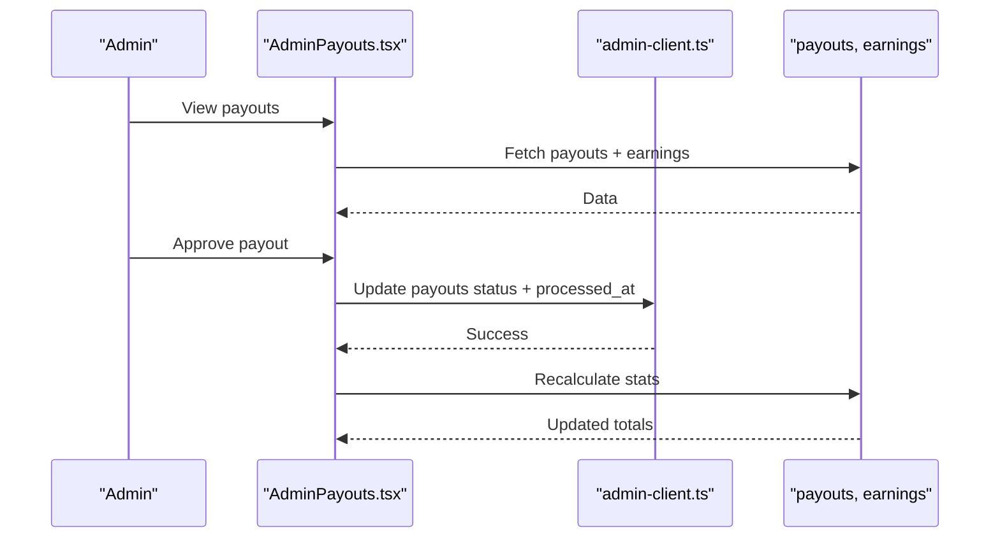

**Diagram sources**
- [AdminPayouts.tsx](file://src/pages/admin/AdminPayouts.tsx#L1-L296)
- [admin-client.ts](file://src/integrations/supabase/admin-client.ts#L1-L28)

**Section sources**
- [AdminPayouts.tsx](file://src/pages/admin/AdminPayouts.tsx#L1-L296)

### Team Administration
- Teams listing with member counts and creation dates
- Team-based stylebox submissions with status review
- Approve or reject submissions with internal feedback

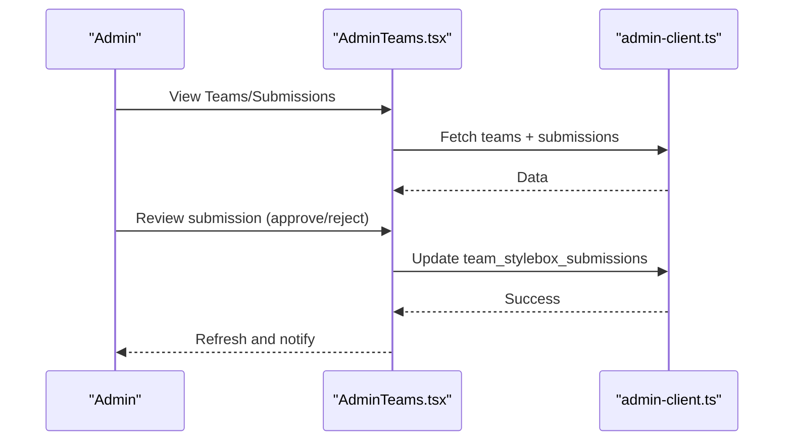

**Diagram sources**
- [AdminTeams.tsx](file://src/pages/admin/AdminTeams.tsx#L1-L369)
- [admin-client.ts](file://src/integrations/supabase/admin-client.ts#L1-L28)

**Section sources**
- [AdminTeams.tsx](file://src/pages/admin/AdminTeams.tsx#L1-L369)

### Security and Access Controls
- Role management: Promote/demote to superadmin/admin; revoke access
- Audit logs: Track admin actions and auth events
- Admin invitations: Invite new administrators with role selection and messaging

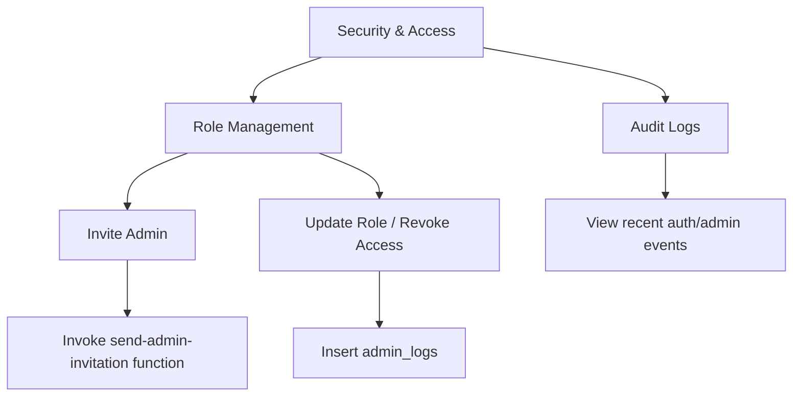

**Diagram sources**
- [AdminSecurity.tsx](file://src/pages/admin/AdminSecurity.tsx#L1-L617)
- [admin-client.ts](file://src/integrations/supabase/admin-client.ts#L1-L28)

**Section sources**
- [AdminSecurity.tsx](file://src/pages/admin/AdminSecurity.tsx#L1-L617)

## Dependency Analysis
- Centralized admin auth context manages role and session state
- Dedicated admin Supabase client with isolated storage
- Real-time stats via RPC and Postgres changes
- Workflow logic centralized in publication library for queue stages and transitions

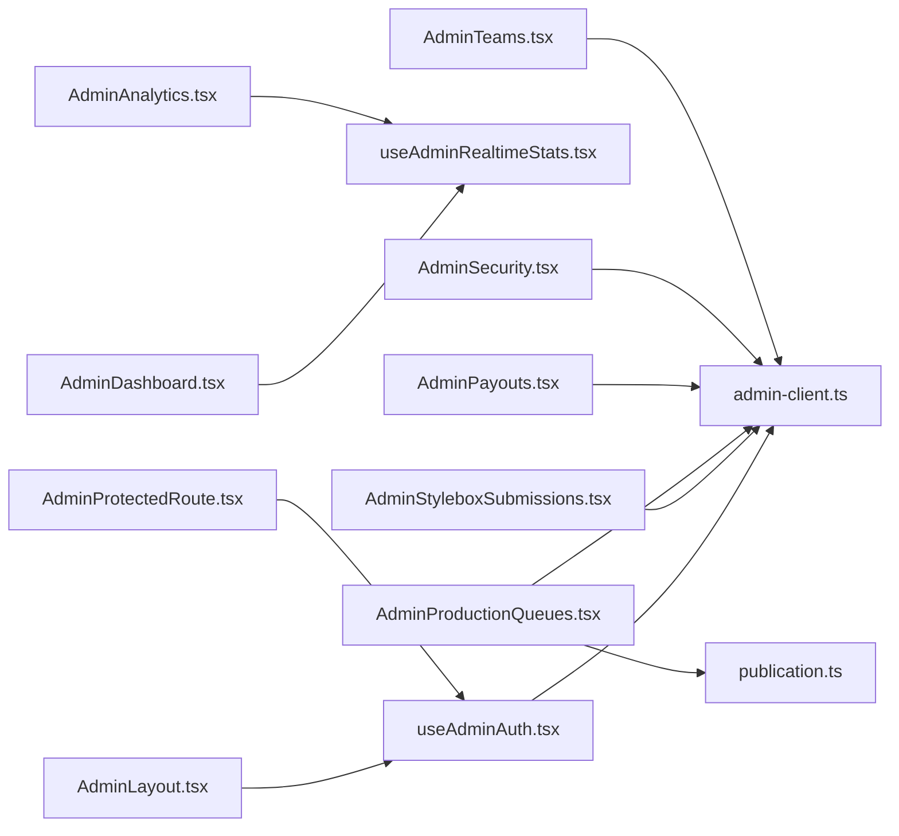

**Diagram sources**
- [useAdminAuth.tsx](file://src/hooks/useAdminAuth.tsx#L1-L249)
- [admin-client.ts](file://src/integrations/supabase/admin-client.ts#L1-L28)
- [AdminLayout.tsx](file://src/components/admin/AdminLayout.tsx#L1-L238)
- [AdminProtectedRoute.tsx](file://src/components/auth/AdminProtectedRoute.tsx#L1-L52)
- [AdminDashboard.tsx](file://src/pages/admin/AdminDashboard.tsx#L1-L608)
- [AdminAnalytics.tsx](file://src/pages/admin/AdminAnalytics.tsx#L1-L313)
- [AdminStyleboxSubmissions.tsx](file://src/pages/admin/AdminStyleboxSubmissions.tsx#L1-L823)
- [AdminProductionQueues.tsx](file://src/pages/admin/AdminProductionQueues.tsx#L1-L510)
- [AdminPayouts.tsx](file://src/pages/admin/AdminPayouts.tsx#L1-L296)
- [AdminSecurity.tsx](file://src/pages/admin/AdminSecurity.tsx#L1-L617)
- [AdminTeams.tsx](file://src/pages/admin/AdminTeams.tsx#L1-L369)
- [useAdminRealtimeStats.tsx](file://src/hooks/useAdminRealtimeStats.tsx#L1-L209)
- [publication.ts](file://src/lib/publication.ts#L1-L282)

**Section sources**
- [useAdminAuth.tsx](file://src/hooks/useAdminAuth.tsx#L1-L249)
- [admin-client.ts](file://src/integrations/supabase/admin-client.ts#L1-L28)
- [AdminProductionQueues.tsx](file://src/pages/admin/AdminProductionQueues.tsx#L1-L510)
- [publication.ts](file://src/lib/publication.ts#L1-L282)

## Performance Considerations
- Real-time subscriptions update metrics without polling; configure intervals carefully
- Use query caching and invalidation to minimize redundant network calls
- Batch operations for bulk actions reduce repeated mutations
- Pagination and filtering limit large dataset rendering

[No sources needed since this section provides general guidance]

## Troubleshooting Guide
- Authentication issues: Verify admin role resolution and isolated storage keys
- Route protection: Ensure AdminProtectedRoute is applied to admin routes
- Real-time updates: Confirm Supabase channel subscriptions and RPC availability
- Data sync: Use refresh buttons and query invalidation for immediate updates

**Section sources**
- [useAdminAuth.tsx](file://src/hooks/useAdminAuth.tsx#L1-L249)
- [AdminProtectedRoute.tsx](file://src/components/auth/AdminProtectedRoute.tsx#L1-L52)
- [useAdminRealtimeStats.tsx](file://src/hooks/useAdminRealtimeStats.tsx#L1-L209)

## Conclusion
The admin panel provides a comprehensive toolkit for platform oversight, combining secure authentication, real-time analytics, content moderation, production workflow orchestration, financial controls, and robust security management. Administrators can efficiently review designer submissions, manage user profiles, track revenue, oversee production stages, approve payouts, and maintain strict access controls—all through a unified, role-aware interface.