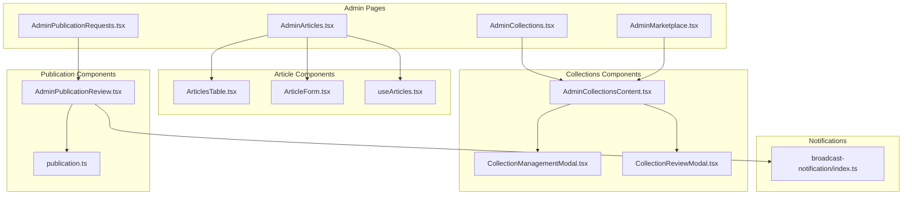
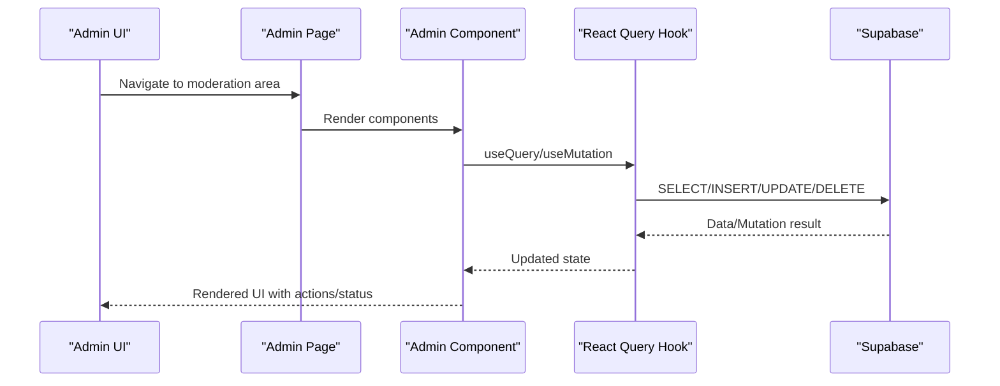
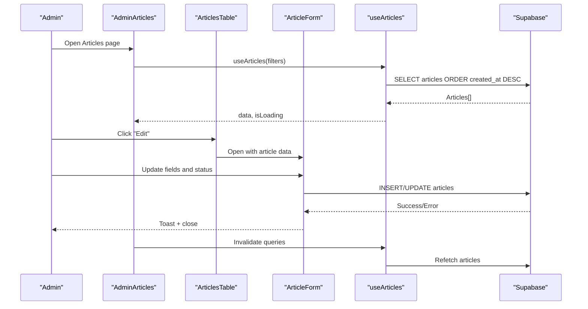
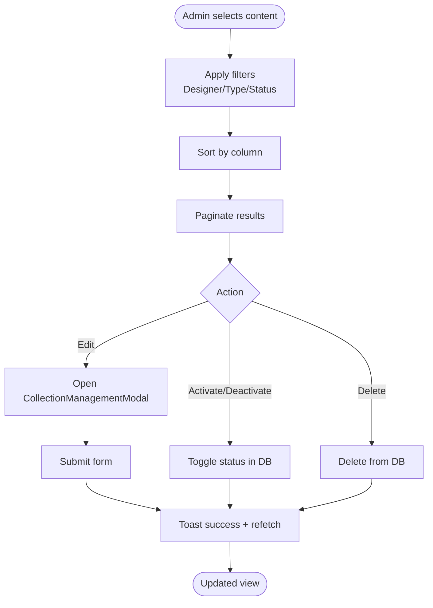
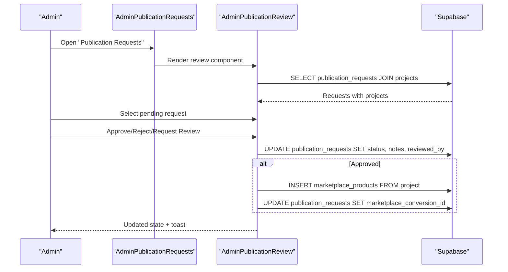
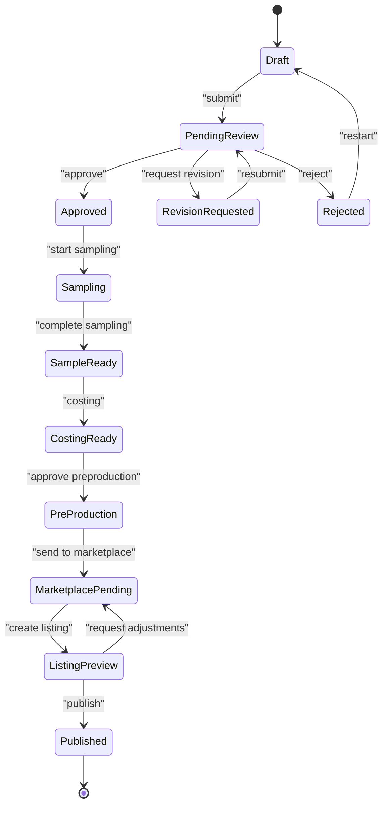
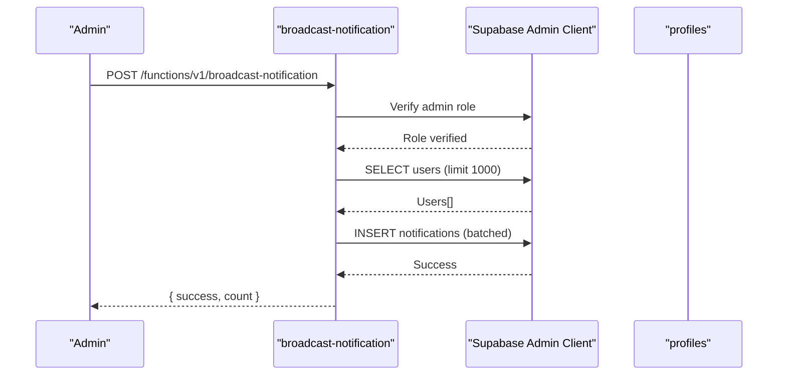
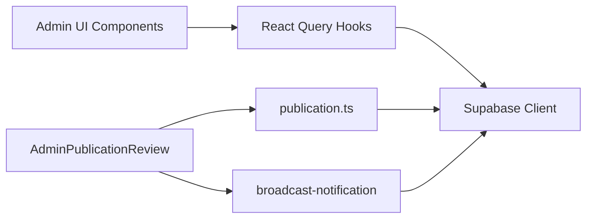

# Content Moderation

<cite>
**Referenced Files in This Document**
- [AdminArticles.tsx](file://src/pages/admin/AdminArticles.tsx)
- [ArticlesTable.tsx](file://src/components/admin/articles/ArticlesTable.tsx)
- [ArticleForm.tsx](file://src/components/admin/articles/ArticleForm.tsx)
- [useArticles.tsx](file://src/hooks/useArticles.tsx)
- [AdminCollections.tsx](file://src/pages/admin/AdminCollections.tsx)
- [AdminCollectionsContent.tsx](file://src/components/admin/marketplace/AdminCollectionsContent.tsx)
- [CollectionManagementModal.tsx](file://src/components/admin/CollectionManagementModal.tsx)
- [CollectionReviewModal.tsx](file://src/components/admin/CollectionReviewModal.tsx)
- [AdminMarketplace.tsx](file://src/pages/admin/AdminMarketplace.tsx)
- [AdminPublicationRequests.tsx](file://src/pages/admin/AdminPublicationRequests.tsx)
- [AdminPublicationReview.tsx](file://src/components/projects/AdminPublicationReview.tsx)
- [publication.ts](file://src/lib/publication.ts)
- [broadcast-notification/index.ts](file://supabase/functions/broadcast-notification/index.ts)
</cite>

## Table of Contents
1. [Introduction](#introduction)
2. [Project Structure](#project-structure)
3. [Core Components](#core-components)
4. [Architecture Overview](#architecture-overview)
5. [Detailed Component Analysis](#detailed-component-analysis)
6. [Dependency Analysis](#dependency-analysis)
7. [Performance Considerations](#performance-considerations)
8. [Troubleshooting Guide](#troubleshooting-guide)
9. [Conclusion](#conclusion)
10. [Appendices](#appendices)

## Introduction
This document describes the admin content moderation system across three primary domains:
- Blog post management and moderation workflows for articles
- Marketplace collections management including approval processes and quality control
- Designer portfolio publication review with review queues and approval workflows

It also covers automated notifications and status tracking, along with practical examples of moderation actions, approvals, reviews, and maintaining content quality standards. Guidance on spam detection, content policy enforcement, and automated moderation tools is included.

## Project Structure
The moderation system spans several admin pages and components:
- Article management: Admin page, table, and form
- Marketplace collections: Admin page, combined content view, and modals for creation/editing and review
- Publication requests: Admin page and review component for designer portfolio submissions
- Supporting libraries: Publication lifecycle definitions and broadcast notification function

**Diagram sources**
- [AdminArticles.tsx](file://src/pages/admin/AdminArticles.tsx#L1-L180)
- [ArticlesTable.tsx](file://src/components/admin/articles/ArticlesTable.tsx#L1-L159)
- [ArticleForm.tsx](file://src/components/admin/articles/ArticleForm.tsx#L1-L364)
- [useArticles.tsx](file://src/hooks/useArticles.tsx#L1-L175)
- [AdminCollections.tsx](file://src/pages/admin/AdminCollections.tsx#L1-L17)
- [AdminCollectionsContent.tsx](file://src/components/admin/marketplace/AdminCollectionsContent.tsx#L1-L752)
- [CollectionManagementModal.tsx](file://src/components/admin/CollectionManagementModal.tsx#L1-L969)
- [CollectionReviewModal.tsx](file://src/components/admin/CollectionReviewModal.tsx#L1-L366)
- [AdminMarketplace.tsx](file://src/pages/admin/AdminMarketplace.tsx#L1-L217)
- [AdminPublicationRequests.tsx](file://src/pages/admin/AdminPublicationRequests.tsx#L1-L36)
- [AdminPublicationReview.tsx](file://src/components/projects/AdminPublicationReview.tsx#L1-L432)
- [publication.ts](file://src/lib/publication.ts#L1-L282)
- [broadcast-notification/index.ts](file://supabase/functions/broadcast-notification/index.ts#L1-L149)

**Section sources**
- [AdminArticles.tsx](file://src/pages/admin/AdminArticles.tsx#L1-L180)
- [AdminCollections.tsx](file://src/pages/admin/AdminCollections.tsx#L1-L17)
- [AdminMarketplace.tsx](file://src/pages/admin/AdminMarketplace.tsx#L1-L217)
- [AdminPublicationRequests.tsx](file://src/pages/admin/AdminPublicationRequests.tsx#L1-L36)

## Core Components
- Article management
  - Admin page with filters, stats, and tabbed views
  - Articles table with status badges, actions, and deletion
  - Article form with content, SEO, and preview tabs; sanitization and status transitions
  - Hooks for CRUD operations and filtering
- Marketplace collections
  - Unified content view combining products and articles
  - Filtering by designer, type, and status; pagination and sorting
  - Actions: edit, activate/deactivate, delete
  - Modals for adding/editing content and reviewing submissions
- Publication requests
  - Review queue with pending/all tabs
  - Request details panel, asset previews, and admin notes
  - Approval/rejection/under-review decisions with automatic marketplace conversion
- Publication lifecycle
  - Status definitions, transitions, eligibility rules, and production queues
- Notifications
  - Broadcast notification function for admin-initiated system-wide alerts

**Section sources**
- [ArticlesTable.tsx](file://src/components/admin/articles/ArticlesTable.tsx#L1-L159)
- [ArticleForm.tsx](file://src/components/admin/articles/ArticleForm.tsx#L1-L364)
- [useArticles.tsx](file://src/hooks/useArticles.tsx#L1-L175)
- [AdminCollectionsContent.tsx](file://src/components/admin/marketplace/AdminCollectionsContent.tsx#L1-L752)
- [CollectionManagementModal.tsx](file://src/components/admin/CollectionManagementModal.tsx#L1-L969)
- [CollectionReviewModal.tsx](file://src/components/admin/CollectionReviewModal.tsx#L1-L366)
- [AdminPublicationReview.tsx](file://src/components/projects/AdminPublicationReview.tsx#L1-L432)
- [publication.ts](file://src/lib/publication.ts#L1-L282)
- [broadcast-notification/index.ts](file://supabase/functions/broadcast-notification/index.ts#L1-L149)

## Architecture Overview
The moderation system integrates UI components with backend data via Supabase queries and mutations. Admin actions trigger updates to article/product statuses, publication request decisions, and notification broadcasts.

**Diagram sources**
- [AdminArticles.tsx](file://src/pages/admin/AdminArticles.tsx#L25-L28)
- [useArticles.tsx](file://src/hooks/useArticles.tsx#L33-L60)
- [AdminCollectionsContent.tsx](file://src/components/admin/marketplace/AdminCollectionsContent.tsx#L104-L199)
- [AdminPublicationReview.tsx](file://src/components/projects/AdminPublicationReview.tsx#L19-L57)

## Detailed Component Analysis

### Article Management Interface
- Purpose: Create, edit, review, and moderate blog posts
- Key capabilities:
  - Filter by status (all/published/draft/archived)
  - Search by title
  - Stats cards for totals, published, drafts, featured, and total views
  - Table with status badges, category, published date, view counts, and actions (edit, view live, delete)
  - Form with content, SEO, and preview tabs; auto-generated slug from title; sanitization; featured toggles; status transitions
- Quality controls:
  - Input sanitization for titles, excerpts, rich text, and meta fields
  - Status-driven actions (publish/unpublish)
  - Featured flagging for prominence

**Diagram sources**
- [AdminArticles.tsx](file://src/pages/admin/AdminArticles.tsx#L25-L28)
- [ArticlesTable.tsx](file://src/components/admin/articles/ArticlesTable.tsx#L37-L59)
- [ArticleForm.tsx](file://src/components/admin/articles/ArticleForm.tsx#L104-L139)
- [useArticles.tsx](file://src/hooks/useArticles.tsx#L99-L165)

**Section sources**
- [AdminArticles.tsx](file://src/pages/admin/AdminArticles.tsx#L1-L180)
- [ArticlesTable.tsx](file://src/components/admin/articles/ArticlesTable.tsx#L1-L159)
- [ArticleForm.tsx](file://src/components/admin/articles/ArticleForm.tsx#L1-L364)
- [useArticles.tsx](file://src/hooks/useArticles.tsx#L1-L175)

### Marketplace Collections Management
- Purpose: Oversee products and articles from all designers; approve, deactivate, or delete content
- Key capabilities:
  - Unified content view combining products and articles
  - Filters: designer, content type, status
  - Sorting and pagination
  - Actions: edit, activate/deactivate, delete
  - Modals:
    - CollectionManagementModal: create/update product/article with image upload, auto-save, and progress indicators
    - CollectionReviewModal: review designer submissions with status updates and feedback
- Quality control:
  - Status toggling between live/published and draft/archived
  - Featured flags for products (limited edition, made-to-order)
  - Image validation and chunked upload simulation

**Diagram sources**
- [AdminCollectionsContent.tsx](file://src/components/admin/marketplace/AdminCollectionsContent.tsx#L252-L322)
- [CollectionManagementModal.tsx](file://src/components/admin/CollectionManagementModal.tsx#L397-L519)

**Section sources**
- [AdminCollections.tsx](file://src/pages/admin/AdminCollections.tsx#L1-L17)
- [AdminCollectionsContent.tsx](file://src/components/admin/marketplace/AdminCollectionsContent.tsx#L1-L752)
- [CollectionManagementModal.tsx](file://src/components/admin/CollectionManagementModal.tsx#L1-L969)
- [CollectionReviewModal.tsx](file://src/components/admin/CollectionReviewModal.tsx#L1-L366)

### Publication Request Review System
- Purpose: Review designer portfolio submissions and approve them for marketplace listing
- Key capabilities:
  - Pending/all tabs with counts
  - Request list with status badges
  - Details panel with project info and asset previews
  - Admin actions: approve, request review, reject
  - Automatic marketplace product creation upon approval
  - Admin notes and reviewer tracking
- Workflow:
  - Load requests with related project data
  - On approval, convert to marketplace product and link back to request
  - Update status and reviewer metadata

**Diagram sources**
- [AdminPublicationRequests.tsx](file://src/pages/admin/AdminPublicationRequests.tsx#L1-L36)
- [AdminPublicationReview.tsx](file://src/components/projects/AdminPublicationReview.tsx#L19-L127)
- [publication.ts](file://src/lib/publication.ts#L36-L157)

**Section sources**
- [AdminPublicationRequests.tsx](file://src/pages/admin/AdminPublicationRequests.tsx#L1-L36)
- [AdminPublicationReview.tsx](file://src/components/projects/AdminPublicationReview.tsx#L1-L432)
- [publication.ts](file://src/lib/publication.ts#L1-L282)

### Publication Lifecycle and Eligibility
- Defines publication statuses, stages, transitions, and eligibility rules
- Supports production queues and progress calculation
- Provides auto-approval logic and deadlines

**Diagram sources**
- [publication.ts](file://src/lib/publication.ts#L36-L157)
- [publication.ts](file://src/lib/publication.ts#L252-L265)

**Section sources**
- [publication.ts](file://src/lib/publication.ts#L1-L282)

### Automated Notifications
- Broadcast notification function supports admin-initiated system-wide alerts
- Verifies admin role and inserts notifications in batches

**Diagram sources**
- [broadcast-notification/index.ts](file://supabase/functions/broadcast-notification/index.ts#L8-L148)

**Section sources**
- [broadcast-notification/index.ts](file://supabase/functions/broadcast-notification/index.ts#L1-L149)

## Dependency Analysis
- UI components depend on React Query for data fetching and mutations
- Supabase client is used for database operations
- Publication lifecycle library defines shared status and transition logic
- Notification function is invoked from the review component workflow

**Diagram sources**
- [AdminArticles.tsx](file://src/pages/admin/AdminArticles.tsx#L25-L28)
- [AdminCollectionsContent.tsx](file://src/components/admin/marketplace/AdminCollectionsContent.tsx#L104-L199)
- [AdminPublicationReview.tsx](file://src/components/projects/AdminPublicationReview.tsx#L19-L57)
- [publication.ts](file://src/lib/publication.ts#L1-L282)
- [broadcast-notification/index.ts](file://supabase/functions/broadcast-notification/index.ts#L1-L149)

**Section sources**
- [AdminArticles.tsx](file://src/pages/admin/AdminArticles.tsx#L1-L180)
- [AdminCollectionsContent.tsx](file://src/components/admin/marketplace/AdminCollectionsContent.tsx#L1-L752)
- [AdminPublicationReview.tsx](file://src/components/projects/AdminPublicationReview.tsx#L1-L432)
- [publication.ts](file://src/lib/publication.ts#L1-L282)
- [broadcast-notification/index.ts](file://supabase/functions/broadcast-notification/index.ts#L1-L149)

## Performance Considerations
- Use React Query caching and invalidation to minimize redundant queries
- Paginate and sort client-side for large datasets
- Debounced auto-save for forms to reduce write frequency
- Chunked upload simulation with progress indicators improves UX
- Batched notification insertion prevents timeouts and large payloads

## Troubleshooting Guide
- Articles not loading
  - Check query filters and error states in the articles hook
  - Verify Supabase RLS policies for admin client
- Collections not updating
  - Confirm mutation callbacks and refetch logic
  - Validate status toggling and delete operations
- Publication approvals failing
  - Inspect request update and product conversion steps
  - Ensure linked marketplace conversion IDs are recorded
- Notifications not sent
  - Verify admin role checks and service role key configuration
  - Confirm user limit and batch insertion logic

**Section sources**
- [useArticles.tsx](file://src/hooks/useArticles.tsx#L145-L165)
- [AdminCollectionsContent.tsx](file://src/components/admin/marketplace/AdminCollectionsContent.tsx#L345-L386)
- [AdminPublicationReview.tsx](file://src/components/projects/AdminPublicationReview.tsx#L90-L127)
- [broadcast-notification/index.ts](file://supabase/functions/broadcast-notification/index.ts#L39-L62)

## Conclusion
The admin content moderation system provides comprehensive tools for managing articles, marketplace collections, and designer publication requests. It emphasizes quality control, clear workflows, and automated support through notifications and lifecycle management. Administrators can efficiently moderate content, enforce policies, and maintain high-quality standards across the platform.

## Appendices

### Examples and Workflows
- Moderating content
  - Use the articles page to filter by status and search by title
  - Edit articles via the form; ensure sanitization and proper status transitions
  - Delete articles with confirmation dialogs
- Approving collections
  - In the collections view, activate/deactivate content or delete as needed
  - Use the management modal to create or update products/articles with image uploads
- Reviewing publication requests
  - Navigate to the publication requests page
  - Review details and assets; approve to create a marketplace product or request revisions/reject
- Managing content quality standards
  - Enforce required fields and completeness thresholds
  - Use status badges and sorting to track quality and progress
- Spam detection and policy enforcement
  - Monitor flagged content and apply deactivation or deletion
  - Use admin notes to communicate policy violations and required changes
- Automated moderation tools
  - Utilize auto-save in content modals to preserve work
  - Leverage broadcast notifications for system-wide announcements

[No sources needed since this section provides practical guidance derived from analyzed components]