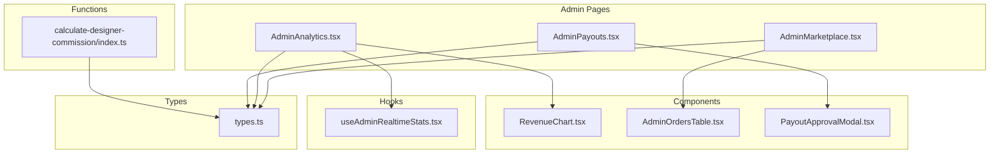
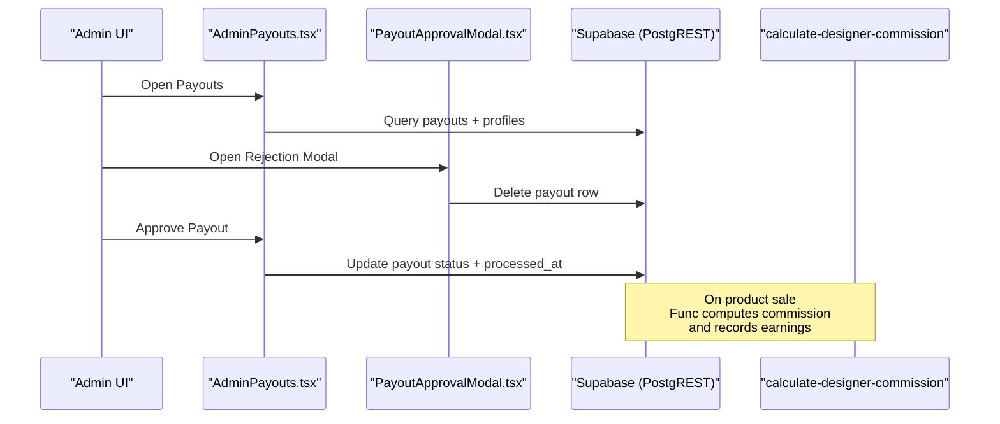
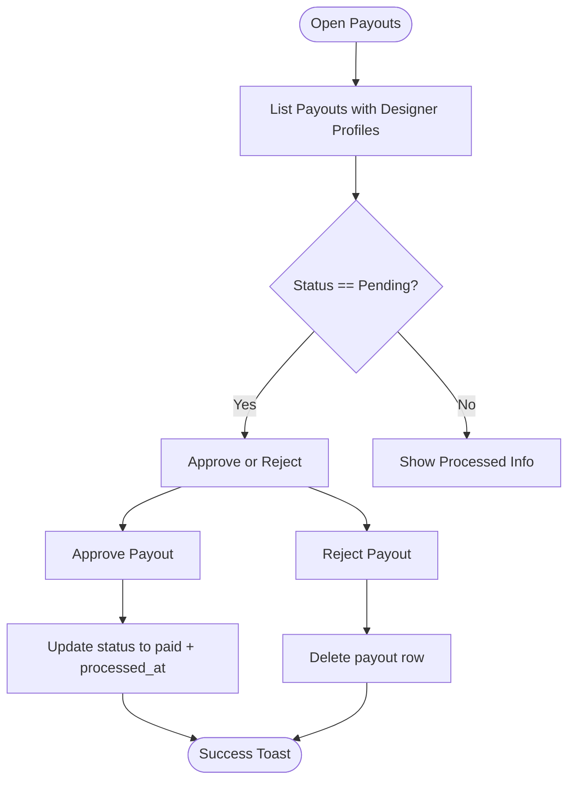
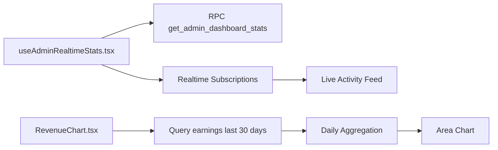
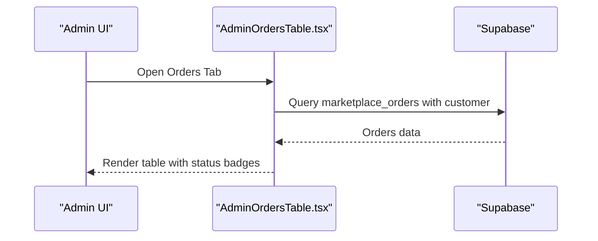
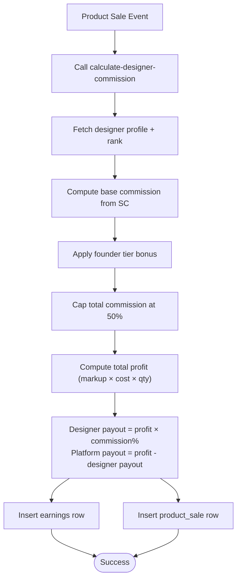
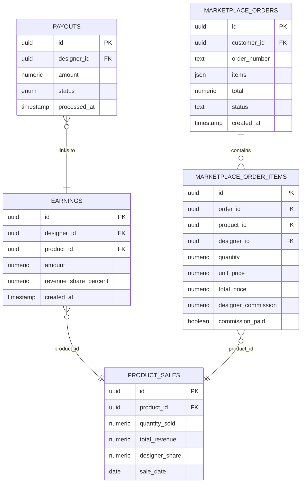
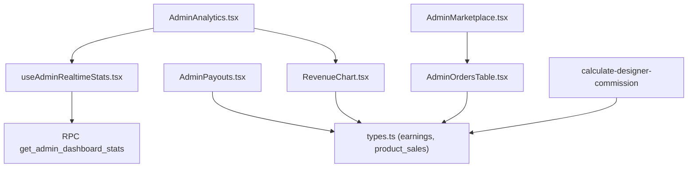

# Financial Management

<cite>
**Referenced Files in This Document**
- [AdminPayouts.tsx](file://src/pages/admin/AdminPayouts.tsx)
- [PayoutApprovalModal.tsx](file://src/components/admin/PayoutApprovalModal.tsx)
- [AdminAnalytics.tsx](file://src/pages/admin/AdminAnalytics.tsx)
- [RevenueChart.tsx](file://src/components/admin/RevenueChart.tsx)
- [AdminMarketplace.tsx](file://src/pages/admin/AdminMarketplace.tsx)
- [AdminOrdersTable.tsx](file://src/components/admin/marketplace/AdminOrdersTable.tsx)
- [calculate-designer-commission/index.ts](file://supabase/functions/calculate-designer-commission/index.ts)
- [useAdminRealtimeStats.tsx](file://src/hooks/useAdminRealtimeStats.tsx)
- [types.ts](file://src/integrations/supabase/types.ts)
</cite>

## Table of Contents
1. [Introduction](#introduction)
2. [Project Structure](#project-structure)
3. [Core Components](#core-components)
4. [Architecture Overview](#architecture-overview)
5. [Detailed Component Analysis](#detailed-component-analysis)
6. [Dependency Analysis](#dependency-analysis)
7. [Performance Considerations](#performance-considerations)
8. [Troubleshooting Guide](#troubleshooting-guide)
9. [Conclusion](#conclusion)

## Introduction
This document describes the admin financial management system, focusing on:
- Payout approval workflow for designer commissions and revenue sharing
- Revenue tracking with charts and analytics for monthly and yearly performance
- Order management interface for marketplace transactions and financial settlements
- Payout approval modal for processing designer payments and commission calculations
- Examples of approving payouts, tracking revenue streams, managing financial reports, and handling payment disputes
- Tax reporting, financial audits, and automated payout processing systems

## Project Structure
The financial management system spans React admin pages, reusable UI components, Supabase-backed analytics, and serverless functions for commission calculations.

**Diagram sources**
- [AdminPayouts.tsx](file://src/pages/admin/AdminPayouts.tsx#L1-L296)
- [AdminAnalytics.tsx](file://src/pages/admin/AdminAnalytics.tsx#L1-L313)
- [AdminMarketplace.tsx](file://src/pages/admin/AdminMarketplace.tsx#L1-L257)
- [RevenueChart.tsx](file://src/components/admin/RevenueChart.tsx#L1-L95)
- [AdminOrdersTable.tsx](file://src/components/admin/marketplace/AdminOrdersTable.tsx#L1-L144)
- [PayoutApprovalModal.tsx](file://src/components/admin/PayoutApprovalModal.tsx#L1-L123)
- [useAdminRealtimeStats.tsx](file://src/hooks/useAdminRealtimeStats.tsx#L1-L209)
- [calculate-designer-commission/index.ts](file://supabase/functions/calculate-designer-commission/index.ts#L1-L209)
- [types.ts](file://src/integrations/supabase/types.ts#L1349-L1372)

**Section sources**
- [AdminPayouts.tsx](file://src/pages/admin/AdminPayouts.tsx#L1-L296)
- [AdminAnalytics.tsx](file://src/pages/admin/AdminAnalytics.tsx#L1-L313)
- [AdminMarketplace.tsx](file://src/pages/admin/AdminMarketplace.tsx#L1-L257)
- [RevenueChart.tsx](file://src/components/admin/RevenueChart.tsx#L1-L95)
- [AdminOrdersTable.tsx](file://src/components/admin/marketplace/AdminOrdersTable.tsx#L1-L144)
- [PayoutApprovalModal.tsx](file://src/components/admin/PayoutApprovalModal.tsx#L1-L123)
- [useAdminRealtimeStats.tsx](file://src/hooks/useAdminRealtimeStats.tsx#L1-L209)
- [calculate-designer-commission/index.ts](file://supabase/functions/calculate-designer-commission/index.ts#L1-L209)
- [types.ts](file://src/integrations/supabase/types.ts#L1349-L1372)

## Core Components
- Payout management page: Lists pending and processed payouts, supports search and bulk actions.
- Payout approval modal: Handles rejection of payout requests with reason logging.
- Analytics dashboard: Displays real-time metrics, revenue trends, and live activity feed.
- Revenue chart: Aggregates earnings over the last 30 days for visualization.
- Marketplace orders table: Shows transaction statuses and settlement-related details.
- Commission calculator: Serverless function computing designer payouts and recording earnings.

**Section sources**
- [AdminPayouts.tsx](file://src/pages/admin/AdminPayouts.tsx#L35-L292)
- [PayoutApprovalModal.tsx](file://src/components/admin/PayoutApprovalModal.tsx#L25-L122)
- [AdminAnalytics.tsx](file://src/pages/admin/AdminAnalytics.tsx#L31-L310)
- [RevenueChart.tsx](file://src/components/admin/RevenueChart.tsx#L6-L94)
- [AdminOrdersTable.tsx](file://src/components/admin/marketplace/AdminOrdersTable.tsx#L32-L143)
- [calculate-designer-commission/index.ts](file://supabase/functions/calculate-designer-commission/index.ts#L41-L208)

## Architecture Overview
The system integrates frontend admin pages with Supabase for data and analytics, and serverless functions for financial computations.

**Diagram sources**
- [AdminPayouts.tsx](file://src/pages/admin/AdminPayouts.tsx#L40-L103)
- [PayoutApprovalModal.tsx](file://src/components/admin/PayoutApprovalModal.tsx#L34-L60)
- [calculate-designer-commission/index.ts](file://supabase/functions/calculate-designer-commission/index.ts#L55-L182)

## Detailed Component Analysis

### Payout Approval Workflow
The workflow manages designer payouts from request to approval or rejection.

- Approve: Updates payout status to paid and timestamps processing.
- Reject: Removes the payout row; in a production system, consider adding a dedicated rejection status and audit trail.

**Diagram sources**
- [AdminPayouts.tsx](file://src/pages/admin/AdminPayouts.tsx#L87-L103)
- [PayoutApprovalModal.tsx](file://src/components/admin/PayoutApprovalModal.tsx#L34-L60)

**Section sources**
- [AdminPayouts.tsx](file://src/pages/admin/AdminPayouts.tsx#L87-L103)
- [PayoutApprovalModal.tsx](file://src/components/admin/PayoutApprovalModal.tsx#L34-L60)

### Revenue Tracking and Analytics
The analytics dashboard aggregates platform metrics and visualizes revenue trends.

- Real-time stats refresh every 30 seconds and subscribe to new rows in profiles, stylebox_submissions, portfolio_publications, and earnings.
- Revenue chart aggregates earnings by day and renders an area chart.

**Diagram sources**
- [useAdminRealtimeStats.tsx](file://src/hooks/useAdminRealtimeStats.tsx#L28-L49)
- [useAdminRealtimeStats.tsx](file://src/hooks/useAdminRealtimeStats.tsx#L114-L184)
- [RevenueChart.tsx](file://src/components/admin/RevenueChart.tsx#L7-L44)

**Section sources**
- [AdminAnalytics.tsx](file://src/pages/admin/AdminAnalytics.tsx#L31-L310)
- [useAdminRealtimeStats.tsx](file://src/hooks/useAdminRealtimeStats.tsx#L24-L208)
- [RevenueChart.tsx](file://src/components/admin/RevenueChart.tsx#L6-L94)

### Marketplace Orders and Settlements
The marketplace orders table displays transaction details and settlement statuses.

- Supports viewing order details and updating status via dropdown actions.
- Settlements tie into the broader financial system through product sales and earnings.

**Diagram sources**
- [AdminMarketplace.tsx](file://src/pages/admin/AdminMarketplace.tsx#L29-L93)
- [AdminOrdersTable.tsx](file://src/components/admin/marketplace/AdminOrdersTable.tsx#L32-L48)

**Section sources**
- [AdminMarketplace.tsx](file://src/pages/admin/AdminMarketplace.tsx#L31-L235)
- [AdminOrdersTable.tsx](file://src/components/admin/marketplace/AdminOrdersTable.tsx#L32-L143)

### Commission Calculation and Automated Payout Processing
Designer payouts are computed serverlessly and earnings recorded for revenue tracking.

- Uses markup multiplier and SC thresholds to compute designer share.
- Records earnings and sales for downstream analytics and payout triggers.

**Diagram sources**
- [calculate-designer-commission/index.ts](file://supabase/functions/calculate-designer-commission/index.ts#L55-L182)

**Section sources**
- [calculate-designer-commission/index.ts](file://supabase/functions/calculate-designer-commission/index.ts#L27-L139)
- [types.ts](file://src/integrations/supabase/types.ts#L311-L345)
- [types.ts](file://src/integrations/supabase/types.ts#L1879-L1913)

### Data Model Overview
Key financial entities and relationships:

**Diagram sources**
- [types.ts](file://src/integrations/supabase/types.ts#L1349-L1372)
- [types.ts](file://src/integrations/supabase/types.ts#L311-L345)
- [types.ts](file://src/integrations/supabase/types.ts#L1879-L1913)
- [types.ts](file://src/integrations/supabase/types.ts#L938-L1028)
- [types.ts](file://src/integrations/supabase/types.ts#L878-L937)

**Section sources**
- [types.ts](file://src/integrations/supabase/types.ts#L1349-L1372)
- [types.ts](file://src/integrations/supabase/types.ts#L311-L345)
- [types.ts](file://src/integrations/supabase/types.ts#L1879-L1913)
- [types.ts](file://src/integrations/supabase/types.ts#L938-L1028)
- [types.ts](file://src/integrations/supabase/types.ts#L878-L937)

## Dependency Analysis
- Admin pages depend on Supabase queries and mutations for payouts, orders, and earnings.
- Real-time analytics rely on Postgres changes subscriptions and RPC functions.
- Commission computation is decoupled via a serverless function invoked on sales.

**Diagram sources**
- [AdminPayouts.tsx](file://src/pages/admin/AdminPayouts.tsx#L40-L58)
- [AdminAnalytics.tsx](file://src/pages/admin/AdminAnalytics.tsx#L32-L32)
- [useAdminRealtimeStats.tsx](file://src/hooks/useAdminRealtimeStats.tsx#L31-L31)
- [RevenueChart.tsx](file://src/components/admin/RevenueChart.tsx#L7-L21)
- [AdminMarketplace.tsx](file://src/pages/admin/AdminMarketplace.tsx#L38-L63)
- [AdminOrdersTable.tsx](file://src/components/admin/marketplace/AdminOrdersTable.tsx#L33-L48)
- [calculate-designer-commission/index.ts](file://supabase/functions/calculate-designer-commission/index.ts#L150-L182)
- [types.ts](file://src/integrations/supabase/types.ts#L1349-L1372)
- [types.ts](file://src/integrations/supabase/types.ts#L311-L345)
- [types.ts](file://src/integrations/supabase/types.ts#L1879-L1913)

**Section sources**
- [AdminPayouts.tsx](file://src/pages/admin/AdminPayouts.tsx#L40-L58)
- [AdminAnalytics.tsx](file://src/pages/admin/AdminAnalytics.tsx#L32-L32)
- [useAdminRealtimeStats.tsx](file://src/hooks/useAdminRealtimeStats.tsx#L31-L31)
- [RevenueChart.tsx](file://src/components/admin/RevenueChart.tsx#L7-L21)
- [AdminMarketplace.tsx](file://src/pages/admin/AdminMarketplace.tsx#L38-L63)
- [AdminOrdersTable.tsx](file://src/components/admin/marketplace/AdminOrdersTable.tsx#L33-L48)
- [calculate-designer-commission/index.ts](file://supabase/functions/calculate-designer-commission/index.ts#L150-L182)
- [types.ts](file://src/integrations/supabase/types.ts#L1349-L1372)
- [types.ts](file://src/integrations/supabase/types.ts#L311-L345)
- [types.ts](file://src/integrations/supabase/types.ts#L1879-L1913)

## Performance Considerations
- Real-time stats and activity feeds are refreshed every 30 seconds to balance freshness and load.
- Revenue chart aggregates earnings per day; consider caching aggregated series for improved responsiveness.
- Serverless function performs multiple database reads; ensure indexes exist on frequently queried columns (e.g., created_at, designer_id).
- Use pagination and limits in order and payout listings to avoid large payloads.

## Troubleshooting Guide
Common scenarios and resolutions:
- Payout approval fails: Verify Supabase mutation errors and toast messages; confirm network connectivity and service role keys.
- Payout rejection removes row: Confirm deletion behavior; consider adding a rejection status and audit logs for compliance.
- Earnings not appearing: Check serverless function logs for errors and verify earnings insertion logic; ensure product_id is present for earnings recording.
- Real-time metrics stale: Inspect Postgres changes subscriptions and RPC invocation; confirm channel lifecycle and refetch intervals.
- Orders missing details: Validate marketplace_orders join with customers and limit applied; ensure items array is populated.

**Section sources**
- [AdminPayouts.tsx](file://src/pages/admin/AdminPayouts.tsx#L95-L102)
- [PayoutApprovalModal.tsx](file://src/components/admin/PayoutApprovalModal.tsx#L44-L59)
- [calculate-designer-commission/index.ts](file://supabase/functions/calculate-designer-commission/index.ts#L200-L208)
- [useAdminRealtimeStats.tsx](file://src/hooks/useAdminRealtimeStats.tsx#L114-L184)
- [AdminOrdersTable.tsx](file://src/components/admin/marketplace/AdminOrdersTable.tsx#L33-L48)

## Conclusion
The admin financial management system provides a robust foundation for:
- Managing designer payouts with approval/rejection workflows
- Tracking revenue through real-time dashboards and charts
- Overseeing marketplace transactions and settlement statuses
- Automating commission calculations and earnings recording

Future enhancements could include:
- Dedicated payout rejection status and audit trails
- Exportable financial reports for tax and audit
- Automated payout scheduling and bank transfer integrations
- Enhanced dispute resolution workflows with evidence attachments