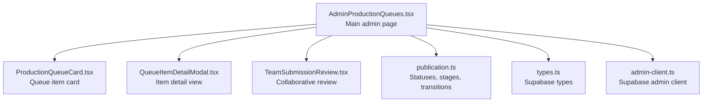
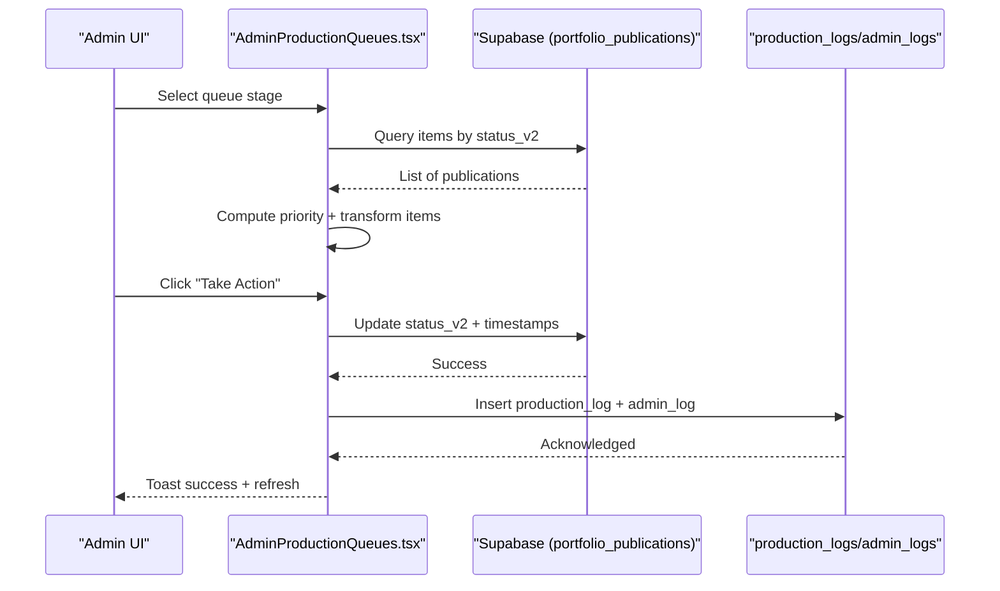
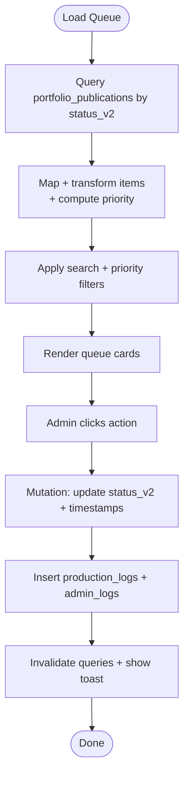
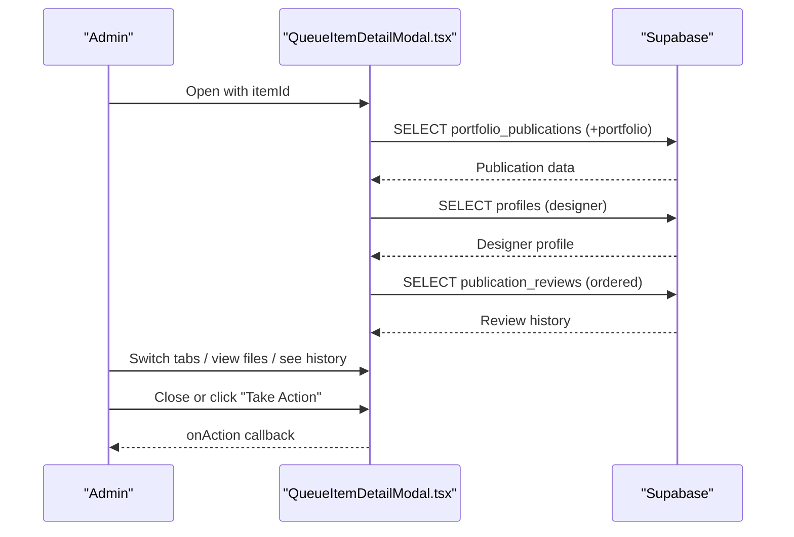
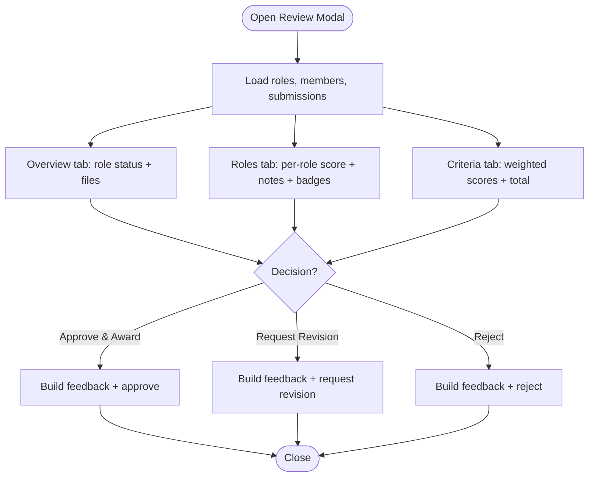
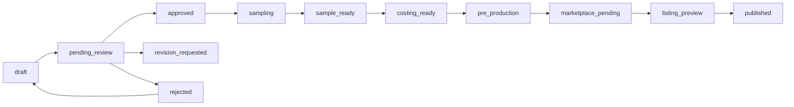
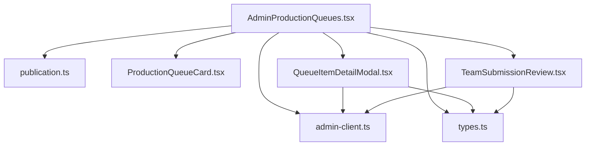

# Production Queues

<cite>
**Referenced Files in This Document**
- [AdminProductionQueues.tsx](file://src/pages/admin/AdminProductionQueues.tsx)
- [ProductionQueueCard.tsx](file://src/components/admin/ProductionQueueCard.tsx)
- [QueueItemDetailModal.tsx](file://src/components/admin/QueueItemDetailModal.tsx)
- [TeamSubmissionReview.tsx](file://src/components/admin/TeamSubmissionReview.tsx)
- [publication.ts](file://src/lib/publication.ts)
- [types.ts](file://src/integrations/supabase/types.ts)
- [admin-client.ts](file://src/integrations/supabase/admin-client.ts)
</cite>

## Table of Contents
1. [Introduction](#introduction)
2. [Project Structure](#project-structure)
3. [Core Components](#core-components)
4. [Architecture Overview](#architecture-overview)
5. [Detailed Component Analysis](#detailed-component-analysis)
6. [Dependency Analysis](#dependency-analysis)
7. [Performance Considerations](#performance-considerations)
8. [Troubleshooting Guide](#troubleshooting-guide)
9. [Conclusion](#conclusion)
10. [Appendices](#appendices)

## Introduction
This document explains the production queue management system used to track approved styleboxes and submissions through the end-to-end production pipeline. It covers:
- The production workflow from review to production and marketplace
- The queue card interface for quick status, processing times, and priority
- The queue item detail modal for comprehensive tracking and quality control
- The team submission review process for collaborative workflows
- Practical examples for managing queues, tracking progress, handling delays, and coordinating teams
- Capacity planning, resource allocation, and automated queue management

## Project Structure
The production queues feature is implemented as an admin-facing page with supporting UI components and shared libraries:
- Admin page orchestrating queues and actions
- Queue cards for quick overview
- Detail modal for deep inspection
- Team review modal for collaborative decisions
- Shared library defining statuses, stages, and transitions
- Supabase types and client for data access



**Diagram sources**
- [AdminProductionQueues.tsx](file://src/pages/admin/AdminProductionQueues.tsx#L1-L510)
- [ProductionQueueCard.tsx](file://src/components/admin/ProductionQueueCard.tsx#L1-L178)
- [QueueItemDetailModal.tsx](file://src/components/admin/QueueItemDetailModal.tsx#L1-L528)
- [TeamSubmissionReview.tsx](file://src/components/admin/TeamSubmissionReview.tsx#L1-L364)
- [publication.ts](file://src/lib/publication.ts#L1-L282)
- [types.ts](file://src/integrations/supabase/types.ts#L1538-L1737)
- [admin-client.ts](file://src/integrations/supabase/admin-client.ts#L1-L28)

**Section sources**
- [AdminProductionQueues.tsx](file://src/pages/admin/AdminProductionQueues.tsx#L1-L510)
- [ProductionQueueCard.tsx](file://src/components/admin/ProductionQueueCard.tsx#L1-L178)
- [QueueItemDetailModal.tsx](file://src/components/admin/QueueItemDetailModal.tsx#L1-L528)
- [TeamSubmissionReview.tsx](file://src/components/admin/TeamSubmissionReview.tsx#L1-L364)
- [publication.ts](file://src/lib/publication.ts#L1-L282)
- [types.ts](file://src/integrations/supabase/types.ts#L1538-L1737)
- [admin-client.ts](file://src/integrations/supabase/admin-client.ts#L1-L28)

## Core Components
- Production queue page: fetches and displays items per stage, filters, and handles actions
- Queue card: shows title, designer, status, priority, category, and processing time
- Detail modal: comprehensive view of designer info, files, history, and timeline
- Team review modal: collaborative evaluation with role scoring and criteria weighting
- Status and stage definitions: centralized configuration for transitions and stages

**Section sources**
- [AdminProductionQueues.tsx](file://src/pages/admin/AdminProductionQueues.tsx#L66-L120)
- [ProductionQueueCard.tsx](file://src/components/admin/ProductionQueueCard.tsx#L16-L69)
- [QueueItemDetailModal.tsx](file://src/components/admin/QueueItemDetailModal.tsx#L74-L140)
- [TeamSubmissionReview.tsx](file://src/components/admin/TeamSubmissionReview.tsx#L78-L92)
- [publication.ts](file://src/lib/publication.ts#L218-L249)

## Architecture Overview
The system follows a staged production workflow with explicit status transitions and team assignments. The admin page queries the database for items in the selected stage, computes priority, and exposes actions that update status and log events.



**Diagram sources**
- [AdminProductionQueues.tsx](file://src/pages/admin/AdminProductionQueues.tsx#L66-L120)
- [AdminProductionQueues.tsx](file://src/pages/admin/AdminProductionQueues.tsx#L174-L271)
- [types.ts](file://src/integrations/supabase/types.ts#L1538-L1737)
- [types.ts](file://src/integrations/supabase/types.ts#L1968-L2020)

## Detailed Component Analysis

### Production Queue Page
- Loads queue items filtered by stage using status_v2
- Computes priority based on priority_score and elapsed time
- Provides search and priority filtering
- Handles actions via a mutation that updates status_v2 and logs the event
- Displays stats header and queue tabs



**Diagram sources**
- [AdminProductionQueues.tsx](file://src/pages/admin/AdminProductionQueues.tsx#L66-L120)
- [AdminProductionQueues.tsx](file://src/pages/admin/AdminProductionQueues.tsx#L174-L271)
- [AdminProductionQueues.tsx](file://src/pages/admin/AdminProductionQueues.tsx#L291-L320)

**Section sources**
- [AdminProductionQueues.tsx](file://src/pages/admin/AdminProductionQueues.tsx#L51-L510)

### Queue Card Interface
- Displays thumbnail, title, designer avatar/name/rank, status icon/text, category, and submitted time
- Shows priority badge with color-coded severity
- Provides quick action buttons per queue type (e.g., Review, Start Sampling, Generate Tech Pack)
- Supports opening the detail modal

```mermaid
classDiagram
class ProductionQueueCard {
+item : QueueItem
+queueType : ProductionStage
+onAction(id, action)
+onView(id)
}
class QueueItem {
+id : string
+title : string
+designer : {name, avatar?, rank?}
+status : string
+priority : "low"|"normal"|"high"|"urgent"
+submittedAt : string
+category? : string
+thumbnailUrl? : string
}
ProductionQueueCard --> QueueItem : "renders"
```

**Diagram sources**
- [ProductionQueueCard.tsx](file://src/components/admin/ProductionQueueCard.tsx#L16-L69)

**Section sources**
- [ProductionQueueCard.tsx](file://src/components/admin/ProductionQueueCard.tsx#L61-L178)

### Queue Item Detail Modal
- Loads publication, designer profile, and review history via React Query
- Tabs: Details (designer info, description, design metadata, submission info), Files, History
- Timeline view of reviews with icons/colors per action
- Footer actions to close or take action



**Diagram sources**
- [QueueItemDetailModal.tsx](file://src/components/admin/QueueItemDetailModal.tsx#L74-L140)
- [types.ts](file://src/integrations/supabase/types.ts#L1538-L1737)
- [types.ts](file://src/integrations/supabase/types.ts#L2152-L2189)

**Section sources**
- [QueueItemDetailModal.tsx](file://src/components/admin/QueueItemDetailModal.tsx#L67-L528)

### Team Submission Review
- Collaborative evaluation with role-based scoring and overall notes
- Weighted criteria scoring and total calculation
- Options to Approve & Award, Request Revision, or Reject
- Displays team member avatars and role assignments



**Diagram sources**
- [TeamSubmissionReview.tsx](file://src/components/admin/TeamSubmissionReview.tsx#L78-L364)

**Section sources**
- [TeamSubmissionReview.tsx](file://src/components/admin/TeamSubmissionReview.tsx#L78-L364)

### Statuses, Stages, and Transitions
- Centralized definitions for statuses, stages, and allowed transitions
- Production stages map to sets of statuses for each queue
- Transition rules define valid state changes



**Diagram sources**
- [publication.ts](file://src/lib/publication.ts#L252-L265)
- [publication.ts](file://src/lib/publication.ts#L218-L249)

**Section sources**
- [publication.ts](file://src/lib/publication.ts#L4-L16)
- [publication.ts](file://src/lib/publication.ts#L251-L265)
- [publication.ts](file://src/lib/publication.ts#L218-L249)

## Dependency Analysis
- Admin page depends on:
  - Supabase client for queries/mutations
  - Publication library for stage/status definitions
  - UI components for rendering and modals
- Detail modal depends on:
  - Supabase client for publication, designer, and review history
  - React Query for caching and loading states
- Team review modal depends on:
  - Evaluation criteria and role definitions
  - Feedback aggregation and scoring



**Diagram sources**
- [AdminProductionQueues.tsx](file://src/pages/admin/AdminProductionQueues.tsx#L1-L510)
- [ProductionQueueCard.tsx](file://src/components/admin/ProductionQueueCard.tsx#L1-L178)
- [QueueItemDetailModal.tsx](file://src/components/admin/QueueItemDetailModal.tsx#L1-L528)
- [TeamSubmissionReview.tsx](file://src/components/admin/TeamSubmissionReview.tsx#L1-L364)
- [publication.ts](file://src/lib/publication.ts#L1-L282)
- [types.ts](file://src/integrations/supabase/types.ts#L1538-L1737)
- [admin-client.ts](file://src/integrations/supabase/admin-client.ts#L1-L28)

**Section sources**
- [AdminProductionQueues.tsx](file://src/pages/admin/AdminProductionQueues.tsx#L1-L510)
- [QueueItemDetailModal.tsx](file://src/components/admin/QueueItemDetailModal.tsx#L1-L528)
- [TeamSubmissionReview.tsx](file://src/components/admin/TeamSubmissionReview.tsx#L1-L364)
- [publication.ts](file://src/lib/publication.ts#L1-L282)
- [types.ts](file://src/integrations/supabase/types.ts#L1538-L1737)
- [admin-client.ts](file://src/integrations/supabase/admin-client.ts#L1-L28)

## Performance Considerations
- Use server-side filtering by status_v2 to limit payload size
- Paginate or lazy-load queue items for large lists
- Debounce search input to reduce query frequency
- Cache frequently accessed designer and review data with React Query
- Optimize thumbnails and file previews to avoid heavy DOM rendering
- Batch invalidations after mutations to minimize re-fetches

## Troubleshooting Guide
Common issues and resolutions:
- No items in a queue: verify status_v2 values and stage mapping
- Action fails: check mutation error messages and admin_logs entries
- Delayed updates: ensure queryClient invalidation after mutations
- Missing designer info: confirm profiles join and rank relationship
- Review history empty: ensure publication_reviews exists for the item

**Section sources**
- [AdminProductionQueues.tsx](file://src/pages/admin/AdminProductionQueues.tsx#L268-L271)
- [QueueItemDetailModal.tsx](file://src/components/admin/QueueItemDetailModal.tsx#L94-L140)
- [types.ts](file://src/integrations/supabase/types.ts#L2152-L2189)

## Conclusion
The production queues system provides a robust, stage-driven workflow for managing approved styleboxes from review to marketplace. Its modular components enable efficient oversight, collaborative reviews, and transparent audit trails. By leveraging status transitions, priority computation, and team collaboration tools, administrators can plan capacity, allocate resources, and maintain smooth production throughput.

## Appendices

### Managing Production Queues
- Approve a submission: move from pending_review to approved
- Start sampling: move approved to sampling
- Complete sampling: move sampling to sample_ready
- Generate tech pack: move sample_ready to costing_ready
- Approve pre-production: move costing_ready to pre_production
- Prepare marketplace: move pre_production to marketplace_pending
- Send preview: move marketplace_pending to listing_preview
- Publish: move listing_preview to published
- Reject or request revision as needed

**Section sources**
- [AdminProductionQueues.tsx](file://src/pages/admin/AdminProductionQueues.tsx#L174-L217)
- [publication.ts](file://src/lib/publication.ts#L252-L265)

### Tracking Submission Progress
- Use the queue tabs to navigate stages
- Inspect wait time and submitted date in the detail modal
- Review the timeline of actions and quality ratings
- Monitor priority levels to focus on urgent items

**Section sources**
- [AdminProductionQueues.tsx](file://src/pages/admin/AdminProductionQueues.tsx#L330-L336)
- [QueueItemDetailModal.tsx](file://src/components/admin/QueueItemDetailModal.tsx#L280-L313)
- [QueueItemDetailModal.tsx](file://src/components/admin/QueueItemDetailModal.tsx#L422-L504)

### Handling Production Delays
- Identify overdue items by computing elapsed time since submitted_at
- Increase priority for long-standing items
- Use the detail modal to review notes and history for bottlenecks
- Coordinate team handoffs and assign ownership via queue records

**Section sources**
- [AdminProductionQueues.tsx](file://src/pages/admin/AdminProductionQueues.tsx#L291-L320)
- [types.ts](file://src/integrations/supabase/types.ts#L1968-L2020)

### Coordinating Team Workflows
- Use the team submission review modal for multi-role evaluations
- Assign roles and track individual scores and badges
- Aggregate weighted totals to guide decisions
- Provide structured feedback and notes for transparency

**Section sources**
- [TeamSubmissionReview.tsx](file://src/components/admin/TeamSubmissionReview.tsx#L114-L128)
- [TeamSubmissionReview.tsx](file://src/components/admin/TeamSubmissionReview.tsx#L334-L360)

### Production Capacity Planning and Resource Allocation
- Monitor queue counts per stage for capacity insights
- Use priority_score and computed urgency to balance workload
- Track completed items per day to forecast throughput
- Assign teams per stage using stage configuration

**Section sources**
- [AdminProductionQueues.tsx](file://src/pages/admin/AdminProductionQueues.tsx#L122-L171)
- [publication.ts](file://src/lib/publication.ts#L218-L249)

### Automated Queue Management Systems
- Auto-approval deadlines can be enforced using auto_approve_at
- Implement background checks to escalate overdue items
- Use production_logs to monitor SLAs and bottlenecks

**Section sources**
- [publication.ts](file://src/lib/publication.ts#L271-L282)
- [types.ts](file://src/integrations/supabase/types.ts#L1968-L2020)