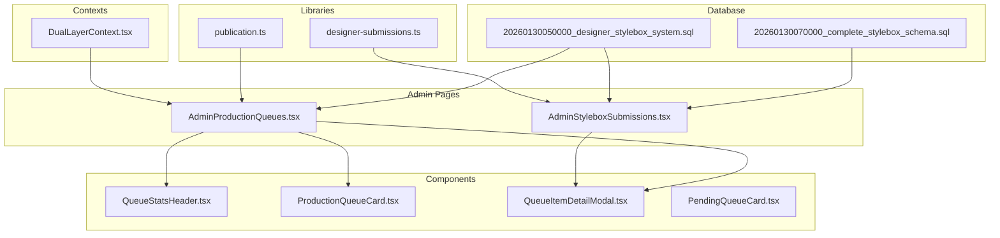
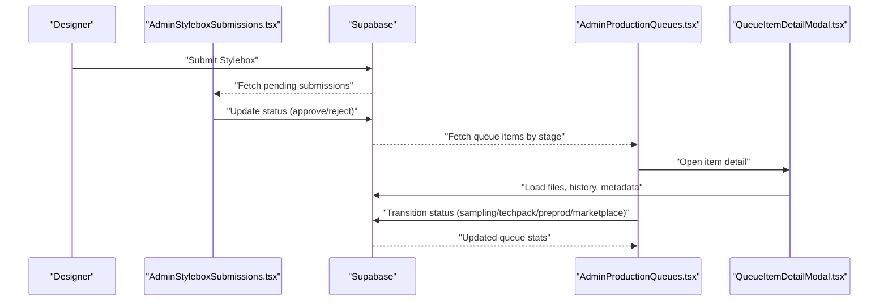
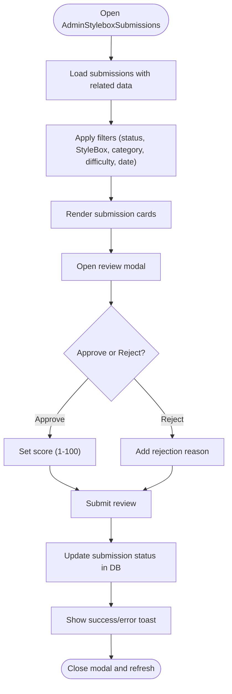
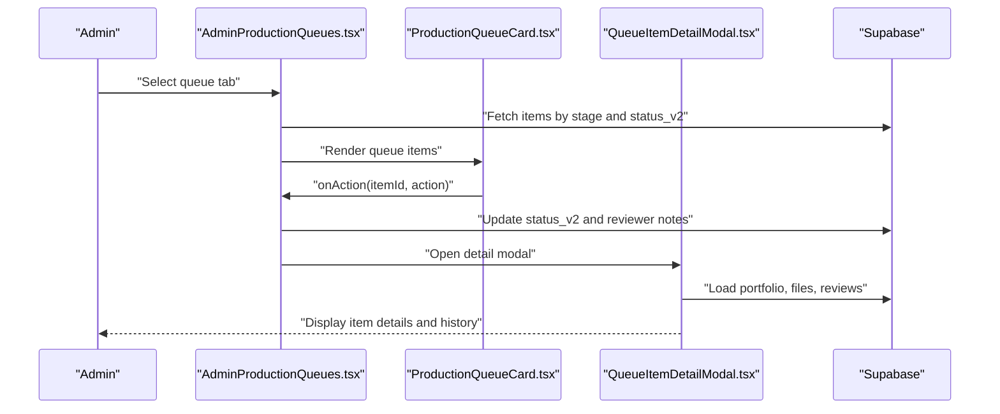
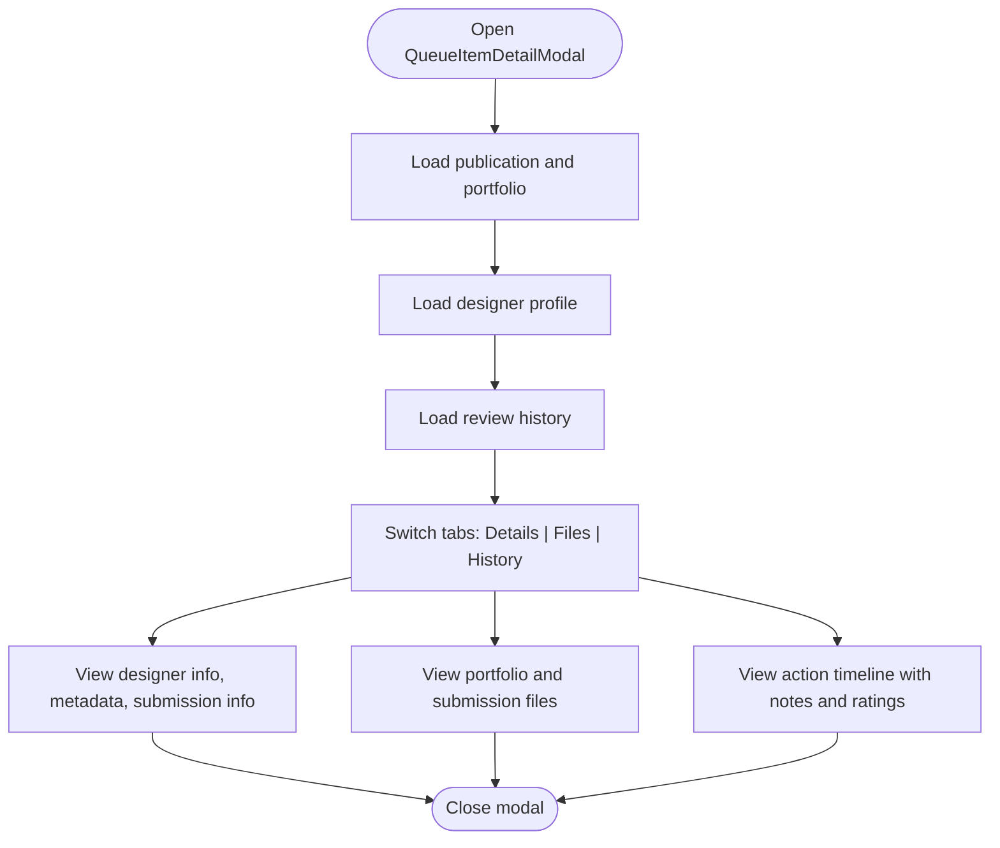
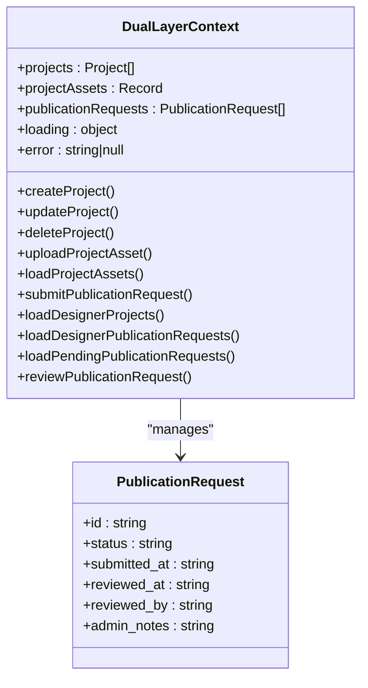
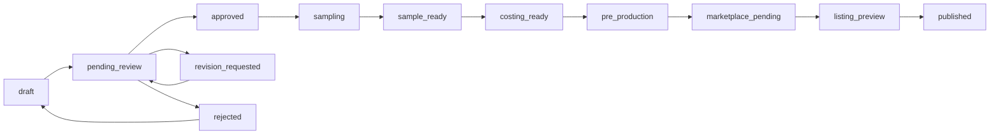
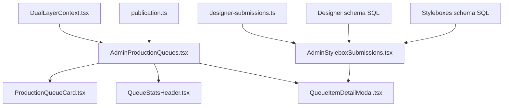

# Stylebox Review System

<cite>
**Referenced Files in This Document**
- [AdminStyleboxSubmissions.tsx](file://src/pages/admin/AdminStyleboxSubmissions.tsx)
- [AdminProductionQueues.tsx](file://src/pages/admin/AdminProductionQueues.tsx)
- [QueueItemDetailModal.tsx](file://src/components/admin/QueueItemDetailModal.tsx)
- [ProductionQueueCard.tsx](file://src/components/admin/ProductionQueueCard.tsx)
- [QueueStatsHeader.tsx](file://src/components/admin/QueueStatsHeader.tsx)
- [PendingQueueCard.tsx](file://src/components/admin/PendingQueueCard.tsx)
- [DualLayerContext.tsx](file://src/contexts/DualLayerContext.tsx)
- [publication.ts](file://src/lib/publication.ts)
- [designer-submissions.ts](file://src/types/designer-submissions.ts)
- [20260130050000_designer_stylebox_system.sql](file://supabase/migrations/20260130050000_designer_stylebox_system.sql)
- [20260130070000_complete_stylebox_schema.sql](file://supabase/migrations/20260130070000_complete_stylebox_schema.sql)
</cite>

## Table of Contents
1. [Introduction](#introduction)
2. [Project Structure](#project-structure)
3. [Core Components](#core-components)
4. [Architecture Overview](#architecture-overview)
5. [Detailed Component Analysis](#detailed-component-analysis)
6. [Dependency Analysis](#dependency-analysis)
7. [Performance Considerations](#performance-considerations)
8. [Troubleshooting Guide](#troubleshooting-guide)
9. [Conclusion](#conclusion)

## Introduction
This document describes the Stylebox review and approval system, covering the designer submission review interface, approval/rejection workflows, production queue management, queue statistics, and the queue item detail modal. It also explains the dual-layer review process, escalation procedures, and automated quality checks aligned with the Adorzia protocol.

## Project Structure
The Stylebox system spans frontend pages, components, contexts, and backend database schemas:
- Admin pages for reviewing designer submissions and managing production queues
- UI components for queue cards, statistics, and item details
- Context for dual-layer review workflows
- Publication lifecycle and status definitions
- Designer submission types and data models
- Database schema supporting submissions, files, critiques, and storage

**Diagram sources**
- [AdminStyleboxSubmissions.tsx](file://src/pages/admin/AdminStyleboxSubmissions.tsx#L1-L823)
- [AdminProductionQueues.tsx](file://src/pages/admin/AdminProductionQueues.tsx#L1-L510)
- [QueueStatsHeader.tsx](file://src/components/admin/QueueStatsHeader.tsx#L1-L97)
- [ProductionQueueCard.tsx](file://src/components/admin/ProductionQueueCard.tsx#L1-L178)
- [QueueItemDetailModal.tsx](file://src/components/admin/QueueItemDetailModal.tsx#L1-L528)
- [PendingQueueCard.tsx](file://src/components/admin/PendingQueueCard.tsx#L1-L142)
- [DualLayerContext.tsx](file://src/contexts/DualLayerContext.tsx#L1-L303)
- [publication.ts](file://src/lib/publication.ts#L1-L282)
- [designer-submissions.ts](file://src/types/designer-submissions.ts#L1-L255)
- [20260130050000_designer_stylebox_system.sql](file://supabase/migrations/20260130050000_designer_stylebox_system.sql#L1-L569)
- [20260130070000_complete_stylebox_schema.sql](file://supabase/migrations/20260130070000_complete_stylebox_schema.sql#L1-L51)

**Section sources**
- [AdminStyleboxSubmissions.tsx](file://src/pages/admin/AdminStyleboxSubmissions.tsx#L1-L823)
- [AdminProductionQueues.tsx](file://src/pages/admin/AdminProductionQueues.tsx#L1-L510)
- [publication.ts](file://src/lib/publication.ts#L1-L282)
- [designer-submissions.ts](file://src/types/designer-submissions.ts#L1-L255)
- [20260130050000_designer_stylebox_system.sql](file://supabase/migrations/20260130050000_designer_stylebox_system.sql#L1-L569)
- [20260130070000_complete_stylebox_schema.sql](file://supabase/migrations/20260130070000_complete_stylebox_schema.sql#L1-L51)

## Core Components
- AdminStyleboxSubmissions: Central review interface for designer Stylebox submissions with approval/rejection workflows, bulk actions, and advanced filtering.
- AdminProductionQueues: Production pipeline management with queue stages, actions, and statistics.
- QueueItemDetailModal: Comprehensive modal for viewing queue item details, files, and review history.
- ProductionQueueCard: Individual queue item card with priority, status, and action buttons.
- QueueStatsHeader: Summary statistics for queue volumes, urgency, wait times, and daily completions.
- PendingQueueCard: Quick-access card for pending and revision-required items.
- DualLayerContext: Context for dual-layer review workflows and publication requests.
- Publication lifecycle: Status definitions, transitions, and production stage mapping.
- Designer submission types: Strongly typed interfaces for submissions, files, critiques, and deliverables.
- Database schema: Tables, enums, RLS policies, triggers, and helper functions for submissions and storage.

**Section sources**
- [AdminStyleboxSubmissions.tsx](file://src/pages/admin/AdminStyleboxSubmissions.tsx#L1-L823)
- [AdminProductionQueues.tsx](file://src/pages/admin/AdminProductionQueues.tsx#L1-L510)
- [QueueItemDetailModal.tsx](file://src/components/admin/QueueItemDetailModal.tsx#L1-L528)
- [ProductionQueueCard.tsx](file://src/components/admin/ProductionQueueCard.tsx#L1-L178)
- [QueueStatsHeader.tsx](file://src/components/admin/QueueStatsHeader.tsx#L1-L97)
- [PendingQueueCard.tsx](file://src/components/admin/PendingQueueCard.tsx#L1-L142)
- [DualLayerContext.tsx](file://src/contexts/DualLayerContext.tsx#L1-L303)
- [publication.ts](file://src/lib/publication.ts#L1-L282)
- [designer-submissions.ts](file://src/types/designer-submissions.ts#L1-L255)
- [20260130050000_designer_stylebox_system.sql](file://supabase/migrations/20260130050000_designer_stylebox_system.sql#L1-L569)
- [20260130070000_complete_stylebox_schema.sql](file://supabase/migrations/20260130070000_complete_stylebox_schema.sql#L1-L51)

## Architecture Overview
The system integrates frontend pages and components with Supabase for data persistence and real-time updates. The designer submission lifecycle feeds into the production pipeline, which tracks progress across stages and maintains audit trails.

**Diagram sources**
- [AdminStyleboxSubmissions.tsx](file://src/pages/admin/AdminStyleboxSubmissions.tsx#L84-L178)
- [AdminProductionQueues.tsx](file://src/pages/admin/AdminProductionQueues.tsx#L66-L271)
- [QueueItemDetailModal.tsx](file://src/components/admin/QueueItemDetailModal.tsx#L74-L140)
- [20260130050000_designer_stylebox_system.sql](file://supabase/migrations/20260130050000_designer_stylebox_system.sql#L52-L83)

## Detailed Component Analysis

### Designer Submission Review Interface
The admin page provides:
- Submission grid with status badges, designer info, and file counts
- Advanced filtering by status, StyleBox, category, difficulty, and date range
- Bulk actions to approve or reject multiple submissions with shared score/feedback
- Individual review modal with designer details, submission files, and scoring
- Real-time pending count badge

**Diagram sources**
- [AdminStyleboxSubmissions.tsx](file://src/pages/admin/AdminStyleboxSubmissions.tsx#L84-L227)
- [AdminStyleboxSubmissions.tsx](file://src/pages/admin/AdminStyleboxSubmissions.tsx#L115-L178)

**Section sources**
- [AdminStyleboxSubmissions.tsx](file://src/pages/admin/AdminStyleboxSubmissions.tsx#L1-L823)
- [designer-submissions.ts](file://src/types/designer-submissions.ts#L33-L67)

### Production Queue Management
The production queues page manages the end-to-end pipeline:
- Queue tabs for Submission, Sampling, Tech Packs, Pre-Production, and Marketplace
- Priority calculation based on priority score, hours since submission, and urgency thresholds
- Action dialogs to move items forward with optional notes
- Statistics header showing queue volumes, urgent items, average wait time, and daily completions
- Detail modal with designer info, design metadata, files, and review history timeline

**Diagram sources**
- [AdminProductionQueues.tsx](file://src/pages/admin/AdminProductionQueues.tsx#L66-L271)
- [ProductionQueueCard.tsx](file://src/components/admin/ProductionQueueCard.tsx#L61-L177)
- [QueueItemDetailModal.tsx](file://src/components/admin/QueueItemDetailModal.tsx#L74-L140)
- [publication.ts](file://src/lib/publication.ts#L219-L249)

**Section sources**
- [AdminProductionQueues.tsx](file://src/pages/admin/AdminProductionQueues.tsx#L1-L510)
- [QueueStatsHeader.tsx](file://src/components/admin/QueueStatsHeader.tsx#L1-L97)
- [ProductionQueueCard.tsx](file://src/components/admin/ProductionQueueCard.tsx#L1-L178)
- [QueueItemDetailModal.tsx](file://src/components/admin/QueueItemDetailModal.tsx#L1-L528)
- [publication.ts](file://src/lib/publication.ts#L1-L282)

### Queue Item Detail Modal
The modal provides:
- Details tab: designer profile, project description, design metadata, submission info, and designer notes
- Files tab: portfolio items and submission files with thumbnails and download options
- History tab: chronological timeline of actions, reviewer avatars, timestamps, notes, and quality ratings

**Diagram sources**
- [QueueItemDetailModal.tsx](file://src/components/admin/QueueItemDetailModal.tsx#L74-L140)
- [QueueItemDetailModal.tsx](file://src/components/admin/QueueItemDetailModal.tsx#L196-L504)

**Section sources**
- [QueueItemDetailModal.tsx](file://src/components/admin/QueueItemDetailModal.tsx#L1-L528)

### Pending Queue Card
The pending card displays:
- Up to five items awaiting action with designer avatar/name, category, and submission time
- Status badges for pending review or revision requested
- Quick action buttons (approve, request revision, reject) and navigation to full queue

**Section sources**
- [PendingQueueCard.tsx](file://src/components/admin/PendingQueueCard.tsx#L1-L142)

### Dual-Layer Review Process and Escalation
The dual-layer context supports:
- Managing publication requests with status tracking and admin reviews
- Loading designer projects and assets
- Submitting and reviewing publication requests with decisions (approved, rejected, under_review)
- Maintaining loading states and error handling

**Diagram sources**
- [DualLayerContext.tsx](file://src/contexts/DualLayerContext.tsx#L5-L131)

**Section sources**
- [DualLayerContext.tsx](file://src/contexts/DualLayerContext.tsx#L1-L303)

### Automated Quality Checks and Status Transitions
The publication lifecycle defines:
- Status transitions and admin actions per stage
- Production stage mapping and team assignments
- Auto-approval timeout logic and deadline calculations
- Completeness checks and eligibility rules for publication

**Diagram sources**
- [publication.ts](file://src/lib/publication.ts#L252-L265)
- [publication.ts](file://src/lib/publication.ts#L219-L249)

**Section sources**
- [publication.ts](file://src/lib/publication.ts#L1-L282)

## Dependency Analysis
The system exhibits clear separation of concerns:
- Pages depend on components for rendering and modals for detail views
- Components rely on library definitions for status and transitions
- Database schema enforces data integrity and RLS policies
- Contexts encapsulate state and service interactions

**Diagram sources**
- [AdminStyleboxSubmissions.tsx](file://src/pages/admin/AdminStyleboxSubmissions.tsx#L1-L823)
- [AdminProductionQueues.tsx](file://src/pages/admin/AdminProductionQueues.tsx#L1-L510)
- [QueueItemDetailModal.tsx](file://src/components/admin/QueueItemDetailModal.tsx#L1-L528)
- [ProductionQueueCard.tsx](file://src/components/admin/ProductionQueueCard.tsx#L1-L178)
- [QueueStatsHeader.tsx](file://src/components/admin/QueueStatsHeader.tsx#L1-L97)
- [DualLayerContext.tsx](file://src/contexts/DualLayerContext.tsx#L1-L303)
- [publication.ts](file://src/lib/publication.ts#L1-L282)
- [designer-submissions.ts](file://src/types/designer-submissions.ts#L1-L255)
- [20260130050000_designer_stylebox_system.sql](file://supabase/migrations/20260130050000_designer_stylebox_system.sql#L1-L569)
- [20260130070000_complete_stylebox_schema.sql](file://supabase/migrations/20260130070000_complete_stylebox_schema.sql#L1-L51)

**Section sources**
- [AdminStyleboxSubmissions.tsx](file://src/pages/admin/AdminStyleboxSubmissions.tsx#L1-L823)
- [AdminProductionQueues.tsx](file://src/pages/admin/AdminProductionQueues.tsx#L1-L510)
- [publication.ts](file://src/lib/publication.ts#L1-L282)
- [20260130050000_designer_stylebox_system.sql](file://supabase/migrations/20260130050000_designer_stylebox_system.sql#L1-L569)

## Performance Considerations
- Use of React Query for efficient caching and background refetching
- Pagination and virtualized lists for large datasets
- Debounced search and selective re-rendering in modals
- Database indexing on frequently queried columns (status, timestamps, designer ID)
- Triggers to maintain computed fields (progress percentage) efficiently

## Troubleshooting Guide
Common issues and resolutions:
- Review mutations failing: Verify admin credentials and RLS policies; check toast messages for specific errors
- Bulk actions timing out: Ensure network connectivity and reduce selection size
- Queue items not updating: Invalidate queries after actions; confirm status transitions are valid
- Detail modal not loading: Confirm item ID exists and user has access; check review history and file permissions
- Storage access denied: Validate bucket policies and folder ownership for designer submissions

**Section sources**
- [AdminStyleboxSubmissions.tsx](file://src/pages/admin/AdminStyleboxSubmissions.tsx#L143-L151)
- [AdminProductionQueues.tsx](file://src/pages/admin/AdminProductionQueues.tsx#L261-L271)
- [QueueItemDetailModal.tsx](file://src/components/admin/QueueItemDetailModal.tsx#L121-L140)
- [20260130050000_designer_stylebox_system.sql](file://supabase/migrations/20260130050000_designer_stylebox_system.sql#L414-L462)

## Conclusion
The Stylebox review and approval system provides a robust, scalable framework for managing designer submissions and guiding them through a structured production pipeline. With comprehensive review interfaces, queue management, statistics, and detailed item views, the system supports both operational efficiency and quality assurance. The dual-layer context and publication lifecycle definitions enable flexible workflows, while database schema and RLS policies ensure data integrity and access control.