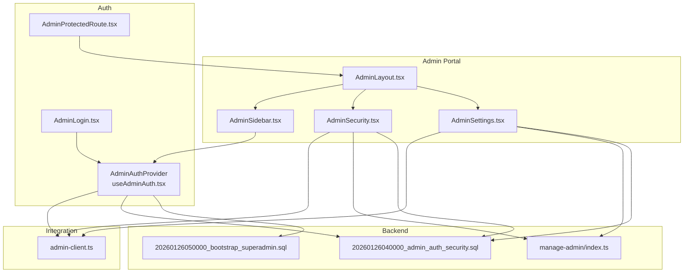
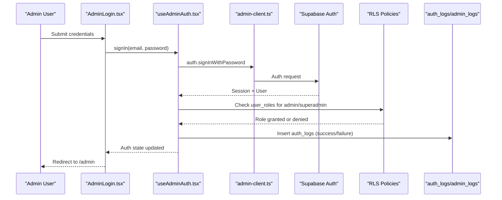
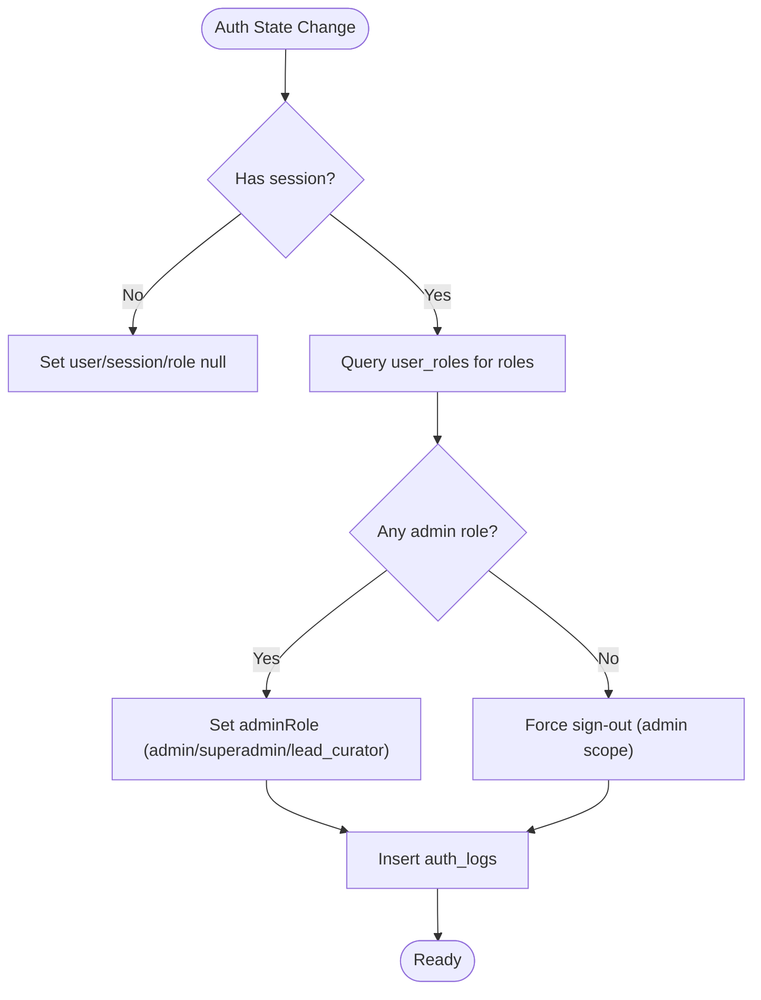
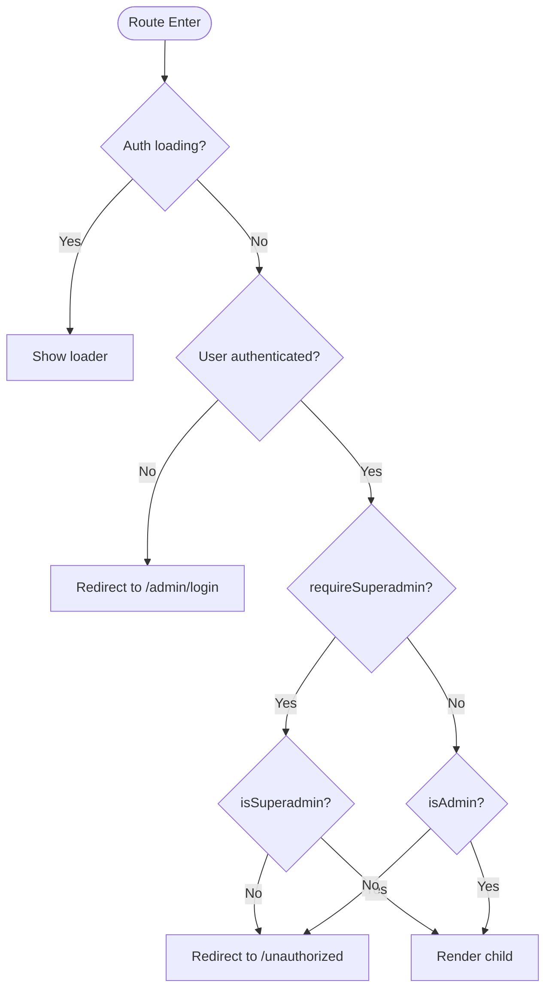
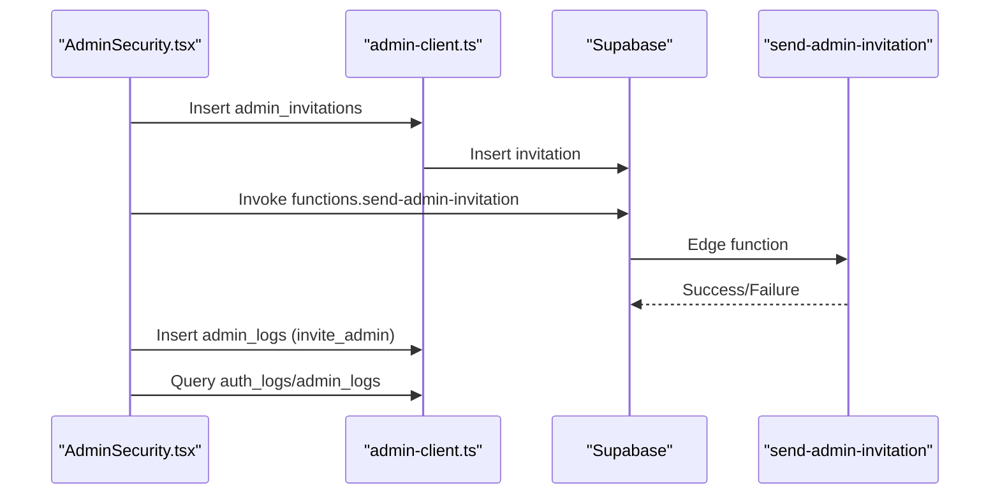
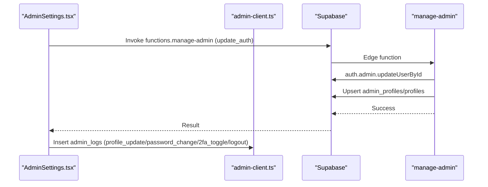
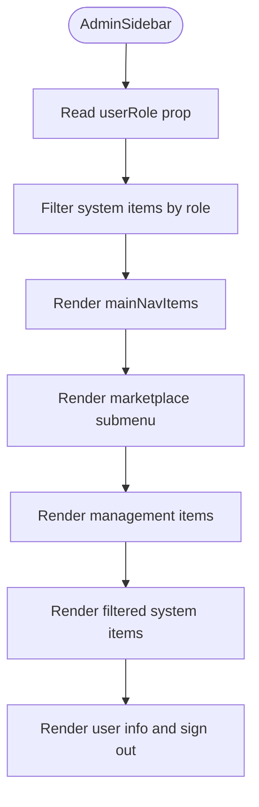
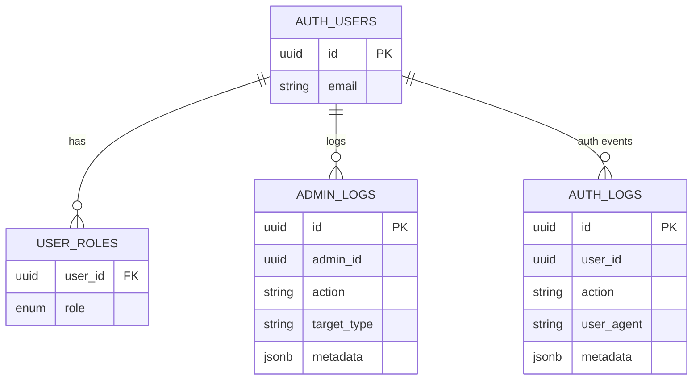
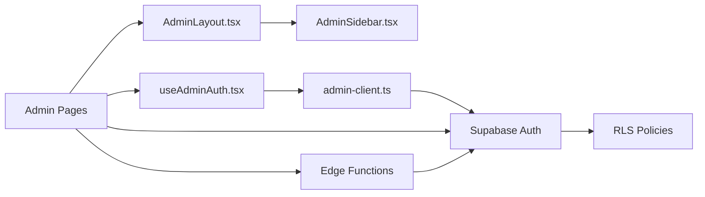

# System Security & Configuration

<cite>
**Referenced Files in This Document**
- [AdminSecurity.tsx](file://src/pages/admin/AdminSecurity.tsx)
- [AdminSettings.tsx](file://src/pages/admin/AdminSettings.tsx)
- [AdminSidebar.tsx](file://src/components/admin/AdminSidebar.tsx)
- [AdminLayout.tsx](file://src/components/admin/AdminLayout.tsx)
- [AdminProtectedRoute.tsx](file://src/components/auth/AdminProtectedRoute.tsx)
- [AdminLogin.tsx](file://src/pages/admin/AdminLogin.tsx)
- [useAdminAuth.tsx](file://src/hooks/useAdminAuth.tsx)
- [admin-client.ts](file://src/integrations/supabase/admin-client.ts)
- [20260126040000_admin_auth_security.sql](file://supabase/migrations/20260126040000_admin_auth_security.sql)
- [20260126050000_bootstrap_superadmin.sql](file://supabase/migrations/20260126050000_bootstrap_superadmin.sql)
- [manage-admin/index.ts](file://supabase/functions/manage-admin/index.ts)
</cite>

## Table of Contents
1. [Introduction](#introduction)
2. [Project Structure](#project-structure)
3. [Core Components](#core-components)
4. [Architecture Overview](#architecture-overview)
5. [Detailed Component Analysis](#detailed-component-analysis)
6. [Dependency Analysis](#dependency-analysis)
7. [Performance Considerations](#performance-considerations)
8. [Troubleshooting Guide](#troubleshooting-guide)
9. [Conclusion](#conclusion)
10. [Appendices](#appendices)

## Introduction
This document provides comprehensive documentation for the admin system’s security and configuration management. It covers the security settings interface for access control, authentication policies, and administrative permissions; the system configuration options for platform settings, feature toggles, and operational parameters; the admin authentication system with role-based access control and superadmin privileges; the administrative sidebar navigation and menu management; and the audit logging and security monitoring features. Practical examples demonstrate how to configure security policies, manage admin permissions, set up access controls, and maintain system integrity.

## Project Structure
The admin system is organized around a dedicated admin portal with protected routes, role-aware UI, and backend integrations for authentication, authorization, and auditing. Key areas include:
- Admin pages for security and settings
- Admin layout and sidebar with role-based visibility
- Authentication provider and protected route guards
- Supabase client configured for isolated admin sessions
- Database migrations establishing security policies and logs
- Edge functions enforcing admin actions and role checks

**Diagram sources**
- [AdminLayout.tsx](file://src/components/admin/AdminLayout.tsx#L48-L237)
- [AdminSidebar.tsx](file://src/components/admin/AdminSidebar.tsx#L80-L293)
- [AdminSecurity.tsx](file://src/pages/admin/AdminSecurity.tsx#L52-L616)
- [AdminSettings.tsx](file://src/pages/admin/AdminSettings.tsx#L53-L529)
- [AdminProtectedRoute.tsx](file://src/components/auth/AdminProtectedRoute.tsx#L11-L51)
- [AdminLogin.tsx](file://src/pages/admin/AdminLogin.tsx#L17-L157)
- [useAdminAuth.tsx](file://src/hooks/useAdminAuth.tsx#L21-L240)
- [admin-client.ts](file://src/integrations/supabase/admin-client.ts#L7-L27)
- [20260126040000_admin_auth_security.sql](file://supabase/migrations/20260126040000_admin_auth_security.sql#L61-L79)
- [20260126050000_bootstrap_superadmin.sql](file://supabase/migrations/20260126050000_bootstrap_superadmin.sql#L4-L79)
- [manage-admin/index.ts](file://supabase/functions/manage-admin/index.ts#L14-L147)

**Section sources**
- [AdminLayout.tsx](file://src/components/admin/AdminLayout.tsx#L48-L237)
- [AdminSidebar.tsx](file://src/components/admin/AdminSidebar.tsx#L80-L293)
- [AdminSecurity.tsx](file://src/pages/admin/AdminSecurity.tsx#L52-L616)
- [AdminSettings.tsx](file://src/pages/admin/AdminSettings.tsx#L53-L529)
- [AdminProtectedRoute.tsx](file://src/components/auth/AdminProtectedRoute.tsx#L11-L51)
- [AdminLogin.tsx](file://src/pages/admin/AdminLogin.tsx#L17-L157)
- [useAdminAuth.tsx](file://src/hooks/useAdminAuth.tsx#L21-L240)
- [admin-client.ts](file://src/integrations/supabase/admin-client.ts#L7-L27)
- [20260126040000_admin_auth_security.sql](file://supabase/migrations/20260126040000_admin_auth_security.sql#L61-L79)
- [20260126050000_bootstrap_superadmin.sql](file://supabase/migrations/20260126050000_bootstrap_superadmin.sql#L4-L79)
- [manage-admin/index.ts](file://supabase/functions/manage-admin/index.ts#L14-L147)

## Core Components
- Admin authentication and RBAC: Centralized provider checks roles, enforces access, and logs auth events.
- Protected routes: Guards admin pages and optionally restricts to superadmin.
- Admin security page: Role management, invitations, and audit logs.
- Admin settings: Profile/password management, 2FA toggle, and session controls.
- Admin layout and sidebar: Role-aware navigation and quick actions.
- Isolated admin client: Independent storage and session isolation from the studio.
- Backend policies and logs: Row-level security and policy enforcement for logs and functions.

**Section sources**
- [useAdminAuth.tsx](file://src/hooks/useAdminAuth.tsx#L34-L77)
- [AdminProtectedRoute.tsx](file://src/components/auth/AdminProtectedRoute.tsx#L11-L51)
- [AdminSecurity.tsx](file://src/pages/admin/AdminSecurity.tsx#L52-L147)
- [AdminSettings.tsx](file://src/pages/admin/AdminSettings.tsx#L53-L257)
- [AdminLayout.tsx](file://src/components/admin/AdminLayout.tsx#L48-L197)
- [AdminSidebar.tsx](file://src/components/admin/AdminSidebar.tsx#L80-L92)
- [admin-client.ts](file://src/integrations/supabase/admin-client.ts#L7-L27)
- [20260126040000_admin_auth_security.sql](file://supabase/migrations/20260126040000_admin_auth_security.sql#L61-L79)

## Architecture Overview
The admin system enforces strict role-based access control with a layered approach:
- Frontend: Protected routes and role-aware UI.
- Auth provider: Session management, role resolution, and logging.
- Backend: Supabase RLS policies and edge functions for privileged operations.
- Logging: Dedicated audit tables for auth and admin actions.

**Diagram sources**
- [AdminLogin.tsx](file://src/pages/admin/AdminLogin.tsx#L32-L68)
- [useAdminAuth.tsx](file://src/hooks/useAdminAuth.tsx#L169-L199)
- [admin-client.ts](file://src/integrations/supabase/admin-client.ts#L14-L27)
- [20260126040000_admin_auth_security.sql](file://supabase/migrations/20260126040000_admin_auth_security.sql#L61-L79)

## Detailed Component Analysis

### Admin Authentication System and RBAC
- Role model: admin, superadmin, lead_curator.
- Role resolution: Queries user_roles and sets adminRole; invalid access triggers forced sign-out from admin scope.
- Auth logging: Records successful and failed admin logins with user agent and metadata.
- Session isolation: Admin client uses a separate storage key to avoid cross-session contamination.

**Diagram sources**
- [useAdminAuth.tsx](file://src/hooks/useAdminAuth.tsx#L38-L87)
- [useAdminAuth.tsx](file://src/hooks/useAdminAuth.tsx#L169-L199)
- [20260126040000_admin_auth_security.sql](file://supabase/migrations/20260126040000_admin_auth_security.sql#L61-L79)

**Section sources**
- [useAdminAuth.tsx](file://src/hooks/useAdminAuth.tsx#L34-L87)
- [useAdminAuth.tsx](file://src/hooks/useAdminAuth.tsx#L169-L223)
- [admin-client.ts](file://src/integrations/supabase/admin-client.ts#L7-L27)
- [20260126040000_admin_auth_security.sql](file://supabase/migrations/20260126040000_admin_auth_security.sql#L61-L79)

### Protected Routes and Access Control
- AdminProtectedRoute enforces admin access and optional superadmin requirement.
- Redirects unauthenticated users to /admin/login and non-admins to /unauthorized.
- Provides clear console logs for debugging access decisions.

**Diagram sources**
- [AdminProtectedRoute.tsx](file://src/components/auth/AdminProtectedRoute.tsx#L11-L51)

**Section sources**
- [AdminProtectedRoute.tsx](file://src/components/auth/AdminProtectedRoute.tsx#L11-L51)

### Admin Security Page: Role Management and Audit Logs
- Role management: Lists admins, filters/searches, promotes/demotes (subject to superadmin), and revokes access.
- Invitations: Superadmins can invite new admins with role selection and optional message; invokes edge function to send invitation and logs the action.
- Audit logs: Displays recent auth/admin events with metadata and timestamps.

**Diagram sources**
- [AdminSecurity.tsx](file://src/pages/admin/AdminSecurity.tsx#L177-L251)
- [20260126040000_admin_auth_security.sql](file://supabase/migrations/20260126040000_admin_auth_security.sql#L61-L79)

**Section sources**
- [AdminSecurity.tsx](file://src/pages/admin/AdminSecurity.tsx#L52-L147)
- [AdminSecurity.tsx](file://src/pages/admin/AdminSecurity.tsx#L149-L285)
- [AdminSecurity.tsx](file://src/pages/admin/AdminSecurity.tsx#L177-L251)
- [20260126040000_admin_auth_security.sql](file://supabase/migrations/20260126040000_admin_auth_security.sql#L61-L79)

### Admin Settings: Profile, Password, 2FA, and Sessions
- Profile updates: Uses manage-admin edge function to update both auth and profile consistently.
- Password updates: Enforces strong password rules and leverages service role for secure updates.
- 2FA toggle: Logs enable/disable actions.
- Session controls: Supports logout and logout everywhere with logging.

**Diagram sources**
- [AdminSettings.tsx](file://src/pages/admin/AdminSettings.tsx#L145-L233)
- [manage-admin/index.ts](file://supabase/functions/manage-admin/index.ts#L80-L108)
- [20260126040000_admin_auth_security.sql](file://supabase/migrations/20260126040000_admin_auth_security.sql#L61-L79)

**Section sources**
- [AdminSettings.tsx](file://src/pages/admin/AdminSettings.tsx#L53-L257)
- [AdminSettings.tsx](file://src/pages/admin/AdminSettings.tsx#L145-L233)
- [manage-admin/index.ts](file://supabase/functions/manage-admin/index.ts#L80-L108)

### Admin Layout and Sidebar Navigation
- Sidebar groups: Main navigation, marketplace submenu, management, and system.
- Role-aware visibility: Security and superadmin-only items hidden for non-superadmins.
- Quick actions: Command palette, theme toggle, notifications, and user menu with sign out.

**Diagram sources**
- [AdminSidebar.tsx](file://src/components/admin/AdminSidebar.tsx#L80-L92)
- [AdminSidebar.tsx](file://src/components/admin/AdminSidebar.tsx#L157-L293)

**Section sources**
- [AdminLayout.tsx](file://src/components/admin/AdminLayout.tsx#L48-L197)
- [AdminSidebar.tsx](file://src/components/admin/AdminSidebar.tsx#L80-L92)
- [AdminSidebar.tsx](file://src/components/admin/AdminSidebar.tsx#L157-L293)

### Database Security Policies and Bootstrapping
- Auth/admin logs RLS: Only authenticated users with admin/superadmin roles can view logs; inserts allowed for anonymous/authenticated.
- Function hardening: Dashboard stats function checks caller role and raises exceptions for unauthorized access.
- Bootstrap superadmin: SQL function to safely create the first superadmin with proper role assignment and profile creation.

**Diagram sources**
- [20260126040000_admin_auth_security.sql](file://supabase/migrations/20260126040000_admin_auth_security.sql#L61-L79)
- [20260126050000_bootstrap_superadmin.sql](file://supabase/migrations/20260126050000_bootstrap_superadmin.sql#L4-L79)

**Section sources**
- [20260126040000_admin_auth_security.sql](file://supabase/migrations/20260126040000_admin_auth_security.sql#L6-L41)
- [20260126040000_admin_auth_security.sql](file://supabase/migrations/20260126040000_admin_auth_security.sql#L61-L79)
- [20260126050000_bootstrap_superadmin.sql](file://supabase/migrations/20260126050000_bootstrap_superadmin.sql#L4-L79)

## Dependency Analysis
- Frontend depends on Supabase client with isolated storage for admin sessions.
- Admin pages depend on the auth provider for role-aware rendering and guard access.
- Edge functions enforce admin operations and bypass RLS for privileged tasks.
- Database policies protect sensitive logs and enforce role checks.

**Diagram sources**
- [AdminSecurity.tsx](file://src/pages/admin/AdminSecurity.tsx#L33-L34)
- [AdminSettings.tsx](file://src/pages/admin/AdminSettings.tsx#L36-L37)
- [useAdminAuth.tsx](file://src/hooks/useAdminAuth.tsx#L3-L4)
- [admin-client.ts](file://src/integrations/supabase/admin-client.ts#L14-L27)
- [manage-admin/index.ts](file://supabase/functions/manage-admin/index.ts#L20-L35)

**Section sources**
- [AdminSecurity.tsx](file://src/pages/admin/AdminSecurity.tsx#L33-L34)
- [AdminSettings.tsx](file://src/pages/admin/AdminSettings.tsx#L36-L37)
- [useAdminAuth.tsx](file://src/hooks/useAdminAuth.tsx#L3-L4)
- [admin-client.ts](file://src/integrations/supabase/admin-client.ts#L14-L27)
- [manage-admin/index.ts](file://supabase/functions/manage-admin/index.ts#L20-L35)

## Performance Considerations
- Role checks are deferred and debounced to avoid redundant queries during auth state transitions.
- Isolated admin storage prevents unnecessary cross-tab synchronization overhead.
- Edge functions consolidate auth and profile updates to reduce round trips.
- Realtime publication additions enable efficient live dashboards without polling.

## Troubleshooting Guide
- Login failures: Auth logs capture failed attempts with metadata; verify credentials and role assignment.
- Role not recognized: Ensure user_roles contains admin/superadmin; confirm auth state listener executed.
- Edge function errors: Check service role key configuration and requester role validation.
- Session conflicts: Confirm admin client storage key isolation and local scope sign-out.

**Section sources**
- [useAdminAuth.tsx](file://src/hooks/useAdminAuth.tsx#L169-L199)
- [20260126040000_admin_auth_security.sql](file://supabase/migrations/20260126040000_admin_auth_security.sql#L61-L79)
- [manage-admin/index.ts](file://supabase/functions/manage-admin/index.ts#L14-L147)

## Conclusion
The admin system implements a robust, layered security model combining frontend RBAC, protected routes, isolated sessions, backend RLS policies, and comprehensive audit logging. Administrators can manage roles, monitor access, and maintain system integrity while superadmins retain elevated privileges and oversight. Edge functions and database functions enforce strict access controls and consistent updates, ensuring secure and auditable operations.

## Appendices

### Examples and How-To Guides
- Configure security policies
  - Ensure auth_logs and admin_logs have appropriate RLS policies and that functions enforce role checks.
  - Reference: [20260126040000_admin_auth_security.sql](file://supabase/migrations/20260126040000_admin_auth_security.sql#L61-L79)
- Manage admin permissions
  - Use AdminSecurity to promote/demote and revoke access; verify role assignments in user_roles.
  - Reference: [AdminSecurity.tsx](file://src/pages/admin/AdminSecurity.tsx#L149-L285)
- Set up access controls
  - Apply AdminProtectedRoute with requireSuperadmin where needed; verify role-aware sidebar visibility.
  - References: [AdminProtectedRoute.tsx](file://src/components/auth/AdminProtectedRoute.tsx#L11-L51), [AdminSidebar.tsx](file://src/components/admin/AdminSidebar.tsx#L80-L92)
- Maintain system integrity
  - Use manage-admin edge function for profile/password updates; log all admin actions.
  - References: [AdminSettings.tsx](file://src/pages/admin/AdminSettings.tsx#L145-L233), [manage-admin/index.ts](file://supabase/functions/manage-admin/index.ts#L80-L108)
- Audit logging and monitoring
  - Monitor auth_logs and admin_logs; use AdminSecurity to review recent events.
  - Reference: [AdminSecurity.tsx](file://src/pages/admin/AdminSecurity.tsx#L135-L147)