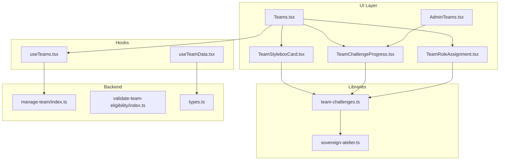
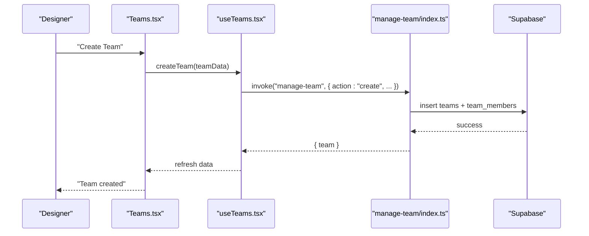
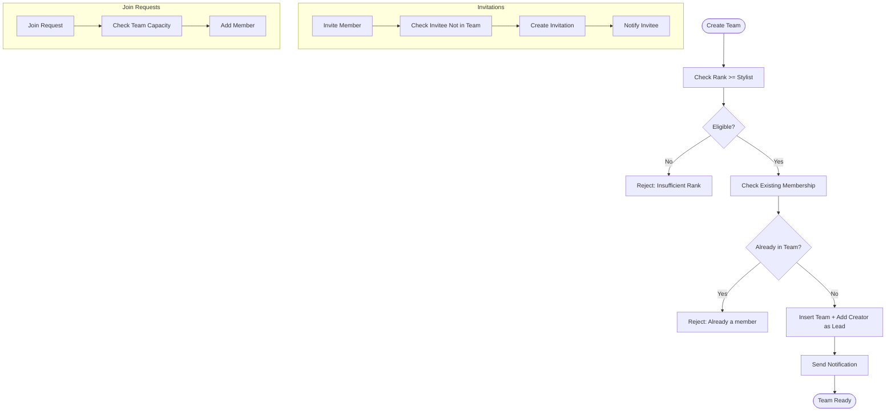
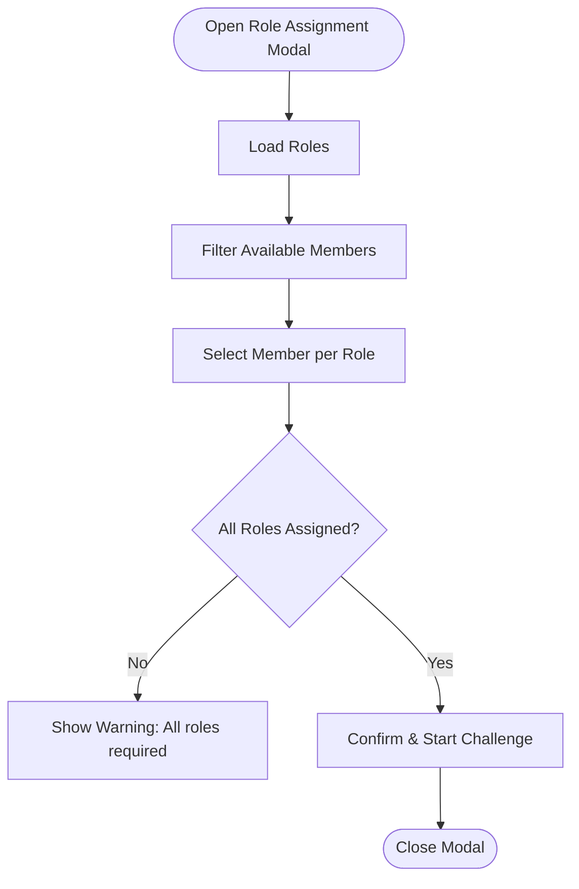
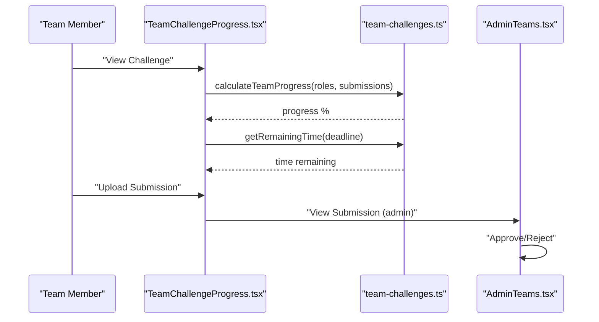
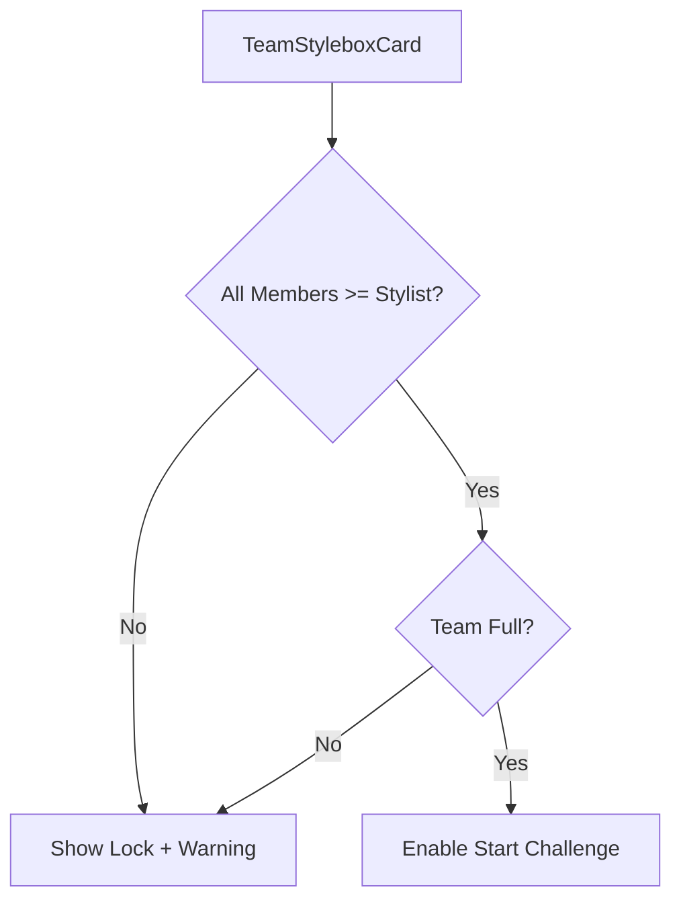
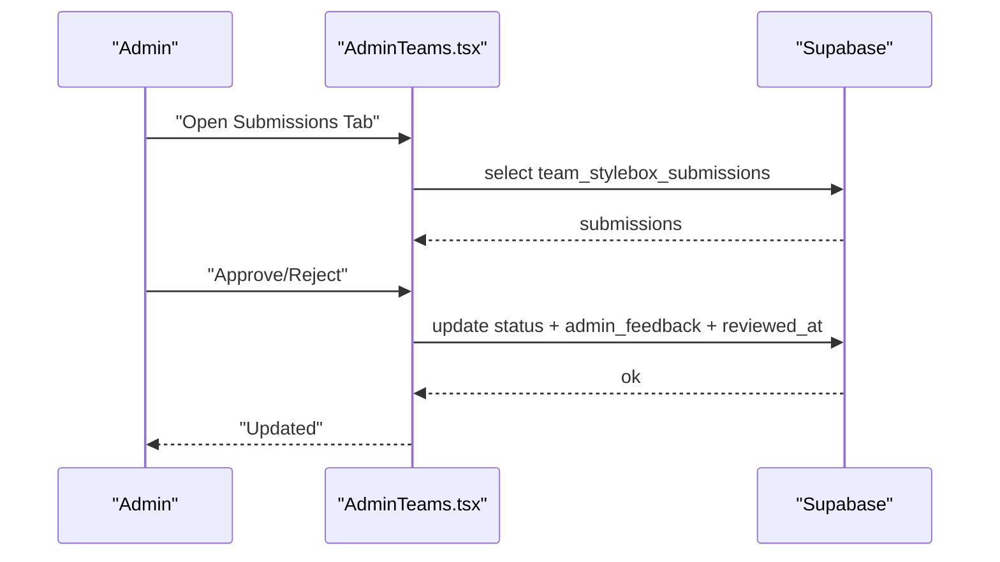
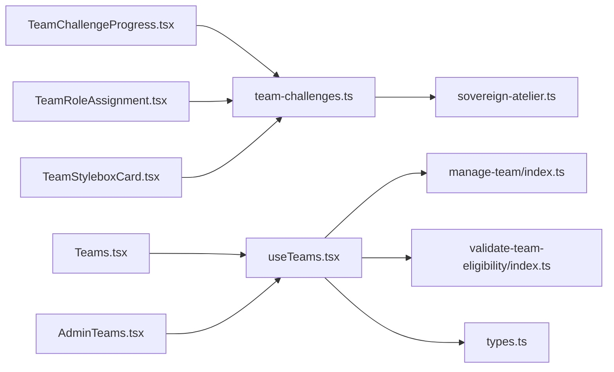

# Team Administration

<cite>
**Referenced Files in This Document**
- [TeamChallengeProgress.tsx](file://src/components/teams/TeamChallengeProgress.tsx)
- [TeamRoleAssignment.tsx](file://src/components/teams/TeamRoleAssignment.tsx)
- [TeamStyleboxCard.tsx](file://src/components/teams/TeamStyleboxCard.tsx)
- [useTeamData.tsx](file://src/hooks/useTeamData.tsx)
- [useTeams.tsx](file://src/hooks/useTeams.tsx)
- [AdminTeams.tsx](file://src/pages/admin/AdminTeams.tsx)
- [Teams.tsx](file://src/pages/Teams.tsx)
- [team-challenges.ts](file://src/lib/team-challenges.ts)
- [sovereign-atelier.ts](file://src/lib/sovereign-atelier.ts)
- [manage-team/index.ts](file://supabase/functions/manage-team/index.ts)
- [validate-team-eligibility/index.ts](file://supabase/functions/validate-team-eligibility/index.ts)
- [types.ts](file://src/integrations/supabase/types.ts)
</cite>

## Table of Contents
1. [Introduction](#introduction)
2. [Project Structure](#project-structure)
3. [Core Components](#core-components)
4. [Architecture Overview](#architecture-overview)
5. [Detailed Component Analysis](#detailed-component-analysis)
6. [Dependency Analysis](#dependency-analysis)
7. [Performance Considerations](#performance-considerations)
8. [Troubleshooting Guide](#troubleshooting-guide)
9. [Conclusion](#conclusion)
10. [Appendices](#appendices)

## Introduction
This document explains the team administration system for managing collaborative design projects and team structures. It covers:
- Team creation, invitations, join requests, and leadership workflows
- Team challenge progress tracking and role-based submissions
- Team role assignment and eligibility validation
- Team stylebox card interface for displaying progress and achievements
- Examples of creating teams, assigning roles, tracking challenges, and managing collaboration
- Performance metrics, leaderboards, and automated features

## Project Structure
The team administration system spans React components, hooks, page containers, shared libraries, and Supabase Edge Functions:
- Components: reusable UI for team challenges, role assignment, and team cards
- Hooks: data fetching and mutations for team lifecycle operations
- Pages: user-facing team dashboards and admin oversight
- Libraries: shared types and challenge definitions
- Edge Functions: serverless logic for team management and eligibility checks

**Diagram sources**
- [Teams.tsx](file://src/pages/Teams.tsx#L1-L633)
- [AdminTeams.tsx](file://src/pages/admin/AdminTeams.tsx#L1-L369)
- [TeamChallengeProgress.tsx](file://src/components/teams/TeamChallengeProgress.tsx#L1-L215)
- [TeamRoleAssignment.tsx](file://src/components/teams/TeamRoleAssignment.tsx#L1-L201)
- [TeamStyleboxCard.tsx](file://src/components/teams/TeamStyleboxCard.tsx#L1-L159)
- [useTeams.tsx](file://src/hooks/useTeams.tsx#L1-L579)
- [useTeamData.tsx](file://src/hooks/useTeamData.tsx#L1-L129)
- [team-challenges.ts](file://src/lib/team-challenges.ts#L1-L133)
- [sovereign-atelier.ts](file://src/lib/sovereign-atelier.ts#L1-L177)
- [manage-team/index.ts](file://supabase/functions/manage-team/index.ts#L1-L549)
- [validate-team-eligibility/index.ts](file://supabase/functions/validate-team-eligibility/index.ts#L1-L145)
- [types.ts](file://src/integrations/supabase/types.ts#L1-L800)

**Section sources**
- [Teams.tsx](file://src/pages/Teams.tsx#L1-L633)
- [AdminTeams.tsx](file://src/pages/admin/AdminTeams.tsx#L1-L369)
- [useTeams.tsx](file://src/hooks/useTeams.tsx#L1-L579)
- [useTeamData.tsx](file://src/hooks/useTeamData.tsx#L1-L129)
- [team-challenges.ts](file://src/lib/team-challenges.ts#L1-L133)
- [sovereign-atelier.ts](file://src/lib/sovereign-atelier.ts#L1-L177)
- [manage-team/index.ts](file://supabase/functions/manage-team/index.ts#L1-L549)
- [validate-team-eligibility/index.ts](file://supabase/functions/validate-team-eligibility/index.ts#L1-L145)
- [types.ts](file://src/integrations/supabase/types.ts#L1-L800)

## Core Components
- TeamStyleboxCard: displays team challenge details, eligibility, and team formation progress; triggers start actions.
- TeamRoleAssignment: modal for assigning team roles to members; enforces uniqueness and availability.
- TeamChallengeProgress: tracks team progress per role, deadlines, and submission statuses; supports uploads and viewing.
- useTeams: orchestrates team lifecycle (create, invite, join, leave), real-time updates, and admin review workflows.
- useTeamData: lightweight hook to fetch current team context for dashboards.
- AdminTeams: admin panel to review team submissions and update statuses.
- Team definitions: shared types and challenge specs for roles, deliverables, and evaluation criteria.

**Section sources**
- [TeamStyleboxCard.tsx](file://src/components/teams/TeamStyleboxCard.tsx#L1-L159)
- [TeamRoleAssignment.tsx](file://src/components/teams/TeamRoleAssignment.tsx#L1-L201)
- [TeamChallengeProgress.tsx](file://src/components/teams/TeamChallengeProgress.tsx#L1-L215)
- [useTeams.tsx](file://src/hooks/useTeams.tsx#L1-L579)
- [useTeamData.tsx](file://src/hooks/useTeamData.tsx#L1-L129)
- [AdminTeams.tsx](file://src/pages/admin/AdminTeams.tsx#L1-L369)
- [team-challenges.ts](file://src/lib/team-challenges.ts#L1-L133)
- [sovereign-atelier.ts](file://src/lib/sovereign-atelier.ts#L1-L177)

## Architecture Overview
The system integrates frontend React components with Supabase Edge Functions for secure, serverless operations. The Edge Functions encapsulate team management logic and eligibility checks, while the UI components coordinate user interactions and data presentation.

**Diagram sources**
- [Teams.tsx](file://src/pages/Teams.tsx#L67-L86)
- [useTeams.tsx](file://src/hooks/useTeams.tsx#L306-L351)
- [manage-team/index.ts](file://supabase/functions/manage-team/index.ts#L83-L202)

**Section sources**
- [Teams.tsx](file://src/pages/Teams.tsx#L67-L86)
- [useTeams.tsx](file://src/hooks/useTeams.tsx#L306-L351)
- [manage-team/index.ts](file://supabase/functions/manage-team/index.ts#L83-L202)

## Detailed Component Analysis

### Team Creation and Lifecycle
- Creation requires rank eligibility and enforces single-team membership.
- Team leads can invite users; invitations are stored and notified.
- Join requests are routed to leads; capacity is enforced.
- Leaving a team transfers leadership or deletes the team if solo lead.

**Diagram sources**
- [manage-team/index.ts](file://supabase/functions/manage-team/index.ts#L83-L532)
- [useTeams.tsx](file://src/hooks/useTeams.tsx#L353-L482)

**Section sources**
- [manage-team/index.ts](file://supabase/functions/manage-team/index.ts#L83-L532)
- [useTeams.tsx](file://src/hooks/useTeams.tsx#L353-L482)

### Team Role Assignment
- Prevents duplicate role assignments; available members exclude those already assigned.
- Confirms all roles are assigned before starting a challenge.
- Integrates with role metadata (requirements, deliverables, badges).

**Diagram sources**
- [TeamRoleAssignment.tsx](file://src/components/teams/TeamRoleAssignment.tsx#L53-L196)
- [team-challenges.ts](file://src/lib/team-challenges.ts#L47-L53)

**Section sources**
- [TeamRoleAssignment.tsx](file://src/components/teams/TeamRoleAssignment.tsx#L1-L201)
- [team-challenges.ts](file://src/lib/team-challenges.ts#L47-L53)

### Team Challenge Progress Tracking
- Computes progress from role submissions and displays per-role status.
- Shows countdown timers, deadlines, and optional total score.
- Enables current-user actions (upload/view) and revision feedback.

**Diagram sources**
- [TeamChallengeProgress.tsx](file://src/components/teams/TeamChallengeProgress.tsx#L62-L63)
- [team-challenges.ts](file://src/lib/team-challenges.ts#L66-L113)
- [AdminTeams.tsx](file://src/pages/admin/AdminTeams.tsx#L98-L121)

**Section sources**
- [TeamChallengeProgress.tsx](file://src/components/teams/TeamChallengeProgress.tsx#L1-L215)
- [team-challenges.ts](file://src/lib/team-challenges.ts#L66-L113)
- [AdminTeams.tsx](file://src/pages/admin/AdminTeams.tsx#L98-L121)

### Team Stylebox Card
- Displays challenge title, description, time limit, XP reward, and role preview.
- Shows team formation progress and eligibility warnings.
- Enables “Start Challenge” when eligible and team is full.

**Diagram sources**
- [TeamStyleboxCard.tsx](file://src/components/teams/TeamStyleboxCard.tsx#L46-L48)
- [sovereign-atelier.ts](file://src/lib/sovereign-atelier.ts#L132-L140)

**Section sources**
- [TeamStyleboxCard.tsx](file://src/components/teams/TeamStyleboxCard.tsx#L1-L159)
- [sovereign-atelier.ts](file://src/lib/sovereign-atelier.ts#L132-L140)

### Admin Team Management
- Lists teams and members, supports filtering and refresh.
- Reviews team submissions, approves/rejects with feedback.
- Provides admin feedback storage and timestamps.

**Diagram sources**
- [AdminTeams.tsx](file://src/pages/admin/AdminTeams.tsx#L80-L121)

**Section sources**
- [AdminTeams.tsx](file://src/pages/admin/AdminTeams.tsx#L1-L369)

## Dependency Analysis
- Components depend on shared types and challenge definitions.
- Hooks depend on Supabase client and Edge Functions for mutations.
- Edge Functions depend on Supabase service role keys and database policies.

**Diagram sources**
- [TeamChallengeProgress.tsx](file://src/components/teams/TeamChallengeProgress.tsx#L1-L215)
- [TeamRoleAssignment.tsx](file://src/components/teams/TeamRoleAssignment.tsx#L1-L201)
- [TeamStyleboxCard.tsx](file://src/components/teams/TeamStyleboxCard.tsx#L1-L159)
- [team-challenges.ts](file://src/lib/team-challenges.ts#L1-L133)
- [sovereign-atelier.ts](file://src/lib/sovereign-atelier.ts#L1-L177)
- [Teams.tsx](file://src/pages/Teams.tsx#L1-L633)
- [AdminTeams.tsx](file://src/pages/admin/AdminTeams.tsx#L1-L369)
- [useTeams.tsx](file://src/hooks/useTeams.tsx#L1-L579)
- [manage-team/index.ts](file://supabase/functions/manage-team/index.ts#L1-L549)
- [validate-team-eligibility/index.ts](file://supabase/functions/validate-team-eligibility/index.ts#L1-L145)
- [types.ts](file://src/integrations/supabase/types.ts#L1-L800)

**Section sources**
- [team-challenges.ts](file://src/lib/team-challenges.ts#L1-L133)
- [sovereign-atelier.ts](file://src/lib/sovereign-atelier.ts#L1-L177)
- [useTeams.tsx](file://src/hooks/useTeams.tsx#L1-L579)
- [manage-team/index.ts](file://supabase/functions/manage-team/index.ts#L1-L549)
- [validate-team-eligibility/index.ts](file://supabase/functions/validate-team-eligibility/index.ts#L1-L145)
- [types.ts](file://src/integrations/supabase/types.ts#L1-L800)

## Performance Considerations
- Minimize re-fetches by leveraging react-query invalidations and local state caching in hooks.
- Debounce search inputs in admin and discovery views.
- Use server-side limits and pagination for large datasets (already present in queries).
- Offload heavy computations to Edge Functions (e.g., eligibility checks) to keep UI responsive.

## Troubleshooting Guide
Common issues and resolutions:
- Unauthorized or expired tokens: Ensure proper auth headers are forwarded to Edge Functions.
- Missing service role key: Verify SUPABASE_SERVICE_ROLE_KEY is configured.
- Rank requirement failures: Confirm user’s rank meets minimum thresholds before creating teams or starting challenges.
- Invitation/Join Request errors: Check team capacity and existing memberships.
- Eligibility validation failures: Ensure all team members meet minimum rank and size requirements.

**Section sources**
- [manage-team/index.ts](file://supabase/functions/manage-team/index.ts#L14-L56)
- [validate-team-eligibility/index.ts](file://supabase/functions/validate-team-eligibility/index.ts#L22-L33)

## Conclusion
The team administration system provides a robust framework for designing, forming, and managing collaborative teams. It combines intuitive UI components, reliable hooks, and secure Edge Functions to support team creation, role assignment, challenge tracking, and admin oversight. By enforcing eligibility rules and automating notifications, it streamlines workflows and encourages high-quality team-based submissions.

## Appendices

### Example Workflows

- Create a team
  - Navigate to the Teams page, open the create dialog, and submit required fields. The hook invokes the manage-team function to create the team and assign the creator as lead.
  - See [Teams.tsx](file://src/pages/Teams.tsx#L119-L218), [useTeams.tsx](file://src/hooks/useTeams.tsx#L306-L351), [manage-team/index.ts](file://supabase/functions/manage-team/index.ts#L83-L202).

- Assign roles and start a challenge
  - Open the role assignment modal, select members for each role ensuring uniqueness, confirm, and start the challenge.
  - See [TeamRoleAssignment.tsx](file://src/components/teams/TeamRoleAssignment.tsx#L53-L196), [team-challenges.ts](file://src/lib/team-challenges.ts#L47-L53).

- Track team challenge progress
  - Monitor progress bars, deadlines, and per-role statuses; upload or view submissions as needed.
  - See [TeamChallengeProgress.tsx](file://src/components/teams/TeamChallengeProgress.tsx#L62-L63), [team-challenges.ts](file://src/lib/team-challenges.ts#L66-L113).

- Admin review process
  - Review pending submissions, approve or reject with feedback, and observe updated statuses.
  - See [AdminTeams.tsx](file://src/pages/admin/AdminTeams.tsx#L98-L121).

### Automated Features
- Real-time updates: Subscriptions to invitations and team members keep UI synchronized.
- Eligibility checks: Dedicated function validates team composition against challenge requirements.
- Notifications: Automated notifications for invitations, join requests, and outcomes.

**Section sources**
- [useTeams.tsx](file://src/hooks/useTeams.tsx#L511-L556)
- [validate-team-eligibility/index.ts](file://supabase/functions/validate-team-eligibility/index.ts#L35-L134)