# User Management

<cite>
**Referenced Files in This Document**
- [AdminDesignerProfiles.tsx](file://src/pages/admin/AdminDesignerProfiles.tsx)
- [useAdminDesignerProfiles.ts](file://src/hooks/useAdminDesignerProfiles.ts)
- [AdminDesigners.tsx](file://src/pages/admin/AdminDesigners.tsx)
- [DesignerRankModal.tsx](file://src/components/admin/DesignerRankModal.tsx)
- [ranks.ts](file://src/lib/ranks.ts)
- [admin-client.ts](file://src/integrations/supabase/admin-client.ts)
- [AdminCollections.tsx](file://src/pages/admin/AdminCollections.tsx)
- [AdminCollectionsContent.tsx](file://src/components/admin/marketplace/AdminCollectionsContent.tsx)
- [CollectionReviewModal.tsx](file://src/components/admin/CollectionReviewModal.tsx)
- [AdminPublicationRequests.tsx](file://src/pages/admin/AdminPublicationRequests.tsx)
- [AdminPublicationReview.tsx](file://src/components/projects/AdminPublicationReview.tsx)
- [BulkPortfolioActions.tsx](file://src/components/portfolio/BulkPortfolioActions.tsx)
- [useGlobalSearch.tsx](file://src/hooks/useGlobalSearch.tsx)
- [AdminSecurity.tsx](file://src/pages/admin/AdminSecurity.tsx)
- [AdminSettings.tsx](file://src/pages/admin/AdminSettings.tsx)
- [20251209213954_141af71b-504d-4a68-a16d-b931834b1328.sql](file://supabase/migrations/20251209213954_141af71b-504d-4a68-a16d-b931834b1328.sql)
- [20251209220223_71c698ff-f4d2-4830-bc60-ed7aabd9e86e.sql](file://supabase/migrations/20251209220223_71c698ff-f4d2-4830-bc60-ed7aabd9e86e.sql)
- [20260126040000_admin_auth_security.sql](file://supabase/migrations/20260126040000_admin_auth_security.sql)
- [20260201000002_create_profile_approval_logs.sql](file://supabase/migrations/20260201000002_create_profile_approval_logs.sql)
</cite>

## Table of Contents
1. [Introduction](#introduction)
2. [Project Structure](#project-structure)
3. [Core Components](#core-components)
4. [Architecture Overview](#architecture-overview)
5. [Detailed Component Analysis](#detailed-component-analysis)
6. [Dependency Analysis](#dependency-analysis)
7. [Performance Considerations](#performance-considerations)
8. [Troubleshooting Guide](#troubleshooting-guide)
9. [Conclusion](#conclusion)
10. [Appendices](#appendices)

## Introduction
This document describes the admin user management system with a focus on designer listing, approvals, ranks, and portfolio review. It covers:
- Designer listing interface with filtering, sorting, and bulk actions
- Designer profile management including approval workflows, rank assignments, and account status controls
- Profile review process for designer applications and approval/rejection workflows
- Collection review system for portfolio submissions and modal-based review interface
- Examples of managing designer accounts, approving new designers, updating designer ranks, and handling portfolio review requests
- User search functionality, batch operations, and audit trails for administrative actions

## Project Structure
The admin user management functionality spans page-level components, shared UI components, hooks for data fetching and mutations, and Supabase integration for admin sessions and edge functions.

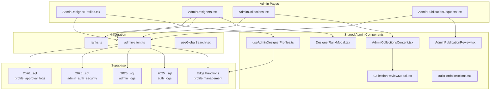

**Diagram sources**
- [AdminDesignerProfiles.tsx](file://src/pages/admin/AdminDesignerProfiles.tsx#L1-L321)
- [useAdminDesignerProfiles.ts](file://src/hooks/useAdminDesignerProfiles.ts#L1-L148)
- [AdminDesigners.tsx](file://src/pages/admin/AdminDesigners.tsx#L1-L426)
- [DesignerRankModal.tsx](file://src/components/admin/DesignerRankModal.tsx#L1-L217)
- [ranks.ts](file://src/lib/ranks.ts#L1-L246)
- [AdminCollections.tsx](file://src/pages/admin/AdminCollections.tsx#L1-L17)
- [AdminCollectionsContent.tsx](file://src/components/admin/marketplace/AdminCollectionsContent.tsx#L1-L752)
- [CollectionReviewModal.tsx](file://src/components/admin/CollectionReviewModal.tsx#L1-L366)
- [AdminPublicationRequests.tsx](file://src/pages/admin/AdminPublicationRequests.tsx#L1-L36)
- [AdminPublicationReview.tsx](file://src/components/projects/AdminPublicationReview.tsx#L1-L432)
- [BulkPortfolioActions.tsx](file://src/components/portfolio/BulkPortfolioActions.tsx#L1-L177)
- [admin-client.ts](file://src/integrations/supabase/admin-client.ts#L1-L28)
- [useGlobalSearch.tsx](file://src/hooks/useGlobalSearch.tsx#L1-L126)
- [20251209213954_141af71b-504d-4a68-a16d-b931834b1328.sql](file://supabase/migrations/20251209213954_141af71b-504d-4a68-a16d-b931834b1328.sql#L2-L36)
- [20251209220223_71c698ff-f4d2-4830-bc60-ed7aabd9e86e.sql](file://supabase/migrations/20251209220223_71c698ff-f4d2-4830-bc60-ed7aabd9e86e.sql#L2-L36)
- [20260126040000_admin_auth_security.sql](file://supabase/migrations/20260126040000_admin_auth_security.sql#L1-L26)
- [20260201000002_create_profile_approval_logs.sql](file://supabase/migrations/20260201000002_create_profile_approval_logs.sql)

**Section sources**
- [AdminDesignerProfiles.tsx](file://src/pages/admin/AdminDesignerProfiles.tsx#L1-L321)
- [AdminDesigners.tsx](file://src/pages/admin/AdminDesigners.tsx#L1-L426)
- [AdminCollections.tsx](file://src/pages/admin/AdminCollections.tsx#L1-L17)
- [AdminPublicationRequests.tsx](file://src/pages/admin/AdminPublicationRequests.tsx#L1-L36)

## Core Components
- Designer listing and profile management page with search, filters, and actions
- Hook encapsulating profile loading and approval/feature updates via Supabase edge functions
- Designer rank assignment modal with XP and status controls
- Collections management page with filtering, sorting, and status toggles
- Collection review modal supporting approval, revision requests, and rejection with feedback
- Publication request review workflow for portfolio submissions
- Bulk portfolio actions for mass operations
- Global search hook for cross-module search
- Admin security and audit trail infrastructure

**Section sources**
- [AdminDesignerProfiles.tsx](file://src/pages/admin/AdminDesignerProfiles.tsx#L37-L321)
- [useAdminDesignerProfiles.ts](file://src/hooks/useAdminDesignerProfiles.ts#L24-L148)
- [DesignerRankModal.tsx](file://src/components/admin/DesignerRankModal.tsx#L40-L217)
- [AdminCollectionsContent.tsx](file://src/components/admin/marketplace/AdminCollectionsContent.tsx#L92-L752)
- [CollectionReviewModal.tsx](file://src/components/admin/CollectionReviewModal.tsx#L68-L366)
- [AdminPublicationReview.tsx](file://src/components/projects/AdminPublicationReview.tsx#L9-L432)
- [BulkPortfolioActions.tsx](file://src/components/portfolio/BulkPortfolioActions.tsx#L29-L177)
- [useGlobalSearch.tsx](file://src/hooks/useGlobalSearch.tsx#L14-L126)

## Architecture Overview
The admin system uses a React + Supabase architecture:
- Admin pages orchestrate UI and state
- Hooks encapsulate data fetching and mutations
- Supabase edge functions enforce server-side logic for sensitive operations (e.g., profile management)
- Dedicated admin client isolates admin sessions and storage
- Audit and security policies are enforced via database migrations

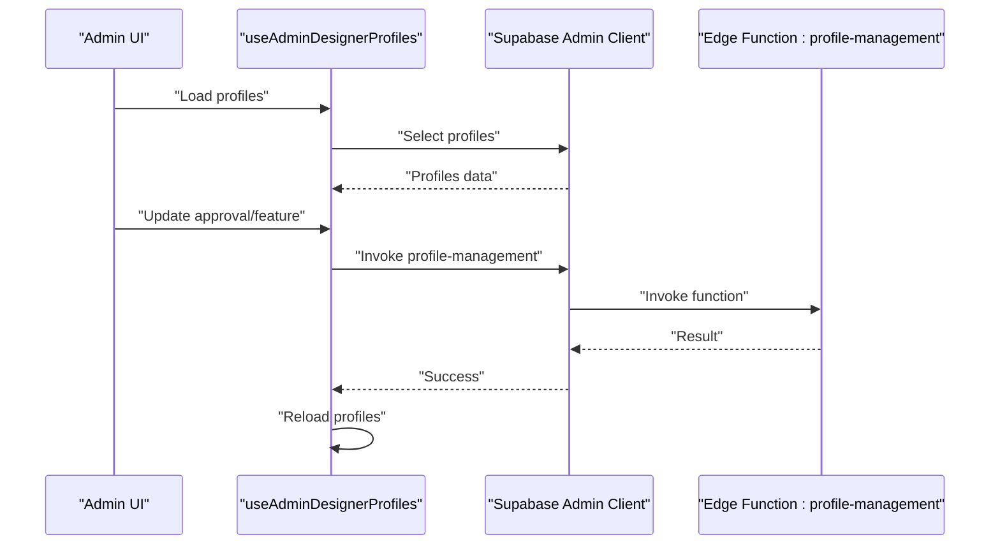

**Diagram sources**
- [useAdminDesignerProfiles.ts](file://src/hooks/useAdminDesignerProfiles.ts#L29-L134)
- [admin-client.ts](file://src/integrations/supabase/admin-client.ts#L16-L27)

**Section sources**
- [useAdminDesignerProfiles.ts](file://src/hooks/useAdminDesignerProfiles.ts#L29-L134)
- [admin-client.ts](file://src/integrations/supabase/admin-client.ts#L16-L27)

## Detailed Component Analysis

### Designer Listing and Profile Management
- Provides search across name, email, brand, and bio
- Filters by status (approved/pending/rejected) and featured flag
- Actions per row: approve/unapprove, feature/unfeature, preview profile
- Uses a dedicated hook to load profiles and invoke edge functions for approval/feature updates

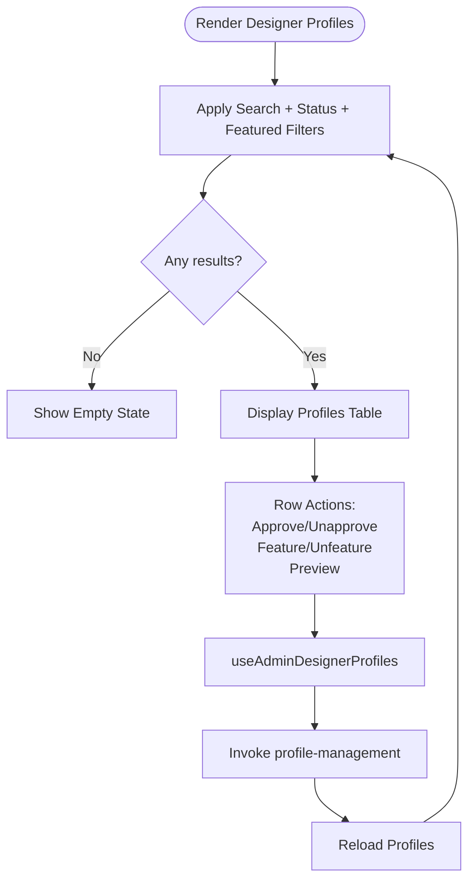

**Diagram sources**
- [AdminDesignerProfiles.tsx](file://src/pages/admin/AdminDesignerProfiles.tsx#L46-L81)
- [useAdminDesignerProfiles.ts](file://src/hooks/useAdminDesignerProfiles.ts#L68-L134)

**Section sources**
- [AdminDesignerProfiles.tsx](file://src/pages/admin/AdminDesignerProfiles.tsx#L37-L321)
- [useAdminDesignerProfiles.ts](file://src/hooks/useAdminDesignerProfiles.ts#L24-L148)

### Designer Profile Approval Workflow
- Approval and unapproval actions call an edge function with admin context
- On success, profiles are reloaded to reflect the change
- Approval logs are maintained in the database

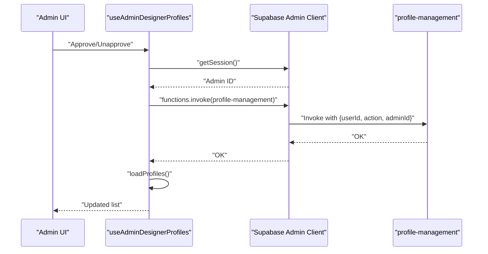

**Diagram sources**
- [useAdminDesignerProfiles.ts](file://src/hooks/useAdminDesignerProfiles.ts#L68-L100)
- [20260201000002_create_profile_approval_logs.sql](file://supabase/migrations/20260201000002_create_profile_approval_logs.sql)

**Section sources**
- [useAdminDesignerProfiles.ts](file://src/hooks/useAdminDesignerProfiles.ts#L68-L100)
- [20260201000002_create_profile_approval_logs.sql](file://supabase/migrations/20260201000002_create_profile_approval_logs.sql)

### Designer Rank Assignment and Status Controls
- Modal allows selecting rank, setting XP, and changing status
- Updates the profiles table and invalidates rank-related queries
- Integrates with the rank system definitions

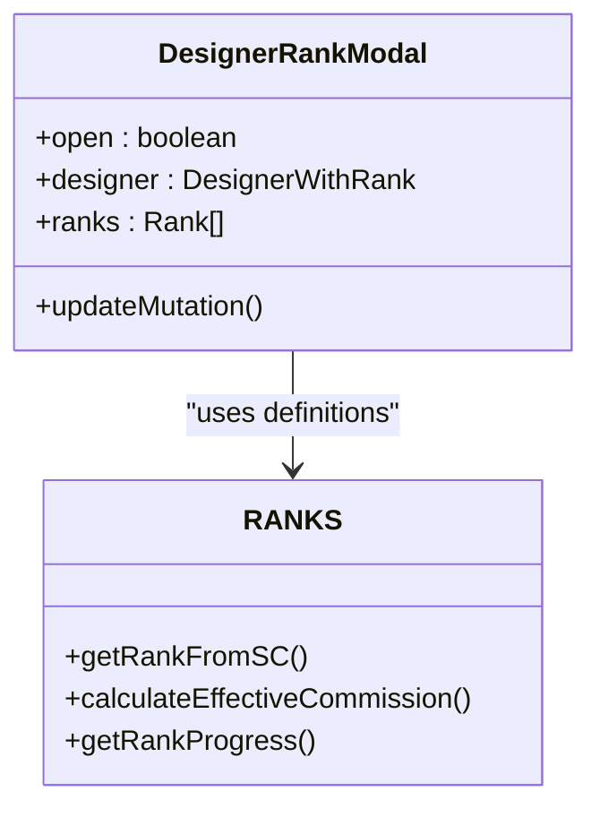

**Diagram sources**
- [DesignerRankModal.tsx](file://src/components/admin/DesignerRankModal.tsx#L40-L217)
- [ranks.ts](file://src/lib/ranks.ts#L60-L177)

**Section sources**
- [DesignerRankModal.tsx](file://src/components/admin/DesignerRankModal.tsx#L40-L217)
- [ranks.ts](file://src/lib/ranks.ts#L60-L177)

### Collections Management and Sorting
- Loads products and articles, merges into unified list
- Supports search by title, designer, category; filter by designer, type, status
- Sorting by clicking column headers
- Bulk actions: activate/deactivate, edit, delete
- Modal-based creation/editing of collections

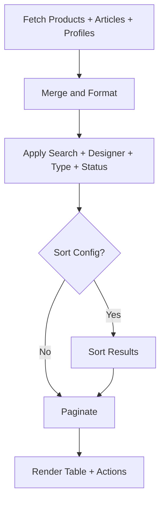

**Diagram sources**
- [AdminCollectionsContent.tsx](file://src/components/admin/marketplace/AdminCollectionsContent.tsx#L104-L322)

**Section sources**
- [AdminCollectionsContent.tsx](file://src/components/admin/marketplace/AdminCollectionsContent.tsx#L92-L752)

### Collection Review Modal and Workflow
- Modal displays designer info, submission details, files, and notes
- Actions: Approve, Request Revisions, Reject with feedback requirement
- Maintains previous admin feedback display

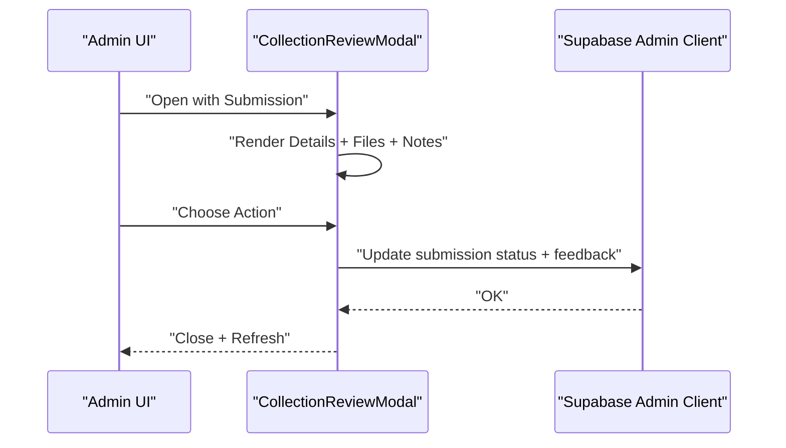

**Diagram sources**
- [CollectionReviewModal.tsx](file://src/components/admin/CollectionReviewModal.tsx#L81-L101)
- [AdminCollectionsContent.tsx](file://src/components/admin/marketplace/AdminCollectionsContent.tsx#L366-L386)

**Section sources**
- [CollectionReviewModal.tsx](file://src/components/admin/CollectionReviewModal.tsx#L68-L366)
- [AdminCollectionsContent.tsx](file://src/components/admin/marketplace/AdminCollectionsContent.tsx#L366-L386)

### Publication Request Review Workflow
- Lists pending/all publication requests with project details and assets
- Approve converts request to marketplace product and links IDs
- Reject and request review update status with admin notes

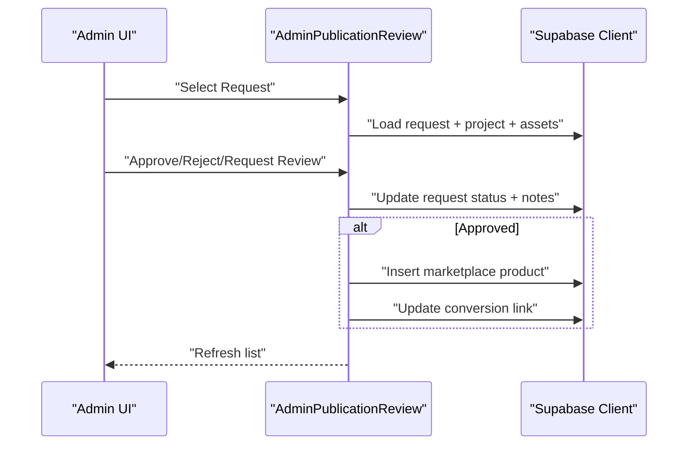

**Diagram sources**
- [AdminPublicationReview.tsx](file://src/components/projects/AdminPublicationReview.tsx#L90-L194)

**Section sources**
- [AdminPublicationRequests.tsx](file://src/pages/admin/AdminPublicationRequests.tsx#L1-L36)
- [AdminPublicationReview.tsx](file://src/components/projects/AdminPublicationReview.tsx#L9-L432)

### Bulk Portfolio Actions
- Supports feature/unfeature/archive/delete for selected projects
- Performs cascading deletes for assets then projects
- Invalidates portfolio queries on success

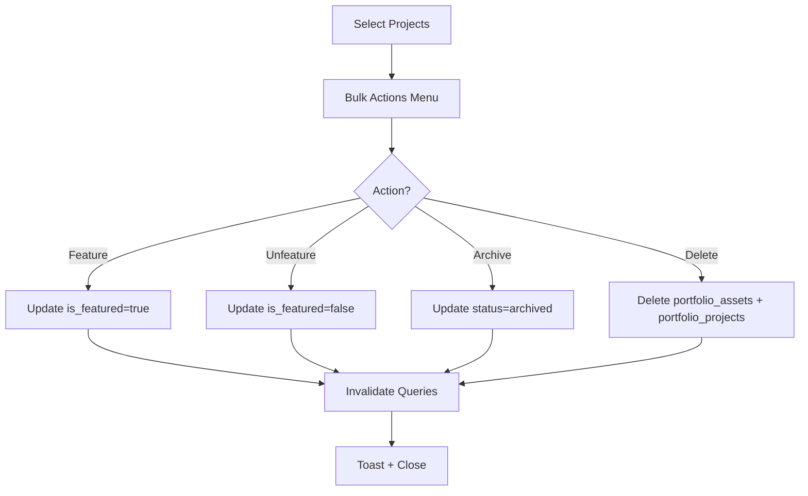

**Diagram sources**
- [BulkPortfolioActions.tsx](file://src/components/portfolio/BulkPortfolioActions.tsx#L36-L117)

**Section sources**
- [BulkPortfolioActions.tsx](file://src/components/portfolio/BulkPortfolioActions.tsx#L29-L177)

### User Search and Batch Operations
- Global search hook invokes a Postgres RPC with relevance scoring
- Batch operations available in portfolio management for mass edits

**Section sources**
- [useGlobalSearch.tsx](file://src/hooks/useGlobalSearch.tsx#L14-L37)
- [BulkPortfolioActions.tsx](file://src/components/portfolio/BulkPortfolioActions.tsx#L119-L126)

### Audit Trails and Security
- Admin and auth logs tables with RLS policies
- Admin logs capture administrative actions with metadata
- Admin client isolates sessions and enforces role checks

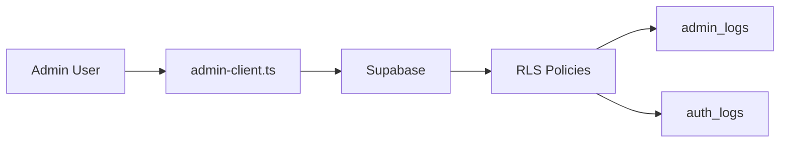

**Diagram sources**
- [admin-client.ts](file://src/integrations/supabase/admin-client.ts#L16-L27)
- [20251209213954_141af71b-504d-4a68-a16d-b931834b1328.sql](file://supabase/migrations/20251209213954_141af71b-504d-4a68-a16d-b931834b1328.sql#L2-L36)
- [20251209220223_71c698ff-f4d2-4830-bc60-ed7aabd9e86e.sql](file://supabase/migrations/20251209220223_71c698ff-f4d2-4830-bc60-ed7aabd9e86e.sql#L2-L36)
- [20260126040000_admin_auth_security.sql](file://supabase/migrations/20260126040000_admin_auth_security.sql#L1-L26)

**Section sources**
- [AdminSecurity.tsx](file://src/pages/admin/AdminSecurity.tsx#L287-L316)
- [AdminSettings.tsx](file://src/pages/admin/AdminSettings.tsx#L128-L166)
- [admin-client.ts](file://src/integrations/supabase/admin-client.ts#L16-L27)
- [20251209213954_141af71b-504d-4a68-a16d-b931834b1328.sql](file://supabase/migrations/20251209213954_141af71b-504d-4a68-a16d-b931834b1328.sql#L2-L36)
- [20251209220223_71c698ff-f4d2-4830-bc60-ed7aabd9e86e.sql](file://supabase/migrations/20251209220223_71c698ff-f4d2-4830-bc60-ed7aabd9e86e.sql#L2-L36)
- [20260126040000_admin_auth_security.sql](file://supabase/migrations/20260126040000_admin_auth_security.sql#L1-L26)

## Dependency Analysis
- Admin pages depend on shared components and hooks
- Hooks depend on the admin client and edge functions
- Collections and publication review components depend on Supabase RPCs and joins
- Audit and security rely on database policies and admin client isolation

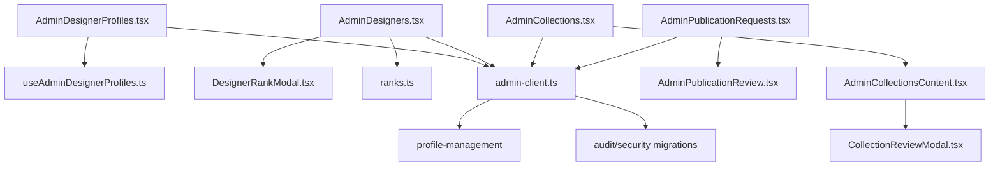

**Diagram sources**
- [AdminDesignerProfiles.tsx](file://src/pages/admin/AdminDesignerProfiles.tsx#L1-L321)
- [useAdminDesignerProfiles.ts](file://src/hooks/useAdminDesignerProfiles.ts#L1-L148)
- [AdminDesigners.tsx](file://src/pages/admin/AdminDesigners.tsx#L1-L426)
- [DesignerRankModal.tsx](file://src/components/admin/DesignerRankModal.tsx#L1-L217)
- [ranks.ts](file://src/lib/ranks.ts#L1-L246)
- [AdminCollections.tsx](file://src/pages/admin/AdminCollections.tsx#L1-L17)
- [AdminCollectionsContent.tsx](file://src/components/admin/marketplace/AdminCollectionsContent.tsx#L1-L752)
- [CollectionReviewModal.tsx](file://src/components/admin/CollectionReviewModal.tsx#L1-L366)
- [AdminPublicationRequests.tsx](file://src/pages/admin/AdminPublicationRequests.tsx#L1-L36)
- [AdminPublicationReview.tsx](file://src/components/projects/AdminPublicationReview.tsx#L1-L432)
- [admin-client.ts](file://src/integrations/supabase/admin-client.ts#L1-L28)

**Section sources**
- [AdminDesignerProfiles.tsx](file://src/pages/admin/AdminDesignerProfiles.tsx#L1-L321)
- [AdminDesigners.tsx](file://src/pages/admin/AdminDesigners.tsx#L1-L426)
- [AdminCollections.tsx](file://src/pages/admin/AdminCollections.tsx#L1-L17)
- [AdminPublicationRequests.tsx](file://src/pages/admin/AdminPublicationRequests.tsx#L1-L36)

## Performance Considerations
- UseMemo and pagination reduce rendering overhead in large lists
- StaleTime/GCTime configured for queries to balance freshness and performance
- Sorting and filtering computed on the client after fetching combined datasets
- Debounce or controlled search to avoid excessive RPC calls

[No sources needed since this section provides general guidance]

## Troubleshooting Guide
Common issues and resolutions:
- Approval/feature actions fail: verify admin session exists and edge function permissions
- Collections not loading: check RPCs and join logic; confirm designer profiles fetch succeeded
- Audit logs missing: ensure RLS policies and admin role checks are satisfied
- Bulk operations failing: inspect cascading deletes and error messages from mutations

**Section sources**
- [useAdminDesignerProfiles.ts](file://src/hooks/useAdminDesignerProfiles.ts#L68-L100)
- [AdminCollectionsContent.tsx](file://src/components/admin/marketplace/AdminCollectionsContent.tsx#L104-L196)
- [AdminSecurity.tsx](file://src/pages/admin/AdminSecurity.tsx#L287-L316)
- [BulkPortfolioActions.tsx](file://src/components/portfolio/BulkPortfolioActions.tsx#L111-L117)

## Conclusion
The admin user management system provides a comprehensive toolkit for designer profile oversight, rank management, portfolio review, and operational controls. It leverages Supabase edge functions for secure operations, robust filtering and sorting, and strong audit and security foundations.

[No sources needed since this section summarizes without analyzing specific files]

## Appendices

### Example Workflows

- Managing designer accounts
  - Navigate to Designer Management, filter by status or rank, and toggle account status via the actions menu.
  - Use the rank modal to assign ranks and adjust XP and status.

- Approving new designers
  - Open the Designer Profiles page, locate the pending profile, and click Approve.
  - The system invokes the profile-management edge function and reloads the list.

- Updating designer ranks
  - Open the rank modal from the Designer Management page, select a rank, adjust XP, and save changes.
  - The system updates the profile and invalidates cached queries.

- Handling portfolio review requests
  - Go to Publication Requests, select a pending request, review project details and assets, then Approve (creating a marketplace product) or Reject with feedback.

- Performing bulk operations
  - Select multiple portfolio projects and choose Bulk Actions to feature/unfeature/archive/delete them in one step.

[No sources needed since this section provides general guidance]