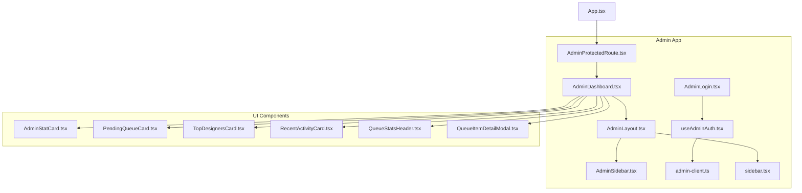
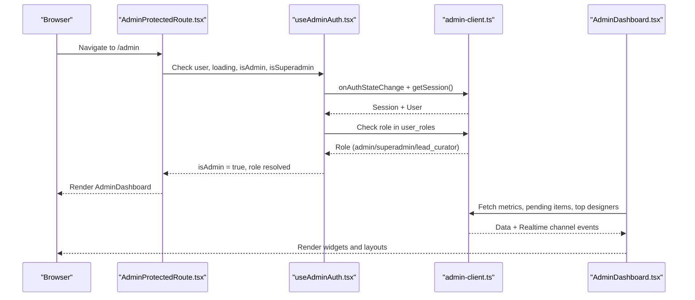
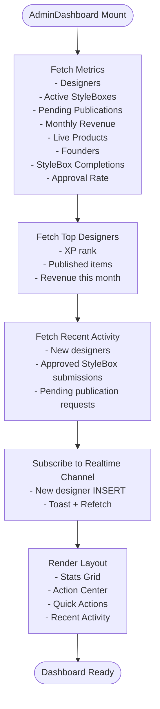
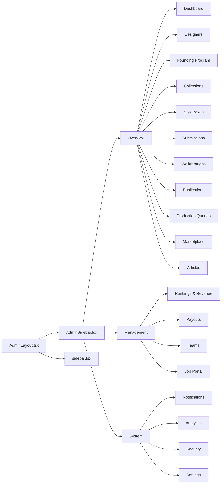
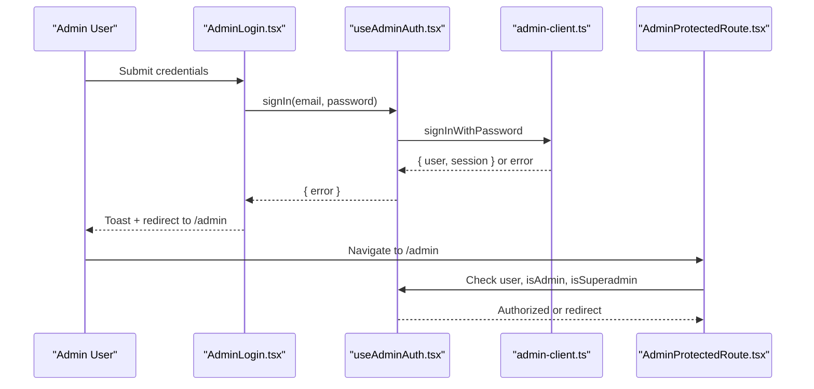
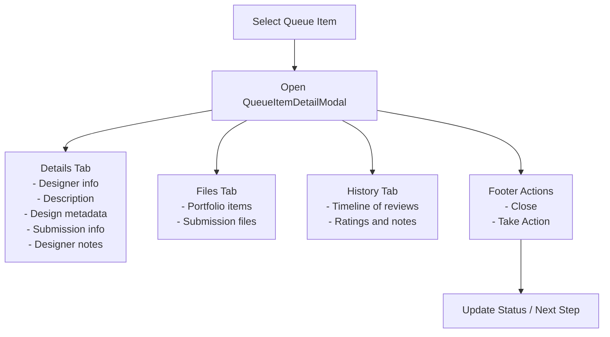
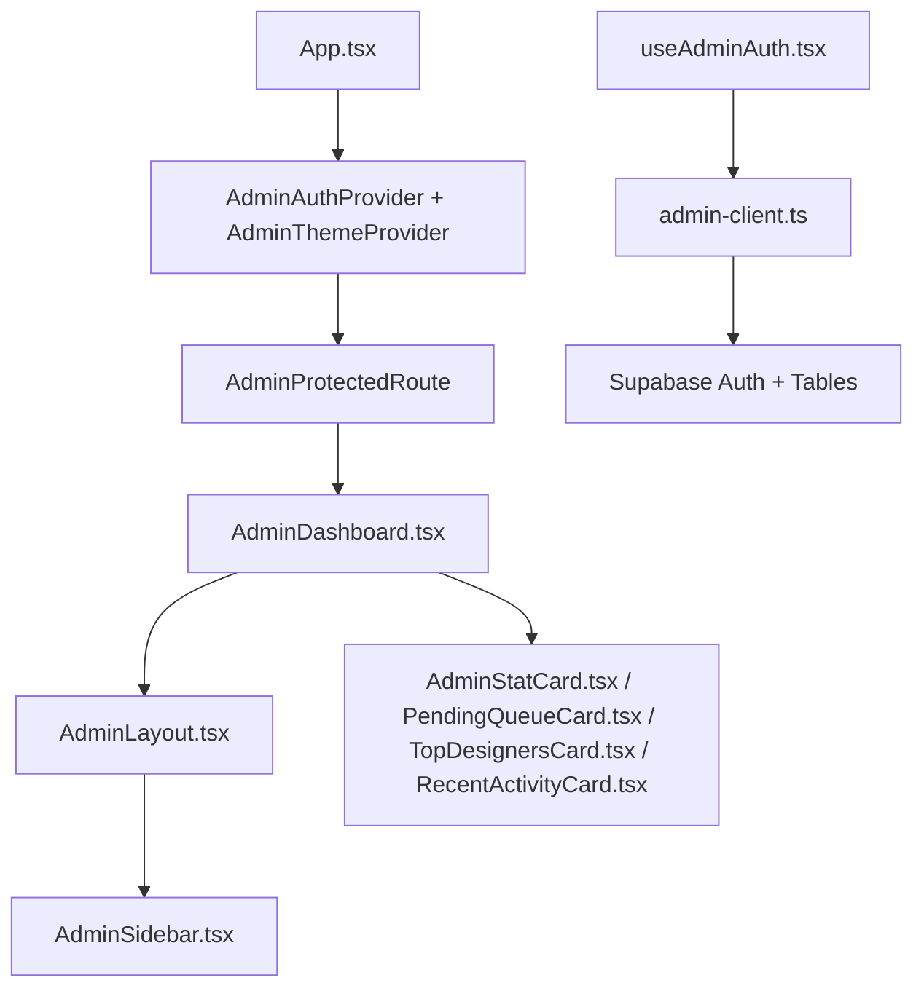

# Admin Dashboard Overview

<cite>
**Referenced Files in This Document**
- [AdminDashboard.tsx](file://src/pages/admin/AdminDashboard.tsx)
- [AdminLayout.tsx](file://src/components/admin/AdminLayout.tsx)
- [AdminSidebar.tsx](file://src/components/admin/AdminSidebar.tsx)
- [AdminStatCard.tsx](file://src/components/admin/AdminStatCard.tsx)
- [PendingQueueCard.tsx](file://src/components/admin/PendingQueueCard.tsx)
- [TopDesignersCard.tsx](file://src/components/admin/TopDesignersCard.tsx)
- [RecentActivityCard.tsx](file://src/components/admin/RecentActivityCard.tsx)
- [AdminProtectedRoute.tsx](file://src/components/auth/AdminProtectedRoute.tsx)
- [useAdminAuth.tsx](file://src/hooks/useAdminAuth.tsx)
- [admin-client.ts](file://src/integrations/supabase/admin-client.ts)
- [App.tsx](file://src/App.tsx)
- [sidebar.tsx](file://src/components/ui/sidebar.tsx)
- [QueueStatsHeader.tsx](file://src/components/admin/QueueStatsHeader.tsx)
- [QueueItemDetailModal.tsx](file://src/components/admin/QueueItemDetailModal.tsx)
- [AdminLogin.tsx](file://src/pages/admin/AdminLogin.tsx)
</cite>

## Table of Contents
1. [Introduction](#introduction)
2. [Project Structure](#project-structure)
3. [Core Components](#core-components)
4. [Architecture Overview](#architecture-overview)
5. [Detailed Component Analysis](#detailed-component-analysis)
6. [Dependency Analysis](#dependency-analysis)
7. [Performance Considerations](#performance-considerations)
8. [Troubleshooting Guide](#troubleshooting-guide)
9. [Conclusion](#conclusion)

## Introduction
This document provides a comprehensive overview of the admin dashboard system. It explains the main admin interface, layout structure, navigation system, and key administrative controls. It also documents dashboard widgets, quick access panels, administrative shortcuts, the admin layout components, sidebar navigation, and the overall user interface design. Additionally, it covers the admin authentication flow, session management, and security measures, along with practical usage examples and navigation patterns.

## Project Structure
The admin dashboard is built as a separate application within the larger studio platform. It uses a dedicated authentication provider, theme provider, and routing guards to isolate admin sessions from studio sessions. The dashboard page composes reusable admin components for statistics, queues, rankings, and recent activity.

**Diagram sources**
- [App.tsx](file://src/App.tsx#L241-L338)
- [AdminLogin.tsx](file://src/pages/admin/AdminLogin.tsx#L1-L158)
- [AdminDashboard.tsx](file://src/pages/admin/AdminDashboard.tsx#L1-L428)
- [AdminLayout.tsx](file://src/components/admin/AdminLayout.tsx#L1-L238)
- [AdminSidebar.tsx](file://src/components/admin/AdminSidebar.tsx#L1-L254)
- [AdminProtectedRoute.tsx](file://src/components/auth/AdminProtectedRoute.tsx#L1-L46)
- [useAdminAuth.tsx](file://src/hooks/useAdminAuth.tsx#L1-L216)
- [admin-client.ts](file://src/integrations/supabase/admin-client.ts#L1-L28)
- [sidebar.tsx](file://src/components/ui/sidebar.tsx#L1-L638)
- [AdminStatCard.tsx](file://src/components/admin/AdminStatCard.tsx#L1-L88)
- [PendingQueueCard.tsx](file://src/components/admin/PendingQueueCard.tsx#L1-L142)
- [TopDesignersCard.tsx](file://src/components/admin/TopDesignersCard.tsx#L1-L106)
- [RecentActivityCard.tsx](file://src/components/admin/RecentActivityCard.tsx#L1-L135)
- [QueueStatsHeader.tsx](file://src/components/admin/QueueStatsHeader.tsx#L1-L97)
- [QueueItemDetailModal.tsx](file://src/components/admin/QueueItemDetailModal.tsx#L1-L528)

**Section sources**
- [App.tsx](file://src/App.tsx#L241-L338)

## Core Components
- AdminDashboard: Orchestrates data fetching, real-time updates, and renders the dashboard layout with statistics, quick actions, and administrative widgets.
- AdminLayout: Provides the top header, sidebar trigger, theme toggle, notifications, user menu, and command palette.
- AdminSidebar: Renders categorized navigation menus (Overview, Management, System) with role-aware visibility and logout.
- AdminProtectedRoute: Guards admin routes with authentication and optional superadmin requirement.
- useAdminAuth: Manages admin session state, role detection, sign-in/sign-out, and multi-tab synchronization.
- admin-client: Isolated Supabase client for admin with custom storage keys to prevent session crossover.
- Dashboard Widgets: AdminStatCard, PendingQueueCard, TopDesignersCard, RecentActivityCard, QueueStatsHeader, QueueItemDetailModal.

**Section sources**
- [AdminDashboard.tsx](file://src/pages/admin/AdminDashboard.tsx#L1-L428)
- [AdminLayout.tsx](file://src/components/admin/AdminLayout.tsx#L1-L238)
- [AdminSidebar.tsx](file://src/components/admin/AdminSidebar.tsx#L1-L254)
- [AdminProtectedRoute.tsx](file://src/components/auth/AdminProtectedRoute.tsx#L1-L46)
- [useAdminAuth.tsx](file://src/hooks/useAdminAuth.tsx#L1-L216)
- [admin-client.ts](file://src/integrations/supabase/admin-client.ts#L1-L28)
- [AdminStatCard.tsx](file://src/components/admin/AdminStatCard.tsx#L1-L88)
- [PendingQueueCard.tsx](file://src/components/admin/PendingQueueCard.tsx#L1-L142)
- [TopDesignersCard.tsx](file://src/components/admin/TopDesignersCard.tsx#L1-L106)
- [RecentActivityCard.tsx](file://src/components/admin/RecentActivityCard.tsx#L1-L135)
- [QueueStatsHeader.tsx](file://src/components/admin/QueueStatsHeader.tsx#L1-L97)
- [QueueItemDetailModal.tsx](file://src/components/admin/QueueItemDetailModal.tsx#L1-L528)

## Architecture Overview
The admin system is structured around a dedicated provider stack and route guards. Authentication is handled by a separate Supabase client with isolated storage to avoid conflicts with studio sessions. The dashboard aggregates data from multiple domain tables and exposes real-time updates via Supabase channels.

**Diagram sources**
- [AdminProtectedRoute.tsx](file://src/components/auth/AdminProtectedRoute.tsx#L11-L45)
- [useAdminAuth.tsx](file://src/hooks/useAdminAuth.tsx#L50-L132)
- [admin-client.ts](file://src/integrations/supabase/admin-client.ts#L14-L27)
- [AdminDashboard.tsx](file://src/pages/admin/AdminDashboard.tsx#L47-L272)

## Detailed Component Analysis

### Admin Dashboard Layout and Widgets
The dashboard composes:
- Header with role badge and time range selector
- Primary stats cards (Total Designers, Active StyleBoxes, Pending Publications, Monthly Revenue)
- Secondary stats cards (Founders, Live Products, StyleBox Completions, Approval Rate)
- Action Center: Pending Publications queue and Top Designers
- Quick Actions panel for frequent tasks
- Recent Activity feed

**Diagram sources**
- [AdminDashboard.tsx](file://src/pages/admin/AdminDashboard.tsx#L47-L272)

**Section sources**
- [AdminDashboard.tsx](file://src/pages/admin/AdminDashboard.tsx#L29-L428)
- [AdminStatCard.tsx](file://src/components/admin/AdminStatCard.tsx#L1-L88)
- [PendingQueueCard.tsx](file://src/components/admin/PendingQueueCard.tsx#L1-L142)
- [TopDesignersCard.tsx](file://src/components/admin/TopDesignersCard.tsx#L1-L106)
- [RecentActivityCard.tsx](file://src/components/admin/RecentActivityCard.tsx#L1-L135)

### Admin Layout and Navigation
The AdminLayout provides:
- Top header with sidebar trigger, global search, theme toggle, notifications, and user menu
- Command palette for quick navigation across admin sections
- Main content area wrapped by AdminLayout

AdminSidebar organizes navigation into three groups:
- Overview: Dashboard, Designers, Founding Program, Collections, StyleBoxes, Submissions, Walkthroughs, Publications, Production Queues, Marketplace, Articles
- Management: Rankings & Revenue, Payouts, Teams, Job Portal
- System: Notifications, Analytics, Security, Settings (Security visible only to superadmin)

**Diagram sources**
- [AdminLayout.tsx](file://src/components/admin/AdminLayout.tsx#L91-L237)
- [AdminSidebar.tsx](file://src/components/admin/AdminSidebar.tsx#L42-L202)
- [sidebar.tsx](file://src/components/ui/sidebar.tsx#L131-L216)

**Section sources**
- [AdminLayout.tsx](file://src/components/admin/AdminLayout.tsx#L1-L238)
- [AdminSidebar.tsx](file://src/components/admin/AdminSidebar.tsx#L1-L254)
- [sidebar.tsx](file://src/components/ui/sidebar.tsx#L1-L638)

### Admin Authentication Flow and Session Management
- AdminLogin validates credentials and triggers sign-in via useAdminAuth.
- useAdminAuth manages session lifecycle, role resolution, and multi-tab synchronization.
- admin-client creates an isolated Supabase client with custom storage keys to prevent session overlap with studio sessions.
- AdminProtectedRoute enforces authentication and optional superadmin-only access for sensitive routes.

**Diagram sources**
- [AdminLogin.tsx](file://src/pages/admin/AdminLogin.tsx#L32-L68)
- [useAdminAuth.tsx](file://src/hooks/useAdminAuth.tsx#L142-L172)
- [admin-client.ts](file://src/integrations/supabase/admin-client.ts#L14-L27)
- [AdminProtectedRoute.tsx](file://src/components/auth/AdminProtectedRoute.tsx#L11-L45)

**Section sources**
- [AdminLogin.tsx](file://src/pages/admin/AdminLogin.tsx#L1-L158)
- [useAdminAuth.tsx](file://src/hooks/useAdminAuth.tsx#L1-L216)
- [admin-client.ts](file://src/integrations/supabase/admin-client.ts#L1-L28)
- [AdminProtectedRoute.tsx](file://src/components/auth/AdminProtectedRoute.tsx#L1-L46)

### Administrative Controls and Shortcuts
- Quick Actions: View All Designers, Create StyleBox, Review Queue, Process Payouts
- Pending Queue: Approve, Request Revision, Reject actions per item
- Top Designers: Revenue and completion metrics with ranking badges
- Recent Activity: Registration, StyleBox completion, Publication request events
- Command Palette: Quick navigation to designers, styleboxes, publications, marketplace, jobs

**Section sources**
- [AdminDashboard.tsx](file://src/pages/admin/AdminDashboard.tsx#L291-L411)
- [PendingQueueCard.tsx](file://src/components/admin/PendingQueueCard.tsx#L96-L125)
- [TopDesignersCard.tsx](file://src/components/admin/TopDesignersCard.tsx#L46-L101)
- [RecentActivityCard.tsx](file://src/components/admin/RecentActivityCard.tsx#L77-L120)
- [AdminLayout.tsx](file://src/components/admin/AdminLayout.tsx#L204-L232)

### Production Queues and Review Workflows
- QueueStatsHeader displays counts across submission, sampling, tech packs, pre-production, marketplace, urgent items, average wait time, and completed today.
- QueueItemDetailModal provides a detailed view of publication submissions, designer info, files, and review history with timeline visualization.

**Diagram sources**
- [QueueStatsHeader.tsx](file://src/components/admin/QueueStatsHeader.tsx#L28-L96)
- [QueueItemDetailModal.tsx](file://src/components/admin/QueueItemDetailModal.tsx#L67-L527)

**Section sources**
- [QueueStatsHeader.tsx](file://src/components/admin/QueueStatsHeader.tsx#L1-L97)
- [QueueItemDetailModal.tsx](file://src/components/admin/QueueItemDetailModal.tsx#L1-L528)

## Dependency Analysis
The admin system relies on:
- Supabase for authentication and data access with an isolated client
- React Router for protected routes and nested providers
- TanStack Query for data fetching and caching
- Radix UI and shadcn/ui primitives for UI components
- Framer Motion for animations

**Diagram sources**
- [App.tsx](file://src/App.tsx#L101-L110)
- [AdminProtectedRoute.tsx](file://src/components/auth/AdminProtectedRoute.tsx#L11-L45)
- [AdminDashboard.tsx](file://src/pages/admin/AdminDashboard.tsx#L1-L428)
- [AdminLayout.tsx](file://src/components/admin/AdminLayout.tsx#L1-L238)
- [AdminSidebar.tsx](file://src/components/admin/AdminSidebar.tsx#L1-L254)
- [useAdminAuth.tsx](file://src/hooks/useAdminAuth.tsx#L1-L216)
- [admin-client.ts](file://src/integrations/supabase/admin-client.ts#L1-L28)

**Section sources**
- [App.tsx](file://src/App.tsx#L241-L338)
- [useAdminAuth.tsx](file://src/hooks/useAdminAuth.tsx#L1-L216)
- [admin-client.ts](file://src/integrations/supabase/admin-client.ts#L1-L28)

## Performance Considerations
- Real-time subscriptions: Use targeted channel filters and unsubscribe on unmount to minimize overhead.
- Data fetching: Leverage TanStack Query for caching and background refetching; limit query key scope to reduce unnecessary network calls.
- Rendering: Keep widget components pure and memoized where appropriate; defer heavy computations to background threads or serverless functions.
- Images and files: Lazy-load portfolio and submission assets; use thumbnails and compression where applicable.
- Theming: Avoid excessive re-renders by scoping theme toggles to minimal components.

## Troubleshooting Guide
- Authentication issues:
  - Verify admin credentials and role checks; ensure the user_roles table contains the expected role.
  - Confirm the isolated admin client is used and storage keys are correct.
- Session conflicts:
  - Ensure the admin client uses a distinct storage prefix to prevent cross-session interference.
- Route protection:
  - AdminProtectedRoute redirects unauthenticated users to the login page and unauthorized users to an unauthorized page.
- Real-time updates:
  - Check channel event names and payload shapes; ensure toast notifications and refetches are triggered appropriately.

**Section sources**
- [useAdminAuth.tsx](file://src/hooks/useAdminAuth.tsx#L134-L140)
- [admin-client.ts](file://src/integrations/supabase/admin-client.ts#L7-L12)
- [AdminProtectedRoute.tsx](file://src/components/auth/AdminProtectedRoute.tsx#L29-L42)
- [AdminDashboard.tsx](file://src/pages/admin/AdminDashboard.tsx#L244-L272)

## Conclusion
The admin dashboard system provides a secure, role-aware, and efficient interface for managing platform operations. Its modular components, real-time capabilities, and strict session isolation enable streamlined administrative workflows. By following the documented patterns and best practices, administrators can effectively monitor metrics, review queues, manage teams, and maintain system security.