# Administrative Dashboard

<cite>
**Referenced Files in This Document**
- [AdminDashboard.tsx](file://src/pages/admin/AdminDashboard.tsx)
- [AdminLayout.tsx](file://src/components/admin/AdminLayout.tsx)
- [AdminSidebar.tsx](file://src/components/admin/AdminSidebar.tsx)
- [useAdminAuth.tsx](file://src/hooks/useAdminAuth.tsx)
- [useAdminRealtimeStats.tsx](file://src/hooks/useAdminRealtimeStats.tsx)
- [AdminAnalytics.tsx](file://src/pages/admin/AdminAnalytics.tsx)
- [AdminDesigners.tsx](file://src/pages/admin/AdminDesigners.tsx)
- [AdminSecurity.tsx](file://src/pages/admin/AdminSecurity.tsx)
- [AdminSettings.tsx](file://src/pages/admin/AdminSettings.tsx)
- [AdminPayouts.tsx](file://src/pages/admin/AdminPayouts.tsx)
- [AdminMarketplace.tsx](file://src/pages/admin/AdminMarketplace.tsx)
- [AdminPublications.tsx](file://src/pages/admin/AdminPublications.tsx)
- [AdminRankings.tsx](file://src/pages/admin/AdminRankings.tsx)
- [AdminProductionQueues.tsx](file://src/pages/admin/AdminProductionQueues.tsx)
- [AdminTeams.tsx](file://src/pages/admin/AdminTeams.tsx)
- [AdminJobs.tsx](file://src/pages/admin/AdminJobs.tsx)
- [AdminStyleboxes.tsx](file://src/pages/admin/AdminStyleboxes.tsx)
</cite>

## Table of Contents
1. [Introduction](#introduction)
2. [Project Structure](#project-structure)
3. [Core Components](#core-components)
4. [Architecture Overview](#architecture-overview)
5. [Detailed Component Analysis](#detailed-component-analysis)
6. [Dependency Analysis](#dependency-analysis)
7. [Performance Considerations](#performance-considerations)
8. [Troubleshooting Guide](#troubleshooting-guide)
9. [Conclusion](#conclusion)

## Introduction
This document describes the administrative dashboard system used by platform operators to oversee and control Adorzia Studio. It covers the admin portal overview, user management, content moderation, analytics and reporting, and system configuration. It also explains administrative workflows, oversight mechanisms, and control systems, including analytics dashboards, user activity monitoring, content review processes, system health metrics, administrative security measures, audit trails, and governance features.

## Project Structure
The administrative dashboard is built as a React application with TypeScript, using Supabase for backend authentication and data access. The admin pages are organized under `/src/pages/admin`, while shared admin UI components live under `/src/components/admin`. Authentication and real-time capabilities are provided by dedicated hooks and Supabase clients.

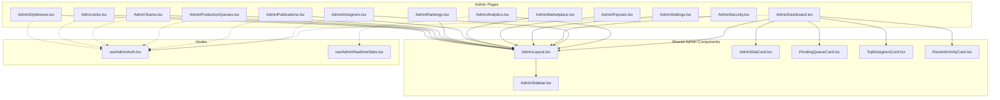

**Diagram sources**
- [AdminDashboard.tsx](file://src/pages/admin/AdminDashboard.tsx#L1-L428)
- [AdminAnalytics.tsx](file://src/pages/admin/AdminAnalytics.tsx#L1-L313)
- [AdminDesigners.tsx](file://src/pages/admin/AdminDesigners.tsx#L1-L403)
- [AdminSecurity.tsx](file://src/pages/admin/AdminSecurity.tsx#L1-L353)
- [AdminSettings.tsx](file://src/pages/admin/AdminSettings.tsx#L1-L519)
- [AdminPayouts.tsx](file://src/pages/admin/AdminPayouts.tsx#L1-L296)
- [AdminMarketplace.tsx](file://src/pages/admin/AdminMarketplace.tsx#L1-L211)
- [AdminPublications.tsx](file://src/pages/admin/AdminPublications.tsx#L1-L990)
- [AdminRankings.tsx](file://src/pages/admin/AdminRankings.tsx#L1-L714)
- [AdminProductionQueues.tsx](file://src/pages/admin/AdminProductionQueues.tsx#L1-L510)
- [AdminTeams.tsx](file://src/pages/admin/AdminTeams.tsx#L1-L369)
- [AdminJobs.tsx](file://src/pages/admin/AdminJobs.tsx#L1-L199)
- [AdminStyleboxes.tsx](file://src/pages/admin/AdminStyleboxes.tsx#L1-L531)
- [AdminLayout.tsx](file://src/components/admin/AdminLayout.tsx#L1-L238)
- [AdminSidebar.tsx](file://src/components/admin/AdminSidebar.tsx#L1-L254)
- [useAdminAuth.tsx](file://src/hooks/useAdminAuth.tsx#L1-L216)
- [useAdminRealtimeStats.tsx](file://src/hooks/useAdminRealtimeStats.tsx#L1-L209)

**Section sources**
- [AdminDashboard.tsx](file://src/pages/admin/AdminDashboard.tsx#L1-L428)
- [AdminLayout.tsx](file://src/components/admin/AdminLayout.tsx#L1-L238)
- [AdminSidebar.tsx](file://src/components/admin/AdminSidebar.tsx#L1-L254)
- [useAdminAuth.tsx](file://src/hooks/useAdminAuth.tsx#L1-L216)
- [useAdminRealtimeStats.tsx](file://src/hooks/useAdminRealtimeStats.tsx#L1-L209)

## Core Components
- AdminLayout: Provides the global admin header, sidebar navigation, theme toggle, notifications, and user menu. It also integrates a command palette for quick actions.
- AdminSidebar: Renders categorized navigation links (Dashboard, Designers, Collections, StyleBoxes, Submissions, Walkthroughs, Publications, Production Queues, Marketplace, Articles, Rankings & Revenue, Payouts, Teams, Job Portal, Notifications, Analytics, Security, Settings). Visibility of Security depends on role.
- useAdminAuth: Centralized admin authentication state, role detection, sign-in/sign-out, and cross-tab synchronization. It enforces role-based access and logs auth events.
- useAdminRealtimeStats: Fetches dashboard statistics and live activity feed via Supabase RPC and Postgres changes, with periodic refresh.
- Dashboard cards: AdminStatCard, PendingQueueCard, TopDesignersCard, RecentActivityCard provide overview widgets.

**Section sources**
- [AdminLayout.tsx](file://src/components/admin/AdminLayout.tsx#L1-L238)
- [AdminSidebar.tsx](file://src/components/admin/AdminSidebar.tsx#L1-L254)
- [useAdminAuth.tsx](file://src/hooks/useAdminAuth.tsx#L1-L216)
- [useAdminRealtimeStats.tsx](file://src/hooks/useAdminRealtimeStats.tsx#L1-L209)

## Architecture Overview
The admin portal follows a layered architecture:
- Presentation Layer: Pages under `/pages/admin` render views and orchestrate data fetching.
- Shared Components: `/components/admin` encapsulate reusable UI elements and layouts.
- Hooks: `/hooks` provide domain-specific state and data fetching (e.g., authentication, analytics).
- Backend Integration: Supabase client (`supabaseAdmin`) handles authentication, queries, and real-time subscriptions.

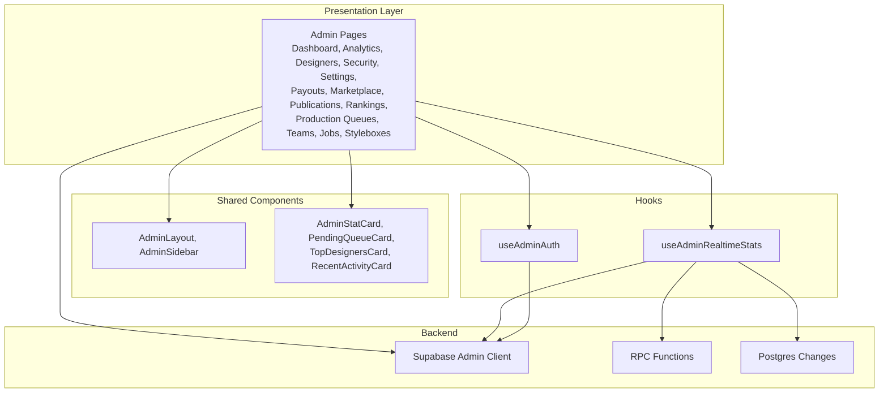

**Diagram sources**
- [AdminDashboard.tsx](file://src/pages/admin/AdminDashboard.tsx#L1-L428)
- [AdminLayout.tsx](file://src/components/admin/AdminLayout.tsx#L1-L238)
- [AdminSidebar.tsx](file://src/components/admin/AdminSidebar.tsx#L1-L254)
- [useAdminAuth.tsx](file://src/hooks/useAdminAuth.tsx#L1-L216)
- [useAdminRealtimeStats.tsx](file://src/hooks/useAdminRealtimeStats.tsx#L1-L209)

## Detailed Component Analysis

### Admin Portal Overview
The dashboard aggregates key metrics, recent activity, and quick actions. It uses Supabase to compute counts and revenue, and subscribes to real-time events for immediate feedback.

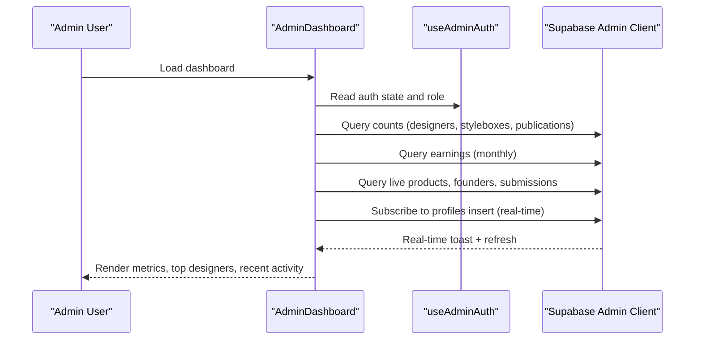

**Diagram sources**
- [AdminDashboard.tsx](file://src/pages/admin/AdminDashboard.tsx#L47-L272)
- [useAdminAuth.tsx](file://src/hooks/useAdminAuth.tsx#L1-L216)

**Section sources**
- [AdminDashboard.tsx](file://src/pages/admin/AdminDashboard.tsx#L1-L428)

### User Management
The designer management page lists designers, filters by rank/status, and allows status updates. It fetches profiles, submission counts, earnings, and renders a paginated table with actions.

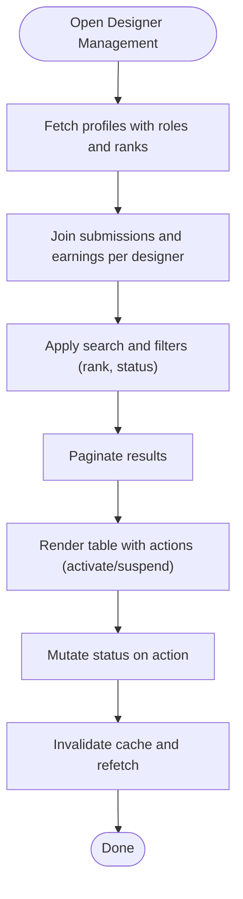

**Diagram sources**
- [AdminDesigners.tsx](file://src/pages/admin/AdminDesigners.tsx#L74-L138)

**Section sources**
- [AdminDesigners.tsx](file://src/pages/admin/AdminDesigners.tsx#L1-L403)

### Content Moderation
The publication queue manages designer submissions through a multi-stage workflow. Admins can approve, request revisions, reject, or adjust revenue shares. The system tracks decisions, reviewer notes, and logs actions.

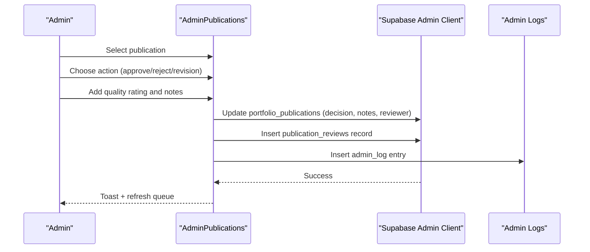

**Diagram sources**
- [AdminPublications.tsx](file://src/pages/admin/AdminPublications.tsx#L206-L283)

**Section sources**
- [AdminPublications.tsx](file://src/pages/admin/AdminPublications.tsx#L1-L990)

### Analytics & Reporting
The analytics page displays real-time metrics, charts, and a live activity feed. It uses Supabase RPC for dashboard stats and Postgres changes for live updates.

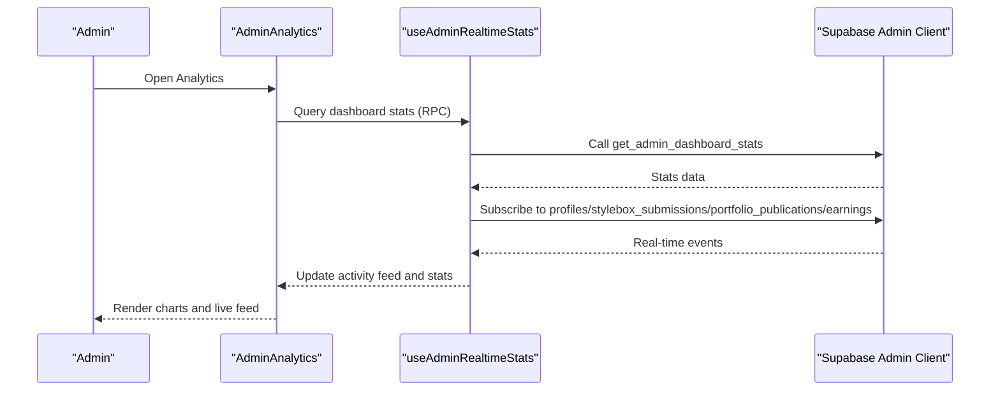

**Diagram sources**
- [AdminAnalytics.tsx](file://src/pages/admin/AdminAnalytics.tsx#L1-L313)
- [useAdminRealtimeStats.tsx](file://src/hooks/useAdminRealtimeStats.tsx#L24-L184)

**Section sources**
- [AdminAnalytics.tsx](file://src/pages/admin/AdminAnalytics.tsx#L1-L313)
- [useAdminRealtimeStats.tsx](file://src/hooks/useAdminRealtimeStats.tsx#L1-L209)

### System Configuration
The settings page centralizes admin account management, including profile updates, password changes, 2FA toggling, and logout controls. Updates are logged for auditability.

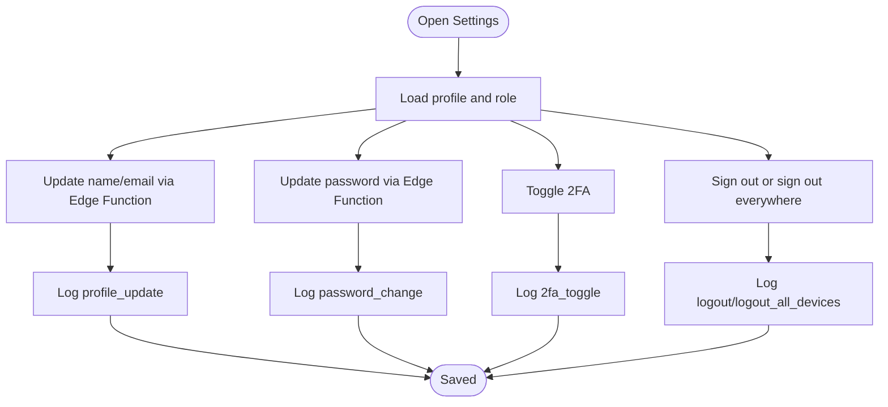

**Diagram sources**
- [AdminSettings.tsx](file://src/pages/admin/AdminSettings.tsx#L128-L246)

**Section sources**
- [AdminSettings.tsx](file://src/pages/admin/AdminSettings.tsx#L1-L519)

### Administrative Security & Governance
The security page manages administrative roles and audits access. It supports role promotion/demotion and displays auth logs.

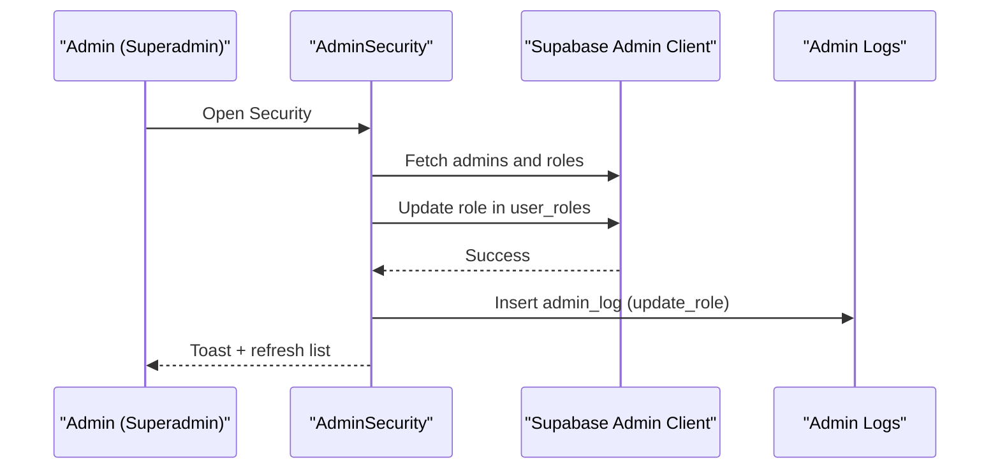

**Diagram sources**
- [AdminSecurity.tsx](file://src/pages/admin/AdminSecurity.tsx#L129-L155)

**Section sources**
- [AdminSecurity.tsx](file://src/pages/admin/AdminSecurity.tsx#L1-L353)

### Financial Operations
The payouts page manages designer earnings and payout requests, with status transitions and audit logging.

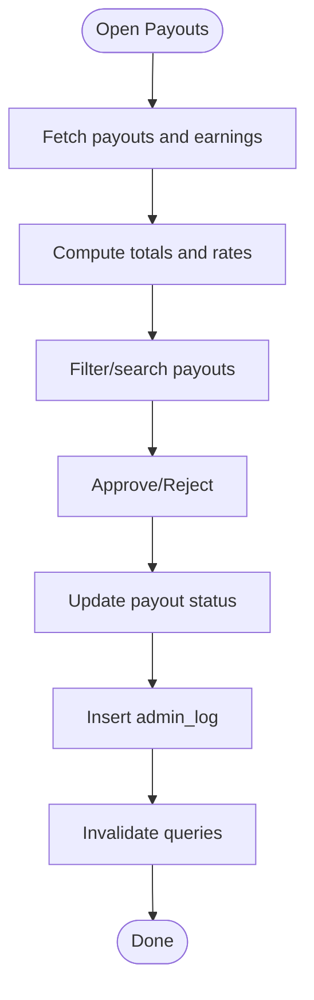

**Diagram sources**
- [AdminPayouts.tsx](file://src/pages/admin/AdminPayouts.tsx#L87-L103)

**Section sources**
- [AdminPayouts.tsx](file://src/pages/admin/AdminPayouts.tsx#L1-L296)

### Marketplace Management
The marketplace page provides product and order management, plus category administration.

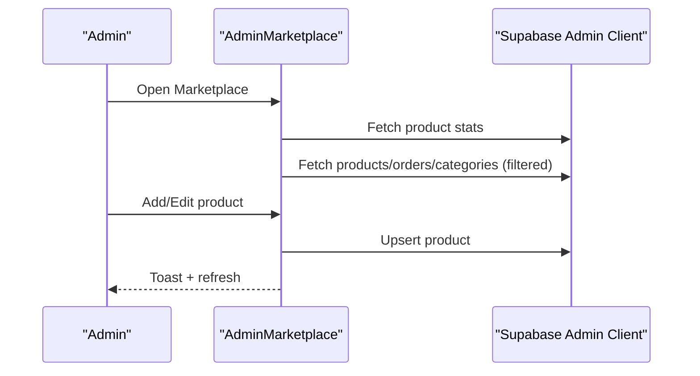

**Diagram sources**
- [AdminMarketplace.tsx](file://src/pages/admin/AdminMarketplace.tsx#L30-L204)

**Section sources**
- [AdminMarketplace.tsx](file://src/pages/admin/AdminMarketplace.tsx#L1-L211)

### Production Queues
The production queues page orchestrates the end-to-end production pipeline with status transitions and logging.

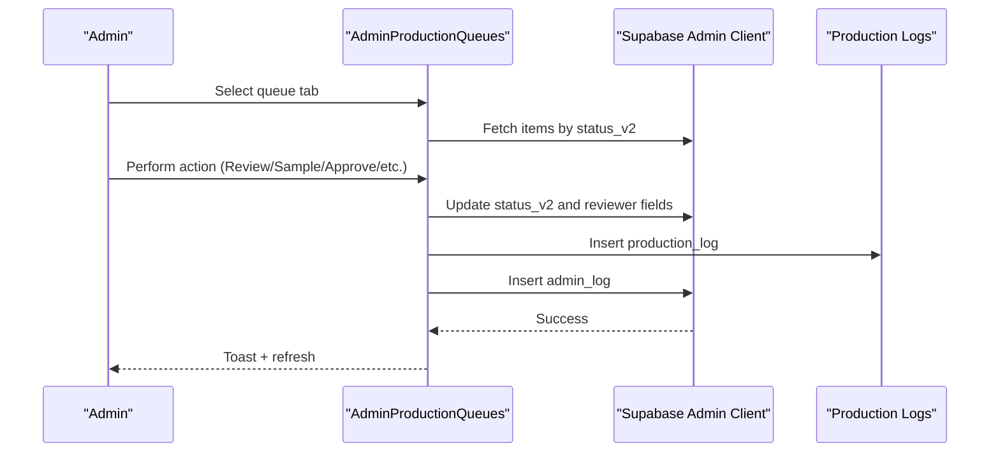

**Diagram sources**
- [AdminProductionQueues.tsx](file://src/pages/admin/AdminProductionQueues.tsx#L174-L271)

**Section sources**
- [AdminProductionQueues.tsx](file://src/pages/admin/AdminProductionQueues.tsx#L1-L510)

### Rankings & Revenue
The rankings page manages designer ranks, revenue shares, and payouts, with export capabilities and insights.

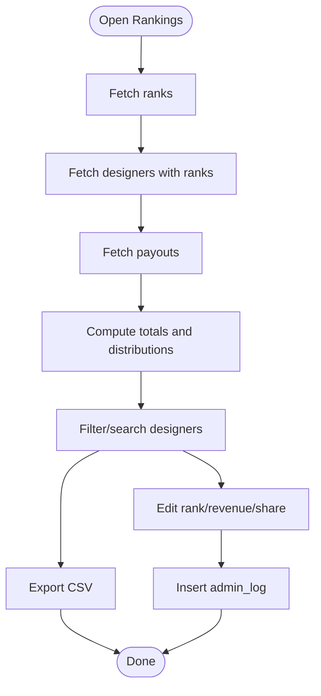

**Diagram sources**
- [AdminRankings.tsx](file://src/pages/admin/AdminRankings.tsx#L107-L188)

**Section sources**
- [AdminRankings.tsx](file://src/pages/admin/AdminRankings.tsx#L1-L714)

### Teams & Challenges
The teams page manages designer collectives and team-based submissions.

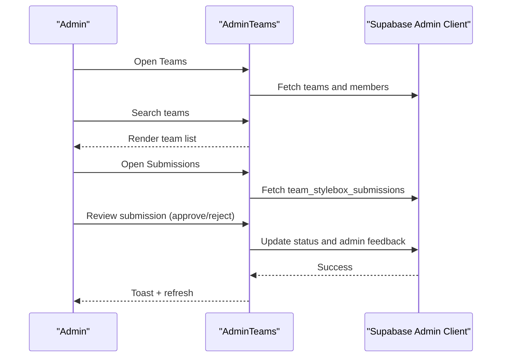

**Diagram sources**
- [AdminTeams.tsx](file://src/pages/admin/AdminTeams.tsx#L63-L121)

**Section sources**
- [AdminTeams.tsx](file://src/pages/admin/AdminTeams.tsx#L1-L369)

### Job Portal Management
The jobs page manages job listings and application reviews.

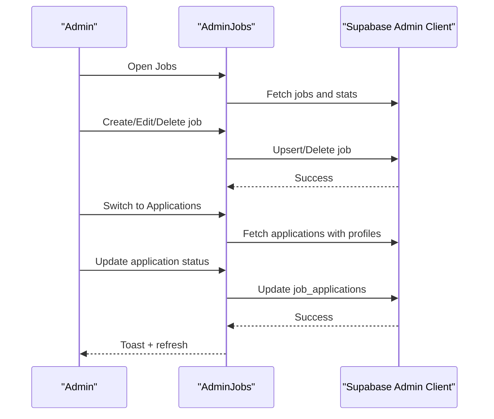

**Diagram sources**
- [AdminJobs.tsx](file://src/pages/admin/AdminJobs.tsx#L23-L120)

**Section sources**
- [AdminJobs.tsx](file://src/pages/admin/AdminJobs.tsx#L1-L199)

### StyleBox Management
The StyleBox management page creates, edits, duplicates, and archives creative challenges.

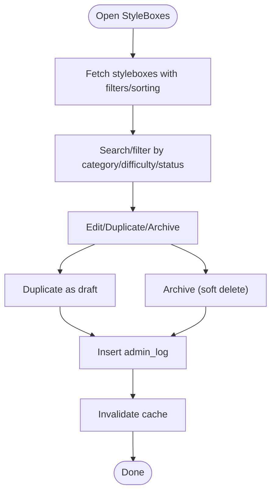

**Diagram sources**
- [AdminStyleboxes.tsx](file://src/pages/admin/AdminStyleboxes.tsx#L97-L180)

**Section sources**
- [AdminStyleboxes.tsx](file://src/pages/admin/AdminStyleboxes.tsx#L1-L531)

## Dependency Analysis
The admin system exhibits clear separation of concerns:
- Pages depend on shared components and hooks.
- Hooks encapsulate Supabase interactions and caching.
- Real-time updates rely on Postgres changes and RPC functions.
- Role-based visibility ensures sensitive areas (Security) are restricted.

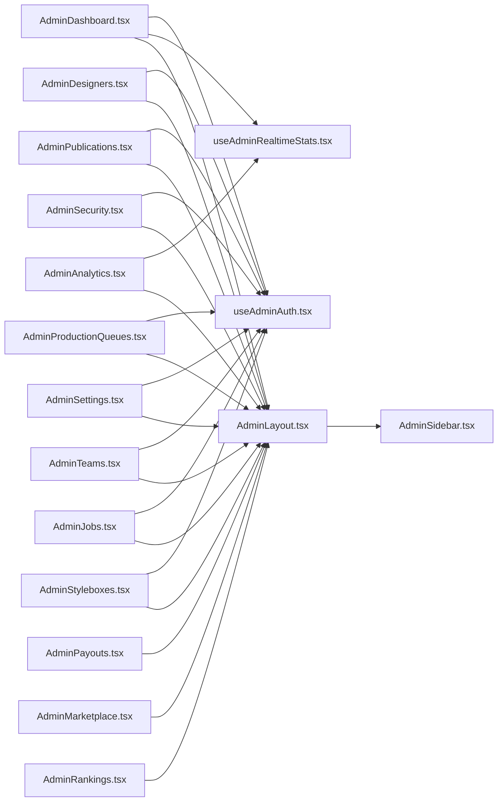

**Diagram sources**
- [AdminDashboard.tsx](file://src/pages/admin/AdminDashboard.tsx#L1-L428)
- [AdminAnalytics.tsx](file://src/pages/admin/AdminAnalytics.tsx#L1-L313)
- [AdminDesigners.tsx](file://src/pages/admin/AdminDesigners.tsx#L1-L403)
- [AdminSecurity.tsx](file://src/pages/admin/AdminSecurity.tsx#L1-L353)
- [AdminSettings.tsx](file://src/pages/admin/AdminSettings.tsx#L1-L519)
- [AdminPayouts.tsx](file://src/pages/admin/AdminPayouts.tsx#L1-L296)
- [AdminMarketplace.tsx](file://src/pages/admin/AdminMarketplace.tsx#L1-L211)
- [AdminPublications.tsx](file://src/pages/admin/AdminPublications.tsx#L1-L990)
- [AdminRankings.tsx](file://src/pages/admin/AdminRankings.tsx#L1-L714)
- [AdminProductionQueues.tsx](file://src/pages/admin/AdminProductionQueues.tsx#L1-L510)
- [AdminTeams.tsx](file://src/pages/admin/AdminTeams.tsx#L1-L369)
- [AdminJobs.tsx](file://src/pages/admin/AdminJobs.tsx#L1-L199)
- [AdminStyleboxes.tsx](file://src/pages/admin/AdminStyleboxes.tsx#L1-L531)
- [AdminLayout.tsx](file://src/components/admin/AdminLayout.tsx#L1-L238)
- [AdminSidebar.tsx](file://src/components/admin/AdminSidebar.tsx#L1-L254)
- [useAdminAuth.tsx](file://src/hooks/useAdminAuth.tsx#L1-L216)
- [useAdminRealtimeStats.tsx](file://src/hooks/useAdminRealtimeStats.tsx#L1-L209)

**Section sources**
- [AdminDashboard.tsx](file://src/pages/admin/AdminDashboard.tsx#L1-L428)
- [AdminLayout.tsx](file://src/components/admin/AdminLayout.tsx#L1-L238)
- [AdminSidebar.tsx](file://src/components/admin/AdminSidebar.tsx#L1-L254)
- [useAdminAuth.tsx](file://src/hooks/useAdminAuth.tsx#L1-L216)
- [useAdminRealtimeStats.tsx](file://src/hooks/useAdminRealtimeStats.tsx#L1-L209)

## Performance Considerations
- Real-time updates: Postgres changes and RPC reduce polling overhead and improve responsiveness.
- Caching: React Query manages server state and invalidation to avoid redundant network calls.
- Pagination and filtering: Reduce payload sizes and rendering work on large datasets.
- Role-based UI: Conditional rendering prevents unnecessary DOM for non-visible sections.

## Troubleshooting Guide
- Authentication issues: Verify admin role resolution and cross-tab sign-out behavior. Check auth logs for failures.
- Real-time feeds: Confirm channel subscriptions and ensure RPC functions are available.
- Data inconsistencies: Use query invalidation after mutations to synchronize UI state.
- Audit trails: Review admin logs and production logs for actions taken by administrators.

**Section sources**
- [useAdminAuth.tsx](file://src/hooks/useAdminAuth.tsx#L134-L140)
- [AdminSecurity.tsx](file://src/pages/admin/AdminSecurity.tsx#L115-L127)
- [AdminProductionQueues.tsx](file://src/pages/admin/AdminProductionQueues.tsx#L241-L257)

## Conclusion
The administrative dashboard provides a comprehensive, role-aware control surface for managing users, content, commerce, and operations. Its real-time capabilities, robust audit logging, and modular component architecture enable efficient oversight and governance across the platform.