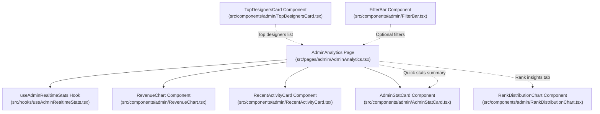
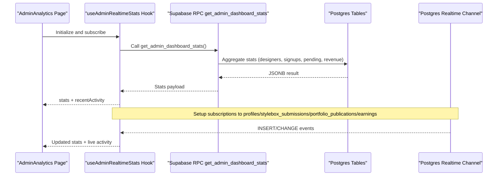
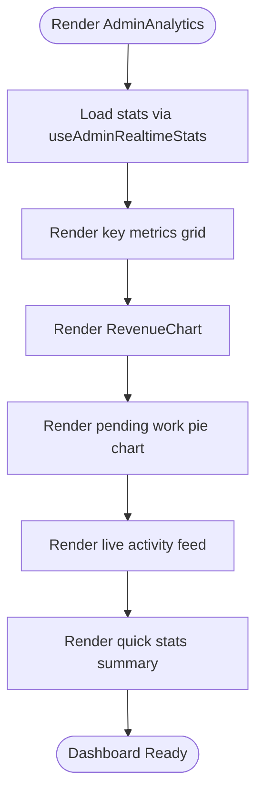
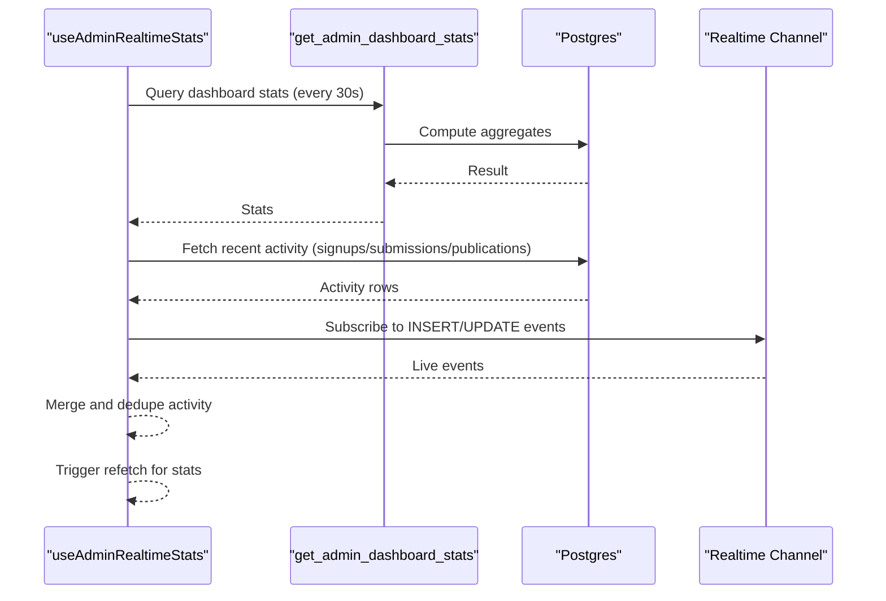
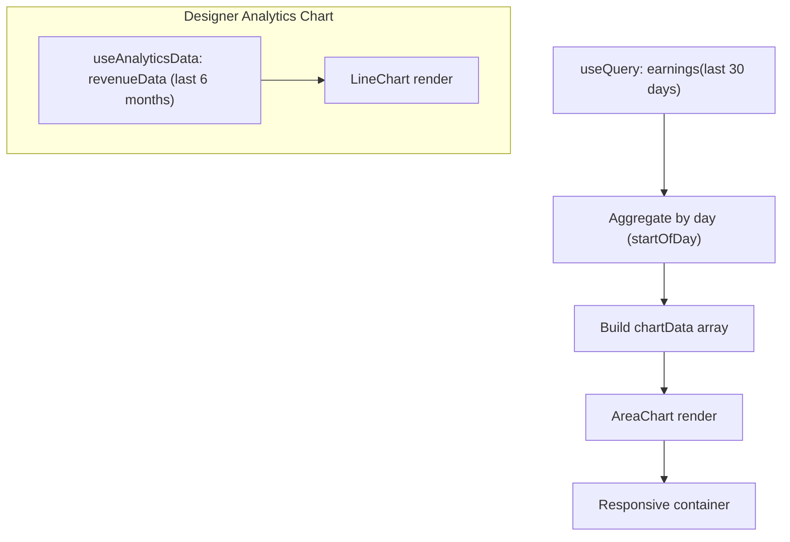
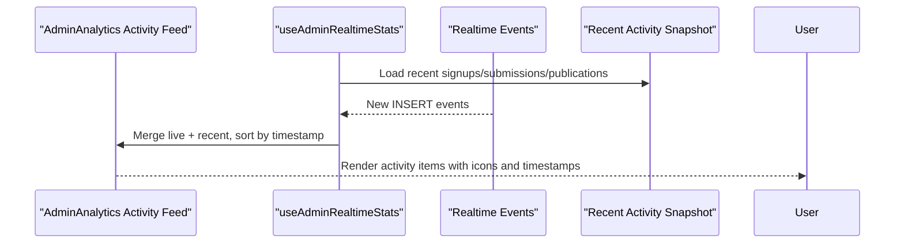
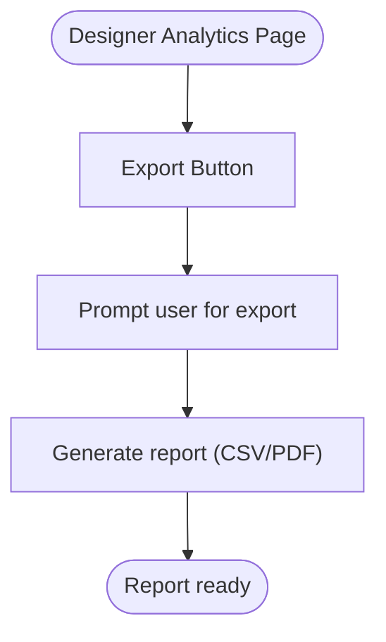
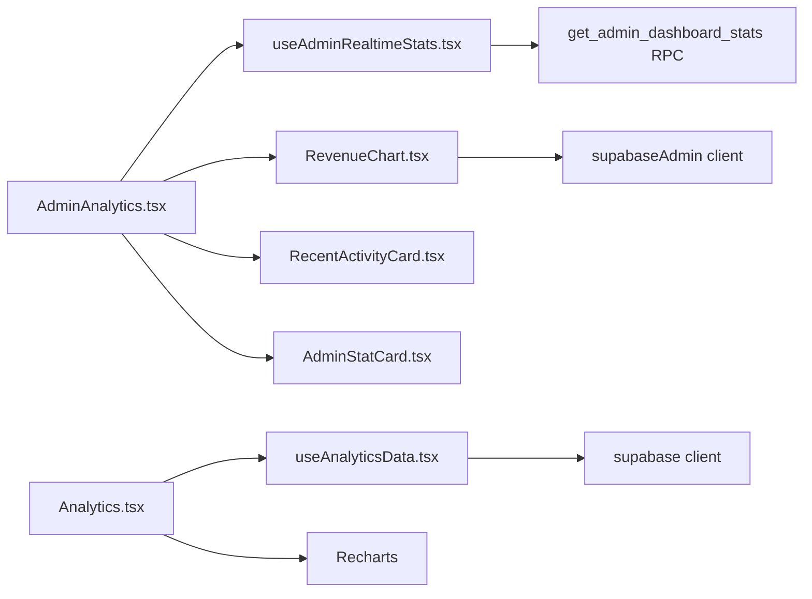

# Analytics & Reporting

<cite>
**Referenced Files in This Document**
- [src/pages/admin/AdminAnalytics.tsx](file://src/pages/admin/AdminAnalytics.tsx)
- [src/hooks/useAdminRealtimeStats.tsx](file://src/hooks/useAdminRealtimeStats.tsx)
- [src/components/admin/RevenueChart.tsx](file://src/components/admin/RevenueChart.tsx)
- [src/components/admin/RankDistributionChart.tsx](file://src/components/admin/RankDistributionChart.tsx)
- [src/components/admin/RecentActivityCard.tsx](file://src/components/admin/RecentActivityCard.tsx)
- [src/components/admin/TopDesignersCard.tsx](file://src/components/admin/TopDesignersCard.tsx)
- [src/components/admin/AdminStatCard.tsx](file://src/components/admin/AdminStatCard.tsx)
- [src/components/admin/FilterBar.tsx](file://src/components/admin/FilterBar.tsx)
- [src/pages/Analytics.tsx](file://src/pages/Analytics.tsx)
- [src/hooks/useAnalyticsData.tsx](file://src/hooks/useAnalyticsData.tsx)
- [supabase/migrations/20260126040000_admin_auth_security.sql](file://supabase/migrations/20260126040000_admin_auth_security.sql)
- [supabase/functions/marketplace-orders/index.ts](file://supabase/functions/marketplace-orders/index.ts)
- [supabase/functions/marketplace-checkout/index.ts](file://supabase/functions/marketplace-checkout/index.ts)
</cite>

## Table of Contents
1. [Introduction](#introduction)
2. [Project Structure](#project-structure)
3. [Core Components](#core-components)
4. [Architecture Overview](#architecture-overview)
5. [Detailed Component Analysis](#detailed-component-analysis)
6. [Dependency Analysis](#dependency-analysis)
7. [Performance Considerations](#performance-considerations)
8. [Troubleshooting Guide](#troubleshooting-guide)
9. [Conclusion](#conclusion)
10. [Appendices](#appendices)

## Introduction
This document describes the administrative analytics and reporting system, focusing on the admin analytics dashboard, real-time statistics, revenue charts, activity monitoring, and performance metrics. It explains how data is sourced, processed, and visualized, and outlines the capabilities for custom reporting and data export. The system integrates React components with Supabase for real-time updates and historical analytics, and uses Recharts for data visualization.

## Project Structure
The analytics system spans admin-facing pages, reusable UI components, and data hooks. Key areas:
- Admin analytics page orchestrates real-time stats and charts
- Hooks fetch and subscribe to live data
- Recharts-based components render revenue and distribution visuals
- Supporting components provide activity feeds, top designers, and filter controls



**Diagram sources**
- [src/pages/admin/AdminAnalytics.tsx](file://src/pages/admin/AdminAnalytics.tsx#L31-L310)
- [src/hooks/useAdminRealtimeStats.tsx](file://src/hooks/useAdminRealtimeStats.tsx#L24-L208)
- [src/components/admin/RevenueChart.tsx](file://src/components/admin/RevenueChart.tsx#L6-L94)
- [src/components/admin/RankDistributionChart.tsx](file://src/components/admin/RankDistributionChart.tsx#L23-L61)
- [src/components/admin/RecentActivityCard.tsx](file://src/components/admin/RecentActivityCard.tsx#L55-L134)
- [src/components/admin/TopDesignersCard.tsx](file://src/components/admin/TopDesignersCard.tsx#L30-L105)
- [src/components/admin/AdminStatCard.tsx](file://src/components/admin/AdminStatCard.tsx#L33-L87)
- [src/components/admin/FilterBar.tsx](file://src/components/admin/FilterBar.tsx#L30-L69)

**Section sources**
- [src/pages/admin/AdminAnalytics.tsx](file://src/pages/admin/AdminAnalytics.tsx#L31-L310)
- [src/hooks/useAdminRealtimeStats.tsx](file://src/hooks/useAdminRealtimeStats.tsx#L24-L208)

## Core Components
- AdminAnalytics page: Aggregates real-time stats, renders key metrics cards, revenue chart, signup trends, pending work distribution, live activity feed, and quick stats summary.
- useAdminRealtimeStats hook: Fetches dashboard stats via RPC, loads recent activity, and subscribes to real-time Postgres changes for live updates.
- RevenueChart component: Renders a 30-day revenue area chart using historical earnings data.
- RankDistributionChart component: Visualizes designer rank distribution via a bar chart.
- RecentActivityCard component: Displays recent platform activity with icons and timestamps.
- TopDesignersCard component: Lists top designers by revenue with rank badges and avatar placeholders.
- AdminStatCard component: Generic stat card with optional trend indicator and variant styling.
- FilterBar component: Provides search and filter controls for lists and dashboards.

**Section sources**
- [src/pages/admin/AdminAnalytics.tsx](file://src/pages/admin/AdminAnalytics.tsx#L31-L310)
- [src/hooks/useAdminRealtimeStats.tsx](file://src/hooks/useAdminRealtimeStats.tsx#L24-L208)
- [src/components/admin/RevenueChart.tsx](file://src/components/admin/RevenueChart.tsx#L6-L94)
- [src/components/admin/RankDistributionChart.tsx](file://src/components/admin/RankDistributionChart.tsx#L23-L61)
- [src/components/admin/RecentActivityCard.tsx](file://src/components/admin/RecentActivityCard.tsx#L55-L134)
- [src/components/admin/TopDesignersCard.tsx](file://src/components/admin/TopDesignersCard.tsx#L30-L105)
- [src/components/admin/AdminStatCard.tsx](file://src/components/admin/AdminStatCard.tsx#L33-L87)
- [src/components/admin/FilterBar.tsx](file://src/components/admin/FilterBar.tsx#L30-L69)

## Architecture Overview
The analytics architecture combines:
- Frontend dashboards (React) rendering metrics and charts
- Supabase Realtime subscriptions for live updates
- Supabase RPC functions for secure, role-gated analytics queries
- Recharts for responsive, interactive visualizations



**Diagram sources**
- [src/pages/admin/AdminAnalytics.tsx](file://src/pages/admin/AdminAnalytics.tsx#L32-L32)
- [src/hooks/useAdminRealtimeStats.tsx](file://src/hooks/useAdminRealtimeStats.tsx#L28-L49)
- [supabase/migrations/20260126040000_admin_auth_security.sql](file://supabase/migrations/20260126040000_admin_auth_security.sql#L7-L26)

## Detailed Component Analysis

### AdminAnalytics Dashboard
The admin analytics page composes:
- Key metrics grid: Total designers, pending submissions, pending publications, revenue this month
- Revenue trend chart: 30-day aggregated earnings
- Designer signups: Today/week/month comparisons and pending work pie chart
- Live activity feed: Real-time events with icons and timestamps
- Quick stats summary: Gradient cards for total revenue, monthly growth, total pending, monthly share



**Diagram sources**
- [src/pages/admin/AdminAnalytics.tsx](file://src/pages/admin/AdminAnalytics.tsx#L31-L310)
- [src/hooks/useAdminRealtimeStats.tsx](file://src/hooks/useAdminRealtimeStats.tsx#L24-L208)
- [src/components/admin/RevenueChart.tsx](file://src/components/admin/RevenueChart.tsx#L6-L94)

**Section sources**
- [src/pages/admin/AdminAnalytics.tsx](file://src/pages/admin/AdminAnalytics.tsx#L31-L310)

### Real-Time Statistics System
The hook performs:
- Periodic polling of RPC stats via React Query
- Initial load of recent activity from multiple tables
- Realtime subscriptions to profiles, stylebox_submissions, portfolio_publications, and earnings
- Merging and deduplicating live and recent activity streams



**Diagram sources**
- [src/hooks/useAdminRealtimeStats.tsx](file://src/hooks/useAdminRealtimeStats.tsx#L28-L184)

**Section sources**
- [src/hooks/useAdminRealtimeStats.tsx](file://src/hooks/useAdminRealtimeStats.tsx#L24-L208)

### Revenue Charts
Two revenue visualization components are available:
- RevenueChart (admin): 30-day daily aggregation of earnings, area chart with gradient fill and tooltips
- Analytics page chart (designer): 6-month line chart of earnings per month



**Diagram sources**
- [src/components/admin/RevenueChart.tsx](file://src/components/admin/RevenueChart.tsx#L6-L94)
- [src/pages/Analytics.tsx](file://src/pages/Analytics.tsx#L178-L224)
- [src/hooks/useAnalyticsData.tsx](file://src/hooks/useAnalyticsData.tsx#L114-L131)

**Section sources**
- [src/components/admin/RevenueChart.tsx](file://src/components/admin/RevenueChart.tsx#L6-L94)
- [src/pages/Analytics.tsx](file://src/pages/Analytics.tsx#L178-L224)
- [src/hooks/useAnalyticsData.tsx](file://src/hooks/useAnalyticsData.tsx#L114-L131)

### Activity Monitoring
Live activity feed displays recent events across signups, stylebox submissions, publication requests, and earnings. The feed merges real-time inserts with a recent snapshot and deduplicates entries.



**Diagram sources**
- [src/pages/admin/AdminAnalytics.tsx](file://src/pages/admin/AdminAnalytics.tsx#L216-L270)
- [src/hooks/useAdminRealtimeStats.tsx](file://src/hooks/useAdminRealtimeStats.tsx#L51-L192)

**Section sources**
- [src/pages/admin/AdminAnalytics.tsx](file://src/pages/admin/AdminAnalytics.tsx#L216-L270)
- [src/hooks/useAdminRealtimeStats.tsx](file://src/hooks/useAdminRealtimeStats.tsx#L51-L192)

### Performance Metrics and Cards
- AdminStatCard: Generic card with title/value/trend/icon and variant styling
- TopDesignersCard: Leaderboard-like list with rank badges and revenue
- RecentActivityCard: List-style card with icons, labels, and timestamps
- FilterBar: Search input and select filters for dashboards/lists

```mermaid
classDiagram
class AdminStatCard {
+title : string
+value : string|number
+subtitle? : string
+icon : LucideIcon
+trend? : { value : number, isPositive : boolean }
+variant? : 'default'|'wine'|'camel'|'success'|'warning'
}
class TopDesignersCard {
+designers : TopDesigner[]
}
class RecentActivityCard {
+activities : ActivityItem[]
}
class FilterBar {
+searchValue : string
+filters? : FilterOption[]
+onSearchChange(value)
+onFilterClick()
}
```

**Diagram sources**
- [src/components/admin/AdminStatCard.tsx](file://src/components/admin/AdminStatCard.tsx#L33-L87)
- [src/components/admin/TopDesignersCard.tsx](file://src/components/admin/TopDesignersCard.tsx#L30-L105)
- [src/components/admin/RecentActivityCard.tsx](file://src/components/admin/RecentActivityCard.tsx#L55-L134)
- [src/components/admin/FilterBar.tsx](file://src/components/admin/FilterBar.tsx#L30-L69)

**Section sources**
- [src/components/admin/AdminStatCard.tsx](file://src/components/admin/AdminStatCard.tsx#L33-L87)
- [src/components/admin/TopDesignersCard.tsx](file://src/components/admin/TopDesignersCard.tsx#L30-L105)
- [src/components/admin/RecentActivityCard.tsx](file://src/components/admin/RecentActivityCard.tsx#L55-L134)
- [src/components/admin/FilterBar.tsx](file://src/components/admin/FilterBar.tsx#L30-L69)

### Reporting Capabilities and Data Export
- Designer analytics page includes an export button and time range selector for revenue history.
- The page also presents top products and recent transactions for custom reporting scenarios.



**Diagram sources**
- [src/pages/Analytics.tsx](file://src/pages/Analytics.tsx#L107-L111)
- [src/pages/Analytics.tsx](file://src/pages/Analytics.tsx#L253-L297)

**Section sources**
- [src/pages/Analytics.tsx](file://src/pages/Analytics.tsx#L107-L111)
- [src/pages/Analytics.tsx](file://src/pages/Analytics.tsx#L253-L297)

## Dependency Analysis
- AdminAnalytics depends on:
  - useAdminRealtimeStats for stats and live activity
  - RevenueChart for revenue visualization
  - UI components for layout and cards
- useAdminRealtimeStats depends on:
  - Supabase RPC get_admin_dashboard_stats
  - Supabase Realtime subscriptions
  - React Query for caching and refetching
- RevenueChart depends on:
  - Supabase admin client for historical earnings
  - Recharts for rendering
- Designer analytics page depends on:
  - useAnalyticsData for RPC stats and chart data
  - Recharts for line chart and tooltips



**Diagram sources**
- [src/pages/admin/AdminAnalytics.tsx](file://src/pages/admin/AdminAnalytics.tsx#L20-L29)
- [src/hooks/useAdminRealtimeStats.tsx](file://src/hooks/useAdminRealtimeStats.tsx#L28-L49)
- [src/components/admin/RevenueChart.tsx](file://src/components/admin/RevenueChart.tsx#L3-L21)
- [src/pages/Analytics.tsx](file://src/pages/Analytics.tsx#L33-L33)
- [src/hooks/useAnalyticsData.tsx](file://src/hooks/useAnalyticsData.tsx#L41-L53)

**Section sources**
- [src/pages/admin/AdminAnalytics.tsx](file://src/pages/admin/AdminAnalytics.tsx#L20-L29)
- [src/hooks/useAdminRealtimeStats.tsx](file://src/hooks/useAdminRealtimeStats.tsx#L28-L49)
- [src/components/admin/RevenueChart.tsx](file://src/components/admin/RevenueChart.tsx#L3-L21)
- [src/pages/Analytics.tsx](file://src/pages/Analytics.tsx#L33-L33)
- [src/hooks/useAnalyticsData.tsx](file://src/hooks/useAnalyticsData.tsx#L41-L53)

## Performance Considerations
- Real-time polling interval: Stats are refetched every 30 seconds to balance freshness and cost.
- Chart data aggregation:
  - Admin RevenueChart aggregates earnings by day for the last 30 days.
  - Designer chart aggregates earnings by month for the last 6.
- Real-time subscriptions minimize server load by listening only to relevant tables and events.
- Recharts components are responsive and optimized for rendering large datasets efficiently.

[No sources needed since this section provides general guidance]

## Troubleshooting Guide
Common issues and resolutions:
- Unauthorized access to RPC: Ensure the caller has admin or superadmin role; the RPC function enforces role checks and grants execution to authenticated users.
- No live activity updates: Verify Realtime subscriptions are active and the channel is not unsubscribed prematurely.
- Empty charts: Confirm earnings data exists for the selected periods; RevenueChart generates placeholder data for short windows.
- Designer analytics empty state: If no sales or views exist, the page shows an empty state; exporting still functions when data is present.

**Section sources**
- [supabase/migrations/20260126040000_admin_auth_security.sql](file://supabase/migrations/20260126040000_admin_auth_security.sql#L7-L26)
- [src/hooks/useAdminRealtimeStats.tsx](file://src/hooks/useAdminRealtimeStats.tsx#L113-L184)
- [src/components/admin/RevenueChart.tsx](file://src/components/admin/RevenueChart.tsx#L24-L44)
- [src/pages/Analytics.tsx](file://src/pages/Analytics.tsx#L61-L79)

## Conclusion
The analytics and reporting system delivers a comprehensive admin dashboard with real-time insights, revenue visualizations, activity monitoring, and performance metrics. It leverages Supabase RPCs and Realtime subscriptions for secure, scalable data access and integrates Recharts for intuitive visualizations. The designer analytics page complements the admin experience with exportable reports and transaction details.

[No sources needed since this section summarizes without analyzing specific files]

## Appendices

### Analytics Data Sources
- Admin dashboard stats: Supabase RPC get_admin_dashboard_stats
- Earnings data: earnings table (aggregated by day/month)
- Activity sources: profiles, stylebox_submissions, portfolio_publications, earnings
- Designer analytics: RPC get_designer_stats, marketplace_orders, marketplace_products, product_sales

**Section sources**
- [src/hooks/useAdminRealtimeStats.tsx](file://src/hooks/useAdminRealtimeStats.tsx#L31-L46)
- [src/components/admin/RevenueChart.tsx](file://src/components/admin/RevenueChart.tsx#L12-L21)
- [src/hooks/useAnalyticsData.tsx](file://src/hooks/useAnalyticsData.tsx#L67-L107)
- [supabase/migrations/20260126040000_admin_auth_security.sql](file://supabase/migrations/20260126040000_admin_auth_security.sql#L7-L26)

### Example Usage Scenarios
- Monitor platform health: Use the live activity feed and key metrics grid to track new signups, pending submissions/publications, and monthly revenue.
- Track revenue trends: Switch timeframes in the designer analytics page to compare earnings over 30 days, 3/6 months, or 1 year.
- Investigate sales patterns: Review top products and recent transactions to identify best-performing items and recent sales.
- Export reports: Use the export button in the designer analytics page to generate reports for external analysis.

**Section sources**
- [src/pages/admin/AdminAnalytics.tsx](file://src/pages/admin/AdminAnalytics.tsx#L54-L306)
- [src/pages/Analytics.tsx](file://src/pages/Analytics.tsx#L81-L299)