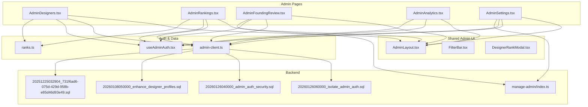
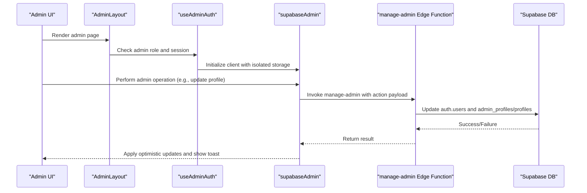
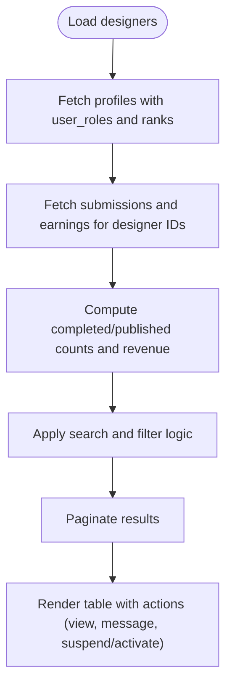
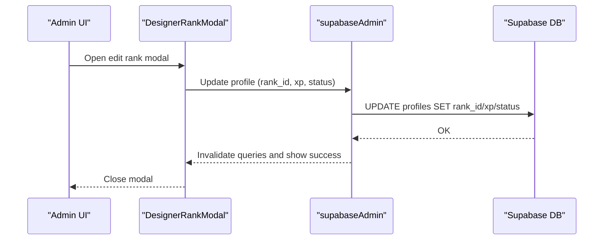
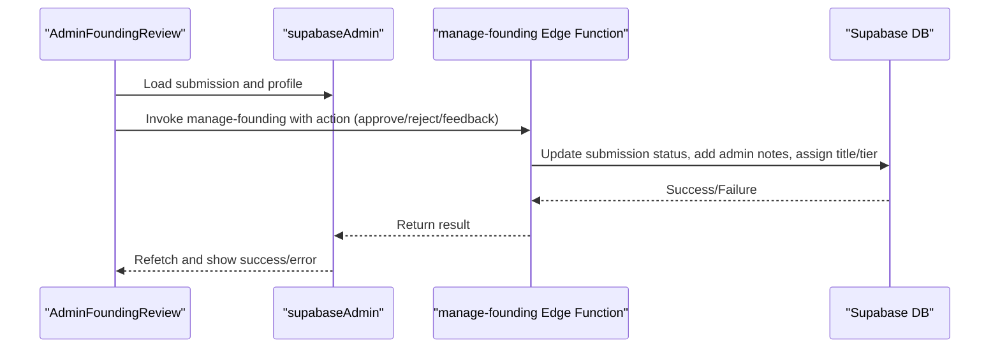
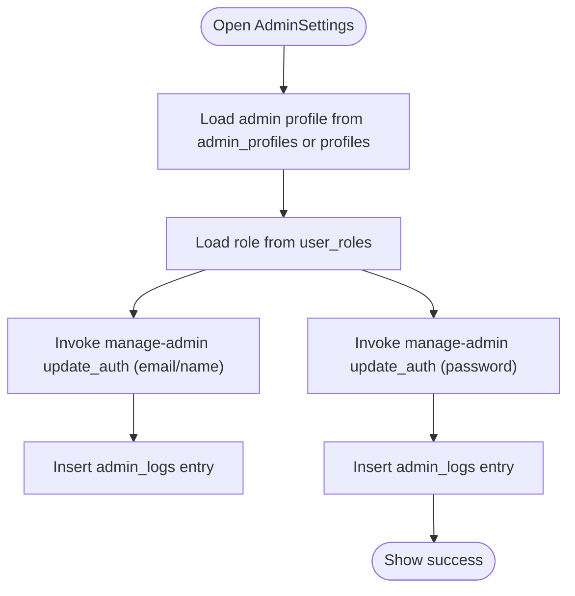
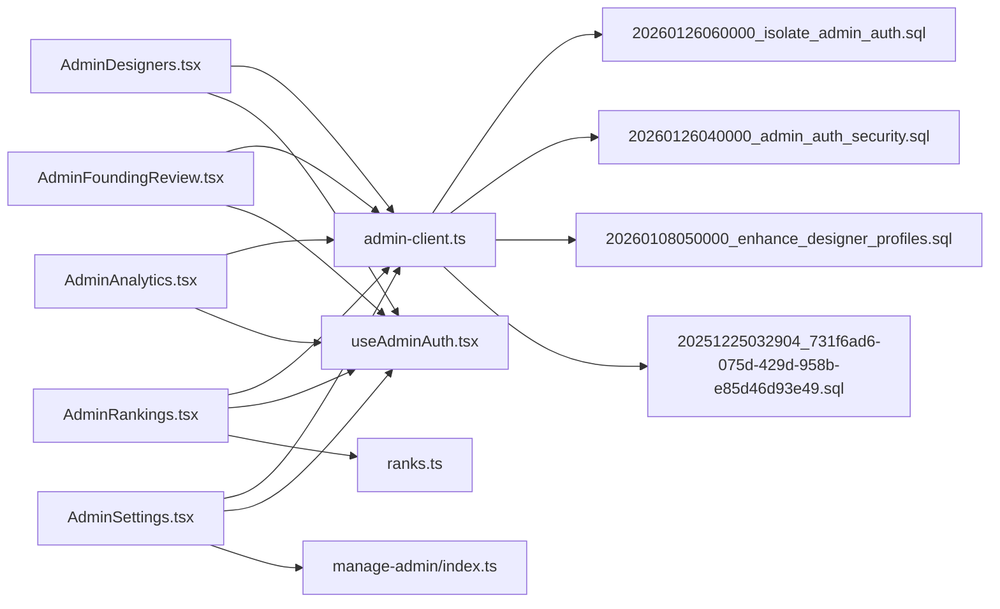

# User Management

<cite>
**Referenced Files in This Document**
- [AdminDesigners.tsx](file://src/pages/admin/AdminDesigners.tsx)
- [AdminRankings.tsx](file://src/pages/admin/AdminRankings.tsx)
- [DesignerRankModal.tsx](file://src/components/admin/DesignerRankModal.tsx)
- [AdminFoundingReview.tsx](file://src/pages/admin/AdminFoundingReview.tsx)
- [AdminAnalytics.tsx](file://src/pages/admin/AdminAnalytics.tsx)
- [AdminSettings.tsx](file://src/pages/admin/AdminSettings.tsx)
- [AdminLayout.tsx](file://src/components/admin/AdminLayout.tsx)
- [useAdminAuth.tsx](file://src/hooks/useAdminAuth.tsx)
- [ranks.ts](file://src/lib/ranks.ts)
- [FilterBar.tsx](file://src/components/admin/FilterBar.tsx)
- [admin-client.ts](file://src/integrations/supabase/admin-client.ts)
- [manage-admin/index.ts](file://supabase/functions/manage-admin/index.ts)
- [20260126060000_isolate_admin_auth.sql](file://supabase/migrations/20260126060000_isolate_admin_auth.sql)
- [20260126040000_admin_auth_security.sql](file://supabase/migrations/20260126040000_admin_auth_security.sql)
- [20260108050000_enhance_designer_profiles.sql](file://supabase/migrations/20260108050000_enhance_designer_profiles.sql)
- [20251225032904_731f6ad6-075d-429d-958b-e85d46d93e49.sql](file://supabase/migrations/20251225032904_731f6ad6-075d-429d-958b-e85d46d93e49.sql)
</cite>

## Table of Contents
1. [Introduction](#introduction)
2. [Project Structure](#project-structure)
3. [Core Components](#core-components)
4. [Architecture Overview](#architecture-overview)
5. [Detailed Component Analysis](#detailed-component-analysis)
6. [Dependency Analysis](#dependency-analysis)
7. [Performance Considerations](#performance-considerations)
8. [Troubleshooting Guide](#troubleshooting-guide)
9. [Conclusion](#conclusion)
10. [Appendices](#appendices)

## Introduction
This document describes the administrative user management system for designers, covering designer management, user profiles, role assignments, permission controls, approval workflows, rank management, user status controls, search and filtering, bulk operations, and user activity monitoring. It synthesizes frontend components, backend Supabase integration, and database migrations to present a complete picture of how administrators interact with designer accounts and related systems.

## Project Structure
The administrative user management system spans:
- Admin pages for designers, rankings, founding review, analytics, and settings
- Shared admin UI components (layout, filters, modals)
- Authentication and authorization hooks for admin sessions
- Rank definition library and Supabase client with isolated admin storage
- Supabase Edge Functions and migrations supporting admin operations

**Diagram sources**
- [AdminDesigners.tsx](file://src/pages/admin/AdminDesigners.tsx#L1-L403)
- [AdminRankings.tsx](file://src/pages/admin/AdminRankings.tsx#L1-L714)
- [AdminFoundingReview.tsx](file://src/pages/admin/AdminFoundingReview.tsx#L1-L584)
- [AdminAnalytics.tsx](file://src/pages/admin/AdminAnalytics.tsx#L1-L313)
- [AdminSettings.tsx](file://src/pages/admin/AdminSettings.tsx#L1-L519)
- [AdminLayout.tsx](file://src/components/admin/AdminLayout.tsx#L1-L238)
- [FilterBar.tsx](file://src/components/admin/FilterBar.tsx#L1-L70)
- [DesignerRankModal.tsx](file://src/components/admin/DesignerRankModal.tsx#L1-L217)
- [useAdminAuth.tsx](file://src/hooks/useAdminAuth.tsx#L1-L216)
- [admin-client.ts](file://src/integrations/supabase/admin-client.ts#L1-L28)
- [ranks.ts](file://src/lib/ranks.ts#L1-L246)
- [manage-admin/index.ts](file://supabase/functions/manage-admin/index.ts#L75-L108)
- [20260126060000_isolate_admin_auth.sql](file://supabase/migrations/20260126060000_isolate_admin_auth.sql#L1-L42)
- [20260126040000_admin_auth_security.sql](file://supabase/migrations/20260126040000_admin_auth_security.sql#L1-L26)
- [20260108050000_enhance_designer_profiles.sql](file://supabase/migrations/20260108050000_enhance_designer_profiles.sql#L36-L126)
- [20251225032904_731f6ad6-075d-429d-958b-e85d46d93e49.sql](file://supabase/migrations/20251225032904_731f6ad6-075d-429d-958b-e85d46d93e49.sql#L38-L69)

**Section sources**
- [AdminDesigners.tsx](file://src/pages/admin/AdminDesigners.tsx#L1-L403)
- [AdminRankings.tsx](file://src/pages/admin/AdminRankings.tsx#L1-L714)
- [AdminFoundingReview.tsx](file://src/pages/admin/AdminFoundingReview.tsx#L1-L584)
- [AdminAnalytics.tsx](file://src/pages/admin/AdminAnalytics.tsx#L1-L313)
- [AdminSettings.tsx](file://src/pages/admin/AdminSettings.tsx#L1-L519)
- [AdminLayout.tsx](file://src/components/admin/AdminLayout.tsx#L1-L238)
- [FilterBar.tsx](file://src/components/admin/FilterBar.tsx#L1-L70)
- [DesignerRankModal.tsx](file://src/components/admin/DesignerRankModal.tsx#L1-L217)
- [useAdminAuth.tsx](file://src/hooks/useAdminAuth.tsx#L1-L216)
- [admin-client.ts](file://src/integrations/supabase/admin-client.ts#L1-L28)
- [ranks.ts](file://src/lib/ranks.ts#L1-L246)
- [manage-admin/index.ts](file://supabase/functions/manage-admin/index.ts#L75-L108)
- [20260126060000_isolate_admin_auth.sql](file://supabase/migrations/20260126060000_isolate_admin_auth.sql#L1-L42)
- [20260126040000_admin_auth_security.sql](file://supabase/migrations/20260126040000_admin_auth_security.sql#L1-L26)
- [20260108050000_enhance_designer_profiles.sql](file://supabase/migrations/20260108050000_enhance_designer_profiles.sql#L36-L126)
- [20251225032904_731f6ad6-075d-429d-958b-e85d46d93e49.sql](file://supabase/migrations/20251225032904_731f6ad6-075d-429d-958b-e85d46d93e49.sql#L38-L69)

## Core Components
- AdminDesigners: Lists designers, supports search and status updates, and pagination.
- AdminRankings: Central place for rank management, XP adjustments, payouts, and insights.
- DesignerRankModal: Inline modal to edit rank and XP for a designer.
- AdminFoundingReview: Founding designer submission review with approval/rejection workflows.
- AdminAnalytics: Live activity feed and key metrics dashboards.
- AdminSettings: Admin account management, including profile, password, 2FA, and session controls.
- AdminLayout: Shared admin layout with header, sidebar, and command palette.
- useAdminAuth: Admin authentication state, role checks, and sign-out handling.
- ranks: Rank definitions, progression, and commission calculations.
- FilterBar: Generic filter/search bar used across admin pages.
- admin-client: Supabase client with isolated admin storage for session independence.
- manage-admin Edge Function: Admin operations for profile/password updates.
- Supabase migrations: Admin isolation, security hardening, designer profile enhancements, and rank updates.

**Section sources**
- [AdminDesigners.tsx](file://src/pages/admin/AdminDesigners.tsx#L64-L399)
- [AdminRankings.tsx](file://src/pages/admin/AdminRankings.tsx#L93-L713)
- [DesignerRankModal.tsx](file://src/components/admin/DesignerRankModal.tsx#L40-L216)
- [AdminFoundingReview.tsx](file://src/pages/admin/AdminFoundingReview.tsx#L44-L583)
- [AdminAnalytics.tsx](file://src/pages/admin/AdminAnalytics.tsx#L31-L312)
- [AdminSettings.tsx](file://src/pages/admin/AdminSettings.tsx#L53-L518)
- [AdminLayout.tsx](file://src/components/admin/AdminLayout.tsx#L48-L237)
- [useAdminAuth.tsx](file://src/hooks/useAdminAuth.tsx#L21-L206)
- [ranks.ts](file://src/lib/ranks.ts#L60-L246)
- [FilterBar.tsx](file://src/components/admin/FilterBar.tsx#L30-L69)
- [admin-client.ts](file://src/integrations/supabase/admin-client.ts#L7-L27)
- [manage-admin/index.ts](file://supabase/functions/manage-admin/index.ts#L75-L108)
- [20260126060000_isolate_admin_auth.sql](file://supabase/migrations/20260126060000_isolate_admin_auth.sql#L1-L42)
- [20260126040000_admin_auth_security.sql](file://supabase/migrations/20260126040000_admin_auth_security.sql#L1-L26)
- [20260108050000_enhance_designer_profiles.sql](file://supabase/migrations/20260108050000_enhance_designer_profiles.sql#L36-L126)
- [20251225032904_731f6ad6-075d-429d-958b-e85d46d93e49.sql](file://supabase/migrations/20251225032904_731f6ad6-075d-429d-958b-e85d46d93e49.sql#L38-L69)

## Architecture Overview
Administrative user management relies on:
- Isolated admin Supabase client with custom storage keys to prevent session crosstalk between admin and studio contexts.
- Admin authentication hook that verifies roles against user_roles and logs actions.
- Edge Functions for admin operations (e.g., profile/password updates) to ensure consistent updates across auth and profile tables.
- Database migrations enforcing admin isolation, RLS policies, and rank definitions.

**Diagram sources**
- [AdminLayout.tsx](file://src/components/admin/AdminLayout.tsx#L48-L237)
- [useAdminAuth.tsx](file://src/hooks/useAdminAuth.tsx#L21-L206)
- [admin-client.ts](file://src/integrations/supabase/admin-client.ts#L7-L27)
- [manage-admin/index.ts](file://supabase/functions/manage-admin/index.ts#L75-L108)
- [AdminSettings.tsx](file://src/pages/admin/AdminSettings.tsx#L145-L222)

**Section sources**
- [AdminLayout.tsx](file://src/components/admin/AdminLayout.tsx#L48-L237)
- [useAdminAuth.tsx](file://src/hooks/useAdminAuth.tsx#L21-L206)
- [admin-client.ts](file://src/integrations/supabase/admin-client.ts#L7-L27)
- [manage-admin/index.ts](file://supabase/functions/manage-admin/index.ts#L75-L108)
- [AdminSettings.tsx](file://src/pages/admin/AdminSettings.tsx#L145-L222)

## Detailed Component Analysis

### Designer Management
- Purpose: View and manage designers, including search, filtering, pagination, and quick status changes.
- Key features:
  - Search by name/email via FilterBar.
  - Filters by rank and status.
  - Pagination with TablePagination.
  - Inline status toggling (activate/suspend) via mutation.
  - Revenue and submission statistics per designer.
- Data sources: profiles joined with user_roles and ranks; computed submission and earnings data.

**Diagram sources**
- [AdminDesigners.tsx](file://src/pages/admin/AdminDesigners.tsx#L74-L121)
- [AdminDesigners.tsx](file://src/pages/admin/AdminDesigners.tsx#L140-L154)

**Section sources**
- [AdminDesigners.tsx](file://src/pages/admin/AdminDesigners.tsx#L64-L399)
- [FilterBar.tsx](file://src/components/admin/FilterBar.tsx#L30-L69)

### Rank Management and Approvals
- Purpose: Centralized management of designer ranks, XP, status, and payouts; includes approval workflows for founding designers.
- Key features:
  - Rank selection with revenue share and priority queue indicators.
  - XP adjustment for special cases.
  - Status management (active/suspended/inactive).
  - Payout approvals with status transitions and export to CSV.
  - Founding designer submission review with approve/reject flows and tier selection.
- Data sources: profiles with ranks, payouts, earnings summaries, and founding submissions.

**Diagram sources**
- [DesignerRankModal.tsx](file://src/components/admin/DesignerRankModal.tsx#L67-L95)
- [AdminRankings.tsx](file://src/pages/admin/AdminRankings.tsx#L121-L140)

**Section sources**
- [AdminRankings.tsx](file://src/pages/admin/AdminRankings.tsx#L93-L713)
- [DesignerRankModal.tsx](file://src/components/admin/DesignerRankModal.tsx#L40-L216)
- [ranks.ts](file://src/lib/ranks.ts#L60-L177)

### Founding Designer Approval Workflow
- Purpose: Review and approve founding designer submissions with feedback, rejection reasons, and tier assignment.
- Key features:
  - Submission details, designer snapshot, article gallery, and audit history.
  - Feedback sending, revision requests, and approval dialogs.
  - Rejection with mandatory reason and confirmation.
  - Tier selection (standard, F1, F2) and optional title assignment.
  - Edge function invocation for manage-founding actions.

**Diagram sources**
- [AdminFoundingReview.tsx](file://src/pages/admin/AdminFoundingReview.tsx#L132-L163)
- [AdminFoundingReview.tsx](file://src/pages/admin/AdminFoundingReview.tsx#L496-L539)
- [AdminFoundingReview.tsx](file://src/pages/admin/AdminFoundingReview.tsx#L542-L578)

**Section sources**
- [AdminFoundingReview.tsx](file://src/pages/admin/AdminFoundingReview.tsx#L44-L583)

### User Profiles and Permissions
- Purpose: Admin account management, including profile updates, password changes, 2FA, and session controls.
- Key features:
  - Profile loading from admin_profiles with fallback to profiles.
  - Role detection via user_roles.
  - Edge Function-based updates to maintain consistency across auth and profile tables.
  - Logging of admin actions for audit.
  - 2FA toggle and session management (sign out, sign out everywhere).

**Diagram sources**
- [AdminSettings.tsx](file://src/pages/admin/AdminSettings.tsx#L79-L126)
- [AdminSettings.tsx](file://src/pages/admin/AdminSettings.tsx#L145-L222)
- [manage-admin/index.ts](file://supabase/functions/manage-admin/index.ts#L75-L108)

**Section sources**
- [AdminSettings.tsx](file://src/pages/admin/AdminSettings.tsx#L53-L518)
- [manage-admin/index.ts](file://supabase/functions/manage-admin/index.ts#L75-L108)

### User Search and Filtering
- Purpose: Provide consistent search and filter UX across admin pages.
- Implementation:
  - FilterBar composes a search input and multiple select filters.
  - AdminDesigners and AdminRankings apply client-side filtering and sorting.
  - Pagination is integrated with filtered datasets.

**Section sources**
- [FilterBar.tsx](file://src/components/admin/FilterBar.tsx#L30-L69)
- [AdminDesigners.tsx](file://src/pages/admin/AdminDesigners.tsx#L140-L154)
- [AdminRankings.tsx](file://src/pages/admin/AdminRankings.tsx#L190-L197)

### Bulk Operations and Exports
- Purpose: Enable efficient administration via exports and batch-like actions.
- Implementation:
  - AdminRankings provides CSV exports for designers and payouts.
  - Inline actions for payout status updates (process/mark paid).
  - DesignerRankModal allows targeted rank/XP/status updates.

**Section sources**
- [AdminRankings.tsx](file://src/pages/admin/AdminRankings.tsx#L210-L258)
- [DesignerRankModal.tsx](file://src/components/admin/DesignerRankModal.tsx#L67-L95)

### User Activity Monitoring
- Purpose: Observe live platform activity and track admin actions.
- Implementation:
  - AdminAnalytics displays live activity feed with event types and timestamps.
  - AdminSettings logs profile/password changes and 2FA toggles.
  - AdminFoundingReview maintains status history for submissions.

**Section sources**
- [AdminAnalytics.tsx](file://src/pages/admin/AdminAnalytics.tsx#L216-L270)
- [AdminSettings.tsx](file://src/pages/admin/AdminSettings.tsx#L128-L143)
- [AdminFoundingReview.tsx](file://src/pages/admin/AdminFoundingReview.tsx#L384-L411)

## Dependency Analysis
- Frontend dependencies:
  - Admin pages depend on AdminLayout, useAdminAuth, and supabaseAdmin client.
  - DesignerRankModal depends on useMutation and supabaseAdmin for updates.
  - AdminRankings depends on ranks library and multiple Supabase queries.
- Backend dependencies:
  - Edge Functions encapsulate admin operations to ensure atomicity across auth and profile tables.
  - Migrations define admin isolation, RLS policies, and rank definitions.

**Diagram sources**
- [AdminDesigners.tsx](file://src/pages/admin/AdminDesigners.tsx#L1-L403)
- [AdminRankings.tsx](file://src/pages/admin/AdminRankings.tsx#L1-L714)
- [AdminFoundingReview.tsx](file://src/pages/admin/AdminFoundingReview.tsx#L1-L584)
- [AdminAnalytics.tsx](file://src/pages/admin/AdminAnalytics.tsx#L1-L313)
- [AdminSettings.tsx](file://src/pages/admin/AdminSettings.tsx#L1-L519)
- [admin-client.ts](file://src/integrations/supabase/admin-client.ts#L1-L28)
- [useAdminAuth.tsx](file://src/hooks/useAdminAuth.tsx#L1-L216)
- [ranks.ts](file://src/lib/ranks.ts#L1-L246)
- [manage-admin/index.ts](file://supabase/functions/manage-admin/index.ts#L75-L108)
- [20260126060000_isolate_admin_auth.sql](file://supabase/migrations/20260126060000_isolate_admin_auth.sql#L1-L42)
- [20260126040000_admin_auth_security.sql](file://supabase/migrations/20260126040000_admin_auth_security.sql#L1-L26)
- [20260108050000_enhance_designer_profiles.sql](file://supabase/migrations/20260108050000_enhance_designer_profiles.sql#L36-L126)
- [20251225032904_731f6ad6-075d-429d-958b-e85d46d93e49.sql](file://supabase/migrations/20251225032904_731f6ad6-075d-429d-958b-e85d46d93e49.sql#L38-L69)

**Section sources**
- [AdminDesigners.tsx](file://src/pages/admin/AdminDesigners.tsx#L1-L403)
- [AdminRankings.tsx](file://src/pages/admin/AdminRankings.tsx#L1-L714)
- [AdminFoundingReview.tsx](file://src/pages/admin/AdminFoundingReview.tsx#L1-L584)
- [AdminAnalytics.tsx](file://src/pages/admin/AdminAnalytics.tsx#L1-L313)
- [AdminSettings.tsx](file://src/pages/admin/AdminSettings.tsx#L1-L519)
- [admin-client.ts](file://src/integrations/supabase/admin-client.ts#L1-L28)
- [useAdminAuth.tsx](file://src/hooks/useAdminAuth.tsx#L1-L216)
- [ranks.ts](file://src/lib/ranks.ts#L1-L246)
- [manage-admin/index.ts](file://supabase/functions/manage-admin/index.ts#L75-L108)
- [20260126060000_isolate_admin_auth.sql](file://supabase/migrations/20260126060000_isolate_admin_auth.sql#L1-L42)
- [20260126040000_admin_auth_security.sql](file://supabase/migrations/20260126040000_admin_auth_security.sql#L1-L26)
- [20260108050000_enhance_designer_profiles.sql](file://supabase/migrations/20260108050000_enhance_designer_profiles.sql#L36-L126)
- [20251225032904_731f6ad6-075d-429d-958b-e85d46d93e49.sql](file://supabase/migrations/20251225032904_731f6ad6-075d-429d-958b-e85d46d93e49.sql#L38-L69)

## Performance Considerations
- Client-side filtering and pagination reduce server load for small to medium datasets.
- Batch queries (e.g., fetching submissions and earnings in parallel) improve responsiveness.
- Edge Functions consolidate admin updates to minimize redundant writes.
- Isolated admin storage avoids unnecessary auth refreshes and reduces contention.

[No sources needed since this section provides general guidance]

## Troubleshooting Guide
- Admin session issues:
  - Verify isolated admin storage keys and sign-out behavior.
  - Check admin role resolution via user_roles and RLS policies.
- Approval failures:
  - Confirm manage-founding Edge Function invocation and payload correctness.
  - Inspect submission status history and required fields (e.g., rejection reason).
- Profile/password updates:
  - Ensure manage-admin Edge Function is invoked with correct action and target user ID.
  - Validate schema constraints and confirm fallback to profiles table if admin_profiles is missing.
- Security and permissions:
  - Confirm RLS policies for admin_profiles and dashboard stats function.
  - Verify storage buckets and policies for avatars/logos/banners.

**Section sources**
- [useAdminAuth.tsx](file://src/hooks/useAdminAuth.tsx#L101-L140)
- [AdminFoundingReview.tsx](file://src/pages/admin/AdminFoundingReview.tsx#L132-L163)
- [AdminSettings.tsx](file://src/pages/admin/AdminSettings.tsx#L145-L222)
- [manage-admin/index.ts](file://supabase/functions/manage-admin/index.ts#L75-L108)
- [20260126060000_isolate_admin_auth.sql](file://supabase/migrations/20260126060000_isolate_admin_auth.sql#L19-L29)
- [20260126040000_admin_auth_security.sql](file://supabase/migrations/20260126040000_admin_auth_security.sql#L17-L26)
- [20260108050000_enhance_designer_profiles.sql](file://supabase/migrations/20260108050000_enhance_designer_profiles.sql#L36-L126)

## Conclusion
The administrative user management system integrates robust frontend components with secure backend operations. Admin isolation, role-based access, and Edge Functions ensure consistent and auditable updates. The system supports comprehensive designer oversight, rank management, approval workflows, and real-time monitoring, while maintaining strong security and performance characteristics.

[No sources needed since this section summarizes without analyzing specific files]

## Appendices

### Example Workflows

- Approve a founding designer submission:
  - Navigate to AdminFoundingReview for the submission.
  - Enter feedback if revisions are required.
  - Confirm approval with tier selection and optional title assignment.
  - Edge Function updates submission status and logs the action.

- Edit a designer’s rank and XP:
  - Open AdminRankings and filter by category/rank/status.
  - Click “Edit Rank / XP” from the designer row menu.
  - Choose rank, adjust XP, and set status.
  - Save changes; modal updates invalidate queries and show success.

- Suspend a designer account:
  - Go to AdminDesigners, locate the designer.
  - From the actions dropdown, choose “Suspend Account.”
  - Mutation updates the profile status and refreshes the list.

- Export designer rankings:
  - In AdminRankings, use the “Export Rankings” button to download a CSV of filtered designers.

**Section sources**
- [AdminFoundingReview.tsx](file://src/pages/admin/AdminFoundingReview.tsx#L132-L163)
- [AdminRankings.tsx](file://src/pages/admin/AdminRankings.tsx#L490-L504)
- [DesignerRankModal.tsx](file://src/components/admin/DesignerRankModal.tsx#L67-L95)
- [AdminDesigners.tsx](file://src/pages/admin/AdminDesigners.tsx#L360-L376)
- [AdminRankings.tsx](file://src/pages/admin/AdminRankings.tsx#L210-L235)