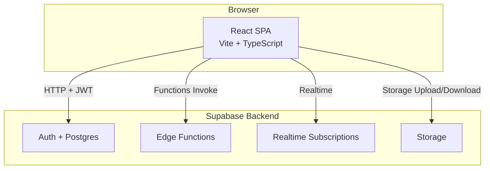
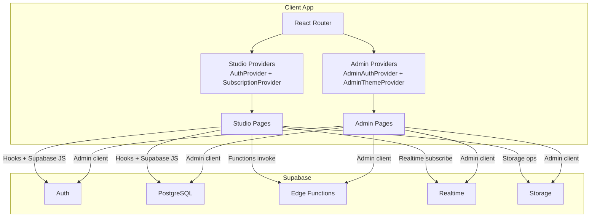
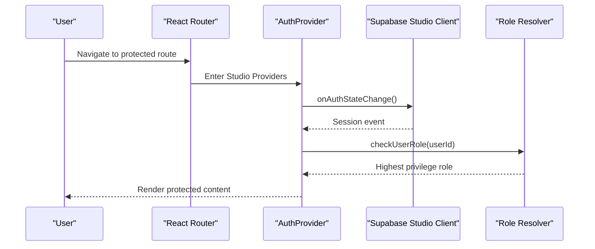
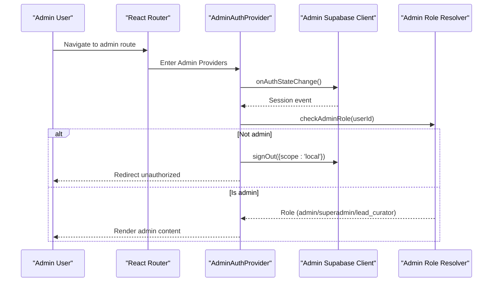
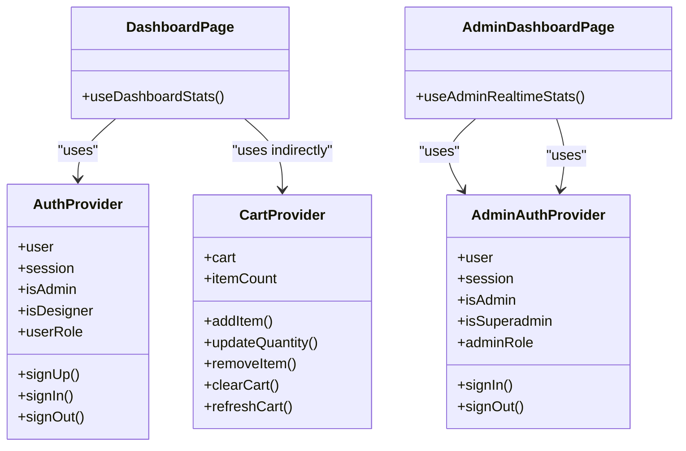
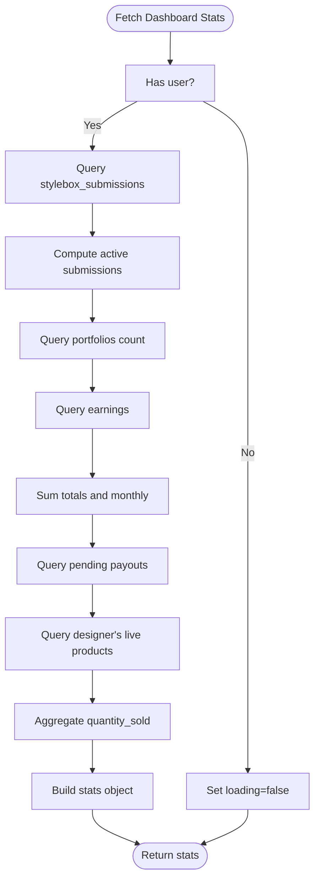
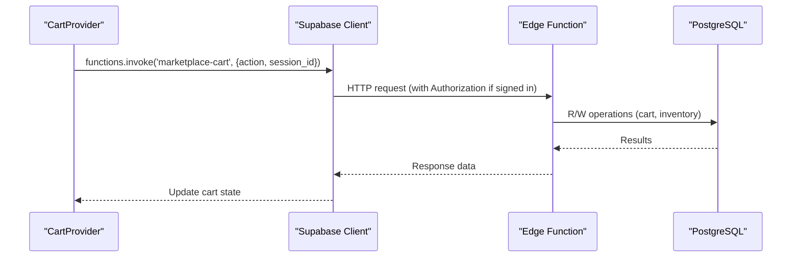
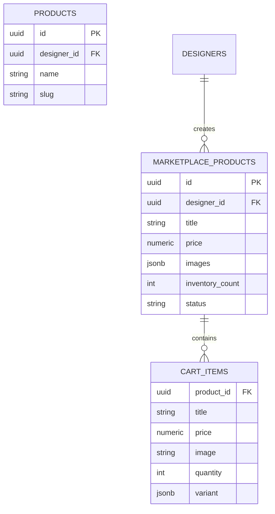
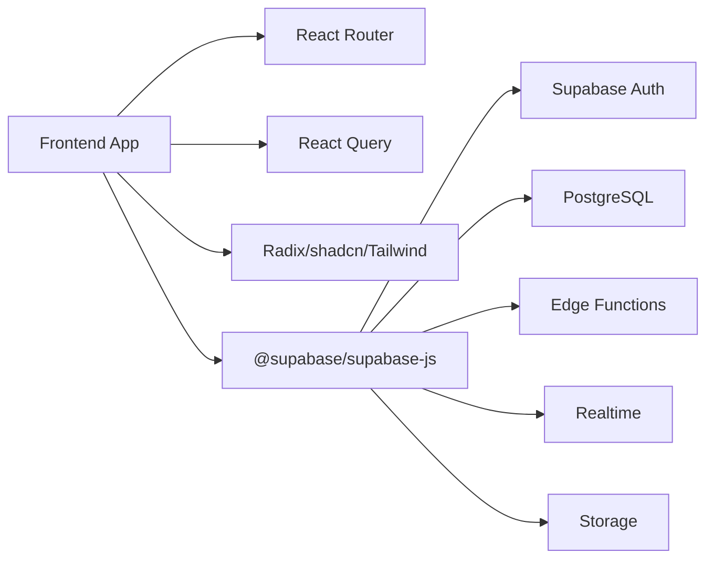

# Architecture & Technology Stack

<cite>
**Referenced Files in This Document**
- [README.md](file://README.md)
- [package.json](file://package.json)
- [src/main.tsx](file://src/main.tsx)
- [src/App.tsx](file://src/App.tsx)
- [src/integrations/supabase/client.ts](file://src/integrations/supabase/client.ts)
- [src/integrations/supabase/admin-client.ts](file://src/integrations/supabase/admin-client.ts)
- [src/hooks/useAuth.tsx](file://src/hooks/useAuth.tsx)
- [src/hooks/useAdminAuth.tsx](file://src/hooks/useAdminAuth.tsx)
- [src/hooks/useCart.tsx](file://src/hooks/useCart.tsx)
- [src/hooks/useAdminRealtimeStats.tsx](file://src/hooks/useAdminRealtimeStats.tsx)
- [src/hooks/useDashboardStats.tsx](file://src/hooks/useDashboardStats.tsx)
- [src/pages/Dashboard.tsx](file://src/pages/Dashboard.tsx)
- [src/pages/admin/AdminDashboard.tsx](file://src/pages/admin/AdminDashboard.tsx)
- [src/types/database.ts](file://src/types/database.ts)
- [supabase/config.toml](file://supabase/config.toml)
</cite>

## Table of Contents
1. [Introduction](#introduction)
2. [Project Structure](#project-structure)
3. [Core Components](#core-components)
4. [Architecture Overview](#architecture-overview)
5. [Detailed Component Analysis](#detailed-component-analysis)
6. [Dependency Analysis](#dependency-analysis)
7. [Performance Considerations](#performance-considerations)
8. [Troubleshooting Guide](#troubleshooting-guide)
9. [Conclusion](#conclusion)
10. [Appendices](#appendices)

## Introduction
This document describes the full-stack architecture of the Adorzia platform, focusing on the React frontend and Supabase backend services. It explains the component hierarchy, state management strategy using custom hooks and React Context, data flow patterns, authentication architecture with dual providers for designers and administrators, and Supabase integration including database schema, real-time subscriptions, storage, and serverless functions. It also covers system boundaries, external dependencies, scalability, security, and deployment topology.

## Project Structure
The application is a Vite + React + TypeScript single-page application with a clear separation of concerns:
- Frontend: React components organized by feature (studio, admin, marketplace, public), shared UI primitives, and hooks for state and data.
- Supabase integration: Two clients (studio and admin) with isolated storage to maintain separate sessions.
- Supabase backend: Functions (invoked via Supabase Functions API), migrations (schema), and configuration.

**Diagram sources**
- [src/App.tsx](file://src/App.tsx#L112-L347)
- [src/integrations/supabase/client.ts](file://src/integrations/supabase/client.ts#L11-L17)
- [src/integrations/supabase/admin-client.ts](file://src/integrations/supabase/admin-client.ts#L16-L27)
- [supabase/config.toml](file://supabase/config.toml#L1-L71)

**Section sources**
- [README.md](file://README.md#L53-L62)
- [package.json](file://package.json#L13-L66)
- [src/App.tsx](file://src/App.tsx#L112-L347)

## Core Components
- Dual authentication providers:
  - Designer/Admin provider: centralized auth state, role resolution, and session persistence.
  - Admin-only provider: isolated session and role checks for administrative functions.
- Data providers:
  - Cart provider: manages marketplace cart via Supabase Edge Functions.
  - Dashboard stats: aggregates metrics for studio dashboards.
  - Admin realtime stats: live dashboard metrics with Supabase Realtime.
- Routing and layout:
  - Nested routing with protected routes for studio and admin.
  - Providers wrapped around route groups to scope auth and subscriptions.

Key implementation references:
- App shell and routing: [src/App.tsx](file://src/App.tsx#L112-L347)
- Studio auth provider: [src/hooks/useAuth.tsx](file://src/hooks/useAuth.tsx#L22-L243)
- Admin auth provider: [src/hooks/useAdminAuth.tsx](file://src/hooks/useAdminAuth.tsx#L21-L207)
- Cart provider: [src/hooks/useCart.tsx](file://src/hooks/useCart.tsx#L57-L205)
- Dashboard stats: [src/hooks/useDashboardStats.tsx](file://src/hooks/useDashboardStats.tsx#L15-L122)
- Admin realtime stats: [src/hooks/useAdminRealtimeStats.tsx](file://src/hooks/useAdminRealtimeStats.tsx#L24-L208)

**Section sources**
- [src/App.tsx](file://src/App.tsx#L112-L347)
- [src/hooks/useAuth.tsx](file://src/hooks/useAuth.tsx#L22-L243)
- [src/hooks/useAdminAuth.tsx](file://src/hooks/useAdminAuth.tsx#L21-L207)
- [src/hooks/useCart.tsx](file://src/hooks/useCart.tsx#L57-L205)
- [src/hooks/useDashboardStats.tsx](file://src/hooks/useDashboardStats.tsx#L15-L122)
- [src/hooks/useAdminRealtimeStats.tsx](file://src/hooks/useAdminRealtimeStats.tsx#L24-L208)

## Architecture Overview
The system follows a client-driven architecture:
- React SPA handles routing, UI rendering, and user interactions.
- Supabase provides identity, relational data, real-time, storage, and serverless functions.
- Studio and Admin apps share the same backend but use separate clients and isolated sessions.

**Diagram sources**
- [src/App.tsx](file://src/App.tsx#L90-L110)
- [src/App.tsx](file://src/App.tsx#L241-L338)
- [src/integrations/supabase/client.ts](file://src/integrations/supabase/client.ts#L11-L17)
- [src/integrations/supabase/admin-client.ts](file://src/integrations/supabase/admin-client.ts#L16-L27)

## Detailed Component Analysis

### Authentication Architecture
Dual providers ensure secure, isolated sessions:
- Studio provider:
  - Listens to auth state changes and resolves user roles from a dedicated roles table.
  - Logs auth actions for auditability.
  - Supports multi-tab synchronization and scoped sign-out.
- Admin provider:
  - Uses an isolated storage adapter to keep admin sessions separate.
  - Enforces admin-only access and logs admin actions.
  - Forces sign-out on invalid access attempts to prevent hijacking.

**Diagram sources**
- [src/hooks/useAuth.tsx](file://src/hooks/useAuth.tsx#L54-L133)
- [src/App.tsx](file://src/App.tsx#L157-L236)

**Diagram sources**
- [src/hooks/useAdminAuth.tsx](file://src/hooks/useAdminAuth.tsx#L53-L140)
- [src/App.tsx](file://src/App.tsx#L241-L338)

**Section sources**
- [src/hooks/useAuth.tsx](file://src/hooks/useAuth.tsx#L22-L243)
- [src/hooks/useAdminAuth.tsx](file://src/hooks/useAdminAuth.tsx#L21-L207)
- [src/integrations/supabase/admin-client.ts](file://src/integrations/supabase/admin-client.ts#L8-L12)

### State Management Strategy
- Context providers encapsulate cross-cutting concerns:
  - Auth contexts for studio and admin.
  - Subscription context for studio features.
  - Cart context for marketplace operations.
  - UI theme context for admin.
- Hooks orchestrate Supabase interactions and expose typed data to components.

**Diagram sources**
- [src/hooks/useAuth.tsx](file://src/hooks/useAuth.tsx#L22-L243)
- [src/hooks/useAdminAuth.tsx](file://src/hooks/useAdminAuth.tsx#L21-L207)
- [src/hooks/useCart.tsx](file://src/hooks/useCart.tsx#L57-L205)
- [src/pages/Dashboard.tsx](file://src/pages/Dashboard.tsx#L29-L93)
- [src/pages/admin/AdminDashboard.tsx](file://src/pages/admin/AdminDashboard.tsx#L29-L181)

**Section sources**
- [src/hooks/useAuth.tsx](file://src/hooks/useAuth.tsx#L22-L243)
- [src/hooks/useAdminAuth.tsx](file://src/hooks/useAdminAuth.tsx#L21-L207)
- [src/hooks/useCart.tsx](file://src/hooks/useCart.tsx#L57-L205)
- [src/pages/Dashboard.tsx](file://src/pages/Dashboard.tsx#L29-L93)
- [src/pages/admin/AdminDashboard.tsx](file://src/pages/admin/AdminDashboard.tsx#L29-L181)

### Data Flow Patterns
- Studio dashboard metrics:
  - Aggregates counts and sums from multiple tables using Supabase queries.
  - Uses a hook to compute derived metrics client-side.
- Admin realtime dashboard:
  - Uses RPC for initial stats and Supabase Realtime for live updates.
  - Subscribes to inserts/updates on profiles, stylebox_submissions, portfolio_publications, and earnings.

**Diagram sources**
- [src/hooks/useDashboardStats.tsx](file://src/hooks/useDashboardStats.tsx#L34-L118)

**Section sources**
- [src/hooks/useDashboardStats.tsx](file://src/hooks/useDashboardStats.tsx#L15-L122)
- [src/pages/Dashboard.tsx](file://src/pages/Dashboard.tsx#L29-L93)

### Supabase Integration
- Clients:
  - Studio client with default storage and token refresh.
  - Admin client with isolated storage and admin-specific keys.
- Functions:
  - Invoked via Supabase JS Functions API from the cart provider.
  - Configured per-function JWT verification toggles.
- Realtime:
  - Admin dashboard subscribes to postgres_changes for live updates.
  - Studio dashboard uses React Query for polling and RPC for stats.

**Diagram sources**
- [src/hooks/useCart.tsx](file://src/hooks/useCart.tsx#L67-L85)
- [supabase/config.toml](file://supabase/config.toml#L3-L52)

**Section sources**
- [src/integrations/supabase/client.ts](file://src/integrations/supabase/client.ts#L11-L17)
- [src/integrations/supabase/admin-client.ts](file://src/integrations/supabase/admin-client.ts#L16-L27)
- [src/hooks/useCart.tsx](file://src/hooks/useCart.tsx#L57-L205)
- [supabase/config.toml](file://supabase/config.toml#L1-L71)

### Data Types and Relationships
The application defines typed relations for marketplace products and cart items, enriching rows with related data.

**Diagram sources**
- [src/types/database.ts](file://src/types/database.ts#L3-L28)

**Section sources**
- [src/types/database.ts](file://src/types/database.ts#L1-L29)

## Dependency Analysis
External dependencies and their roles:
- Supabase JS: Auth, database, storage, and functions.
- TanStack React Query: Server state caching and refetching.
- React Router DOM: Navigation and protected routes.
- UI libraries: Radix UI primitives, shadcn/ui, Tailwind CSS.

**Diagram sources**
- [package.json](file://package.json#L13-L66)
- [src/App.tsx](file://src/App.tsx#L112-L347)

**Section sources**
- [package.json](file://package.json#L13-L66)

## Performance Considerations
- Minimize redundant queries: use React Query’s caching and selective refetch intervals.
- Batch reads/writes: leverage Supabase RPCs and functions to reduce round-trips.
- Realtime efficiency: subscribe only to necessary channels and events; throttle UI updates.
- Client-side computation: derive metrics in hooks to avoid repeated server calls.
- Storage: compress images before upload and use CDN-backed URLs.

## Troubleshooting Guide
- Auth state inconsistencies:
  - Verify multi-tab sync logic and storage keys for both studio and admin clients.
  - Confirm auth state change listeners are properly unsubscribed.
- Admin access denied:
  - Ensure admin role resolution succeeds; invalid access triggers immediate sign-out from admin scope.
- Realtime not updating:
  - Check channel subscriptions and event filters; confirm table/column names match.
- Cart operations failing:
  - Inspect function invocation headers and session IDs; validate function permissions and JWT verification settings.

**Section sources**
- [src/hooks/useAuth.tsx](file://src/hooks/useAuth.tsx#L36-L49)
- [src/hooks/useAdminAuth.tsx](file://src/hooks/useAdminAuth.tsx#L35-L48)
- [src/hooks/useAdminRealtimeStats.tsx](file://src/hooks/useAdminRealtimeStats.tsx#L114-L184)
- [src/hooks/useCart.tsx](file://src/hooks/useCart.tsx#L67-L85)
- [supabase/config.toml](file://supabase/config.toml#L3-L71)

## Conclusion
Adorzia employs a clean separation between studio and admin experiences, powered by Supabase. The dual authentication providers enforce strict isolation, while custom hooks and React Context deliver predictable state management. Supabase Functions, Realtime, and Storage integrate seamlessly with the React SPA, enabling scalable, real-time features with minimal backend maintenance.

## Appendices

### Deployment Topology
- Frontend: Vite-built static assets served via a CDN or edge platform.
- Backend: Supabase-managed infrastructure (Auth, Postgres, Edge Functions, Storage, Realtime).
- Environment: Supabase project ID and function-level JWT verification configured centrally.

**Section sources**
- [README.md](file://README.md#L63-L73)
- [supabase/config.toml](file://supabase/config.toml#L1-L71)