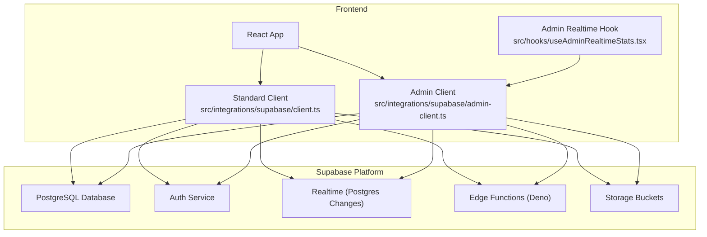
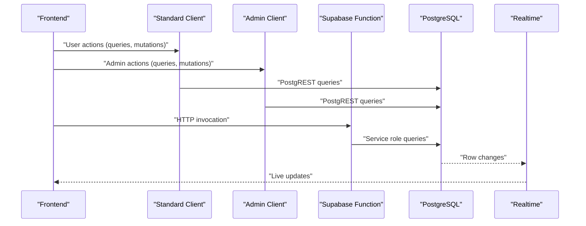
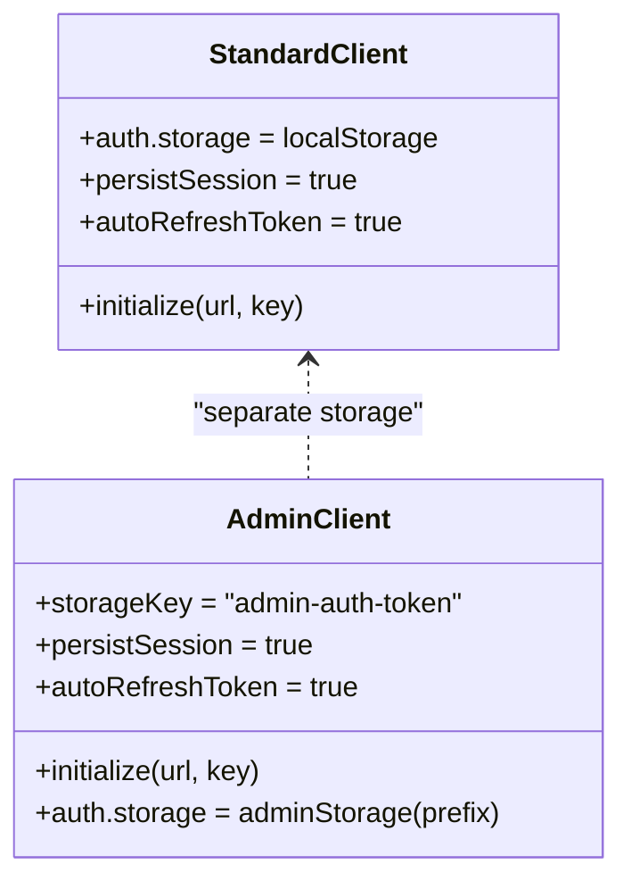
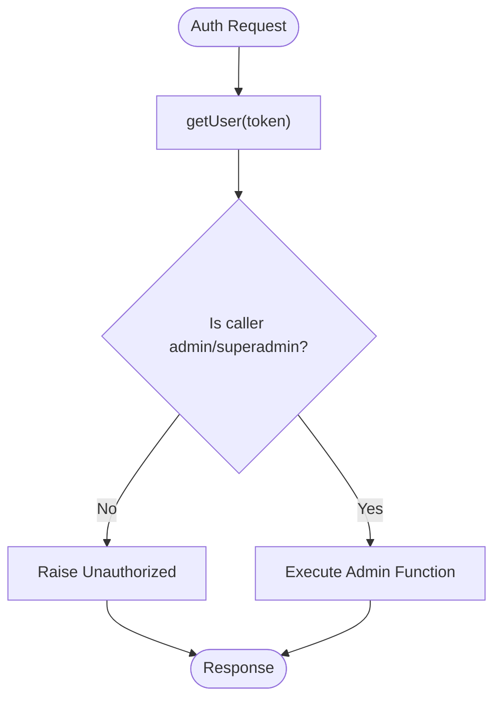
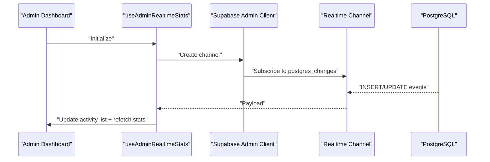
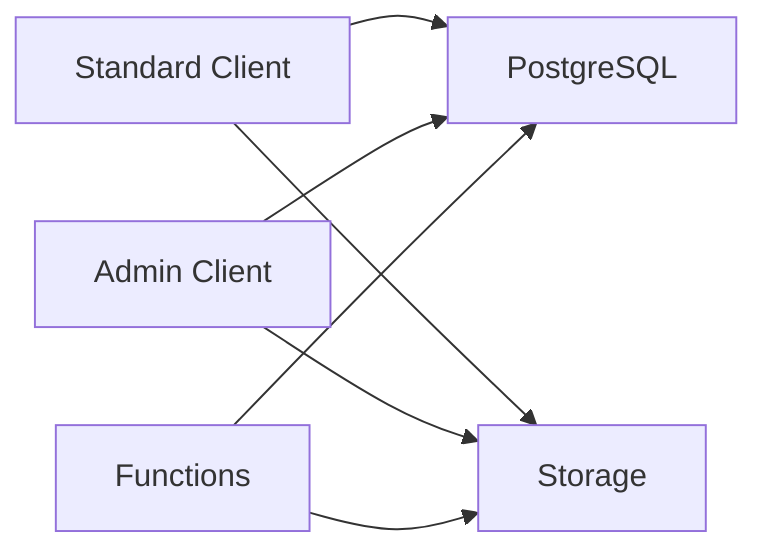
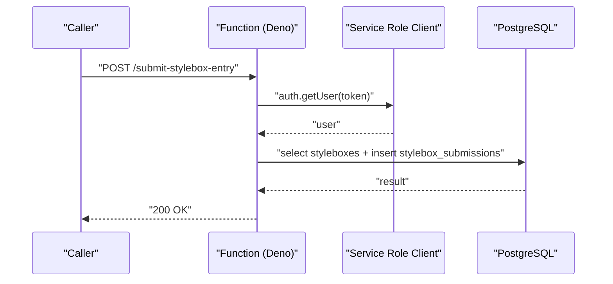
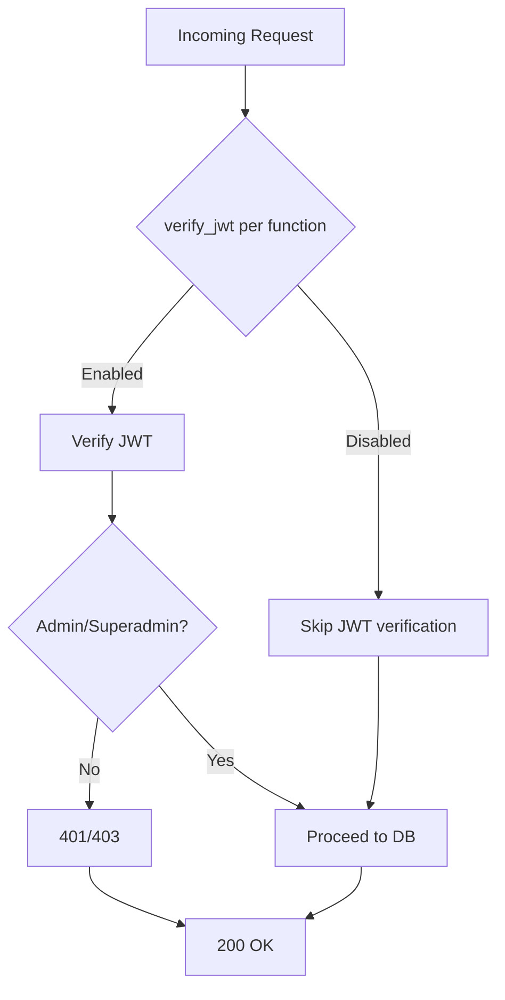
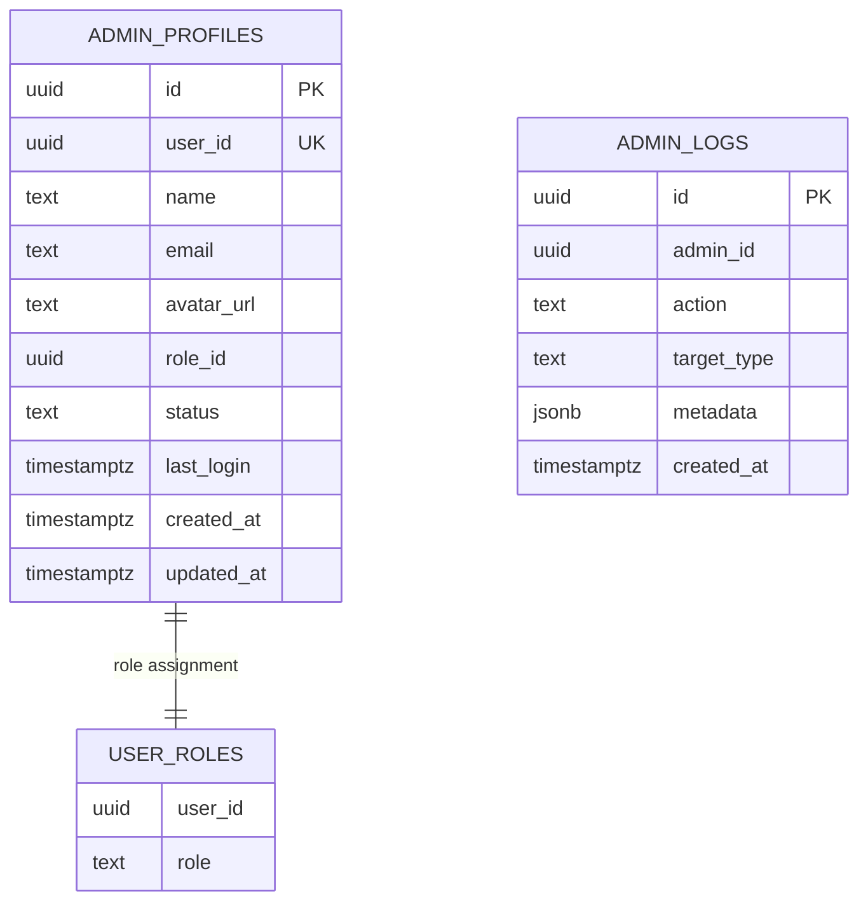
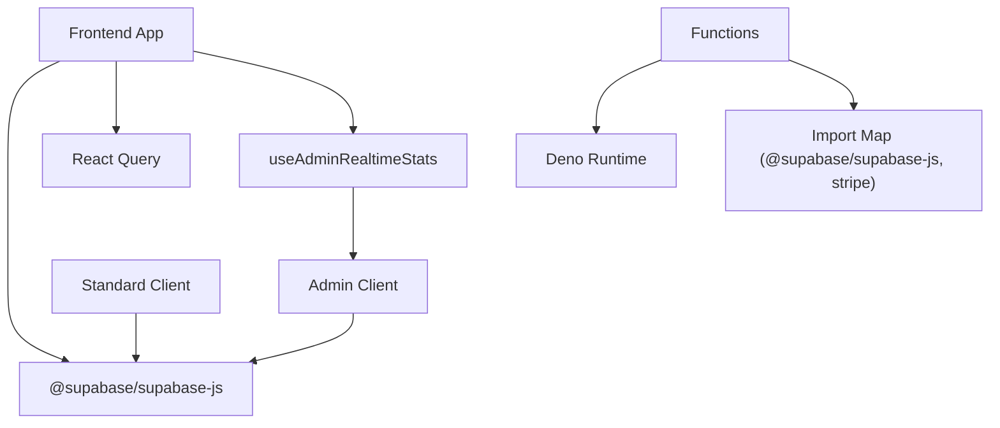

# Backend Architecture

<cite>
**Referenced Files in This Document**
- [client.ts](file://src/integrations/supabase/client.ts)
- [admin-client.ts](file://src/integrations/supabase/admin-client.ts)
- [types.ts](file://src/integrations/supabase/types.ts)
- [config.toml](file://supabase/config.toml)
- [deno.json](file://supabase/functions/deno.json)
- [import_map.json](file://supabase/functions/import_map.json)
- [submit-stylebox-entry/index.ts](file://supabase/functions/submit-stylebox-entry/index.ts)
- [calculate-designer-score/index.ts](file://supabase/functions/calculate-designer-score/index.ts)
- [manage-team/index.ts](file://supabase/functions/manage-team/index.ts)
- [useAdminRealtimeStats.tsx](file://src/hooks/useAdminRealtimeStats.tsx)
- [20260126040000_admin_auth_security.sql](file://supabase/migrations/20260126040000_admin_auth_security.sql)
- [20260126050000_bootstrap_superadmin.sql](file://supabase/migrations/20260126050000_bootstrap_superadmin.sql)
- [20260126060000_isolate_admin_auth.sql](file://supabase/migrations/20260126060000_isolate_admin_auth.sql)
- [package.json](file://package.json)
</cite>

## Table of Contents
1. [Introduction](#introduction)
2. [Project Structure](#project-structure)
3. [Core Components](#core-components)
4. [Architecture Overview](#architecture-overview)
5. [Detailed Component Analysis](#detailed-component-analysis)
6. [Dependency Analysis](#dependency-analysis)
7. [Performance Considerations](#performance-considerations)
8. [Troubleshooting Guide](#troubleshooting-guide)
9. [Conclusion](#conclusion)

## Introduction
This document describes the backend architecture of a Supabase-powered system. It covers the dual client architecture (standard and admin), authentication providers, real-time capabilities, Supabase integration patterns (database, storage, functions), serverless function architecture, security posture, and multi-tenant design with role-based access control and data isolation.

## Project Structure
The backend is composed of:
- Frontend integration modules for Supabase clients (standard and admin)
- Supabase serverless functions (Deno runtime)
- Supabase configuration and migrations for security, roles, and real-time

**Diagram sources**
- [client.ts](file://src/integrations/supabase/client.ts#L1-L17)
- [admin-client.ts](file://src/integrations/supabase/admin-client.ts#L1-L28)
- [useAdminRealtimeStats.tsx](file://src/hooks/useAdminRealtimeStats.tsx#L1-L209)

**Section sources**
- [client.ts](file://src/integrations/supabase/client.ts#L1-L17)
- [admin-client.ts](file://src/integrations/supabase/admin-client.ts#L1-L28)
- [package.json](file://package.json#L13-L66)

## Core Components
- Dual Supabase clients:
  - Standard client for designers and general users
  - Admin client with isolated storage and session keys
- Supabase serverless functions (Deno) for business logic
- Real-time subscriptions for admin dashboards
- Role-based access control and data isolation via RLS and policies
- Function-level JWT verification toggles

**Section sources**
- [client.ts](file://src/integrations/supabase/client.ts#L11-L17)
- [admin-client.ts](file://src/integrations/supabase/admin-client.ts#L16-L27)
- [config.toml](file://supabase/config.toml#L1-L71)

## Architecture Overview
The system integrates a React frontend with Supabase. Two clients coexist:
- Standard client: used by designers and general users
- Admin client: used by administrators with isolated sessions

Serverless functions handle specialized tasks (e.g., scoring, team management, marketplace operations). Real-time subscriptions stream database changes to the admin dashboard. Security is enforced via Supabase Auth, RLS policies, and function-level JWT verification.

**Diagram sources**
- [client.ts](file://src/integrations/supabase/client.ts#L11-L17)
- [admin-client.ts](file://src/integrations/supabase/admin-client.ts#L16-L27)
- [submit-stylebox-entry/index.ts](file://supabase/functions/submit-stylebox-entry/index.ts#L1-L142)
- [useAdminRealtimeStats.tsx](file://src/hooks/useAdminRealtimeStats.tsx#L114-L184)

## Detailed Component Analysis

### Dual Client Architecture
- Standard client
  - Initializes Supabase with local storage persistence and token refresh
  - Used for user-facing features (dashboard, marketplace, profile)
- Admin client
  - Uses a separate storage adapter with an admin-specific prefix
  - Ensures admin and studio sessions are independent
  - Enables admin-only features and isolated auth state

**Diagram sources**
- [client.ts](file://src/integrations/supabase/client.ts#L11-L17)
- [admin-client.ts](file://src/integrations/supabase/admin-client.ts#L8-L12)
- [admin-client.ts](file://src/integrations/supabase/admin-client.ts#L16-L27)

**Section sources**
- [client.ts](file://src/integrations/supabase/client.ts#L11-L17)
- [admin-client.ts](file://src/integrations/supabase/admin-client.ts#L1-L28)

### Authentication Providers and RBAC
- Supabase Auth manages identities and sessions for both clients
- Roles and permissions are enforced via:
  - Function-level checks (e.g., admin-only dashboard stats)
  - Row Level Security policies on sensitive tables
  - Isolated admin profiles and bootstrap procedures for superadmin

**Diagram sources**
- [20260126040000_admin_auth_security.sql](file://supabase/migrations/20260126040000_admin_auth_security.sql#L17-L26)
- [20260126050000_bootstrap_superadmin.sql](file://supabase/migrations/20260126050000_bootstrap_superadmin.sql#L4-L84)

**Section sources**
- [20260126040000_admin_auth_security.sql](file://supabase/migrations/20260126040000_admin_auth_security.sql#L1-L79)
- [20260126050000_bootstrap_superadmin.sql](file://supabase/migrations/20260126050000_bootstrap_superadmin.sql#L1-L84)
- [20260126060000_isolate_admin_auth.sql](file://supabase/migrations/20260126060000_isolate_admin_auth.sql#L1-L96)

### Real-Time Capabilities
- Admin dashboard subscribes to PostgreSQL changes on key tables
- Live updates for new signups, submissions, publications, and earnings
- Realtime publication configured for admin tables

**Diagram sources**
- [useAdminRealtimeStats.tsx](file://src/hooks/useAdminRealtimeStats.tsx#L114-L184)
- [20260126040000_admin_auth_security.sql](file://supabase/migrations/20260126040000_admin_auth_security.sql#L43-L59)

**Section sources**
- [useAdminRealtimeStats.tsx](file://src/hooks/useAdminRealtimeStats.tsx#L1-L209)
- [20260126040000_admin_auth_security.sql](file://supabase/migrations/20260126040000_admin_auth_security.sql#L43-L59)

### Supabase Integration Patterns
- Database connections
  - Standard client uses anonymous/public key for unauthenticated endpoints
  - Admin client uses anonymous/public key for admin-facing queries
  - Serverless functions use service role keys for privileged operations
- Storage operations
  - Storage buckets managed by Supabase; client-side uploads integrate with auth and policies
- Function invocations
  - Functions deployed as Deno modules with import maps
  - CORS handling and JWT verification configured per function

**Diagram sources**
- [client.ts](file://src/integrations/supabase/client.ts#L11-L17)
- [admin-client.ts](file://src/integrations/supabase/admin-client.ts#L16-L27)
- [deno.json](file://supabase/functions/deno.json#L1-L4)
- [import_map.json](file://supabase/functions/import_map.json#L1-L7)

**Section sources**
- [client.ts](file://src/integrations/supabase/client.ts#L1-L17)
- [admin-client.ts](file://src/integrations/supabase/admin-client.ts#L1-L28)
- [deno.json](file://supabase/functions/deno.json#L1-L4)
- [import_map.json](file://supabase/functions/import_map.json#L1-L7)

### Serverless Function Architecture
- Runtime and imports
  - Deno runtime with import map pointing to ESM packages
- Function examples
  - Submission handler validates token, checks stylebox eligibility, inserts submission, and emits notifications
  - Scoring calculator aggregates weighted metrics and upserts designer scores
  - Team manager coordinates creation, invitations, join requests, and membership lifecycle with admin privileges

**Diagram sources**
- [submit-stylebox-entry/index.ts](file://supabase/functions/submit-stylebox-entry/index.ts#L9-L142)
- [calculate-designer-score/index.ts](file://supabase/functions/calculate-designer-score/index.ts#L30-L223)
- [manage-team/index.ts](file://supabase/functions/manage-team/index.ts#L8-L548)

**Section sources**
- [submit-stylebox-entry/index.ts](file://supabase/functions/submit-stylebox-entry/index.ts#L1-L142)
- [calculate-designer-score/index.ts](file://supabase/functions/calculate-designer-score/index.ts#L1-L223)
- [manage-team/index.ts](file://supabase/functions/manage-team/index.ts#L1-L548)

### Security Considerations
- Function-level JWT verification toggled per endpoint
- Admin-only functions enforce role checks inside the function logic
- Realtime enabled for admin tables; RLS policies restrict access
- Admin profiles isolated from designer profiles with dedicated policies

**Diagram sources**
- [config.toml](file://supabase/config.toml#L1-L71)
- [20260126040000_admin_auth_security.sql](file://supabase/migrations/20260126040000_admin_auth_security.sql#L17-L26)

**Section sources**
- [config.toml](file://supabase/config.toml#L1-L71)
- [20260126040000_admin_auth_security.sql](file://supabase/migrations/20260126040000_admin_auth_security.sql#L1-L79)

### Multi-Tenant Design and Data Isolation
- Admin and designer sessions are isolated via distinct storage adapters
- Dedicated admin profiles table with RLS policies
- Admin-only functions and RPCs enforce role-based access
- Realtime publication includes admin tables to power dashboards

**Diagram sources**
- [20260126060000_isolate_admin_auth.sql](file://supabase/migrations/20260126060000_isolate_admin_auth.sql#L3-L14)
- [20260126040000_admin_auth_security.sql](file://supabase/migrations/20260126040000_admin_auth_security.sql#L47-L59)

**Section sources**
- [admin-client.ts](file://src/integrations/supabase/admin-client.ts#L7-L12)
- [20260126060000_isolate_admin_auth.sql](file://supabase/migrations/20260126060000_isolate_admin_auth.sql#L1-L96)
- [20260126040000_admin_auth_security.sql](file://supabase/migrations/20260126040000_admin_auth_security.sql#L43-L59)

## Dependency Analysis
- Frontend depends on Supabase JS client libraries
- Functions depend on ESM imports resolved via import map
- Clients depend on environment variables for URLs and keys
- Admin dashboard depends on real-time subscriptions and RPCs

**Diagram sources**
- [package.json](file://package.json#L42-L42)
- [deno.json](file://supabase/functions/deno.json#L1-L4)
- [import_map.json](file://supabase/functions/import_map.json#L1-L7)
- [useAdminRealtimeStats.tsx](file://src/hooks/useAdminRealtimeStats.tsx#L1-L209)

**Section sources**
- [package.json](file://package.json#L13-L66)
- [deno.json](file://supabase/functions/deno.json#L1-L4)
- [import_map.json](file://supabase/functions/import_map.json#L1-L7)

## Performance Considerations
- Use function-level JWT verification judiciously to avoid unnecessary overhead
- Batch and paginate queries in admin dashboards to limit payload sizes
- Leverage Supabase’s PostgREST and real-time efficiently; subscribe only to necessary tables
- Cache where appropriate on the client (e.g., React Query) and invalidate on real-time events

## Troubleshooting Guide
- Admin access denied
  - Ensure the caller has admin/superadmin role and that the function enforces role checks
- Real-time not updating
  - Confirm tables are included in the realtime publication and the channel is subscribed
- Function errors
  - Review function logs and error responses; validate JWT presence and correctness
- Session conflicts
  - Verify admin client storage isolation and that standard/admin sessions are kept separate

**Section sources**
- [20260126040000_admin_auth_security.sql](file://supabase/migrations/20260126040000_admin_auth_security.sql#L17-L26)
- [useAdminRealtimeStats.tsx](file://src/hooks/useAdminRealtimeStats.tsx#L114-L184)
- [submit-stylebox-entry/index.ts](file://supabase/functions/submit-stylebox-entry/index.ts#L20-L40)

## Conclusion
The backend leverages Supabase to provide a secure, real-time, and extensible foundation. The dual client architecture isolates admin and designer experiences, while robust RBAC, RLS, and function-level controls protect sensitive operations. Serverless functions encapsulate business logic, and real-time subscriptions deliver live insights to the admin dashboard. Together, these patterns support scalability, maintainability, and clear separation of concerns.