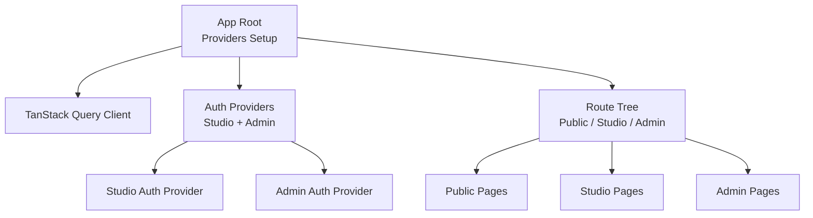
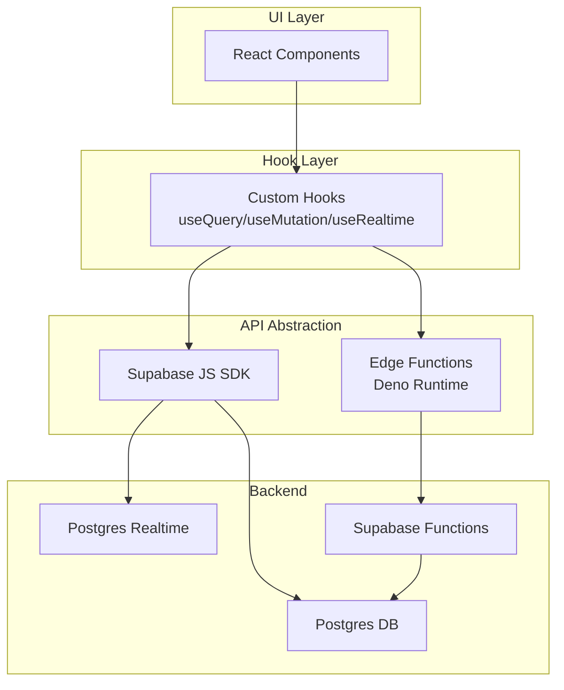
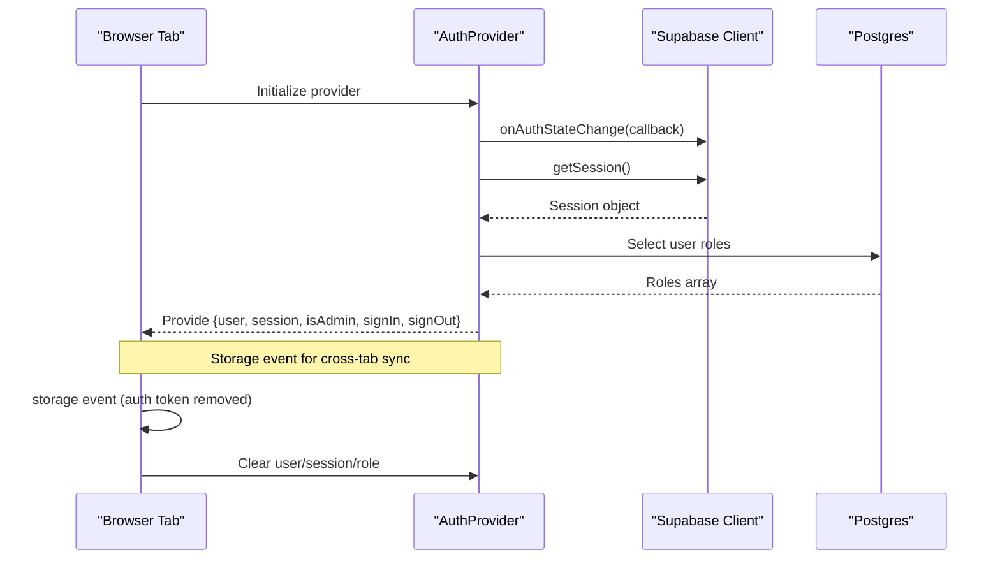
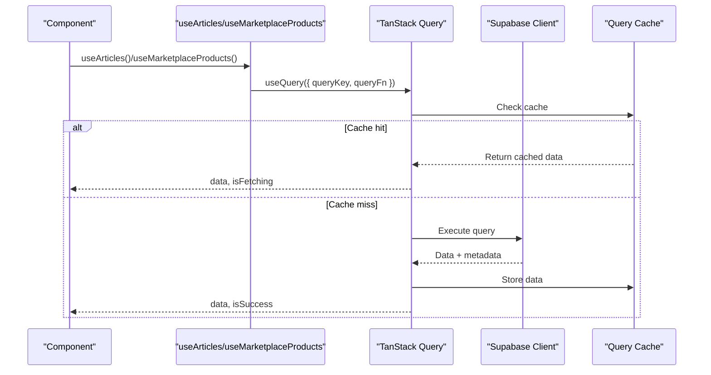
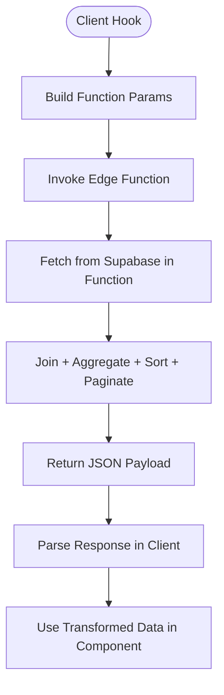
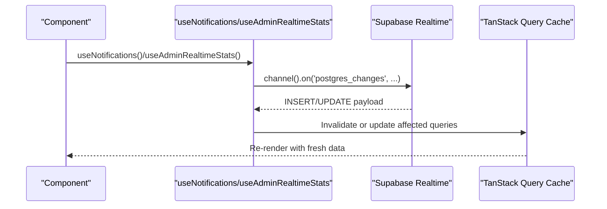
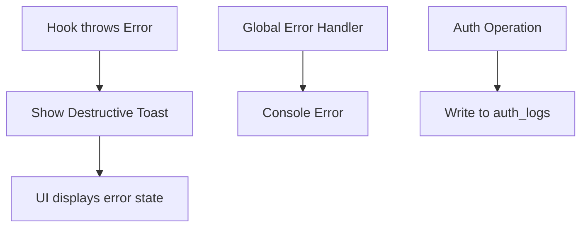
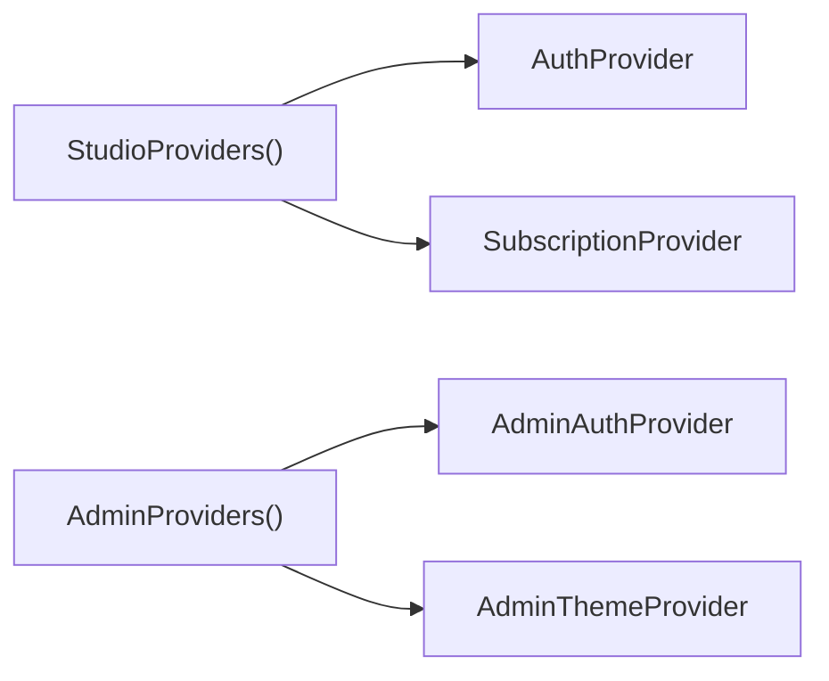
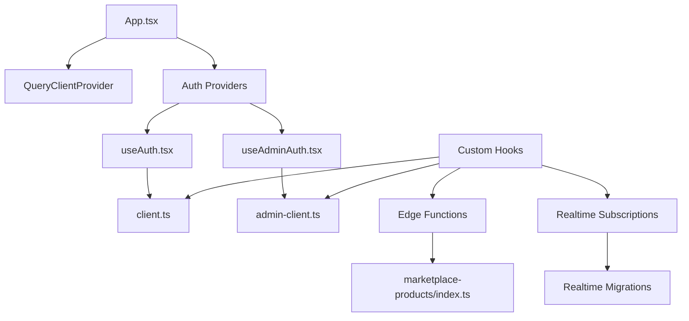

# Data Flow Architecture

<cite>
**Referenced Files in This Document**
- [App.tsx](file://src/App.tsx)
- [main.tsx](file://src/main.tsx)
- [useAuth.tsx](file://src/hooks/useAuth.tsx)
- [useAdminAuth.tsx](file://src/hooks/useAdminAuth.tsx)
- [client.ts](file://src/integrations/supabase/client.ts)
- [admin-client.ts](file://src/integrations/supabase/admin-client.ts)
- [useArticles.tsx](file://src/hooks/useArticles.tsx)
- [useMarketplaceProducts.tsx](file://src/hooks/useMarketplaceProducts.tsx)
- [useProfile.tsx](file://src/hooks/useProfile.tsx)
- [useTeamData.tsx](file://src/hooks/useTeamData.tsx)
- [useNotifications.tsx](file://src/hooks/useNotifications.tsx)
- [useAdminRealtimeStats.tsx](file://src/hooks/useAdminRealtimeStats.tsx)
- [marketplace-products/index.ts](file://supabase/functions/marketplace-products/index.ts)
- [marketplace-orders/index.ts](file://supabase/functions/marketplace-orders/index.ts)
- [20251226092855_6a9b8fc7-9fbe-4ff3-adcc-2411fc8d8d9a.sql](file://supabase/migrations/20251226092855_6a9b8fc7-9fbe-4ff3-adcc-2411fc8d8d9a.sql)
- [20251231072327_24f6c046-2261-41d6-a0e2-a733e38addd6.sql](file://supabase/migrations/20251231072327_24f6c046-2261-41d6-a0e2-a733e38addd6.sql)
</cite>

## Table of Contents
1. [Introduction](#introduction)
2. [Project Structure](#project-structure)
3. [Core Components](#core-components)
4. [Architecture Overview](#architecture-overview)
5. [Detailed Component Analysis](#detailed-component-analysis)
6. [Dependency Analysis](#dependency-analysis)
7. [Performance Considerations](#performance-considerations)
8. [Troubleshooting Guide](#troubleshooting-guide)
9. [Conclusion](#conclusion)

## Introduction
This document explains how data flows through the Adorzia platform, focusing on the custom hook pattern with TanStack Query for server state management, optimistic updates, and error handling. It details the synchronization between frontend components and the Supabase backend, including real-time updates and caching strategies. It also covers authentication state flow, session management across browser tabs, provider-based state coordination, data transformation patterns, API abstraction layers, error propagation mechanisms, and performance optimizations such as query caching, background refetching, and stale-while-revalidate patterns.

## Project Structure
The application initializes providers at the root level to establish global state and data management:
- TanStack Query client is provided globally to enable caching and background synchronization.
- Authentication providers (Studio and Admin) coordinate user sessions and roles.
- Route wrappers apply provider stacks per route group (Studio, Admin, Public).

**Diagram sources**
- [App.tsx](file://src/App.tsx#L88-L120)
- [useAuth.tsx](file://src/hooks/useAuth.tsx#L22-L242)
- [useAdminAuth.tsx](file://src/hooks/useAdminAuth.tsx#L21-L206)

**Section sources**
- [App.tsx](file://src/App.tsx#L1-L350)
- [main.tsx](file://src/main.tsx#L1-L20)

## Core Components
- Supabase clients:
  - Studio client configured with local storage and automatic token refresh.
  - Admin client with isolated storage to keep Admin and Studio sessions independent.
- Authentication providers:
  - Studio provider manages user session, role resolution, and cross-tab synchronization.
  - Admin provider mirrors the Studio pattern with separate storage and role checks.
- TanStack Query hooks:
  - Queries encapsulate data fetching with cache keys and error handling.
  - Mutations orchestrate server-side writes and invalidate caches.
  - Real-time subscriptions listen to Postgres changes for live updates.

**Section sources**
- [client.ts](file://src/integrations/supabase/client.ts#L1-L17)
- [admin-client.ts](file://src/integrations/supabase/admin-client.ts#L1-L28)
- [useAuth.tsx](file://src/hooks/useAuth.tsx#L1-L252)
- [useAdminAuth.tsx](file://src/hooks/useAdminAuth.tsx#L1-L216)
- [useArticles.tsx](file://src/hooks/useArticles.tsx#L1-L175)
- [useMarketplaceProducts.tsx](file://src/hooks/useMarketplaceProducts.tsx#L1-L209)
- [useNotifications.tsx](file://src/hooks/useNotifications.tsx#L1-L88)
- [useAdminRealtimeStats.tsx](file://src/hooks/useAdminRealtimeStats.tsx#L1-L149)

## Architecture Overview
The platform follows a layered architecture:
- UI Layer: React components using custom hooks for data access.
- Hook Layer: TanStack Query queries/mutations and Supabase real-time subscriptions.
- API Abstraction: Supabase client SDK and Supabase Edge Functions.
- Backend: Supabase Postgres with Row Level Security, Realtime, and Edge Functions.

**Diagram sources**
- [useArticles.tsx](file://src/hooks/useArticles.tsx#L1-L175)
- [useMarketplaceProducts.tsx](file://src/hooks/useMarketplaceProducts.tsx#L1-L209)
- [marketplace-products/index.ts](file://supabase/functions/marketplace-products/index.ts#L1-L256)
- [useNotifications.tsx](file://src/hooks/useNotifications.tsx#L1-L88)
- [useAdminRealtimeStats.tsx](file://src/hooks/useAdminRealtimeStats.tsx#L1-L149)

## Detailed Component Analysis

### Authentication State Flow and Cross-Tab Session Management
The Studio and Admin authentication providers:
- Initialize auth listeners and session retrieval.
- Resolve user roles via dedicated role tables.
- Synchronize state across browser tabs using storage events.
- Provide scoped sign-out to avoid mixing sessions.

**Diagram sources**
- [useAuth.tsx](file://src/hooks/useAuth.tsx#L36-L99)
- [useAdminAuth.tsx](file://src/hooks/useAdminAuth.tsx#L35-L99)
- [client.ts](file://src/integrations/supabase/client.ts#L11-L17)
- [admin-client.ts](file://src/integrations/supabase/admin-client.ts#L16-L27)

**Section sources**
- [useAuth.tsx](file://src/hooks/useAuth.tsx#L1-L252)
- [useAdminAuth.tsx](file://src/hooks/useAdminAuth.tsx#L1-L216)
- [client.ts](file://src/integrations/supabase/client.ts#L1-L17)
- [admin-client.ts](file://src/integrations/supabase/admin-client.ts#L1-L28)

### TanStack Query Pattern: Queries, Mutations, and Caching
The hooks layer demonstrates a consistent pattern:
- Queries define cache keys and fetch logic, enabling automatic caching and background refetching.
- Mutations encapsulate write operations and invalidate related queries to maintain cache consistency.
- Error handling is centralized via toasts and error propagation.

**Diagram sources**
- [useArticles.tsx](file://src/hooks/useArticles.tsx#L33-L59)
- [useMarketplaceProducts.tsx](file://src/hooks/useMarketplaceProducts.tsx#L83-L126)

**Section sources**
- [useArticles.tsx](file://src/hooks/useArticles.tsx#L1-L175)
- [useMarketplaceProducts.tsx](file://src/hooks/useMarketplaceProducts.tsx#L1-L209)

### Data Transformation Patterns and API Abstraction
- Marketplaces data is fetched via a Supabase Edge Function that performs joins and aggregations, returning structured payloads consumed by the client.
- The function supports multiple actions (list, detail, categories, collections) and applies sorting, filtering, and pagination.
- Client hooks transform function responses into domain-specific shapes for UI consumption.

**Diagram sources**
- [useMarketplaceProducts.tsx](file://src/hooks/useMarketplaceProducts.tsx#L102-L124)
- [marketplace-products/index.ts](file://supabase/functions/marketplace-products/index.ts#L28-L115)

**Section sources**
- [useMarketplaceProducts.tsx](file://src/hooks/useMarketplaceProducts.tsx#L1-L209)
- [marketplace-products/index.ts](file://supabase/functions/marketplace-products/index.ts#L1-L256)

### Real-Time Updates and Caching Strategies
Real-time subscriptions listen to Postgres changes to keep the UI synchronized:
- Notifications: Subscribe per-user channel for inserts and updates.
- Admin dashboard: Subscribes to multiple tables to reflect activity and trigger refetches.
- Supabase migrations enable Realtime for targeted tables and set REPLICA IDENTITY FULL for complete row data.

**Diagram sources**
- [useNotifications.tsx](file://src/hooks/useNotifications.tsx#L45-L87)
- [useAdminRealtimeStats.tsx](file://src/hooks/useAdminRealtimeStats.tsx#L113-L149)
- [20251226092855_6a9b8fc7-9fbe-4ff3-adcc-2411fc8d8d9a.sql](file://supabase/migrations/20251226092855_6a9b8fc7-9fbe-4ff3-adcc-2411fc8d8d9a.sql#L1-L19)
- [20251231072327_24f6c046-2261-41d6-a0e2-a733e38addd6.sql](file://supabase/migrations/20251231072327_24f6c046-2261-41d6-a0e2-a733e38addd6.sql#L1-L3)

**Section sources**
- [useNotifications.tsx](file://src/hooks/useNotifications.tsx#L1-L88)
- [useAdminRealtimeStats.tsx](file://src/hooks/useAdminRealtimeStats.tsx#L1-L149)
- [20251226092855_6a9b8fc7-9fbe-4ff3-adcc-2411fc8d8d9a.sql](file://supabase/migrations/20251226092855_6a9b8fc7-9fbe-4ff3-adcc-2411fc8d8d9a.sql#L1-L19)
- [20251231072327_24f6c046-2261-41d6-a0e2-a733e38addd6.sql](file://supabase/migrations/20251231072327_24f6c046-2261-41d6-a0e2-a733e38addd6.sql#L1-L3)

### Error Propagation Mechanisms
- Hook-level errors are surfaced to UI via toasts and error boundaries.
- Global error handlers capture unhandled promise rejections and window errors for debugging.
- Supabase logs are written during auth operations to track failures and successes.

**Diagram sources**
- [useArticles.tsx](file://src/hooks/useArticles.tsx#L117-L120)
- [main.tsx](file://src/main.tsx#L6-L13)
- [useAuth.tsx](file://src/hooks/useAuth.tsx#L186-L201)

**Section sources**
- [useArticles.tsx](file://src/hooks/useArticles.tsx#L1-L175)
- [main.tsx](file://src/main.tsx#L1-L20)
- [useAuth.tsx](file://src/hooks/useAuth.tsx#L177-L207)

### Provider-Based State Coordination
- Studio routes wrap child pages with AuthProvider and SubscriptionProvider.
- Admin routes wrap child pages with AdminAuthProvider and AdminThemeProvider.
- This ensures consistent state across route groups and prevents provider leakage.

**Diagram sources**
- [App.tsx](file://src/App.tsx#L90-L110)

**Section sources**
- [App.tsx](file://src/App.tsx#L90-L110)

## Dependency Analysis
The data flow depends on:
- Supabase client configuration for authentication and persistence.
- TanStack Query for caching, invalidation, and background refetching.
- Supabase Edge Functions for complex queries and transformations.
- Realtime subscriptions for live updates.

**Diagram sources**
- [App.tsx](file://src/App.tsx#L88-L120)
- [useAuth.tsx](file://src/hooks/useAuth.tsx#L1-L252)
- [useAdminAuth.tsx](file://src/hooks/useAdminAuth.tsx#L1-L216)
- [client.ts](file://src/integrations/supabase/client.ts#L1-L17)
- [admin-client.ts](file://src/integrations/supabase/admin-client.ts#L1-L28)
- [useArticles.tsx](file://src/hooks/useArticles.tsx#L1-L175)
- [useMarketplaceProducts.tsx](file://src/hooks/useMarketplaceProducts.tsx#L1-L209)
- [marketplace-products/index.ts](file://supabase/functions/marketplace-products/index.ts#L1-L256)
- [useNotifications.tsx](file://src/hooks/useNotifications.tsx#L1-L88)
- [20251226092855_6a9b8fc7-9fbe-4ff3-adcc-2411fc8d8d9a.sql](file://supabase/migrations/20251226092855_6a9b8fc7-9fbe-4ff3-adcc-2411fc8d8d9a.sql#L1-L19)

**Section sources**
- [App.tsx](file://src/App.tsx#L1-L350)
- [useArticles.tsx](file://src/hooks/useArticles.tsx#L1-L175)
- [useMarketplaceProducts.tsx](file://src/hooks/useMarketplaceProducts.tsx#L1-L209)
- [marketplace-products/index.ts](file://supabase/functions/marketplace-products/index.ts#L1-L256)
- [useNotifications.tsx](file://src/hooks/useNotifications.tsx#L1-L88)
- [20251226092855_6a9b8fc7-9fbe-4ff3-adcc-2411fc8d8d9a.sql](file://supabase/migrations/20251226092855_6a9b8fc7-9fbe-4ff3-adcc-2411fc8d8d9a.sql#L1-L19)

## Performance Considerations
- Query caching: TanStack Query caches query results keyed by queryKey, reducing redundant network requests.
- Background refetching: Queries automatically refetch when focus returns or data becomes stale.
- Stale-while-revalidate: Queries return cached data immediately while fetching fresh data in the background.
- Optimistic updates: While not explicitly implemented in the analyzed hooks, the pattern can be adopted by mutating cache entries before server confirmation and rolling back on error.
- Pagination and filtering: Edge Functions compute counts and paginated slices server-side, minimizing client-side work.
- Realtime invalidation: Subscriptions trigger cache updates and refetches to keep views consistent without manual polling.

[No sources needed since this section provides general guidance]

## Troubleshooting Guide
- Authentication issues:
  - Verify storage keys and scopes for Studio vs Admin clients.
  - Confirm cross-tab sync handles explicit sign-out events.
- Real-time not updating:
  - Ensure tables are included in supabase_realtime publication and REPLICA IDENTITY FULL is set.
  - Check subscription filters and channel names match backend expectations.
- Network errors:
  - Inspect hook-level error handling and toast feedback.
  - Review global error handlers for unhandled rejections.
- Edge Function failures:
  - Validate function actions and parameters.
  - Check service role keys and authorization headers.

**Section sources**
- [useAuth.tsx](file://src/hooks/useAuth.tsx#L36-L49)
- [useAdminAuth.tsx](file://src/hooks/useAdminAuth.tsx#L35-L48)
- [20251226092855_6a9b8fc7-9fbe-4ff3-adcc-2411fc8d8d9a.sql](file://supabase/migrations/20251226092855_6a9b8fc7-9fbe-4ff3-adcc-2411fc8d8d9a.sql#L1-L19)
- [useArticles.tsx](file://src/hooks/useArticles.tsx#L117-L120)
- [main.tsx](file://src/main.tsx#L6-L13)
- [marketplace-products/index.ts](file://supabase/functions/marketplace-products/index.ts#L1-L256)

## Conclusion
The Adorzia platform implements a robust data flow architecture centered on TanStack Query for caching and synchronization, Supabase for authentication and real-time capabilities, and Edge Functions for scalable data transformations. Provider-based state coordination ensures consistent authentication across Studio and Admin contexts, while real-time subscriptions and migration-driven publications keep the UI synchronized. The documented patterns—queries, mutations, caching, and error handling—provide a foundation for building performant, reliable features with predictable data behavior.