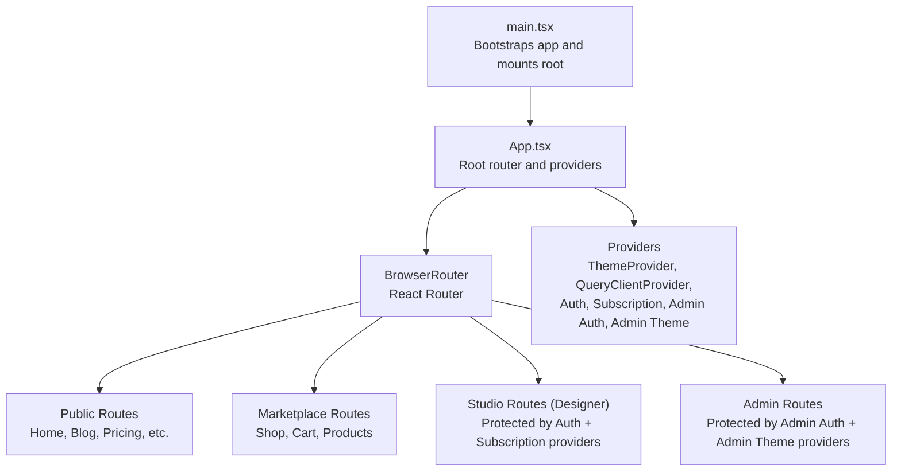
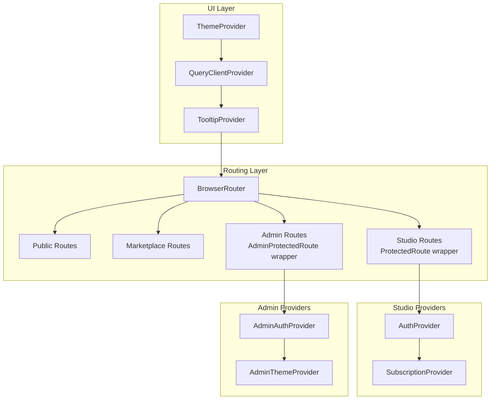
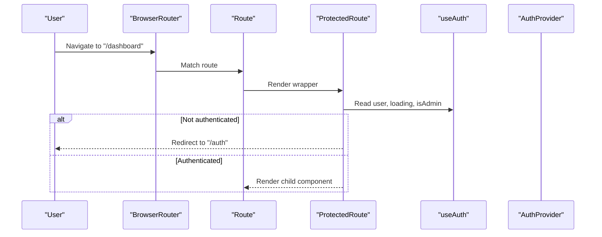
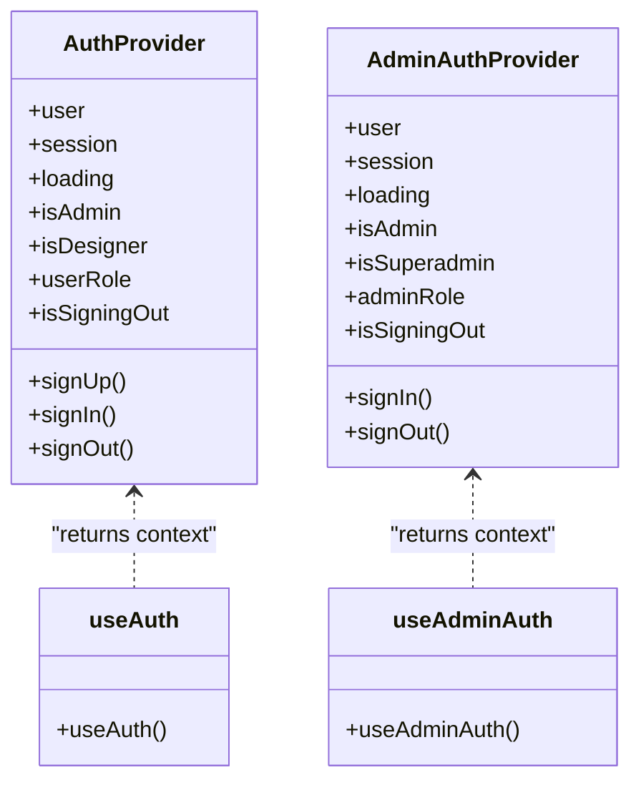
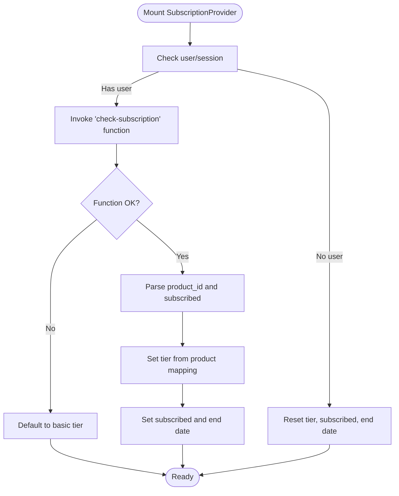
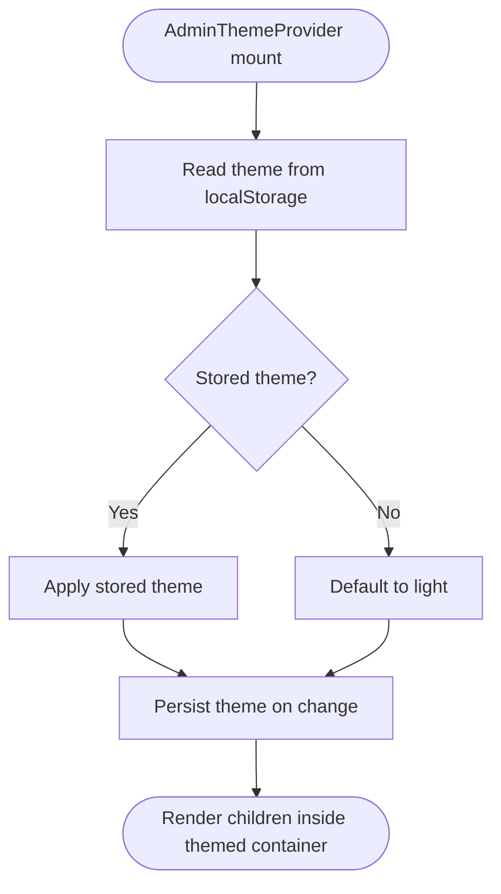
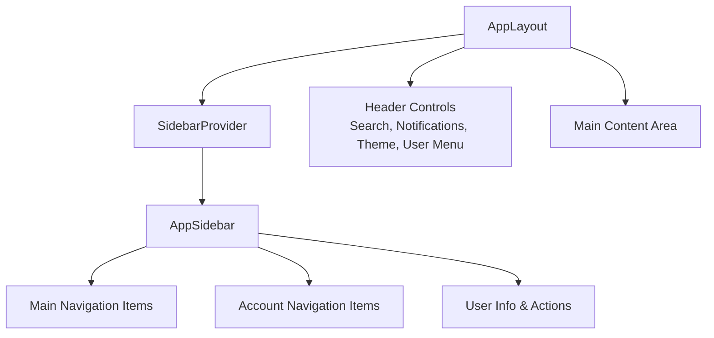
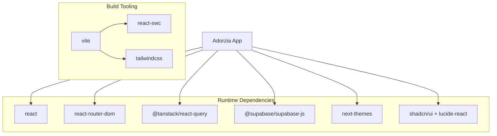

# Frontend Architecture

<cite>
**Referenced Files in This Document**
- [main.tsx](file://src/main.tsx)
- [App.tsx](file://src/App.tsx)
- [vite.config.ts](file://vite.config.ts)
- [package.json](file://package.json)
- [useAuth.tsx](file://src/hooks/useAuth.tsx)
- [useAdminAuth.tsx](file://src/hooks/useAdminAuth.tsx)
- [useSubscription.tsx](file://src/hooks/useSubscription.tsx)
- [useAdminTheme.tsx](file://src/hooks/useAdminTheme.tsx)
- [ProtectedRoute.tsx](file://src/components/auth/ProtectedRoute.tsx)
- [AdminProtectedRoute.tsx](file://src/components/auth/AdminProtectedRoute.tsx)
- [AppLayout.tsx](file://src/components/layout/AppLayout.tsx)
- [AppSidebar.tsx](file://src/components/layout/AppSidebar.tsx)
- [utils.ts](file://src/lib/utils.ts)
- [tailwind.config.ts](file://tailwind.config.ts)
</cite>

## Table of Contents
1. [Introduction](#introduction)
2. [Project Structure](#project-structure)
3. [Core Components](#core-components)
4. [Architecture Overview](#architecture-overview)
5. [Detailed Component Analysis](#detailed-component-analysis)
6. [Dependency Analysis](#dependency-analysis)
7. [Performance Considerations](#performance-considerations)
8. [Troubleshooting Guide](#troubleshooting-guide)
9. [Conclusion](#conclusion)

## Introduction
This document describes the frontend architecture of the Adorzia platform. It covers the React 18 application bootstrapping with Vite, the routing model with protected routes and nested providers, the provider pattern for authentication, subscriptions, and theming, and the layout system with AppLayout and AppSidebar. It also explains the dual authentication system for designers and administrators, state management via React Context and custom hooks, and the build-time performance optimizations implemented through Vite and Rollup.

## Project Structure
The frontend is a React 18 application using Vite as the build toolchain. The entry point initializes the app with global error handling, wraps the root component with an ErrorBoundary, and mounts the React root. Routing is handled by React Router DOM with nested routes and route-level wrappers for providers. Providers encapsulate cross-cutting concerns like authentication, subscriptions, and theming. The UI library integrates shadcn/ui with Tailwind CSS for styling and animations.

**Diagram sources**
- [main.tsx](file://src/main.tsx#L1-L20)
- [App.tsx](file://src/App.tsx#L112-L347)

**Section sources**
- [main.tsx](file://src/main.tsx#L1-L20)
- [App.tsx](file://src/App.tsx#L1-L350)
- [vite.config.ts](file://vite.config.ts#L1-L39)
- [package.json](file://package.json#L1-L88)

## Core Components
- Root application and routing: The root component sets up providers for theming, data fetching, tooltips, and routing, and defines all public, marketplace, studio, and admin routes.
- Provider pattern:
  - AuthProvider: Manages designer authentication state, role detection, and session lifecycle.
  - AdminAuthProvider: Manages administrator authentication state and role checks.
  - SubscriptionProvider: Handles subscription status, checkout, and customer portal integration.
  - AdminThemeProvider: Manages admin UI theme persistence.
- Protected routes:
  - ProtectedRoute: Guards studio routes and redirects unauthenticated users appropriately.
  - AdminProtectedRoute: Guards admin routes and enforces role requirements.
- Layout system:
  - AppLayout: Provides the main header, sidebar trigger, and content area with integrated notifications and user menu.
  - AppSidebar: Implements the main navigation with collapsible sidebar, active indicators, and account actions.

**Section sources**
- [App.tsx](file://src/App.tsx#L1-L350)
- [useAuth.tsx](file://src/hooks/useAuth.tsx#L1-L252)
- [useAdminAuth.tsx](file://src/hooks/useAdminAuth.tsx#L1-L216)
- [useSubscription.tsx](file://src/hooks/useSubscription.tsx#L1-L170)
- [useAdminTheme.tsx](file://src/hooks/useAdminTheme.tsx#L1-L57)
- [ProtectedRoute.tsx](file://src/components/auth/ProtectedRoute.tsx#L1-L42)
- [AdminProtectedRoute.tsx](file://src/components/auth/AdminProtectedRoute.tsx#L1-L46)
- [AppLayout.tsx](file://src/components/layout/AppLayout.tsx#L1-L153)
- [AppSidebar.tsx](file://src/components/layout/AppSidebar.tsx#L1-L284)

## Architecture Overview
The application uses a layered provider pattern with route-level wrappers to isolate concerns and enforce access control. The routing architecture separates public pages, marketplace shopping, studio designer features, and admin operations. Nested providers ensure that studio routes receive authentication and subscription context, while admin routes receive admin authentication and theme context.

**Diagram sources**
- [App.tsx](file://src/App.tsx#L112-L347)
- [ProtectedRoute.tsx](file://src/components/auth/ProtectedRoute.tsx#L11-L41)
- [AdminProtectedRoute.tsx](file://src/components/auth/AdminProtectedRoute.tsx#L11-L45)

## Detailed Component Analysis

### Routing Architecture and Protected Routes
The routing architecture groups routes by domain:
- Public website routes (no auth required)
- Marketplace routes (public shopping)
- Studio routes (designer auth required)
- Admin routes (admin auth required)

ProtectedRoute enforces authentication and optional admin role checks. AdminProtectedRoute enforces admin or superadmin access and redirects unauthorized users.

**Diagram sources**
- [App.tsx](file://src/App.tsx#L171-L236)
- [ProtectedRoute.tsx](file://src/components/auth/ProtectedRoute.tsx#L11-L41)
- [useAuth.tsx](file://src/hooks/useAuth.tsx#L22-L243)

**Section sources**
- [App.tsx](file://src/App.tsx#L120-L342)
- [ProtectedRoute.tsx](file://src/components/auth/ProtectedRoute.tsx#L1-L42)
- [AdminProtectedRoute.tsx](file://src/components/auth/AdminProtectedRoute.tsx#L1-L46)

### Provider Pattern: AuthProvider and AdminAuthProvider
AuthProvider manages designer authentication state, role resolution, and session synchronization across browser tabs. AdminAuthProvider isolates admin sessions and enforces role checks against the admin client.

**Diagram sources**
- [useAuth.tsx](file://src/hooks/useAuth.tsx#L22-L243)
- [useAdminAuth.tsx](file://src/hooks/useAdminAuth.tsx#L21-L207)

**Section sources**
- [useAuth.tsx](file://src/hooks/useAuth.tsx#L1-L252)
- [useAdminAuth.tsx](file://src/hooks/useAdminAuth.tsx#L1-L216)

### Subscription Management with SubscriptionProvider
SubscriptionProvider integrates with backend functions to check subscription status, start checkout, and open the customer portal. It refreshes subscription state periodically and gracefully handles errors by defaulting to a free tier.

**Diagram sources**
- [useSubscription.tsx](file://src/hooks/useSubscription.tsx#L19-L161)

**Section sources**
- [useSubscription.tsx](file://src/hooks/useSubscription.tsx#L1-L170)

### Admin Theme Provider and UI Theming
AdminThemeProvider persists theme preference in local storage and applies a themed container class for admin views. It provides safe defaults when used outside the provider.

**Diagram sources**
- [useAdminTheme.tsx](file://src/hooks/useAdminTheme.tsx#L15-L42)

**Section sources**
- [useAdminTheme.tsx](file://src/hooks/useAdminTheme.tsx#L1-L57)
- [tailwind.config.ts](file://tailwind.config.ts#L1-L476)

### Layout System: AppLayout and AppSidebar
AppLayout composes the responsive layout with a collapsible sidebar, header with search, notifications, theme toggle, and user menu. AppSidebar renders main and account navigation, active state indicators, and user actions including logout.

**Diagram sources**
- [AppLayout.tsx](file://src/components/layout/AppLayout.tsx#L24-L152)
- [AppSidebar.tsx](file://src/components/layout/AppSidebar.tsx#L66-L284)

**Section sources**
- [AppLayout.tsx](file://src/components/layout/AppLayout.tsx#L1-L153)
- [AppSidebar.tsx](file://src/components/layout/AppSidebar.tsx#L1-L284)

## Dependency Analysis
The application relies on React 18, React Router DOM, TanStack Query for caching, Supabase for authentication and real-time, and shadcn/ui with Tailwind CSS. Vite config optimizes bundle splitting and code splitting for vendor chunks.

**Diagram sources**
- [package.json](file://package.json#L13-L66)
- [vite.config.ts](file://vite.config.ts#L1-L39)

**Section sources**
- [package.json](file://package.json#L1-L88)
- [vite.config.ts](file://vite.config.ts#L1-L39)

## Performance Considerations
- Bundle splitting and vendor chunking: Vite’s Rollup configuration splits major libraries into dedicated chunks to improve caching and load performance.
- Code splitting and minification: ESBuild minification and CSS code splitting reduce payload sizes.
- Asset handling: Inline small assets below a threshold to reduce requests.
- Tailwind purging: Content paths in Tailwind config ensure unused styles are removed in production builds.

**Section sources**
- [vite.config.ts](file://vite.config.ts#L18-L38)
- [tailwind.config.ts](file://tailwind.config.ts#L4-L5)

## Troubleshooting Guide
- Authentication state sync across tabs: Both AuthProvider and AdminAuthProvider listen to storage events to synchronize sign-out actions across tabs.
- Role-based access failures: AdminAuthProvider validates roles and forces sign-out for non-admin users attempting admin routes.
- Subscription checks: SubscriptionProvider gracefully falls back to a free tier when backend checks fail and logs errors for diagnostics.
- Global error boundaries: The root mounts an ErrorBoundary to capture rendering errors and logs unhandled promise rejections for debugging.

**Section sources**
- [useAuth.tsx](file://src/hooks/useAuth.tsx#L36-L49)
- [useAdminAuth.tsx](file://src/hooks/useAdminAuth.tsx#L35-L48)
- [useAdminAuth.tsx](file://src/hooks/useAdminAuth.tsx#L134-L140)
- [useSubscription.tsx](file://src/hooks/useSubscription.tsx#L46-L54)
- [main.tsx](file://src/main.tsx#L6-L13)

## Conclusion
The Adorzia frontend employs a clean, layered architecture with React 18 and Vite. The provider pattern centralizes authentication, subscription, and theming concerns, while route-level wrappers ensure proper access control. The layout system offers a cohesive designer and admin experience, and the build configuration emphasizes performance and maintainability. Together, these choices support scalability, developer productivity, and a robust user experience.