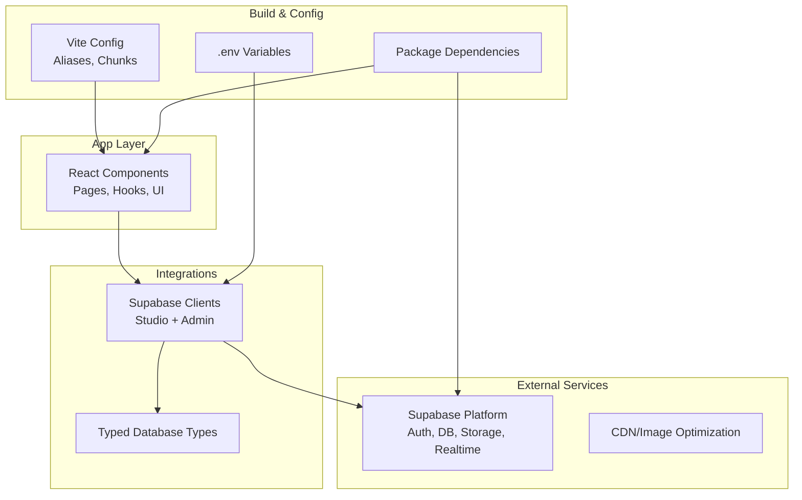
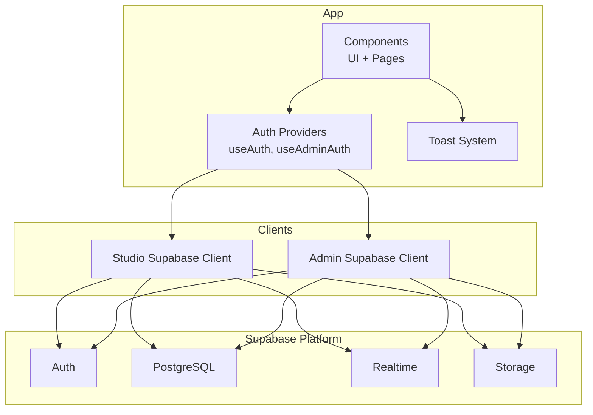
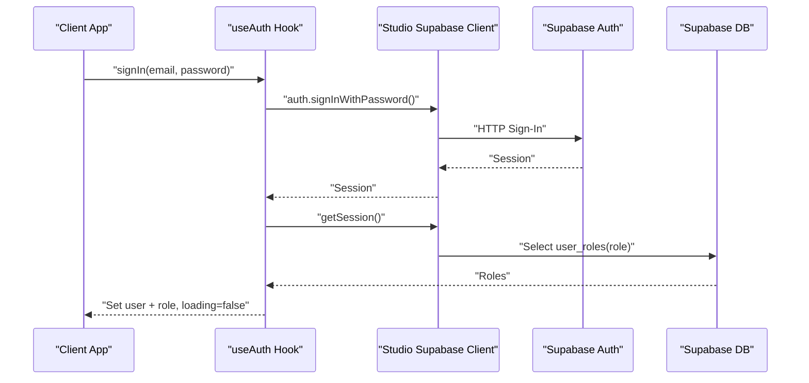
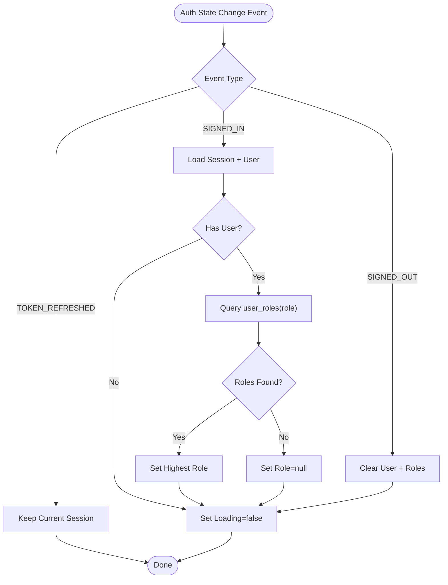
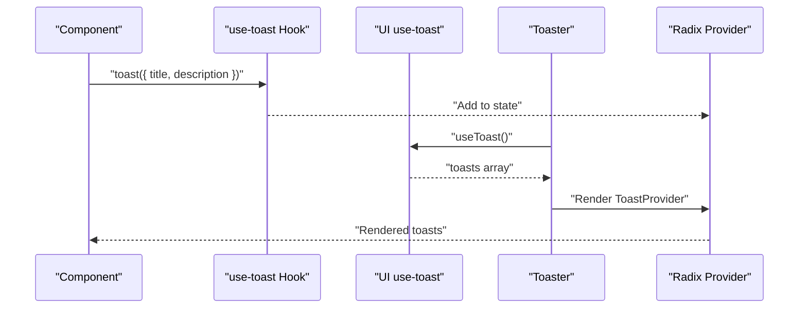
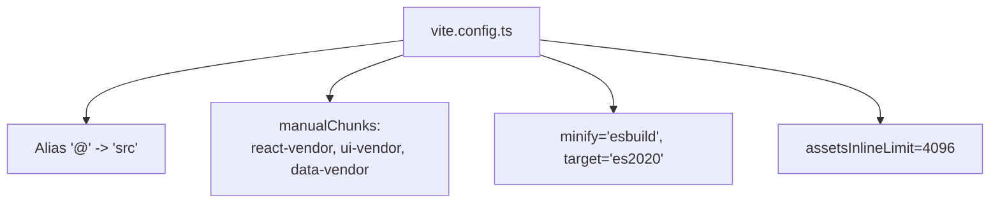
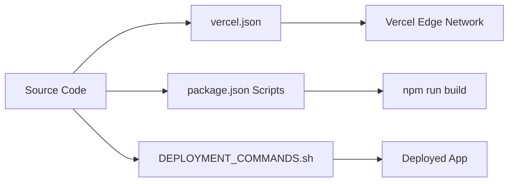
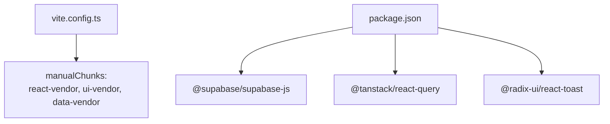

# Integration Patterns

<cite>
**Referenced Files in This Document**
- [client.ts](file://src/integrations/supabase/client.ts)
- [admin-client.ts](file://src/integrations/supabase/admin-client.ts)
- [types.ts](file://src/integrations/supabase/types.ts)
- [useAuth.tsx](file://src/hooks/useAuth.tsx)
- [useAdminAuth.tsx](file://src/hooks/useAdminAuth.tsx)
- [vite.config.ts](file://vite.config.ts)
- [.env](file://.env)
- [package.json](file://package.json)
- [toast.tsx](file://src/components/ui/toast.tsx)
- [toaster.tsx](file://src/components/ui/toaster.tsx)
- [use-toast.ts](file://src/hooks/use-toast.ts)
- [use-toast.ts (UI re-export)](file://src/components/ui/use-toast.ts)
- [utils.ts](file://src/lib/utils.ts)
- [index.html](file://index.html)
- [vercel.json](file://vercel.json)
- [DEPLOYMENT_COMMANDS.sh](file://DEPLOYMENT_COMMANDS.sh)
</cite>

## Table of Contents
1. [Introduction](#introduction)
2. [Project Structure](#project-structure)
3. [Core Components](#core-components)
4. [Architecture Overview](#architecture-overview)
5. [Detailed Component Analysis](#detailed-component-analysis)
6. [Dependency Analysis](#dependency-analysis)
7. [Performance Considerations](#performance-considerations)
8. [Troubleshooting Guide](#troubleshooting-guide)
9. [Conclusion](#conclusion)
10. [Appendices](#appendices)

## Introduction
This document describes the integration patterns used by the application to connect with third-party services and internal systems. It focuses on Supabase integration (authentication, database, storage, and real-time), the toast notification system, build and deployment pipeline integration, environment configuration, and security/cors/gateway considerations. The goal is to provide a practical guide for developers integrating new features or extending existing ones while maintaining consistency and reliability.

## Project Structure
The integration surface spans several areas:
- Supabase clients and typed database definitions
- Authentication providers for studio and admin portals
- UI toast components and centralized hooks
- Build configuration and environment variables
- Deployment configuration and scripts

**Diagram sources**
- [client.ts](file://src/integrations/supabase/client.ts#L1-L17)
- [admin-client.ts](file://src/integrations/supabase/admin-client.ts#L1-L28)
- [types.ts](file://src/integrations/supabase/types.ts#L1-L800)
- [vite.config.ts](file://vite.config.ts#L1-L39)
- [.env](file://.env#L1-L4)
- [package.json](file://package.json#L1-L88)

**Section sources**
- [client.ts](file://src/integrations/supabase/client.ts#L1-L17)
- [admin-client.ts](file://src/integrations/supabase/admin-client.ts#L1-L28)
- [types.ts](file://src/integrations/supabase/types.ts#L1-L800)
- [vite.config.ts](file://vite.config.ts#L1-L39)
- [.env](file://.env#L1-L4)
- [package.json](file://package.json#L1-L88)

## Core Components
- Supabase Studio client with localStorage-backed persistence and token auto-refresh
- Supabase Admin client with isolated storage to prevent session crosstalk
- Typed database definitions for compile-time safety
- Authentication providers for studio and admin with role resolution and cross-tab synchronization
- Toast notification system built on Radix UI with centralized hook and UI wrapper
- Vite configuration with code-splitting and vendor chunking for performance
- Environment variables for Supabase credentials and URLs

**Section sources**
- [client.ts](file://src/integrations/supabase/client.ts#L1-L17)
- [admin-client.ts](file://src/integrations/supabase/admin-client.ts#L1-L28)
- [types.ts](file://src/integrations/supabase/types.ts#L1-L800)
- [useAuth.tsx](file://src/hooks/useAuth.tsx#L1-L252)
- [useAdminAuth.tsx](file://src/hooks/useAdminAuth.tsx#L1-L216)
- [toast.tsx](file://src/components/ui/toast.tsx#L1-L112)
- [toaster.tsx](file://src/components/ui/toaster.tsx#L1-L25)
- [vite.config.ts](file://vite.config.ts#L1-L39)
- [.env](file://.env#L1-L4)

## Architecture Overview
The application integrates with Supabase across three primary domains:
- Authentication: Studio and Admin portals each maintain separate sessions via distinct clients and storage keys
- Database: Typed Postgres tables and enums enable safe queries and updates
- Realtime: Supabase’s real-time subscriptions are used to keep UIs synchronized with backend state
- Storage: Supabase Storage is leveraged for media assets and documents
- Notifications: A toast system provides user feedback for actions and errors

**Diagram sources**
- [client.ts](file://src/integrations/supabase/client.ts#L1-L17)
- [admin-client.ts](file://src/integrations/supabase/admin-client.ts#L1-L28)
- [useAuth.tsx](file://src/hooks/useAuth.tsx#L1-L252)
- [useAdminAuth.tsx](file://src/hooks/useAdminAuth.tsx#L1-L216)
- [toast.tsx](file://src/components/ui/toast.tsx#L1-L112)

## Detailed Component Analysis

### Supabase Integration Architecture
- Studio client: Uses environment variables for URL and publishable key, persists sessions in localStorage, and auto-refreshes tokens
- Admin client: Isolates sessions using a prefixed storage adapter and a dedicated storage key to avoid crosstalk with studio sessions
- Typed database: The types module defines tables, inserts, updates, enums, and relationships for compile-time safety

**Diagram sources**
- [useAuth.tsx](file://src/hooks/useAuth.tsx#L177-L207)
- [client.ts](file://src/integrations/supabase/client.ts#L1-L17)
- [types.ts](file://src/integrations/supabase/types.ts#L1-L800)

**Section sources**
- [client.ts](file://src/integrations/supabase/client.ts#L1-L17)
- [admin-client.ts](file://src/integrations/supabase/admin-client.ts#L1-L28)
- [types.ts](file://src/integrations/supabase/types.ts#L1-L800)
- [useAuth.tsx](file://src/hooks/useAuth.tsx#L1-L252)
- [useAdminAuth.tsx](file://src/hooks/useAdminAuth.tsx#L1-L216)

### Authentication Provider Patterns
- Cross-tab synchronization: Listens to localStorage events to detect explicit sign-outs and update state accordingly
- Role resolution: Queries user roles after auth state changes and sets a priority (superadmin > admin > designer)
- Logging: Inserts auth logs for sign-up, login success/failure, and logout events
- Scope-aware sign-out: Ensures studio sessions are not affected by admin sign-out and vice versa

**Diagram sources**
- [useAuth.tsx](file://src/hooks/useAuth.tsx#L51-L100)
- [useAdminAuth.tsx](file://src/hooks/useAdminAuth.tsx#L50-L99)

**Section sources**
- [useAuth.tsx](file://src/hooks/useAuth.tsx#L1-L252)
- [useAdminAuth.tsx](file://src/hooks/useAdminAuth.tsx#L1-L216)

### Toast Notification System
- Centralized hook: Provides a unified API for enqueueing toasts
- UI components: Provider, viewport, toast, title, description, close, and action components
- Re-export: UI components re-export the hook for convenient imports

**Diagram sources**
- [use-toast.ts](file://src/hooks/use-toast.ts#L1-L200)
- [use-toast.ts (UI re-export)](file://src/components/ui/use-toast.ts#L1-L4)
- [toaster.tsx](file://src/components/ui/toaster.tsx#L1-L25)
- [toast.tsx](file://src/components/ui/toast.tsx#L1-L112)

**Section sources**
- [use-toast.ts](file://src/hooks/use-toast.ts#L1-L200)
- [use-toast.ts (UI re-export)](file://src/components/ui/use-toast.ts#L1-L4)
- [toaster.tsx](file://src/components/ui/toaster.tsx#L1-L25)
- [toast.tsx](file://src/components/ui/toast.tsx#L1-L112)
- [utils.ts](file://src/lib/utils.ts#L1-L7)

### Build System Integration with Vite
- Aliases: Resolves @ to src for clean imports
- Vendor chunking: Separates React, UI, and data libraries into named chunks
- Minification and targets: ES2020 target with esbuild minification
- Asset limits: Inlines small assets to reduce requests

**Diagram sources**
- [vite.config.ts](file://vite.config.ts#L1-L39)

**Section sources**
- [vite.config.ts](file://vite.config.ts#L1-L39)
- [package.json](file://package.json#L1-L88)

### Environment Configuration Management
- Supabase credentials and URLs are loaded from environment variables at runtime
- The studio client reads Vite environment variables for Supabase URL and publishable key

**Section sources**
- [.env](file://.env#L1-L4)
- [client.ts](file://src/integrations/supabase/client.ts#L5-L6)

### Deployment Pipeline Integration
- Vercel configuration: Defines static export and environment variable mappings
- Build scripts: Standard dev/build/preview commands
- Deployment commands script: Provides a reference for CI/CD steps

**Diagram sources**
- [vercel.json](file://vercel.json)
- [package.json](file://package.json#L6-L11)
- [DEPLOYMENT_COMMANDS.sh](file://DEPLOYMENT_COMMANDS.sh)

**Section sources**
- [vercel.json](file://vercel.json)
- [package.json](file://package.json#L6-L11)
- [DEPLOYMENT_COMMANDS.sh](file://DEPLOYMENT_COMMANDS.sh)

## Dependency Analysis
- Supabase client dependencies are grouped under a dedicated vendor chunk to improve caching and load performance
- UI and motion libraries are separated into a dedicated chunk
- React and router libraries share a chunk for common dependencies

**Diagram sources**
- [vite.config.ts](file://vite.config.ts#L20-L27)
- [package.json](file://package.json#L42-L43)
- [package.json](file://package.json#L42-L43)
- [package.json](file://package.json#L38-L39)

**Section sources**
- [vite.config.ts](file://vite.config.ts#L20-L27)
- [package.json](file://package.json#L42-L43)
- [package.json](file://package.json#L38-L39)

## Performance Considerations
- Code splitting and chunking: Named vendor chunks reduce initial payload and improve caching
- Minification: esbuild minification reduces bundle sizes
- Asset inlining: Small assets are inlined to reduce network overhead
- Realtime efficiency: Subscribe to narrow channels and use typed queries to minimize payload

[No sources needed since this section provides general guidance]

## Troubleshooting Guide
- Authentication state not updating across tabs: Verify localStorage change listeners and ensure sign-out uses scoped sign-out
- Role not resolving: Confirm user_roles table exists and contains the expected roles for the authenticated user
- Toasts not rendering: Ensure Toaster is mounted and the use-toast hook is imported from the UI re-export
- Build failures: Check Vite aliases and ensure vendor chunking matches installed dependencies

**Section sources**
- [useAuth.tsx](file://src/hooks/useAuth.tsx#L36-L49)
- [useAdminAuth.tsx](file://src/hooks/useAdminAuth.tsx#L35-L48)
- [toaster.tsx](file://src/components/ui/toaster.tsx#L1-L25)
- [use-toast.ts (UI re-export)](file://src/components/ui/use-toast.ts#L1-L4)

## Conclusion
The application employs a robust integration pattern with Supabase, separating studio and admin sessions, leveraging typed database definitions, and providing a cohesive toast system. The build and deployment configurations emphasize performance and developer experience. By following the patterns documented here, teams can extend integrations safely and consistently.

[No sources needed since this section summarizes without analyzing specific files]

## Appendices

### Security Integration Patterns
- CORS and API Gateway: Configure Supabase project-level policies and RLS; ensure frontend requests originate from trusted origins
- Token handling: Auto-refresh enabled; enforce secure cookie policies and HTTPS in production
- Role-based access: Use user_roles to gate features and restrict access to admin-only routes

[No sources needed since this section provides general guidance]

### Error Handling, Retry, and Fallback Strategies
- Authentication: On auth state changes, ignore transient refresh events and only act on explicit sign-in/sign-out
- Database: Wrap queries in try/catch blocks; log meaningful metadata for failed attempts
- Realtime: Reconnect on connection loss; subscribe to specific channels and handle unsubscribe gracefully
- Storage: Implement retry with exponential backoff for uploads; provide fallback images for missing assets

[No sources needed since this section provides general guidance]