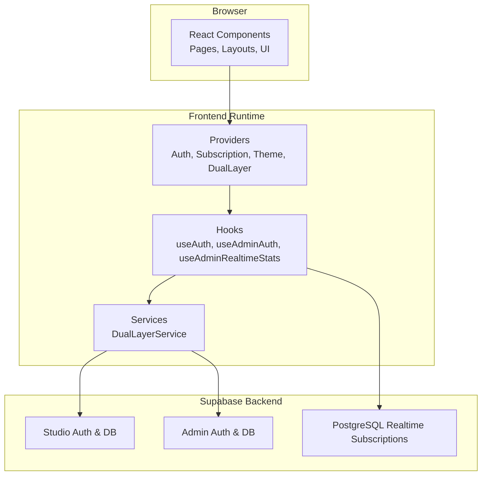
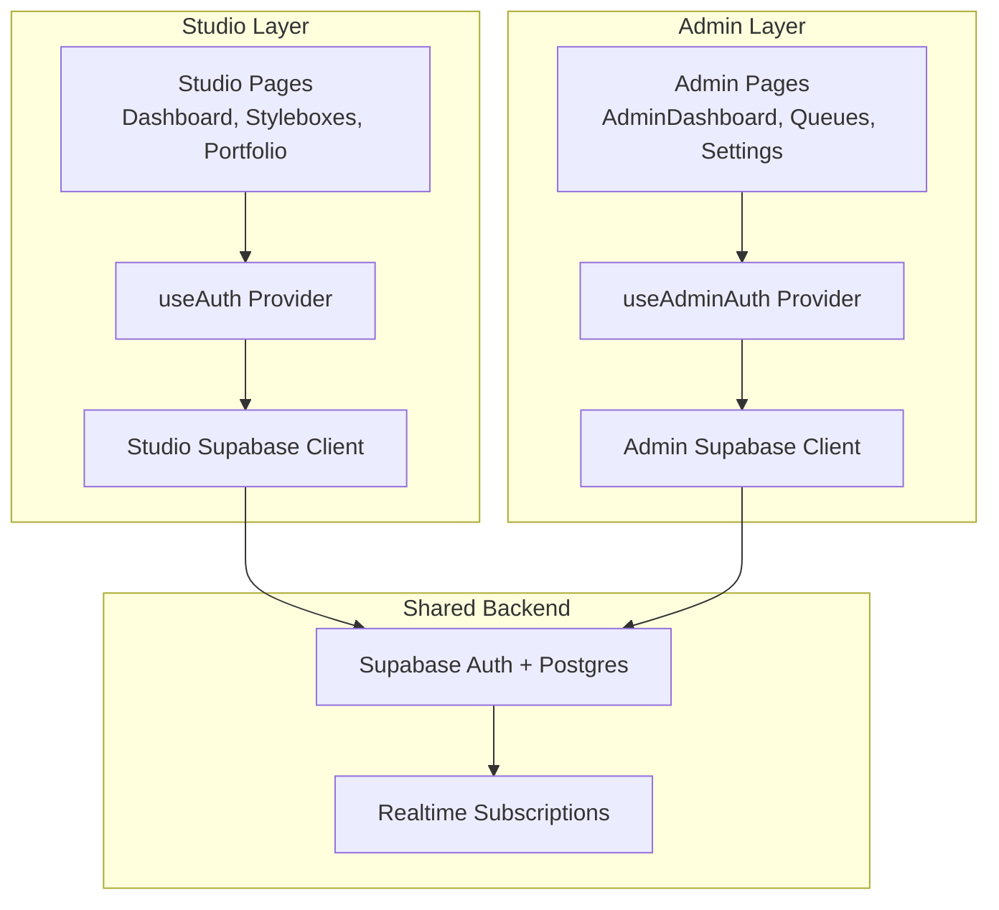
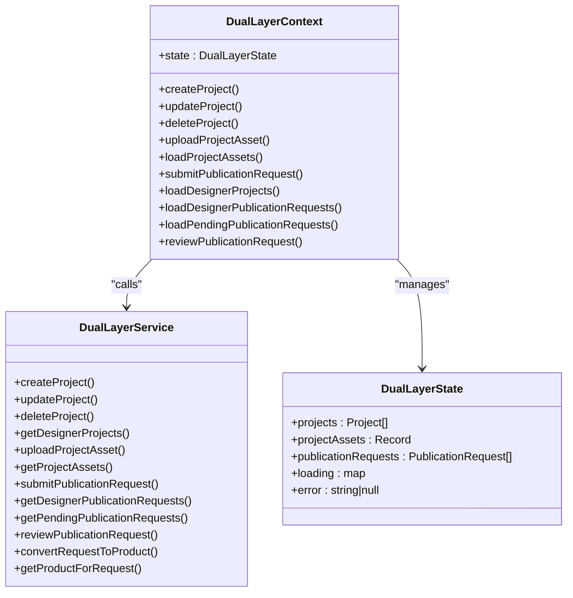
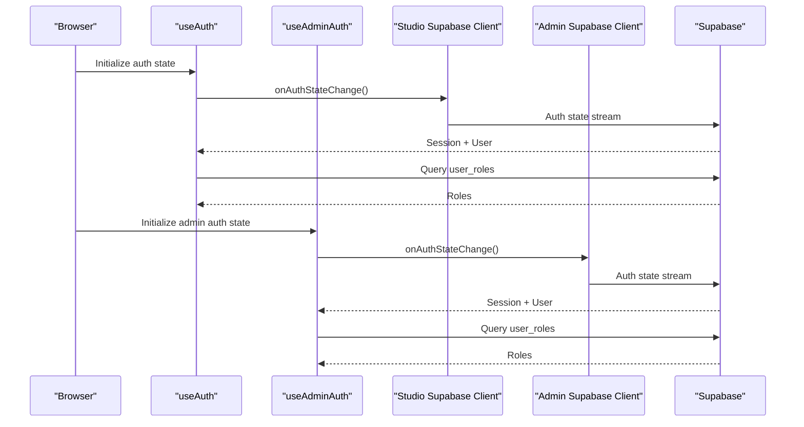
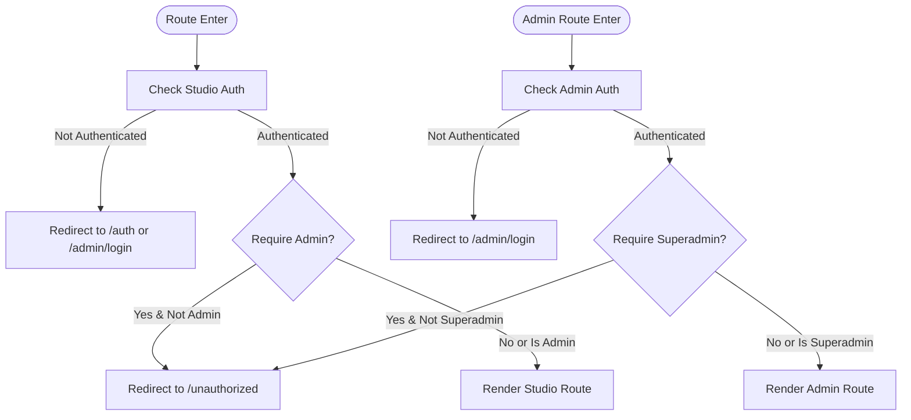
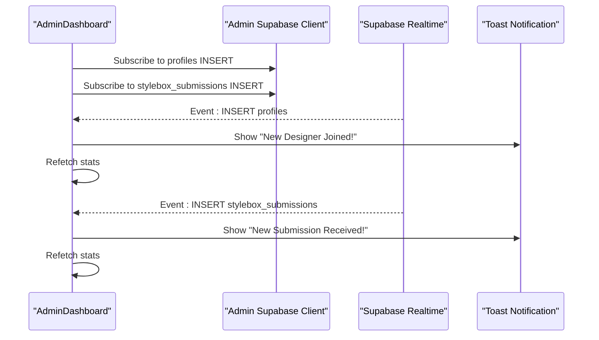
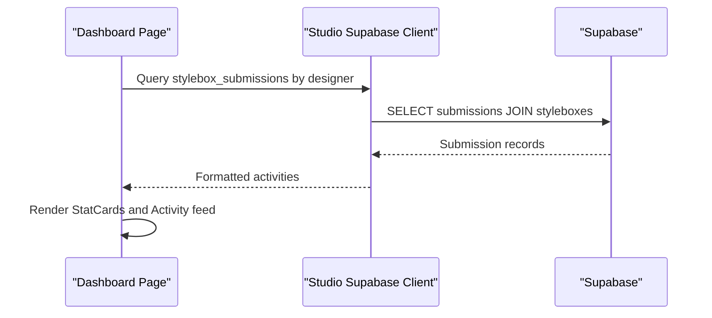
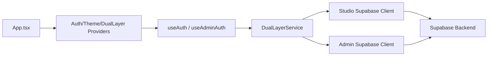
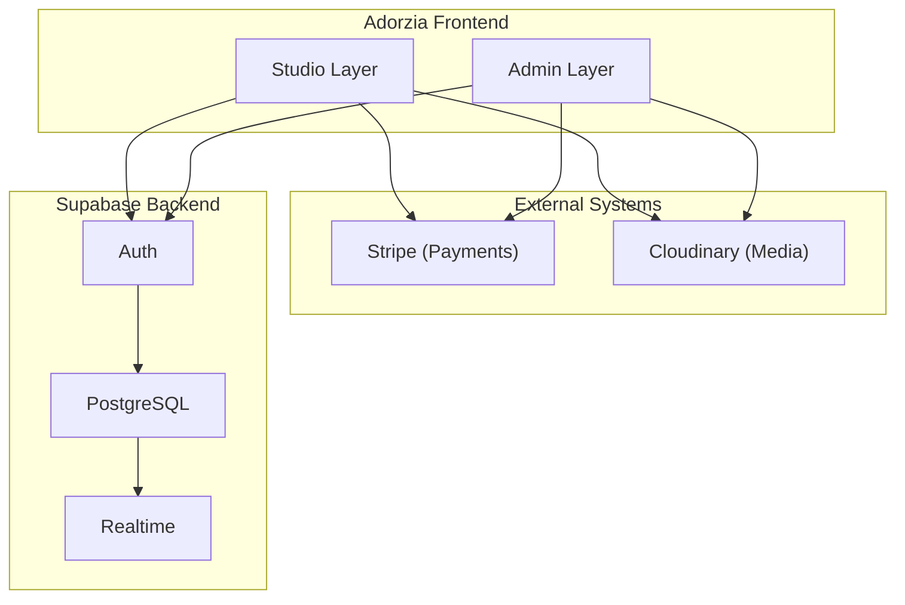

# Architecture Overview

<cite>
**Referenced Files in This Document**
- [App.tsx](file://src/App.tsx)
- [main.tsx](file://src/main.tsx)
- [DualLayerContext.tsx](file://src/contexts/DualLayerContext.tsx)
- [client.ts](file://src/integrations/supabase/client.ts)
- [admin-client.ts](file://src/integrations/supabase/admin-client.ts)
- [useAuth.tsx](file://src/hooks/useAuth.tsx)
- [useAdminAuth.tsx](file://src/hooks/useAdminAuth.tsx)
- [dual-layer-service.ts](file://src/lib/dual-layer-service.ts)
- [dual-layer-types.ts](file://src/lib/dual-layer-types.ts)
- [Dashboard.tsx](file://src/pages/Dashboard.tsx)
- [AdminDashboard.tsx](file://src/pages/admin/AdminDashboard.tsx)
- [ProtectedRoute.tsx](file://src/components/auth/ProtectedRoute.tsx)
- [AdminProtectedRoute.tsx](file://src/components/auth/AdminProtectedRoute.tsx)
- [package.json](file://package.json)
</cite>

## Table of Contents
1. [Introduction](#introduction)
2. [Project Structure](#project-structure)
3. [Core Components](#core-components)
4. [Architecture Overview](#architecture-overview)
5. [Detailed Component Analysis](#detailed-component-analysis)
6. [Dependency Analysis](#dependency-analysis)
7. [Performance Considerations](#performance-considerations)
8. [Troubleshooting Guide](#troubleshooting-guide)
9. [Conclusion](#conclusion)
10. [Appendices](#appendices)

## Introduction
This document describes the Adorzia platform’s dual-layer system: a React frontend integrated with a Supabase backend. The architecture separates designer workspace (studio) and admin panels with distinct authentication and authorization layers. It documents provider and hook patterns, system boundaries, component interactions, data flows through the Supabase client, real-time updates, and integration patterns with external services. It also outlines infrastructure requirements, scalability considerations, and deployment topology.

## Project Structure
The frontend is a Vite+React application with TypeScript, organized by feature and layer:
- Pages: public, studio (designer workspace), and admin routes
- Hooks: authentication providers and domain-specific data providers
- Contexts: shared state for the dual-layer operating model
- Integrations: Supabase clients for studio and admin
- Lib: service layer and shared types for the dual-layer model
- Components: reusable UI and route guards

**Diagram sources**
- [App.tsx](file://src/App.tsx#L108-L152)
- [useAuth.tsx](file://src/hooks/useAuth.tsx#L22-L271)
- [useAdminAuth.tsx](file://src/hooks/useAdminAuth.tsx#L21-L240)
- [dual-layer-service.ts](file://src/lib/dual-layer-service.ts#L4-L340)
- [client.ts](file://src/integrations/supabase/client.ts#L1-L17)
- [admin-client.ts](file://src/integrations/supabase/admin-client.ts#L1-L28)

**Section sources**
- [App.tsx](file://src/App.tsx#L1-L422)
- [main.tsx](file://src/main.tsx#L1-L46)
- [package.json](file://package.json#L1-L92)

## Core Components
- DualLayerContext and DualLayerService: central orchestrator for designer projects, assets, and publication requests, encapsulating CRUD operations and state transitions.
- Supabase clients: separate studio and admin clients with isolated storage to enforce dual authentication layers.
- Authentication providers: useAuth and useAdminAuth manage session lifecycles, role resolution, and cross-tab synchronization.
- Route guards: ProtectedRoute and AdminProtectedRoute enforce access control per layer.
- Pages: Dashboard and AdminDashboard demonstrate layered UI composition and real-time integration.

**Section sources**
- [DualLayerContext.tsx](file://src/contexts/DualLayerContext.tsx#L1-L303)
- [dual-layer-service.ts](file://src/lib/dual-layer-service.ts#L4-L340)
- [client.ts](file://src/integrations/supabase/client.ts#L1-L17)
- [admin-client.ts](file://src/integrations/supabase/admin-client.ts#L1-L28)
- [useAuth.tsx](file://src/hooks/useAuth.tsx#L22-L280)
- [useAdminAuth.tsx](file://src/hooks/useAdminAuth.tsx#L21-L249)
- [ProtectedRoute.tsx](file://src/components/auth/ProtectedRoute.tsx#L11-L41)
- [AdminProtectedRoute.tsx](file://src/components/auth/AdminProtectedRoute.tsx#L11-L51)

## Architecture Overview
The system enforces a strict separation between studio and admin contexts:
- Studio layer: designer workspace with user-centric flows, protected by studio auth.
- Admin layer: operational dashboards and moderation with admin/authenticated roles, protected by admin auth.
- Shared backend: Supabase provides authentication, database, and real-time subscriptions.

**Diagram sources**
- [App.tsx](file://src/App.tsx#L108-L152)
- [useAuth.tsx](file://src/hooks/useAuth.tsx#L22-L271)
- [useAdminAuth.tsx](file://src/hooks/useAdminAuth.tsx#L21-L240)
- [client.ts](file://src/integrations/supabase/client.ts#L1-L17)
- [admin-client.ts](file://src/integrations/supabase/admin-client.ts#L1-L28)

## Detailed Component Analysis

### Dual-Layer Operating Model
The dual-layer model centers on a context-driven reducer managing projects, assets, and publication requests, with a service layer encapsulating Supabase operations.

**Diagram sources**
- [DualLayerContext.tsx](file://src/contexts/DualLayerContext.tsx#L120-L295)
- [dual-layer-service.ts](file://src/lib/dual-layer-service.ts#L4-L340)
- [dual-layer-types.ts](file://src/lib/dual-layer-types.ts#L3-L44)

**Section sources**
- [DualLayerContext.tsx](file://src/contexts/DualLayerContext.tsx#L1-L303)
- [dual-layer-service.ts](file://src/lib/dual-layer-service.ts#L4-L340)
- [dual-layer-types.ts](file://src/lib/dual-layer-types.ts#L1-L44)

### Authentication and Authorization Layers
Dual authentication layers are enforced via separate Supabase clients and providers:
- Studio auth: user roles resolved from a user_roles table; supports designer and admin roles.
- Admin auth: isolated storage and role checks against admin roles; supports admin, lead_curator, and superadmin.

**Diagram sources**
- [useAuth.tsx](file://src/hooks/useAuth.tsx#L94-L152)
- [useAdminAuth.tsx](file://src/hooks/useAdminAuth.tsx#L106-L167)
- [client.ts](file://src/integrations/supabase/client.ts#L11-L17)
- [admin-client.ts](file://src/integrations/supabase/admin-client.ts#L16-L27)

**Section sources**
- [useAuth.tsx](file://src/hooks/useAuth.tsx#L22-L280)
- [useAdminAuth.tsx](file://src/hooks/useAdminAuth.tsx#L21-L249)
- [client.ts](file://src/integrations/supabase/client.ts#L1-L17)
- [admin-client.ts](file://src/integrations/supabase/admin-client.ts#L1-L28)

### Route Protection and Access Control
Route guards enforce access control per layer:
- ProtectedRoute: requires studio auth; optionally requires admin role for sensitive routes.
- AdminProtectedRoute: requires admin or superadmin depending on flags.

**Diagram sources**
- [ProtectedRoute.tsx](file://src/components/auth/ProtectedRoute.tsx#L11-L41)
- [AdminProtectedRoute.tsx](file://src/components/auth/AdminProtectedRoute.tsx#L11-L51)

**Section sources**
- [ProtectedRoute.tsx](file://src/components/auth/ProtectedRoute.tsx#L1-L42)
- [AdminProtectedRoute.tsx](file://src/components/auth/AdminProtectedRoute.tsx#L1-L52)

### Real-Time Updates in Admin Dashboard
AdminDashboard demonstrates real-time updates using Supabase PostgreSQL Realtime subscriptions to notify on new designers and stylebox submissions.

**Diagram sources**
- [AdminDashboard.tsx](file://src/pages/admin/AdminDashboard.tsx#L307-L353)

**Section sources**
- [AdminDashboard.tsx](file://src/pages/admin/AdminDashboard.tsx#L304-L353)

### Data Flows Through Supabase Client
Studio Dashboard illustrates direct Supabase queries for recent activities and profile-driven UI composition.

**Diagram sources**
- [Dashboard.tsx](file://src/pages/Dashboard.tsx#L65-L93)

**Section sources**
- [Dashboard.tsx](file://src/pages/Dashboard.tsx#L29-L93)

## Dependency Analysis
The frontend depends on React, React Router, TanStack Query, and Supabase JS. Providers and hooks encapsulate cross-cutting concerns, while the dual-layer service mediates database operations.

**Diagram sources**
- [App.tsx](file://src/App.tsx#L108-L152)
- [useAuth.tsx](file://src/hooks/useAuth.tsx#L22-L271)
- [useAdminAuth.tsx](file://src/hooks/useAdminAuth.tsx#L21-L240)
- [dual-layer-service.ts](file://src/lib/dual-layer-service.ts#L4-L340)
- [client.ts](file://src/integrations/supabase/client.ts#L1-L17)
- [admin-client.ts](file://src/integrations/supabase/admin-client.ts#L1-L28)

**Section sources**
- [package.json](file://package.json#L15-L90)
- [App.tsx](file://src/App.tsx#L1-L422)

## Performance Considerations
- API deduplication: request monitoring is initialized at startup to detect infinite loops and reduce redundant network calls.
- TanStack Query: caching and background refetching improve perceived performance for dashboard metrics and lists.
- Real-time subscriptions: selective subscriptions minimize bandwidth and render overhead.
- Lazy loading and skeletons: pages progressively enhance content to maintain responsiveness.

**Section sources**
- [App.tsx](file://src/App.tsx#L155-L164)
- [Dashboard.tsx](file://src/pages/Dashboard.tsx#L188-L230)
- [AdminDashboard.tsx](file://src/pages/admin/AdminDashboard.tsx#L379-L390)

## Troubleshooting Guide
- Authentication state flicker: TOKEN_REFRESHED events are ignored to avoid UI flicker; role checks are debounced to prevent rapid repeated calls.
- Cross-tab synchronization: explicit sign-out events are handled to keep sessions synchronized across tabs.
- Admin access invalidation: invalid admin access attempts trigger forced sign-out from admin scope to prevent session hijacking.
- Global error handling: production error handlers log unhandled errors and promise rejections; fallback UI renders on critical initialization failures.

**Section sources**
- [useAuth.tsx](file://src/hooks/useAuth.tsx#L94-L152)
- [useAdminAuth.tsx](file://src/hooks/useAdminAuth.tsx#L89-L104)
- [useAdminAuth.tsx](file://src/hooks/useAdminAuth.tsx#L79-L87)
- [main.tsx](file://src/main.tsx#L5-L45)

## Conclusion
Adorzia’s dual-layer architecture cleanly separates studio and admin concerns through dedicated providers, hooks, and Supabase clients. The provider/hook pattern centralizes cross-cutting concerns, while the dual-layer context and service layer encapsulate designer workspace operations. Real-time subscriptions and robust route guards ensure secure, responsive experiences across both contexts.

## Appendices

### System Context Diagram

[No sources needed since this diagram shows conceptual relationships, not specific code structure]

### Deployment Topology and Infrastructure Requirements
- Hosting: Vite+React static build served via CDN or edge platform.
- Backend: Supabase managed services (Auth, Database, Storage, Edge Functions).
- Environment: Separate Vite dev servers for studio and admin; production builds for each layer.
- Scalability: Supabase autoscaling; TanStack Query caching; real-time channels for low-latency updates.

**Section sources**
- [package.json](file://package.json#L6-L13)
- [client.ts](file://src/integrations/supabase/client.ts#L5-L6)
- [admin-client.ts](file://src/integrations/supabase/admin-client.ts#L4-L5)