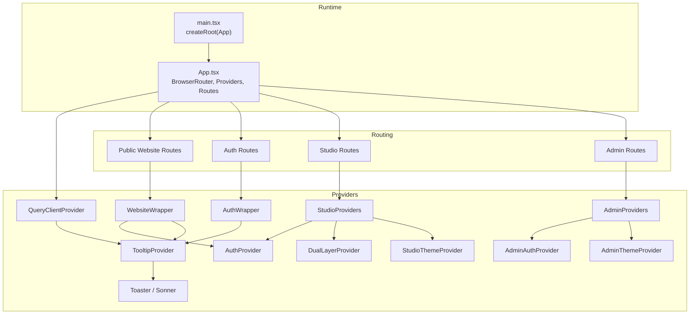
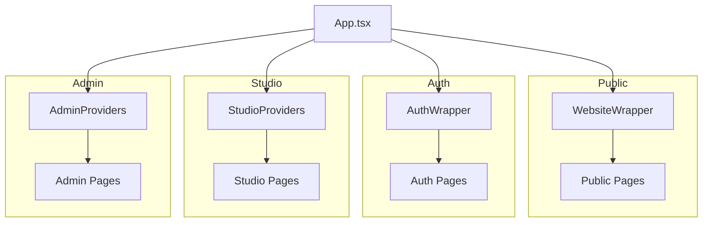
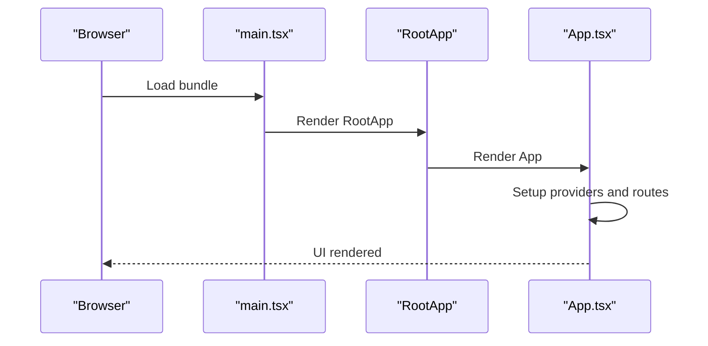
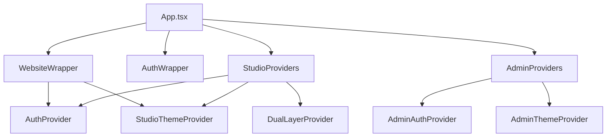
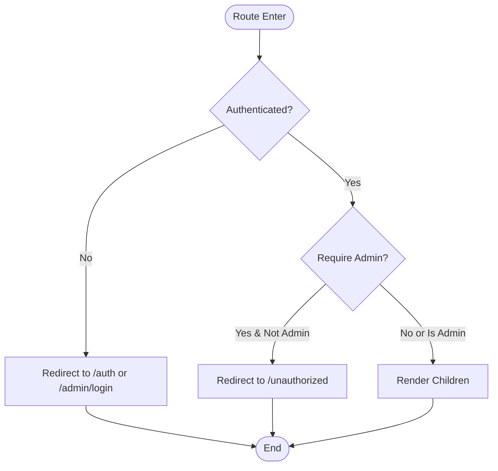
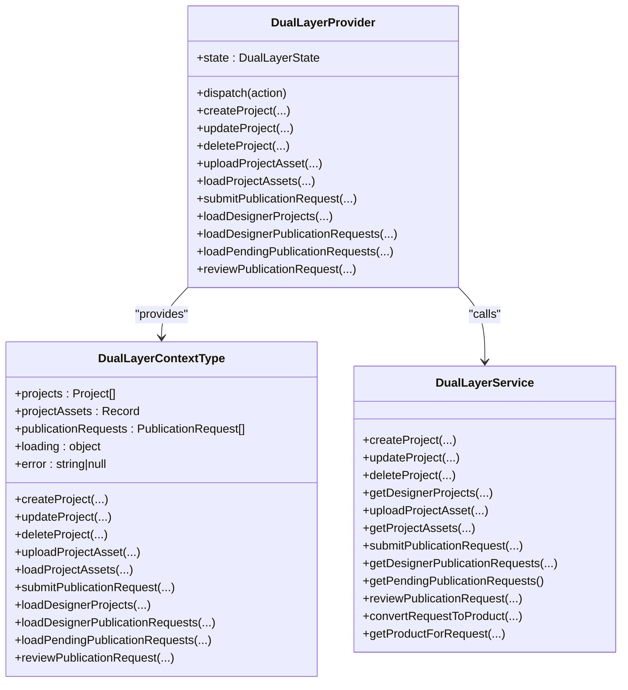
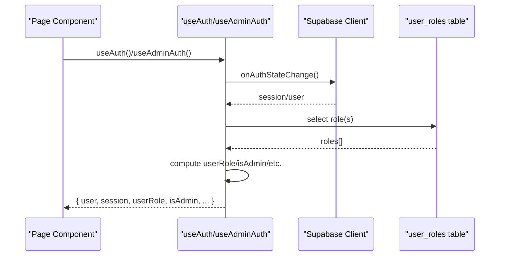
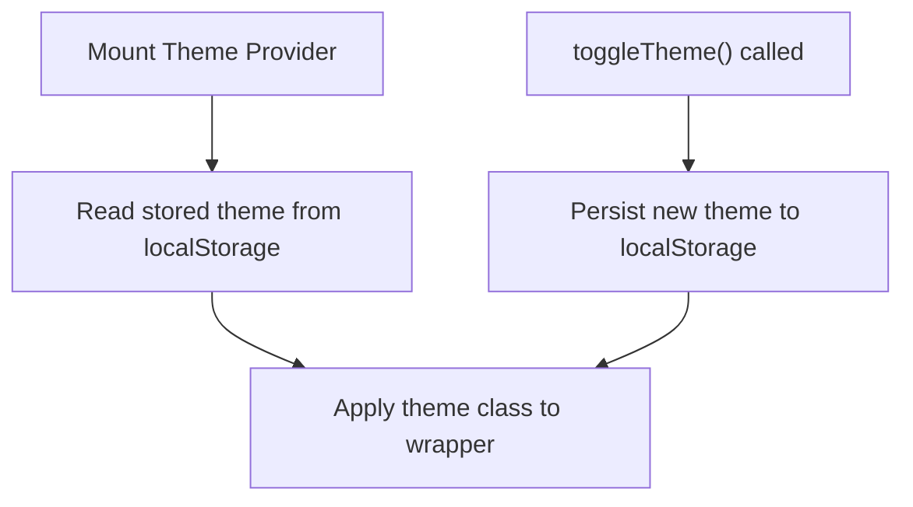
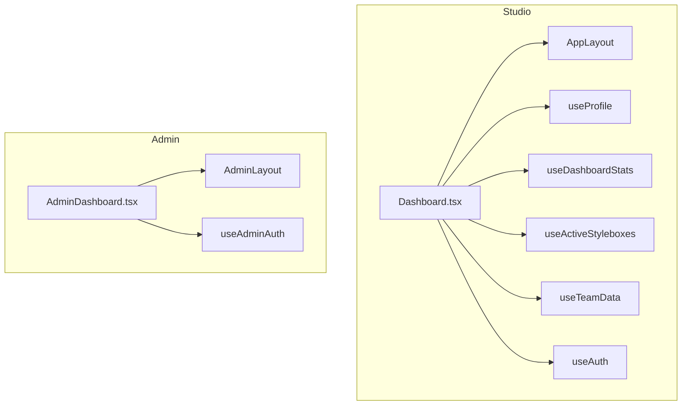
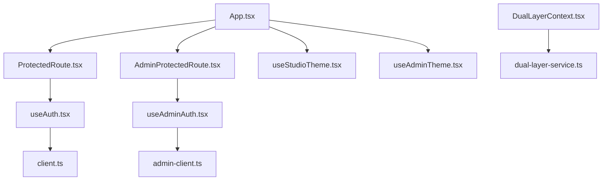

# Component Architecture

<cite>
**Referenced Files in This Document**
- [App.tsx](file://src/App.tsx)
- [main.tsx](file://src/main.tsx)
- [DualLayerContext.tsx](file://src/contexts/DualLayerContext.tsx)
- [useAuth.tsx](file://src/hooks/useAuth.tsx)
- [useAdminAuth.tsx](file://src/hooks/useAdminAuth.tsx)
- [ProtectedRoute.tsx](file://src/components/auth/ProtectedRoute.tsx)
- [AdminProtectedRoute.tsx](file://src/components/auth/AdminProtectedRoute.tsx)
- [useStudioTheme.tsx](file://src/hooks/useStudioTheme.tsx)
- [useAdminTheme.tsx](file://src/hooks/useAdminTheme.tsx)
- [Dashboard.tsx](file://src/pages/Dashboard.tsx)
- [AdminDashboard.tsx](file://src/pages/admin/AdminDashboard.tsx)
- [client.ts](file://src/integrations/supabase/client.ts)
- [admin-client.ts](file://src/integrations/supabase/admin-client.ts)
- [dual-layer-service.ts](file://src/lib/dual-layer-service.ts)
</cite>

## Table of Contents
1. [Introduction](#introduction)
2. [Project Structure](#project-structure)
3. [Core Components](#core-components)
4. [Architecture Overview](#architecture-overview)
5. [Detailed Component Analysis](#detailed-component-analysis)
6. [Dependency Analysis](#dependency-analysis)
7. [Performance Considerations](#performance-considerations)
8. [Troubleshooting Guide](#troubleshooting-guide)
9. [Conclusion](#conclusion)

## Introduction
This document explains the component architecture of the Adorzia platform, focusing on the hierarchical structure starting from the root App component and its provider wrappers. It documents the composition pattern for StudioProviders, AdminProviders, WebsiteWrapper, and AuthWrapper; role-based rendering with ProtectedRoute and AdminProtectedRoute; context-based architecture using DualLayerContext, Auth contexts, and theme providers; lifecycle management; and how context providers prevent prop drilling. It also outlines the modular design supporting both the designer workspace and the admin panel, and the relationships among pages, components, and hooks.

## Project Structure
The application bootstraps via a root component that renders the main App, which orchestrates routing and provider composition. Providers wrap routes to supply authentication, themes, subscriptions, and dual-layer state to the relevant sections of the app.

**Diagram sources**
- [main.tsx](file://src/main.tsx#L17-L29)
- [App.tsx](file://src/App.tsx#L168-L430)
- [useAuth.tsx](file://src/hooks/useAuth.tsx#L34-L314)
- [useAdminAuth.tsx](file://src/hooks/useAdminAuth.tsx#L21-L240)
- [useStudioTheme.tsx](file://src/hooks/useStudioTheme.tsx#L15-L42)
- [useAdminTheme.tsx](file://src/hooks/useAdminTheme.tsx#L15-L42)
- [DualLayerContext.tsx](file://src/contexts/DualLayerContext.tsx#L135-L295)

**Section sources**
- [main.tsx](file://src/main.tsx#L17-L29)
- [App.tsx](file://src/App.tsx#L168-L430)

## Core Components
- Root and App: Initialize providers and define routes for public, auth, studio, and admin sections.
- Provider Wrappers:
  - WebsiteWrapper: Supplies AuthProvider and ThemeProvider for public website routes.
  - AuthWrapper: Supplies ThemeProvider for auth routes.
  - StudioProviders: Supplies AuthProvider, SubscriptionProvider, StudioThemeProvider, and DualLayerProvider for studio routes.
  - AdminProviders: Supplies AdminAuthProvider and AdminThemeProvider for admin routes.
- Route Protection:
  - ProtectedRoute: Guards studio routes and optionally requires admin role.
  - AdminProtectedRoute: Guards admin routes and optionally requires superadmin.
- Contexts:
  - DualLayerContext: Centralized state for projects, assets, and publication requests with reducer-driven updates.
  - Auth contexts: useAuth and useAdminAuth encapsulate Supabase auth state and role checks.
- Themes:
  - useStudioTheme and useAdminTheme manage per-app theme persistence and toggling.

**Section sources**
- [App.tsx](file://src/App.tsx#L110-L154)
- [ProtectedRoute.tsx](file://src/components/auth/ProtectedRoute.tsx#L11-L41)
- [AdminProtectedRoute.tsx](file://src/components/auth/AdminProtectedRoute.tsx#L11-L51)
- [DualLayerContext.tsx](file://src/contexts/DualLayerContext.tsx#L135-L295)
- [useAuth.tsx](file://src/hooks/useAuth.tsx#L34-L314)
- [useAdminAuth.tsx](file://src/hooks/useAdminAuth.tsx#L21-L240)
- [useStudioTheme.tsx](file://src/hooks/useStudioTheme.tsx#L15-L42)
- [useAdminTheme.tsx](file://src/hooks/useAdminTheme.tsx#L15-L42)

## Architecture Overview
The architecture enforces separation of concerns across three domains:
- Public website: Unauthenticated browsing, shopping, and marketing pages.
- Studio (designer workspace): Authenticated designer features guarded by ProtectedRoute.
- Admin: Authenticated administrative features guarded by AdminProtectedRoute.

Providers are scoped to minimize prop drilling and centralize cross-cutting concerns like authentication, theming, and dual-layer state.

**Diagram sources**
- [App.tsx](file://src/App.tsx#L178-L425)

## Detailed Component Analysis

### Root and Application Lifecycle
- main.tsx creates the root and renders App, with robust error handling fallback.
- App initializes global providers (React Query, tooltips, toasts), sets up routing, and mounts provider wrappers around route groups.

**Diagram sources**
- [main.tsx](file://src/main.tsx#L17-L29)
- [App.tsx](file://src/App.tsx#L168-L175)

**Section sources**
- [main.tsx](file://src/main.tsx#L17-L29)
- [App.tsx](file://src/App.tsx#L157-L166)

### Provider Composition Pattern
- WebsiteWrapper: Wraps public routes and supplies AuthProvider and ThemeProvider for website-wide theme control.
- AuthWrapper: Wraps auth routes and supplies ThemeProvider for auth UI.
- StudioProviders: Wraps studio routes and supplies:
  - AuthProvider (user/session/roles)
  - SubscriptionProvider (subscription state)
  - StudioThemeProvider (designer workspace theme)
  - DualLayerProvider (projects/assets/publication requests)
- AdminProviders: Wraps admin routes and supplies:
  - AdminAuthProvider (admin session/roles)
  - AdminThemeProvider (admin theme)

**Diagram sources**
- [App.tsx](file://src/App.tsx#L110-L154)
- [useAuth.tsx](file://src/hooks/useAuth.tsx#L34-L314)
- [useAdminAuth.tsx](file://src/hooks/useAdminAuth.tsx#L21-L240)
- [useStudioTheme.tsx](file://src/hooks/useStudioTheme.tsx#L15-L42)
- [useAdminTheme.tsx](file://src/hooks/useAdminTheme.tsx#L15-L42)
- [DualLayerContext.tsx](file://src/contexts/DualLayerContext.tsx#L135-L295)

**Section sources**
- [App.tsx](file://src/App.tsx#L110-L154)

### Role-Based Rendering with ProtectedRoute and AdminProtectedRoute
- ProtectedRoute:
  - Blocks unauthenticated access to studio routes.
  - Optionally requires admin role for specific routes.
  - Redirects to appropriate login or unauthorized page.
- AdminProtectedRoute:
  - Blocks unauthenticated access to admin routes.
  - Optionally requires superadmin role.
  - Redirects to admin login or unauthorized page.

**Diagram sources**
- [ProtectedRoute.tsx](file://src/components/auth/ProtectedRoute.tsx#L11-L41)
- [AdminProtectedRoute.tsx](file://src/components/auth/AdminProtectedRoute.tsx#L11-L51)

**Section sources**
- [ProtectedRoute.tsx](file://src/components/auth/ProtectedRoute.tsx#L11-L41)
- [AdminProtectedRoute.tsx](file://src/components/auth/AdminProtectedRoute.tsx#L11-L51)

### Context-Based Architecture: DualLayerContext
- Purpose: Centralized state for projects, project assets, and publication requests.
- State shape: Projects, projectAssets map, publicationRequests, loading/error flags.
- Reducer actions: CRUD and loading/error updates.
- Service integration: DualLayerService methods invoked from context to keep state synchronized with backend.

**Diagram sources**
- [DualLayerContext.tsx](file://src/contexts/DualLayerContext.tsx#L5-L131)
- [DualLayerContext.tsx](file://src/contexts/DualLayerContext.tsx#L135-L295)
- [dual-layer-service.ts](file://src/lib/dual-layer-service.ts#L4-L340)

**Section sources**
- [DualLayerContext.tsx](file://src/contexts/DualLayerContext.tsx#L135-L295)
- [dual-layer-service.ts](file://src/lib/dual-layer-service.ts#L4-L340)

### Authentication Contexts and Supabase Clients
- useAuth:
  - Manages user, session, roles, and customer profile.
  - Role resolution prioritizes superadmin > admin > designer > customer.
  - Integrates with supabase client for auth state and logs.
- useAdminAuth:
  - Manages admin user, session, and roles with isolated storage.
  - Enforces admin-only access and optional superadmin requirement.
  - Uses separate admin client with custom storage keys.
- Supabase clients:
  - Website client: standard Supabase client with local storage.
  - Admin client: isolated storage adapter to prevent session crossover.

**Diagram sources**
- [useAuth.tsx](file://src/hooks/useAuth.tsx#L34-L314)
- [useAdminAuth.tsx](file://src/hooks/useAdminAuth.tsx#L21-L240)
- [client.ts](file://src/integrations/supabase/client.ts#L11-L17)
- [admin-client.ts](file://src/integrations/supabase/admin-client.ts#L16-L27)

**Section sources**
- [useAuth.tsx](file://src/hooks/useAuth.tsx#L34-L314)
- [useAdminAuth.tsx](file://src/hooks/useAdminAuth.tsx#L21-L240)
- [client.ts](file://src/integrations/supabase/client.ts#L11-L17)
- [admin-client.ts](file://src/integrations/supabase/admin-client.ts#L16-L27)

### Theme Providers and Per-App Theming
- useStudioTheme: Persists designer workspace theme preference in localStorage and toggles between light/dark.
- useAdminTheme: Persists admin panel theme preference separately and toggles between light/dark.
- Both providers apply theme classes to a wrapping div to scope styles.

**Diagram sources**
- [useStudioTheme.tsx](file://src/hooks/useStudioTheme.tsx#L15-L42)
- [useAdminTheme.tsx](file://src/hooks/useAdminTheme.tsx#L15-L42)

**Section sources**
- [useStudioTheme.tsx](file://src/hooks/useStudioTheme.tsx#L15-L42)
- [useAdminTheme.tsx](file://src/hooks/useAdminTheme.tsx#L15-L42)

### Relationship Between Pages, Components, and Hooks
- Studio Dashboard:
  - Uses AppLayout and multiple dashboard components.
  - Consumes useProfile, useDashboardStats, useActiveStyleboxes, useTeamData, and useAuth.
- Admin Dashboard:
  - Uses AdminLayout and admin-specific widgets.
  - Consumes useAdminAuth and performs admin-side data queries via supabaseAdmin.

**Diagram sources**
- [Dashboard.tsx](file://src/pages/Dashboard.tsx#L29-L440)
- [AdminDashboard.tsx](file://src/pages/admin/AdminDashboard.tsx#L33-L608)

**Section sources**
- [Dashboard.tsx](file://src/pages/Dashboard.tsx#L29-L440)
- [AdminDashboard.tsx](file://src/pages/admin/AdminDashboard.tsx#L33-L608)

## Dependency Analysis
- Routing depends on provider wrappers to inject context and theme providers.
- ProtectedRoute and AdminProtectedRoute depend on useAuth and useAdminAuth respectively.
- DualLayerContext depends on DualLayerService and Supabase for state synchronization.
- Theme providers depend on localStorage for persistence.
- Supabase clients are isolated to avoid session crossovers.

**Diagram sources**
- [App.tsx](file://src/App.tsx#L110-L154)
- [ProtectedRoute.tsx](file://src/components/auth/ProtectedRoute.tsx#L11-L41)
- [AdminProtectedRoute.tsx](file://src/components/auth/AdminProtectedRoute.tsx#L11-L51)
- [useAuth.tsx](file://src/hooks/useAuth.tsx#L34-L314)
- [useAdminAuth.tsx](file://src/hooks/useAdminAuth.tsx#L21-L240)
- [DualLayerContext.tsx](file://src/contexts/DualLayerContext.tsx#L135-L295)
- [dual-layer-service.ts](file://src/lib/dual-layer-service.ts#L4-L340)
- [useStudioTheme.tsx](file://src/hooks/useStudioTheme.tsx#L15-L42)
- [useAdminTheme.tsx](file://src/hooks/useAdminTheme.tsx#L15-L42)
- [client.ts](file://src/integrations/supabase/client.ts#L11-L17)
- [admin-client.ts](file://src/integrations/supabase/admin-client.ts#L16-L27)

**Section sources**
- [App.tsx](file://src/App.tsx#L110-L154)
- [ProtectedRoute.tsx](file://src/components/auth/ProtectedRoute.tsx#L11-L41)
- [AdminProtectedRoute.tsx](file://src/components/auth/AdminProtectedRoute.tsx#L11-L51)
- [useAuth.tsx](file://src/hooks/useAuth.tsx#L34-L314)
- [useAdminAuth.tsx](file://src/hooks/useAdminAuth.tsx#L21-L240)
- [DualLayerContext.tsx](file://src/contexts/DualLayerContext.tsx#L135-L295)
- [dual-layer-service.ts](file://src/lib/dual-layer-service.ts#L4-L340)
- [useStudioTheme.tsx](file://src/hooks/useStudioTheme.tsx#L15-L42)
- [useAdminTheme.tsx](file://src/hooks/useAdminTheme.tsx#L15-L42)
- [client.ts](file://src/integrations/supabase/client.ts#L11-L17)
- [admin-client.ts](file://src/integrations/supabase/admin-client.ts#L16-L27)

## Performance Considerations
- Provider scoping minimizes re-renders by limiting provider scope to relevant route groups.
- useAuth and useAdminAuth debounce role checks to reduce redundant network calls.
- DualLayerContext uses reducer-driven updates to batch state changes and avoid excessive re-renders.
- QueryClientProvider enables caching and background refetching for data-heavy pages.
- Theme providers persist preferences to localStorage to avoid theme flicker on mount.

## Troubleshooting Guide
- Authentication issues:
  - Ensure correct Supabase client is used per domain (website vs admin).
  - Confirm storage isolation prevents cross-session interference.
- Route protection failures:
  - Verify ProtectedRoute/AdminProtectedRoute props and role checks.
  - Check for proper provider wrapping around protected routes.
- Context consumption errors:
  - Ensure components consuming DualLayerContext are wrapped by DualLayerProvider.
  - Confirm useAuth/useAdminAuth are used within their respective providers.
- Theme inconsistencies:
  - Confirm theme providers are mounted at the correct wrapper level.
  - Verify localStorage keys for themes are not being overwritten.

**Section sources**
- [useAuth.tsx](file://src/hooks/useAuth.tsx#L34-L314)
- [useAdminAuth.tsx](file://src/hooks/useAdminAuth.tsx#L21-L240)
- [ProtectedRoute.tsx](file://src/components/auth/ProtectedRoute.tsx#L11-L41)
- [AdminProtectedRoute.tsx](file://src/components/auth/AdminProtectedRoute.tsx#L11-L51)
- [DualLayerContext.tsx](file://src/contexts/DualLayerContext.tsx#L135-L295)
- [useStudioTheme.tsx](file://src/hooks/useStudioTheme.tsx#L15-L42)
- [useAdminTheme.tsx](file://src/hooks/useAdminTheme.tsx#L15-L42)

## Conclusion
The Adorzia platform employs a layered provider architecture to cleanly separate concerns across public, studio, and admin domains. Role-based route guards enforce access policies, while context providers eliminate prop drilling and centralize state and theme management. This design supports a scalable, maintainable codebase that scales from public marketing pages to complex designer workspaces and admin dashboards.