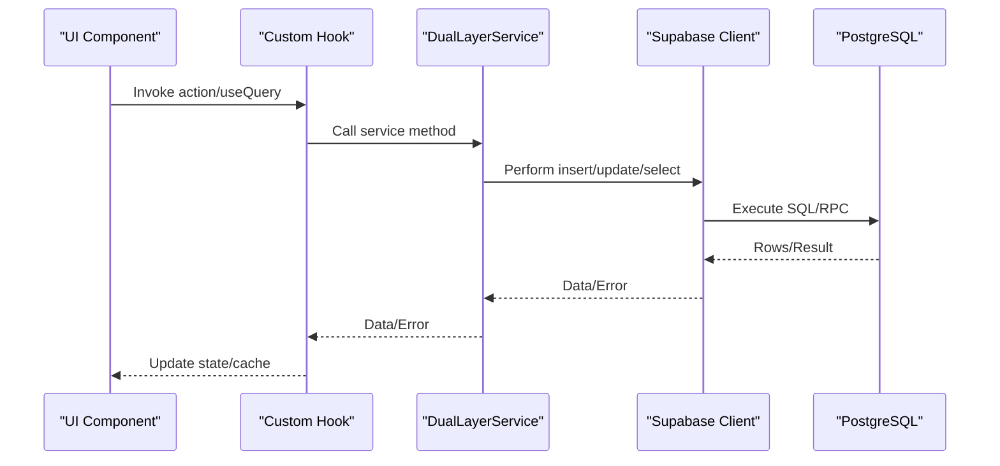
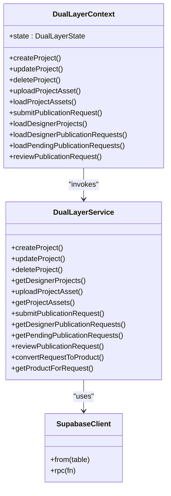
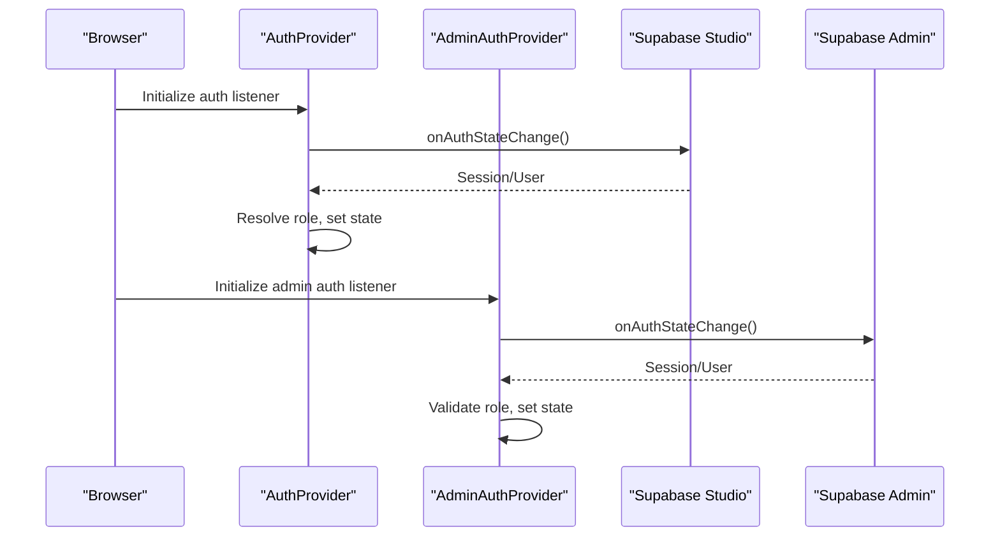
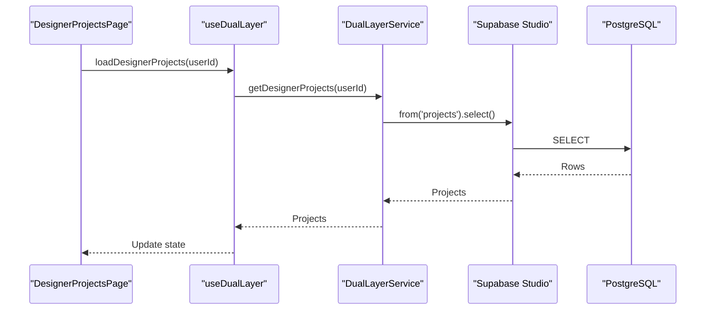
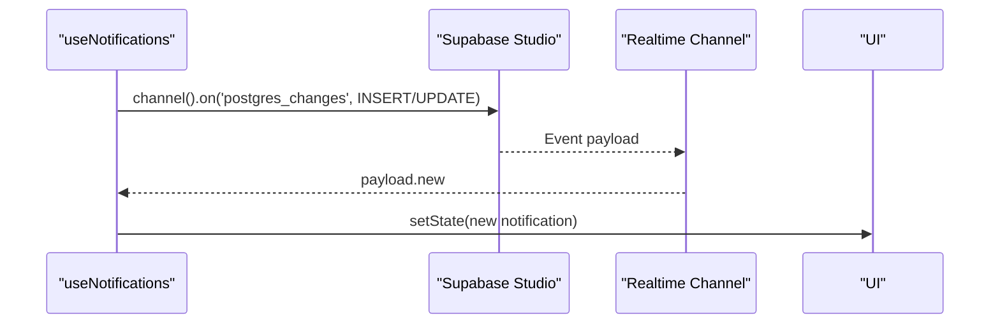
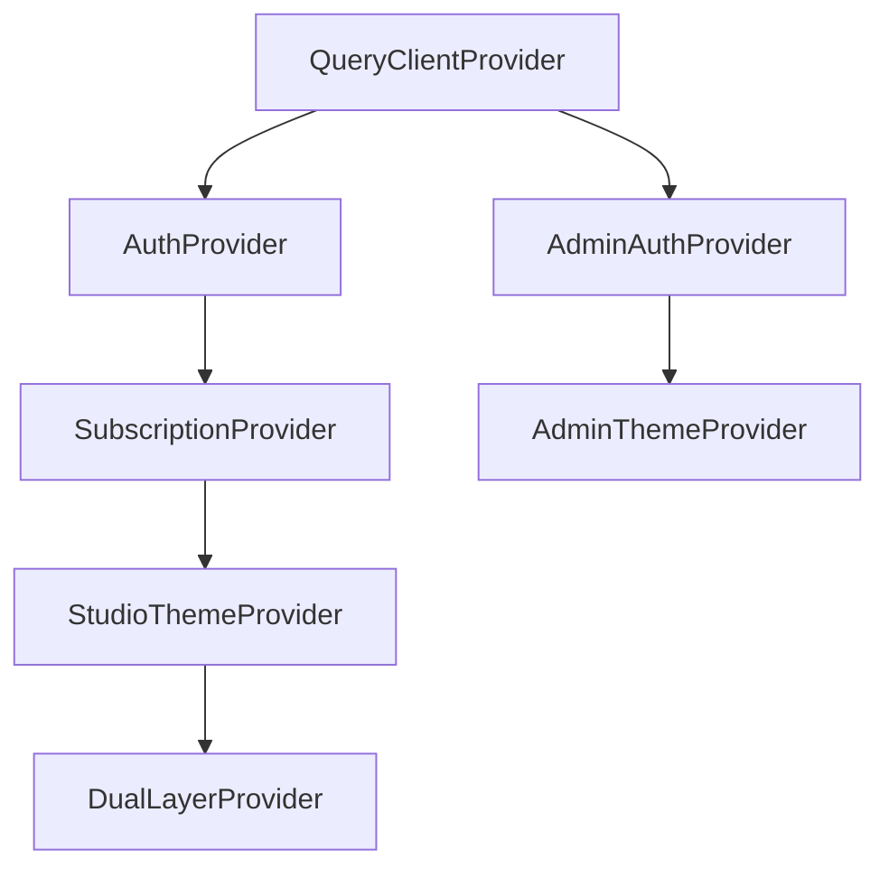
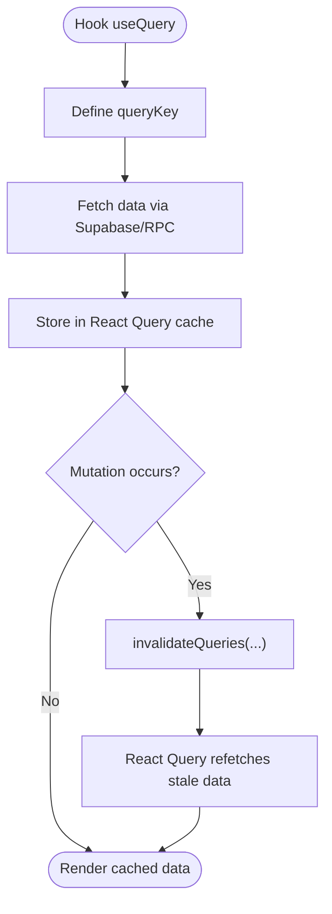
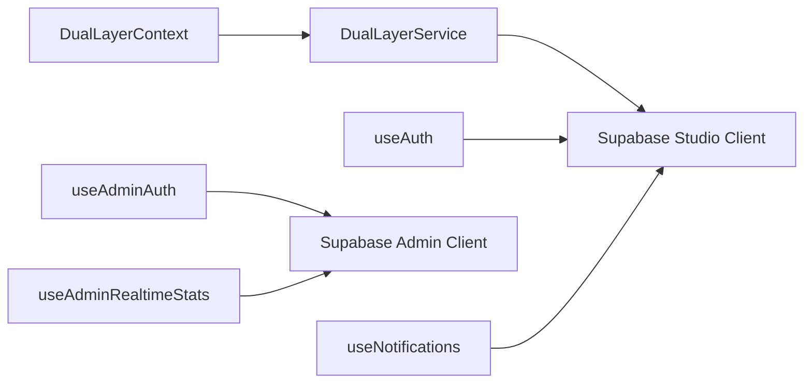

# Data Flow & State Management

<cite>
**Referenced Files in This Document**
- [App.tsx](file://src/App.tsx)
- [DualLayerContext.tsx](file://src/contexts/DualLayerContext.tsx)
- [dual-layer-service.ts](file://src/lib/dual-layer-service.ts)
- [dual-layer-types.ts](file://src/lib/dual-layer-types.ts)
- [useAuth.tsx](file://src/hooks/useAuth.tsx)
- [useAdminAuth.tsx](file://src/hooks/useAdminAuth.tsx)
- [client.ts](file://src/integrations/supabase/client.ts)
- [admin-client.ts](file://src/integrations/supabase/admin-client.ts)
- [DesignerProjects.tsx](file://src/pages/DesignerProjects.tsx)
- [DesignerProjectManager.tsx](file://src/components/projects/DesignerProjectManager.tsx)
- [AdminPublicationRequests.tsx](file://src/pages/admin/AdminPublicationRequests.tsx)
- [AdminPublicationReview.tsx](file://src/components/projects/AdminPublicationReview.tsx)
- [useNotifications.tsx](file://src/hooks/useNotifications.tsx)
- [useAdminRealtimeStats.tsx](file://src/hooks/useAdminRealtimeStats.tsx)
- [useOrders.tsx](file://src/hooks/useOrders.tsx)
- [useArticles.tsx](file://src/hooks/useArticles.tsx)
- [useMarketplaceProducts.tsx](file://src/hooks/useMarketplaceProducts.tsx)
- [useVibeMatch.tsx](file://src/hooks/useVibeMatch.tsx)
- [useAdminProducts.tsx](file://src/hooks/useAdminProducts.tsx)
- [20251226092855_6a9b8fc7-9fbe-4ff3-adcc-2411fc8d8d9a.sql](file://supabase/migrations/20251226092855_6a9b8fc7-9fbe-4ff3-adcc-2411fc8d8d9a.sql)
- [20251231072327_24f6c046-2261-41d6-a0e2-a733e38addd6.sql](file://supabase/migrations/20251231072327_24f6c046-2261-41d6-a0e2-a733e38addd6.sql)
</cite>

## Table of Contents
1. [Introduction](#introduction)
2. [Project Structure](#project-structure)
3. [Core Components](#core-components)
4. [Architecture Overview](#architecture-overview)
5. [Detailed Component Analysis](#detailed-component-analysis)
6. [Dependency Analysis](#dependency-analysis)
7. [Performance Considerations](#performance-considerations)
8. [Troubleshooting Guide](#troubleshooting-guide)
9. [Conclusion](#conclusion)

## Introduction
This document explains the Adorzia platform’s state management system with a focus on the dual-layer state architecture and authentication contexts. It traces data flows from UI components through custom hooks to the Supabase client and database, documents real-time synchronization via Supabase subscriptions and reactive updates, and describes the provider chain, context propagation, cross-layer state sharing, authentication flows between designer and admin contexts, session management, persistence strategies, and integration with TanStack React Query for server state management and caching.

## Project Structure
The application is organized around a layered provider chain that isolates authentication contexts and composes domain-specific providers. The Supabase clients are configured separately for studio and admin contexts, ensuring session isolation. TanStack React Query provides server state caching and invalidation across the app.

```mermaid
graph TB
subgraph "UI Layer"
UI_Designer["DesignerProjectsPage<br/>DesignerProjectManager"]
UI_Admin["AdminPublicationRequests<br/>AdminPublicationReview"]
end
subgraph "Providers"
QCP["QueryClientProvider"]
AuthProv["AuthProvider"]
SubProv["SubscriptionProvider"]
ThemeProv["StudioThemeProvider"]
DLProv["DualLayerProvider"]
AdminAuthProv["AdminAuthProvider"]
AdminThemeProv["AdminThemeProvider"]
end
subgraph "Hooks"
H_useAuth["useAuth"]
H_useAdminAuth["useAdminAuth"]
H_useDualLayer["useDualLayer"]
H_useNotifications["useNotifications"]
H_useAdminRealtimeStats["useAdminRealtimeStats"]
H_useOrders["useOrders"]
H_useArticles["useArticles"]
H_useMarketplaceProducts["useMarketplaceProducts"]
H_useVibeMatch["useVibeMatch"]
H_useAdminProducts["useAdminProducts"]
end
subgraph "Supabase Clients"
S_Client["supabase (studio)"]
S_AdminClient["supabaseAdmin (admin)"]
end
UI_Designer --> H_useAuth
UI_Designer --> H_useDualLayer
UI_Admin --> H_useAdminAuth
AuthProv --> H_useAuth
AdminAuthProv --> H_useAdminAuth
DLProv --> H_useDualLayer
H_useAuth --> S_Client
H_useAdminAuth --> S_AdminClient
H_useDualLayer --> S_Client
H_useNotifications --> S_Client
H_useAdminRealtimeStats --> S_AdminClient
H_useOrders --> S_Client
H_useArticles --> S_AdminClient
H_useMarketplaceProducts --> S_Client
H_useVibeMatch --> S_Client
H_useAdminProducts --> S_AdminClient
QCP --> H_useOrders
QCP --> H_useArticles
QCP --> H_useMarketplaceProducts
QCP --> H_useVibeMatch
QCP --> H_useAdminProducts
```

**Diagram sources**
- [App.tsx](file://src/App.tsx#L108-L134)
- [useAuth.tsx](file://src/hooks/useAuth.tsx#L34-L322)
- [useAdminAuth.tsx](file://src/hooks/useAdminAuth.tsx#L21-L248)
- [DualLayerContext.tsx](file://src/contexts/DualLayerContext.tsx#L135-L295)
- [client.ts](file://src/integrations/supabase/client.ts#L11-L17)
- [admin-client.ts](file://src/integrations/supabase/admin-client.ts#L16-L27)
- [useNotifications.tsx](file://src/hooks/useNotifications.tsx#L8-L88)
- [useAdminRealtimeStats.tsx](file://src/hooks/useAdminRealtimeStats.tsx#L24-L35)
- [useOrders.tsx](file://src/hooks/useOrders.tsx#L58-L60)
- [useArticles.tsx](file://src/hooks/useArticles.tsx#L99-L143)
- [useMarketplaceProducts.tsx](file://src/hooks/useMarketplaceProducts.tsx#L102-L147)
- [useVibeMatch.tsx](file://src/hooks/useVibeMatch.tsx#L27-L52)
- [useAdminProducts.tsx](file://src/hooks/useAdminProducts.tsx#L108-L151)

**Section sources**
- [App.tsx](file://src/App.tsx#L108-L134)

## Core Components
- DualLayerContext: Centralized state for designer project lifecycle, project assets, and publication requests. Provides actions to create, update, delete projects; upload assets; load assets; submit and review publication requests; and manage loading/error states.
- Authentication Contexts:
  - useAuth: Manages studio user session, role resolution, customer profile retrieval, and sign-out behavior scoped to the studio.
  - useAdminAuth: Manages admin session, role resolution, and sign-out behavior scoped to the admin portal with isolated storage.
- Supabase Clients:
  - studio client: Standard Supabase client with local storage-backed persistence.
  - admin client: Isolated storage adapter to keep admin sessions separate from studio sessions.
- TanStack React Query: Global QueryClientProvider enables caching, invalidation, and optimistic updates across domain-specific hooks.

**Section sources**
- [DualLayerContext.tsx](file://src/contexts/DualLayerContext.tsx#L5-L131)
- [dual-layer-service.ts](file://src/lib/dual-layer-service.ts#L4-L340)
- [dual-layer-types.ts](file://src/lib/dual-layer-types.ts#L3-L43)
- [useAuth.tsx](file://src/hooks/useAuth.tsx#L17-L322)
- [useAdminAuth.tsx](file://src/hooks/useAdminAuth.tsx#L7-L248)
- [client.ts](file://src/integrations/supabase/client.ts#L11-L17)
- [admin-client.ts](file://src/integrations/supabase/admin-client.ts#L8-L27)
- [App.tsx](file://src/App.tsx#L108-L123)

## Architecture Overview
The system employs a dual-layer state architecture:
- Designer layer (DualLayerContext) encapsulates project-centric state and operations.
- Authentication contexts (studio and admin) manage user sessions and roles independently.
- Supabase integrates via typed client libraries and raw SQL/RPC calls, with real-time subscriptions for reactive updates.
- TanStack React Query centralizes server state caching and invalidation.

**Diagram sources**
- [dual-layer-service.ts](file://src/lib/dual-layer-service.ts#L6-L23)
- [DesignerProjectManager.tsx](file://src/components/projects/DesignerProjectManager.tsx#L83-L110)
- [AdminPublicationReview.tsx](file://src/components/projects/AdminPublicationReview.tsx#L90-L127)

## Detailed Component Analysis

### DualLayerContext and DualLayerService
- State model includes projects, per-project assets, and publication requests with loading/error flags.
- Actions orchestrate CRUD operations through DualLayerService, which validates ownership and performs inserts/updates/deletes.
- The service uses Supabase ORM methods and joins to enrich publication requests with project details.

**Diagram sources**
- [DualLayerContext.tsx](file://src/contexts/DualLayerContext.tsx#L120-L295)
- [dual-layer-service.ts](file://src/lib/dual-layer-service.ts#L4-L340)
- [client.ts](file://src/integrations/supabase/client.ts#L11-L17)

**Section sources**
- [DualLayerContext.tsx](file://src/contexts/DualLayerContext.tsx#L5-L131)
- [dual-layer-service.ts](file://src/lib/dual-layer-service.ts#L4-L340)
- [dual-layer-types.ts](file://src/lib/dual-layer-types.ts#L3-L43)

### Authentication Contexts: Studio vs Admin
- Studio Auth:
  - Listens to Supabase auth state changes, debounces role checks, and persists sessions.
  - Supports sign-up/sign-in/log-out with logging and profile fetching for customers.
- Admin Auth:
  - Uses a separate client with isolated storage to prevent session overlap.
  - Enforces role checks against user_roles and clears invalid sessions.

**Diagram sources**
- [useAuth.tsx](file://src/hooks/useAuth.tsx#L109-L167)
- [useAdminAuth.tsx](file://src/hooks/useAdminAuth.tsx#L106-L167)
- [client.ts](file://src/integrations/supabase/client.ts#L11-L17)
- [admin-client.ts](file://src/integrations/supabase/admin-client.ts#L16-L27)

**Section sources**
- [useAuth.tsx](file://src/hooks/useAuth.tsx#L34-L322)
- [useAdminAuth.tsx](file://src/hooks/useAdminAuth.tsx#L21-L248)
- [client.ts](file://src/integrations/supabase/client.ts#L11-L17)
- [admin-client.ts](file://src/integrations/supabase/admin-client.ts#L8-L27)

### Data Flow from UI to Supabase and Back
- Designer Projects:
  - DesignerProjectsPage loads projects and publication requests when the user is available.
  - DesignerProjectManager demonstrates direct Supabase queries for assets and requests alongside the dual-layer context.
- Admin Publication Review:
  - AdminPublicationRequests renders the admin-only page.
  - AdminPublicationReview fetches and reviews publication requests, optionally converting approved requests to marketplace products.

**Diagram sources**
- [DesignerProjects.tsx](file://src/pages/DesignerProjects.tsx#L6-L16)
- [DualLayerContext.tsx](file://src/contexts/DualLayerContext.tsx#L138-L149)
- [dual-layer-service.ts](file://src/lib/dual-layer-service.ts#L85-L99)
- [client.ts](file://src/integrations/supabase/client.ts#L11-L17)

**Section sources**
- [DesignerProjects.tsx](file://src/pages/DesignerProjects.tsx#L6-L16)
- [DesignerProjectManager.tsx](file://src/components/projects/DesignerProjectManager.tsx#L25-L57)
- [AdminPublicationRequests.tsx](file://src/pages/admin/AdminPublicationRequests.tsx#L5-L15)
- [AdminPublicationReview.tsx](file://src/components/projects/AdminPublicationReview.tsx#L19-L57)

### Real-Time Data Synchronization and Reactive Updates
- Notifications:
  - useNotifications subscribes to postgres_changes for INSERT/UPDATE on the notifications table, pushing live updates to the UI.
- Admin Realtime Stats:
  - useAdminRealtimeStats leverages RPC and React Query to fetch and refresh dashboard metrics reactively.
- Database Setup:
  - Migrations enable REPLICA IDENTITY FULL and add tables to supabase_realtime publication for reliable change feeds.

**Diagram sources**
- [useNotifications.tsx](file://src/hooks/useNotifications.tsx#L45-L82)
- [20251226092855_6a9b8fc7-9fbe-4ff3-adcc-2411fc8d8d9a.sql](file://supabase/migrations/20251226092855_6a9b8fc7-9fbe-4ff3-adcc-2411fc8d8d9a.sql#L1-L19)
- [20251231072327_24f6c046-2261-41d6-a0e2-a733e38addd6.sql](file://supabase/migrations/20251231072327_24f6c046-2261-41d6-a0e2-a733e38addd6.sql#L1-L3)

**Section sources**
- [useNotifications.tsx](file://src/hooks/useNotifications.tsx#L8-L88)
- [useAdminRealtimeStats.tsx](file://src/hooks/useAdminRealtimeStats.tsx#L24-L35)
- [20251226092855_6a9b8fc7-9fbe-4ff3-adcc-2411fc8d8d9a.sql](file://supabase/migrations/20251226092855_6a9b8fc7-9fbe-4ff3-adcc-2411fc8d8d9a.sql#L1-L19)
- [20251231072327_24f6c046-2261-41d6-a0e2-a733e38addd6.sql](file://supabase/migrations/20251231072327_24f6c046-2261-41d6-a0e2-a733e38addd6.sql#L1-L3)

### Provider Chain and Context Propagation
- Studio Providers:
  - AuthProvider → SubscriptionProvider → StudioThemeProvider → DualLayerProvider
- Admin Providers:
  - AdminAuthProvider → AdminThemeProvider
- The QueryClientProvider wraps the entire routing tree to enable global caching.

**Diagram sources**
- [App.tsx](file://src/App.tsx#L110-L134)
- [App.tsx](file://src/App.tsx#L169-L175)

**Section sources**
- [App.tsx](file://src/App.tsx#L110-L134)
- [App.tsx](file://src/App.tsx#L169-L175)

### TanStack React Query Integration and Caching Strategies
- useOrders, useArticles, useMarketplaceProducts, useVibeMatch, useAdminProducts leverage React Query for:
  - Query keys and caching
  - Stale-time and cache-time tuning
  - Retry/backoff policies
  - Optimistic updates and cache invalidation on mutations
- Hooks use queryClient.invalidateQueries to synchronize UI after write operations.

**Diagram sources**
- [useOrders.tsx](file://src/hooks/useOrders.tsx#L58-L60)
- [useArticles.tsx](file://src/hooks/useArticles.tsx#L99-L143)
- [useMarketplaceProducts.tsx](file://src/hooks/useMarketplaceProducts.tsx#L102-L147)
- [useVibeMatch.tsx](file://src/hooks/useVibeMatch.tsx#L27-L52)
- [useAdminProducts.tsx](file://src/hooks/useAdminProducts.tsx#L108-L151)

**Section sources**
- [useOrders.tsx](file://src/hooks/useOrders.tsx#L58-L60)
- [useArticles.tsx](file://src/hooks/useArticles.tsx#L99-L143)
- [useMarketplaceProducts.tsx](file://src/hooks/useMarketplaceProducts.tsx#L102-L147)
- [useVibeMatch.tsx](file://src/hooks/useVibeMatch.tsx#L27-L52)
- [useAdminProducts.tsx](file://src/hooks/useAdminProducts.tsx#L108-L151)

## Dependency Analysis
- Context-to-Service Coupling:
  - DualLayerContext delegates all data operations to DualLayerService, which depends on the studio Supabase client.
- Cross-Context Isolation:
  - useAuth and useAdminAuth use distinct Supabase clients with separate storage adapters, preventing session leakage.
- Real-Time Dependencies:
  - useNotifications and admin stats depend on database migrations enabling REPLICA IDENTITY and publication additions.

**Diagram sources**
- [DualLayerContext.tsx](file://src/contexts/DualLayerContext.tsx#L135-L295)
- [dual-layer-service.ts](file://src/lib/dual-layer-service.ts#L4-L340)
- [useAuth.tsx](file://src/hooks/useAuth.tsx#L34-L322)
- [useAdminAuth.tsx](file://src/hooks/useAdminAuth.tsx#L21-L248)
- [useNotifications.tsx](file://src/hooks/useNotifications.tsx#L8-L88)
- [useAdminRealtimeStats.tsx](file://src/hooks/useAdminRealtimeStats.tsx#L24-L35)
- [client.ts](file://src/integrations/supabase/client.ts#L11-L17)
- [admin-client.ts](file://src/integrations/supabase/admin-client.ts#L16-L27)

**Section sources**
- [DualLayerContext.tsx](file://src/contexts/DualLayerContext.tsx#L135-L295)
- [dual-layer-service.ts](file://src/lib/dual-layer-service.ts#L4-L340)
- [useAuth.tsx](file://src/hooks/useAuth.tsx#L34-L322)
- [useAdminAuth.tsx](file://src/hooks/useAdminAuth.tsx#L21-L248)
- [useNotifications.tsx](file://src/hooks/useNotifications.tsx#L8-L88)
- [useAdminRealtimeStats.tsx](file://src/hooks/useAdminRealtimeStats.tsx#L24-L35)
- [client.ts](file://src/integrations/supabase/client.ts#L11-L17)
- [admin-client.ts](file://src/integrations/supabase/admin-client.ts#L16-L27)

## Performance Considerations
- Caching:
  - Use appropriate staleTime and cacheTime to balance freshness and performance (e.g., marketplace products).
- Retry/backoff:
  - Configure exponential backoff to handle transient failures gracefully.
- Real-time subscriptions:
  - Limit subscription scope and avoid unnecessary channels to reduce overhead.
- Ownership checks:
  - Keep server-side checks in DualLayerService to prevent redundant client-side validations.

[No sources needed since this section provides general guidance]

## Troubleshooting Guide
- Authentication Issues:
  - Studio and admin sessions are isolated; ensure the correct provider chain is used for each route.
  - On multi-tab scenarios, explicit sign-out clears tokens in the respective storage namespace.
- Real-time Updates:
  - Confirm database migrations have added required tables to supabase_realtime and set REPLICA IDENTITY FULL.
- Query Invalidation:
  - After mutations, invalidate related query keys to ensure UI consistency.

**Section sources**
- [useAuth.tsx](file://src/hooks/useAuth.tsx#L91-L106)
- [useAdminAuth.tsx](file://src/hooks/useAdminAuth.tsx#L89-L104)
- [20251226092855_6a9b8fc7-9fbe-4ff3-adcc-2411fc8d8d9a.sql](file://supabase/migrations/20251226092855_6a9b8fc7-9fbe-4ff3-adcc-2411fc8d8d9a.sql#L1-L19)
- [useOrders.tsx](file://src/hooks/useOrders.tsx#L254-L270)

## Conclusion
Adorzia’s state management combines a dual-layer designer state model with robust, isolated authentication contexts and Supabase-driven data access. Real-time subscriptions and TanStack React Query provide responsive, efficient updates and caching. The provider chain cleanly separates concerns across studio and admin contexts while enabling seamless cross-layer state sharing and secure session management.