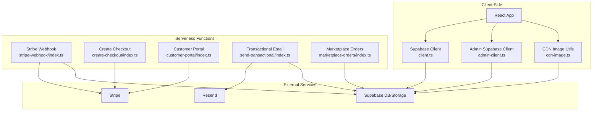
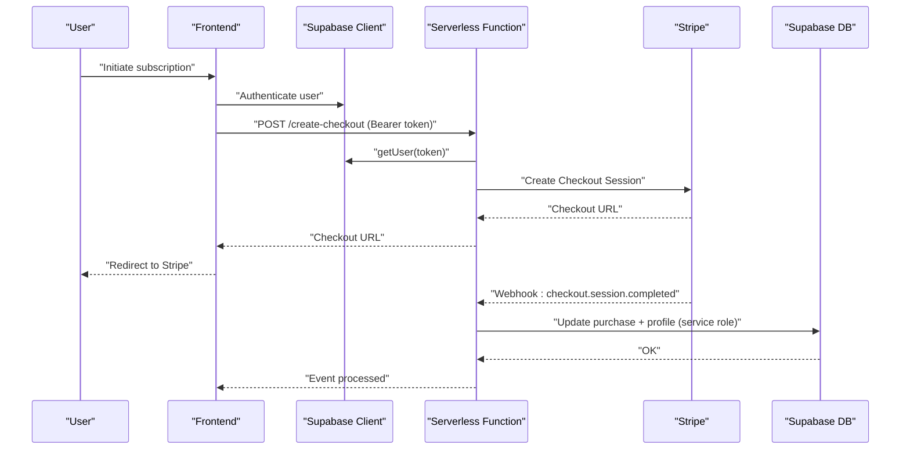
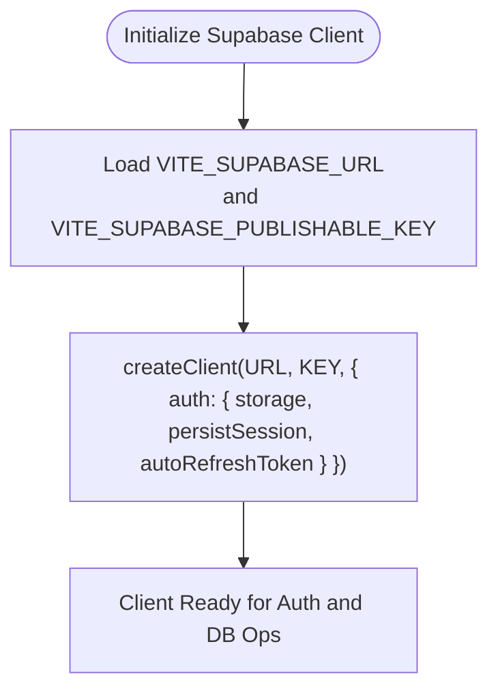
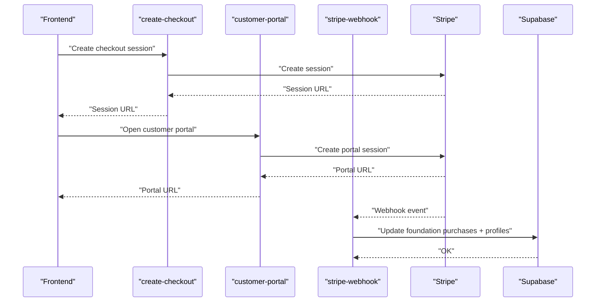
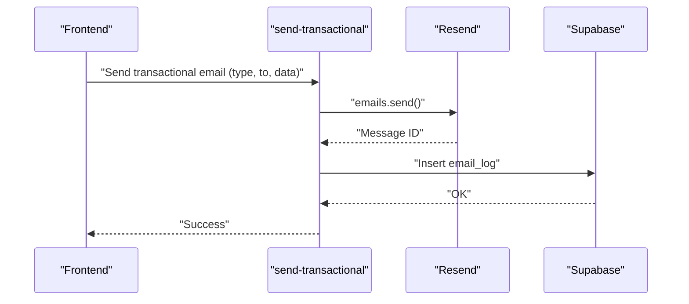
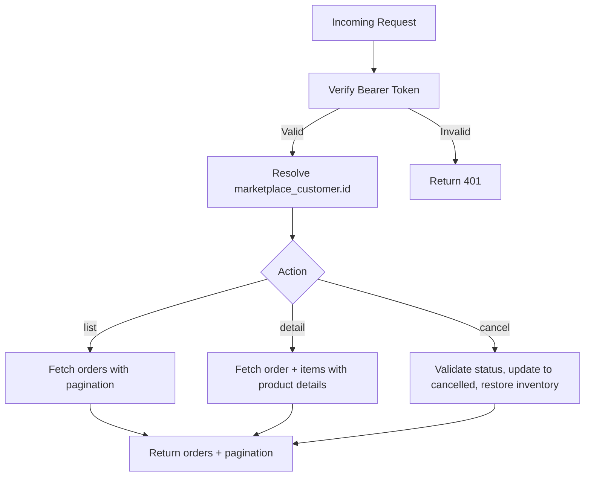
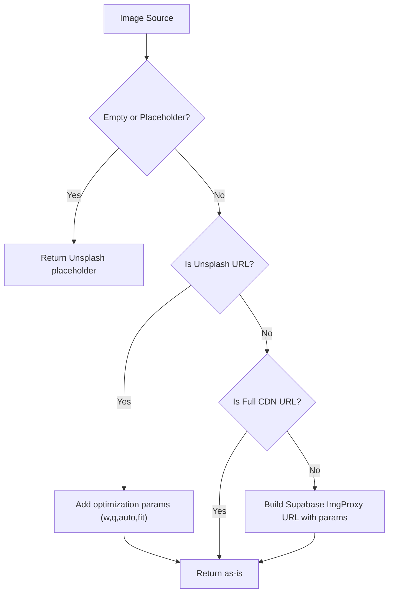
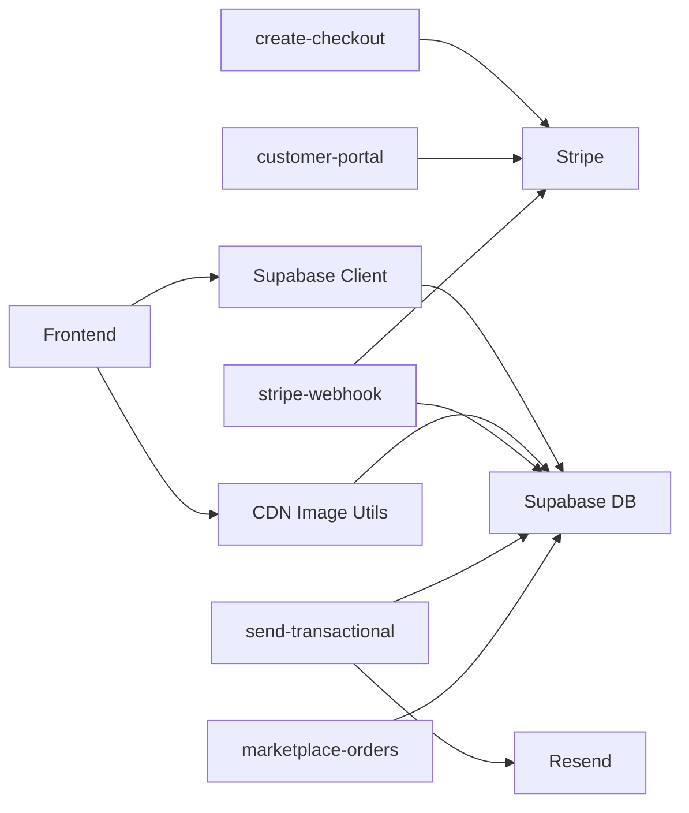

# Integration Patterns

<cite>
**Referenced Files in This Document**
- [client.ts](file://src/integrations/supabase/client.ts)
- [admin-client.ts](file://src/integrations/supabase/admin-client.ts)
- [types.ts](file://src/integrations/supabase/types.ts)
- [stripe-webhook/index.ts](file://supabase/functions/stripe-webhook/index.ts)
- [create-checkout/index.ts](file://supabase/functions/create-checkout/index.ts)
- [customer-portal/index.ts](file://supabase/functions/customer-portal/index.ts)
- [send-transactional/index.ts](file://supabase/functions/send-transactional/index.ts)
- [marketplace-orders/index.ts](file://supabase/functions/marketplace-orders/index.ts)
- [cdn-image.ts](file://src/lib/cdn-image.ts)
- [image-processing.ts](file://src/lib/image-processing.ts)
- [images.ts](file://src/lib/images.ts)
- [EnhancedErrorBoundary.tsx](file://src/components/EnhancedErrorBoundary.tsx)
- [ErrorBoundary.tsx](file://src/components/ErrorBoundary.tsx)
- [api-deduplication.ts](file://src/lib/api-deduplication.ts)
</cite>

## Table of Contents
1. [Introduction](#introduction)
2. [Project Structure](#project-structure)
3. [Core Components](#core-components)
4. [Architecture Overview](#architecture-overview)
5. [Detailed Component Analysis](#detailed-component-analysis)
6. [Dependency Analysis](#dependency-analysis)
7. [Performance Considerations](#performance-considerations)
8. [Troubleshooting Guide](#troubleshooting-guide)
9. [Conclusion](#conclusion)

## Introduction
This document describes the integration patterns used by the Adorzia platform to connect with external services. It focuses on:
- Supabase client initialization, authentication flows, and database operations
- Serverless functions for business logic (payment processing, email services, data transformations)
- Stripe integration for subscriptions and payments via webhooks and checkout
- Cloud-based image optimization and CDN delivery
- Error handling, retry mechanisms, and fallback strategies
- Webhook integration patterns, real-time event handling, and cross-system consistency
- API gateway patterns abstracted behind clean component interfaces

## Project Structure
The integration surface spans client-side Supabase clients, serverless functions, and image processing utilities. The serverless functions are organized under the Supabase Functions directory and expose REST-like endpoints for payment, email, marketplace operations, and Stripe webhooks.

**Diagram sources**
- [client.ts](file://src/integrations/supabase/client.ts#L1-L17)
- [admin-client.ts](file://src/integrations/supabase/admin-client.ts#L1-L28)
- [cdn-image.ts](file://src/lib/cdn-image.ts#L1-L305)
- [stripe-webhook/index.ts](file://supabase/functions/stripe-webhook/index.ts#L1-L160)
- [create-checkout/index.ts](file://supabase/functions/create-checkout/index.ts#L1-L85)
- [customer-portal/index.ts](file://supabase/functions/customer-portal/index.ts#L1-L74)
- [send-transactional/index.ts](file://supabase/functions/send-transactional/index.ts#L1-L70)
- [marketplace-orders/index.ts](file://supabase/functions/marketplace-orders/index.ts#L1-L229)

**Section sources**
- [client.ts](file://src/integrations/supabase/client.ts#L1-L17)
- [admin-client.ts](file://src/integrations/supabase/admin-client.ts#L1-L28)
- [cdn-image.ts](file://src/lib/cdn-image.ts#L1-L305)
- [stripe-webhook/index.ts](file://supabase/functions/stripe-webhook/index.ts#L1-L160)
- [create-checkout/index.ts](file://supabase/functions/create-checkout/index.ts#L1-L85)
- [customer-portal/index.ts](file://supabase/functions/customer-portal/index.ts#L1-L74)
- [send-transactional/index.ts](file://supabase/functions/send-transactional/index.ts#L1-L70)
- [marketplace-orders/index.ts](file://supabase/functions/marketplace-orders/index.ts#L1-L229)

## Core Components
- Supabase Clients
  - Standard client with local storage persistence and token refresh
  - Admin client with isolated storage keys and independent sessions
- Serverless Functions
  - Stripe checkout creation and customer portal session management
  - Stripe webhook for purchase lifecycle events
  - Transactional email sending via Resend with logging
  - Marketplace order listing, detail retrieval, and cancellation with inventory restoration
- Image Delivery and Processing
  - CDN URL generation with transformations and responsive srcset
  - Browser format detection and fallback strategies
  - Local caching of failed image fallbacks
  - Optional watermarking for internal assets

**Section sources**
- [client.ts](file://src/integrations/supabase/client.ts#L1-L17)
- [admin-client.ts](file://src/integrations/supabase/admin-client.ts#L1-L28)
- [types.ts](file://src/integrations/supabase/types.ts#L1-L800)
- [create-checkout/index.ts](file://supabase/functions/create-checkout/index.ts#L1-L85)
- [customer-portal/index.ts](file://supabase/functions/customer-portal/index.ts#L1-L74)
- [stripe-webhook/index.ts](file://supabase/functions/stripe-webhook/index.ts#L1-L160)
- [send-transactional/index.ts](file://supabase/functions/send-transactional/index.ts#L1-L70)
- [marketplace-orders/index.ts](file://supabase/functions/marketplace-orders/index.ts#L1-L229)
- [cdn-image.ts](file://src/lib/cdn-image.ts#L1-L305)
- [image-processing.ts](file://src/lib/image-processing.ts#L1-L82)

## Architecture Overview
The platform uses Supabase as the primary backend, with serverless functions bridging to external services (Stripe, Resend) and performing privileged operations (service role access). The client app interacts with Supabase through typed clients and uses CDN helpers for image delivery.

**Diagram sources**
- [client.ts](file://src/integrations/supabase/client.ts#L1-L17)
- [create-checkout/index.ts](file://supabase/functions/create-checkout/index.ts#L1-L85)
- [stripe-webhook/index.ts](file://supabase/functions/stripe-webhook/index.ts#L1-L160)

## Detailed Component Analysis

### Supabase Client Initialization and Authentication
- Standard client
  - Initializes with Vite environment variables for URL and publishable key
  - Configures local storage-backed persistence, session persistence, and automatic token refresh
- Admin client
  - Uses a separate storage adapter with an admin-specific prefix to keep admin sessions independent
  - Provides isolated storage keys and session persistence for admin apps

**Diagram sources**
- [client.ts](file://src/integrations/supabase/client.ts#L1-L17)
- [admin-client.ts](file://src/integrations/supabase/admin-client.ts#L1-L28)

**Section sources**
- [client.ts](file://src/integrations/supabase/client.ts#L1-L17)
- [admin-client.ts](file://src/integrations/supabase/admin-client.ts#L1-L28)
- [types.ts](file://src/integrations/supabase/types.ts#L1-L800)

### Stripe Integration: Payment Processing and Webhooks
- Create checkout session
  - Validates Bearer token via Supabase auth
  - Creates Stripe customer if needed
  - Builds a subscription checkout session with metadata and success/cancel URLs
- Customer portal
  - Retrieves user via Supabase auth
  - Finds or errors if no Stripe customer exists
  - Creates a billing portal session for managing subscriptions
- Stripe webhook
  - Verifies signatures using a secret
  - Uses service role Supabase client to bypass RLS
  - Handles checkout.session.completed and checkout.session.expired/canceled
  - Updates purchase records and user profiles accordingly

**Diagram sources**
- [create-checkout/index.ts](file://supabase/functions/create-checkout/index.ts#L1-L85)
- [customer-portal/index.ts](file://supabase/functions/customer-portal/index.ts#L1-L74)
- [stripe-webhook/index.ts](file://supabase/functions/stripe-webhook/index.ts#L1-L160)

**Section sources**
- [create-checkout/index.ts](file://supabase/functions/create-checkout/index.ts#L1-L85)
- [customer-portal/index.ts](file://supabase/functions/customer-portal/index.ts#L1-L74)
- [stripe-webhook/index.ts](file://supabase/functions/stripe-webhook/index.ts#L1-L160)

### Email Service Integration: Transactional Emails
- Endpoint validates authorization and extracts type, recipient, and data
- Sends email via Resend with a standardized subject and HTML body
- Logs email events to Supabase for audit and monitoring

**Diagram sources**
- [send-transactional/index.ts](file://supabase/functions/send-transactional/index.ts#L1-L70)

**Section sources**
- [send-transactional/index.ts](file://supabase/functions/send-transactional/index.ts#L1-L70)

### Marketplace Orders: Data Transformations and Business Logic
- Enforces authorization via Bearer token
- Resolves customer ID from Supabase
- Supports listing orders with pagination and filtering, retrieving details, and cancellation with inventory restoration

**Diagram sources**
- [marketplace-orders/index.ts](file://supabase/functions/marketplace-orders/index.ts#L1-L229)

**Section sources**
- [marketplace-orders/index.ts](file://supabase/functions/marketplace-orders/index.ts#L1-L229)

### Cloudinary/CDN Integration: Image Optimization and Delivery
- CDN URL generation with transformations (width, height, quality, format, fit)
- Responsive srcset generation for multiple viewport widths
- Presets for product and designer images
- Lazy loading with native loading or Intersection Observer fallback
- Preload hints for critical images
- Browser format detection (AVIF/WebP/JPEG)
- Fallback strategies for missing or external images, including Unsplash optimization and placeholder images
- Timeout-based fallback resolution and local cache of failed fallbacks

**Diagram sources**
- [cdn-image.ts](file://src/lib/cdn-image.ts#L1-L305)

**Section sources**
- [cdn-image.ts](file://src/lib/cdn-image.ts#L1-L305)
- [images.ts](file://src/lib/images.ts#L1-L95)
- [image-processing.ts](file://src/lib/image-processing.ts#L1-L82)

### API Gateway Patterns and Clean Interfaces
- Serverless functions act as gateways for external services:
  - Stripe checkout and customer portal endpoints
  - Transactional email endpoint
  - Marketplace order operations
- Each function:
  - Validates CORS and preflight OPTIONS
  - Authenticates callers via Bearer tokens against Supabase
  - Uses service role Supabase client for privileged DB operations
  - Returns structured JSON responses with appropriate status codes
- Frontend consumes these endpoints through typed Supabase clients and utility functions

**Section sources**
- [create-checkout/index.ts](file://supabase/functions/create-checkout/index.ts#L1-L85)
- [customer-portal/index.ts](file://supabase/functions/customer-portal/index.ts#L1-L74)
- [send-transactional/index.ts](file://supabase/functions/send-transactional/index.ts#L1-L70)
- [marketplace-orders/index.ts](file://supabase/functions/marketplace-orders/index.ts#L1-L229)
- [client.ts](file://src/integrations/supabase/client.ts#L1-L17)

## Dependency Analysis
- Supabase clients depend on environment variables and local storage for auth state
- Serverless functions depend on Supabase service role keys for privileged DB access and external secrets for Stripe and Resend
- Frontend depends on Supabase clients for auth and DB operations and on CDN utilities for image delivery
- Webhooks rely on signed events from Stripe to maintain integrity and update state consistently

**Diagram sources**
- [client.ts](file://src/integrations/supabase/client.ts#L1-L17)
- [cdn-image.ts](file://src/lib/cdn-image.ts#L1-L305)
- [create-checkout/index.ts](file://supabase/functions/create-checkout/index.ts#L1-L85)
- [customer-portal/index.ts](file://supabase/functions/customer-portal/index.ts#L1-L74)
- [send-transactional/index.ts](file://supabase/functions/send-transactional/index.ts#L1-L70)
- [marketplace-orders/index.ts](file://supabase/functions/marketplace-orders/index.ts#L1-L229)
- [stripe-webhook/index.ts](file://supabase/functions/stripe-webhook/index.ts#L1-L160)

**Section sources**
- [client.ts](file://src/integrations/supabase/client.ts#L1-L17)
- [cdn-image.ts](file://src/lib/cdn-image.ts#L1-L305)
- [create-checkout/index.ts](file://supabase/functions/create-checkout/index.ts#L1-L85)
- [customer-portal/index.ts](file://supabase/functions/customer-portal/index.ts#L1-L74)
- [send-transactional/index.ts](file://supabase/functions/send-transactional/index.ts#L1-L70)
- [marketplace-orders/index.ts](file://supabase/functions/marketplace-orders/index.ts#L1-L229)
- [stripe-webhook/index.ts](file://supabase/functions/stripe-webhook/index.ts#L1-L160)

## Performance Considerations
- Image optimization
  - Prefer WebP/AVIF when supported; degrade gracefully to JPEG
  - Use responsive srcset and lazy loading to improve LCP and reduce bandwidth
  - Preload critical images to minimize render blocking
- Request deduplication
  - Prevent duplicate network calls for the same operation using a deduplication utility
- Serverless cold starts
  - Keep functions small and avoid heavy initializations
  - Reuse connections where possible (e.g., Stripe SDK instances)
- Database queries
  - Use pagination and selective field selection for order listings
  - Apply filters early to reduce payload sizes

[No sources needed since this section provides general guidance]

## Troubleshooting Guide
- Error boundaries
  - EnhancedErrorBoundary captures errors, logs diagnostics, and allows retry or reload
  - ErrorBoundary provides a simpler fallback UI with retry
- API deduplication
  - Detects duplicate in-flight requests and logs potential infinite loops
- Stripe webhook
  - Validates signature and environment configuration; logs detailed errors and returns structured responses
- Image fallbacks
  - Timeout-based fallback resolution and local cache of failed images to avoid repeated failures
  - Unsplash fallback with optimization parameters and placeholder fallback

**Section sources**
- [EnhancedErrorBoundary.tsx](file://src/components/EnhancedErrorBoundary.tsx#L1-L169)
- [ErrorBoundary.tsx](file://src/components/ErrorBoundary.tsx#L1-L40)
- [api-deduplication.ts](file://src/lib/api-deduplication.ts#L1-L65)
- [stripe-webhook/index.ts](file://supabase/functions/stripe-webhook/index.ts#L1-L160)
- [cdn-image.ts](file://src/lib/cdn-image.ts#L240-L305)

## Conclusion
The Adorzia platform integrates external services through a cohesive pattern:
- Typed Supabase clients for authentication and database operations
- Serverless functions as secure gateways to Stripe and Resend, with service role access for privileged DB updates
- CDN utilities for high-performance image delivery with robust fallbacks
- Comprehensive error handling and observability via error boundaries and logging
- Webhook-driven consistency for payment lifecycles and order management

These patterns enable scalable, maintainable, and resilient integrations across distributed systems.