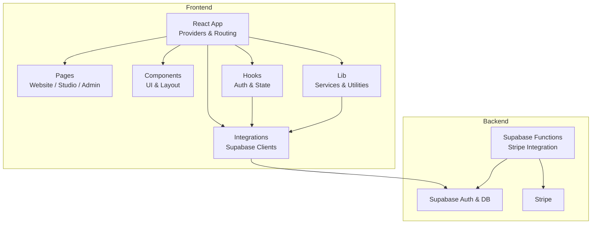
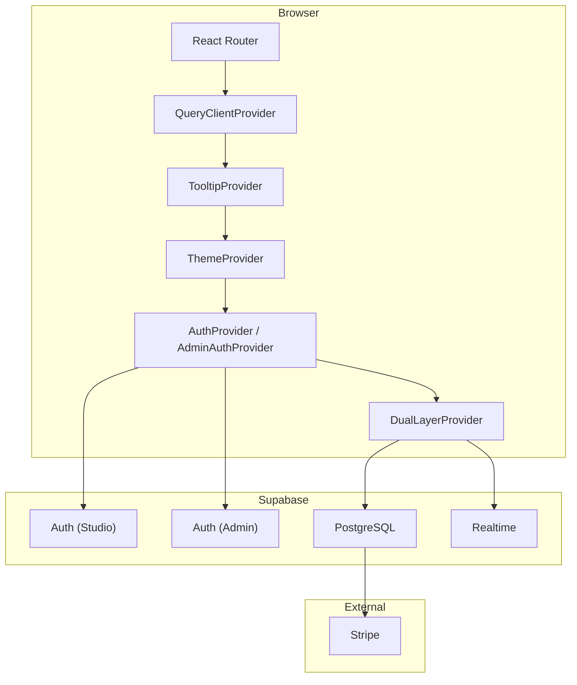
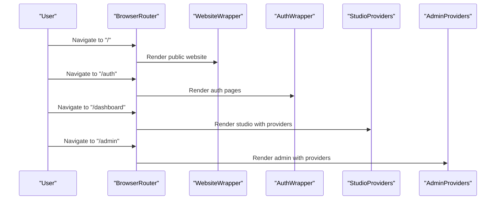
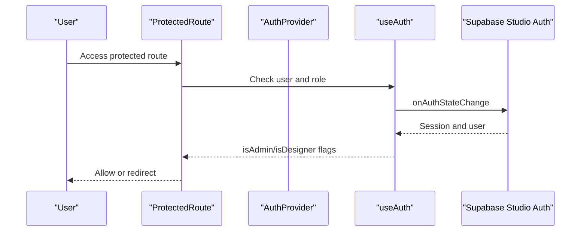
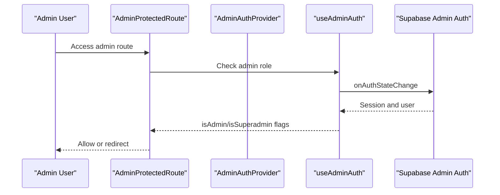
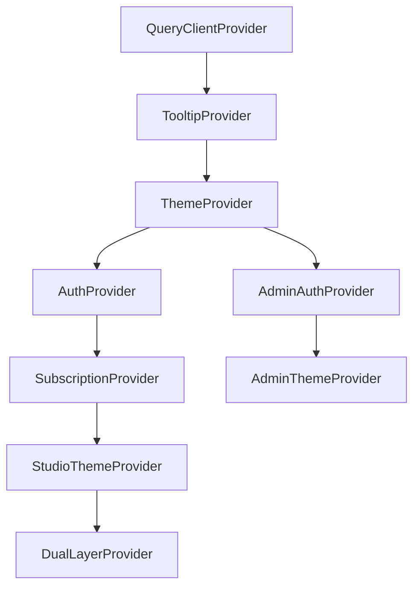
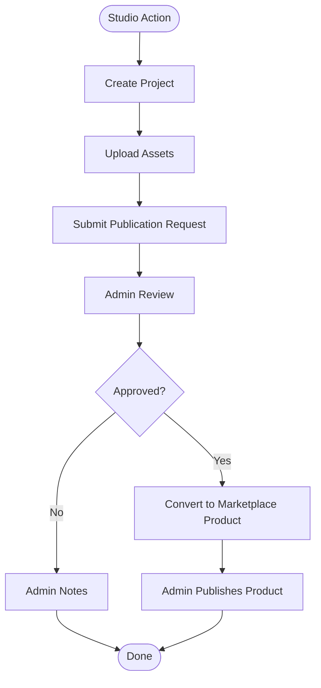
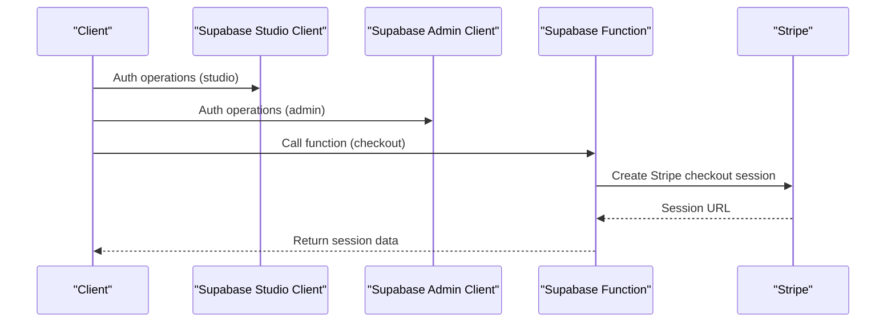
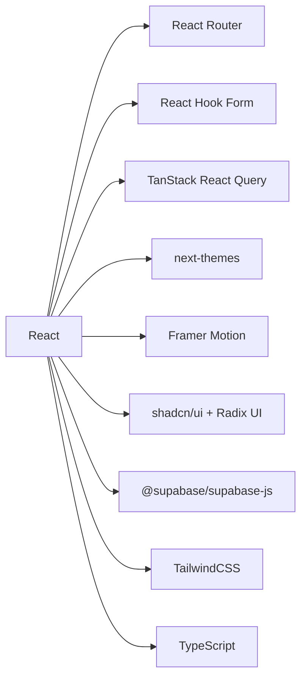
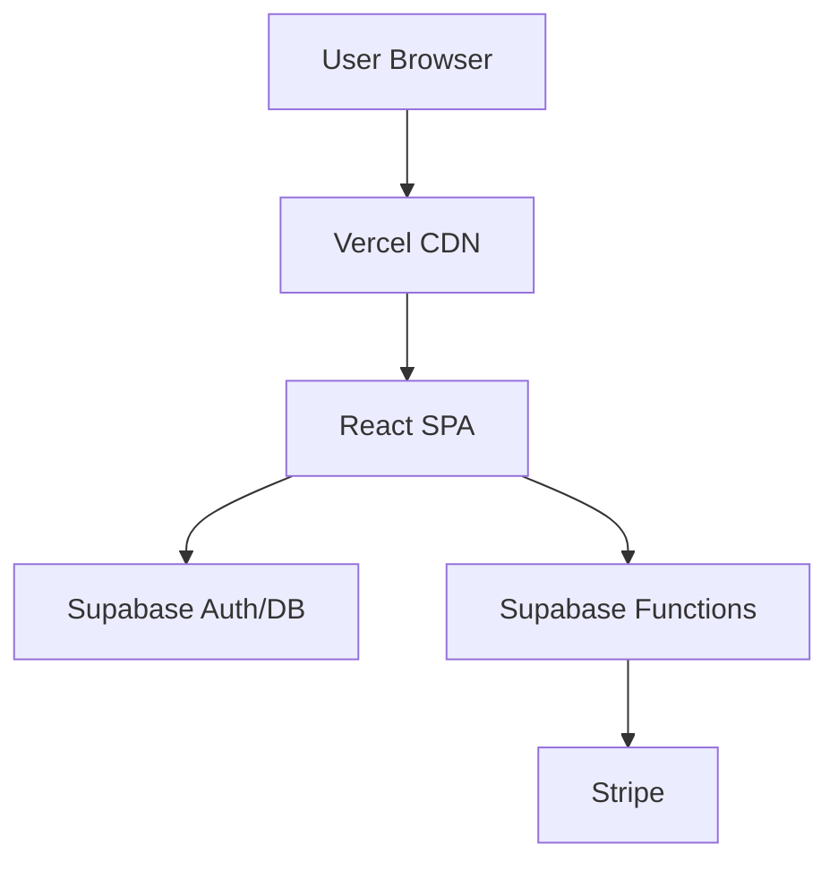

# System Design

<cite>
**Referenced Files in This Document**
- [src/App.tsx](file://src/App.tsx)
- [src/main.tsx](file://src/main.tsx)
- [src/contexts/DualLayerContext.tsx](file://src/contexts/DualLayerContext.tsx)
- [src/hooks/useAuth.tsx](file://src/hooks/useAuth.tsx)
- [src/hooks/useAdminAuth.tsx](file://src/hooks/useAdminAuth.tsx)
- [src/integrations/supabase/client.ts](file://src/integrations/supabase/client.ts)
- [src/integrations/supabase/admin-client.ts](file://src/integrations/supabase/admin-client.ts)
- [src/lib/dual-layer-service.ts](file://src/lib/dual-layer-service.ts)
- [src/components/auth/ProtectedRoute.tsx](file://src/components/auth/ProtectedRoute.tsx)
- [src/components/auth/AdminProtectedRoute.tsx](file://src/components/auth/AdminProtectedRoute.tsx)
- [src/pages/Dashboard.tsx](file://src/pages/Dashboard.tsx)
- [src/pages/admin/AdminDashboard.tsx](file://src/pages/admin/AdminDashboard.tsx)
- [package.json](file://package.json)
- [vercel.json](file://vercel.json)
- [supabase/functions/marketplace-checkout/index.ts](file://supabase/functions/marketplace-checkout/index.ts)
</cite>

## Table of Contents
1. [Introduction](#introduction)
2. [Project Structure](#project-structure)
3. [Core Components](#core-components)
4. [Architecture Overview](#architecture-overview)
5. [Detailed Component Analysis](#detailed-component-analysis)
6. [Dependency Analysis](#dependency-analysis)
7. [Performance Considerations](#performance-considerations)
8. [Troubleshooting Guide](#troubleshooting-guide)
9. [Conclusion](#conclusion)
10. [Appendices](#appendices)

## Introduction
This document describes the system design of the Adorzia platform, a React-based frontend integrated with a Supabase backend. The platform implements a dual-layer operating model separating the designer workspace (Studio) and the admin panel, with distinct authentication providers and session management. It leverages Supabase for identity, real-time, and database needs, integrates Stripe for payments, and uses Vercel for hosting and routing. The document explains the provider pattern, routing architecture, authentication system, and backend integration points.

## Project Structure
The frontend is organized around:
- Pages: route-specific page components for website, studio, and admin
- Components: reusable UI and layout components
- Hooks: custom React hooks for authentication, subscriptions, and UI state
- Integrations: Supabase clients and typed database access
- Lib: shared business logic and services (e.g., dual-layer operations)
- Contexts: global state providers (e.g., dual-layer)

**Diagram sources**
- [src/App.tsx](file://src/App.tsx#L155-L420)
- [src/main.tsx](file://src/main.tsx#L1-L46)
- [src/integrations/supabase/client.ts](file://src/integrations/supabase/client.ts#L1-L17)
- [src/integrations/supabase/admin-client.ts](file://src/integrations/supabase/admin-client.ts#L1-L28)
- [supabase/functions/marketplace-checkout/index.ts](file://supabase/functions/marketplace-checkout/index.ts#L77-L204)

**Section sources**
- [src/App.tsx](file://src/App.tsx#L155-L420)
- [src/main.tsx](file://src/main.tsx#L1-L46)

## Core Components
- Provider Pattern
  - QueryClientProvider: centralized caching and invalidation
  - TooltipProvider: global tooltip behavior
  - ThemeProvider: theme persistence and switching
  - Custom Providers: AuthProvider, AdminAuthProvider, SubscriptionProvider, Studio/Admin Theme Providers, DualLayerProvider
- Routing Architecture
  - WebsiteWrapper: public site theme wrapper
  - AuthWrapper: authentication-aware theme wrapper
  - StudioProviders: nested providers for studio routes
  - AdminProviders: nested providers for admin routes
  - ProtectedRoute and AdminProtectedRoute: route guards
- Authentication System
  - AuthProvider: studio user session, role detection, sign-up/sign-in/sign-out
  - AdminAuthProvider: admin-only session, role detection, isolated storage
- Dual-Layer Operating Model
  - DualLayerProvider: state for projects, assets, and publication requests
  - DualLayerService: CRUD operations and conversions between studio and admin workflows

**Section sources**
- [src/App.tsx](file://src/App.tsx#L106-L132)
- [src/App.tsx](file://src/App.tsx#L134-L152)
- [src/App.tsx](file://src/App.tsx#L173-L414)
- [src/hooks/useAuth.tsx](file://src/hooks/useAuth.tsx#L34-L314)
- [src/hooks/useAdminAuth.tsx](file://src/hooks/useAdminAuth.tsx#L21-L240)
- [src/contexts/DualLayerContext.tsx](file://src/contexts/DualLayerContext.tsx#L135-L295)
- [src/lib/dual-layer-service.ts](file://src/lib/dual-layer-service.ts#L4-L340)

## Architecture Overview
The system follows a layered architecture:
- Presentation Layer: React components and pages
- Routing and Guards: React Router with protected wrappers
- State Management: React Contexts and React Query
- Authentication: Supabase Auth with dual providers and isolated sessions
- Backend Services: Supabase Auth/DB plus Supabase Edge Functions for Stripe integration
- External Integrations: Stripe for payments, Vercel for hosting and security headers

**Diagram sources**
- [src/App.tsx](file://src/App.tsx#L167-L418)
- [src/hooks/useAuth.tsx](file://src/hooks/useAuth.tsx#L34-L314)
- [src/hooks/useAdminAuth.tsx](file://src/hooks/useAdminAuth.tsx#L21-L240)
- [src/integrations/supabase/client.ts](file://src/integrations/supabase/client.ts#L11-L17)
- [src/integrations/supabase/admin-client.ts](file://src/integrations/supabase/admin-client.ts#L16-L27)
- [src/lib/dual-layer-service.ts](file://src/lib/dual-layer-service.ts#L1-L340)

## Detailed Component Analysis

### Routing Architecture
The router defines three primary zones:
- Website routes: public pages without authentication
- Auth routes: authentication pages under a themed wrapper
- Studio routes: designer workspace with studio providers and route protection
- Admin routes: admin panel with admin providers and admin route protection

**Diagram sources**
- [src/App.tsx](file://src/App.tsx#L173-L414)

**Section sources**
- [src/App.tsx](file://src/App.tsx#L173-L414)

### Authentication System
Dual authentication providers ensure separation of concerns:
- Studio AuthProvider
  - Manages studio user session and roles
  - Logs sign-ups, logins, and logout actions
  - Supports sign-up with profile attributes and sign-in/sign-out
- AdminAuthProvider
  - Isolated admin session using custom storage keys
  - Role checks against user_roles table
  - Prevents unauthorized access to admin routes

**Diagram sources**
- [src/components/auth/ProtectedRoute.tsx](file://src/components/auth/ProtectedRoute.tsx#L11-L41)
- [src/hooks/useAuth.tsx](file://src/hooks/useAuth.tsx#L34-L314)

**Diagram sources**
- [src/components/auth/AdminProtectedRoute.tsx](file://src/components/auth/AdminProtectedRoute.tsx#L11-L51)
- [src/hooks/useAdminAuth.tsx](file://src/hooks/useAdminAuth.tsx#L21-L240)

**Section sources**
- [src/hooks/useAuth.tsx](file://src/hooks/useAuth.tsx#L34-L314)
- [src/hooks/useAdminAuth.tsx](file://src/hooks/useAdminAuth.tsx#L21-L240)
- [src/components/auth/ProtectedRoute.tsx](file://src/components/auth/ProtectedRoute.tsx#L11-L41)
- [src/components/auth/AdminProtectedRoute.tsx](file://src/components/auth/AdminProtectedRoute.tsx#L11-L51)

### Provider Pattern Implementation
The App composes providers to deliver cross-cutting capabilities:
- Global providers: QueryClientProvider, TooltipProvider, Toaster, Sonner, ThemeProvider
- WebsiteWrapper: light theme for public pages
- AuthWrapper: studio theme for auth pages
- StudioProviders: AuthProvider, SubscriptionProvider, StudioThemeProvider, DualLayerProvider
- AdminProviders: AdminAuthProvider, AdminThemeProvider

**Diagram sources**
- [src/App.tsx](file://src/App.tsx#L167-L169)
- [src/App.tsx](file://src/App.tsx#L108-L132)

**Section sources**
- [src/App.tsx](file://src/App.tsx#L106-L132)
- [src/App.tsx](file://src/App.tsx#L134-L152)

### Dual-Layer Operating Model
The dual-layer model coordinates designer workspace and admin operations:
- DualLayerProvider maintains state for projects, assets, and publication requests
- DualLayerService encapsulates CRUD and conversion logic between studio and admin domains

**Diagram sources**
- [src/contexts/DualLayerContext.tsx](file://src/contexts/DualLayerContext.tsx#L135-L295)
- [src/lib/dual-layer-service.ts](file://src/lib/dual-layer-service.ts#L4-L340)

**Section sources**
- [src/contexts/DualLayerContext.tsx](file://src/contexts/DualLayerContext.tsx#L135-L295)
- [src/lib/dual-layer-service.ts](file://src/lib/dual-layer-service.ts#L4-L340)

### Supabase Integration Details
- Studio client uses localStorage for auth persistence and auto token refresh
- Admin client uses a prefixed storage key to isolate admin sessions
- Real-time channels are used in admin dashboards for live notifications
- Edge functions integrate with Stripe for checkout sessions and order verification

**Diagram sources**
- [src/integrations/supabase/client.ts](file://src/integrations/supabase/client.ts#L11-L17)
- [src/integrations/supabase/admin-client.ts](file://src/integrations/supabase/admin-client.ts#L16-L27)
- [src/pages/admin/AdminDashboard.tsx](file://src/pages/admin/AdminDashboard.tsx#L308-L353)
- [supabase/functions/marketplace-checkout/index.ts](file://supabase/functions/marketplace-checkout/index.ts#L77-L204)

**Section sources**
- [src/integrations/supabase/client.ts](file://src/integrations/supabase/client.ts#L1-L17)
- [src/integrations/supabase/admin-client.ts](file://src/integrations/supabase/admin-client.ts#L1-L28)
- [src/pages/admin/AdminDashboard.tsx](file://src/pages/admin/AdminDashboard.tsx#L308-L353)
- [supabase/functions/marketplace-checkout/index.ts](file://supabase/functions/marketplace-checkout/index.ts#L77-L204)

## Dependency Analysis
The frontend depends on:
- React ecosystem: React, React Router, React Hook Form, Radix UI, shadcn/ui
- State and UX: React Query, next-themes, Framer Motion, Sonner
- Supabase: @supabase/supabase-js for auth and DB
- Tooling: Vite, TailwindCSS, TypeScript

**Diagram sources**
- [package.json](file://package.json#L15-L69)

**Section sources**
- [package.json](file://package.json#L15-L69)

## Performance Considerations
- React Query caching: leverage QueryClientProvider for efficient caching and background refetching
- Minimal re-renders: use Contexts and memoized callbacks in auth providers
- Lazy loading: defer heavy computations until after initial session resolution
- Real-time updates: use Supabase Realtime selectively to avoid unnecessary updates
- Bundle size: keep UI libraries tree-shaken and avoid importing unused components

## Troubleshooting Guide
- Authentication issues
  - Studio vs Admin confusion: ensure correct provider is active for the route
  - Session conflicts: verify isolated storage keys for admin sessions
- Route protection failures
  - ProtectedRoute/AdminProtectedRoute: confirm role flags and loading states
- Real-time notifications
  - Admin dashboard: ensure channel subscriptions are established and cleaned up
- Build and deployment
  - Vercel headers: confirm security headers are applied globally
  - SPA fallback: verify rewrites for client-side routing

**Section sources**
- [src/components/auth/ProtectedRoute.tsx](file://src/components/auth/ProtectedRoute.tsx#L11-L41)
- [src/components/auth/AdminProtectedRoute.tsx](file://src/components/auth/AdminProtectedRoute.tsx#L11-L51)
- [src/pages/admin/AdminDashboard.tsx](file://src/pages/admin/AdminDashboard.tsx#L308-L353)
- [vercel.json](file://vercel.json#L1-L24)

## Conclusion
Adorzia’s architecture cleanly separates studio and admin experiences through dual providers and dual authentication providers, ensuring secure and independent sessions. Supabase provides robust identity, real-time, and database capabilities, while Stripe integration is handled via Supabase Edge Functions. The routing and guard system enforces access control, and the dual-layer model streamlines the designer-to-marketplace workflow.

## Appendices

### Infrastructure and Deployment Topology
- Hosting: Vercel with global security headers and SPA rewrite
- Frontend: React SPA built with Vite
- Backend: Supabase (Auth, Database, Realtime, Edge Functions)
- Payments: Stripe via Supabase Functions

**Diagram sources**
- [vercel.json](file://vercel.json#L1-L24)
- [supabase/functions/marketplace-checkout/index.ts](file://supabase/functions/marketplace-checkout/index.ts#L77-L204)

**Section sources**
- [vercel.json](file://vercel.json#L1-L24)
- [supabase/functions/marketplace-checkout/index.ts](file://supabase/functions/marketplace-checkout/index.ts#L77-L204)