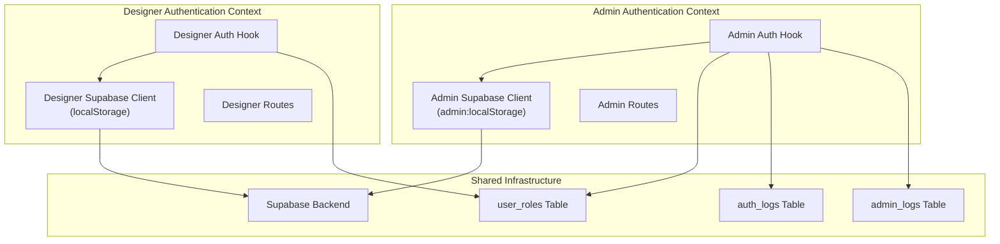
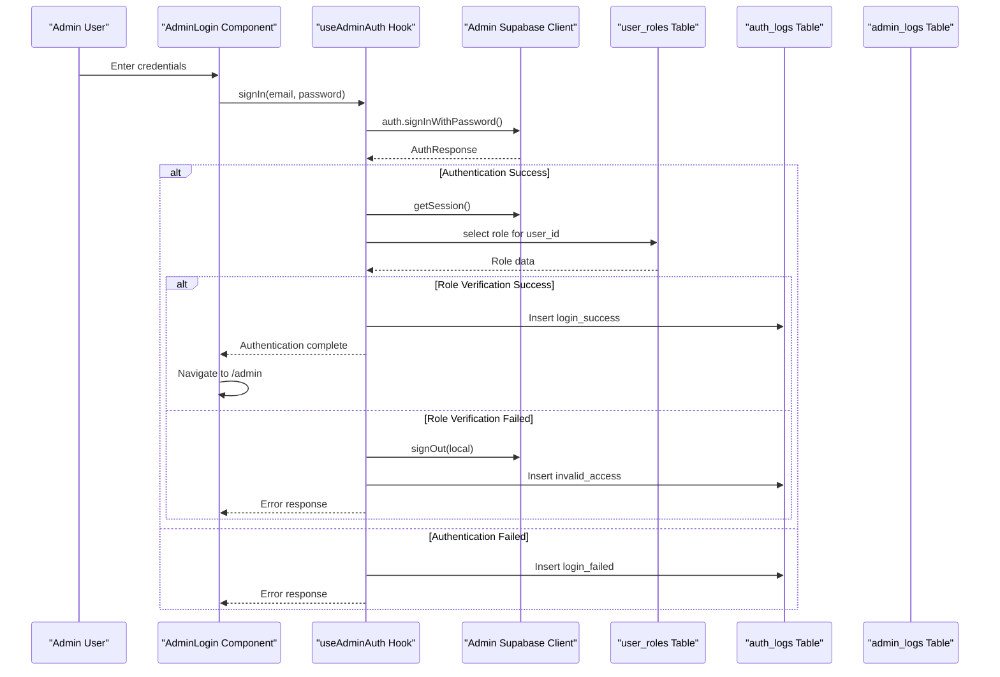
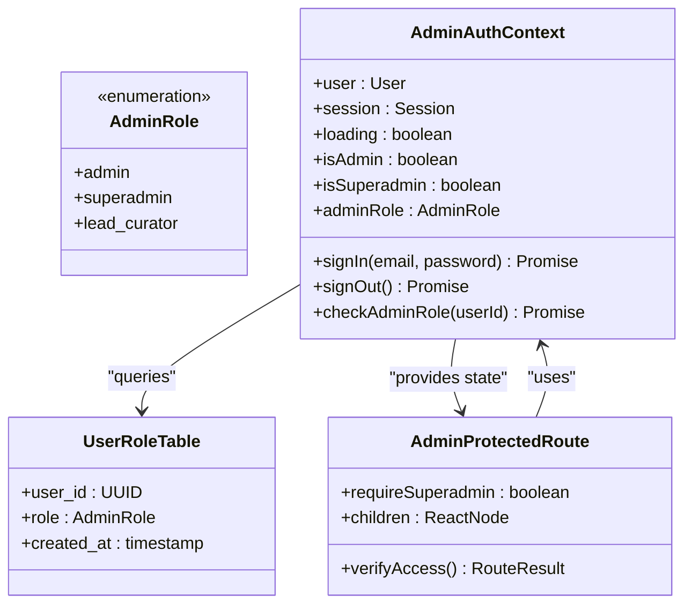
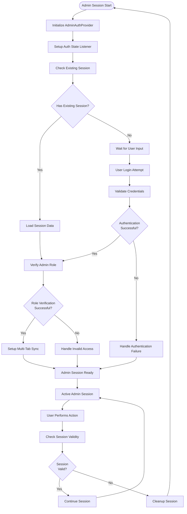
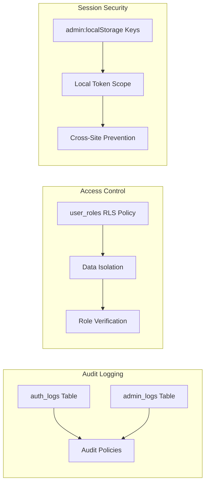
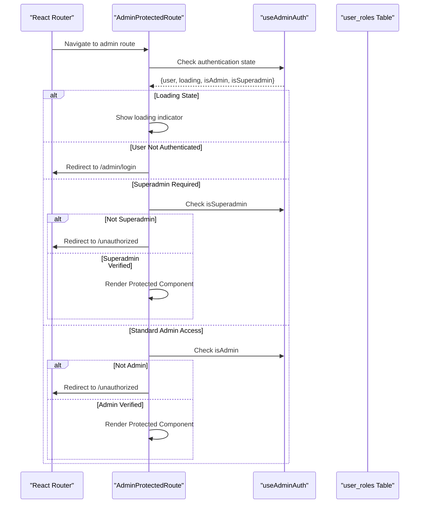
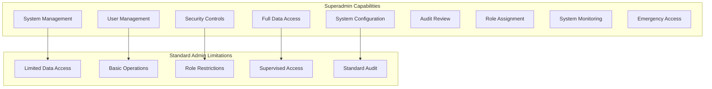
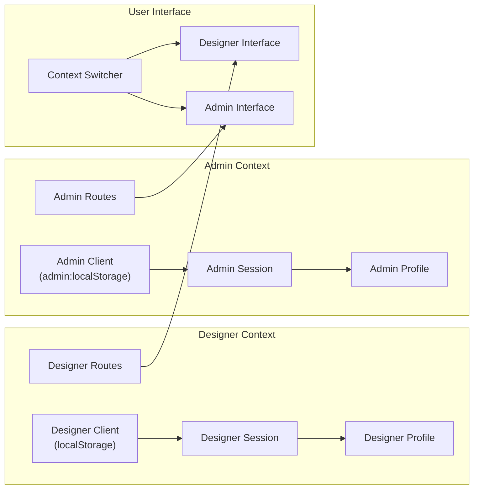

# Administrator Authentication

<cite>
**Referenced Files in This Document**
- [useAdminAuth.tsx](file://src/hooks/useAdminAuth.tsx)
- [AdminProtectedRoute.tsx](file://src/components/auth/AdminProtectedRoute.tsx)
- [AdminLogin.tsx](file://src/pages/admin/AdminLogin.tsx)
- [admin-client.ts](file://src/integrations/supabase/admin-client.ts)
- [client.ts](file://src/integrations/supabase/client.ts)
- [App.tsx](file://src/App.tsx)
- [AdminLayout.tsx](file://src/components/admin/AdminLayout.tsx)
- [AdminSidebar.tsx](file://src/components/admin/AdminSidebar.tsx)
- [admin_auth_security.sql](file://supabase/migrations/20260126040000_admin_auth_security.sql)
- [bootstrap_superadmin.sql](file://supabase/migrations/20260126050000_bootstrap_superadmin.sql)
- [ProtectedRoute.tsx](file://src/components/auth/ProtectedRoute.tsx)
- [Unauthorized.tsx](file://src/pages/Unauthorized.tsx)
</cite>

## Table of Contents
1. [Introduction](#introduction)
2. [Dual Authentication Architecture](#dual-authentication-architecture)
3. [Admin Authentication Flow](#admin-authentication-flow)
4. [Role-Based Access Control](#role-based-access-control)
5. [Admin Session Management](#admin-session-management)
6. [Security Measures](#security-measures)
7. [Admin Route Protection](#admin-route-protection)
8. [Superadmin Privileges](#superadmin-privileges)
9. [Coexistence with Designer Authentication](#coexistence-with-designer-authentication)
10. [Implementation Examples](#implementation-examples)
11. [Troubleshooting Guide](#troubleshooting-guide)
12. [Conclusion](#conclusion)

## Introduction

The administrator authentication system in Adorzia implements a sophisticated dual authentication architecture that separates designer and admin authentication contexts while maintaining seamless coexistence within the same application. This system provides robust security through role-based access control, isolated session management, and comprehensive audit logging capabilities.

The authentication system is built around three primary components: the admin authentication hook that manages admin-specific state and session lifecycle, the admin-protected routing system that enforces role-based access control, and the dual client architecture that ensures complete isolation between designer and admin contexts.

## Dual Authentication Architecture

The system employs a dual authentication architecture that maintains complete separation between designer and admin authentication contexts through distinct Supabase clients and storage mechanisms.

**Diagram sources**
- [admin-client.ts](file://src/integrations/supabase/admin-client.ts#L7-L12)
- [client.ts](file://src/integrations/supabase/client.ts#L11-L16)
- [useAdminAuth.tsx](file://src/hooks/useAdminAuth.tsx#L104-L132)

The architecture ensures that designer and admin sessions operate independently, preventing cross-contamination and maintaining separate authentication states across browser tabs and windows.

**Section sources**
- [admin-client.ts](file://src/integrations/supabase/admin-client.ts#L7-L27)
- [client.ts](file://src/integrations/supabase/client.ts#L1-L17)
- [App.tsx](file://src/App.tsx#L101-L110)

## Admin Authentication Flow

The admin authentication flow follows a structured process that validates credentials, verifies administrative roles, and establishes secure sessions with comprehensive logging and error handling.

**Diagram sources**
- [AdminLogin.tsx](file://src/pages/admin/AdminLogin.tsx#L32-L68)
- [useAdminAuth.tsx](file://src/hooks/useAdminAuth.tsx#L142-L172)
- [useAdminAuth.tsx](file://src/hooks/useAdminAuth.tsx#L101-L140)

The authentication flow includes comprehensive error handling, credential validation, and automatic role verification to ensure only authorized administrators gain access to the admin portal.

**Section sources**
- [AdminLogin.tsx](file://src/pages/admin/AdminLogin.tsx#L32-L68)
- [useAdminAuth.tsx](file://src/hooks/useAdminAuth.tsx#L142-L172)

## Role-Based Access Control

The system implements a hierarchical role-based access control system with three distinct admin roles: admin, superadmin, and lead_curator, each with specific permissions and capabilities.

**Diagram sources**
- [useAdminAuth.tsx](file://src/hooks/useAdminAuth.tsx#L5-L29)
- [AdminProtectedRoute.tsx](file://src/components/auth/AdminProtectedRoute.tsx#L6-L14)

The role hierarchy provides clear permission boundaries, with superadmins having elevated privileges for system-level operations while regular admins maintain operational access to administrative functions.

**Section sources**
- [useAdminAuth.tsx](file://src/hooks/useAdminAuth.tsx#L5-L29)
- [AdminProtectedRoute.tsx](file://src/components/auth/AdminProtectedRoute.tsx#L6-L14)

## Admin Session Management

The admin session management system implements sophisticated session handling with automatic synchronization across browser tabs, secure token storage, and comprehensive session lifecycle management.

**Diagram sources**
- [useAdminAuth.tsx](file://src/hooks/useAdminAuth.tsx#L50-L99)
- [useAdminAuth.tsx](file://src/hooks/useAdminAuth.tsx#L35-L48)

The session management includes automatic token refresh handling, multi-tab synchronization for sign-out events, and secure storage using admin-specific localStorage keys to prevent session hijacking.

**Section sources**
- [useAdminAuth.tsx](file://src/hooks/useAdminAuth.tsx#L35-L48)
- [useAdminAuth.tsx](file://src/hooks/useAdminAuth.tsx#L50-L99)

## Security Measures

The authentication system implements comprehensive security measures including audit logging, role-based data access, and secure session isolation to protect against unauthorized access and maintain system integrity.

**Diagram sources**
- [admin_auth_security.sql](file://supabase/migrations/20260126040000_admin_auth_security.sql#L61-L79)
- [admin-client.ts](file://src/integrations/supabase/admin-client.ts#L7-L12)

The security framework includes comprehensive audit trails for all authentication events, role-based row-level security policies, and strict session isolation to prevent cross-context access attempts.

**Section sources**
- [admin_auth_security.sql](file://supabase/migrations/20260126040000_admin_auth_security.sql#L61-L79)
- [admin-client.ts](file://src/integrations/supabase/admin-client.ts#L7-L12)

## Admin Route Protection

The admin route protection system provides granular access control with support for both standard admin access and superadmin-only routes, ensuring appropriate privilege levels for different administrative functions.

**Diagram sources**
- [AdminProtectedRoute.tsx](file://src/components/auth/AdminProtectedRoute.tsx#L11-L45)
- [useAdminAuth.tsx](file://src/hooks/useAdminAuth.tsx#L28-L29)

The route protection system supports conditional access based on role requirements, providing flexibility for different administrative functions while maintaining strict security boundaries.

**Section sources**
- [AdminProtectedRoute.tsx](file://src/components/auth/AdminProtectedRoute.tsx#L11-L45)
- [useAdminAuth.tsx](file://src/hooks/useAdminAuth.tsx#L28-L29)

## Superadmin Privileges

Superadmin privileges represent the highest level of administrative access within the system, providing comprehensive control over all administrative functions and system-level operations.

**Diagram sources**
- [AdminProtectedRoute.tsx](file://src/components/auth/AdminProtectedRoute.tsx#L35-L36)
- [AdminSidebar.tsx](file://src/components/admin/AdminSidebar.tsx#L79-L86)

Superadmins have exclusive access to sensitive system functions, including security configuration management, comprehensive user administration, and full system monitoring capabilities, while standard admins are restricted to operational administrative functions.

**Section sources**
- [AdminProtectedRoute.tsx](file://src/components/auth/AdminProtectedRoute.tsx#L35-L36)
- [AdminSidebar.tsx](file://src/components/admin/AdminSidebar.tsx#L79-L86)

## Coexistence with Designer Authentication

The dual authentication system enables seamless coexistence between designer and admin authentication contexts, allowing users to maintain separate sessions for both roles without conflicts or cross-contamination.

**Diagram sources**
- [admin-client.ts](file://src/integrations/supabase/admin-client.ts#L7-L12)
- [client.ts](file://src/integrations/supabase/client.ts#L11-L16)
- [App.tsx](file://src/App.tsx#L241-L338)

The system maintains complete isolation between contexts through separate storage mechanisms, distinct authentication flows, and independent session management, enabling users to seamlessly switch between designer and admin roles as needed.

**Section sources**
- [admin-client.ts](file://src/integrations/supabase/admin-client.ts#L7-L12)
- [client.ts](file://src/integrations/supabase/client.ts#L11-L16)
- [App.tsx](file://src/App.tsx#L241-L338)

## Implementation Examples

The administrator authentication system provides several key implementation patterns that demonstrate best practices for secure authentication and access control.

### Admin Authentication Hook Implementation

The admin authentication hook serves as the central authority for managing admin authentication state, session lifecycle, and role verification within the application.

**Section sources**
- [useAdminAuth.tsx](file://src/hooks/useAdminAuth.tsx#L21-L207)

### Admin Login Component

The admin login component provides a secure authentication interface with comprehensive form validation, error handling, and user feedback mechanisms.

**Section sources**
- [AdminLogin.tsx](file://src/pages/admin/AdminLogin.tsx#L17-L157)

### Admin Protected Route Component

The admin protected route component enforces role-based access control with support for both standard admin access and superadmin-only routes.

**Section sources**
- [AdminProtectedRoute.tsx](file://src/components/auth/AdminProtectedRoute.tsx#L11-L45)

### Admin Layout Component

The admin layout component provides the administrative interface with role-aware navigation, user management, and session controls.

**Section sources**
- [AdminLayout.tsx](file://src/components/admin/AdminLayout.tsx#L48-L237)

## Troubleshooting Guide

Common issues and solutions for the administrator authentication system include session synchronization problems, role verification failures, and authentication timeout scenarios.

### Session Synchronization Issues

When admin sessions fail to synchronize across browser tabs, the system relies on explicit sign-out detection through localStorage change events to maintain consistency.

**Section sources**
- [useAdminAuth.tsx](file://src/hooks/useAdminAuth.tsx#L35-L48)

### Role Verification Failures

Role verification failures typically indicate missing or incorrect entries in the user_roles table, requiring administrative intervention to properly assign roles.

**Section sources**
- [useAdminAuth.tsx](file://src/hooks/useAdminAuth.tsx#L101-L140)

### Authentication Timeout Handling

The system handles authentication timeouts gracefully through automatic token refresh and fallback mechanisms to maintain uninterrupted administrative access.

**Section sources**
- [useAdminAuth.tsx](file://src/hooks/useAdminAuth.tsx#L58-L62)

## Conclusion

The administrator authentication system in Adorzia represents a comprehensive solution for managing dual authentication contexts while maintaining robust security and operational efficiency. Through its sophisticated dual client architecture, hierarchical role-based access control, and comprehensive audit logging, the system provides administrators with secure, reliable access to administrative functions while maintaining complete separation from designer authentication contexts.

The implementation demonstrates best practices in modern authentication systems, including proper session isolation, comprehensive error handling, and flexible role-based access control that scales from basic administrative functions to advanced superadmin capabilities. The system's design ensures both security and usability, enabling administrators to efficiently manage platform operations while maintaining strict security boundaries and comprehensive audit trails.