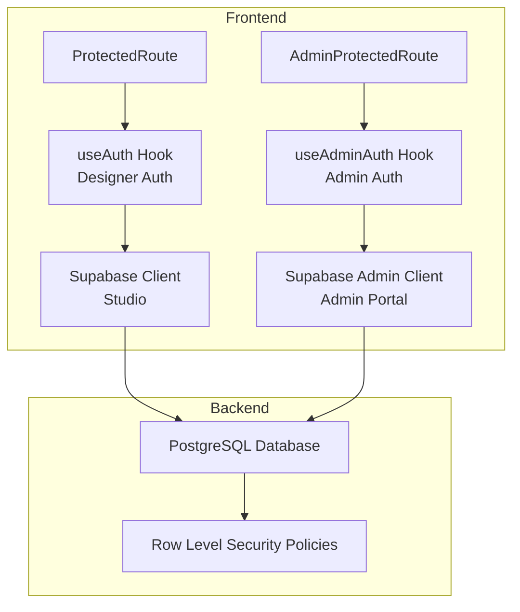
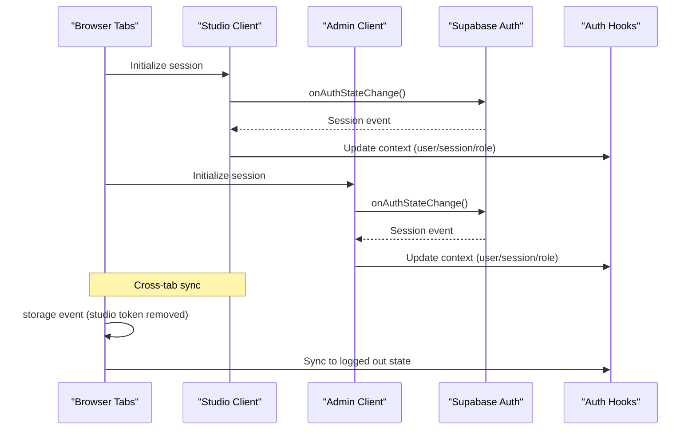
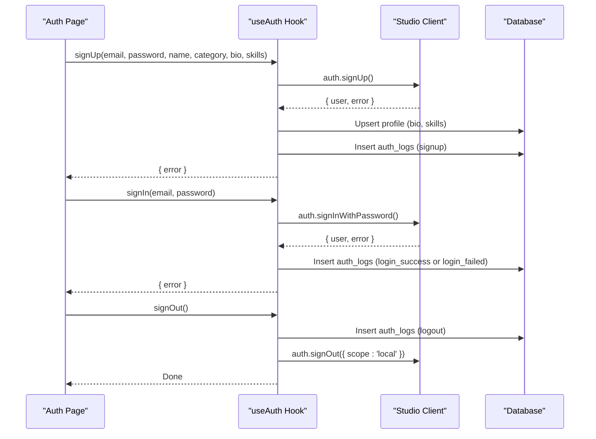
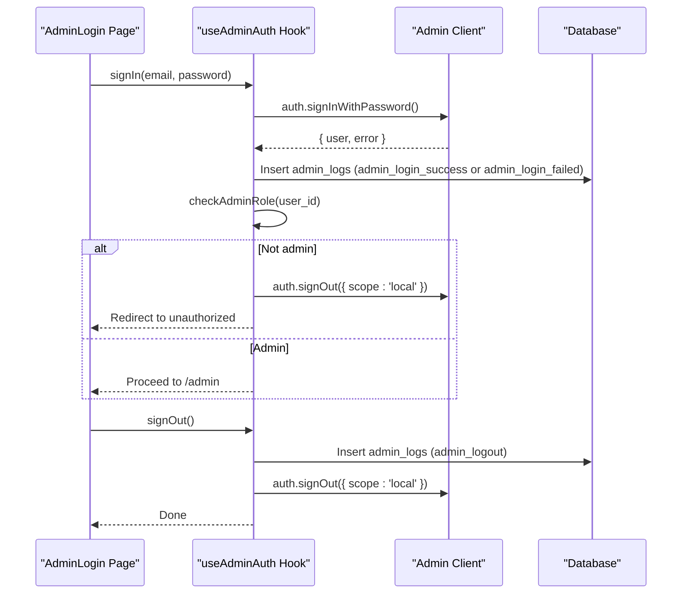
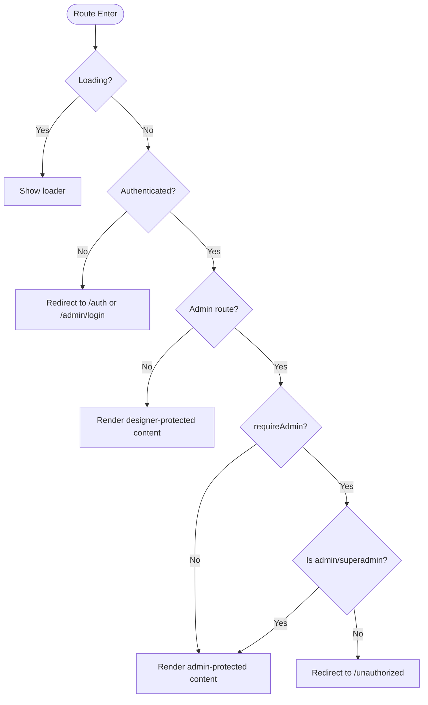
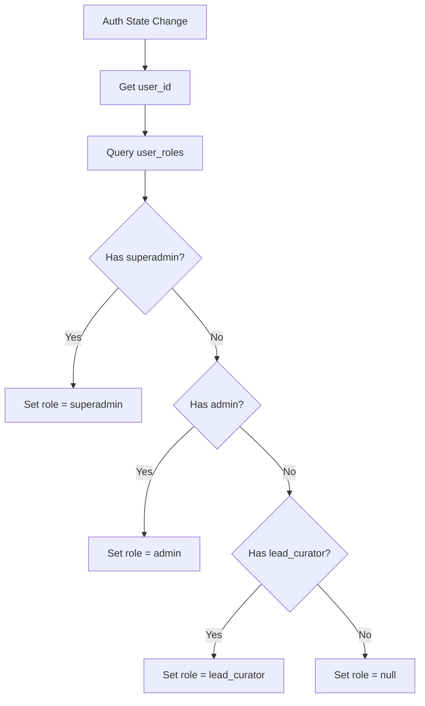
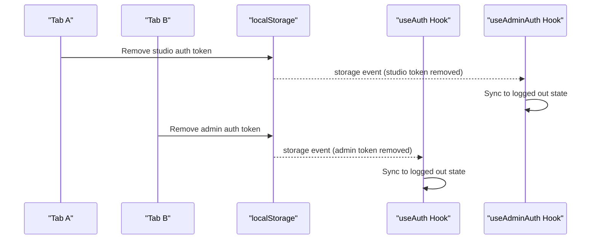
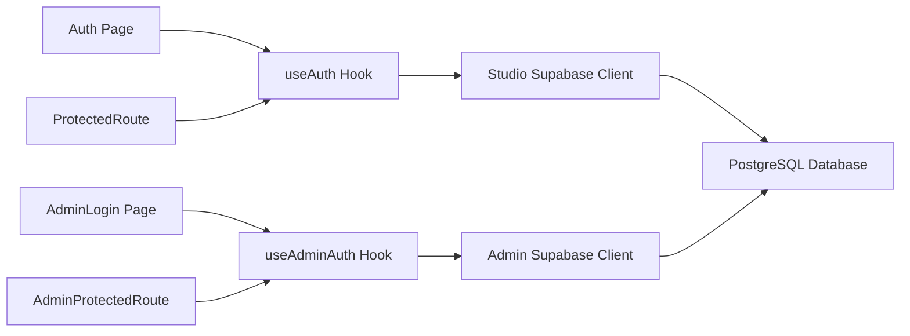

# Authentication & Authorization System

<cite>
**Referenced Files in This Document**
- [src/hooks/useAuth.tsx](file://src/hooks/useAuth.tsx)
- [src/hooks/useAdminAuth.tsx](file://src/hooks/useAdminAuth.tsx)
- [src/components/auth/ProtectedRoute.tsx](file://src/components/auth/ProtectedRoute.tsx)
- [src/components/auth/AdminProtectedRoute.tsx](file://src/components/auth/AdminProtectedRoute.tsx)
- [src/pages/Auth.tsx](file://src/pages/Auth.tsx)
- [src/pages/admin/AdminLogin.tsx](file://src/pages/admin/AdminLogin.tsx)
- [src/integrations/supabase/client.ts](file://src/integrations/supabase/client.ts)
- [src/integrations/supabase/admin-client.ts](file://src/integrations/supabase/admin-client.ts)
- [src/integrations/supabase/types.ts](file://src/integrations/supabase/types.ts)
- [supabase/migrations/20260126000000_add_designer_approval_and_follows.sql](file://supabase/migrations/20260126000000_add_designer_approval_and_follows.sql)
- [supabase/migrations/20260126090000_admin_founding_workflow.sql](file://supabase/migrations/20260126090000_admin_founding_workflow.sql)
- [supabase/migrations/20260126100000_founding_final_refinements.sql](file://supabase/migrations/20260126100000_founding_final_refinements.sql)
</cite>

## Table of Contents
1. [Introduction](#introduction)
2. [Project Structure](#project-structure)
3. [Core Components](#core-components)
4. [Architecture Overview](#architecture-overview)
5. [Detailed Component Analysis](#detailed-component-analysis)
6. [Dependency Analysis](#dependency-analysis)
7. [Performance Considerations](#performance-considerations)
8. [Troubleshooting Guide](#troubleshooting-guide)
9. [Conclusion](#conclusion)
10. [Appendices](#appendices)

## Introduction
This document describes the dual authentication architecture of the Adorzia platform, which supports two distinct user personas:
- Designer users operating within the main studio application
- Administrator users operating within the admin portal

It covers authentication providers, session management, token handling, cross-tab synchronization, role-based access control (RBAC), protected route implementation, security measures, session persistence, password reset flows, and account management features. It also provides integration patterns for extending authenticated features.

## Project Structure
The authentication system is implemented with React hooks and Supabase clients:
- Frontend authentication hooks manage user state, roles, and actions for both designer and admin contexts
- Protected route wrappers enforce access control at the routing level
- Supabase clients are configured with isolated storage for admin sessions
- Backend migrations define user roles and related tables

**Diagram sources**
- [src/hooks/useAuth.tsx](file://src/hooks/useAuth.tsx#L22-L100)
- [src/hooks/useAdminAuth.tsx](file://src/hooks/useAdminAuth.tsx#L21-L99)
- [src/components/auth/ProtectedRoute.tsx](file://src/components/auth/ProtectedRoute.tsx#L11-L41)
- [src/components/auth/AdminProtectedRoute.tsx](file://src/components/auth/AdminProtectedRoute.tsx#L11-L44)
- [src/integrations/supabase/client.ts](file://src/integrations/supabase/client.ts#L11-L17)
- [src/integrations/supabase/admin-client.ts](file://src/integrations/supabase/admin-client.ts#L16-L27)

**Section sources**
- [src/hooks/useAuth.tsx](file://src/hooks/useAuth.tsx#L1-L252)
- [src/hooks/useAdminAuth.tsx](file://src/hooks/useAdminAuth.tsx#L1-L216)
- [src/components/auth/ProtectedRoute.tsx](file://src/components/auth/ProtectedRoute.tsx#L1-L42)
- [src/components/auth/AdminProtectedRoute.tsx](file://src/components/auth/AdminProtectedRoute.tsx#L1-L46)
- [src/integrations/supabase/client.ts](file://src/integrations/supabase/client.ts#L1-L17)
- [src/integrations/supabase/admin-client.ts](file://src/integrations/supabase/admin-client.ts#L1-L28)

## Core Components
- Designer authentication hook: Manages session, role resolution, sign-up/sign-in/sign-out, and cross-tab synchronization
- Admin authentication hook: Manages admin session, role resolution, sign-in/sign-out, and isolation from designer sessions
- Protected routes: Enforce authentication and role checks for designer and admin areas
- Supabase clients: Studio and Admin clients with separate storage keys and scopes
- Admin role model: Supports admin, superadmin, and lead_curator roles

Key responsibilities:
- Role determination via user_roles lookup with precedence
- Cross-tab synchronization using localStorage events
- Logging of auth actions for security and auditing
- Isolation of admin sessions from designer sessions

**Section sources**
- [src/hooks/useAuth.tsx](file://src/hooks/useAuth.tsx#L102-L133)
- [src/hooks/useAdminAuth.tsx](file://src/hooks/useAdminAuth.tsx#L101-L140)
- [src/components/auth/ProtectedRoute.tsx](file://src/components/auth/ProtectedRoute.tsx#L11-L41)
- [src/components/auth/AdminProtectedRoute.tsx](file://src/components/auth/AdminProtectedRoute.tsx#L11-L44)
- [src/integrations/supabase/admin-client.ts](file://src/integrations/supabase/admin-client.ts#L8-L12)

## Architecture Overview
The system uses a dual-client architecture with isolated sessions:
- Studio client persists sessions in localStorage under the default key
- Admin client persists sessions under an admin-prefixed key in localStorage
- Both clients subscribe to Supabase auth state changes and update React contexts accordingly
- Cross-tab synchronization listens for localStorage changes to reflect sign-out actions

**Diagram sources**
- [src/hooks/useAuth.tsx](file://src/hooks/useAuth.tsx#L36-L49)
- [src/hooks/useAdminAuth.tsx](file://src/hooks/useAdminAuth.tsx#L35-L48)
- [src/integrations/supabase/client.ts](file://src/integrations/supabase/client.ts#L11-L17)
- [src/integrations/supabase/admin-client.ts](file://src/integrations/supabase/admin-client.ts#L16-L27)

## Detailed Component Analysis

### Designer Authentication Flow
The designer authentication flow handles sign-up, sign-in, and sign-out with logging and role resolution.

**Diagram sources**
- [src/pages/Auth.tsx](file://src/pages/Auth.tsx#L120-L163)
- [src/hooks/useAuth.tsx](file://src/hooks/useAuth.tsx#L135-L225)
- [src/integrations/supabase/client.ts](file://src/integrations/supabase/client.ts#L11-L17)

**Section sources**
- [src/pages/Auth.tsx](file://src/pages/Auth.tsx#L1-L451)
- [src/hooks/useAuth.tsx](file://src/hooks/useAuth.tsx#L135-L225)

### Admin Authentication Flow
The admin authentication flow enforces role checks and isolates admin sessions.

**Diagram sources**
- [src/pages/admin/AdminLogin.tsx](file://src/pages/admin/AdminLogin.tsx#L32-L68)
- [src/hooks/useAdminAuth.tsx](file://src/hooks/useAdminAuth.tsx#L142-L190)
- [src/integrations/supabase/admin-client.ts](file://src/integrations/supabase/admin-client.ts#L16-L27)

**Section sources**
- [src/pages/admin/AdminLogin.tsx](file://src/pages/admin/AdminLogin.tsx#L1-L158)
- [src/hooks/useAdminAuth.tsx](file://src/hooks/useAdminAuth.tsx#L142-L190)

### Protected Routes
Protected routes enforce authentication and role checks:
- Designer routes: Require authentication; optionally require admin role
- Admin routes: Require admin or superadmin depending on flags

**Diagram sources**
- [src/components/auth/ProtectedRoute.tsx](file://src/components/auth/ProtectedRoute.tsx#L11-L41)
- [src/components/auth/AdminProtectedRoute.tsx](file://src/components/auth/AdminProtectedRoute.tsx#L11-L44)

**Section sources**
- [src/components/auth/ProtectedRoute.tsx](file://src/components/auth/ProtectedRoute.tsx#L1-L42)
- [src/components/auth/AdminProtectedRoute.tsx](file://src/components/auth/AdminProtectedRoute.tsx#L1-L46)

### Role-Based Access Control and Permissions
Roles are resolved from the user_roles table with precedence:
- Designer: lowest privilege
- Admin: elevated privilege
- Superadmin: highest privilege
- Lead Curator: admin-level access

Role resolution occurs after auth state changes and session retrieval. Admin role enforcement prevents non-admin users from accessing admin routes.

**Diagram sources**
- [src/hooks/useAuth.tsx](file://src/hooks/useAuth.tsx#L102-L133)
- [src/hooks/useAdminAuth.tsx](file://src/hooks/useAdminAuth.tsx#L101-L132)

**Section sources**
- [src/hooks/useAuth.tsx](file://src/hooks/useAuth.tsx#L102-L133)
- [src/hooks/useAdminAuth.tsx](file://src/hooks/useAdminAuth.tsx#L101-L132)

### Session Management and Cross-Tab Synchronization
- Studio and Admin clients use separate storage keys and scopes
- Cross-tab sync listens for localStorage changes to detect explicit sign-out
- Token refresh events are ignored to avoid UI flicker

**Diagram sources**
- [src/hooks/useAuth.tsx](file://src/hooks/useAuth.tsx#L36-L49)
- [src/hooks/useAdminAuth.tsx](file://src/hooks/useAdminAuth.tsx#L35-L48)
- [src/integrations/supabase/admin-client.ts](file://src/integrations/supabase/admin-client.ts#L8-L12)

**Section sources**
- [src/hooks/useAuth.tsx](file://src/hooks/useAuth.tsx#L36-L49)
- [src/hooks/useAdminAuth.tsx](file://src/hooks/useAdminAuth.tsx#L35-L48)
- [src/integrations/supabase/admin-client.ts](file://src/integrations/supabase/admin-client.ts#L8-L12)

### Password Reset and Account Management
- Password reset is integrated via Supabase’s built-in flows
- The studio login page links to the reset password route
- Account deletion and related operations are supported by backend functions

Implementation highlights:
- Email-based reset initiation through Supabase auth
- Redirects to reset password page after initiating reset
- Account deletion function exists in backend migrations

**Section sources**
- [src/pages/Auth.tsx](file://src/pages/Auth.tsx#L272-L276)
- [supabase/migrations/20260130000000_add_delete_account_function.sql](file://supabase/migrations/20260130000000_add_delete_account_function.sql)

### Security Measures
- Isolated admin sessions using a dedicated storage key and scope
- Role enforcement at route level and via admin auth hook
- Auth logs for login/signup/logout and failed attempts
- Admin logs for admin actions and logout events
- Cross-tab synchronization to prevent session hijacking

**Section sources**
- [src/integrations/supabase/admin-client.ts](file://src/integrations/supabase/admin-client.ts#L8-L12)
- [src/hooks/useAuth.tsx](file://src/hooks/useAuth.tsx#L165-L201)
- [src/hooks/useAdminAuth.tsx](file://src/hooks/useAdminAuth.tsx#L151-L183)

## Dependency Analysis
The authentication system depends on:
- Supabase client libraries for auth operations
- React context for state propagation
- Protected route wrappers for access control
- Backend tables and policies for role and profile data

**Diagram sources**
- [src/pages/Auth.tsx](file://src/pages/Auth.tsx#L37-L37)
- [src/pages/admin/AdminLogin.tsx](file://src/pages/admin/AdminLogin.tsx#L19-L19)
- [src/hooks/useAuth.tsx](file://src/hooks/useAuth.tsx#L22-L243)
- [src/hooks/useAdminAuth.tsx](file://src/hooks/useAdminAuth.tsx#L21-L207)
- [src/components/auth/ProtectedRoute.tsx](file://src/components/auth/ProtectedRoute.tsx#L15-L15)
- [src/components/auth/AdminProtectedRoute.tsx](file://src/components/auth/AdminProtectedRoute.tsx#L15-L15)
- [src/integrations/supabase/client.ts](file://src/integrations/supabase/client.ts#L11-L17)
- [src/integrations/supabase/admin-client.ts](file://src/integrations/supabase/admin-client.ts#L16-L27)

**Section sources**
- [src/pages/Auth.tsx](file://src/pages/Auth.tsx#L1-L451)
- [src/pages/admin/AdminLogin.tsx](file://src/pages/admin/AdminLogin.tsx#L1-L158)
- [src/hooks/useAuth.tsx](file://src/hooks/useAuth.tsx#L1-L252)
- [src/hooks/useAdminAuth.tsx](file://src/hooks/useAdminAuth.tsx#L1-L216)
- [src/components/auth/ProtectedRoute.tsx](file://src/components/auth/ProtectedRoute.tsx#L1-L42)
- [src/components/auth/AdminProtectedRoute.tsx](file://src/components/auth/AdminProtectedRoute.tsx#L1-L46)
- [src/integrations/supabase/client.ts](file://src/integrations/supabase/client.ts#L1-L17)
- [src/integrations/supabase/admin-client.ts](file://src/integrations/supabase/admin-client.ts#L1-L28)

## Performance Considerations
- Role checks are deferred using setTimeout to avoid blocking auth state updates
- Token refresh events are filtered to prevent unnecessary re-renders
- Cross-tab sync only reacts to explicit sign-out events to minimize overhead
- Logging operations are lightweight inserts to reduce latency impact

[No sources needed since this section provides general guidance]

## Troubleshooting Guide
Common issues and resolutions:
- Cross-tab session desync: Ensure localStorage change listeners are active and scoped to the correct keys
- Admin access denied: Verify user_roles contains the expected role; invalid access triggers automatic sign-out from admin scope
- Role not updating: Confirm role resolution runs after auth state change and session retrieval complete
- Duplicate sessions: Confirm admin client uses a separate storage key and scope

**Section sources**
- [src/hooks/useAuth.tsx](file://src/hooks/useAuth.tsx#L36-L49)
- [src/hooks/useAdminAuth.tsx](file://src/hooks/useAdminAuth.tsx#L134-L140)
- [src/integrations/supabase/admin-client.ts](file://src/integrations/supabase/admin-client.ts#L8-L12)

## Conclusion
The Adorzia platform implements a robust dual authentication system with:
- Clear separation between designer and admin sessions
- Strong role-based access control enforced at the route level
- Comprehensive logging for security and auditing
- Reliable cross-tab synchronization and session persistence
- Extensible patterns for adding new authenticated features

[No sources needed since this section summarizes without analyzing specific files]

## Appendices

### Implementation Examples and Integration Patterns
- Adding a new designer-protected route:
  - Wrap the route with ProtectedRoute and set requireAdmin=false
  - Use useAuth to access user, session, and role flags
- Adding a new admin-protected route:
  - Wrap the route with AdminProtectedRoute
  - Use requireSuperadmin=true for superadmin-only routes
- Integrating a new auth action:
  - Extend the respective hook (useAuth or useAdminAuth) with a new method
  - Ensure proper logging and error handling
- Managing roles:
  - Update user_roles in the database
  - Rely on the hooks’ role resolution logic

**Section sources**
- [src/components/auth/ProtectedRoute.tsx](file://src/components/auth/ProtectedRoute.tsx#L11-L41)
- [src/components/auth/AdminProtectedRoute.tsx](file://src/components/auth/AdminProtectedRoute.tsx#L11-L44)
- [src/hooks/useAuth.tsx](file://src/hooks/useAuth.tsx#L102-L133)
- [src/hooks/useAdminAuth.tsx](file://src/hooks/useAdminAuth.tsx#L101-L132)