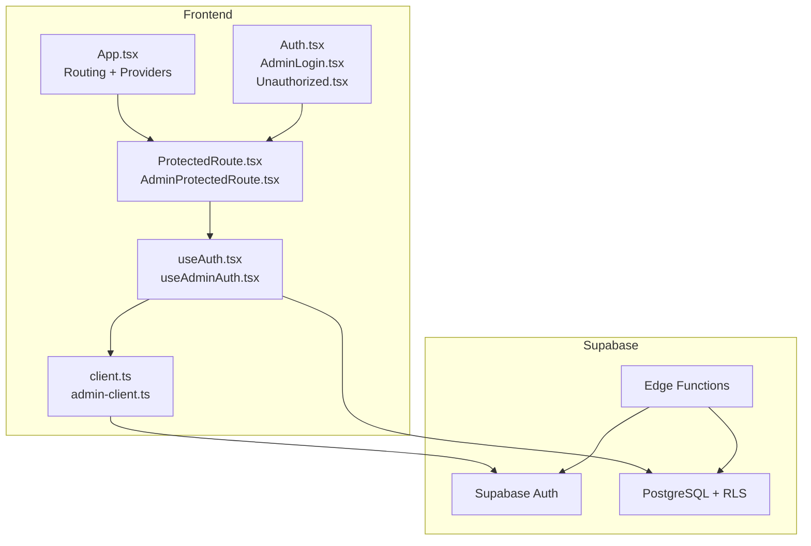
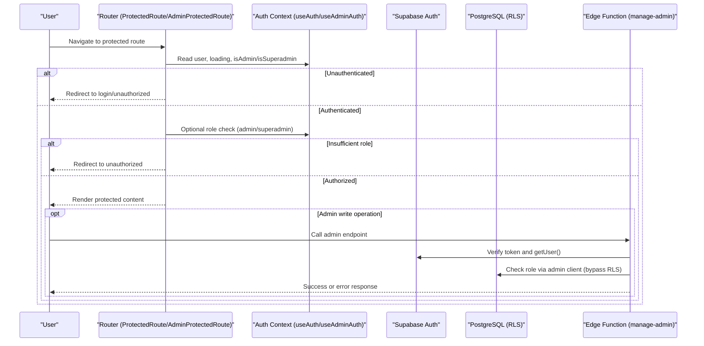
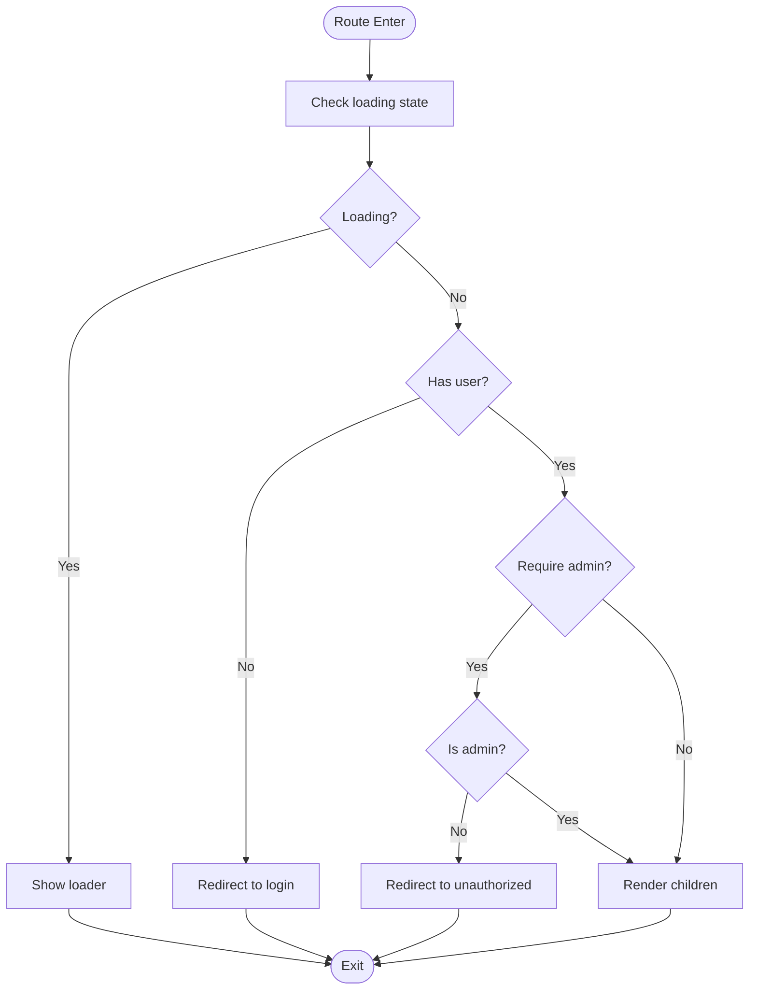
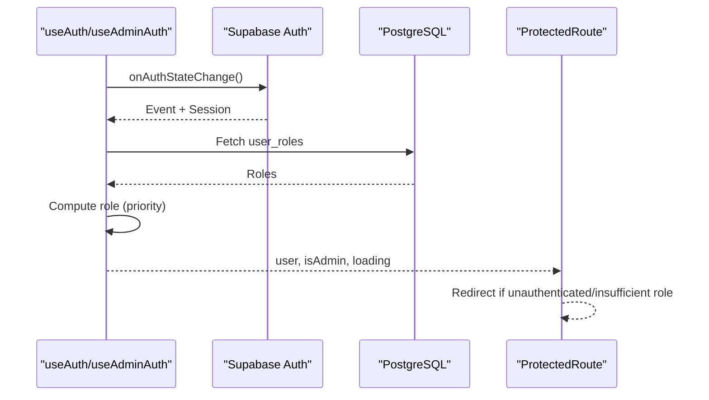
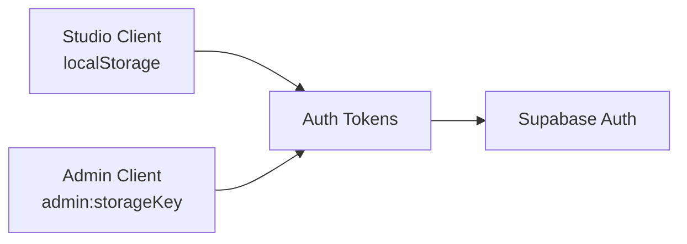
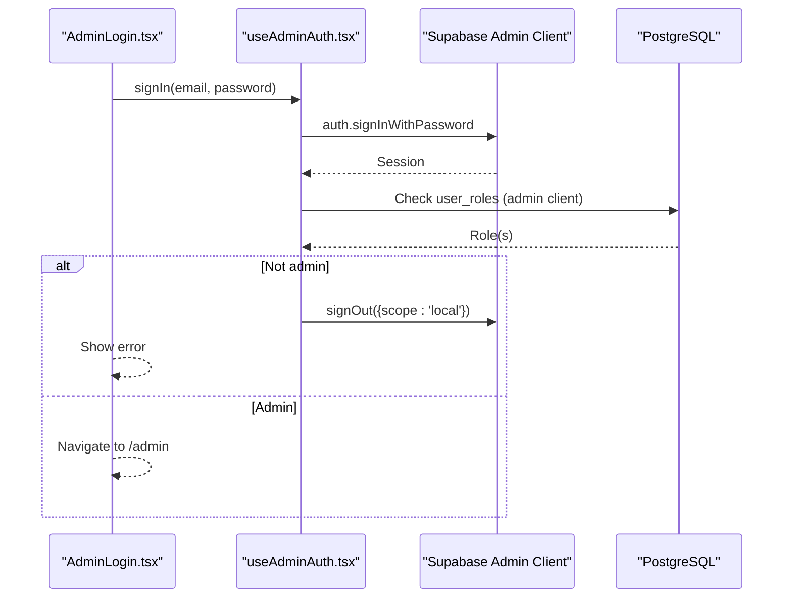
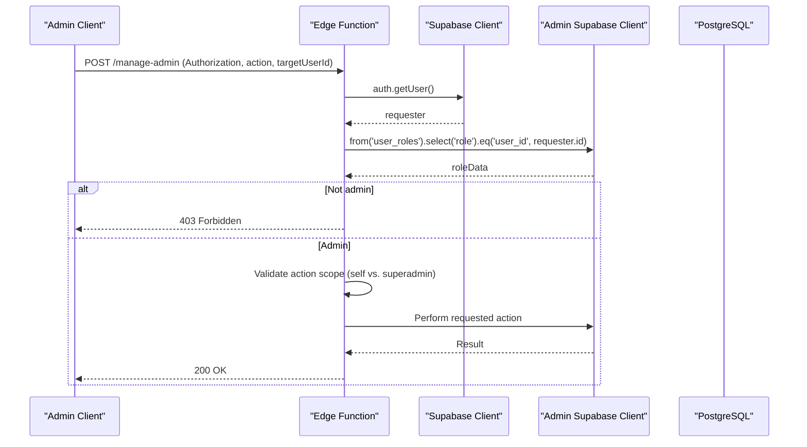
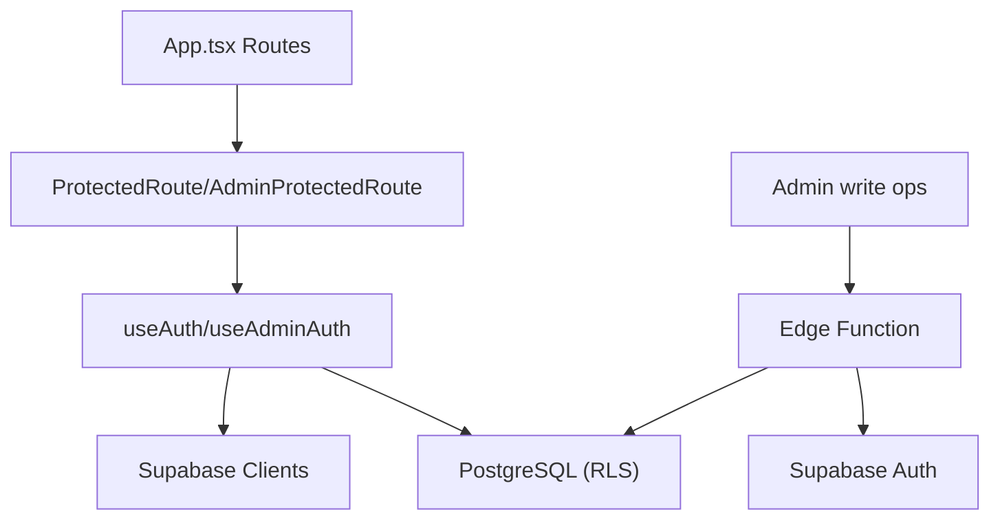

# Authorization & Security

<cite>
**Referenced Files in This Document**
- [App.tsx](file://src/App.tsx)
- [ProtectedRoute.tsx](file://src/components/auth/ProtectedRoute.tsx)
- [AdminProtectedRoute.tsx](file://src/components/auth/AdminProtectedRoute.tsx)
- [useAuth.tsx](file://src/hooks/useAuth.tsx)
- [useAdminAuth.tsx](file://src/hooks/useAdminAuth.tsx)
- [client.ts](file://src/integrations/supabase/client.ts)
- [admin-client.ts](file://src/integrations/supabase/admin-client.ts)
- [AdminLogin.tsx](file://src/pages/admin/AdminLogin.tsx)
- [Auth.tsx](file://src/pages/Auth.tsx)
- [Unauthorized.tsx](file://src/pages/Unauthorized.tsx)
- [manage-admin/index.ts](file://supabase/functions/manage-admin/index.ts)
- [20260126000000_add_designer_approval_and_follows.sql](file://supabase/migrations/20260126000000_add_designer_approval_and_follows.sql)
</cite>

## Table of Contents
1. [Introduction](#introduction)
2. [Project Structure](#project-structure)
3. [Core Components](#core-components)
4. [Architecture Overview](#architecture-overview)
5. [Detailed Component Analysis](#detailed-component-analysis)
6. [Dependency Analysis](#dependency-analysis)
7. [Performance Considerations](#performance-considerations)
8. [Troubleshooting Guide](#troubleshooting-guide)
9. [Conclusion](#conclusion)
10. [Appendices](#appendices)

## Introduction
This document details the authorization and security framework of the application. It explains role-based access control (RBAC), permission systems, and security policies implemented across the frontend and backend. It covers protected route components, authentication guards, session validation, token handling, session persistence, and secure communication. It also documents audit logging and monitoring capabilities, and provides practical guidance for implementing authorization checks, protecting API endpoints, and handling unauthorized access attempts.

## Project Structure
The security model is implemented through:
- Frontend routing guards that enforce RBAC and redirect unauthenticated or unauthorized users.
- Two separate authentication contexts: one for the designer/studio portal and one for the admin portal.
- Supabase clients configured with isolated storage for admin sessions.
- Backend Edge Functions that validate tokens and enforce role-based permissions for privileged operations.
- Database Row Level Security (RLS) policies to protect data access.

**Diagram sources**
- [App.tsx](file://src/App.tsx#L112-L347)
- [ProtectedRoute.tsx](file://src/components/auth/ProtectedRoute.tsx#L1-L42)
- [AdminProtectedRoute.tsx](file://src/components/auth/AdminProtectedRoute.tsx#L1-L46)
- [useAuth.tsx](file://src/hooks/useAuth.tsx#L1-L252)
- [useAdminAuth.tsx](file://src/hooks/useAdminAuth.tsx#L1-L216)
- [client.ts](file://src/integrations/supabase/client.ts#L1-L17)
- [admin-client.ts](file://src/integrations/supabase/admin-client.ts#L1-L28)
- [Auth.tsx](file://src/pages/Auth.tsx#L1-L451)
- [AdminLogin.tsx](file://src/pages/admin/AdminLogin.tsx#L1-L158)
- [Unauthorized.tsx](file://src/pages/Unauthorized.tsx#L1-L74)

**Section sources**
- [App.tsx](file://src/App.tsx#L112-L347)

## Core Components
- ProtectedRoute: Enforces authentication for studio routes and optionally requires admin privileges.
- AdminProtectedRoute: Enforces authentication for admin routes, supports requiring superadmin.
- useAuth: Centralizes authentication state, role detection, and logs auth actions.
- useAdminAuth: Centralizes admin authentication state, role detection, and logs admin actions.
- Supabase clients: Studio client persists sessions; Admin client uses isolated storage to prevent session overlap.
- Edge Function manage-admin: Validates tokens, checks roles, enforces action scoping (self vs. superadmin).

**Section sources**
- [ProtectedRoute.tsx](file://src/components/auth/ProtectedRoute.tsx#L1-L42)
- [AdminProtectedRoute.tsx](file://src/components/auth/AdminProtectedRoute.tsx#L1-L46)
- [useAuth.tsx](file://src/hooks/useAuth.tsx#L1-L252)
- [useAdminAuth.tsx](file://src/hooks/useAdminAuth.tsx#L1-L216)
- [client.ts](file://src/integrations/supabase/client.ts#L1-L17)
- [admin-client.ts](file://src/integrations/supabase/admin-client.ts#L1-L28)
- [manage-admin/index.ts](file://supabase/functions/manage-admin/index.ts#L1-L148)

## Architecture Overview
The system separates studio and admin authentication domains to reduce risk of cross-session compromise. Studio and admin portals share Supabase Auth but use distinct clients and storage keys. Admin operations are performed via Edge Functions that bypass RLS for administrative tasks while enforcing strict role checks.

**Diagram sources**
- [ProtectedRoute.tsx](file://src/components/auth/ProtectedRoute.tsx#L11-L41)
- [AdminProtectedRoute.tsx](file://src/components/auth/AdminProtectedRoute.tsx#L11-L44)
- [useAuth.tsx](file://src/hooks/useAuth.tsx#L51-L100)
- [useAdminAuth.tsx](file://src/hooks/useAdminAuth.tsx#L50-L99)
- [manage-admin/index.ts](file://supabase/functions/manage-admin/index.ts#L37-L61)

## Detailed Component Analysis

### Authentication Guards and Protected Routes
- ProtectedRoute enforces:
  - Authentication for studio routes.
  - Optional admin requirement for admin-only routes.
  - Redirects to login or unauthorized pages accordingly.
- AdminProtectedRoute enforces:
  - Admin authentication for admin routes.
  - Optional superadmin requirement.
  - Redirects to unauthorized when insufficient privileges.

**Diagram sources**
- [ProtectedRoute.tsx](file://src/components/auth/ProtectedRoute.tsx#L11-L41)
- [AdminProtectedRoute.tsx](file://src/components/auth/AdminProtectedRoute.tsx#L11-L44)

**Section sources**
- [ProtectedRoute.tsx](file://src/components/auth/ProtectedRoute.tsx#L1-L42)
- [AdminProtectedRoute.tsx](file://src/components/auth/AdminProtectedRoute.tsx#L1-L46)
- [Unauthorized.tsx](file://src/pages/Unauthorized.tsx#L1-L74)

### Authentication Contexts and Session Validation
- useAuth:
  - Subscribes to Supabase auth state changes.
  - Detects user role by querying user_roles and prioritizing superadmin > admin > designer.
  - Logs signup, login success/failure, and logout events to auth_logs.
  - Syncs auth state across browser tabs and ignores benign token refresh events.
- useAdminAuth:
  - Similar pattern for admin portal with separate storage key.
  - Enforces admin-only access; invalidates session if user lacks admin role.
  - Logs admin login/logout to admin_logs.

**Diagram sources**
- [useAuth.tsx](file://src/hooks/useAuth.tsx#L51-L133)
- [useAdminAuth.tsx](file://src/hooks/useAdminAuth.tsx#L50-L140)

**Section sources**
- [useAuth.tsx](file://src/hooks/useAuth.tsx#L1-L252)
- [useAdminAuth.tsx](file://src/hooks/useAdminAuth.tsx#L1-L216)

### Token Handling and Session Persistence
- Studio client:
  - Uses localStorage with auto-refresh and persisted sessions.
- Admin client:
  - Uses a custom storage adapter with a prefixed key to isolate admin sessions from studio sessions.
- Both clients rely on Supabase Auth for token management and automatic refresh.

**Diagram sources**
- [client.ts](file://src/integrations/supabase/client.ts#L11-L17)
- [admin-client.ts](file://src/integrations/supabase/admin-client.ts#L8-L27)

**Section sources**
- [client.ts](file://src/integrations/supabase/client.ts#L1-L17)
- [admin-client.ts](file://src/integrations/supabase/admin-client.ts#L1-L28)

### Admin Login and Role Validation
- AdminLogin validates input, signs in via useAdminAuth, and navigates after role verification completes.
- useAdminAuth checks user_roles and denies access for non-admins by signing them out locally.

**Diagram sources**
- [AdminLogin.tsx](file://src/pages/admin/AdminLogin.tsx#L32-L68)
- [useAdminAuth.tsx](file://src/hooks/useAdminAuth.tsx#L101-L140)

**Section sources**
- [AdminLogin.tsx](file://src/pages/admin/AdminLogin.tsx#L1-L158)
- [useAdminAuth.tsx](file://src/hooks/useAdminAuth.tsx#L1-L216)

### Protecting API Endpoints with Edge Functions
- manage-admin validates Authorization header, verifies token, checks role via admin client, and enforces action scoping:
  - Self-only updates for standard admins.
  - Superadmin-only creation of new admins.
- Returns structured JSON responses with CORS headers.

**Diagram sources**
- [manage-admin/index.ts](file://supabase/functions/manage-admin/index.ts#L14-L147)

**Section sources**
- [manage-admin/index.ts](file://supabase/functions/manage-admin/index.ts#L1-L148)

### Database Security and RLS Policies
- RLS policies on tables like designer_follows permit selective operations based on the authenticated user ID.
- Utility functions and indexes support search and analytics while maintaining security boundaries.

**Section sources**
- [20260126000000_add_designer_approval_and_follows.sql](file://supabase/migrations/20260126000000_add_designer_approval_and_follows.sql#L1-L136)

## Dependency Analysis
- Routing depends on guard components to enforce access.
- Guard components depend on authentication contexts for user and role state.
- Authentication contexts depend on Supabase clients and database role lookup.
- Admin write operations depend on Edge Functions for role validation and enforcement.

**Diagram sources**
- [App.tsx](file://src/App.tsx#L112-L347)
- [ProtectedRoute.tsx](file://src/components/auth/ProtectedRoute.tsx#L1-L42)
- [AdminProtectedRoute.tsx](file://src/components/auth/AdminProtectedRoute.tsx#L1-L46)
- [useAuth.tsx](file://src/hooks/useAuth.tsx#L1-L252)
- [useAdminAuth.tsx](file://src/hooks/useAdminAuth.tsx#L1-L216)
- [manage-admin/index.ts](file://supabase/functions/manage-admin/index.ts#L1-L148)

**Section sources**
- [App.tsx](file://src/App.tsx#L112-L347)

## Performance Considerations
- Auth state subscriptions avoid redundant role checks by caching session and role state.
- Token refresh events are filtered to prevent UI flicker during routine refresh cycles.
- Admin role checks use immediate async dispatch to prevent blocking the render loop.
- Edge Function role checks leverage the admin client to bypass RLS for trusted operations.

[No sources needed since this section provides general guidance]

## Troubleshooting Guide
Common scenarios and resolutions:
- Redirect loops on protected routes:
  - Ensure AuthProvider/AdminAuthProvider wrap the routes and that guards are applied correctly.
- Unauthorized access errors:
  - Confirm user has required role; AdminProtectedRoute with requireSuperadmin will redirect non-superadmins.
- Admin login succeeds but access denied:
  - useAdminAuth signs out non-admins locally; verify user_roles table membership.
- Audit logs not appearing:
  - Check auth_logs/admin_logs insertions in sign-in/sign-out flows and Edge Function handlers.
- Cross-session contamination:
  - Admin client uses isolated storage; confirm admin: prefix keys are present and not shared with studio client.

**Section sources**
- [ProtectedRoute.tsx](file://src/components/auth/ProtectedRoute.tsx#L1-L42)
- [AdminProtectedRoute.tsx](file://src/components/auth/AdminProtectedRoute.tsx#L1-L46)
- [useAuth.tsx](file://src/hooks/useAuth.tsx#L164-L225)
- [useAdminAuth.tsx](file://src/hooks/useAdminAuth.tsx#L134-L190)
- [manage-admin/index.ts](file://supabase/functions/manage-admin/index.ts#L140-L147)

## Conclusion
The application implements a robust, layered security model:
- Clear separation of studio and admin authentication domains.
- Strong RBAC enforced at the router and backend.
- Comprehensive audit logging for authentication and admin actions.
- Secure session handling with isolated storage for admin sessions.
- RLS policies and Edge Functions enforce strict access controls for sensitive operations.

[No sources needed since this section summarizes without analyzing specific files]

## Appendices

### Implementing Authorization Checks
- For studio routes:
  - Wrap components with ProtectedRoute and set requireAdmin=false for general designer access.
  - Set requireAdmin=true for admin-only routes; ProtectedRoute will redirect to unauthorized if insufficient role.
- For admin routes:
  - Use AdminProtectedRoute; set requireSuperadmin=true for superadmin-only routes.
  - AdminProtectedRoute redirects to unauthorized if user lacks admin privileges.

**Section sources**
- [ProtectedRoute.tsx](file://src/components/auth/ProtectedRoute.tsx#L6-L41)
- [AdminProtectedRoute.tsx](file://src/components/auth/AdminProtectedRoute.tsx#L6-L44)
- [App.tsx](file://src/App.tsx#L241-L338)

### Protecting API Endpoints
- Use Edge Functions for privileged operations:
  - Validate Authorization header and fetch requester via Supabase client.
  - Re-validate role using admin client against user_roles.
  - Enforce action scoping (self-only vs. superadmin).
  - Return structured JSON responses with appropriate status codes.

**Section sources**
- [manage-admin/index.ts](file://supabase/functions/manage-admin/index.ts#L14-L147)

### Handling Unauthorized Access Attempts
- Unauthorized page displays contextual messaging depending on whether the user is authenticated and the attempted route.
- Guards redirect to unauthorized with state indicating attempted path and required role.

**Section sources**
- [Unauthorized.tsx](file://src/pages/Unauthorized.tsx#L1-L74)
- [ProtectedRoute.tsx](file://src/components/auth/ProtectedRoute.tsx#L35-L38)
- [AdminProtectedRoute.tsx](file://src/components/auth/AdminProtectedRoute.tsx#L34-L42)

### Security Best Practices
- Keep Supabase service role keys secret and restrict Edge Function access.
- Prefer admin client for privileged backend operations to bypass RLS intentionally.
- Log all authentication and admin actions for auditability.
- Use isolated storage for admin sessions to prevent hijacking.
- Validate and sanitize all inputs on the server side.

[No sources needed since this section provides general guidance]