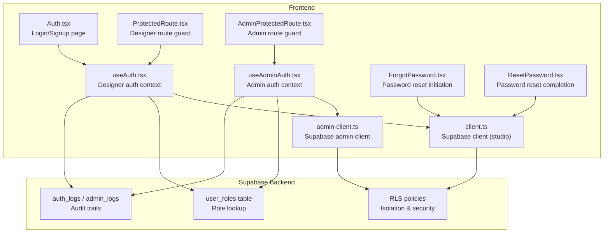
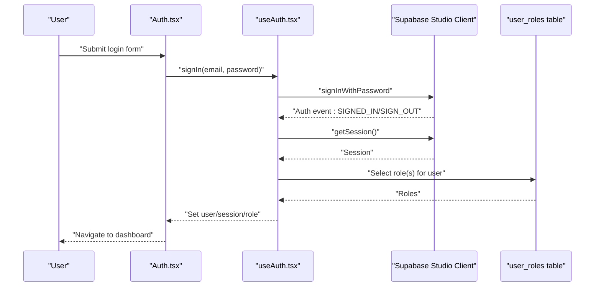
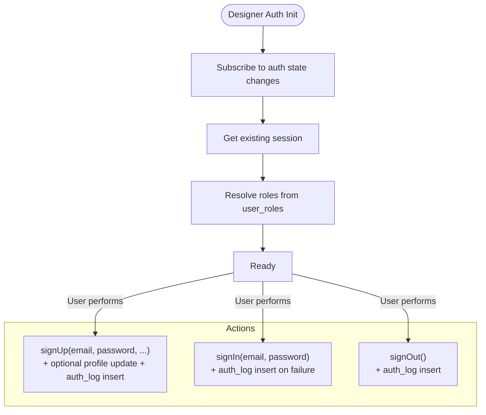
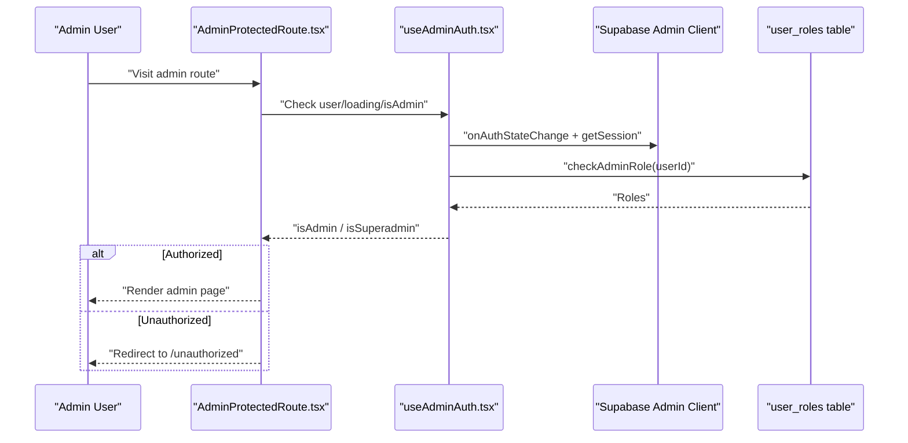
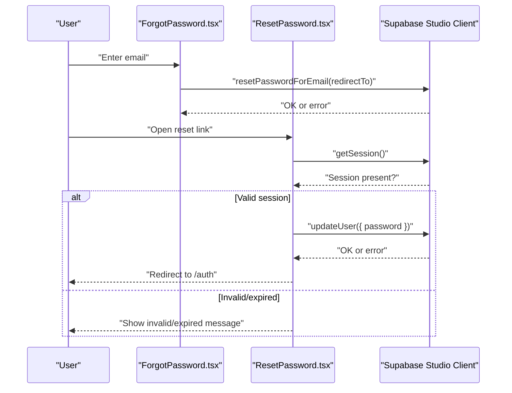
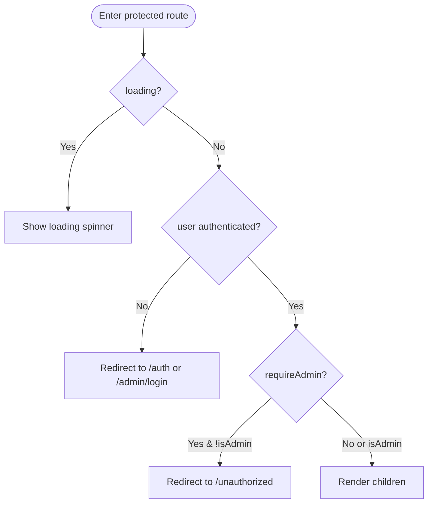
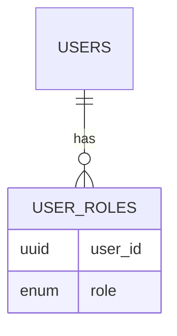
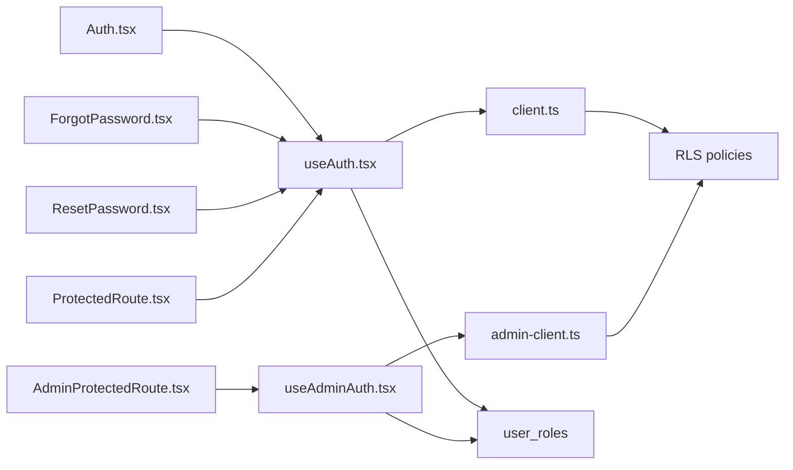

# Designer Authentication

<cite>
**Referenced Files in This Document**
- [useAuth.tsx](file://src/hooks/useAuth.tsx)
- [useAdminAuth.tsx](file://src/hooks/useAdminAuth.tsx)
- [client.ts](file://src/integrations/supabase/client.ts)
- [admin-client.ts](file://src/integrations/supabase/admin-client.ts)
- [Auth.tsx](file://src/pages/Auth.tsx)
- [ForgotPassword.tsx](file://src/pages/ForgotPassword.tsx)
- [ResetPassword.tsx](file://src/pages/ResetPassword.tsx)
- [ProtectedRoute.tsx](file://src/components/auth/ProtectedRoute.tsx)
- [AdminProtectedRoute.tsx](file://src/components/auth/AdminProtectedRoute.tsx)
- [20260126040000_admin_auth_security.sql](file://supabase/migrations/20260126040000_admin_auth_security.sql)
- [20260126050000_bootstrap_superadmin.sql](file://supabase/migrations/20260126050000_bootstrap_superadmin.sql)
- [20260126060000_isolate_admin_auth.sql](file://supabase/migrations/20260126060000_isolate_admin_auth.sql)
</cite>

## Table of Contents
1. [Introduction](#introduction)
2. [Project Structure](#project-structure)
3. [Core Components](#core-components)
4. [Architecture Overview](#architecture-overview)
5. [Detailed Component Analysis](#detailed-component-analysis)
6. [Dependency Analysis](#dependency-analysis)
7. [Performance Considerations](#performance-considerations)
8. [Troubleshooting Guide](#troubleshooting-guide)
9. [Conclusion](#conclusion)

## Introduction
This document describes the designer authentication system, covering the complete authentication lifecycle: user registration, login, password reset, and session management. It explains role-based access control (RBAC) with designer privileges and how it integrates with the Supabase authentication system. It also documents multi-tab synchronization, session persistence, and real-time auth state updates. Implementation examples for sign-up forms, login components, and protected route handling are included, along with error handling, security measures, and user experience patterns.

## Project Structure
The authentication system spans frontend hooks, pages, routing guards, and Supabase clients, plus backend migrations that enforce RBAC and secure logging.

**Diagram sources**
- [useAuth.tsx](file://src/hooks/useAuth.tsx#L1-L252)
- [useAdminAuth.tsx](file://src/hooks/useAdminAuth.tsx#L1-L216)
- [client.ts](file://src/integrations/supabase/client.ts#L1-L17)
- [admin-client.ts](file://src/integrations/supabase/admin-client.ts#L1-L28)
- [Auth.tsx](file://src/pages/Auth.tsx#L1-L451)
- [ForgotPassword.tsx](file://src/pages/ForgotPassword.tsx#L1-L147)
- [ResetPassword.tsx](file://src/pages/ResetPassword.tsx#L1-L200)
- [ProtectedRoute.tsx](file://src/components/auth/ProtectedRoute.tsx#L1-L42)
- [AdminProtectedRoute.tsx](file://src/components/auth/AdminProtectedRoute.tsx#L1-L46)
- [20260126040000_admin_auth_security.sql](file://supabase/migrations/20260126040000_admin_auth_security.sql#L1-L79)
- [20260126050000_bootstrap_superadmin.sql](file://supabase/migrations/20260126050000_bootstrap_superadmin.sql#L1-L84)
- [20260126060000_isolate_admin_auth.sql](file://supabase/migrations/20260126060000_isolate_admin_auth.sql#L1-L96)

**Section sources**
- [useAuth.tsx](file://src/hooks/useAuth.tsx#L1-L252)
- [useAdminAuth.tsx](file://src/hooks/useAdminAuth.tsx#L1-L216)
- [client.ts](file://src/integrations/supabase/client.ts#L1-L17)
- [admin-client.ts](file://src/integrations/supabase/admin-client.ts#L1-L28)
- [Auth.tsx](file://src/pages/Auth.tsx#L1-L451)
- [ForgotPassword.tsx](file://src/pages/ForgotPassword.tsx#L1-L147)
- [ResetPassword.tsx](file://src/pages/ResetPassword.tsx#L1-L200)
- [ProtectedRoute.tsx](file://src/components/auth/ProtectedRoute.tsx#L1-L42)
- [AdminProtectedRoute.tsx](file://src/components/auth/AdminProtectedRoute.tsx#L1-L46)

## Core Components
- Designer auth context: Provides sign-up, sign-in, sign-out, role resolution, and multi-tab synchronization.
- Admin auth context: Provides admin sign-in/out, role resolution, and isolation from designer sessions.
- Supabase clients: Studio client persists sessions in localStorage; Admin client uses a prefixed storage adapter to keep sessions separate.
- Pages: Login/signup form, forgot password, and reset password flows.
- Route guards: Designer and admin protected routes with loading states and redirects.

Key responsibilities:
- Real-time auth state updates via Supabase listeners.
- Role resolution from a centralized user_roles table.
- Isolated admin sessions to prevent cross-session hijacking.
- Audit logging for auth actions.

**Section sources**
- [useAuth.tsx](file://src/hooks/useAuth.tsx#L1-L252)
- [useAdminAuth.tsx](file://src/hooks/useAdminAuth.tsx#L1-L216)
- [client.ts](file://src/integrations/supabase/client.ts#L1-L17)
- [admin-client.ts](file://src/integrations/supabase/admin-client.ts#L1-L28)
- [Auth.tsx](file://src/pages/Auth.tsx#L1-L451)
- [ForgotPassword.tsx](file://src/pages/ForgotPassword.tsx#L1-L147)
- [ResetPassword.tsx](file://src/pages/ResetPassword.tsx#L1-L200)
- [ProtectedRoute.tsx](file://src/components/auth/ProtectedRoute.tsx#L1-L42)
- [AdminProtectedRoute.tsx](file://src/components/auth/AdminProtectedRoute.tsx#L1-L46)

## Architecture Overview
The system uses two Supabase clients:
- Studio client: Persists sessions in localStorage and listens for auth state changes.
- Admin client: Uses a custom storage adapter with a distinct key prefix to maintain completely separate sessions.

Auth state listeners update context state and resolve roles from the user_roles table. Multi-tab synchronization listens for localStorage changes to reflect explicit sign-outs across tabs. Protected routes enforce authentication and role checks before rendering.

**Diagram sources**
- [Auth.tsx](file://src/pages/Auth.tsx#L84-L118)
- [useAuth.tsx](file://src/hooks/useAuth.tsx#L177-L207)
- [client.ts](file://src/integrations/supabase/client.ts#L1-L17)
- [20260126040000_admin_auth_security.sql](file://supabase/migrations/20260126040000_admin_auth_security.sql#L18-L26)

**Section sources**
- [useAuth.tsx](file://src/hooks/useAuth.tsx#L51-L100)
- [client.ts](file://src/integrations/supabase/client.ts#L11-L17)
- [Auth.tsx](file://src/pages/Auth.tsx#L84-L118)

## Detailed Component Analysis

### Designer Authentication Flow
- Registration: The hook triggers Supabase sign-up, optionally updates profile metadata, and logs the action.
- Login: Validates credentials, logs success/failure, and navigates on success.
- Logout: Logs the action and signs out from the studio session only.
- Role resolution: Queries user_roles to determine highest privilege (superadmin > admin > designer).
- Multi-tab sync: Listens for localStorage changes to reflect explicit sign-outs across tabs.

**Diagram sources**
- [useAuth.tsx](file://src/hooks/useAuth.tsx#L135-L225)
- [client.ts](file://src/integrations/supabase/client.ts#L1-L17)

**Section sources**
- [useAuth.tsx](file://src/hooks/useAuth.tsx#L135-L225)

### Admin Authentication Flow
- Admin login: Uses the admin client to sign in and resolves roles from user_roles.
- Role enforcement: If unauthenticated or unauthorized, forces sign-out from the admin scope.
- Isolation: Admin client uses a custom storage adapter with a distinct key prefix to avoid conflicts with designer sessions.

**Diagram sources**
- [AdminProtectedRoute.tsx](file://src/components/auth/AdminProtectedRoute.tsx#L11-L45)
- [useAdminAuth.tsx](file://src/hooks/useAdminAuth.tsx#L50-L140)
- [admin-client.ts](file://src/integrations/supabase/admin-client.ts#L7-L27)
- [20260126040000_admin_auth_security.sql](file://supabase/migrations/20260126040000_admin_auth_security.sql#L18-L26)

**Section sources**
- [useAdminAuth.tsx](file://src/hooks/useAdminAuth.tsx#L50-L140)
- [admin-client.ts](file://src/integrations/supabase/admin-client.ts#L7-L27)

### Password Reset Flow
- Initiate reset: Sends a reset email with a redirect to the reset page.
- Validate session: Ensures the user has a valid session before allowing password change.
- Apply new password: Updates the user’s password and redirects to login.

**Diagram sources**
- [ForgotPassword.tsx](file://src/pages/ForgotPassword.tsx#L22-L57)
- [ResetPassword.tsx](file://src/pages/ResetPassword.tsx#L29-L78)
- [client.ts](file://src/integrations/supabase/client.ts#L1-L17)

**Section sources**
- [ForgotPassword.tsx](file://src/pages/ForgotPassword.tsx#L22-L57)
- [ResetPassword.tsx](file://src/pages/ResetPassword.tsx#L29-L78)

### Protected Routes and UX Patterns
- Designer routes: Guard against unauthenticated users and enforce admin requirement when configured.
- Admin routes: Guard against unauthenticated users, enforce admin or superadmin when configured.
- Loading states: Render a spinner while auth state is resolving.
- Redirects: Preserve original destination for seamless re-navigation after login.

**Diagram sources**
- [ProtectedRoute.tsx](file://src/components/auth/ProtectedRoute.tsx#L11-L41)
- [AdminProtectedRoute.tsx](file://src/components/auth/AdminProtectedRoute.tsx#L11-L45)

**Section sources**
- [ProtectedRoute.tsx](file://src/components/auth/ProtectedRoute.tsx#L11-L41)
- [AdminProtectedRoute.tsx](file://src/components/auth/AdminProtectedRoute.tsx#L11-L45)

### Role-Based Access Control (RBAC)
- Role model: Roles are stored in user_roles with priority: superadmin > admin > designer.
- Function-level enforcement: Admin-only functions validate caller roles inside the function.
- RLS policies: Restrict access to logs and admin data to authorized roles.
- Isolation: Admin and designer sessions are isolated via separate storage keys.

**Diagram sources**
- [20260126040000_admin_auth_security.sql](file://supabase/migrations/20260126040000_admin_auth_security.sql#L18-L26)
- [20260126050000_bootstrap_superadmin.sql](file://supabase/migrations/20260126050000_bootstrap_superadmin.sql#L62-L64)
- [20260126060000_isolate_admin_auth.sql](file://supabase/migrations/20260126060000_isolate_admin_auth.sql#L18-L30)

**Section sources**
- [useAuth.tsx](file://src/hooks/useAuth.tsx#L102-L133)
- [useAdminAuth.tsx](file://src/hooks/useAdminAuth.tsx#L101-L132)
- [20260126040000_admin_auth_security.sql](file://supabase/migrations/20260126040000_admin_auth_security.sql#L18-L26)
- [20260126050000_bootstrap_superadmin.sql](file://supabase/migrations/20260126050000_bootstrap_superadmin.sql#L62-L64)
- [20260126060000_isolate_admin_auth.sql](file://supabase/migrations/20260126060000_isolate_admin_auth.sql#L18-L30)

## Dependency Analysis
- Frontend hooks depend on Supabase clients for auth operations and real-time state.
- Pages depend on hooks for form submission and navigation.
- Route guards depend on hooks for auth state and role checks.
- Backend depends on user_roles and RLS policies for access control.

**Diagram sources**
- [Auth.tsx](file://src/pages/Auth.tsx#L35-L118)
- [ForgotPassword.tsx](file://src/pages/ForgotPassword.tsx#L16-L57)
- [ResetPassword.tsx](file://src/pages/ResetPassword.tsx#L20-L78)
- [ProtectedRoute.tsx](file://src/components/auth/ProtectedRoute.tsx#L11-L41)
- [AdminProtectedRoute.tsx](file://src/components/auth/AdminProtectedRoute.tsx#L11-L45)
- [useAuth.tsx](file://src/hooks/useAuth.tsx#L1-L252)
- [useAdminAuth.tsx](file://src/hooks/useAdminAuth.tsx#L1-L216)
- [client.ts](file://src/integrations/supabase/client.ts#L1-L17)
- [admin-client.ts](file://src/integrations/supabase/admin-client.ts#L1-L28)
- [20260126040000_admin_auth_security.sql](file://supabase/migrations/20260126040000_admin_auth_security.sql#L61-L79)

**Section sources**
- [useAuth.tsx](file://src/hooks/useAuth.tsx#L1-L252)
- [useAdminAuth.tsx](file://src/hooks/useAdminAuth.tsx#L1-L216)
- [client.ts](file://src/integrations/supabase/client.ts#L1-L17)
- [admin-client.ts](file://src/integrations/supabase/admin-client.ts#L1-L28)
- [20260126040000_admin_auth_security.sql](file://supabase/migrations/20260126040000_admin_auth_security.sql#L61-L79)

## Performance Considerations
- Token refresh handling: The designer context ignores TOKEN_REFRESHED events to prevent UI flicker during frequent refreshes.
- Role resolution: Uses a single query per auth change and defers to the next tick to avoid blocking.
- Session persistence: Studio client persists sessions in localStorage; admin client uses a separate storage key to avoid collisions.
- Real-time updates: Auth listeners subscribe once and update state efficiently.

[No sources needed since this section provides general guidance]

## Troubleshooting Guide
Common issues and resolutions:
- Stuck loading: Ensure auth listeners are mounted and that getSession completes before role checks.
- Cross-session interference: Verify admin client uses the custom storage adapter and distinct storage keys.
- Role mismatch: Confirm user_roles entries and that the resolver prioritizes higher roles.
- Invalid reset link: ResetPassword validates session presence; if absent, prompt to request a new link.
- Logging failures: Check auth_logs and admin_logs insertion points for errors.

**Section sources**
- [useAuth.tsx](file://src/hooks/useAuth.tsx#L55-L80)
- [useAdminAuth.tsx](file://src/hooks/useAdminAuth.tsx#L54-L79)
- [admin-client.ts](file://src/integrations/supabase/admin-client.ts#L7-L27)
- [ResetPassword.tsx](file://src/pages/ResetPassword.tsx#L80-L111)
- [20260126040000_admin_auth_security.sql](file://supabase/migrations/20260126040000_admin_auth_security.sql#L61-L79)

## Conclusion
The designer authentication system integrates tightly with Supabase to provide secure, real-time authentication with robust role-based access control. Designer and admin sessions are isolated, multi-tab synchronization is handled gracefully, and protected routes ensure proper authorization. The backend enforces access at both policy and function levels, and audit logs support monitoring and compliance.