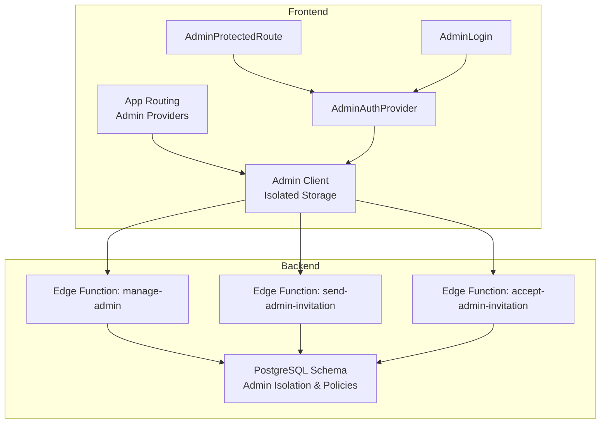
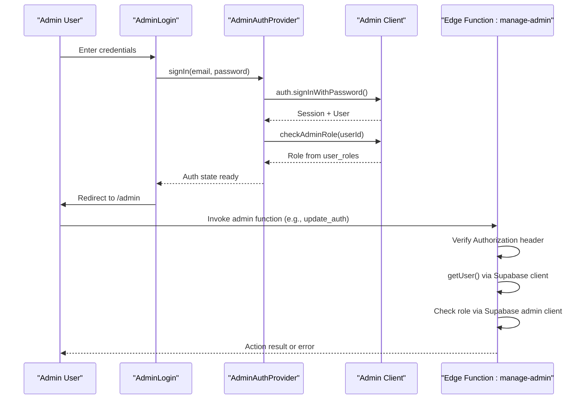
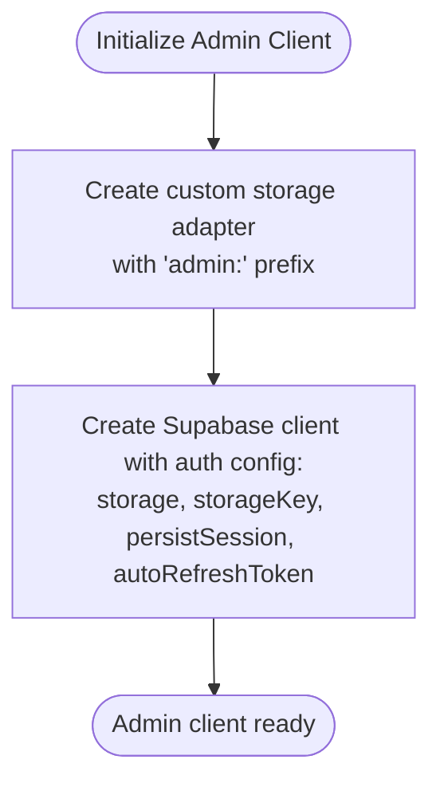
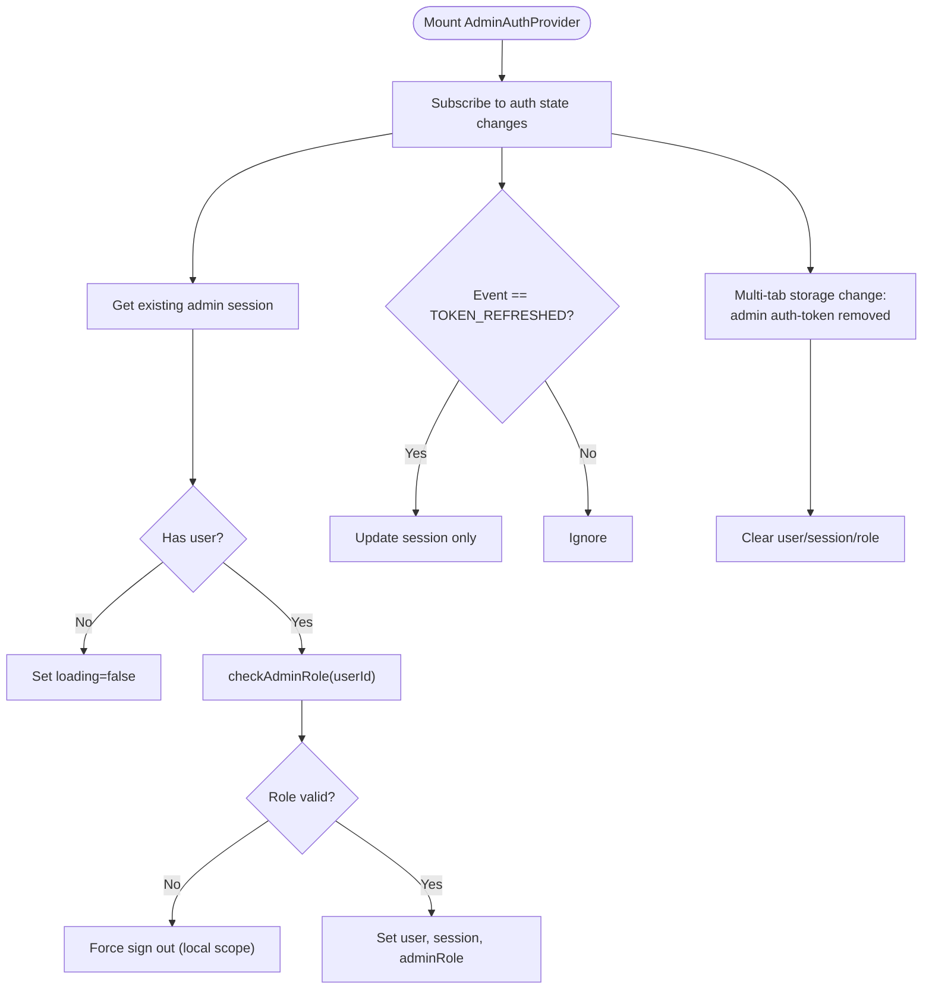
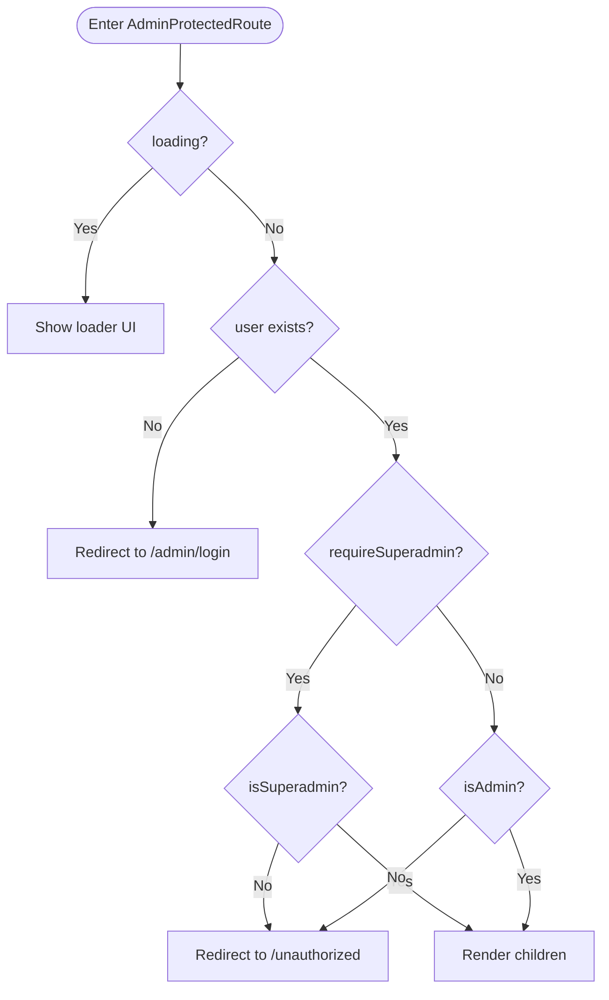
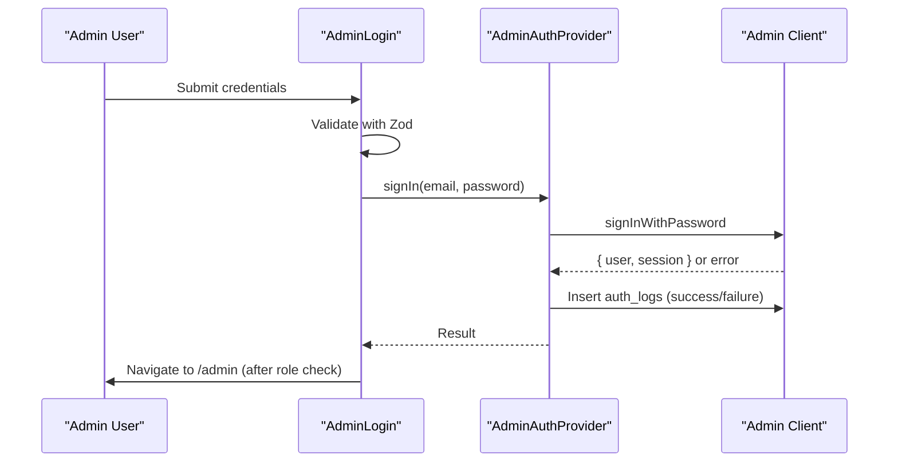
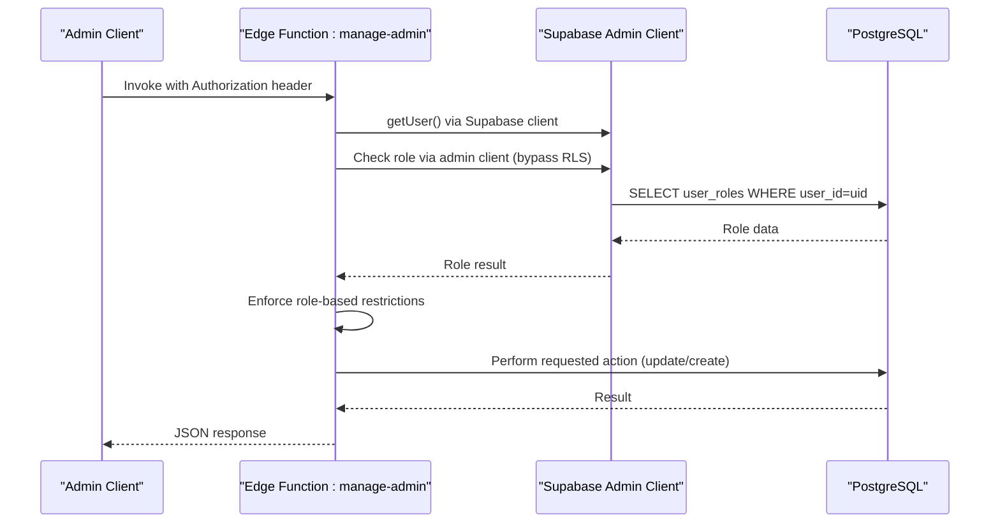
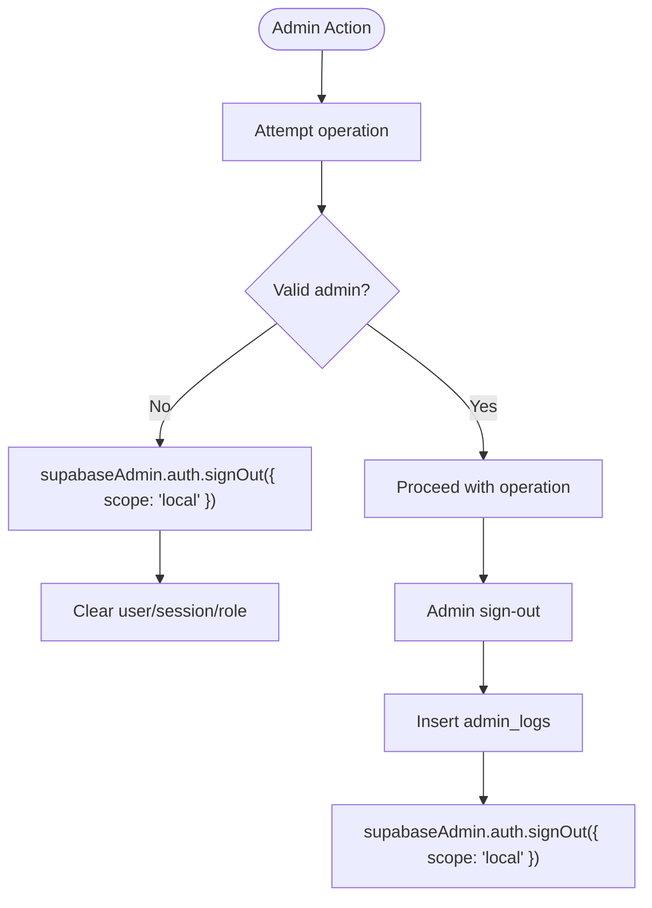
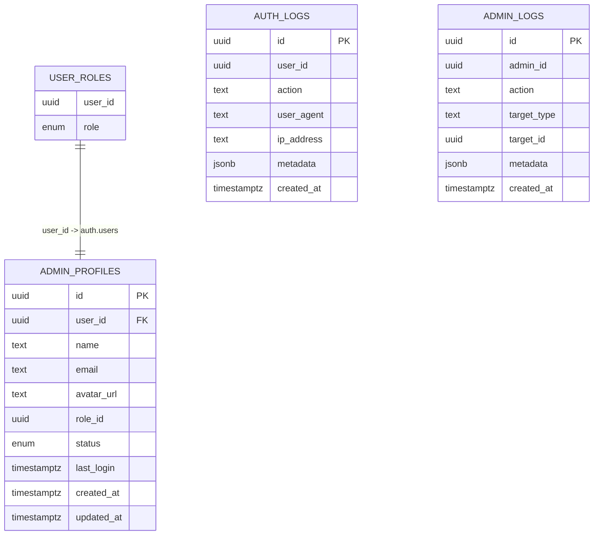
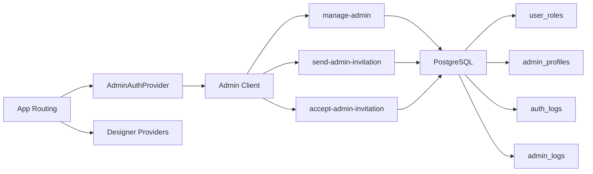

# Admin Authentication

<cite>
**Referenced Files in This Document**
- [admin-client.ts](file://src/integrations/supabase/admin-client.ts)
- [useAdminAuth.tsx](file://src/hooks/useAdminAuth.tsx)
- [AdminProtectedRoute.tsx](file://src/components/auth/AdminProtectedRoute.tsx)
- [AdminLogin.tsx](file://src/pages/admin/AdminLogin.tsx)
- [App.tsx](file://src/App.tsx)
- [manage-admin/index.ts](file://supabase/functions/manage-admin/index.ts)
- [send-admin-invitation/index.ts](file://supabase/functions/send-admin-invitation/index.ts)
- [accept-admin-invitation/index.ts](file://supabase/functions/accept-admin-invitation/index.ts)
- [20260126060000_isolate_admin_auth.sql](file://supabase/migrations/20260126060000_isolate_admin_auth.sql)
- [20260126040000_admin_auth_security.sql](file://supabase/migrations/20260126040000_admin_auth_security.sql)
- [20260201000003_add_admin_check_function.sql](file://supabase/migrations/20260201000003_add_admin_check_function.sql)
- [useAdminProducts.tsx](file://src/hooks/useAdminProducts.tsx)
- [useAdminDesignerProfiles.ts](file://src/hooks/useAdminDesignerProfiles.ts)
</cite>

## Table of Contents
1. [Introduction](#introduction)
2. [Project Structure](#project-structure)
3. [Core Components](#core-components)
4. [Architecture Overview](#architecture-overview)
5. [Detailed Component Analysis](#detailed-component-analysis)
6. [Dependency Analysis](#dependency-analysis)
7. [Performance Considerations](#performance-considerations)
8. [Troubleshooting Guide](#troubleshooting-guide)
9. [Conclusion](#conclusion)

## Introduction
This document explains the admin authentication system, focusing on the separate admin authentication flow, the AdminAuthProvider implementation, and admin-specific session management. It also covers the dual authentication architecture that enables simultaneous designer and admin sessions, admin role verification, and admin-only route protection. Practical guidance is included for implementing admin-only routes, isolating admin sessions, and managing admin authentication state independently from designer authentication. Additionally, it documents the admin client configuration, admin-specific API endpoints, and admin session cleanup procedures.

## Project Structure
The admin authentication system spans frontend providers, protected routes, and backend Supabase resources:
- Frontend
  - Admin client with isolated storage
  - Admin auth provider and hook
  - Admin-only protected route wrapper
  - Admin login page
  - Routing wiring with separate provider wrappers
- Backend
  - Supabase Edge Functions for admin actions
  - Database migrations for admin isolation and policies
  - Admin-specific logging and audit tables

**Diagram sources**
- [App.tsx](file://src/App.tsx#L125-L134)
- [admin-client.ts](file://src/integrations/supabase/admin-client.ts#L1-L28)
- [useAdminAuth.tsx](file://src/hooks/useAdminAuth.tsx#L21-L240)
- [AdminProtectedRoute.tsx](file://src/components/auth/AdminProtectedRoute.tsx#L11-L51)
- [AdminLogin.tsx](file://src/pages/admin/AdminLogin.tsx#L17-L157)
- [manage-admin/index.ts](file://supabase/functions/manage-admin/index.ts#L1-L148)
- [send-admin-invitation/index.ts](file://supabase/functions/send-admin-invitation/index.ts#L1-L100)
- [accept-admin-invitation/index.ts](file://supabase/functions/accept-admin-invitation/index.ts#L1-L140)
- [20260126060000_isolate_admin_auth.sql](file://supabase/migrations/20260126060000_isolate_admin_auth.sql#L1-L96)
- [20260126040000_admin_auth_security.sql](file://supabase/migrations/20260126040000_admin_auth_security.sql#L1-L79)

**Section sources**
- [App.tsx](file://src/App.tsx#L125-L134)
- [admin-client.ts](file://src/integrations/supabase/admin-client.ts#L1-L28)

## Core Components
- Admin client with isolated storage
  - Uses a custom storage adapter with a distinct key prefix to keep admin sessions separate from designer sessions.
  - Configured with persistent session and automatic token refresh.
- AdminAuthProvider
  - Manages admin auth state, role checks, and sign-out behavior.
  - Performs role verification against a dedicated table and enforces admin-only access.
  - Handles multi-tab synchronization and prevents session hijacking.
- AdminProtectedRoute
  - Guards admin routes, supporting optional superadmin-only enforcement.
  - Provides loading UX and redirects for unauthenticated or unauthorized users.
- Admin login page
  - Validates input, triggers admin sign-in via the admin provider, and navigates after role verification completes.
- Routing and providers
  - Admin routes are wrapped with AdminAuthProvider and AdminThemeProvider to ensure isolated context.

**Section sources**
- [admin-client.ts](file://src/integrations/supabase/admin-client.ts#L7-L27)
- [useAdminAuth.tsx](file://src/hooks/useAdminAuth.tsx#L21-L240)
- [AdminProtectedRoute.tsx](file://src/components/auth/AdminProtectedRoute.tsx#L11-L51)
- [AdminLogin.tsx](file://src/pages/admin/AdminLogin.tsx#L17-L157)
- [App.tsx](file://src/App.tsx#L313-L421)

## Architecture Overview
The admin authentication architecture is intentionally dual-layered:
- Frontend separation
  - Admin client uses isolated storage keys and a separate auth listener.
  - Admin routes are wrapped in AdminAuthProvider, independent from the designer AuthProvider.
- Backend separation
  - Dedicated admin profiles table and policies.
  - Edge functions enforce admin roles and restrict actions by role level.
  - Admin logs and auth logs are maintained for auditing.

**Diagram sources**
- [AdminLogin.tsx](file://src/pages/admin/AdminLogin.tsx#L32-L68)
- [useAdminAuth.tsx](file://src/hooks/useAdminAuth.tsx#L169-L199)
- [useAdminAuth.tsx](file://src/hooks/useAdminAuth.tsx#L38-L77)
- [manage-admin/index.ts](file://supabase/functions/manage-admin/index.ts#L14-L61)

## Detailed Component Analysis

### Admin Client Configuration
- Purpose
  - Provide a separate Supabase client for admin operations with isolated storage.
- Key behaviors
  - Custom storage adapter prefixes keys with an admin namespace.
  - Persists sessions and auto-refreshes tokens.
  - Ensures admin and designer sessions remain independent.

**Diagram sources**
- [admin-client.ts](file://src/integrations/supabase/admin-client.ts#L7-L27)

**Section sources**
- [admin-client.ts](file://src/integrations/supabase/admin-client.ts#L1-L28)

### AdminAuthProvider Implementation
- Responsibilities
  - Manage admin session lifecycle and role verification.
  - Prevent unauthorized access by forcing sign-out for non-admins.
  - Sync state across browser tabs and avoid flickering on token refresh.
  - Log admin login/logout events for auditability.
- Role verification
  - Queries the user_roles table to determine admin/lead_curator/superadmin.
  - Enforces admin-only access and rejects designers attempting admin login.
- Session isolation
  - Uses local scope during sign-out to avoid affecting designer sessions.
  - Listens to storage events to synchronize explicit sign-outs across tabs.

**Diagram sources**
- [useAdminAuth.tsx](file://src/hooks/useAdminAuth.tsx#L106-L167)
- [useAdminAuth.tsx](file://src/hooks/useAdminAuth.tsx#L38-L77)
- [useAdminAuth.tsx](file://src/hooks/useAdminAuth.tsx#L201-L223)

**Section sources**
- [useAdminAuth.tsx](file://src/hooks/useAdminAuth.tsx#L21-L240)

### Admin-Only Route Protection
- Behavior
  - Loads admin auth state and displays a loader while verifying access.
  - Redirects to admin login if not authenticated.
  - Redirects to unauthorized if role insufficient or not admin.
  - Supports requireSuperadmin flag for sensitive routes.
- UX
  - Provides a loading state with spinner and messaging during verification.

**Diagram sources**
- [AdminProtectedRoute.tsx](file://src/components/auth/AdminProtectedRoute.tsx#L18-L50)

**Section sources**
- [AdminProtectedRoute.tsx](file://src/components/auth/AdminProtectedRoute.tsx#L11-L51)

### Admin Login Flow
- Validation and submission
  - Zod schema validates email/password.
  - Calls admin provider sign-in and logs attempts to auth_logs.
- Navigation
  - After sign-in, waits briefly to allow role verification, then navigates to admin dashboard.

**Diagram sources**
- [AdminLogin.tsx](file://src/pages/admin/AdminLogin.tsx#L32-L68)
- [useAdminAuth.tsx](file://src/hooks/useAdminAuth.tsx#L169-L199)

**Section sources**
- [AdminLogin.tsx](file://src/pages/admin/AdminLogin.tsx#L17-L157)
- [useAdminAuth.tsx](file://src/hooks/useAdminAuth.tsx#L169-L199)

### Admin-Specific API Endpoints
- manage-admin
  - Verifies requester’s admin role via a Supabase admin client bypassing RLS.
  - Restricts standard admins from updating others; superadmins can update anyone.
  - Supports actions like update_auth and create_admin with appropriate logging.
- send-admin-invitation
  - Validates Authorization header and required fields.
  - Logs invitation sending (placeholder for email integration).
- accept-admin-invitation
  - Verifies pending invitation, creates admin user, assigns role, and logs acceptance.

**Diagram sources**
- [manage-admin/index.ts](file://supabase/functions/manage-admin/index.ts#L14-L73)
- [manage-admin/index.ts](file://supabase/functions/manage-admin/index.ts#L79-L133)

**Section sources**
- [manage-admin/index.ts](file://supabase/functions/manage-admin/index.ts#L1-L148)
- [send-admin-invitation/index.ts](file://supabase/functions/send-admin-invitation/index.ts#L1-L100)
- [accept-admin-invitation/index.ts](file://supabase/functions/accept-admin-invitation/index.ts#L1-L140)

### Admin Session Management and Cleanup
- Isolation
  - Admin client uses isolated storage keys; sign-out uses local scope to avoid designer session interference.
- Multi-tab sync
  - Listens to storage events to synchronize explicit sign-outs across tabs.
- Cleanup
  - On invalid access, clears user/session/admin role and forces local sign-out.
  - On logout, inserts admin_logs and sets signing-out state to prevent race conditions.

**Diagram sources**
- [useAdminAuth.tsx](file://src/hooks/useAdminAuth.tsx#L79-L87)
- [useAdminAuth.tsx](file://src/hooks/useAdminAuth.tsx#L201-L223)

**Section sources**
- [useAdminAuth.tsx](file://src/hooks/useAdminAuth.tsx#L79-L87)
- [useAdminAuth.tsx](file://src/hooks/useAdminAuth.tsx#L201-L223)

### Admin Role Verification and Database Isolation
- Role verification
  - AdminAuthProvider queries user_roles to determine admin/lead_curator/superadmin.
- Database isolation
  - Dedicated admin_profiles table with RLS policies restricting visibility and updates.
  - Admin logs and auth logs are secured with RLS for admin access.
  - Helper function checks admin privileges with security definer.

**Diagram sources**
- [20260126060000_isolate_admin_auth.sql](file://supabase/migrations/20260126060000_isolate_admin_auth.sql#L3-L30)
- [20260126040000_admin_auth_security.sql](file://supabase/migrations/20260126040000_admin_auth_security.sql#L61-L79)
- [20260201000003_add_admin_check_function.sql](file://supabase/migrations/20260201000003_add_admin_check_function.sql#L1-L21)

**Section sources**
- [useAdminAuth.tsx](file://src/hooks/useAdminAuth.tsx#L38-L77)
- [20260126060000_isolate_admin_auth.sql](file://supabase/migrations/20260126060000_isolate_admin_auth.sql#L1-L96)
- [20260126040000_admin_auth_security.sql](file://supabase/migrations/20260126040000_admin_auth_security.sql#L1-L79)
- [20260201000003_add_admin_check_function.sql](file://supabase/migrations/20260201000003_add_admin_check_function.sql#L1-L21)

## Dependency Analysis
- Provider and routing
  - Admin routes are wrapped with AdminAuthProvider and AdminThemeProvider.
  - Designer routes use AuthProvider and other studio providers.
- Client and functions
  - Admin client invokes Edge Functions with Authorization headers.
  - Edge Functions use a Supabase admin client to bypass RLS for role checks.
- Database dependencies
  - AdminAuthProvider depends on user_roles for role resolution.
  - Edge Functions depend on admin_profiles, auth_logs, admin_logs, and user_roles.

**Diagram sources**
- [App.tsx](file://src/App.tsx#L125-L134)
- [admin-client.ts](file://src/integrations/supabase/admin-client.ts#L1-L28)
- [manage-admin/index.ts](file://supabase/functions/manage-admin/index.ts#L1-L148)
- [send-admin-invitation/index.ts](file://supabase/functions/send-admin-invitation/index.ts#L1-L100)
- [accept-admin-invitation/index.ts](file://supabase/functions/accept-admin-invitation/index.ts#L1-L140)
- [20260126060000_isolate_admin_auth.sql](file://supabase/migrations/20260126060000_isolate_admin_auth.sql#L1-L96)

**Section sources**
- [App.tsx](file://src/App.tsx#L313-L421)
- [admin-client.ts](file://src/integrations/supabase/admin-client.ts#L1-L28)
- [manage-admin/index.ts](file://supabase/functions/manage-admin/index.ts#L1-L148)

## Performance Considerations
- Minimize repeated role checks
  - AdminAuthProvider debounces role verification slightly to avoid redundant checks on rapid state changes.
- Avoid token refresh flicker
  - Ignores TOKEN_REFRESHED events to prevent unnecessary re-renders.
- Efficient queries
  - Admin hooks use targeted selects and filters to reduce payload sizes.
- Edge Function caching
  - Keep Authorization header consistent and reuse Supabase clients to minimize cold starts.

## Troubleshooting Guide
- Admin login fails immediately
  - Check auth_logs for failed attempts and verify credentials.
  - Confirm the user has a valid role in user_roles.
- Redirect loop to /admin/login
  - Ensure the admin session is persisted and storage keys are prefixed correctly.
  - Verify multi-tab storage events are not clearing the session prematurely.
- Superadmin-only route still accessible
  - Confirm requireSuperadmin is set and AdminProtectedRoute is used.
  - Verify the user’s role is superadmin in user_roles.
- Edge Function returns unauthorized
  - Ensure Authorization header is present and valid.
  - Confirm the requester has admin or superadmin role via the Supabase admin client.
- Session not isolated
  - Verify custom storage adapter is configured and keys use the admin prefix.
  - Confirm sign-out uses local scope to avoid affecting designer sessions.

**Section sources**
- [useAdminAuth.tsx](file://src/hooks/useAdminAuth.tsx#L79-L87)
- [useAdminAuth.tsx](file://src/hooks/useAdminAuth.tsx#L201-L223)
- [AdminProtectedRoute.tsx](file://src/components/auth/AdminProtectedRoute.tsx#L38-L41)
- [manage-admin/index.ts](file://supabase/functions/manage-admin/index.ts#L38-L61)

## Conclusion
The admin authentication system achieves strict separation between admin and designer sessions through an isolated admin client, dedicated providers, and robust role verification. Admin-only routes enforce access control, while Edge Functions and database policies ensure admin actions are properly audited and restricted by role. Together, these mechanisms provide a secure, scalable foundation for admin operations.