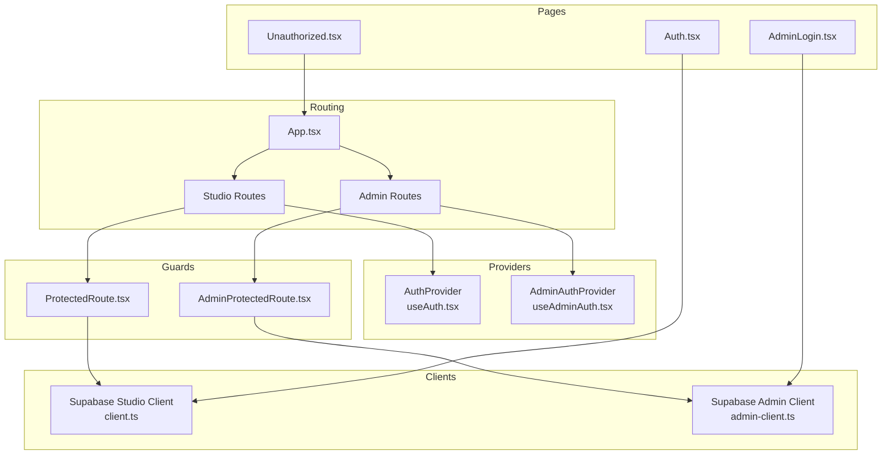
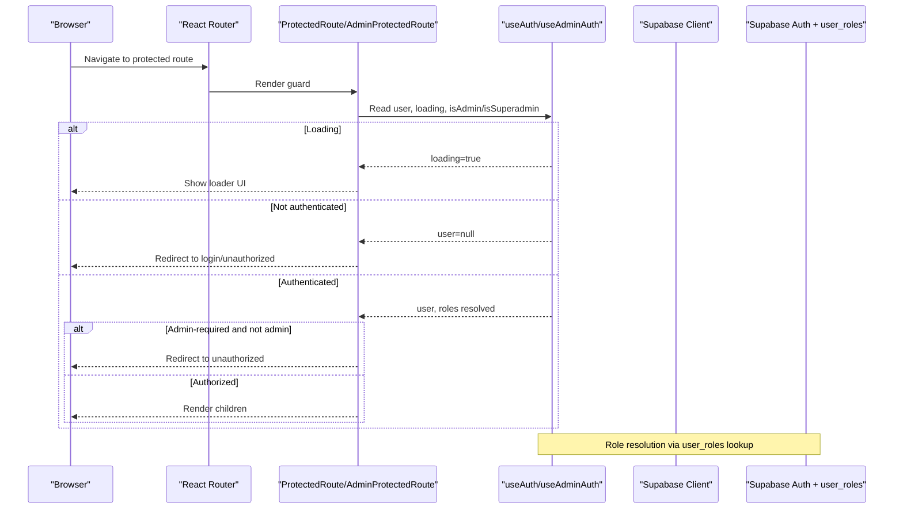
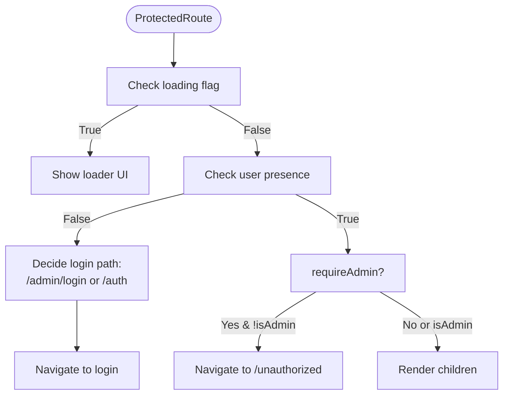
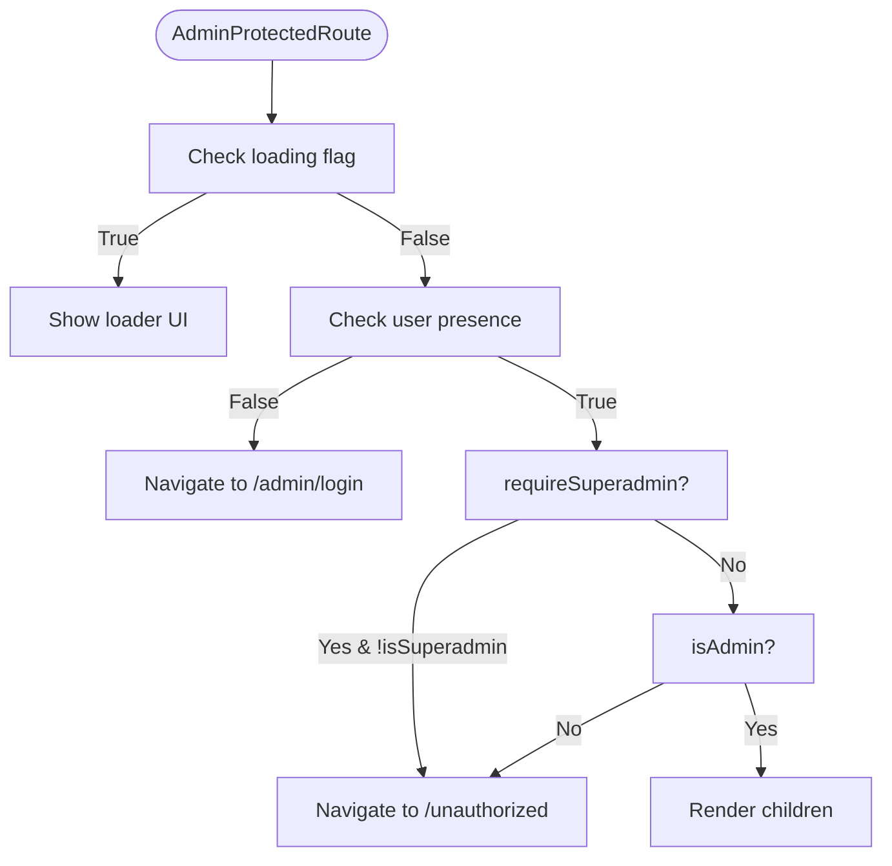
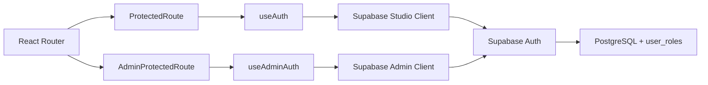

# Authentication & Authorization

<cite>
**Referenced Files in This Document**
- [ProtectedRoute.tsx](file://src/components/auth/ProtectedRoute.tsx)
- [AdminProtectedRoute.tsx](file://src/components/auth/AdminProtectedRoute.tsx)
- [useAuth.tsx](file://src/hooks/useAuth.tsx)
- [useAdminAuth.tsx](file://src/hooks/useAdminAuth.tsx)
- [client.ts](file://src/integrations/supabase/client.ts)
- [admin-client.ts](file://src/integrations/supabase/admin-client.ts)
- [App.tsx](file://src/App.tsx)
- [AdminLogin.tsx](file://src/pages/admin/AdminLogin.tsx)
- [Auth.tsx](file://src/pages/Auth.tsx)
- [Unauthorized.tsx](file://src/pages/Unauthorized.tsx)
- [dual-layer-service.ts](file://src/lib/dual-layer-service.ts)
- [dual-layer-types.ts](file://src/lib/dual-layer-types.ts)
- [20260126040000_admin_auth_security.sql](file://supabase/migrations/20260126040000_admin_auth_security.sql)
- [20260126060000_isolate_admin_auth.sql](file://supabase/migrations/20260126060000_isolate_admin_auth.sql)
</cite>

## Table of Contents
1. [Introduction](#introduction)
2. [Project Structure](#project-structure)
3. [Core Components](#core-components)
4. [Architecture Overview](#architecture-overview)
5. [Detailed Component Analysis](#detailed-component-analysis)
6. [Dependency Analysis](#dependency-analysis)
7. [Performance Considerations](#performance-considerations)
8. [Troubleshooting Guide](#troubleshooting-guide)
9. [Conclusion](#conclusion)
10. [Appendices](#appendices)

## Introduction
This document explains the dual-layer authentication and authorization system used in the application. It covers:
- Multi-role authentication architecture with separate designer and admin authentication flows
- JWT token management and session handling
- Role-based access control (RBAC) via Supabase Auth and Row Level Security (RLS)
- Implementation of ProtectedRoute and AdminProtectedRoute components
- Authentication state management through custom hooks
- Supabase Auth integration patterns
- Security model including session isolation between roles and logout mechanisms
- Practical examples for protected routes, role checks, and handling authentication state changes
- Common authentication scenarios and troubleshooting tips

## Project Structure
The authentication system spans routing, providers, hooks, UI pages, and Supabase clients:
- Routing and wrappers: App.tsx defines route groups for public, studio (designer), and admin portals
- Providers: AuthProvider and AdminAuthProvider encapsulate authentication state and lifecycle
- Guards: ProtectedRoute and AdminProtectedRoute enforce access rules
- Clients: Supabase client for studio and a separately configured admin client for admin portal
- Pages: Auth.tsx (designer login/signup) and AdminLogin.tsx (admin login)
- Utilities: Dual-layer service and types for designer-centric operations

**Diagram sources**
- [App.tsx](file://src/App.tsx#L155-L420)
- [ProtectedRoute.tsx](file://src/components/auth/ProtectedRoute.tsx#L1-L42)
- [AdminProtectedRoute.tsx](file://src/components/auth/AdminProtectedRoute.tsx#L1-L52)
- [useAuth.tsx](file://src/hooks/useAuth.tsx#L22-L271)
- [useAdminAuth.tsx](file://src/hooks/useAdminAuth.tsx#L21-L240)
- [client.ts](file://src/integrations/supabase/client.ts#L1-L17)
- [admin-client.ts](file://src/integrations/supabase/admin-client.ts#L1-L28)
- [Auth.tsx](file://src/pages/Auth.tsx#L36-L183)
- [AdminLogin.tsx](file://src/pages/admin/AdminLogin.tsx#L17-L68)
- [Unauthorized.tsx](file://src/pages/Unauthorized.tsx#L6-L73)

**Section sources**
- [App.tsx](file://src/App.tsx#L155-L420)

## Core Components
- ProtectedRoute: Enforces authentication for studio routes and optionally admin-only access
- AdminProtectedRoute: Enforces admin or superadmin access for admin routes
- useAuth: Manages designer-side authentication state, role resolution, and sign-out
- useAdminAuth: Manages admin-side authentication state, role resolution, and sign-out
- Supabase Studio Client: Standard client with local storage persistence
- Supabase Admin Client: Isolated client with custom storage keys for admin sessions

Key responsibilities:
- Role resolution: Queries user_roles to determine designer, admin, or superadmin
- Session isolation: Admin client uses a separate storage namespace to prevent cross-session access
- Guard logic: Redirects unauthenticated users to login or unauthorized page based on route requirements

**Section sources**
- [ProtectedRoute.tsx](file://src/components/auth/ProtectedRoute.tsx#L11-L41)
- [AdminProtectedRoute.tsx](file://src/components/auth/AdminProtectedRoute.tsx#L11-L51)
- [useAuth.tsx](file://src/hooks/useAuth.tsx#L36-L74)
- [useAdminAuth.tsx](file://src/hooks/useAdminAuth.tsx#L38-L87)
- [client.ts](file://src/integrations/supabase/client.ts#L11-L17)
- [admin-client.ts](file://src/integrations/supabase/admin-client.ts#L8-L27)

## Architecture Overview
The system enforces dual-layer authentication:
- Studio (designer) portal: Uses AuthProvider and ProtectedRoute
- Admin portal: Uses AdminAuthProvider and AdminProtectedRoute
- Session isolation: Admin client stores tokens under a prefixed key, preventing hijacking by designer sessions
- Role hierarchy: designer < admin < superadmin; lead_curator is treated as admin-equivalent in admin context

**Diagram sources**
- [ProtectedRoute.tsx](file://src/components/auth/ProtectedRoute.tsx#L15-L38)
- [AdminProtectedRoute.tsx](file://src/components/auth/AdminProtectedRoute.tsx#L15-L47)
- [useAuth.tsx](file://src/hooks/useAuth.tsx#L36-L74)
- [useAdminAuth.tsx](file://src/hooks/useAdminAuth.tsx#L38-L87)

## Detailed Component Analysis

### ProtectedRoute Component
Purpose:
- Protect studio routes and optionally require admin role
- Redirect unauthenticated users to the appropriate login page
- Redirect authenticated non-admin users attempting admin routes to unauthorized

Behavior highlights:
- Reads user, loading, and isAdmin from useAuth
- Shows a loader while loading
- Redirects to /admin/login for admin routes or /auth otherwise when unauthenticated
- Redirects to /unauthorized if requireAdmin is true and user is not admin

**Diagram sources**
- [ProtectedRoute.tsx](file://src/components/auth/ProtectedRoute.tsx#L15-L41)

**Section sources**
- [ProtectedRoute.tsx](file://src/components/auth/ProtectedRoute.tsx#L11-L41)

### AdminProtectedRoute Component
Purpose:
- Protect admin routes and optionally require superadmin
- Enforce session isolation by relying on AdminAuthProvider
- Redirect to unauthorized for insufficient privileges

Behavior highlights:
- Reads user, loading, isAdmin, isSuperadmin, adminRole from useAdminAuth
- Shows a loader while loading
- Redirects to /admin/login if not authenticated
- Redirects to /unauthorized if requireSuperadmin and not superadmin, or if not admin at all
- Logs state for debugging

**Diagram sources**
- [AdminProtectedRoute.tsx](file://src/components/auth/AdminProtectedRoute.tsx#L15-L51)

**Section sources**
- [AdminProtectedRoute.tsx](file://src/components/auth/AdminProtectedRoute.tsx#L11-L51)

### useAuth Hook (Designer Authentication)
Responsibilities:
- Initialize Supabase Studio client with local storage persistence
- Subscribe to auth state changes and update user/session/loading
- Resolve user role by querying user_roles table with priority: superadmin > admin > designer
- Handle multi-tab synchronization for explicit sign-out events
- Provide sign-up, sign-in, and sign-out functions with logging
- Expose isAdmin and isDesigner booleans derived from userRole

Security and UX:
- Debounces role checks to avoid rapid repeated queries
- Ignores TOKEN_REFRESHED events to prevent UI flicker
- Logs auth actions for audit trails

**Section sources**
- [useAuth.tsx](file://src/hooks/useAuth.tsx#L22-L271)
- [client.ts](file://src/integrations/supabase/client.ts#L11-L17)

### useAdminAuth Hook (Admin Authentication)
Responsibilities:
- Initialize Supabase Admin client with custom storage adapter and storage key
- Subscribe to admin auth state changes and update user/session/loading
- Resolve admin role by querying user_roles with support for admin, superadmin, and lead_curator
- Handle invalid access attempts by forcing sign-out from admin scope
- Provide sign-in and sign-out functions with logging
- Expose isAdmin, isSuperadmin, and adminRole

Security and UX:
- Isolates admin sessions using a prefixed storage key
- Forces sign-out on invalid access to prevent session hijacking
- Debounces role checks and ignores TOKEN_REFRESHED events

**Section sources**
- [useAdminAuth.tsx](file://src/hooks/useAdminAuth.tsx#L21-L240)
- [admin-client.ts](file://src/integrations/supabase/admin-client.ts#L8-L27)

### Supabase Clients and Session Isolation
- Studio client: Standard client with local storage persistence
- Admin client: Custom storage adapter with keys prefixed by "admin:" and a dedicated storage key
- This ensures admin and designer sessions are independent and cannot interfere with each other

**Section sources**
- [client.ts](file://src/integrations/supabase/client.ts#L11-L17)
- [admin-client.ts](file://src/integrations/supabase/admin-client.ts#L8-L27)

### Authentication State Management and RBAC
- Role resolution: Both hooks query user_roles to determine effective role
- Priority: superadmin > admin > designer (designer-equivalent for studio)
- Admin context: lead_curator treated as admin-equivalent for admin routes
- Unauthorized handling: Redirects to /unauthorized with contextual messages

**Section sources**
- [useAuth.tsx](file://src/hooks/useAuth.tsx#L36-L74)
- [useAdminAuth.tsx](file://src/hooks/useAdminAuth.tsx#L38-L87)
- [Unauthorized.tsx](file://src/pages/Unauthorized.tsx#L6-L73)

### Logout Mechanisms
- Designer logout: Calls signOut with scope: 'local' to avoid affecting admin session
- Admin logout: Calls signOut with scope: 'local' to avoid affecting studio session
- Multi-tab sync: Listens for storage change events to synchronize sign-out across tabs

**Section sources**
- [useAuth.tsx](file://src/hooks/useAuth.tsx#L228-L250)
- [useAdminAuth.tsx](file://src/hooks/useAdminAuth.tsx#L201-L223)

### Practical Examples

- Implementing a protected route:
  - Wrap the route element with ProtectedRoute for studio pages
  - Use requireAdmin={true} for admin-only routes
  - Reference: [App.tsx](file://src/App.tsx#L224-L300), [App.tsx](file://src/App.tsx#L302-L410)

- Checking user roles in components:
  - Use useAuth().isAdmin or useAdminAuth().isAdmin/isSuperadmin
  - Reference: [ProtectedRoute.tsx](file://src/components/auth/ProtectedRoute.tsx#L15-L38), [AdminProtectedRoute.tsx](file://src/components/auth/AdminProtectedRoute.tsx#L15-L47)

- Handling authentication state changes:
  - Use loading flag to show loaders during auth state transitions
  - Reference: [ProtectedRoute.tsx](file://src/components/auth/ProtectedRoute.tsx#L18-L27), [AdminProtectedRoute.tsx](file://src/components/auth/AdminProtectedRoute.tsx#L20-L29)

- Admin login flow:
  - Use AdminLogin page to authenticate with AdminAuthProvider
  - On success, navigate to /admin after role verification
  - Reference: [AdminLogin.tsx](file://src/pages/admin/AdminLogin.tsx#L17-L68)

- Designer login/signup flow:
  - Use Auth page with AuthProvider
  - On success, navigate to studio dashboards
  - Reference: [Auth.tsx](file://src/pages/Auth.tsx#L36-L183)

**Section sources**
- [App.tsx](file://src/App.tsx#L224-L410)
- [ProtectedRoute.tsx](file://src/components/auth/ProtectedRoute.tsx#L15-L41)
- [AdminProtectedRoute.tsx](file://src/components/auth/AdminProtectedRoute.tsx#L15-L51)
- [AdminLogin.tsx](file://src/pages/admin/AdminLogin.tsx#L17-L68)
- [Auth.tsx](file://src/pages/Auth.tsx#L36-L183)

## Dependency Analysis
The authentication system depends on:
- Supabase Auth for JWT handling and session persistence
- user_roles table for role resolution
- Custom storage adapters for session isolation
- Route wrappers and guards for enforcement

**Diagram sources**
- [App.tsx](file://src/App.tsx#L155-L420)
- [ProtectedRoute.tsx](file://src/components/auth/ProtectedRoute.tsx#L1-L42)
- [AdminProtectedRoute.tsx](file://src/components/auth/AdminProtectedRoute.tsx#L1-L52)
- [useAuth.tsx](file://src/hooks/useAuth.tsx#L22-L271)
- [useAdminAuth.tsx](file://src/hooks/useAdminAuth.tsx#L21-L240)
- [client.ts](file://src/integrations/supabase/client.ts#L1-L17)
- [admin-client.ts](file://src/integrations/supabase/admin-client.ts#L1-L28)

**Section sources**
- [App.tsx](file://src/App.tsx#L155-L420)

## Performance Considerations
- Role resolution debouncing: Both hooks debounce role checks to reduce redundant queries
- Token refresh handling: Guards ignore TOKEN_REFRESHED events to minimize UI re-renders
- Local storage persistence: Enables seamless rehydration without network round-trips
- Isolation overhead: Admin client adds minimal overhead via custom storage adapter

[No sources needed since this section provides general guidance]

## Troubleshooting Guide
Common issues and resolutions:
- Redirect loops on protected routes:
  - Ensure ProtectedRoute/AdminProtectedRoute are properly wrapped around route elements
  - Verify loading state is respected to avoid premature renders
  - References: [ProtectedRoute.tsx](file://src/components/auth/ProtectedRoute.tsx#L18-L27), [AdminProtectedRoute.tsx](file://src/components/auth/AdminProtectedRoute.tsx#L20-L29)

- Admin access denied despite being admin:
  - Confirm user_roles contains the expected role
  - Check that AdminProtectedRoute is used for admin routes
  - Verify admin client is initialized with custom storage adapter
  - References: [useAdminAuth.tsx](file://src/hooks/useAdminAuth.tsx#L38-L87), [admin-client.ts](file://src/integrations/supabase/admin-client.ts#L8-L27)

- Cross-session interference:
  - Ensure admin client uses "admin:" prefixed storage keys
  - Confirm sign-out uses scope: 'local' for both studio and admin
  - References: [admin-client.ts](file://src/integrations/supabase/admin-client.ts#L8-L27), [useAuth.tsx](file://src/hooks/useAuth.tsx#L228-L250), [useAdminAuth.tsx](file://src/hooks/useAdminAuth.tsx#L201-L223)

- Unauthorized page messaging:
  - Use Unauthorized page to inform users about missing permissions or login requirement
  - References: [Unauthorized.tsx](file://src/pages/Unauthorized.tsx#L6-L73)

**Section sources**
- [ProtectedRoute.tsx](file://src/components/auth/ProtectedRoute.tsx#L18-L27)
- [AdminProtectedRoute.tsx](file://src/components/auth/AdminProtectedRoute.tsx#L20-L29)
- [useAdminAuth.tsx](file://src/hooks/useAdminAuth.tsx#L38-L87)
- [admin-client.ts](file://src/integrations/supabase/admin-client.ts#L8-L27)
- [useAuth.tsx](file://src/hooks/useAuth.tsx#L228-L250)
- [Unauthorized.tsx](file://src/pages/Unauthorized.tsx#L6-L73)

## Conclusion
The dual-layer authentication system provides a secure, isolated, and scalable approach to managing designer and admin access:
- Clear separation of concerns via distinct providers and guards
- Robust role resolution and RBAC enforcement
- Strong session isolation to prevent cross-session hijacking
- Comprehensive logging and error handling for auditability and troubleshooting

[No sources needed since this section summarizes without analyzing specific files]

## Appendices

### Security Model and RLS Policies
- Admin dashboard statistics function requires admin or superadmin role
- Admin logs and auth logs have RLS policies restricting visibility to authorized users
- Admin profiles table is secured with RLS and policies for selective access
- Functions and tables are configured to enforce role checks at the database level

References:
- [20260126040000_admin_auth_security.sql](file://supabase/migrations/20260126040000_admin_auth_security.sql#L1-L79)
- [20260126060000_isolate_admin_auth.sql](file://supabase/migrations/20260126060000_isolate_admin_auth.sql#L1-L96)

**Section sources**
- [20260126040000_admin_auth_security.sql](file://supabase/migrations/20260126040000_admin_auth_security.sql#L1-L79)
- [20260126060000_isolate_admin_auth.sql](file://supabase/migrations/20260126060000_isolate_admin_auth.sql#L1-L96)

### Designer-Only Operations and Dual-Layer Types
- Dual-layer service encapsulates designer-centric operations with ownership checks
- Types define Project, ProjectAsset, and PublicationRequest structures

References:
- [dual-layer-service.ts](file://src/lib/dual-layer-service.ts#L1-L340)
- [dual-layer-types.ts](file://src/lib/dual-layer-types.ts#L1-L44)

**Section sources**
- [dual-layer-service.ts](file://src/lib/dual-layer-service.ts#L1-L340)
- [dual-layer-types.ts](file://src/lib/dual-layer-types.ts#L1-L44)