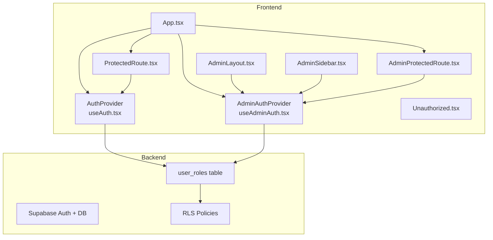
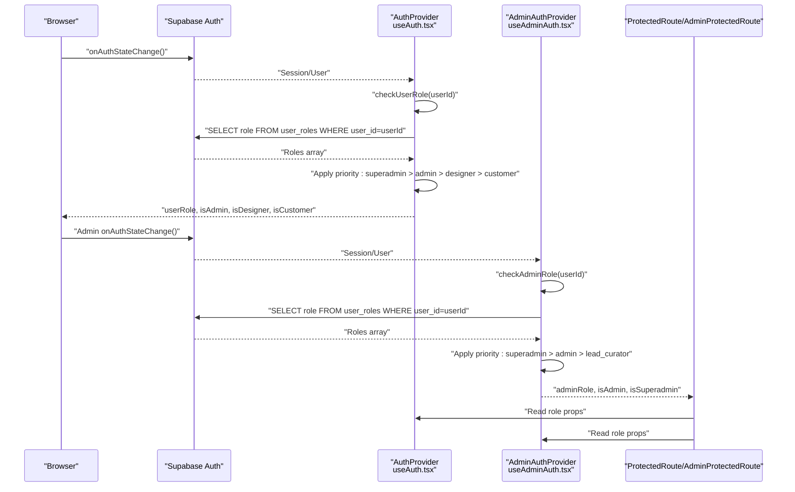
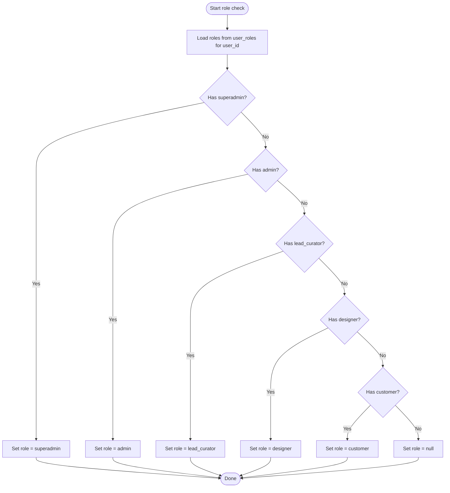
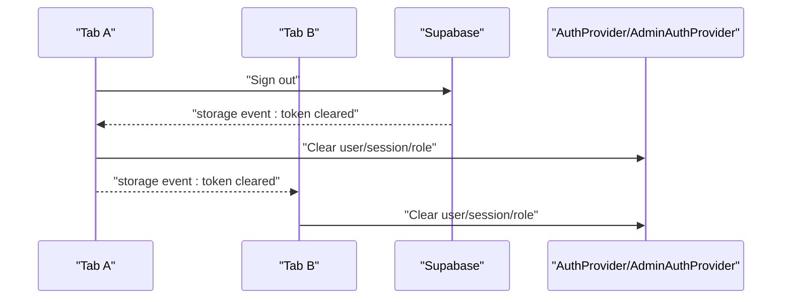
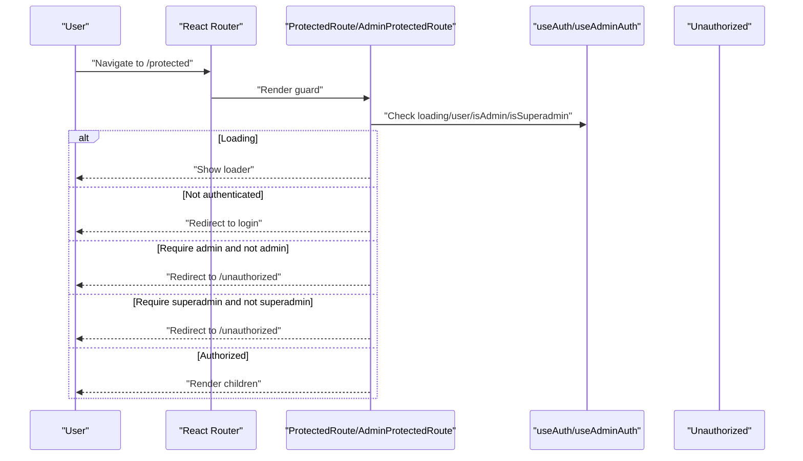
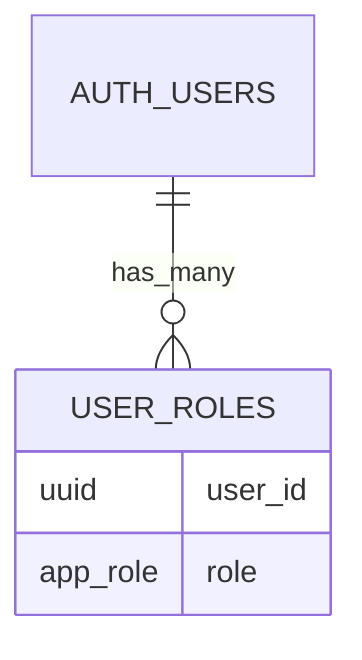
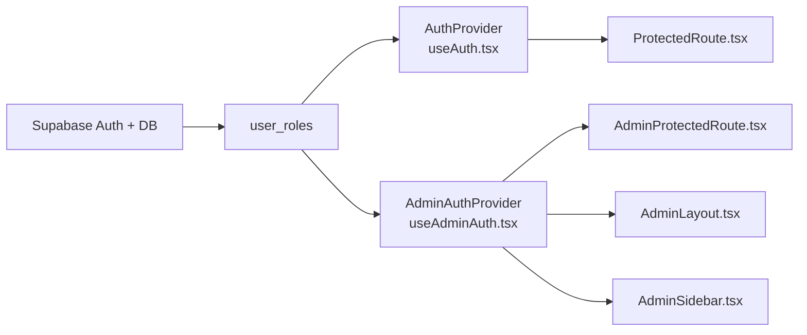

# Role-Based Access Control

<cite>
**Referenced Files in This Document**
- [useAuth.tsx](file://src/hooks/useAuth.tsx)
- [useAdminAuth.tsx](file://src/hooks/useAdminAuth.tsx)
- [ProtectedRoute.tsx](file://src/components/auth/ProtectedRoute.tsx)
- [AdminProtectedRoute.tsx](file://src/components/auth/AdminProtectedRoute.tsx)
- [Unauthorized.tsx](file://src/pages/Unauthorized.tsx)
- [App.tsx](file://src/App.tsx)
- [AdminLayout.tsx](file://src/components/admin/AdminLayout.tsx)
- [AdminSidebar.tsx](file://src/components/admin/AdminSidebar.tsx)
- [bootstrap_superadmin.sql](file://supabase/migrations/20260126050000_bootstrap_superadmin.sql)
- [add_lead_curator_role.sql](file://supabase/migrations/20260130040000_add_lead_curator_role.sql)
- [user_roles_table.sql](file://supabase/migrations/20251209213954_141af71b-504d-4a68-a16d-b931834b1328.sql)
- [assign_designer_role_migration.sql](file://supabase/migrations/20251225062920_ea2b9686-7743-454f-8678-f15a11245fce.sql)
</cite>

## Table of Contents
1. [Introduction](#introduction)
2. [Project Structure](#project-structure)
3. [Core Components](#core-components)
4. [Architecture Overview](#architecture-overview)
5. [Detailed Component Analysis](#detailed-component-analysis)
6. [Dependency Analysis](#dependency-analysis)
7. [Performance Considerations](#performance-considerations)
8. [Troubleshooting Guide](#troubleshooting-guide)
9. [Conclusion](#conclusion)

## Introduction
This document explains the role-based access control (RBAC) system used in the application. It covers the hierarchical role structure (designer, admin, superadmin, lead curator), role priority logic, permission inheritance, role determination via the user_roles table, role checking mechanisms, dynamic role updates, and route protection patterns. Practical guidance is provided for implementing role-based UI components, conditional rendering, and role-specific feature access.

## Project Structure
The RBAC system spans frontend hooks, route guards, layout components, and backend database policies. Providers wrap application routes to expose role-aware properties and guard protected areas.

**Diagram sources**
- [App.tsx](file://src/App.tsx#L157-L431)
- [useAuth.tsx](file://src/hooks/useAuth.tsx#L34-L314)
- [useAdminAuth.tsx](file://src/hooks/useAdminAuth.tsx#L21-L240)
- [ProtectedRoute.tsx](file://src/components/auth/ProtectedRoute.tsx#L11-L41)
- [AdminProtectedRoute.tsx](file://src/components/auth/AdminProtectedRoute.tsx#L11-L51)
- [AdminLayout.tsx](file://src/components/admin/AdminLayout.tsx#L48-L237)
- [AdminSidebar.tsx](file://src/components/admin/AdminSidebar.tsx#L80-L294)
- [user_roles_table.sql](file://supabase/migrations/20251209213954_141af71b-504d-4a68-a16d-b931834b1328.sql#L27-L41)

**Section sources**
- [App.tsx](file://src/App.tsx#L157-L431)

## Core Components
- Role determination and priority:
  - Frontend role resolution reads the user_roles table and applies a strict priority order to derive the effective role.
  - The studio (designer) provider resolves roles with priority: superadmin > admin > designer > customer.
  - The admin provider resolves roles with priority: superadmin > admin > lead_curator, and denies access otherwise.
- Role properties exposed by providers:
  - Studio provider exposes userRole, isAdmin, isDesigner, isCustomer.
  - Admin provider exposes adminRole, isAdmin, isSuperadmin.
- Dynamic role updates:
  - Auth state listeners subscribe to Supabase auth events and re-check roles on sign-in/sign-out/session changes.
  - Tab synchronization ensures consistent role state across browser tabs.
- Route protection:
  - ProtectedRoute enforces authentication and optional admin requirement for studio routes.
  - AdminProtectedRoute enforces admin access and optionally superadmin requirement for sensitive admin routes.
  - Unauthorized page provides contextual messaging for denied access.

**Section sources**
- [useAuth.tsx](file://src/hooks/useAuth.tsx#L48-L89)
- [useAdminAuth.tsx](file://src/hooks/useAdminAuth.tsx#L37-L77)
- [ProtectedRoute.tsx](file://src/components/auth/ProtectedRoute.tsx#L11-L41)
- [AdminProtectedRoute.tsx](file://src/components/auth/AdminProtectedRoute.tsx#L11-L51)
- [Unauthorized.tsx](file://src/pages/Unauthorized.tsx#L6-L73)

## Architecture Overview
The RBAC architecture combines frontend role resolution with backend row-level security (RLS) policies. Roles are stored in the user_roles table and enforced by database policies.

**Diagram sources**
- [useAuth.tsx](file://src/hooks/useAuth.tsx#L109-L167)
- [useAdminAuth.tsx](file://src/hooks/useAdminAuth.tsx#L106-L167)
- [ProtectedRoute.tsx](file://src/components/auth/ProtectedRoute.tsx#L15-L41)
- [AdminProtectedRoute.tsx](file://src/components/auth/AdminProtectedRoute.tsx#L15-L51)

## Detailed Component Analysis

### Role Determination and Priority
- Studio roles (designer portal):
  - Priority: superadmin > admin > designer > customer.
  - Derived from user_roles entries for the current user.
  - Exposed as userRole, isAdmin, isDesigner, isCustomer.
- Admin roles (admin portal):
  - Priority: superadmin > admin > lead_curator.
  - Non-admin users attempting admin login are redirected or signed out locally.
  - Exposed as adminRole, isAdmin, isSuperadmin.

**Diagram sources**
- [useAuth.tsx](file://src/hooks/useAuth.tsx#L48-L89)
- [useAdminAuth.tsx](file://src/hooks/useAdminAuth.tsx#L37-L77)

**Section sources**
- [useAuth.tsx](file://src/hooks/useAuth.tsx#L48-L89)
- [useAdminAuth.tsx](file://src/hooks/useAdminAuth.tsx#L37-L77)

### Role Properties and Inheritance
- Studio provider:
  - userRole: resolved effective role.
  - isAdmin: true if role is admin or superadmin.
  - isDesigner: true if role is designer or higher (admin/superadmin).
  - isCustomer: true if role is customer.
- Admin provider:
  - adminRole: resolved effective role (admin, superadmin, lead_curator).
  - isAdmin: true if role is admin, superadmin, or lead_curator.
  - isSuperadmin: true if role is superadmin.

These properties enable straightforward conditional rendering and feature gating in components.

**Section sources**
- [useAuth.tsx](file://src/hooks/useAuth.tsx#L292-L294)
- [useAdminAuth.tsx](file://src/hooks/useAdminAuth.tsx#L34-L35)

### Dynamic Role Updates and Sync
- Auth state listener subscribes to Supabase auth events and debounces role checks to avoid rapid repeated queries.
- On sign-in/sign-out or session changes, the system re-fetches user roles and updates state.
- Multi-tab synchronization listens for storage events to keep role state consistent across tabs.
- Admin provider isolates sessions using local scope to prevent cross-portal hijacking.

**Diagram sources**
- [useAuth.tsx](file://src/hooks/useAuth.tsx#L91-L106)
- [useAdminAuth.tsx](file://src/hooks/useAdminAuth.tsx#L89-L104)

**Section sources**
- [useAuth.tsx](file://src/hooks/useAuth.tsx#L91-L106)
- [useAdminAuth.tsx](file://src/hooks/useAdminAuth.tsx#L89-L104)

### Route Protection Patterns
- Studio routes:
  - ProtectedRoute wraps routes to enforce authentication and optionally require admin role.
  - Redirects unauthenticated users to the appropriate login page.
  - Redirects unauthorized users to the unauthorized page.
- Admin routes:
  - AdminProtectedRoute enforces admin access and optionally requires superadmin.
  - Supports requireSuperadmin flag for sensitive settings.
  - Integrates with Unauthorized page for consistent messaging.

**Diagram sources**
- [ProtectedRoute.tsx](file://src/components/auth/ProtectedRoute.tsx#L15-L41)
- [AdminProtectedRoute.tsx](file://src/components/auth/AdminProtectedRoute.tsx#L15-L51)
- [Unauthorized.tsx](file://src/pages/Unauthorized.tsx#L6-L73)

**Section sources**
- [ProtectedRoute.tsx](file://src/components/auth/ProtectedRoute.tsx#L11-L41)
- [AdminProtectedRoute.tsx](file://src/components/auth/AdminProtectedRoute.tsx#L11-L51)
- [Unauthorized.tsx](file://src/pages/Unauthorized.tsx#L6-L73)

### Admin UI Role-Aware Components
- AdminLayout and AdminSidebar consume adminRole to:
  - Render role badges and labels.
  - Conditionally show sensitive system settings (e.g., Security) only for superadmins.
  - Provide role-aware navigation and quick actions.

**Section sources**
- [AdminLayout.tsx](file://src/components/admin/AdminLayout.tsx#L48-L237)
- [AdminSidebar.tsx](file://src/components/admin/AdminSidebar.tsx#L80-L294)

### Database Schema and Policies
- user_roles table:
  - Stores per-user roles (e.g., designer, admin, superadmin, lead_curator).
  - Enforced by RLS policies to restrict management to authorized users.
- Bootstrap and migrations:
  - Initial superadmin creation via a secure bootstrap function.
  - Lead curator role addition through migration.
  - Designer role assignment to existing users.

**Diagram sources**
- [user_roles_table.sql](file://supabase/migrations/20251209213954_141af71b-504d-4a68-a16d-b931834b1328.sql#L27-L41)
- [bootstrap_superadmin.sql](file://supabase/migrations/20260126050000_bootstrap_superadmin.sql#L62-L64)
- [add_lead_curator_role.sql](file://supabase/migrations/20260130040000_add_lead_curator_role.sql#L5-L7)
- [assign_designer_role_migration.sql](file://supabase/migrations/20251225062920_ea2b9686-7743-454f-8678-f15a11245fce.sql#L1-L8)

**Section sources**
- [user_roles_table.sql](file://supabase/migrations/20251209213954_141af71b-504d-4a68-a16d-b931834b1328.sql#L27-L41)
- [bootstrap_superadmin.sql](file://supabase/migrations/20260126050000_bootstrap_superadmin.sql#L62-L64)
- [add_lead_curator_role.sql](file://supabase/migrations/20260130040000_add_lead_curator_role.sql#L5-L7)
- [assign_designer_role_migration.sql](file://supabase/migrations/20251225062920_ea2b9686-7743-454f-8678-f15a11245fce.sql#L1-L8)

## Dependency Analysis
- Providers depend on Supabase auth state and the user_roles table.
- Route guards depend on provider role properties.
- Admin UI components depend on adminRole for visibility and behavior.
- Backend policies depend on the has_role security definer function and user_roles table.

**Diagram sources**
- [useAuth.tsx](file://src/hooks/useAuth.tsx#L34-L314)
- [useAdminAuth.tsx](file://src/hooks/useAdminAuth.tsx#L21-L240)
- [ProtectedRoute.tsx](file://src/components/auth/ProtectedRoute.tsx#L11-L41)
- [AdminProtectedRoute.tsx](file://src/components/auth/AdminProtectedRoute.tsx#L11-L51)
- [AdminLayout.tsx](file://src/components/admin/AdminLayout.tsx#L48-L237)
- [AdminSidebar.tsx](file://src/components/admin/AdminSidebar.tsx#L80-L294)

**Section sources**
- [useAuth.tsx](file://src/hooks/useAuth.tsx#L34-L314)
- [useAdminAuth.tsx](file://src/hooks/useAdminAuth.tsx#L21-L240)

## Performance Considerations
- Debounced role checks reduce redundant database queries during rapid auth transitions.
- Memoized callbacks prevent unnecessary recalculations in role determination.
- Local scope sign-out prevents cascading state updates across portals.
- RLS policies offload authorization decisions to the database, minimizing frontend logic.

## Troubleshooting Guide
- Symptom: Role appears incorrect after role change
  - Cause: Delayed role refresh or cached state
  - Resolution: Trigger a new sign-in/sign-out cycle or refresh the page to re-run role checks
- Symptom: Admin portal denies access despite having admin role
  - Cause: Cross-session token persistence or missing lead_curator role
  - Resolution: Use local scope sign-out in admin portal; verify user_roles contains expected role
- Symptom: Unauthorized page shows generic message
  - Cause: Missing attemptedPath in navigation state
  - Resolution: Ensure navigation sets state with attemptedPath for accurate messaging

**Section sources**
- [useAdminAuth.tsx](file://src/hooks/useAdminAuth.tsx#L79-L87)
- [AdminProtectedRoute.tsx](file://src/components/auth/AdminProtectedRoute.tsx#L37-L47)
- [Unauthorized.tsx](file://src/pages/Unauthorized.tsx#L6-L73)

## Conclusion
The RBAC system integrates frontend role resolution with backend RLS policies to provide robust, consistent access control across studio and admin portals. The hierarchical role structure, explicit priority logic, and dynamic role updates ensure secure and predictable behavior. Route guards and role-aware UI components simplify building role-specific experiences while maintaining separation of concerns.