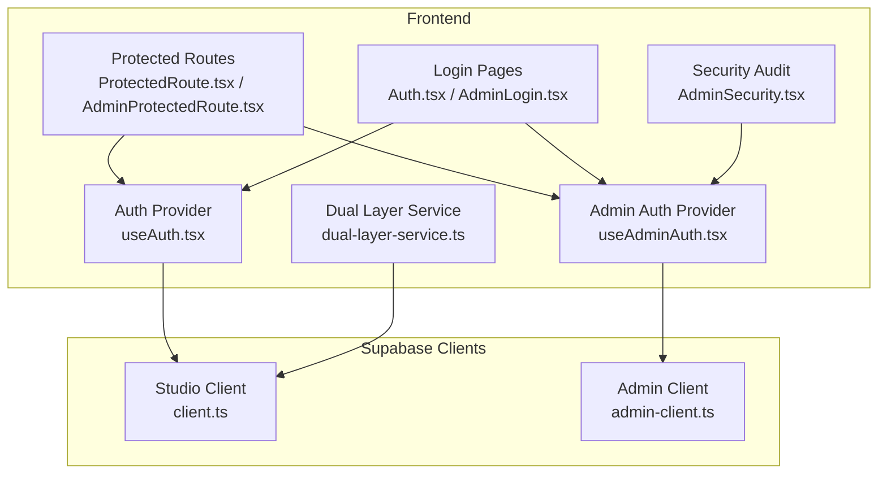
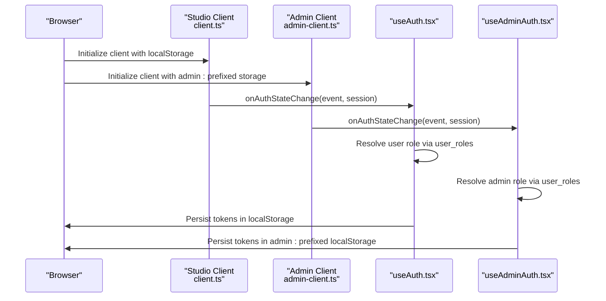
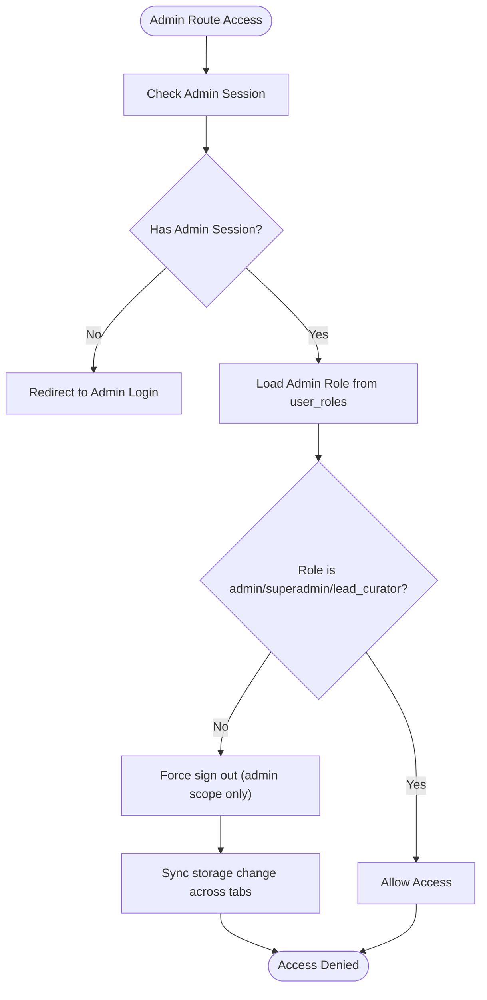
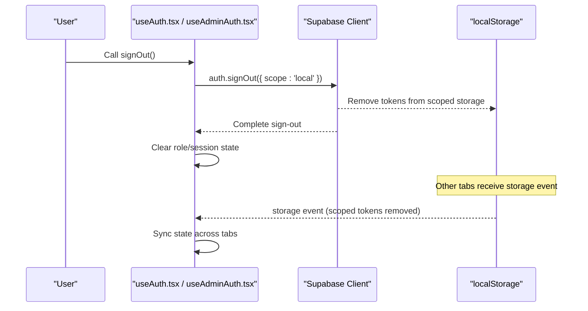
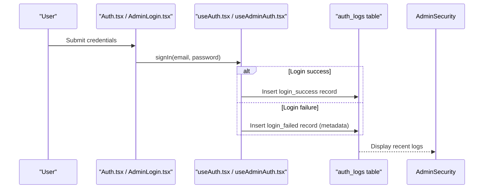
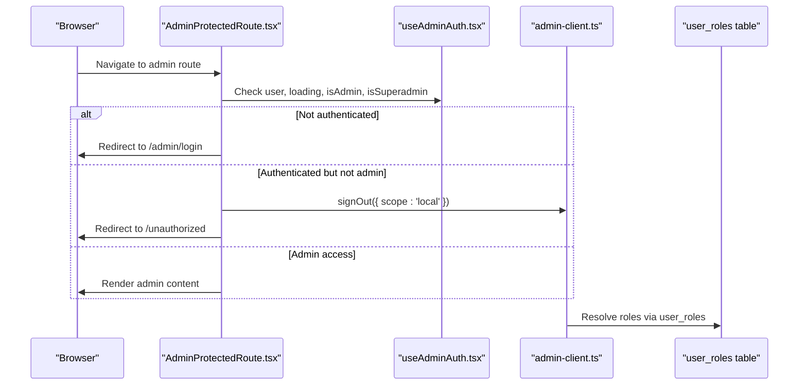
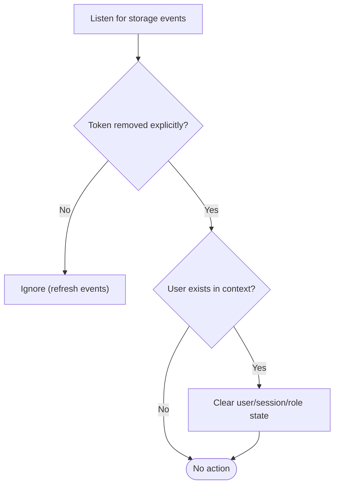
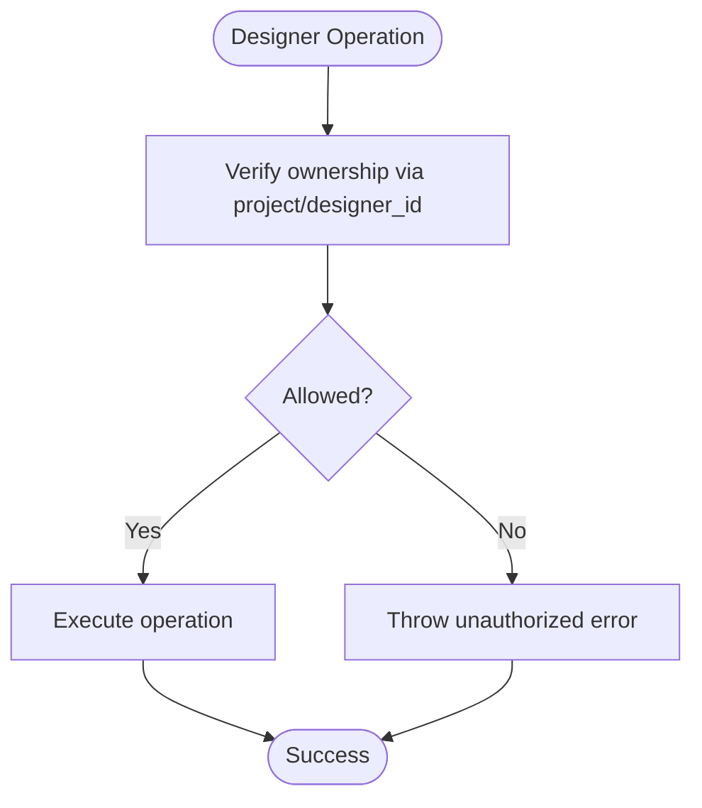
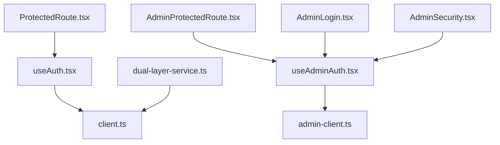

# Security Implementations

<cite>
**Referenced Files in This Document**
- [src/hooks/useAuth.tsx](file://src/hooks/useAuth.tsx)
- [src/hooks/useAdminAuth.tsx](file://src/hooks/useAdminAuth.tsx)
- [src/integrations/supabase/client.ts](file://src/integrations/supabase/client.ts)
- [src/integrations/supabase/admin-client.ts](file://src/integrations/supabase/admin-client.ts)
- [src/components/auth/ProtectedRoute.tsx](file://src/components/auth/ProtectedRoute.tsx)
- [src/components/auth/AdminProtectedRoute.tsx](file://src/components/auth/AdminProtectedRoute.tsx)
- [src/pages/Auth.tsx](file://src/pages/Auth.tsx)
- [src/pages/admin/AdminLogin.tsx](file://src/pages/admin/AdminLogin.tsx)
- [src/pages/admin/AdminSecurity.tsx](file://src/pages/admin/AdminSecurity.tsx)
- [src/contexts/DualLayerContext.tsx](file://src/contexts/DualLayerContext.tsx)
- [src/lib/dual-layer-service.ts](file://src/lib/dual-layer-service.ts)
- [src/lib/dual-layer-types.ts](file://src/lib/dual-layer-types.ts)
- [supabase/migrations/20260126040000_admin_auth_security.sql](file://supabase/migrations/20260126040000_admin_auth_security.sql)
- [supabase/migrations/20260126060000_isolate_admin_auth.sql](file://supabase/migrations/20260126060000_isolate_admin_auth.sql)
- [supabase/migrations/20260129000000_fix_security_vulnerabilities.sql](file://supabase/migrations/20260129000000_fix_security_vulnerabilities.sql)
</cite>

## Table of Contents
1. [Introduction](#introduction)
2. [Project Structure](#project-structure)
3. [Core Components](#core-components)
4. [Architecture Overview](#architecture-overview)
5. [Detailed Component Analysis](#detailed-component-analysis)
6. [Dependency Analysis](#dependency-analysis)
7. [Performance Considerations](#performance-considerations)
8. [Troubleshooting Guide](#troubleshooting-guide)
9. [Conclusion](#conclusion)

## Introduction
This document details the security implementations in the authentication system, focusing on the dual-layer security model, session isolation between designer and admin roles, secure token handling, authentication logging, failed login attempts tracking, and security event monitoring. It also covers practical examples for secure authentication flows, prevention of session hijacking, handling security vulnerabilities, storage event synchronization for multi-tab security, token refresh mechanisms, and logout procedures that maintain security across sessions.

## Project Structure
The authentication system is organized around two primary contexts:
- Designer/Studio authentication: handled by the main Supabase client and the customer authentication hook.
- Admin authentication: handled by a separate Supabase client with isolated storage to prevent cross-session contamination.

Key files:
- Authentication hooks: [useAuth.tsx](file://src/hooks/useAuth.tsx), [useAdminAuth.tsx](file://src/hooks/useAdminAuth.tsx)
- Supabase clients: [client.ts](file://src/integrations/supabase/client.ts), [admin-client.ts](file://src/integrations/supabase/admin-client.ts)
- Protected routes: [ProtectedRoute.tsx](file://src/components/auth/ProtectedRoute.tsx), [AdminProtectedRoute.tsx](file://src/components/auth/AdminProtectedRoute.tsx)
- Login pages: [Auth.tsx](file://src/pages/Auth.tsx), [AdminLogin.tsx](file://src/pages/admin/AdminLogin.tsx)
- Security audit page: [AdminSecurity.tsx](file://src/pages/admin/AdminSecurity.tsx)
- Dual-layer service and types: [dual-layer-service.ts](file://src/lib/dual-layer-service.ts), [dual-layer-types.ts](file://src/lib/dual-layer-types.ts), [DualLayerContext.tsx](file://src/contexts/DualLayerContext.tsx)

**Diagram sources**
- [src/hooks/useAuth.tsx](file://src/hooks/useAuth.tsx#L34-L314)
- [src/hooks/useAdminAuth.tsx](file://src/hooks/useAdminAuth.tsx#L21-L240)
- [src/components/auth/ProtectedRoute.tsx](file://src/components/auth/ProtectedRoute.tsx#L11-L41)
- [src/components/auth/AdminProtectedRoute.tsx](file://src/components/auth/AdminProtectedRoute.tsx#L11-L51)
- [src/pages/Auth.tsx](file://src/pages/Auth.tsx#L36-L183)
- [src/pages/admin/AdminLogin.tsx](file://src/pages/admin/AdminLogin.tsx#L17-L68)
- [src/pages/admin/AdminSecurity.tsx](file://src/pages/admin/AdminSecurity.tsx#L52-L617)
- [src/lib/dual-layer-service.ts](file://src/lib/dual-layer-service.ts#L4-L340)
- [src/integrations/supabase/client.ts](file://src/integrations/supabase/client.ts#L11-L17)
- [src/integrations/supabase/admin-client.ts](file://src/integrations/supabase/admin-client.ts#L7-L27)

**Section sources**
- [src/hooks/useAuth.tsx](file://src/hooks/useAuth.tsx#L1-L323)
- [src/hooks/useAdminAuth.tsx](file://src/hooks/useAdminAuth.tsx#L1-L249)
- [src/integrations/supabase/client.ts](file://src/integrations/supabase/client.ts#L1-L17)
- [src/integrations/supabase/admin-client.ts](file://src/integrations/supabase/admin-client.ts#L1-L28)

## Core Components
- Dual-layer authentication contexts:
  - Designer/Studio context: [useAuth.tsx](file://src/hooks/useAuth.tsx#L34-L314) manages user session, role resolution, and logging for studio actions.
  - Admin context: [useAdminAuth.tsx](file://src/hooks/useAdminAuth.tsx#L21-L240) manages admin session, role resolution, and logging for admin actions.
- Isolated Supabase clients:
  - Studio client: [client.ts](file://src/integrations/supabase/client.ts#L11-L17) uses browser localStorage for session persistence.
  - Admin client: [admin-client.ts](file://src/integrations/supabase/admin-client.ts#L7-L27) uses a custom storage adapter with a prefixed key to isolate admin sessions.
- Protected routes:
  - [ProtectedRoute.tsx](file://src/components/auth/ProtectedRoute.tsx#L11-L41) enforces studio access control.
  - [AdminProtectedRoute.tsx](file://src/components/auth/AdminProtectedRoute.tsx#L11-L51) enforces admin access control and optional superadmin requirement.
- Security audit and management:
  - [AdminSecurity.tsx](file://src/pages/admin/AdminSecurity.tsx#L52-L617) provides role management and audit log viewing.
- Dual-layer service:
  - [dual-layer-service.ts](file://src/lib/dual-layer-service.ts#L4-L340) encapsulates project, asset, and publication request operations with ownership checks.

**Section sources**
- [src/hooks/useAuth.tsx](file://src/hooks/useAuth.tsx#L17-L314)
- [src/hooks/useAdminAuth.tsx](file://src/hooks/useAdminAuth.tsx#L7-L240)
- [src/integrations/supabase/client.ts](file://src/integrations/supabase/client.ts#L11-L17)
- [src/integrations/supabase/admin-client.ts](file://src/integrations/supabase/admin-client.ts#L7-L27)
- [src/components/auth/ProtectedRoute.tsx](file://src/components/auth/ProtectedRoute.tsx#L11-L41)
- [src/components/auth/AdminProtectedRoute.tsx](file://src/components/auth/AdminProtectedRoute.tsx#L11-L51)
- [src/pages/admin/AdminSecurity.tsx](file://src/pages/admin/AdminSecurity.tsx#L52-L617)
- [src/lib/dual-layer-service.ts](file://src/lib/dual-layer-service.ts#L4-L340)

## Architecture Overview
The system implements a dual-layer security model:
- Session isolation: Admin and Studio sessions are stored under distinct keys, preventing cross-session hijacking.
- Role-based access control: Roles are resolved server-side via user_roles and enforced in route guards.
- Secure token handling: Both contexts support token refresh and explicit sign-out with scoped storage.
- Logging and monitoring: Authentication events are logged to dedicated tables for auditability.

**Diagram sources**
- [src/integrations/supabase/client.ts](file://src/integrations/supabase/client.ts#L11-L17)
- [src/integrations/supabase/admin-client.ts](file://src/integrations/supabase/admin-client.ts#L7-L27)
- [src/hooks/useAuth.tsx](file://src/hooks/useAuth.tsx#L108-L167)
- [src/hooks/useAdminAuth.tsx](file://src/hooks/useAdminAuth.tsx#L106-L167)

## Detailed Component Analysis

### Dual-Layer Security Model and Session Isolation
- Admin client storage adapter prefixes keys with "admin:" to ensure admin sessions are independent of studio sessions.
- The admin auth hook enforces invalid access by signing out from the admin scope when a non-admin user attempts to access admin routes.
- Multi-tab synchronization is implemented to detect explicit sign-out events and synchronize state across tabs.

**Diagram sources**
- [src/hooks/useAdminAuth.tsx](file://src/hooks/useAdminAuth.tsx#L79-L104)
- [src/components/auth/AdminProtectedRoute.tsx](file://src/components/auth/AdminProtectedRoute.tsx#L11-L51)
- [src/integrations/supabase/admin-client.ts](file://src/integrations/supabase/admin-client.ts#L7-L27)

**Section sources**
- [src/integrations/supabase/admin-client.ts](file://src/integrations/supabase/admin-client.ts#L7-L27)
- [src/hooks/useAdminAuth.tsx](file://src/hooks/useAdminAuth.tsx#L79-L104)
- [src/components/auth/AdminProtectedRoute.tsx](file://src/components/auth/AdminProtectedRoute.tsx#L11-L51)

### Secure Token Handling and Logout Procedures
- Studio logout uses scoped sign-out to prevent affecting admin sessions.
- Admin logout uses scoped sign-out to prevent affecting studio sessions.
- Token refresh events are ignored to prevent UI flicker while maintaining session integrity.
- Storage event listeners synchronize sign-out across tabs.

**Diagram sources**
- [src/hooks/useAuth.tsx](file://src/hooks/useAuth.tsx#L243-L265)
- [src/hooks/useAdminAuth.tsx](file://src/hooks/useAdminAuth.tsx#L201-L223)
- [src/integrations/supabase/client.ts](file://src/integrations/supabase/client.ts#L11-L17)
- [src/integrations/supabase/admin-client.ts](file://src/integrations/supabase/admin-client.ts#L14-L27)

**Section sources**
- [src/hooks/useAuth.tsx](file://src/hooks/useAuth.tsx#L243-L265)
- [src/hooks/useAdminAuth.tsx](file://src/hooks/useAdminAuth.tsx#L201-L223)
- [src/integrations/supabase/client.ts](file://src/integrations/supabase/client.ts#L11-L17)
- [src/integrations/supabase/admin-client.ts](file://src/integrations/supabase/admin-client.ts#L14-L27)

### Authentication Logging, Failed Login Attempts Tracking, and Security Event Monitoring
- Studio login failures are logged with error type metadata; successful logins are recorded with user agent.
- Admin login failures and successes are similarly logged with user agent and user identity.
- The Admin Security page displays recent authentication events from the auth_logs table.

**Diagram sources**
- [src/pages/Auth.tsx](file://src/pages/Auth.tsx#L87-L132)
- [src/pages/admin/AdminLogin.tsx](file://src/pages/admin/AdminLogin.tsx#L32-L68)
- [src/hooks/useAuth.tsx](file://src/hooks/useAuth.tsx#L211-L241)
- [src/hooks/useAdminAuth.tsx](file://src/hooks/useAdminAuth.tsx#L169-L199)
- [src/pages/admin/AdminSecurity.tsx](file://src/pages/admin/AdminSecurity.tsx#L135-L147)

**Section sources**
- [src/hooks/useAuth.tsx](file://src/hooks/useAuth.tsx#L199-L241)
- [src/hooks/useAdminAuth.tsx](file://src/hooks/useAdminAuth.tsx#L177-L199)
- [src/pages/admin/AdminSecurity.tsx](file://src/pages/admin/AdminSecurity.tsx#L135-L147)

### Practical Examples: Secure Authentication Flows and Session Hijacking Prevention
- Preventing session hijacking:
  - Admin client uses a custom storage adapter with a distinct key prefix to avoid conflicts with studio tokens.
  - AdminProtectedRoute validates role and forces sign-out if the user lacks admin privileges.
- Secure authentication flows:
  - ProtectedRoute redirects unauthenticated users to the appropriate login page and enforces admin requirements when needed.
  - AdminLogin performs client-side validation and triggers server-side sign-in with robust error messaging.

**Diagram sources**
- [src/components/auth/AdminProtectedRoute.tsx](file://src/components/auth/AdminProtectedRoute.tsx#L11-L51)
- [src/hooks/useAdminAuth.tsx](file://src/hooks/useAdminAuth.tsx#L106-L167)
- [src/integrations/supabase/admin-client.ts](file://src/integrations/supabase/admin-client.ts#L7-L27)

**Section sources**
- [src/components/auth/AdminProtectedRoute.tsx](file://src/components/auth/AdminProtectedRoute.tsx#L11-L51)
- [src/hooks/useAdminAuth.tsx](file://src/hooks/useAdminAuth.tsx#L79-L104)
- [src/integrations/supabase/admin-client.ts](file://src/integrations/supabase/admin-client.ts#L7-L27)

### Storage Event Synchronization for Multi-Tab Security
- Studio and Admin contexts listen for storage events to synchronize sign-out across tabs.
- Only explicit removal of tokens triggers synchronization; token refresh events are ignored to avoid UI flicker.

**Diagram sources**
- [src/hooks/useAuth.tsx](file://src/hooks/useAuth.tsx#L91-L106)
- [src/hooks/useAdminAuth.tsx](file://src/hooks/useAdminAuth.tsx#L89-L104)

**Section sources**
- [src/hooks/useAuth.tsx](file://src/hooks/useAuth.tsx#L91-L106)
- [src/hooks/useAdminAuth.tsx](file://src/hooks/useAdminAuth.tsx#L89-L104)

### Token Refresh Mechanisms
- Both clients enable automatic token refresh to maintain session continuity without manual intervention.
- The auth state listener ignores TOKEN_REFRESHED events to prevent unnecessary UI updates.

**Section sources**
- [src/integrations/supabase/client.ts](file://src/integrations/supabase/client.ts#L11-L17)
- [src/integrations/supabase/admin-client.ts](file://src/integrations/supabase/admin-client.ts#L14-L27)
- [src/hooks/useAuth.tsx](file://src/hooks/useAuth.tsx#L114-L141)
- [src/hooks/useAdminAuth.tsx](file://src/hooks/useAdminAuth.tsx#L113-L140)

### Role Management and Security Event Monitoring
- AdminSecurity page allows superadmin users to manage admin roles, revoke access, and view recent authentication logs.
- Role updates and access revocations are logged for auditability.

**Section sources**
- [src/pages/admin/AdminSecurity.tsx](file://src/pages/admin/AdminSecurity.tsx#L149-L285)
- [src/hooks/useAdminAuth.tsx](file://src/hooks/useAdminAuth.tsx#L34-L77)

### Dual-Layer Service Security Model
- Ownership verification is performed for all designer operations (project creation, updates, deletions, asset uploads).
- Publication requests are validated against project ownership before submission.
- Admin operations enforce status transitions and optional product conversion with logging.

**Diagram sources**
- [src/lib/dual-layer-service.ts](file://src/lib/dual-layer-service.ts#L25-L83)
- [src/lib/dual-layer-service.ts](file://src/lib/dual-layer-service.ts#L102-L144)
- [src/lib/dual-layer-service.ts](file://src/lib/dual-layer-service.ts#L147-L181)

**Section sources**
- [src/lib/dual-layer-service.ts](file://src/lib/dual-layer-service.ts#L25-L83)
- [src/lib/dual-layer-service.ts](file://src/lib/dual-layer-service.ts#L102-L144)
- [src/lib/dual-layer-service.ts](file://src/lib/dual-layer-service.ts#L147-L181)

## Dependency Analysis
- The studio and admin contexts depend on their respective Supabase clients.
- Protected routes depend on authentication hooks to enforce access control.
- The Admin Security page depends on the admin client and edge functions for invitations.

**Diagram sources**
- [src/hooks/useAuth.tsx](file://src/hooks/useAuth.tsx#L1-L323)
- [src/hooks/useAdminAuth.tsx](file://src/hooks/useAdminAuth.tsx#L1-L249)
- [src/integrations/supabase/client.ts](file://src/integrations/supabase/client.ts#L1-L17)
- [src/integrations/supabase/admin-client.ts](file://src/integrations/supabase/admin-client.ts#L1-L28)
- [src/components/auth/ProtectedRoute.tsx](file://src/components/auth/ProtectedRoute.tsx#L1-L42)
- [src/components/auth/AdminProtectedRoute.tsx](file://src/components/auth/AdminProtectedRoute.tsx#L1-L52)
- [src/pages/admin/AdminLogin.tsx](file://src/pages/admin/AdminLogin.tsx#L1-L158)
- [src/pages/admin/AdminSecurity.tsx](file://src/pages/admin/AdminSecurity.tsx#L1-L617)
- [src/lib/dual-layer-service.ts](file://src/lib/dual-layer-service.ts#L1-L340)

**Section sources**
- [src/hooks/useAuth.tsx](file://src/hooks/useAuth.tsx#L1-L323)
- [src/hooks/useAdminAuth.tsx](file://src/hooks/useAdminAuth.tsx#L1-L249)
- [src/integrations/supabase/client.ts](file://src/integrations/supabase/client.ts#L1-L17)
- [src/integrations/supabase/admin-client.ts](file://src/integrations/supabase/admin-client.ts#L1-L28)
- [src/components/auth/ProtectedRoute.tsx](file://src/components/auth/ProtectedRoute.tsx#L1-L42)
- [src/components/auth/AdminProtectedRoute.tsx](file://src/components/auth/AdminProtectedRoute.tsx#L1-L52)
- [src/pages/admin/AdminLogin.tsx](file://src/pages/admin/AdminLogin.tsx#L1-L158)
- [src/pages/admin/AdminSecurity.tsx](file://src/pages/admin/AdminSecurity.tsx#L1-L617)
- [src/lib/dual-layer-service.ts](file://src/lib/dual-layer-service.ts#L1-L340)

## Performance Considerations
- Debounced role checks reduce redundant server calls during authentication state changes.
- Ignoring TOKEN_REFRESHED events prevents unnecessary re-renders and maintains smooth UX.
- Multi-tab synchronization avoids race conditions by only responding to explicit sign-out events.

[No sources needed since this section provides general guidance]

## Troubleshooting Guide
Common issues and resolutions:
- Admin access denied:
  - Ensure the user has a valid admin role in user_roles; otherwise, the admin auth hook will force sign-out and redirect to unauthorized.
- Cross-session contamination:
  - Confirm that the admin client uses the custom storage adapter with "admin:" prefix and that studio and admin clients are initialized separately.
- Stale session state after logout:
  - Verify that storage event listeners are active and that sign-out uses the local scope to avoid affecting other contexts.
- Authentication logs not appearing:
  - Check that logging calls occur on both success and failure paths and that the auth_logs table is accessible.

**Section sources**
- [src/hooks/useAdminAuth.tsx](file://src/hooks/useAdminAuth.tsx#L79-L104)
- [src/integrations/supabase/admin-client.ts](file://src/integrations/supabase/admin-client.ts#L7-L27)
- [src/hooks/useAuth.tsx](file://src/hooks/useAuth.tsx#L91-L106)
- [src/hooks/useAdminAuth.tsx](file://src/hooks/useAdminAuth.tsx#L169-L199)

## Conclusion
The authentication system employs a robust dual-layer security model with strict session isolation between designer and admin roles, secure token handling, comprehensive logging, and multi-tab synchronization. The implementation leverages Supabase’s auth state management, custom storage adapters, and route guards to prevent session hijacking and ensure secure access control. Administrative oversight is supported through dedicated security management and audit logging capabilities.