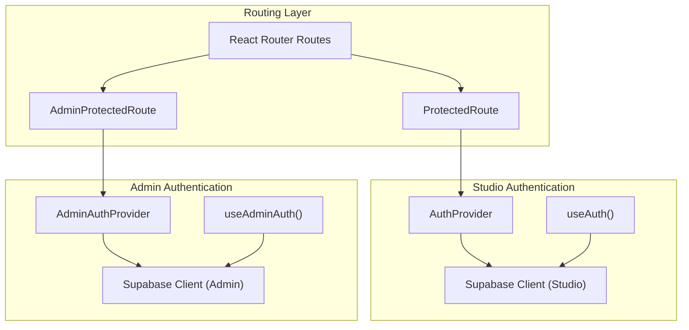
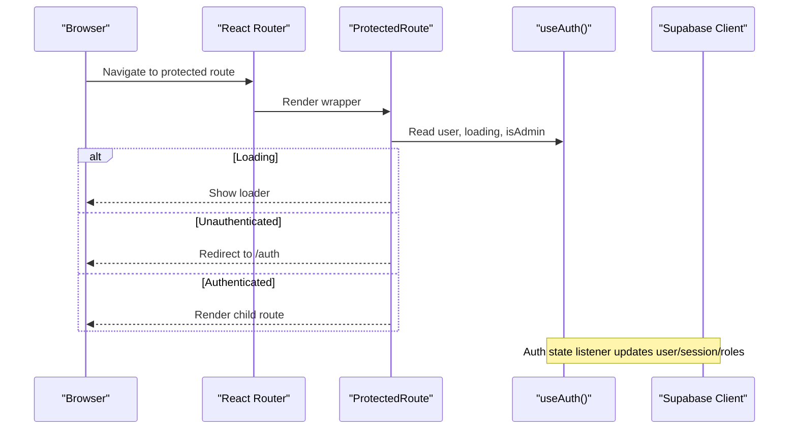
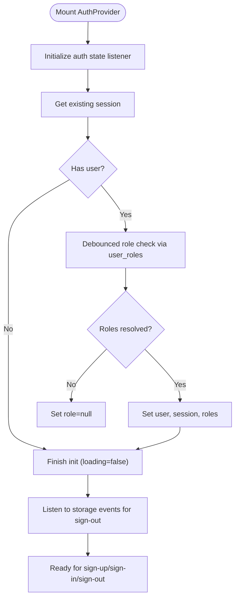
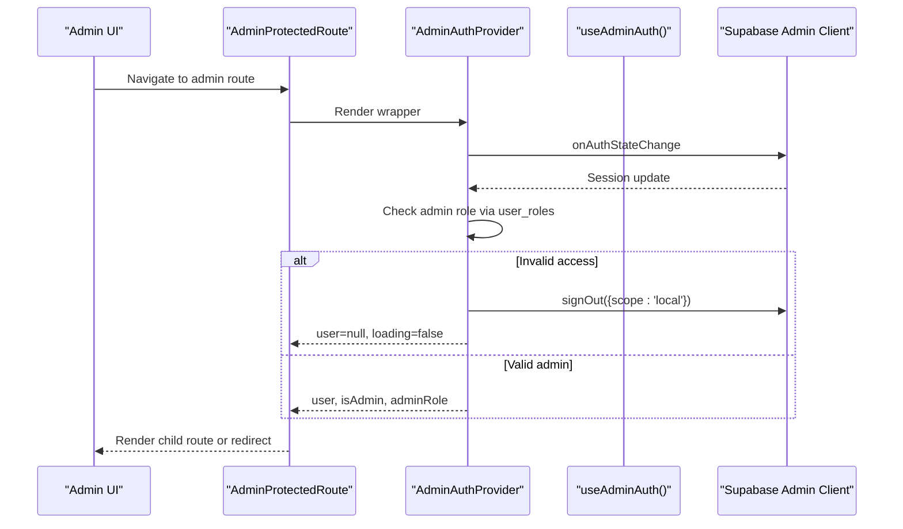
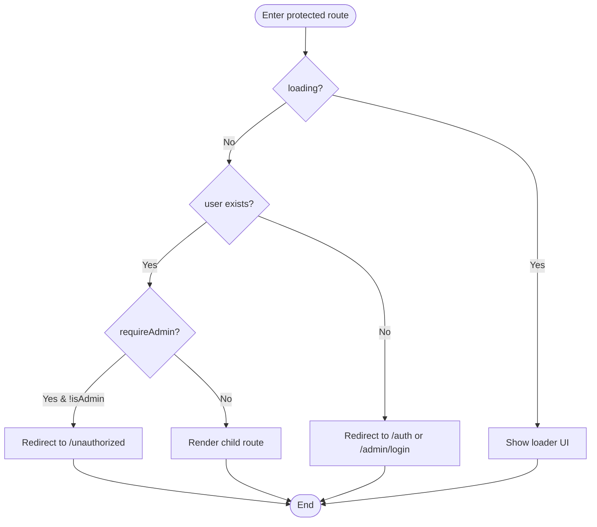
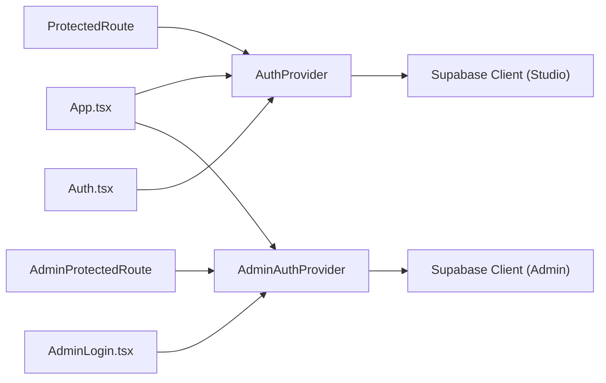

# User Authentication

<cite>
**Referenced Files in This Document**
- [App.tsx](file://src/App.tsx)
- [main.tsx](file://src/main.tsx)
- [useAuth.tsx](file://src/hooks/useAuth.tsx)
- [useAdminAuth.tsx](file://src/hooks/useAdminAuth.tsx)
- [client.ts](file://src/integrations/supabase/client.ts)
- [admin-client.ts](file://src/integrations/supabase/admin-client.ts)
- [ProtectedRoute.tsx](file://src/components/auth/ProtectedRoute.tsx)
- [AdminProtectedRoute.tsx](file://src/components/auth/AdminProtectedRoute.tsx)
- [Auth.tsx](file://src/pages/Auth.tsx)
- [AdminLogin.tsx](file://src/pages/admin/AdminLogin.tsx)
- [types.ts](file://src/integrations/supabase/types.ts)
</cite>

## Table of Contents
1. [Introduction](#introduction)
2. [Project Structure](#project-structure)
3. [Core Components](#core-components)
4. [Architecture Overview](#architecture-overview)
5. [Detailed Component Analysis](#detailed-component-analysis)
6. [Dependency Analysis](#dependency-analysis)
7. [Performance Considerations](#performance-considerations)
8. [Troubleshooting Guide](#troubleshooting-guide)
9. [Conclusion](#conclusion)

## Introduction
This document explains the user authentication system powering the Studio and Admin portals. It covers the AuthProvider implementation, user registration and login flows, session management, JWT token handling, multi-tab synchronization, authentication state persistence, and role detection logic. Practical examples demonstrate protected routes, handling authentication state changes, and managing sessions across browser tabs. It also documents the signUp, signIn, and signOut methods, including parameters and error handling, and addresses common scenarios such as session refresh, token expiration, and concurrent tab authentication conflicts.

## Project Structure
The authentication system is organized around two primary providers:
- Studio authentication via AuthProvider (designer and customer roles)
- Admin authentication via AdminAuthProvider (admin, superadmin, lead curator roles)

Providers wrap route groups and protect pages using dedicated ProtectedRoute components. Supabase clients are configured with separate storage keys to isolate sessions between Studio and Admin.

**Diagram sources**
- [App.tsx](file://src/App.tsx#L108-L132)
- [ProtectedRoute.tsx](file://src/components/auth/ProtectedRoute.tsx#L11-L41)
- [AdminProtectedRoute.tsx](file://src/components/auth/AdminProtectedRoute.tsx#L11-L51)
- [useAuth.tsx](file://src/hooks/useAuth.tsx#L34-L314)
- [useAdminAuth.tsx](file://src/hooks/useAdminAuth.tsx#L21-L240)
- [client.ts](file://src/integrations/supabase/client.ts#L11-L17)
- [admin-client.ts](file://src/integrations/supabase/admin-client.ts#L16-L27)

**Section sources**
- [App.tsx](file://src/App.tsx#L108-L132)
- [client.ts](file://src/integrations/supabase/client.ts#L11-L17)
- [admin-client.ts](file://src/integrations/supabase/admin-client.ts#L16-L27)

## Core Components
- AuthProvider and useAuth: Manage Studio user session, role detection, and customer profile retrieval. Handles sign-up, sign-in, and sign-out with logging and multi-tab synchronization.
- AdminAuthProvider and useAdminAuth: Manage Admin user session, role detection, and isolation from Studio sessions. Handles sign-in and sign-out with logging and multi-tab synchronization.
- ProtectedRoute and AdminProtectedRoute: Guard Studio and Admin routes respectively, redirecting unauthenticated users and enforcing role requirements.
- Supabase Clients: Studio and Admin clients configured with distinct storage keys and scopes to prevent session crosstalk.

Key responsibilities:
- Session lifecycle: initialization, refresh, logout
- Role detection: priority-based resolution (superadmin > admin > designer > customer)
- Multi-tab sync: explicit sign-out propagation via storage events
- Persistence: localStorage-backed sessions with auto-refresh enabled
- Logging: auth_logs and admin_logs for auditability

**Section sources**
- [useAuth.tsx](file://src/hooks/useAuth.tsx#L17-L314)
- [useAdminAuth.tsx](file://src/hooks/useAdminAuth.tsx#L7-L240)
- [ProtectedRoute.tsx](file://src/components/auth/ProtectedRoute.tsx#L6-L41)
- [AdminProtectedRoute.tsx](file://src/components/auth/AdminProtectedRoute.tsx#L6-L51)
- [client.ts](file://src/integrations/supabase/client.ts#L11-L17)
- [admin-client.ts](file://src/integrations/supabase/admin-client.ts#L16-L27)

## Architecture Overview
The authentication architecture separates concerns between Studio and Admin:
- Studio provider listens to Supabase auth state, persists sessions, detects roles, logs actions, and synchronizes multi-tab state.
- Admin provider isolates sessions using a custom storage adapter and enforces admin-only access.
- ProtectedRoute and AdminProtectedRoute enforce authentication and role checks at the routing level.

**Diagram sources**
- [ProtectedRoute.tsx](file://src/components/auth/ProtectedRoute.tsx#L11-L41)
- [useAuth.tsx](file://src/hooks/useAuth.tsx#L108-L167)

**Section sources**
- [App.tsx](file://src/App.tsx#L223-L300)
- [ProtectedRoute.tsx](file://src/components/auth/ProtectedRoute.tsx#L11-L41)
- [useAuth.tsx](file://src/hooks/useAuth.tsx#L108-L167)

## Detailed Component Analysis

### AuthProvider and useAuth
Authenticator for Studio users:
- Initializes auth state listener and session retrieval on mount
- Detects user roles by querying user_roles with priority ordering
- Logs sign-up, login success/failure, and logout actions
- Updates customer profile for customer users
- Synchronizes multi-tab state for explicit sign-outs
- Exposes signUp, signIn, signOut methods with robust error handling

**Diagram sources**
- [useAuth.tsx](file://src/hooks/useAuth.tsx#L108-L167)
- [useAuth.tsx](file://src/hooks/useAuth.tsx#L48-L89)
- [useAuth.tsx](file://src/hooks/useAuth.tsx#L91-L106)

Key methods and parameters:
- signUp(email: string, password: string, name: string, category: string, bio?: string, skills?: string[]): Promise<{ error: Error | null }>
- signIn(email: string, password: string): Promise<{ error: Error | null }>
- signOut(): Promise<void>

Error handling:
- signUp: returns error object; logs signup attempts
- signIn: logs failures with error classification; returns error object
- signOut: silences errors, logs logout, clears role

Role detection logic:
- Queries user_roles for a given user_id
- Resolves priority: superadmin > admin > designer > customer
- Falls back to null if no roles or error occurs

Multi-tab synchronization:
- Listens to storage events
- Syncs state only when Supabase auth token is explicitly removed (sign-out)

Authentication state persistence:
- Uses localStorage-backed Supabase client with autoRefreshToken enabled
- PersistSession is enabled for seamless re-authentication

**Section sources**
- [useAuth.tsx](file://src/hooks/useAuth.tsx#L34-L314)
- [client.ts](file://src/integrations/supabase/client.ts#L11-L17)

### AdminAuthProvider and useAdminAuth
Authenticator for Admin users:
- Isolates sessions using a custom storage adapter with admin-specific keys
- Enforces admin-only access by verifying user_roles
- Logs admin login success/failure and logout actions
- Synchronizes multi-tab state for explicit admin sign-outs
- Provides signIn and signOut methods scoped to admin sessions

**Diagram sources**
- [AdminProtectedRoute.tsx](file://src/components/auth/AdminProtectedRoute.tsx#L11-L51)
- [useAdminAuth.tsx](file://src/hooks/useAdminAuth.tsx#L106-L167)
- [useAdminAuth.tsx](file://src/hooks/useAdminAuth.tsx#L37-L87)
- [admin-client.ts](file://src/integrations/supabase/admin-client.ts#L16-L27)

Key methods and parameters:
- signIn(email: string, password: string): Promise<{ error: Error | null }>
- signOut(): Promise<void>

Error handling:
- signIn: logs failures with error classification; returns error object
- signOut: silences errors, logs admin logout, clears role

Role detection logic:
- Queries user_roles for admin roles (admin, superadmin, lead_curator)
- Invalid access triggers forced sign-out from admin scope

Multi-tab synchronization:
- Listens to storage events prefixed with admin keys
- Syncs state only when admin auth token is explicitly removed (sign-out)

Authentication state persistence:
- Uses custom storage adapter with admin-auth-token key
- Auto-refresh and persistSession enabled for admin sessions

**Section sources**
- [useAdminAuth.tsx](file://src/hooks/useAdminAuth.tsx#L21-L240)
- [admin-client.ts](file://src/integrations/supabase/admin-client.ts#L7-L27)

### ProtectedRoute and AdminProtectedRoute
Guard Studio and Admin routes:
- ProtectedRoute: redirects unauthenticated users to /auth; optionally requires admin role
- AdminProtectedRoute: redirects unauthenticated users to /admin/login; enforces admin or superadmin as needed

**Diagram sources**
- [ProtectedRoute.tsx](file://src/components/auth/ProtectedRoute.tsx#L11-L41)
- [AdminProtectedRoute.tsx](file://src/components/auth/AdminProtectedRoute.tsx#L11-L51)

**Section sources**
- [ProtectedRoute.tsx](file://src/components/auth/ProtectedRoute.tsx#L6-L41)
- [AdminProtectedRoute.tsx](file://src/components/auth/AdminProtectedRoute.tsx#L6-L51)

### Supabase Clients and Storage Isolation
- Studio client: localStorage-backed with autoRefreshToken and persistSession
- Admin client: custom storage adapter with admin-specific keys to prevent crosstalk
- Both clients initialized with the same Supabase URL and publishable key

**Section sources**
- [client.ts](file://src/integrations/supabase/client.ts#L11-L17)
- [admin-client.ts](file://src/integrations/supabase/admin-client.ts#L7-L27)

### Login and Registration Pages
- Auth page: supports email/password and Google OAuth; validates inputs and displays contextual error messages; navigates on success
- AdminLogin page: supports email/password for admin users; validates inputs and navigates after role verification

**Section sources**
- [Auth.tsx](file://src/pages/Auth.tsx#L36-L183)
- [AdminLogin.tsx](file://src/pages/admin/AdminLogin.tsx#L17-L68)

## Dependency Analysis
The authentication system relies on:
- React Router for route protection and navigation
- Supabase JS SDK for authentication and session management
- LocalStorage for session persistence and cross-tab synchronization
- Custom storage adapters to isolate Admin sessions

**Diagram sources**
- [App.tsx](file://src/App.tsx#L108-L132)
- [ProtectedRoute.tsx](file://src/components/auth/ProtectedRoute.tsx#L11-L41)
- [AdminProtectedRoute.tsx](file://src/components/auth/AdminProtectedRoute.tsx#L11-L51)
- [useAuth.tsx](file://src/hooks/useAuth.tsx#L34-L314)
- [useAdminAuth.tsx](file://src/hooks/useAdminAuth.tsx#L21-L240)
- [Auth.tsx](file://src/pages/Auth.tsx#L36-L183)
- [AdminLogin.tsx](file://src/pages/admin/AdminLogin.tsx#L17-L68)

**Section sources**
- [App.tsx](file://src/App.tsx#L108-L132)
- [useAuth.tsx](file://src/hooks/useAuth.tsx#L34-L314)
- [useAdminAuth.tsx](file://src/hooks/useAdminAuth.tsx#L21-L240)

## Performance Considerations
- Role checks are debounced to prevent rapid repeated queries during auth state transitions.
- Token refresh events are ignored to avoid unnecessary UI flicker.
- Auto-refresh and persistSession reduce friction for returning users while maintaining security.
- Multi-tab synchronization listens only for explicit sign-out events to minimize overhead.

[No sources needed since this section provides general guidance]

## Troubleshooting Guide
Common scenarios and resolutions:
- Session refresh and token expiration
  - Auto-refresh is enabled; if tokens expire unexpectedly, re-authentication is triggered automatically.
  - If users see flickering on refresh, the system ignores TOKEN_REFRESHED events to stabilize UI.

- Concurrent tab authentication conflicts
  - Explicit sign-outs propagate across tabs via storage events.
  - Studio and Admin sessions are isolated; cross-tab conflicts are prevented by separate storage keys.

- Role detection anomalies
  - Role resolution depends on user_roles entries; ensure roles are correctly assigned in the database.
  - Priority order: superadmin > admin > designer > customer.

- Admin access denied
  - If redirected to unauthorized, verify the user’s role in user_roles.
  - AdminProtectedRoute forces sign-out from admin scope for non-admin users.

- Error handling in sign-up/sign-in
  - signUp returns an error object; check for duplicate registrations and password policy violations.
  - signIn returns an error object; failure is logged with error classification.

**Section sources**
- [useAuth.tsx](file://src/hooks/useAuth.tsx#L114-L141)
- [useAdminAuth.tsx](file://src/hooks/useAdminAuth.tsx#L114-L140)
- [useAuth.tsx](file://src/hooks/useAuth.tsx#L91-L106)
- [useAdminAuth.tsx](file://src/hooks/useAdminAuth.tsx#L89-L104)
- [useAuth.tsx](file://src/hooks/useAuth.tsx#L48-L89)
- [useAdminAuth.tsx](file://src/hooks/useAdminAuth.tsx#L37-L87)

## Conclusion
The authentication system provides secure, role-aware access for Studio and Admin portals with robust session management, multi-tab synchronization, and clear separation of concerns. AuthProvider and AdminAuthProvider encapsulate Supabase integration, role detection, and logging, while ProtectedRoute and AdminProtectedRoute enforce access policies at the routing level. The design prioritizes reliability, isolation, and user experience across browser tabs and environments.