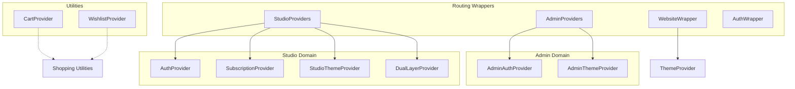
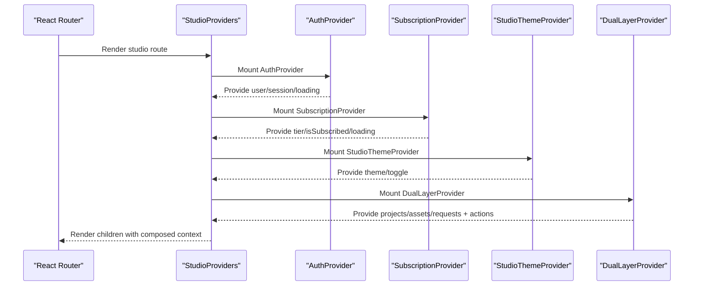
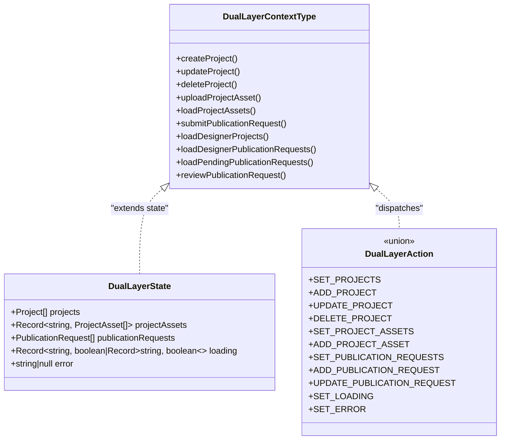
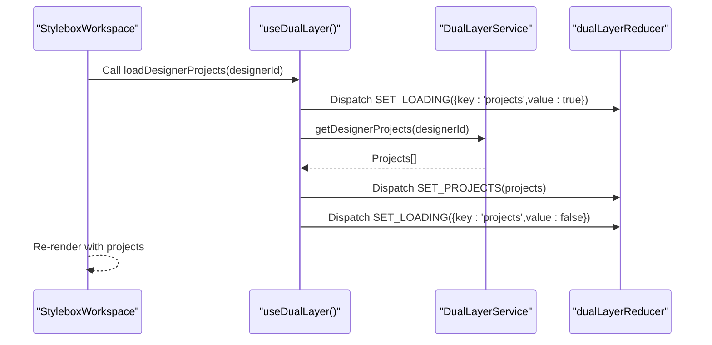
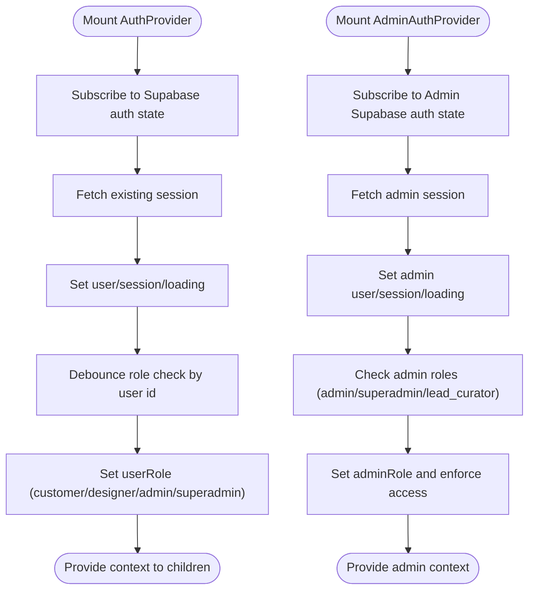
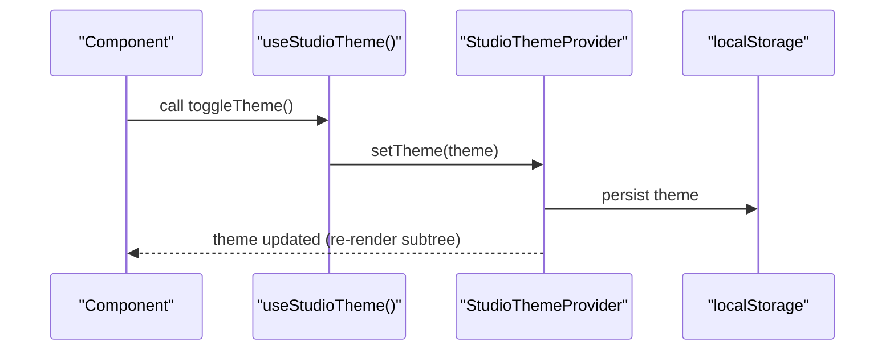
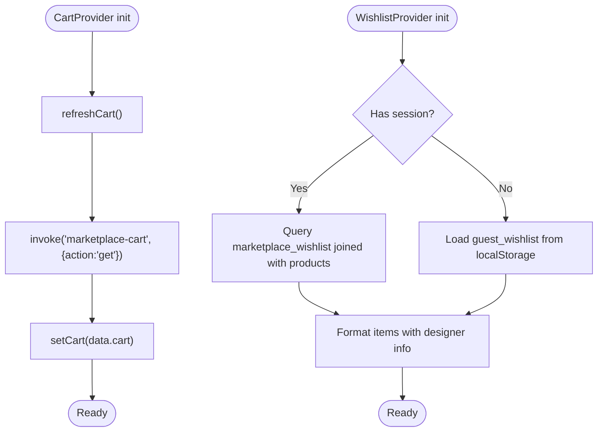
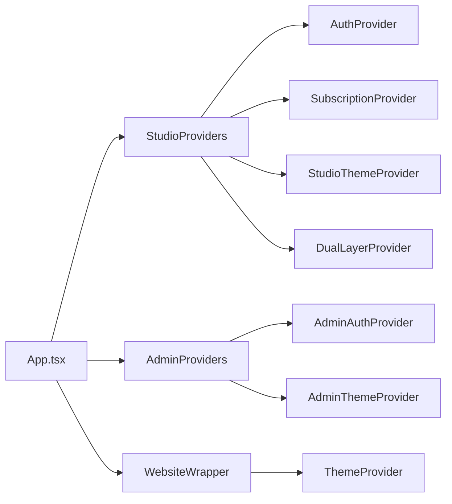

# Context Providers & State Management

<cite>
**Referenced Files in This Document**
- [DualLayerContext.tsx](file://src/contexts/DualLayerContext.tsx)
- [dual-layer-service.ts](file://src/lib/dual-layer-service.ts)
- [App.tsx](file://src/App.tsx)
- [useAuth.tsx](file://src/hooks/useAuth.tsx)
- [useAdminAuth.tsx](file://src/hooks/useAdminAuth.tsx)
- [useAdminTheme.tsx](file://src/hooks/useAdminTheme.tsx)
- [useStudioTheme.tsx](file://src/hooks/useStudioTheme.tsx)
- [useSubscription.tsx](file://src/hooks/useSubscription.tsx)
- [useCart.tsx](file://src/hooks/useCart.tsx)
- [useWishlist.tsx](file://src/hooks/useWishlist.tsx)
- [StyleboxWorkspace.tsx](file://src/pages/StyleboxWorkspace.tsx)
- [StyleboxManifestationQuadrant.tsx](file://src/components/stylebox/workspace/StyleboxManifestationQuadrant.tsx)
</cite>

## Table of Contents
1. [Introduction](#introduction)
2. [Project Structure](#project-structure)
3. [Core Components](#core-components)
4. [Architecture Overview](#architecture-overview)
5. [Detailed Component Analysis](#detailed-component-analysis)
6. [Dependency Analysis](#dependency-analysis)
7. [Performance Considerations](#performance-considerations)
8. [Troubleshooting Guide](#troubleshooting-guide)
9. [Conclusion](#conclusion)

## Introduction
This document explains the context providers and state management system used across the studio workspace, authentication, themes, and utility domains. It focuses on the DualLayerContext implementation for studio workspace management, authentication context providers, theme management contexts, and utility contexts. It covers provider hierarchy, state synchronization, composition patterns, usage examples, performance considerations, and strategies to avoid unnecessary re-renders. It also addresses the relationship between contexts and hooks, memory management, debugging context state, and best practices for designing and extending the context system.

## Project Structure
The application composes multiple context providers at the routing level to segment concerns by domain:
- Authentication providers for studio and admin portals
- Theme providers for studio and admin
- Subscription provider for studio
- Utility providers for shopping cart and wishlist
- DualLayerProvider for studio workspace data and operations

**Diagram sources**
- [App.tsx](file://src/App.tsx#L110-L145)
- [App.tsx](file://src/App.tsx#L156-L431)

**Section sources**
- [App.tsx](file://src/App.tsx#L110-L145)
- [App.tsx](file://src/App.tsx#L156-L431)

## Core Components
- DualLayerProvider: Centralized state and actions for studio workspace projects, assets, and publication requests.
- AuthProvider and AdminAuthProvider: Authentication state and role resolution for studio and admin respectively.
- StudioThemeProvider and AdminThemeProvider: Theme selection persistence and toggling.
- SubscriptionProvider: Subscription tier and checkout orchestration for studio users.
- CartProvider and WishlistProvider: Shopping cart and wishlist state with guest/local fallbacks.

**Section sources**
- [DualLayerContext.tsx](file://src/contexts/DualLayerContext.tsx#L135-L295)
- [useAuth.tsx](file://src/hooks/useAuth.tsx#L34-L314)
- [useAdminAuth.tsx](file://src/hooks/useAdminAuth.tsx#L21-L240)
- [useStudioTheme.tsx](file://src/hooks/useStudioTheme.tsx#L15-L42)
- [useAdminTheme.tsx](file://src/hooks/useAdminTheme.tsx#L15-L42)
- [useSubscription.tsx](file://src/hooks/useSubscription.tsx#L20-L143)
- [useCart.tsx](file://src/hooks/useCart.tsx#L57-L218)
- [useWishlist.tsx](file://src/hooks/useWishlist.tsx#L29-L235)

## Architecture Overview
The provider hierarchy ensures domain isolation and predictable state updates:
- Studio routes are wrapped with StudioProviders, which nest Auth, Subscription, StudioTheme, and DualLayer providers.
- Admin routes are wrapped with AdminProviders, which nest AdminAuth and AdminTheme providers.
- Public routes are wrapped with WebsiteWrapper, which nests ThemeProvider and Auth for public pages.
- Shopping utilities (Cart and Wishlist) are nested under public routes to support anonymous sessions.

**Diagram sources**
- [App.tsx](file://src/App.tsx#L110-L123)
- [App.tsx](file://src/App.tsx#L234-L311)

**Section sources**
- [App.tsx](file://src/App.tsx#L110-L123)
- [App.tsx](file://src/App.tsx#L234-L311)

## Detailed Component Analysis

### DualLayerContext: Studio Workspace Management
DualLayerContext encapsulates studio workspace data and operations:
- State model includes projects, per-project assets, publication requests, loading flags, and error state.
- Actions cover CRUD for projects, asset uploads, and publication lifecycle.
- Loading and error states are granular to avoid blocking unrelated UI areas.

**Diagram sources**
- [DualLayerContext.tsx](file://src/contexts/DualLayerContext.tsx#L5-L15)
- [DualLayerContext.tsx](file://src/contexts/DualLayerContext.tsx#L17-L28)
- [DualLayerContext.tsx](file://src/contexts/DualLayerContext.tsx#L120-L131)

Key provider responsibilities:
- Provider composes reducer state and bound async actions.
- Each action dispatches appropriate SET_LOADING/SET_ERROR transitions.
- Service calls are delegated to DualLayerService for database operations.

Usage example in studio workspace:
- StyleboxWorkspace composes the 4-quadrant UI and uses submission state to drive UI behavior and save triggers.
- While StyleboxManifestationQuadrant persists rationale via Supabase, other workspace data is managed by DualLayerProvider.

**Diagram sources**
- [StyleboxWorkspace.tsx](file://src/pages/StyleboxWorkspace.tsx#L29-L154)
- [DualLayerContext.tsx](file://src/contexts/DualLayerContext.tsx#L135-L295)
- [dual-layer-service.ts](file://src/lib/dual-layer-service.ts#L85-L99)

**Section sources**
- [DualLayerContext.tsx](file://src/contexts/DualLayerContext.tsx#L5-L15)
- [DualLayerContext.tsx](file://src/contexts/DualLayerContext.tsx#L17-L28)
- [DualLayerContext.tsx](file://src/contexts/DualLayerContext.tsx#L120-L131)
- [DualLayerContext.tsx](file://src/contexts/DualLayerContext.tsx#L135-L295)
- [dual-layer-service.ts](file://src/lib/dual-layer-service.ts#L4-L340)
- [StyleboxWorkspace.tsx](file://src/pages/StyleboxWorkspace.tsx#L29-L154)

### Authentication Context Providers
- AuthProvider: Manages studio user session, role resolution, and customer profile hydration. Uses Supabase auth listeners and debounced role checks to avoid flicker and redundant calls.
- AdminAuthProvider: Isolated admin session with separate storage scope and role checks. Prevents cross-session hijacking by signing out from admin scope only.

**Diagram sources**
- [useAuth.tsx](file://src/hooks/useAuth.tsx#L34-L314)
- [useAdminAuth.tsx](file://src/hooks/useAdminAuth.tsx#L21-L240)

**Section sources**
- [useAuth.tsx](file://src/hooks/useAuth.tsx#L34-L314)
- [useAdminAuth.tsx](file://src/hooks/useAdminAuth.tsx#L21-L240)

### Theme Management Contexts
- StudioThemeProvider and AdminThemeProvider persist theme preference in localStorage and expose toggle/set functions. They wrap children in a div with a theme-specific class for downstream styling.
- useStudioTheme and useAdminTheme return safe defaults when used outside their providers, preventing crashes.

**Diagram sources**
- [useStudioTheme.tsx](file://src/hooks/useStudioTheme.tsx#L15-L42)
- [useAdminTheme.tsx](file://src/hooks/useAdminTheme.tsx#L15-L42)

**Section sources**
- [useStudioTheme.tsx](file://src/hooks/useStudioTheme.tsx#L15-L42)
- [useAdminTheme.tsx](file://src/hooks/useAdminTheme.tsx#L15-L42)

### Utility Contexts: Cart and Wishlist
- CartProvider: Integrates with Supabase Edge Functions to manage cart state. Supports guest sessions via a generated session ID and includes timeouts for network requests. Exposes add/update/remove/clear plus refresh helpers.
- WishlistProvider: Hydrates from Supabase for authenticated users or localStorage for guests. Provides add/remove/inquiry helpers and refresh.

**Diagram sources**
- [useCart.tsx](file://src/hooks/useCart.tsx#L57-L218)
- [useWishlist.tsx](file://src/hooks/useWishlist.tsx#L29-L235)

**Section sources**
- [useCart.tsx](file://src/hooks/useCart.tsx#L57-L218)
- [useWishlist.tsx](file://src/hooks/useWishlist.tsx#L29-L235)

### Relationship Between Contexts and Hooks
- Each provider exports a corresponding hook that enforces usage within its provider boundary and throws a descriptive error if misused.
- Hooks centralize side effects (auth listeners, role checks, network calls) and expose pure state and action functions to components.

Examples:
- useAuth exposes user, session, role flags, and sign-in/sign-out functions.
- useAdminAuth exposes admin user, role flags, and admin sign-in/sign-out functions.
- useDualLayer exposes workspace data and actions for projects, assets, and publication requests.

**Section sources**
- [useAuth.tsx](file://src/hooks/useAuth.tsx#L316-L322)
- [useAdminAuth.tsx](file://src/hooks/useAdminAuth.tsx#L242-L248)
- [DualLayerContext.tsx](file://src/contexts/DualLayerContext.tsx#L297-L303)

## Dependency Analysis
Provider composition and coupling:
- StudioProviders composes Auth, Subscription, StudioTheme, and DualLayer. This ensures studio features share a coherent user and theme context while keeping workspace data isolated.
- AdminProviders composes AdminAuth and AdminTheme, isolating admin state from studio.
- Public routes rely on WebsiteWrapper and Auth for public pages, with Cart and Wishlist providers layered beneath for shopping.

**Diagram sources**
- [App.tsx](file://src/App.tsx#L110-L145)
- [App.tsx](file://src/App.tsx#L156-L431)

**Section sources**
- [App.tsx](file://src/App.tsx#L110-L145)
- [App.tsx](file://src/App.tsx#L156-L431)

## Performance Considerations
- Provider granularity: Keep providers focused on a single domain to minimize re-renders. For example, DualLayerProvider encapsulates only workspace data and actions.
- Avoid unnecessary re-renders:
  - Memoize callbacks passed to providers (e.g., useCallback for sign-in/sign-out and cart/wishlist functions).
  - Use shallow equality for props and avoid passing new object/array instances on each render.
  - Debounce heavy operations (e.g., role checks) to reduce redundant work.
- Loading and error boundaries: Use granular loading flags (per-project assets vs. projects) to avoid blocking unrelated UI.
- Network timeouts: CartProvider includes a timeout for Edge Function calls to fail fast and avoid hanging UI.
- Memory management:
  - Unsubscribe auth listeners and clear intervals in cleanup effects.
  - Avoid storing large objects in context; prefer normalized data and selectors.

[No sources needed since this section provides general guidance]

## Troubleshooting Guide
Common issues and remedies:
- Context not wrapped: Using a hook outside its provider throws a descriptive error. Ensure the route wrapper includes the provider.
- Auth flicker: AuthProvider debounces role checks and ignores token refresh events to stabilize UI during refresh cycles.
- Cross-session hijacking: AdminAuthProvider signs out from admin scope only, preventing a studio session from affecting admin views.
- Guest state persistence: Cart and Wishlist providers fall back to localStorage for guests, ensuring continuity across sessions.
- Debugging context state:
  - Temporarily log provider values at mount and after updates.
  - Inspect localStorage keys for theme preferences.
  - Monitor network requests to Edge Functions for cart/wishlist operations.

**Section sources**
- [useAuth.tsx](file://src/hooks/useAuth.tsx#L109-L167)
- [useAdminAuth.tsx](file://src/hooks/useAdminAuth.tsx#L106-L167)
- [useCart.tsx](file://src/hooks/useCart.tsx#L67-L99)
- [useWishlist.tsx](file://src/hooks/useWishlist.tsx#L34-L122)

## Conclusion
The context providers and state management system is organized around domain isolation and composability. Studio and admin contexts are separated, while shared utilities like theme and shopping are scoped appropriately. DualLayerContext centralizes workspace data and actions, enabling efficient updates and predictable UI behavior. Following the outlined patterns and best practices helps maintain scalability, performance, and developer ergonomics as the system evolves.