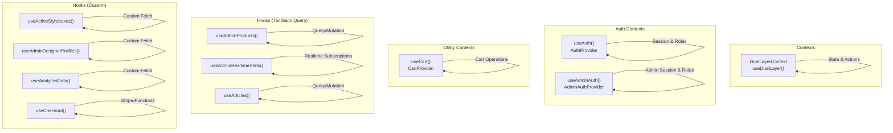
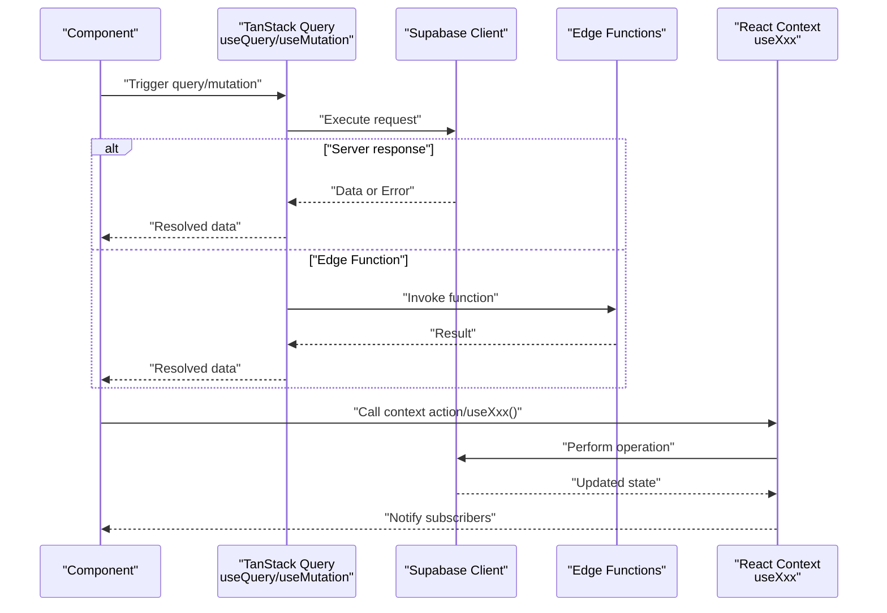
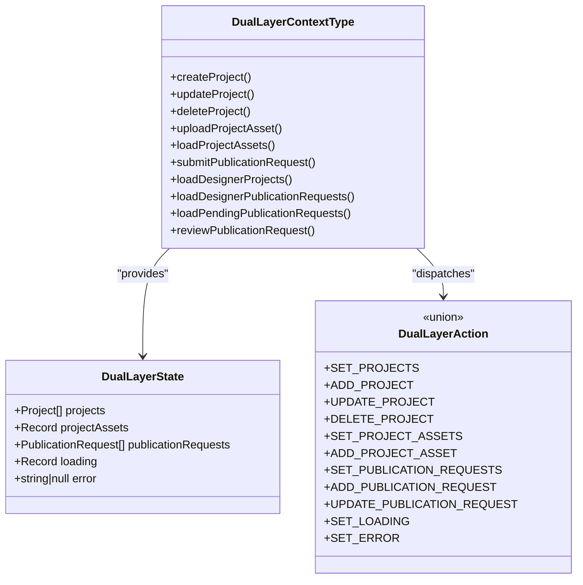
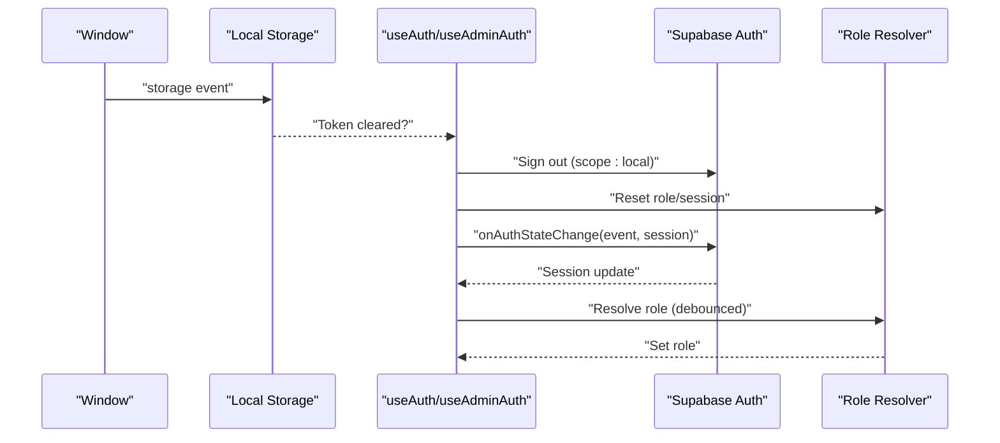
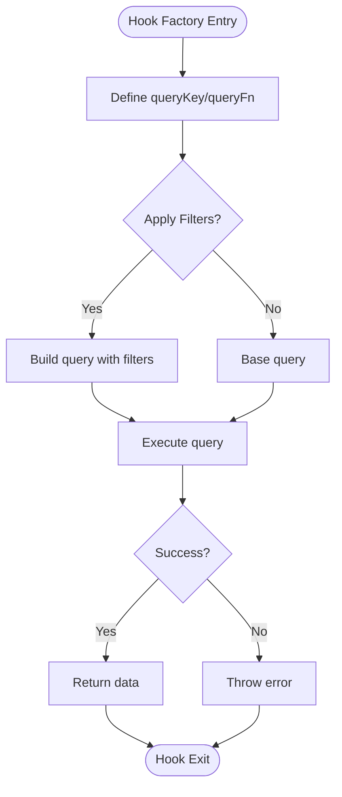
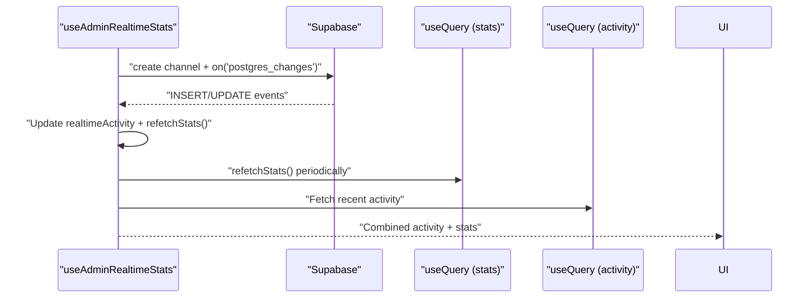
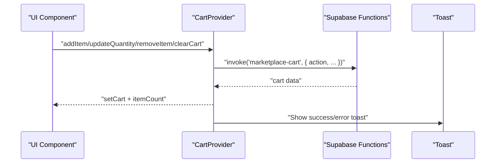
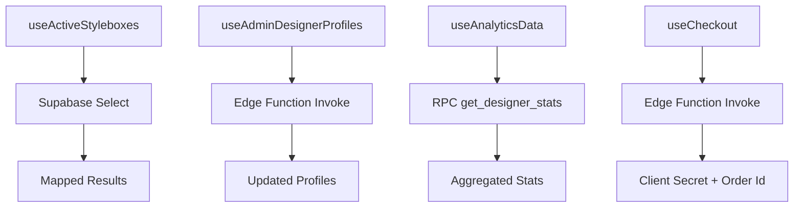
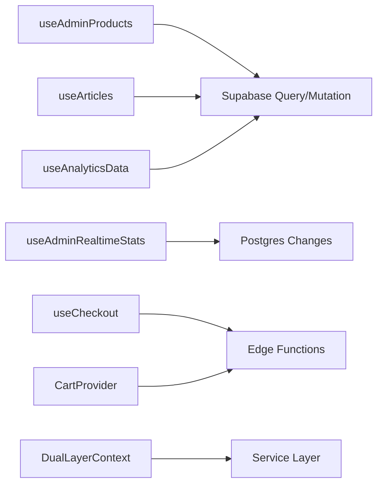

# Custom Hooks & Context Management

<cite>
**Referenced Files in This Document**
- [DualLayerContext.tsx](file://src/contexts/DualLayerContext.tsx)
- [useAuth.tsx](file://src/hooks/useAuth.tsx)
- [useAdminAuth.tsx](file://src/hooks/useAdminAuth.tsx)
- [useActiveStyleboxes.tsx](file://src/hooks/useActiveStyleboxes.tsx)
- [useAdminDesignerProfiles.ts](file://src/hooks/useAdminDesignerProfiles.ts)
- [useAdminProducts.tsx](file://src/hooks/useAdminProducts.tsx)
- [useAdminRealtimeStats.tsx](file://src/hooks/useAdminRealtimeStats.tsx)
- [useAnalyticsData.tsx](file://src/hooks/useAnalyticsData.tsx)
- [useArticles.tsx](file://src/hooks/useArticles.tsx)
- [useCart.tsx](file://src/hooks/useCart.tsx)
- [useCheckout.tsx](file://src/hooks/useCheckout.tsx)
</cite>

## Table of Contents
1. [Introduction](#introduction)
2. [Project Structure](#project-structure)
3. [Core Components](#core-components)
4. [Architecture Overview](#architecture-overview)
5. [Detailed Component Analysis](#detailed-component-analysis)
6. [Dependency Analysis](#dependency-analysis)
7. [Performance Considerations](#performance-considerations)
8. [Troubleshooting Guide](#troubleshooting-guide)
9. [Conclusion](#conclusion)
10. [Appendices](#appendices)

## Introduction
This document explains the custom React hooks and context management system used across the application. It focuses on:
- Hook factory patterns and reusable data-fetching strategies using TanStack Query
- Real-time subscription management via Supabase
- State synchronization across components using React Context and reducers
- Authentication contexts for studio and admin portals
- Practical usage examples, performance optimizations, and best practices
- Guidelines for creating new hooks and extending existing functionality

## Project Structure
The hooks and contexts are organized under dedicated folders:
- src/contexts: Provider-based state containers for cross-cutting concerns
- src/hooks: Reusable custom hooks encapsulating data fetching, mutations, and side effects

**Diagram sources**
- [DualLayerContext.tsx](file://src/contexts/DualLayerContext.tsx#L135-L295)
- [useAuth.tsx](file://src/hooks/useAuth.tsx#L22-L271)
- [useAdminAuth.tsx](file://src/hooks/useAdminAuth.tsx#L21-L240)
- [useCart.tsx](file://src/hooks/useCart.tsx#L57-L205)
- [useAdminProducts.tsx](file://src/hooks/useAdminProducts.tsx#L18-L230)
- [useAdminRealtimeStats.tsx](file://src/hooks/useAdminRealtimeStats.tsx#L24-L209)
- [useArticles.tsx](file://src/hooks/useArticles.tsx#L33-L175)
- [useActiveStyleboxes.tsx](file://src/hooks/useActiveStyleboxes.tsx#L30-L115)
- [useAdminDesignerProfiles.ts](file://src/hooks/useAdminDesignerProfiles.ts#L24-L148)
- [useAnalyticsData.tsx](file://src/hooks/useAnalyticsData.tsx#L41-L182)
- [useCheckout.tsx](file://src/hooks/useCheckout.tsx#L29-L188)

**Section sources**
- [DualLayerContext.tsx](file://src/contexts/DualLayerContext.tsx#L1-L303)
- [useAuth.tsx](file://src/hooks/useAuth.tsx#L1-L280)
- [useAdminAuth.tsx](file://src/hooks/useAdminAuth.tsx#L1-L249)
- [useCart.tsx](file://src/hooks/useCart.tsx#L1-L214)
- [useAdminProducts.tsx](file://src/hooks/useAdminProducts.tsx#L1-L230)
- [useAdminRealtimeStats.tsx](file://src/hooks/useAdminRealtimeStats.tsx#L1-L209)
- [useArticles.tsx](file://src/hooks/useArticles.tsx#L1-L175)
- [useActiveStyleboxes.tsx](file://src/hooks/useActiveStyleboxes.tsx#L1-L115)
- [useAdminDesignerProfiles.ts](file://src/hooks/useAdminDesignerProfiles.ts#L1-L148)
- [useAnalyticsData.tsx](file://src/hooks/useAnalyticsData.tsx#L1-L182)
- [useCheckout.tsx](file://src/hooks/useCheckout.tsx#L1-L188)

## Core Components
- DualLayerContext: A reducer-driven context managing projects, assets, and publication requests with CRUD actions and loading/error states.
- Authentication contexts: useAuth for studio users and useAdminAuth for admin portals, including role resolution and multi-tab synchronization.
- Utility contexts: CartProvider wraps cart operations via Supabase Edge Functions.
- TanStack Query hooks: useAdminProducts, useArticles, useAdminRealtimeStats encapsulate server queries, mutations, and cache invalidation.
- Custom hooks: useActiveStyleboxes, useAdminDesignerProfiles, useAnalyticsData, useCheckout implement domain-specific data fetching and state logic.

**Section sources**
- [DualLayerContext.tsx](file://src/contexts/DualLayerContext.tsx#L5-L131)
- [useAuth.tsx](file://src/hooks/useAuth.tsx#L7-L280)
- [useAdminAuth.tsx](file://src/hooks/useAdminAuth.tsx#L7-L249)
- [useCart.tsx](file://src/hooks/useCart.tsx#L34-L214)
- [useAdminProducts.tsx](file://src/hooks/useAdminProducts.tsx#L18-L230)
- [useArticles.tsx](file://src/hooks/useArticles.tsx#L33-L175)
- [useAdminRealtimeStats.tsx](file://src/hooks/useAdminRealtimeStats.tsx#L24-L209)
- [useActiveStyleboxes.tsx](file://src/hooks/useActiveStyleboxes.tsx#L30-L115)
- [useAdminDesignerProfiles.ts](file://src/hooks/useAdminDesignerProfiles.ts#L24-L148)
- [useAnalyticsData.tsx](file://src/hooks/useAnalyticsData.tsx#L41-L182)
- [useCheckout.tsx](file://src/hooks/useCheckout.tsx#L29-L188)

## Architecture Overview
The system combines:
- React Context for shared state and actions
- Reducers for deterministic state transitions
- TanStack Query for caching, background updates, and optimistic updates
- Supabase for authentication, database, RPC, and real-time Postgres changes
- Edge Functions for cart and checkout orchestration

**Diagram sources**
- [useAdminProducts.tsx](file://src/hooks/useAdminProducts.tsx#L18-L230)
- [useArticles.tsx](file://src/hooks/useArticles.tsx#L33-L175)
- [useCart.tsx](file://src/hooks/useCart.tsx#L67-L85)
- [useCheckout.tsx](file://src/hooks/useCheckout.tsx#L38-L86)
- [DualLayerContext.tsx](file://src/contexts/DualLayerContext.tsx#L135-L295)

## Detailed Component Analysis

### DualLayerContext (Reducer + Context)
DualLayerContext centralizes state for projects, assets, and publication requests. It exposes actions to mutate state and integrates with a service layer for persistence. Loading and error states are tracked per key.

**Diagram sources**
- [DualLayerContext.tsx](file://src/contexts/DualLayerContext.tsx#L5-L131)

Key behaviors:
- Loading flags support granular keys (e.g., assets per project)
- Error messages are centralized
- Actions update state immutably via reducer

Usage examples:
- Create a project: call createProject with designerId and project data
- Load assets: call loadProjectAssets with projectId
- Submit publication request: call submitPublicationRequest with designerId and request payload

**Section sources**
- [DualLayerContext.tsx](file://src/contexts/DualLayerContext.tsx#L135-L295)

### Authentication Contexts (Studio and Admin)
Both contexts manage session lifecycle, role resolution, and multi-tab synchronization. They differentiate between studio and admin sessions and enforce scoped sign-out to avoid cross-session contamination.

**Diagram sources**
- [useAuth.tsx](file://src/hooks/useAuth.tsx#L77-L152)
- [useAdminAuth.tsx](file://src/hooks/useAdminAuth.tsx#L89-L167)

Best practices:
- Debounce role checks to avoid excessive network calls
- Scope sign-out to local to prevent hijacking admin sessions
- Ignore TOKEN_REFRESHED events to reduce UI flicker

**Section sources**
- [useAuth.tsx](file://src/hooks/useAuth.tsx#L22-L271)
- [useAdminAuth.tsx](file://src/hooks/useAdminAuth.tsx#L21-L240)

### TanStack Query Hooks (useAdminProducts, useArticles)
These hooks demonstrate the hook factory pattern with:
- Query keys for cache partitioning
- Conditional filters and search
- Mutations with optimistic updates and cache invalidation
- Toast notifications for user feedback

**Diagram sources**
- [useAdminProducts.tsx](file://src/hooks/useAdminProducts.tsx#L18-L52)
- [useArticles.tsx](file://src/hooks/useArticles.tsx#L33-L97)

Practical usage:
- Filtering: pass filters object to useAdminProducts
- Mutations: useCreateProduct/useUpdateProduct/useDeleteProduct return mutation helpers
- Stats: useAdminProductStats aggregates counts with RPC-like calls

**Section sources**
- [useAdminProducts.tsx](file://src/hooks/useAdminProducts.tsx#L18-L230)
- [useArticles.tsx](file://src/hooks/useArticles.tsx#L33-L175)

### Real-time Subscriptions (useAdminRealtimeStats)
This hook demonstrates real-time synchronization using Supabase Postgres changes:
- Initial stats via useQuery with periodic refetch
- Real-time channels for profiles, stylebox_submissions, portfolio_publications, and earnings
- Merging recent activity with live updates and deduplicating entries

**Diagram sources**
- [useAdminRealtimeStats.tsx](file://src/hooks/useAdminRealtimeStats.tsx#L114-L184)

**Section sources**
- [useAdminRealtimeStats.tsx](file://src/hooks/useAdminRealtimeStats.tsx#L24-L209)

### Utility Context (CartProvider)
CartProvider manages cart state via Supabase Edge Functions:
- Session-scoped cart for guests using localStorage session IDs
- CRUD operations mapped to function invocations
- Toast feedback for user actions

**Diagram sources**
- [useCart.tsx](file://src/hooks/useCart.tsx#L67-L85)
- [useCart.tsx](file://src/hooks/useCart.tsx#L99-L183)

**Section sources**
- [useCart.tsx](file://src/hooks/useCart.tsx#L57-L214)

### Additional Hooks (Custom)
- useActiveStyleboxes: Fetches active stylebox submissions for the authenticated user
- useAdminDesignerProfiles: Loads designer profiles and updates approval/feature status via Edge Function
- useAnalyticsData: Aggregates earnings, sales, and top products using RPC and joins
- useCheckout: Creates/Confirms Stripe checkout sessions via Edge Functions

**Diagram sources**
- [useActiveStyleboxes.tsx](file://src/hooks/useActiveStyleboxes.tsx#L42-L111)
- [useAdminDesignerProfiles.ts](file://src/hooks/useAdminDesignerProfiles.ts#L29-L148)
- [useAnalyticsData.tsx](file://src/hooks/useAnalyticsData.tsx#L61-L178)
- [useCheckout.tsx](file://src/hooks/useCheckout.tsx#L38-L188)

**Section sources**
- [useActiveStyleboxes.tsx](file://src/hooks/useActiveStyleboxes.tsx#L30-L115)
- [useAdminDesignerProfiles.ts](file://src/hooks/useAdminDesignerProfiles.ts#L24-L148)
- [useAnalyticsData.tsx](file://src/hooks/useAnalyticsData.tsx#L41-L182)
- [useCheckout.tsx](file://src/hooks/useCheckout.tsx#L29-L188)

## Dependency Analysis
- Contexts depend on React’s Context and Reducer APIs
- Hooks integrate with Supabase clients (client/admin-client) and Edge Functions
- TanStack Query manages caching and invalidation across hooks
- Real-time subscriptions rely on Supabase Postgres changes

**Diagram sources**
- [useAdminProducts.tsx](file://src/hooks/useAdminProducts.tsx#L18-L230)
- [useArticles.tsx](file://src/hooks/useArticles.tsx#L33-L175)
- [useAdminRealtimeStats.tsx](file://src/hooks/useAdminRealtimeStats.tsx#L114-L184)
- [useAnalyticsData.tsx](file://src/hooks/useAnalyticsData.tsx#L61-L178)
- [useCheckout.tsx](file://src/hooks/useCheckout.tsx#L38-L188)
- [useCart.tsx](file://src/hooks/useCart.tsx#L67-L85)
- [DualLayerContext.tsx](file://src/contexts/DualLayerContext.tsx#L135-L295)

**Section sources**
- [useAdminProducts.tsx](file://src/hooks/useAdminProducts.tsx#L1-L230)
- [useArticles.tsx](file://src/hooks/useArticles.tsx#L1-L175)
- [useAdminRealtimeStats.tsx](file://src/hooks/useAdminRealtimeStats.tsx#L1-L209)
- [useAnalyticsData.tsx](file://src/hooks/useAnalyticsData.tsx#L1-L182)
- [useCheckout.tsx](file://src/hooks/useCheckout.tsx#L1-L188)
- [useCart.tsx](file://src/hooks/useCart.tsx#L1-L214)
- [DualLayerContext.tsx](file://src/contexts/DualLayerContext.tsx#L1-L303)

## Performance Considerations
- Prefer TanStack Query for caching and background refetching; use queryKey granularity to avoid unnecessary cache misses
- Debounce role checks in auth contexts to minimize repeated network calls
- Use refetchInterval judiciously for real-time dashboards; balance freshness vs. bandwidth
- Invalidate only affected query keys after mutations to reduce re-rendering
- Memoize callbacks in providers to prevent unnecessary re-renders
- Scope auth operations to local sessions to avoid cross-context interference

[No sources needed since this section provides general guidance]

## Troubleshooting Guide
Common issues and remedies:
- Auth state flicker: Ignore TOKEN_REFRESHED events and debounce role resolution
- Cross-session contamination: Use signOut with scope: 'local' for admin/studio isolation
- Real-time gaps: Verify channel subscriptions and ensure cleanup on unmount
- Cart errors: Inspect Edge Function responses and show user-friendly toasts
- Query errors: Surface error messages from Supabase and display actionable toasts

**Section sources**
- [useAuth.tsx](file://src/hooks/useAuth.tsx#L94-L152)
- [useAdminAuth.tsx](file://src/hooks/useAdminAuth.tsx#L106-L167)
- [useAdminRealtimeStats.tsx](file://src/hooks/useAdminRealtimeStats.tsx#L181-L184)
- [useCart.tsx](file://src/hooks/useCart.tsx#L88-L97)
- [useCheckout.tsx](file://src/hooks/useCheckout.tsx#L72-L86)

## Conclusion
The system leverages React Context, reducers, and TanStack Query to deliver scalable, maintainable state management. Authentication contexts ensure secure, isolated sessions, while real-time subscriptions keep dashboards fresh. Hooks encapsulate domain logic, enabling predictable reuse and testability.

[No sources needed since this section summarizes without analyzing specific files]

## Appendices

### Practical Usage Examples
- TanStack Query hooks
  - Filtering and pagination: pass filters to useAdminProducts and useArticles
  - Mutations: useCreateProduct/useUpdateProduct/useDeleteProduct and handle onSuccess/onError
- Real-time stats
  - Subscribe to admin dashboard events and refetch stats automatically
- Cart and checkout
  - Add/update/remove items; create/confirm checkout sessions via Edge Functions
- Authentication
  - Use useAuth for studio features and useAdminAuth for admin-only routes

**Section sources**
- [useAdminProducts.tsx](file://src/hooks/useAdminProducts.tsx#L18-L230)
- [useArticles.tsx](file://src/hooks/useArticles.tsx#L33-L175)
- [useAdminRealtimeStats.tsx](file://src/hooks/useAdminRealtimeStats.tsx#L24-L209)
- [useCart.tsx](file://src/hooks/useCart.tsx#L57-L214)
- [useCheckout.tsx](file://src/hooks/useCheckout.tsx#L29-L188)
- [useAuth.tsx](file://src/hooks/useAuth.tsx#L22-L271)
- [useAdminAuth.tsx](file://src/hooks/useAdminAuth.tsx#L21-L240)

### Best Practices for Creating New Hooks
- Encapsulate data fetching and mutations behind TanStack Query hooks for caching and invalidation
- Keep hooks pure; delegate side effects to providers or separate utilities
- Use memoized callbacks to avoid re-renders
- Provide clear error surfaces and user feedback via toasts
- Scope auth operations to appropriate clients and sessions
- For real-time needs, use Supabase Postgres changes with proper cleanup

[No sources needed since this section provides general guidance]