# Custom Hooks Implementation

<cite>
**Referenced Files in This Document**
- [useAuth.tsx](file://src/hooks/useAuth.tsx)
- [useArticles.tsx](file://src/hooks/useArticles.tsx)
- [useAdminRealtimeStats.tsx](file://src/hooks/useAdminRealtimeStats.tsx)
- [useMarketplaceProducts.tsx](file://src/hooks/useMarketplaceProducts.tsx)
- [useCart.tsx](file://src/hooks/useCart.tsx)
- [useNotifications.tsx](file://src/hooks/useNotifications.tsx)
- [useMobile.tsx](file://src/hooks/use-mobile.tsx)
- [useCheckout.tsx](file://src/hooks/useCheckout.tsx)
- [useProfile.tsx](file://src/hooks/useProfile.tsx)
- [useDashboardStats.tsx](file://src/hooks/useDashboardStats.tsx)
- [client.ts](file://src/integrations/supabase/client.ts)
- [admin-client.ts](file://src/integrations/supabase/admin-client.ts)
- [use-toast.ts](file://src/hooks/use-toast.ts)
</cite>

## Table of Contents
1. [Introduction](#introduction)
2. [Project Structure](#project-structure)
3. [Core Components](#core-components)
4. [Architecture Overview](#architecture-overview)
5. [Detailed Component Analysis](#detailed-component-analysis)
6. [Dependency Analysis](#dependency-analysis)
7. [Performance Considerations](#performance-considerations)
8. [Troubleshooting Guide](#troubleshooting-guide)
9. [Conclusion](#conclusion)
10. [Appendices](#appendices)

## Introduction
This document provides comprehensive documentation for the custom React hooks implementation used throughout the application. It focuses on:
- The hook factory pattern used to encapsulate Supabase data fetching and real-time subscriptions
- Data fetching strategies leveraging TanStack Query for caching, invalidation, and optimistic updates
- Real-time subscription management via Supabase Postgres changes
- State synchronization patterns across UI components
- Hook composition, dependency management, and performance optimizations
- Practical usage examples, debugging strategies, error handling patterns, and best practices

## Project Structure
The hooks are organized under a dedicated directory and integrate with Supabase clients for authentication, real-time, and serverless functions. Providers wrap child components to share state and side effects consistently.

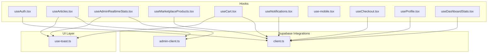

**Diagram sources**
- [useAuth.tsx](file://src/hooks/useAuth.tsx#L1-L323)
- [useArticles.tsx](file://src/hooks/useArticles.tsx#L1-L175)
- [useAdminRealtimeStats.tsx](file://src/hooks/useAdminRealtimeStats.tsx#L1-L209)
- [useMarketplaceProducts.tsx](file://src/hooks/useMarketplaceProducts.tsx#L1-L207)
- [useCart.tsx](file://src/hooks/useCart.tsx#L1-L214)
- [useNotifications.tsx](file://src/hooks/useNotifications.tsx#L1-L158)
- [use-mobile.tsx](file://src/hooks/use-mobile.tsx#L1-L21)
- [useCheckout.tsx](file://src/hooks/useCheckout.tsx#L1-L188)
- [useProfile.tsx](file://src/hooks/useProfile.tsx#L1-L160)
- [useDashboardStats.tsx](file://src/hooks/useDashboardStats.tsx#L1-L147)
- [client.ts](file://src/integrations/supabase/client.ts#L1-L17)
- [admin-client.ts](file://src/integrations/supabase/admin-client.ts#L1-L28)
- [use-toast.ts](file://src/hooks/use-toast.ts#L1-L187)

**Section sources**
- [useAuth.tsx](file://src/hooks/useAuth.tsx#L1-L323)
- [useArticles.tsx](file://src/hooks/useArticles.tsx#L1-L175)
- [useAdminRealtimeStats.tsx](file://src/hooks/useAdminRealtimeStats.tsx#L1-L209)
- [useMarketplaceProducts.tsx](file://src/hooks/useMarketplaceProducts.tsx#L1-L207)
- [useCart.tsx](file://src/hooks/useCart.tsx#L1-L214)
- [useNotifications.tsx](file://src/hooks/useNotifications.tsx#L1-L158)
- [use-mobile.tsx](file://src/hooks/use-mobile.tsx#L1-L21)
- [useCheckout.tsx](file://src/hooks/useCheckout.tsx#L1-L188)
- [useProfile.tsx](file://src/hooks/useProfile.tsx#L1-L160)
- [useDashboardStats.tsx](file://src/hooks/useDashboardStats.tsx#L1-L147)
- [client.ts](file://src/integrations/supabase/client.ts#L1-L17)
- [admin-client.ts](file://src/integrations/supabase/admin-client.ts#L1-L28)
- [use-toast.ts](file://src/hooks/use-toast.ts#L1-L187)

## Core Components
This section outlines the primary hooks, their responsibilities, parameters, return values, and usage patterns.

- useAuth
  - Purpose: Centralizes authentication state, role detection, and session lifecycle. Provides sign-up, sign-in, and sign-out actions with logging and cross-tab synchronization.
  - Parameters: None (provider wraps children)
  - Returns: { user, session, loading, isAdmin, isDesigner, isCustomer, userRole, customerProfile, isSigningOut, signUp, signIn, signOut }
  - Usage: Wrap the app with AuthProvider; consume via useAuth in components.
  - Key patterns: Auth state listener, role resolution, multi-tab sync, debounced role checks, customer profile fetch.

- useArticles
  - Purpose: Data fetching and mutations for articles using TanStack Query. Supports filtering, single article retrieval, and CRUD operations.
  - Parameters: filters (ArticleFilters), slug (string), limit (number)
  - Returns: Query results and mutation helpers (create, update, delete)
  - Usage: useArticles(filters), useArticle(slug), usePublishedArticles(limit), useCreateArticle(), useUpdateArticle(), useDeleteArticle()
  - Key patterns: Query keys, enabled conditions, mutation invalidation, toast feedback.

- useAdminRealtimeStats
  - Purpose: Aggregates admin dashboard statistics and recent activity with periodic refetch and real-time updates via Supabase Postgres changes.
  - Parameters: None
  - Returns: { stats, activity, refetchStats }
  - Usage: Consume stats and activity arrays; trigger refetchStats when needed.
  - Key patterns: RPC-based stats, multiple table subscriptions, activity deduplication and sorting.

- useMarketplaceProducts
  - Purpose: Product listings, details, categories, and collections via Supabase Edge Functions with URL-encoded parameters.
  - Parameters: filters (ProductFilters), idOrSlug (string), featured (boolean)
  - Returns: Query results for lists and details
  - Usage: useMarketplaceProducts(filters), useMarketplaceProduct(idOrSlug), useMarketplaceCategories(), useMarketplaceCollections(featured)
  - Key patterns: Function invocation with query params, UUID vs slug routing, pagination support.

- useCart
  - Purpose: Shopping cart state management with Supabase Edge Functions, guest session handling, and toast notifications.
  - Parameters: None (provider wraps children)
  - Returns: { cart, itemCount, isLoading, addItem, updateQuantity, removeItem, clearCart, refreshCart }
  - Usage: Wrap with CartProvider; consume via useCart
  - Key patterns: Session ID generation, function invocation, optimistic updates, error handling with toasts.

- useNotifications
  - Purpose: Fetches and synchronizes user notifications in real-time using Supabase Postgres changes.
  - Parameters: None
  - Returns: { notifications, loading, error, unreadCount, markAsRead, markAllAsRead, deleteNotification, refetch }
  - Usage: Consume notifications and mutation helpers
  - Key patterns: Channel-based real-time updates, user-scoped channels, optimistic UI updates.

- useIsMobile
  - Purpose: Responsive breakpoint detection using MediaQueryList.
  - Parameters: None
  - Returns: boolean indicating mobile viewport
  - Usage: const isMobile = useIsMobile()
  - Key patterns: Media query listener lifecycle, initial detection

- useCheckout
  - Purpose: Handles Stripe-based checkout session creation and payment confirmation via Supabase Edge Functions.
  - Parameters: None
  - Returns: { isLoading, clientSecret, orderId, error, createCheckoutSession, confirmPayment, applyPromoCode, removePromoCode }
  - Usage: Call createCheckoutSession and confirmPayment with appropriate data
  - Key patterns: Function invocation, error propagation, toast feedback

- useProfile
  - Purpose: Manages user profile creation/upsert and optional rank association.
  - Parameters: None
  - Returns: { profile, loading, error, updateProfile, markFirstLoginComplete }
  - Usage: Consume profile and updateProfile
  - Key patterns: Conditional fetch/create, safe field filtering, optimistic updates

- useDashboardStats
  - Purpose: Aggregates designer dashboard metrics with real-time updates for portfolio counts.
  - Parameters: None
  - Returns: { stats, loading }
  - Usage: Consume stats and loading state
  - Key patterns: Aggregated queries, real-time subscription to portfolio_projects

**Section sources**
- [useAuth.tsx](file://src/hooks/useAuth.tsx#L1-L323)
- [useArticles.tsx](file://src/hooks/useArticles.tsx#L1-L175)
- [useAdminRealtimeStats.tsx](file://src/hooks/useAdminRealtimeStats.tsx#L1-L209)
- [useMarketplaceProducts.tsx](file://src/hooks/useMarketplaceProducts.tsx#L1-L207)
- [useCart.tsx](file://src/hooks/useCart.tsx#L1-L214)
- [useNotifications.tsx](file://src/hooks/useNotifications.tsx#L1-L158)
- [use-mobile.tsx](file://src/hooks/use-mobile.tsx#L1-L21)
- [useCheckout.tsx](file://src/hooks/useCheckout.tsx#L1-L188)
- [useProfile.tsx](file://src/hooks/useProfile.tsx#L1-L160)
- [useDashboardStats.tsx](file://src/hooks/useDashboardStats.tsx#L1-L147)

## Architecture Overview
The hooks follow a layered architecture:
- Supabase clients provide authentication, real-time, and Edge Functions access
- TanStack Query manages caching, background updates, and optimistic UI
- Providers encapsulate stateful logic and expose derived values and actions
- Real-time subscriptions keep UI synchronized with database changes
- Toast integration standardizes user feedback

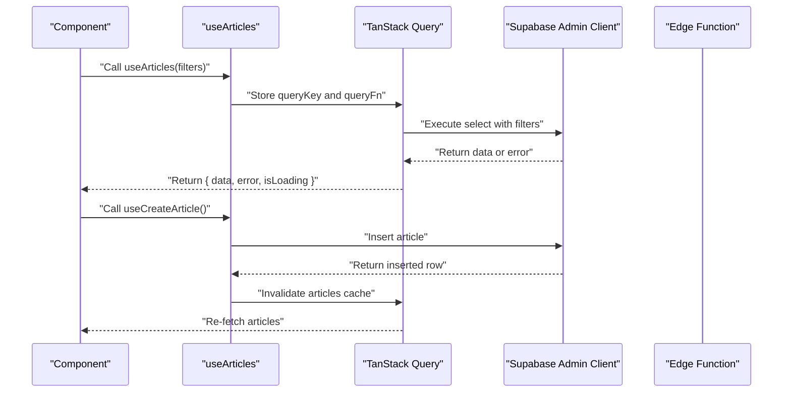

**Diagram sources**
- [useArticles.tsx](file://src/hooks/useArticles.tsx#L1-L175)
- [admin-client.ts](file://src/integrations/supabase/admin-client.ts#L1-L28)

**Section sources**
- [useArticles.tsx](file://src/hooks/useArticles.tsx#L1-L175)
- [admin-client.ts](file://src/integrations/supabase/admin-client.ts#L1-L28)

## Detailed Component Analysis

### Authentication Hook (useAuth)
- Responsibilities
  - Manage user session and role hierarchy
  - Provide sign-up, sign-in, and sign-out actions
  - Sync auth state across browser tabs
  - Fetch customer profile for customer users
- Implementation highlights
  - Auth state listener with event filtering to avoid UI flicker
  - Role resolution prioritizing higher privileges
  - Debounced role checks to reduce redundant requests
  - Cross-tab storage event handling for explicit sign-out
  - Customer profile fetch conditioned on role
- Usage patterns
  - Wrap the app with AuthProvider
  - Destructure isAdmin, isDesigner, isCustomer for conditional rendering
  - Use signUp, signIn, signOut in forms and header controls

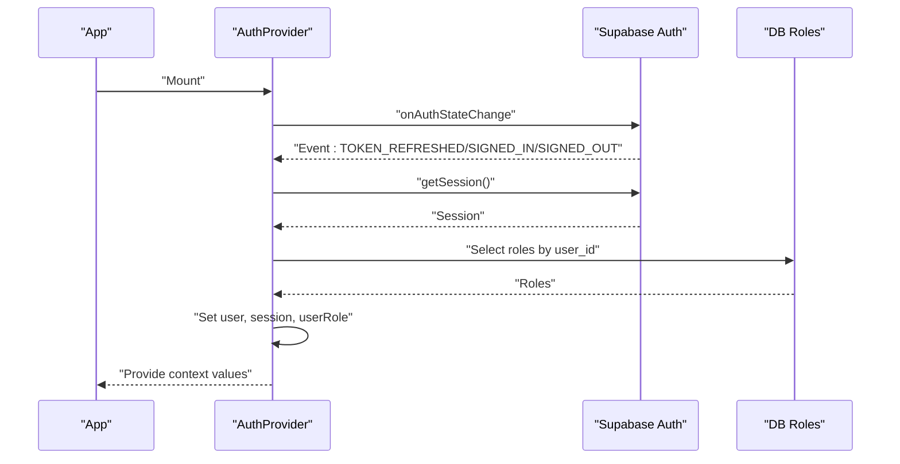

**Diagram sources**
- [useAuth.tsx](file://src/hooks/useAuth.tsx#L1-L323)
- [client.ts](file://src/integrations/supabase/client.ts#L1-L17)

**Section sources**
- [useAuth.tsx](file://src/hooks/useAuth.tsx#L1-L323)
- [client.ts](file://src/integrations/supabase/client.ts#L1-L17)

### Articles Hook Factory (useArticles)
- Responsibilities
  - Fetch paginated and filtered article lists
  - Retrieve a single article by slug
  - Provide mutations for create, update, and delete
- Implementation highlights
  - Query keys include filters for cache correctness
  - enabled flag prevents unnecessary queries when slug is missing
  - Mutations invalidate the articles query and show toast feedback
- Usage patterns
  - Pass filters to useArticles to render filtered tables
  - Use useArticle(slug) for detail pages
  - Use mutation hooks after form submissions

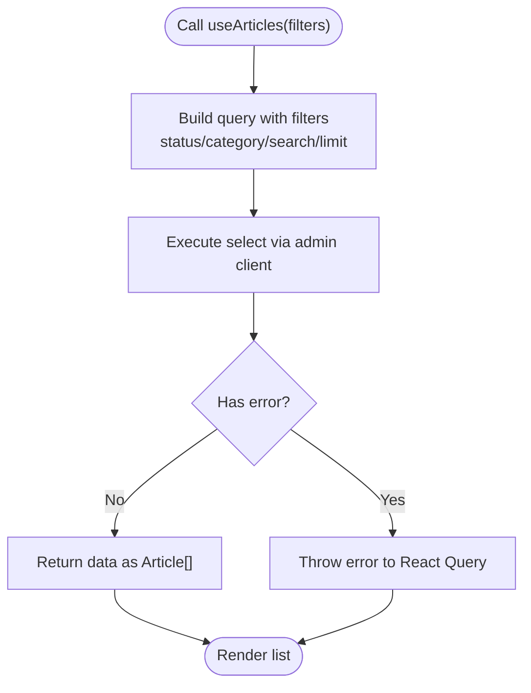

**Diagram sources**
- [useArticles.tsx](file://src/hooks/useArticles.tsx#L1-L175)

**Section sources**
- [useArticles.tsx](file://src/hooks/useArticles.tsx#L1-L175)

### Admin Real-Time Statistics (useAdminRealtimeStats)
- Responsibilities
  - Periodically fetch aggregated stats via RPC
  - Subscribe to real-time inserts/updates for signups, submissions, publications, and earnings
  - Combine initial activity with live updates and deduplicate entries
- Implementation highlights
  - refetchInterval keeps stats fresh
  - Multiple postgres_changes subscriptions per table
  - Optimistic activity updates with capped length
- Usage patterns
  - Consume stats and activity arrays
  - Trigger refetchStats after admin actions

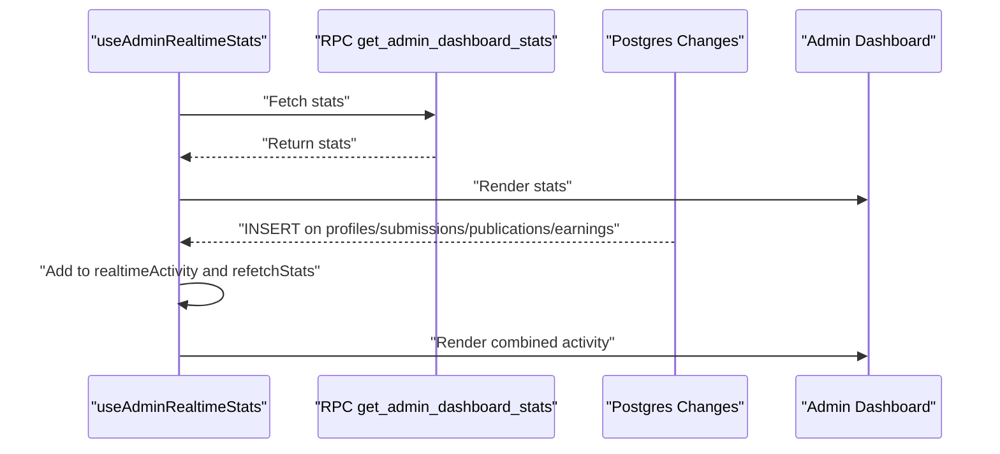

**Diagram sources**
- [useAdminRealtimeStats.tsx](file://src/hooks/useAdminRealtimeStats.tsx#L1-L209)

**Section sources**
- [useAdminRealtimeStats.tsx](file://src/hooks/useAdminRealtimeStats.tsx#L1-L209)

### Marketplace Products Hook Factory (useMarketplaceProducts)
- Responsibilities
  - List products with advanced filters and pagination
  - Fetch product details by UUID or slug
  - Retrieve categories and collections
- Implementation highlights
  - Uses Edge Functions with URL-encoded parameters
  - enabled condition for detail queries
  - UUID vs slug routing inside the hook
- Usage patterns
  - Pass filters to list products
  - Use idOrSlug to fetch details

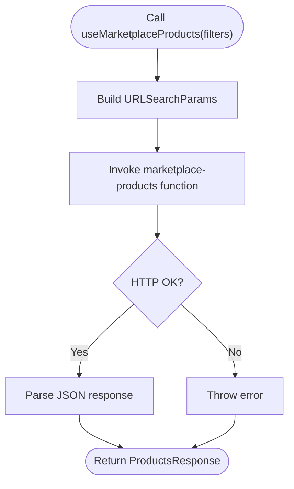

**Diagram sources**
- [useMarketplaceProducts.tsx](file://src/hooks/useMarketplaceProducts.tsx#L1-L207)

**Section sources**
- [useMarketplaceProducts.tsx](file://src/hooks/useMarketplaceProducts.tsx#L1-L207)

### Cart Provider (useCart)
- Responsibilities
  - Manage cart state for authenticated and guest users
  - Invoke Edge Functions for cart operations
  - Persist guest session ID in localStorage
- Implementation highlights
  - Session ID generation and reuse
  - Optimistic updates followed by refresh
  - Comprehensive error handling with toasts
- Usage patterns
  - Wrap app with CartProvider
  - Use addItem, updateQuantity, removeItem, clearCart

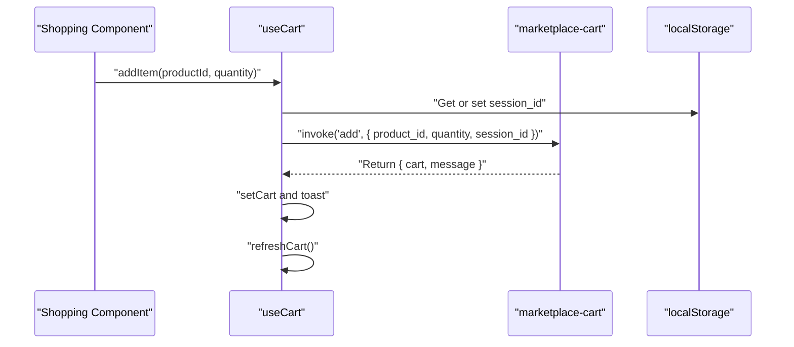

**Diagram sources**
- [useCart.tsx](file://src/hooks/useCart.tsx#L1-L214)

**Section sources**
- [useCart.tsx](file://src/hooks/useCart.tsx#L1-L214)

### Notifications Hook (useNotifications)
- Responsibilities
  - Fetch user notifications with pagination
  - Subscribe to real-time INSERT and UPDATE events
  - Provide helpers to mark as read and delete
- Implementation highlights
  - User-scoped channel with filters
  - Optimistic updates for immediate UI feedback
- Usage patterns
  - Consume notifications and unreadCount
  - Use markAsRead and markAllAsRead

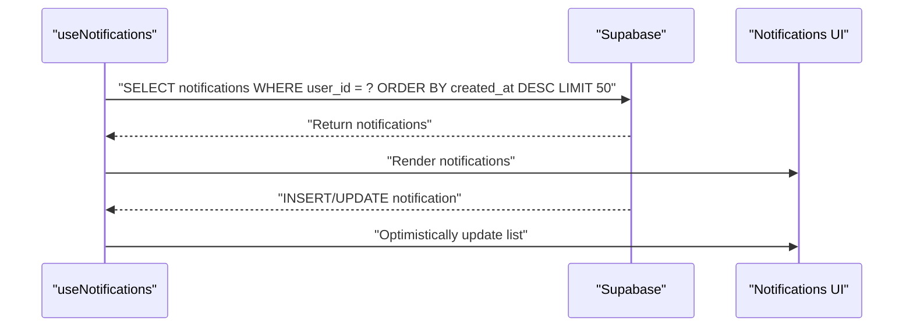

**Diagram sources**
- [useNotifications.tsx](file://src/hooks/useNotifications.tsx#L1-L158)

**Section sources**
- [useNotifications.tsx](file://src/hooks/useNotifications.tsx#L1-L158)

### Mobile Detection Hook (useIsMobile)
- Responsibilities
  - Detect mobile viewport using MediaQueryList
- Implementation highlights
  - Setup media query listener on mount
  - Cleanup listener on unmount
- Usage patterns
  - Conditionally render mobile layouts

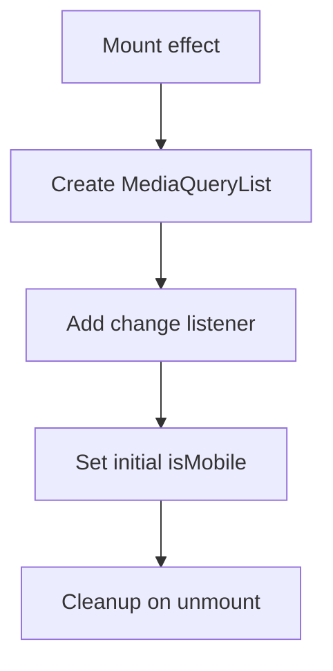

**Diagram sources**
- [use-mobile.tsx](file://src/hooks/use-mobile.tsx#L1-L21)

**Section sources**
- [use-mobile.tsx](file://src/hooks/use-mobile.tsx#L1-L21)

### Checkout Hook (useCheckout)
- Responsibilities
  - Create Stripe checkout sessions via Edge Functions
  - Confirm payments and handle errors
  - Apply/remove promo codes
- Implementation highlights
  - Function invocation with structured body
  - Error propagation and toast feedback
- Usage patterns
  - Call createCheckoutSession with cartId and shipping info
  - Call confirmPayment with orderId after redirect

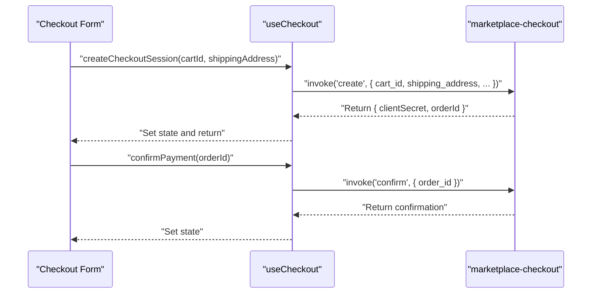

**Diagram sources**
- [useCheckout.tsx](file://src/hooks/useCheckout.tsx#L1-L188)

**Section sources**
- [useCheckout.tsx](file://src/hooks/useCheckout.tsx#L1-L188)

### Profile Hook (useProfile)
- Responsibilities
  - Fetch or create user profile on first login
  - Upsert profile with safe field filtering
  - Optionally load associated rank
- Implementation highlights
  - Conditional fetch/create based on presence
  - Safe field filtering to avoid DB errors
  - Optimistic updates after successful upsert
- Usage patterns
  - Consume profile and updateProfile
  - Use markFirstLoginComplete after onboarding

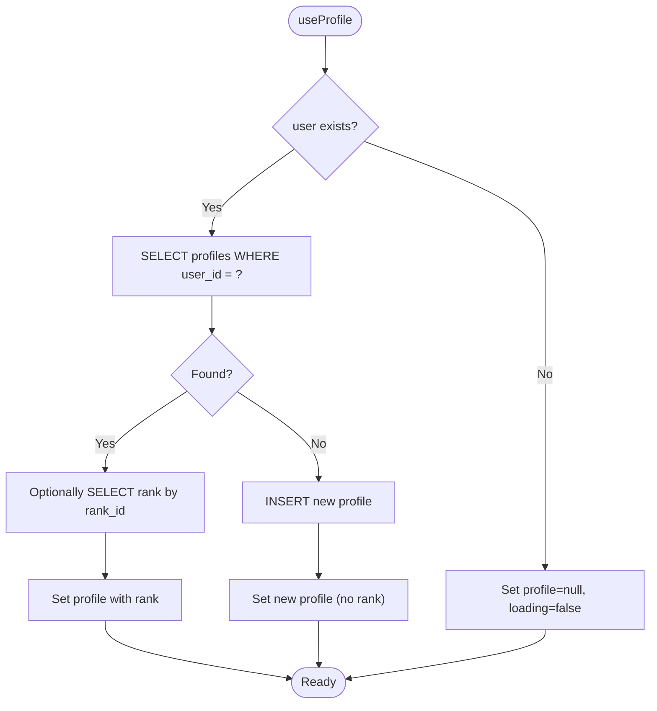

**Diagram sources**
- [useProfile.tsx](file://src/hooks/useProfile.tsx#L1-L160)

**Section sources**
- [useProfile.tsx](file://src/hooks/useProfile.tsx#L1-L160)

### Dashboard Stats Hook (useDashboardStats)
- Responsibilities
  - Aggregate designer metrics from multiple tables
  - Subscribe to portfolio_projects for real-time updates
- Implementation highlights
  - Aggregated queries for counts and sums
  - Real-time subscription to keep counts fresh
- Usage patterns
  - Consume stats and loading state in dashboard cards

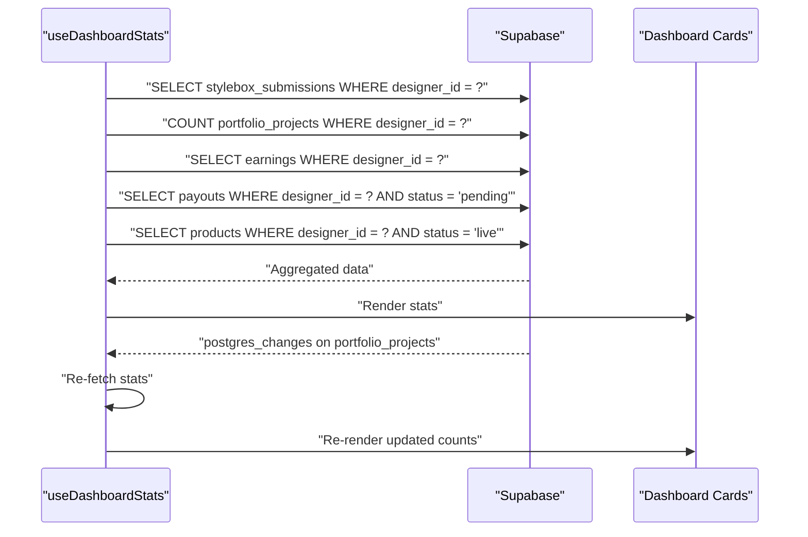

**Diagram sources**
- [useDashboardStats.tsx](file://src/hooks/useDashboardStats.tsx#L1-L147)

**Section sources**
- [useDashboardStats.tsx](file://src/hooks/useDashboardStats.tsx#L1-L147)

## Dependency Analysis
- Supabase clients
  - client.ts: Standard client with localStorage-backed auth persistence
  - admin-client.ts: Isolated client for admin app with separate storage keys
- TanStack Query
  - Used extensively for caching, invalidation, and background refetching
- Edge Functions
  - Invoked via supabase.functions.invoke for cart and checkout operations
- Toast integration
  - use-toast.ts provides centralized toast state management consumed by multiple hooks

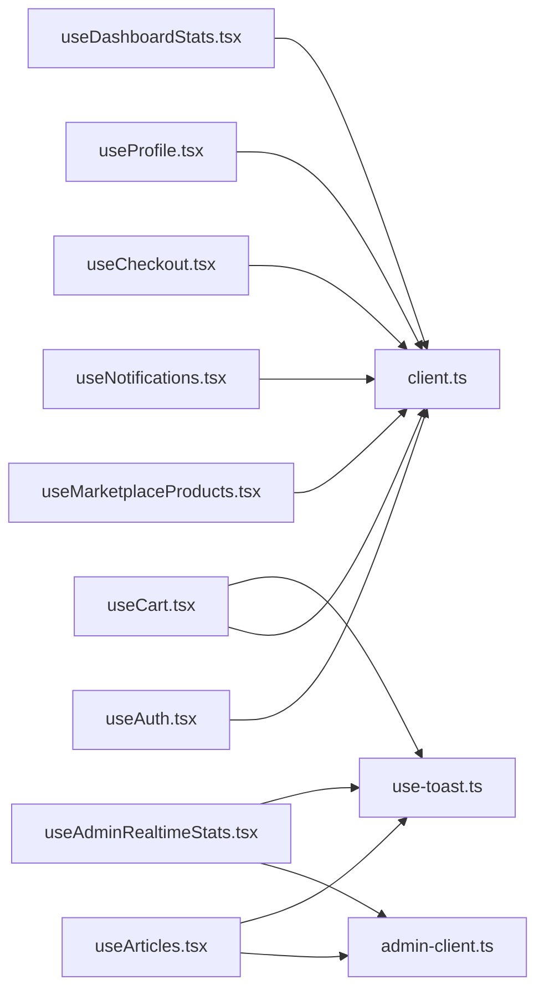

**Diagram sources**
- [useAuth.tsx](file://src/hooks/useAuth.tsx#L1-L323)
- [useArticles.tsx](file://src/hooks/useArticles.tsx#L1-L175)
- [useAdminRealtimeStats.tsx](file://src/hooks/useAdminRealtimeStats.tsx#L1-L209)
- [useMarketplaceProducts.tsx](file://src/hooks/useMarketplaceProducts.tsx#L1-L207)
- [useCart.tsx](file://src/hooks/useCart.tsx#L1-L214)
- [useNotifications.tsx](file://src/hooks/useNotifications.tsx#L1-L158)
- [useCheckout.tsx](file://src/hooks/useCheckout.tsx#L1-L188)
- [useProfile.tsx](file://src/hooks/useProfile.tsx#L1-L160)
- [useDashboardStats.tsx](file://src/hooks/useDashboardStats.tsx#L1-L147)
- [client.ts](file://src/integrations/supabase/client.ts#L1-L17)
- [admin-client.ts](file://src/integrations/supabase/admin-client.ts#L1-L28)
- [use-toast.ts](file://src/hooks/use-toast.ts#L1-L187)

**Section sources**
- [client.ts](file://src/integrations/supabase/client.ts#L1-L17)
- [admin-client.ts](file://src/integrations/supabase/admin-client.ts#L1-L28)
- [use-toast.ts](file://src/hooks/use-toast.ts#L1-L187)

## Performance Considerations
- Query keys and caching
  - Use stable query keys that reflect all inputs (filters, slug, page)
  - Invalidate targeted query keys after mutations to minimize re-fetch overhead
- Enabled conditions
  - Use enabled to defer queries until required (e.g., slug present)
- Real-time subscriptions
  - Scope channels to user IDs or specific tables to reduce payload
  - Debounce or batch updates when possible
- Memoization and refs
  - Memoize callbacks passed to providers to prevent unnecessary re-renders
  - Use refs to avoid stale closures in effects
- Toast limits
  - Limit concurrent toasts to reduce DOM churn

## Troubleshooting Guide
- Authentication issues
  - Verify auth state listener events and ignore TOKEN_REFRESHED to prevent flicker
  - Ensure cross-tab sign-out sync via storage events
- Real-time updates
  - Confirm channel names and filters match database events
  - Check subscription status and cleanup channels on unmount
- TanStack Query
  - Inspect query keys for correctness
  - Use enabled flags to avoid unnecessary requests
  - Invalidate queries after mutations
- Edge Functions
  - Validate function names and body structure
  - Handle function errors and surface user-friendly messages via toasts
- Toast feedback
  - Ensure useToast provider is mounted
  - Respect toast limits and timeouts

**Section sources**
- [useAuth.tsx](file://src/hooks/useAuth.tsx#L90-L167)
- [useNotifications.tsx](file://src/hooks/useNotifications.tsx#L45-L88)
- [useAdminRealtimeStats.tsx](file://src/hooks/useAdminRealtimeStats.tsx#L113-L184)
- [useArticles.tsx](file://src/hooks/useArticles.tsx#L103-L121)
- [useCart.tsx](file://src/hooks/useCart.tsx#L67-L85)
- [use-toast.ts](file://src/hooks/use-toast.ts#L1-L187)

## Conclusion
The custom hooks implement a robust, scalable pattern for data fetching, real-time synchronization, and state management. By leveraging Supabase clients, TanStack Query, and thoughtful composition, the application achieves responsive UIs with minimal boilerplate. Following the outlined best practices ensures maintainability, performance, and reliability across features.

## Appendices
- Best practices
  - Keep query keys deterministic and include all relevant inputs
  - Use enabled flags for conditional queries
  - Prefer optimistic updates with controlled fallbacks
  - Scope real-time subscriptions tightly to reduce noise
  - Centralize toast feedback for consistent UX
  - Wrap stateful logic in providers for predictable consumption