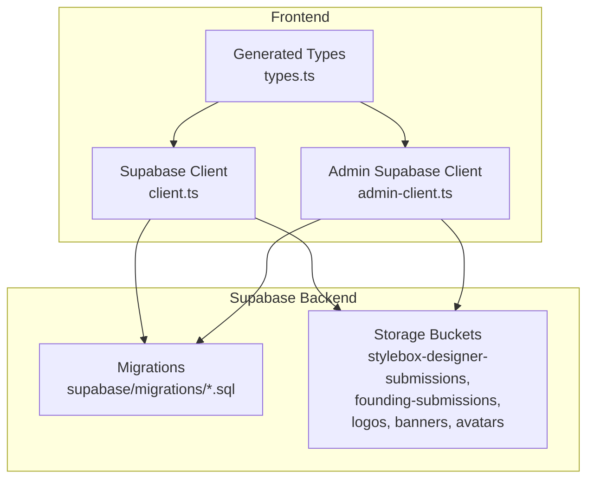
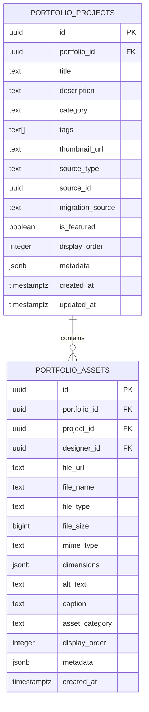
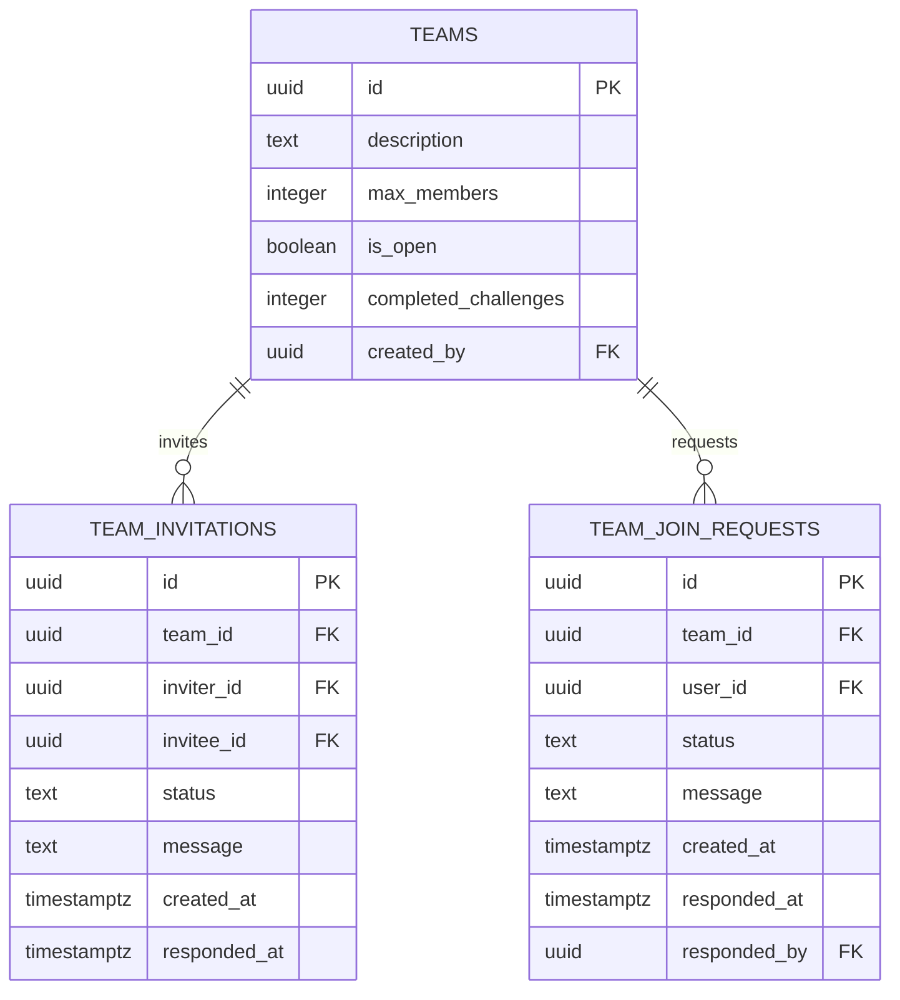
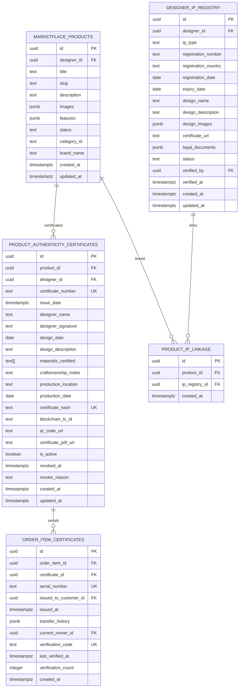
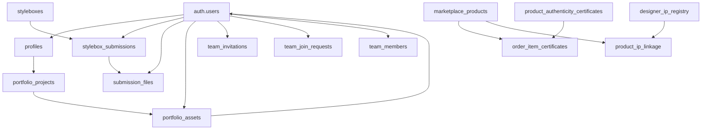

# Data Model & Database

<cite>
**Referenced Files in This Document**
- [client.ts](file://src/integrations/supabase/client.ts)
- [admin-client.ts](file://src/integrations/supabase/admin-client.ts)
- [types.ts](file://src/integrations/supabase/types.ts)
- [20260130050000_designer_stylebox_system.sql](file://supabase/migrations/20260130050000_designer_stylebox_system.sql)
- [20260130070000_complete_stylebox_schema.sql](file://supabase/migrations/20260130070000_complete_stylebox_schema.sql)
- [20260127230305_create_portfolio_tables.sql](file://supabase/migrations/20260127230305_create_portfolio_tables.sql)
- [20260127240000_product_authenticity_system.sql](file://supabase/migrations/20260127240000_product_authenticity_system.sql)
- [20260127020000_teams_full_backend.sql](file://supabase/migrations/20260127020000_teams_full_backend.sql)
- [20260108050000_enhance_designer_profiles.sql](file://supabase/migrations/20260108050000_enhance_designer_profiles.sql)
- [20260126010000_add_founding_designers_program.sql](file://supabase/migrations/20260126010000_add_founding_designers_program.sql)
- [20260126000000_add_designer_approval_and_follows.sql](file://supabase/migrations/20260126000000_add_designer_approval_and_follows.sql)
- [20260130040001_update_policies_with_lead_curator.sql](file://supabase/migrations/20260130040001_update_policies_with_lead_curator.sql)
- [20260213000000_fix_team_members_rls_recursion.sql](file://supabase/migrations/20260213000000_fix_team_members_rls_recursion.sql)
- [20260201000000_fix_portfolio_upload_rls.sql](file://supabase/migrations/20260201000000_fix_portfolio_upload_rls.sql)
- [20260201010000_fix_user_product_interactions_rls.sql](file://supabase/migrations/20260201010000_fix_user_product_interactions_rls.sql)
- [20260201020000_fix_newsletter_subscribers_rls.sql](file://supabase/migrations/20260201020000_fix_newsletter_subscribers_rls.sql)
- [20260201030000_fix_marketplace_orders_rls.sql](file://supabase/migrations/20260201030000_fix_marketplace_orders_rls.sql)
- [20260130040000_add_lead_curator_role.sql](file://supabase/migrations/20260130040000_add_lead_curator_role.sql)
- [20260129000000_fix_security_vulnerabilities.sql](file://supabase/migrations/20260129000000_fix_security_vulnerabilities.sql)
- [20260127250000_visual_similarity_engine.sql](file://supabase/migrations/20260127250000_visual_similarity_engine.sql)
- [20260127230500_enhance_portfolio_rls.sql](file://supabase/migrations/20260127230500_enhance_portfolio_rls.sql)
- [20260127010000_enhance_notifications.sql](file://supabase/migrations/20260127010000_enhance_notifications.sql)
- [20260126050000_bootstrap_superadmin.sql](file://supabase/migrations/20260126050000_bootstrap_superadmin.sql)
- [20260126060000_isolate_admin_auth.sql](file://supabase/migrations/20260126060000_isolate_admin_auth.sql)
- [20260126070000_enhance_founding_profiles.sql](file://supabase/migrations/20260126070000_enhance_founding_profiles.sql)
- [20260126080000_enhance_founding_submissions_ui.sql](file://supabase/migrations/20260126080000_enhance_founding_submissions_ui.sql)
- [20260126090000_admin_founding_workflow.sql](file://supabase/migrations/20260126090000_admin_founding_workflow.sql)
- [20260126100000_founding_final_refinements.sql](file://supabase/migrations/20260126100000_founding_final_refinements.sql)
- [20260127000000_founding_storage_admin_policy.sql](file://supabase/migrations/20260127000000_founding_storage_admin_policy.sql)
- [20260127240000_product_authenticity_system.sql](file://supabase/migrations/20260127240000_product_authenticity_system.sql)
- [20260127250000_visual_similarity_engine.sql](file://supabase/migrations/20260127250000_visual_similarity_engine.sql)
- [20260127230500_enhance_portfolio_rls.sql](file://supabase/migrations/20260127230500_enhance_portfolio_rls.sql)
- [20260127010000_enhance_notifications.sql](file://supabase/migrations/20260127010000_enhance_notifications.sql)
- [20260126050000_bootstrap_superadmin.sql](file://supabase/migrations/20260126050000_bootstrap_superadmin.sql)
- [20260126060000_isolate_admin_auth.sql](file://supabase/migrations/20260126060000_isolate_admin_auth.sql)
- [20260126070000_enhance_founding_profiles.sql](file://supabase/migrations/20260126070000_enhance_founding_profiles.sql)
- [20260126080000_enhance_founding_submissions_ui.sql](file://supabase/migrations/20260126080000_enhance_founding_submissions_ui.sql)
- [20260126090000_admin_founding_workflow.sql](file://supabase/migrations/20260126090000_admin_founding_workflow.sql)
- [20260126100000_founding_final_refinements.sql](file://supabase/migrations/20260126100000_founding_final_refinements.sql)
- [20260127000000_founding_storage_admin_policy.sql](file://supabase/migrations/20260127000000_founding_storage_admin_policy.sql)
</cite>

## Table of Contents
1. [Introduction](#introduction)
2. [Project Structure](#project-structure)
3. [Core Components](#core-components)
4. [Architecture Overview](#architecture-overview)
5. [Detailed Component Analysis](#detailed-component-analysis)
6. [Dependency Analysis](#dependency-analysis)
7. [Performance Considerations](#performance-considerations)
8. [Troubleshooting Guide](#troubleshooting-guide)
9. [Conclusion](#conclusion)
10. [Appendices](#appendices)

## Introduction
This document provides comprehensive data model documentation for the PostgreSQL database schema and Supabase integration powering the platform. It focuses on the relationships among users, designers, styleboxes, products, portfolios, and teams. It documents field definitions, data types, primary/foreign keys, indexes, constraints, Row Level Security (RLS) policies, validation rules, and business logic enforcement. It also covers TypeScript type definitions, data lifecycle management, performance considerations, and security/access control mechanisms implemented via Supabase RLS.

## Project Structure
The data model is primarily defined in Supabase migrations under the supabase/migrations directory. The frontend integrates with Supabase through generated TypeScript types and clients located under src/integrations/supabase.



**Diagram sources**
- [client.ts](file://src/integrations/supabase/client.ts#L1-L17)
- [admin-client.ts](file://src/integrations/supabase/admin-client.ts#L1-L28)
- [types.ts](file://src/integrations/supabase/types.ts#L1-L800)

**Section sources**
- [client.ts](file://src/integrations/supabase/client.ts#L1-L17)
- [admin-client.ts](file://src/integrations/supabase/admin-client.ts#L1-L28)
- [types.ts](file://src/integrations/supabase/types.ts#L1-L800)

## Core Components
This section outlines the principal entities and their roles in the data model.

- Users: Authenticated identities managed by Supabase Auth; referenced across multiple tables (e.g., designers, admins, customers).
- Profiles: Extended user profiles with branding, social links, and searchable fields.
- Styleboxes: Curated creative briefs with structured JSON quadrants (archetype, mutation, restrictions, manifestation), deliverables, and metadata.
- Stylebox Submissions: Designer submissions against styleboxes, with versioning, progress tracking, and file attachments.
- Portfolios: Designer portfolio projects and assets with categorization, ordering, and metadata.
- Teams: Collaborative groups with invitations, join requests, and membership roles.
- Marketplace: Products, collections, orders, and customer entities for e-commerce.
- Authenticity System: Certificates, serial numbers, and IP linkage for product authenticity.
- Founding Designers Program: Submission workflow and storage for curated designer onboarding.

**Section sources**
- [20260130050000_designer_stylebox_system.sql](file://supabase/migrations/20260130050000_designer_stylebox_system.sql#L52-L189)
- [20260130070000_complete_stylebox_schema.sql](file://supabase/migrations/20260130070000_complete_stylebox_schema.sql#L4-L51)
- [20260127230305_create_portfolio_tables.sql](file://supabase/migrations/20260127230305_create_portfolio_tables.sql#L6-L86)
- [20260127020000_teams_full_backend.sql](file://supabase/migrations/20260127020000_teams_full_backend.sql#L5-L22)
- [20260108050000_enhance_designer_profiles.sql](file://supabase/migrations/20260108050000_enhance_designer_profiles.sql#L4-L28)
- [20260126010000_add_founding_designers_program.sql](file://supabase/migrations/20260126010000_add_founding_designers_program.sql#L2-L33)
- [20260127240000_product_authenticity_system.sql](file://supabase/migrations/20260127240000_product_authenticity_system.sql#L4-L96)

## Architecture Overview
The backend architecture centers on Supabase-managed PostgreSQL with RLS-enabled tables and storage buckets. Frontend clients use generated TypeScript types to interact with PostgREST and Realtime. Administrators use a separate client instance with isolated storage to prevent session conflicts.

```mermaid
graph TB
subgraph "Frontend Clients"
C1["Studio Client<br/>client.ts"]
C2["Admin Client<br/>admin-client.ts"]
end
subgraph "Supabase"
subgraph "PostgreSQL"
T1["profiles"]
T2["styleboxes"]
T3["stylebox_submissions"]
T4["submission_files"]
T5["portfolio_projects"]
T6["portfolio_assets"]
T7["teams"]
T8["team_invitations"]
T9["team_join_requests"]
T10["marketplace_products"]
T11["marketplace_orders"]
T12["product_authenticity_certificates"]
T13["order_item_certificates"]
T14["designer_ip_registry"]
T15["founders_designers_submissions"]
end
subgraph "Storage"
S1["stylebox-designer-submissions"]
S2["founding-submissions"]
S3["logos"]
S4["banners"]
S5["avatars"]
end
end
C1 --> T1
C1 --> T2
C1 --> T3
C1 --> T4
C1 --> T5
C1 --> T6
C1 --> T7
C1 --> T8
C1 --> T9
C1 --> T10
C1 --> T11
C1 --> T12
C1 --> T13
C1 --> T14
C1 --> T15
C2 --> T1
C2 --> T2
C2 --> T3
C2 --> T4
C2 --> T5
C2 --> T6
C2 --> T7
C2 --> T8
C2 --> T9
C2 --> T10
C2 --> T11
C2 --> T12
C2 --> T13
C2 --> T14
C2 --> T15
C1 --> S1
C1 --> S2
C1 --> S3
C1 --> S4
C1 --> S5
C2 --> S1
C2 --> S2
C2 --> S3
C2 --> S4
C2 --> S5
```



**Diagram sources**
- [client.ts](file://src/integrations/supabase/client.ts#L1-L17)
- [admin-client.ts](file://src/integrations/supabase/admin-client.ts#L1-L28)
- [20260130050000_designer_stylebox_system.sql](file://supabase/migrations/20260130050000_designer_stylebox_system.sql#L52-L189)
- [20260127230305_create_portfolio_tables.sql](file://supabase/migrations/20260127230305_create_portfolio_tables.sql#L6-L86)
- [20260127020000_teams_full_backend.sql](file://supabase/migrations/20260127020000_teams_full_backend.sql#L5-L37)
- [20260108050000_enhance_designer_profiles.sql](file://supabase/migrations/20260108050000_enhance_designer_profiles.sql#L4-L28)
- [20260126010000_add_founding_designers_program.sql](file://supabase/migrations/20260126010000_add_founding_designers_program.sql#L2-L33)
- [20260127240000_product_authenticity_system.sql](file://supabase/migrations/20260127240000_product_authenticity_system.sql#L4-L96)

## Detailed Component Analysis

### Users and Profiles
- Profiles extend authenticated users with branding, location, and social handles. RLS allows public selection while restricting updates to the profile owner.
- Indexes support full-text search and composite filtering for designers and products.

Key fields and constraints:
- Primary key: user_id (via auth.users relationship)
- Fields include brand_name, logo_url, banner_image, location, education[], awards[], and social URLs
- RLS policy: authenticated users can view all profiles; only the owner can update or insert

**Section sources**
- [20260108050000_enhance_designer_profiles.sql](file://supabase/migrations/20260108050000_enhance_designer_profiles.sql#L4-L48)
- [20260126000000_add_designer_approval_and_follows.sql](file://supabase/migrations/20260126000000_add_designer_approval_and_follows.sql#L28-L52)

### Styleboxes and Designer Submissions
- Styleboxes define structured creative briefs with JSON quadrants (archetype, mutation, restrictions, manifestation), deliverables, and metadata.
- Stylebox Submissions capture designer entries per stylebox, with versioning, progress tracking, and file attachments.
- Submission Files link uploaded assets to deliverables with status tracking and watermarking metadata.
- Designer Drafts store auto-save state for ongoing work.
- Share Links enable controlled sharing with optional comments and access limits.

```mermaid
erDiagram
STYLEBOXES {
uuid id PK
text season
text collection_size
text collection_line
text market_context
jsonb visibility_tags
text display_id UK
integer version
jsonb archetype
jsonb mutation
jsonb restrictions
jsonb manifestation
jsonb adorizia_deliverables
text trend_narrative
text global_drivers
text local_relevance
jsonb visual_keywords
jsonb moodboard_images
jsonb color_system
jsonb material_direction
jsonb technical_requirements
jsonb design_guidelines
jsonb evaluation_criteria
text thumbnail_url
text pdf_url
}
STYLEBOX_SUBMISSIONS {
uuid id PK
uuid stylebox_id FK
uuid designer_id FK
integer version_number
boolean is_final
text manifestation_rationale
enum submission_status status
timestamptz submission_date
timestamptz review_date
integer total_deliverables
integer completed_deliverables
decimal progress_percentage
timestamptz created_at
timestamptz updated_at
}
SUBMISSION_FILES {
uuid id PK
uuid submission_id FK
text deliverable_id
text file_name
text file_path
bigint file_size
enum designer_file_type file_type
text mime_type
enum deliverable_status status
text thumbnail_url
text preview_url
boolean is_watermarked
text watermark_text
jsonb upload_metadata
timestamptz created_at
timestamptz updated_at
}
DESIGNER_DRAFTS {
uuid id PK
uuid submission_id FK
uuid designer_id FK
jsonb draft_data
boolean is_auto_saved
timestamptz last_saved_at
timestamptz created_at
timestamptz updated_at
}
STYLEBOX_SHARE_LINKS {
uuid id PK
uuid submission_id FK
uuid designer_id FK
text share_token UK
text share_url
timestamptz expires_at
boolean is_active
integer view_count
integer max_views
boolean allow_comments
boolean allow_download
timestamptz created_at
timestamptz last_accessed_at
}
STYLEBOXES ||--o{ STYLEBOX_SUBMISSIONS : "contains"
STYLEBOX_SUBMISSIONS ||--o{ SUBMISSION_FILES : "uploads"
STYLEBOX_SUBMISSIONS ||--o{ DESIGNER_DRAFTS : "drafts"
STYLEBOX_SUBMISSIONS ||--o{ STYLEBOX_SHARE_LINKS : "shared"
```

**Diagram sources**
- [20260130070000_complete_stylebox_schema.sql](file://supabase/migrations/20260130070000_complete_stylebox_schema.sql#L4-L51)
- [20260130050000_designer_stylebox_system.sql](file://supabase/migrations/20260130050000_designer_stylebox_system.sql#L52-L189)

**Section sources**
- [20260130070000_complete_stylebox_schema.sql](file://supabase/migrations/20260130070000_complete_stylebox_schema.sql#L4-L51)
- [20260130050000_designer_stylebox_system.sql](file://supabase/migrations/20260130050000_designer_stylebox_system.sql#L52-L189)

### Portfolios
- Portfolio Projects represent individual designer projects with categorization, tags, thumbnails, and metadata.
- Portfolio Assets link files (images, videos, documents) to projects and designers, with dimensions, alt/captions, and ordering.
- RLS enables authenticated users to manage their own projects/assets; anonymous users can select public data.



**Diagram sources**
- [20260127230305_create_portfolio_tables.sql](file://supabase/migrations/20260127230305_create_portfolio_tables.sql#L6-L86)

**Section sources**
- [20260127230305_create_portfolio_tables.sql](file://supabase/migrations/20260127230305_create_portfolio_tables.sql#L6-L86)

### Teams
- Teams support open or closed memberships with max_members, is_open, and challenge counters.
- Team Invitations and Join Requests handle onboarding with status tracking and timestamps.
- RLS policies grant access to team members, leads, and administrators; public selection for open teams.



**Diagram sources**
- [20260127020000_teams_full_backend.sql](file://supabase/migrations/20260127020000_teams_full_backend.sql#L5-L37)

**Section sources**
- [20260127020000_teams_full_backend.sql](file://supabase/migrations/20260127020000_teams_full_backend.sql#L5-L37)

### Marketplace and Authenticity System
- Marketplace Products and Orders connect designers, customers, and inventory.
- Authenticity System tracks certificates, serial numbers, and IP registry linkage for luxury product verification.
- Visual Similarity Engine supports product similarity checks; notifications support communication.



**Diagram sources**
- [20260127240000_product_authenticity_system.sql](file://supabase/migrations/20260127240000_product_authenticity_system.sql#L4-L96)

**Section sources**
- [20260127240000_product_authenticity_system.sql](file://supabase/migrations/20260127240000_product_authenticity_system.sql#L4-L96)

### Founding Designers Program
- Founding Designers Submissions capture collection identity, technical assets, production strategy, and declarations.
- Storage bucket for submission files with RLS policies ensuring designer-only access except for admin visibility.

**Section sources**
- [20260126010000_add_founding_designers_program.sql](file://supabase/migrations/20260126010000_add_founding_designers_program.sql#L2-L33)
- [20260126010000_add_founding_designers_program.sql](file://supabase/migrations/20260126010000_add_founding_designers_program.sql#L89-L164)

## Dependency Analysis
The following diagram highlights key foreign key dependencies across entities.



**Diagram sources**
- [20260130050000_designer_stylebox_system.sql](file://supabase/migrations/20260130050000_designer_stylebox_system.sql#L52-L189)
- [20260127230305_create_portfolio_tables.sql](file://supabase/migrations/20260127230305_create_portfolio_tables.sql#L6-L86)
- [20260127020000_teams_full_backend.sql](file://supabase/migrations/20260127020000_teams_full_backend.sql#L5-L37)
- [20260127240000_product_authenticity_system.sql](file://supabase/migrations/20260127240000_product_authenticity_system.sql#L4-L96)

**Section sources**
- [20260130050000_designer_stylebox_system.sql](file://supabase/migrations/20260130050000_designer_stylebox_system.sql#L52-L189)
- [20260127230305_create_portfolio_tables.sql](file://supabase/migrations/20260127230305_create_portfolio_tables.sql#L6-L86)
- [20260127020000_teams_full_backend.sql](file://supabase/migrations/20260127020000_teams_full_backend.sql#L5-L37)
- [20260127240000_product_authenticity_system.sql](file://supabase/migrations/20260127240000_product_authenticity_system.sql#L4-L96)

## Performance Considerations
- Indexes: Strategic indexes exist for frequent filters and joins (e.g., portfolio_projects portfolio_id, submission_files submission_id, team invitation/team status).
- Full-text search: GIN indexes on profiles, products, and collections improve global search performance.
- Triggers: Automatic updated_at triggers and progress recalculations keep data consistent.
- Storage limits: Designer submission bucket enforces 500 MB file size limits and allowed MIME types.

Recommendations:
- Monitor slow queries and add targeted indexes for new filters.
- Consider materialized views for frequently accessed aggregates (e.g., follower counts).
- Optimize JSONB queries with appropriate GIN or GiST indexes where needed.

**Section sources**
- [20260126000000_add_designer_approval_and_follows.sql](file://supabase/migrations/20260126000000_add_designer_approval_and_follows.sql#L41-L52)
- [20260130050000_designer_stylebox_system.sql](file://supabase/migrations/20260130050000_designer_stylebox_system.sql#L208-L230)
- [20260127020000_teams_full_backend.sql](file://supabase/migrations/20260127020000_teams_full_backend.sql#L187-L198)

## Troubleshooting Guide
Common issues and resolutions:
- RLS Denials: Ensure auth.uid() matches the row owner for tables with owner-specific policies (e.g., stylebox_submissions, portfolio_projects/assets).
- Storage Access: Verify bucket policies allow authenticated users to access their folders; confirm foldername(name) resolves to auth.uid().
- Recursion in Team Members RLS: Apply fixes to prevent recursive policy evaluation loops.
- Portfolio Upload RLS: Confirm updated policies allow authenticated users to manage their own portfolio assets.
- Marketplace Orders RLS: Validate order-related policies for customer and admin access.

**Section sources**
- [20260213000000_fix_team_members_rls_recursion.sql](file://supabase/migrations/20260213000000_fix_team_members_rls_recursion.sql)
- [20260201000000_fix_portfolio_upload_rls.sql](file://supabase/migrations/20260201000000_fix_portfolio_upload_rls.sql)
- [20260201010000_fix_user_product_interactions_rls.sql](file://supabase/migrations/20260201010000_fix_user_product_interactions_rls.sql)
- [20260201020000_fix_newsletter_subscribers_rls.sql](file://supabase/migrations/20260201020000_fix_newsletter_subscribers_rls.sql)
- [20260201030000_fix_marketplace_orders_rls.sql](file://supabase/migrations/20260201030000_fix_marketplace_orders_rls.sql)

## Conclusion
The data model integrates robust RLS policies, storage buckets, and specialized schemas for stylebox submissions, portfolios, teams, marketplace, and authenticity. Generated TypeScript types and dual clients (studio and admin) ensure secure, type-safe access. Performance is supported by strategic indexes and triggers, while security is enforced through granular policies and role-based access controls.

## Appendices

### Supabase Client Configuration
- Studio client: Uses VITE_SUPABASE_URL and VITE_SUPABASE_PUBLISHABLE_KEY with localStorage persistence.
- Admin client: Isolated storage with admin-specific prefix to prevent session conflicts.

**Section sources**
- [client.ts](file://src/integrations/supabase/client.ts#L1-L17)
- [admin-client.ts](file://src/integrations/supabase/admin-client.ts#L1-L28)

### TypeScript Type Definitions
- The generated types file defines tables, enums, inserts, updates, and relationships for all core entities.
- Use these types to strongly type queries and mutations in the frontend.

**Section sources**
- [types.ts](file://src/integrations/supabase/types.ts#L1-L800)