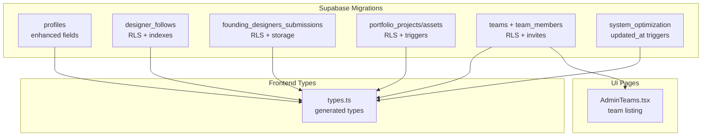
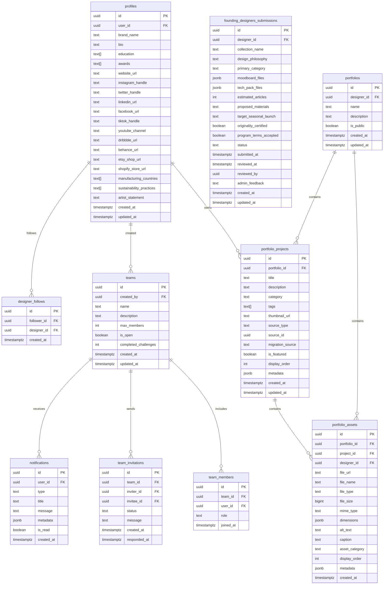
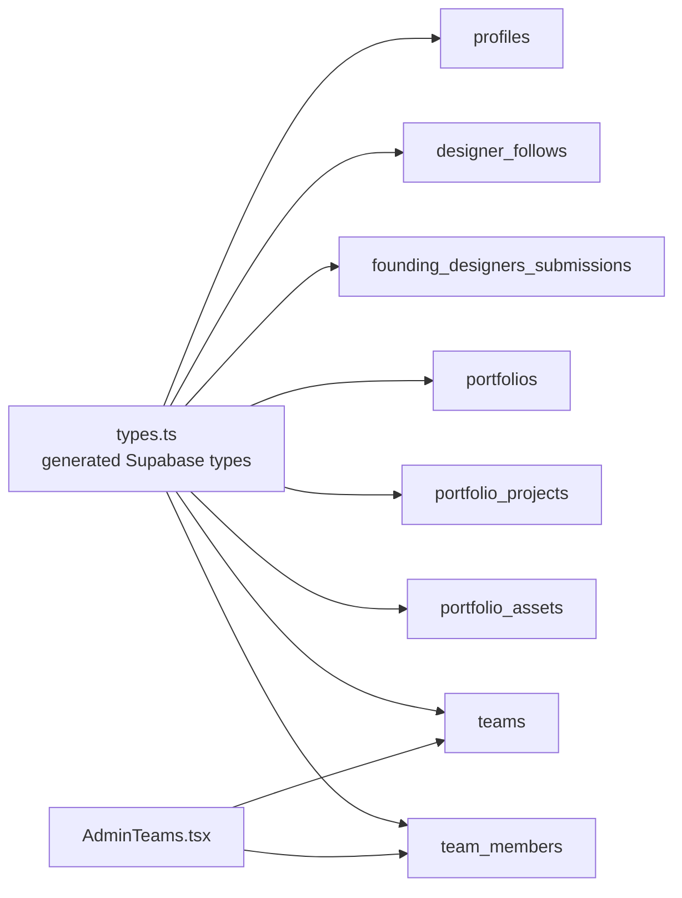

# Core Entity Tables

<cite>
**Referenced Files in This Document**
- [20260108050000_enhance_designer_profiles.sql](file://supabase/migrations/20260108050000_enhance_designer_profiles.sql)
- [20260126000000_add_designer_approval_and_follows.sql](file://supabase/migrations/20260126000000_add_designer_approval_and_follows.sql)
- [20260126010000_add_founding_designers_program.sql](file://supabase/migrations/20260126010000_add_founding_designers_program.sql)
- [20260127230305_create_portfolio_tables.sql](file://supabase/migrations/20260127230305_create_portfolio_tables.sql)
- [20260127020000_teams_full_backend.sql](file://supabase/migrations/20260127020000_teams_full_backend.sql)
- [20260127040000_fix_teams_rls_for_preview.sql](file://supabase/migrations/20260127040000_fix_teams_rls_for_preview.sql)
- [20260126030000_system_optimization.sql](file://supabase/migrations/20260126030000_system_optimization.sql)
- [20260201000001_update_profile_approval_rls.sql](file://supabase/migrations/20260201000001_update_profile_approval_rls.sql)
- [types.ts](file://src/integrations/supabase/types.ts)
- [AdminTeams.tsx](file://src/pages/admin/AdminTeams.tsx)
</cite>

## Table of Contents
1. [Introduction](#introduction)
2. [Project Structure](#project-structure)
3. [Core Components](#core-components)
4. [Architecture Overview](#architecture-overview)
5. [Detailed Component Analysis](#detailed-component-analysis)
6. [Dependency Analysis](#dependency-analysis)
7. [Performance Considerations](#performance-considerations)
8. [Troubleshooting Guide](#troubleshooting-guide)
9. [Conclusion](#conclusion)

## Introduction
This document describes the core entity tables that power the platform’s designer ecosystem: profiles, designers, styleboxes, portfolios, teams, and founding designers. It covers table schemas, primary and foreign keys, indexes, constraints, field definitions, validation rules, relationships, access control via Row Level Security (RLS), and performance considerations. Typical data structures and common query patterns are also included to help developers and administrators work effectively with these tables.

## Project Structure
The core schema is defined in Supabase migrations under the supabase/migrations directory. The frontend types and UI components that interact with these tables live in src/integrations/supabase/types.ts and various page components.

**Diagram sources**
- [20260108050000_enhance_designer_profiles.sql](file://supabase/migrations/20260108050000_enhance_designer_profiles.sql#L1-L34)
- [20260126000000_add_designer_approval_and_follows.sql](file://supabase/migrations/20260126000000_add_designer_approval_and_follows.sql#L1-L136)
- [20260126010000_add_founding_designers_program.sql](file://supabase/migrations/20260126010000_add_founding_designers_program.sql#L1-L164)
- [20260127230305_create_portfolio_tables.sql](file://supabase/migrations/20260127230305_create_portfolio_tables.sql#L1-L86)
- [20260127020000_teams_full_backend.sql](file://supabase/migrations/20260127020000_teams_full_backend.sql#L1-L212)
- [20260126030000_system_optimization.sql](file://supabase/migrations/20260126030000_system_optimization.sql#L1-L33)
- [types.ts](file://src/integrations/supabase/types.ts#L2578-L2623)
- [AdminTeams.tsx](file://src/pages/admin/AdminTeams.tsx#L175-L225)

**Section sources**
- [20260108050000_enhance_designer_profiles.sql](file://supabase/migrations/20260108050000_enhance_designer_profiles.sql#L1-L34)
- [20260126000000_add_designer_approval_and_follows.sql](file://supabase/migrations/20260126000000_add_designer_approval_and_follows.sql#L1-L136)
- [20260126010000_add_founding_designers_program.sql](file://supabase/migrations/20260126010000_add_founding_designers_program.sql#L1-L164)
- [20260127230305_create_portfolio_tables.sql](file://supabase/migrations/20260127230305_create_portfolio_tables.sql#L1-L86)
- [20260127020000_teams_full_backend.sql](file://supabase/migrations/20260127020000_teams_full_backend.sql#L1-L212)
- [20260126030000_system_optimization.sql](file://supabase/migrations/20260126030000_system_optimization.sql#L1-L33)
- [types.ts](file://src/integrations/supabase/types.ts#L2578-L2623)
- [AdminTeams.tsx](file://src/pages/admin/AdminTeams.tsx#L175-L225)

## Core Components
This section outlines the six core entity tables and their roles in the system.

- Profiles: Central designer identity and branding information, with searchability and RLS.
- Designer_follows: Relationship table for designer followers.
- Founding_designers_submissions: Application and lifecycle of founding designer programs.
- Portfolio_projects and Portfolio_assets: Projects and assets within a designer’s portfolio.
- Teams and team_members: Collaborative groups with invitations and membership.
- Additional shared utilities: Global search, follower count function, and generic updated_at triggers.

**Section sources**
- [20260108050000_enhance_designer_profiles.sql](file://supabase/migrations/20260108050000_enhance_designer_profiles.sql#L1-L34)
- [20260126000000_add_designer_approval_and_follows.sql](file://supabase/migrations/20260126000000_add_designer_approval_and_follows.sql#L1-L136)
- [20260126010000_add_founding_designers_program.sql](file://supabase/migrations/20260126010000_add_founding_designers_program.sql#L1-L164)
- [20260127230305_create_portfolio_tables.sql](file://supabase/migrations/20260127230305_create_portfolio_tables.sql#L1-L86)
- [20260127020000_teams_full_backend.sql](file://supabase/migrations/20260127020000_teams_full_backend.sql#L1-L212)
- [20260126030000_system_optimization.sql](file://supabase/migrations/20260126030000_system_optimization.sql#L1-L33)

## Architecture Overview
The following diagram maps the core tables and their relationships, highlighting primary keys, foreign keys, and key indexes.

**Diagram sources**
- [20260108050000_enhance_designer_profiles.sql](file://supabase/migrations/20260108050000_enhance_designer_profiles.sql#L1-L34)
- [20260126000000_add_designer_approval_and_follows.sql](file://supabase/migrations/20260126000000_add_designer_approval_and_follows.sql#L1-L136)
- [20260126010000_add_founding_designers_program.sql](file://supabase/migrations/20260126010000_add_founding_designers_program.sql#L1-L164)
- [20260127230305_create_portfolio_tables.sql](file://supabase/migrations/20260127230305_create_portfolio_tables.sql#L1-L86)
- [20260127020000_teams_full_backend.sql](file://supabase/migrations/20260127020000_teams_full_backend.sql#L1-L212)

## Detailed Component Analysis

### Profiles
- Purpose: Stores designer identity, branding, and social presence.
- Primary key: id (UUID).
- Foreign keys: user_id references auth.users(id).
- Notable fields:
  - Branding: brand_name, logo_url, banner_image.
  - Bio and credentials: bio, education (array), awards (array), artist_statement.
  - Social links: website_url, instagram_handle, twitter_handle, linkedin_url, facebook_url, tiktok_handle, youtube_channel, dribbble_url, behance_url, etsy_shop_url, shopify_store_url.
  - Manufacturing and sustainability: manufacturing_countries (array), sustainability_practices (array).
  - Timestamps: created_at, updated_at.
- Validation rules:
  - RLS enabled; select policy allows viewing all profiles.
  - Indexes: gin on name/bio for search; additional indexes on brand_name and location.
- Access control:
  - Select: authenticated users can view all profiles.
  - Updates: governed by application-level logic and profile approval RLS.
- Typical queries:
  - Search profiles by name or brand_name.
  - Fetch profile by user_id for dashboard/profile pages.
  - List profiles with filters (category/status) via composite indexes.

**Section sources**
- [20260108050000_enhance_designer_profiles.sql](file://supabase/migrations/20260108050000_enhance_designer_profiles.sql#L1-L34)
- [20260126000000_add_designer_approval_and_follows.sql](file://supabase/migrations/20260126000000_add_designer_approval_and_follows.sql#L31-L34)
- [20260201000001_update_profile_approval_rls.sql](file://supabase/migrations/20260201000001_update_profile_approval_rls.sql#L80-L89)

### Designer_follows
- Purpose: Tracks who follows which designer.
- Primary key: id (UUID).
- Foreign keys: follower_id and designer_id both reference auth.users(id).
- Fields: created_at timestamp.
- Constraints: unique constraint on (follower_id, designer_id).
- Indexes: designer_id, follower_id.
- RLS policies:
  - Select: anyone can view follows.
  - Insert: with check ensures follower_id equals current authenticated user.
  - Delete: only the follower can remove follow.
- Typical queries:
  - Count followers per designer via a function.
  - Check if a user follows a given designer.
  - List a user’s followed designers.

**Section sources**
- [20260126000000_add_designer_approval_and_follows.sql](file://supabase/migrations/20260126000000_add_designer_approval_and_follows.sql#L4-L26)
- [20260126000000_add_designer_approval_and_follows.sql](file://supabase/migrations/20260126000000_add_designer_approval_and_follows.sql#L28-L39)
- [20260126000000_add_designer_approval_and_follows.sql](file://supabase/migrations/20260126000000_add_designer_approval_and_follows.sql#L41-L52)

### Founding_designers_submissions
- Purpose: Manages applications for the Founding Designers Program.
- Primary key: id (UUID).
- Foreign keys: designer_id references auth.users(id); reviewed_by references auth.users(id).
- Fields:
  - Collection identity: collection_name, design_philosophy, primary_category (enum).
  - Technical assets: moodboard_files, tech_pack_files (JSONB), estimated_articles (integer range).
  - Production strategy: proposed_materials, target_seasonal_launch (enum).
  - Declarations: originality_certified, program_terms_accepted.
  - Lifecycle: status (enum), submitted_at, reviewed_at, reviewed_by, admin_feedback.
  - Metadata: created_at, updated_at.
- Constraints:
  - primary_category restricted to a predefined set.
  - estimated_articles constrained to a range.
  - status constrained to a predefined set.
  - target_seasonal_launch restricted to a predefined set.
- Indexes: designer_id, status, submitted_at (descending).
- RLS policies:
  - Designers can view/update only their pending submissions.
  - Designers can insert submissions.
  - Admins can view and update all submissions.
- Storage:
  - Private bucket “founding-submissions” with policies allowing uploads/views/deletes per user and admin visibility.
- Triggers and functions:
  - Automatic updated_at updates on row changes.
  - Notification insertion when status changes.

**Section sources**
- [20260126010000_add_founding_designers_program.sql](file://supabase/migrations/20260126010000_add_founding_designers_program.sql#L1-L164)

### Portfolios, Portfolio_projects, Portfolio_assets
- Purpose: Organize designer works into portfolios with projects and assets.
- Primary keys: id (UUID) for each table.
- Foreign keys:
  - portfolio_projects.portfolio_id -> portfolios(id) (cascade delete).
  - portfolio_assets.portfolio_id -> portfolios(id) (cascade delete).
  - portfolio_assets.project_id -> portfolio_projects(id) (cascade delete).
  - portfolio_assets.designer_id -> auth.users(id) (cascade delete).
- Notable fields:
  - Portfolio: name, description, is_public.
  - Portfolio_projects: title, description, category, tags (array), thumbnail_url, source_type, source_id, migration_source, is_featured, display_order, metadata, timestamps.
  - Portfolio_assets: file_url, file_name, file_type, file_size, mime_type, dimensions (JSONB), alt_text, caption, asset_category, display_order, metadata, timestamps.
- Indexes:
  - portfolio_projects: portfolio_id, created_at (descending).
  - portfolio_assets: project_id, portfolio_id, designer_id.
- Triggers:
  - Automatic updated_at updates for portfolio_projects.
- RLS:
  - Both tables enable RLS; authenticated users have full access; anonymous users have select-only access.
- Typical queries:
  - List a designer’s portfolios and projects.
  - Retrieve assets for a specific project.
  - Paginate and sort by created_at or display_order.

**Section sources**
- [20260127230305_create_portfolio_tables.sql](file://supabase/migrations/20260127230305_create_portfolio_tables.sql#L1-L86)

### Teams and Team Members
- Purpose: Enables collaborative groups with open or closed memberships.
- Primary key: id (UUID).
- Foreign keys:
  - teams.created_by -> auth.users(id).
  - team_members.team_id -> teams(id) (cascade delete).
  - team_members.user_id -> auth.users(id) (cascade delete).
- Fields:
  - Teams: name, description, max_members, is_open, completed_challenges, timestamps.
  - Team members: role, joined_at.
- Indexes:
  - team_invitations: invitee_id and team_id (pending status).
  - team_join_requests: team_id (pending), user_id.
  - teams: is_open (open teams only).
  - team_members: team_id, user_id.
- RLS policies:
  - Select: open teams or users’ own teams; preview teams allowed via UUID prefix rule.
  - Admins can view/manage invitations and join requests.
- Additional tables:
  - team_invitations: stores invitations with status and messages.
  - team_join_requests: tracks join requests for open teams.
- Typical queries:
  - List open teams.
  - Check membership or invitation status.
  - Manage join requests and invitations.

**Section sources**
- [20260127020000_teams_full_backend.sql](file://supabase/migrations/20260127020000_teams_full_backend.sql#L1-L212)
- [20260127040000_fix_teams_rls_for_preview.sql](file://supabase/migrations/20260127040000_fix_teams_rls_for_preview.sql#L1-L18)
- [AdminTeams.tsx](file://src/pages/admin/AdminTeams.tsx#L175-L225)

### Shared Utilities
- Global search function: Supports unified search across profiles, products, and collections with ranking and relevance.
- Follower count function: Returns follower counts for a given designer.
- Generic updated_at trigger: Applies updated_at updates across tables that support it.

**Section sources**
- [20260126000000_add_designer_approval_and_follows.sql](file://supabase/migrations/20260126000000_add_designer_approval_and_follows.sql#L54-L136)
- [20260126030000_system_optimization.sql](file://supabase/migrations/20260126030000_system_optimization.sql#L10-L33)

## Dependency Analysis
This section maps how frontend types and UI components depend on the backend schema.

**Diagram sources**
- [types.ts](file://src/integrations/supabase/types.ts#L2578-L2623)
- [AdminTeams.tsx](file://src/pages/admin/AdminTeams.tsx#L175-L225)

**Section sources**
- [types.ts](file://src/integrations/supabase/types.ts#L2578-L2623)
- [AdminTeams.tsx](file://src/pages/admin/AdminTeams.tsx#L175-L225)

## Performance Considerations
- Full-text search indexes:
  - gin indexes on profiles.name and profiles.bio improve designer search.
  - Similar indexes exist for products and collections.
- Composite indexes:
  - profiles(status, category) and marketplace_products(status, category_id) optimize filtering.
  - designer_follows(designer_id) and designer_follows(follower_id) speed up lookup and counts.
- Timestamp ordering:
  - portfolio_projects(created_at DESC) supports reverse chronological lists.
- Generic updated_at:
  - A single handle_updated_at function and dynamic trigger creation keep updated_at synchronized across tables.
- Materialized views:
  - The migration notes suggest considering materialized views for follower counts to reduce cost of frequent aggregations.

**Section sources**
- [20260126000000_add_designer_approval_and_follows.sql](file://supabase/migrations/20260126000000_add_designer_approval_and_follows.sql#L41-L52)
- [20260126030000_system_optimization.sql](file://supabase/migrations/20260126030000_system_optimization.sql#L10-L33)

## Troubleshooting Guide
- RLS policy mismatches:
  - If a user cannot view a team, verify the preview UUID rule and membership checks in the teams RLS policy.
  - For founding submissions, ensure the status remains “pending” to allow edits; otherwise, restricts updates.
- Storage access denied:
  - Confirm the storage bucket folder naming matches the authenticated user ID for founding submissions.
- Slow queries:
  - Use the existing indexes (e.g., portfolio_projects.created_at, designer_follows.designer_id) and consider adding additional composite indexes for frequent filters.
- Updated timestamps not updating:
  - Verify that the generic updated_at trigger exists and runs on the affected tables.

**Section sources**
- [20260127040000_fix_teams_rls_for_preview.sql](file://supabase/migrations/20260127040000_fix_teams_rls_for_preview.sql#L4-L17)
- [20260126010000_add_founding_designers_program.sql](file://supabase/migrations/20260126010000_add_founding_designers_program.sql#L51-L53)
- [20260127230305_create_portfolio_tables.sql](file://supabase/migrations/20260127230305_create_portfolio_tables.sql#L52-L64)
- [20260126030000_system_optimization.sql](file://supabase/migrations/20260126030000_system_optimization.sql#L10-L33)

## Conclusion
The core entity tables form a cohesive data model supporting designers, portfolios, teams, and the Founding Designers Program. Strong RLS policies protect privacy while enabling appropriate access for designers, admins, and authenticated users. Strategic indexes and a centralized updated_at mechanism contribute to performance and maintainability. The frontend types and UI components align closely with the schema, ensuring predictable interactions across the system.