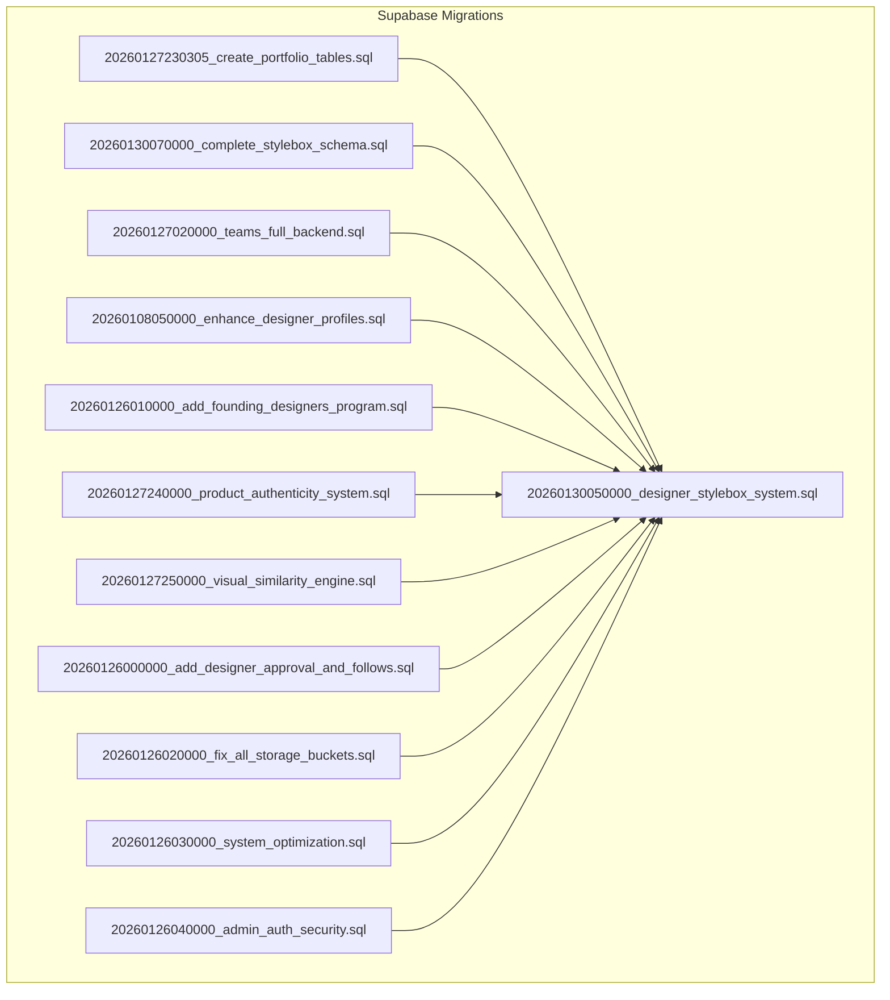
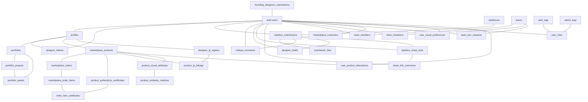
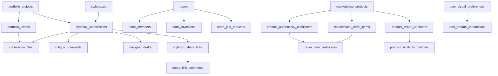

# Database Schema & Tables

<cite>
**Referenced Files in This Document**
- [20260127230305_create_portfolio_tables.sql](file://supabase/migrations/20260127230305_create_portfolio_tables.sql)
- [20260130070000_complete_stylebox_schema.sql](file://supabase/migrations/20260130070000_complete_stylebox_schema.sql)
- [20260127020000_teams_full_backend.sql](file://supabase/migrations/20260127020000_teams_full_backend.sql)
- [20260108050000_enhance_designer_profiles.sql](file://supabase/migrations/20260108050000_enhance_designer_profiles.sql)
- [20260126010000_add_founding_designers_program.sql](file://supabase/migrations/20260126010000_add_founding_designers_program.sql)
- [20260130050000_designer_stylebox_system.sql](file://supabase/migrations/20260130050000_designer_stylebox_system.sql)
- [20260127240000_product_authenticity_system.sql](file://supabase/migrations/20260127240000_product_authenticity_system.sql)
- [20260127250000_visual_similarity_engine.sql](file://supabase/migrations/20260127250000_visual_similarity_engine.sql)
- [20260126000000_add_designer_approval_and_follows.sql](file://supabase/migrations/20260126000000_add_designer_approval_and_follows.sql)
- [20260126020000_fix_all_storage_buckets.sql](file://supabase/migrations/20260126020000_fix_all_storage_buckets.sql)
- [20260126030000_system_optimization.sql](file://supabase/migrations/20260126030000_system_optimization.sql)
- [20260126040000_admin_auth_security.sql](file://supabase/migrations/20260126040000_admin_auth_security.sql)
</cite>

## Table of Contents
1. [Introduction](#introduction)
2. [Project Structure](#project-structure)
3. [Core Components](#core-components)
4. [Architecture Overview](#architecture-overview)
5. [Detailed Component Analysis](#detailed-component-analysis)
6. [Dependency Analysis](#dependency-analysis)
7. [Performance Considerations](#performance-considerations)
8. [Troubleshooting Guide](#troubleshooting-guide)
9. [Conclusion](#conclusion)
10. [Appendices](#appendices)

## Introduction
This document provides comprehensive database schema documentation for the Adorzia platform, focusing on PostgreSQL tables and their relationships. It covers the core entities involved in designers, styleboxes, products, portfolios, teams, and administrative systems. For each table, we describe primary keys, foreign keys, indexes, constraints, data types, and row-level security (RLS) policies. We also explain how designers, styleboxes, portfolios, and teams connect through foreign key constraints and referential integrity. Additionally, we document the evolution of the schema via migration files, highlight partitioning strategies, indexing patterns, and performance optimization techniques.

## Project Structure
The database schema is managed through Supabase migrations located under supabase/migrations. Each migration file corresponds to a logical change or feature addition. Representative migrations include portfolio creation, teams backend, designer stylebox system, product authenticity, visual similarity engine, storage bucket normalization, and system optimizations.

**Diagram sources**
- [20260127230305_create_portfolio_tables.sql](file://supabase/migrations/20260127230305_create_portfolio_tables.sql#L1-L86)
- [20260130070000_complete_stylebox_schema.sql](file://supabase/migrations/20260130070000_complete_stylebox_schema.sql#L1-L51)
- [20260127020000_teams_full_backend.sql](file://supabase/migrations/20260127020000_teams_full_backend.sql#L1-L213)
- [20260108050000_enhance_designer_profiles.sql](file://supabase/migrations/20260108050000_enhance_designer_profiles.sql#L1-L127)
- [20260126010000_add_founding_designers_program.sql](file://supabase/migrations/20260126010000_add_founding_designers_program.sql#L1-L164)
- [20260130050000_designer_stylebox_system.sql](file://supabase/migrations/20260130050000_designer_stylebox_system.sql#L1-L569)
- [20260127240000_product_authenticity_system.sql](file://supabase/migrations/20260127240000_product_authenticity_system.sql#L1-L238)
- [20260127250000_visual_similarity_engine.sql](file://supabase/migrations/20260127250000_visual_similarity_engine.sql#L1-L289)
- [20260126000000_add_designer_approval_and_follows.sql](file://supabase/migrations/20260126000000_add_designer_approval_and_follows.sql#L1-L136)
- [20260126020000_fix_all_storage_buckets.sql](file://supabase/migrations/20260126020000_fix_all_storage_buckets.sql#L1-L453)
- [20260126030000_system_optimization.sql](file://supabase/migrations/20260126030000_system_optimization.sql#L1-L101)
- [20260126040000_admin_auth_security.sql](file://supabase/migrations/20260126040000_admin_auth_security.sql#L1-L79)

**Section sources**
- [20260127230305_create_portfolio_tables.sql](file://supabase/migrations/20260127230305_create_portfolio_tables.sql#L1-L86)
- [20260130070000_complete_stylebox_schema.sql](file://supabase/migrations/20260130070000_complete_stylebox_schema.sql#L1-L51)
- [20260127020000_teams_full_backend.sql](file://supabase/migrations/20260127020000_teams_full_backend.sql#L1-L213)
- [20260108050000_enhance_designer_profiles.sql](file://supabase/migrations/20260108050000_enhance_designer_profiles.sql#L1-L127)
- [20260126010000_add_founding_designers_program.sql](file://supabase/migrations/20260126010000_add_founding_designers_program.sql#L1-L164)
- [20260130050000_designer_stylebox_system.sql](file://supabase/migrations/20260130050000_designer_stylebox_system.sql#L1-L569)
- [20260127240000_product_authenticity_system.sql](file://supabase/migrations/20260127240000_product_authenticity_system.sql#L1-L238)
- [20260127250000_visual_similarity_engine.sql](file://supabase/migrations/20260127250000_visual_similarity_engine.sql#L1-L289)
- [20260126000000_add_designer_approval_and_follows.sql](file://supabase/migrations/20260126000000_add_designer_approval_and_follows.sql#L1-L136)
- [20260126020000_fix_all_storage_buckets.sql](file://supabase/migrations/20260126020000_fix_all_storage_buckets.sql#L1-L453)
- [20260126030000_system_optimization.sql](file://supabase/migrations/20260126030000_system_optimization.sql#L1-L101)
- [20260126040000_admin_auth_security.sql](file://supabase/migrations/20260126040000_admin_auth_security.sql#L1-L79)

## Core Components
This section outlines the principal database tables and their roles in the system. Each table’s primary key, foreign keys, indexes, constraints, and data types are documented. RLS policies and storage bucket configurations are included where applicable.

- Users and Profiles
  - auth.users: Supabase auth users table referenced by multiple tables.
  - profiles: Designer profile metadata with social links, branding, and searchable fields.
  - designer_follows: Follow relationships between users and designers.

- Stylebox System
  - styleboxes: Central stylebox definition with Adorzia Protocol quadrants and deliverables.
  - stylebox_submissions: Designer submissions per stylebox with status and progress.
  - submission_files: Uploaded deliverables linked to submissions.
  - critique_comments: Pin-marker feedback from admins to designers.
  - designer_drafts: Auto-save and version control for work-in-progress.
  - stylebox_share_links: View-only share links for collaborators.
  - share_link_comments: Comments on shared links.

- Portfolios
  - portfolios: Container for designer portfolios.
  - portfolio_projects: Projects within a portfolio with categorization and metadata.
  - portfolio_assets: Files and media associated with projects.

- Teams
  - teams: Team metadata and governance.
  - team_members: Membership with roles.
  - team_invitations: Invitation lifecycle.
  - team_join_requests: Join requests for open teams.

- Marketplaces and Products
  - marketplace_products: Product catalog entries.
  - marketplace_orders, marketplace_order_items: Orders and items.
  - marketplace_customers: Customer identities linked to auth users.

- Authenticity and IP
  - product_authenticity_certificates: Digital certificates for products.
  - order_item_certificates: Per-item certificates for sales.
  - designer_ip_registry: Designer IP registration and verification.
  - product_ip_linkage: Linking products to registered IP.

- Visual Similarity Engine
  - product_visual_attributes: Visual descriptors and embeddings.
  - product_similarity_matches: Precomputed similarity scores.
  - user_visual_preferences: Learned user preferences.
  - user_product_interactions: Event logs for learning.

- Founding Designers Program
  - founding_designers_submissions: Application and review workflow.

- Administrative and Logging
  - auth_logs, admin_logs: Audit trails.
  - user_roles: Role assignments for admin and superadmin.

**Section sources**
- [20260108050000_enhance_designer_profiles.sql](file://supabase/migrations/20260108050000_enhance_designer_profiles.sql#L1-L127)
- [20260126000000_add_designer_approval_and_follows.sql](file://supabase/migrations/20260126000000_add_designer_approval_and_follows.sql#L1-L136)
- [20260130070000_complete_stylebox_schema.sql](file://supabase/migrations/20260130070000_complete_stylebox_schema.sql#L1-L51)
- [20260130050000_designer_stylebox_system.sql](file://supabase/migrations/20260130050000_designer_stylebox_system.sql#L1-L569)
- [20260127230305_create_portfolio_tables.sql](file://supabase/migrations/20260127230305_create_portfolio_tables.sql#L1-L86)
- [20260127020000_teams_full_backend.sql](file://supabase/migrations/20260127020000_teams_full_backend.sql#L1-L213)
- [20260127240000_product_authenticity_system.sql](file://supabase/migrations/20260127240000_product_authenticity_system.sql#L1-L238)
- [20260127250000_visual_similarity_engine.sql](file://supabase/migrations/20260127250000_visual_similarity_engine.sql#L1-L289)
- [20260126010000_add_founding_designers_program.sql](file://supabase/migrations/20260126010000_add_founding_designers_program.sql#L1-L164)
- [20260126020000_fix_all_storage_buckets.sql](file://supabase/migrations/20260126020000_fix_all_storage_buckets.sql#L1-L453)
- [20260126030000_system_optimization.sql](file://supabase/migrations/20260126030000_system_optimization.sql#L1-L101)
- [20260126040000_admin_auth_security.sql](file://supabase/migrations/20260126040000_admin_auth_security.sql#L1-L79)

## Architecture Overview
The schema integrates designers, styleboxes, portfolios, teams, marketplaces, and administrative systems. Designers interact with styleboxes through submissions and deliverables, manage portfolios with projects and assets, collaborate via teams, and participate in the marketplace ecosystem. Authenticity and IP systems ensure provenance and protection. The visual similarity engine powers personalized recommendations. Storage buckets enforce access control and file limits across domains.

**Diagram sources**
- [20260108050000_enhance_designer_profiles.sql](file://supabase/migrations/20260108050000_enhance_designer_profiles.sql#L1-L127)
- [20260126000000_add_designer_approval_and_follows.sql](file://supabase/migrations/20260126000000_add_designer_approval_and_follows.sql#L1-L136)
- [20260130070000_complete_stylebox_schema.sql](file://supabase/migrations/20260130070000_complete_stylebox_schema.sql#L1-L51)
- [20260130050000_designer_stylebox_system.sql](file://supabase/migrations/20260130050000_designer_stylebox_system.sql#L1-L569)
- [20260127230305_create_portfolio_tables.sql](file://supabase/migrations/20260127230305_create_portfolio_tables.sql#L1-L86)
- [20260127020000_teams_full_backend.sql](file://supabase/migrations/20260127020000_teams_full_backend.sql#L1-L213)
- [20260127240000_product_authenticity_system.sql](file://supabase/migrations/20260127240000_product_authenticity_system.sql#L1-L238)
- [20260127250000_visual_similarity_engine.sql](file://supabase/migrations/20260127250000_visual_similarity_engine.sql#L1-L289)
- [20260126010000_add_founding_designers_program.sql](file://supabase/migrations/20260126010000_add_founding_designers_program.sql#L1-L164)
- [20260126020000_fix_all_storage_buckets.sql](file://supabase/migrations/20260126020000_fix_all_storage_buckets.sql#L1-L453)
- [20260126030000_system_optimization.sql](file://supabase/migrations/20260126030000_system_optimization.sql#L1-L101)
- [20260126040000_admin_auth_security.sql](file://supabase/migrations/20260126040000_admin_auth_security.sql#L1-L79)

## Detailed Component Analysis

### Users and Profiles
- Primary Keys
  - auth.users: id (UUID)
  - profiles: id (UUID), user_id (UUID)
- Foreign Keys
  - profiles.user_id -> auth.users.id
  - designer_follows.follower_id/designer_id -> auth.users.id
- Indexes
  - idx_profiles_name_search, idx_profiles_bio_search (GIN trigram)
  - idx_marketplace_products_title_search, idx_marketplace_products_description_search (GIN trigram)
  - idx_marketplace_collections_name_search (GIN trigram)
  - idx_profiles_status_category, idx_marketplace_products_status_category
  - idx_designer_follows_designer, idx_designer_follows_follower
- Constraints
  - designer_follows unique (follower_id, designer_id)
- Data Types
  - Arrays: TEXT[]
  - JSONB: artist_statement, social links
  - Enum-like: user_status extended with pending_approval
- RLS and Permissions
  - profiles: SELECT for anon; UPDATE/INSERT for authenticated with auth.uid() = user_id
  - designer_follows: SELECT for all; INSERT/DELETE for authenticated with ownership checks
- Notes
  - Storage buckets for avatars/logos/banners created and secured via RLS policies

**Section sources**
- [20260108050000_enhance_designer_profiles.sql](file://supabase/migrations/20260108050000_enhance_designer_profiles.sql#L1-L127)
- [20260126000000_add_designer_approval_and_follows.sql](file://supabase/migrations/20260126000000_add_designer_approval_and_follows.sql#L1-L136)
- [20260126020000_fix_all_storage_buckets.sql](file://supabase/migrations/20260126020000_fix_all_storage_buckets.sql#L1-L453)

### Stylebox System
- Primary Keys
  - styleboxes: id (UUID)
  - stylebox_submissions: id (UUID)
  - submission_files: id (UUID)
  - critique_comments: id (UUID)
  - designer_drafts: id (UUID)
  - stylebox_share_links: id (UUID)
  - share_link_comments: id (UUID)
- Foreign Keys
  - stylebox_submissions.stylebox_id -> styleboxes.id (ON DELETE CASCADE)
  - stylebox_submissions.designer_id -> auth.users.id (ON DELETE CASCADE)
  - submission_files.submission_id -> stylebox_submissions.id (ON DELETE CASCADE)
  - submission_files.deliverable_id references styleboxes.adorzia_deliverables
  - critique_comments.submission_id -> stylebox_submissions.id (ON DELETE CASCADE)
  - critique_comments.file_id -> submission_files.id (ON DELETE CASCADE)
  - critique_comments.admin_id -> auth.users.id (ON DELETE CASCADE)
  - designer_drafts.submission_id -> stylebox_submissions.id (ON DELETE CASCADE)
  - designer_drafts.designer_id -> auth.users.id (ON DELETE CASCADE)
  - stylebox_share_links.submission_id -> stylebox_submissions.id (ON DELETE CASCADE)
  - stylebox_share_links.designer_id -> auth.users.id (ON DELETE CASCADE)
  - share_link_comments.share_link_id -> stylebox_share_links.id (ON DELETE CASCADE)
- Indexes
  - idx_submissions_designer, idx_submissions_stylebox, idx_submissions_status, idx_submissions_created
  - idx_submission_files_submission, idx_submission_files_deliverable, idx_submission_files_status
  - idx_critique_comments_submission, idx_critique_comments_file, idx_critique_comments_admin
  - idx_designer_drafts_submission, idx_designer_drafts_designer
  - idx_share_links_token, idx_share_links_submission
- Constraints
  - stylebox_submissions unique (stylebox_id, designer_id, version_number)
  - progress_percentage check (0–100)
  - completed_deliverables ≤ total_deliverables
  - critique_comments pin_x/pin_y checks (0–100)
  - submission_files unique (submission_id, deliverable_id)
- Data Types
  - Enums: submission_status, deliverable_status, designer_file_type
  - JSONB: deliverables, metadata, upload_metadata
  - Vector: product_visual_attributes.visual_embedding
- RLS and Permissions
  - All submission-related tables: authenticated users can access own data; admins/lead_curator can view/manage all
  - Storage bucket: stylebox-designer-submissions with size limits and MIME restrictions
- Triggers and Functions
  - update_submission_progress: auto-updates progress on file status changes
  - generate_share_token: generates share tokens and URLs
  - handle_updated_at: generic updated_at trigger applied to tables with updated_at

**Section sources**
- [20260130070000_complete_stylebox_schema.sql](file://supabase/migrations/20260130070000_complete_stylebox_schema.sql#L1-L51)
- [20260130050000_designer_stylebox_system.sql](file://supabase/migrations/20260130050000_designer_stylebox_system.sql#L1-L569)
- [20260126020000_fix_all_storage_buckets.sql](file://supabase/migrations/20260126020000_fix_all_storage_buckets.sql#L1-L453)
- [20260126030000_system_optimization.sql](file://supabase/migrations/20260126030000_system_optimization.sql#L1-L101)

### Portfolios
- Primary Keys
  - portfolios: id (UUID)
  - portfolio_projects: id (UUID)
  - portfolio_assets: id (UUID)
- Foreign Keys
  - portfolio_projects.portfolio_id -> portfolios.id (ON DELETE CASCADE)
  - portfolio_assets.portfolio_id -> portfolios.id (ON DELETE CASCADE)
  - portfolio_assets.project_id -> portfolio_projects.id (ON DELETE CASCADE)
  - portfolio_assets.designer_id -> auth.users.id (ON DELETE CASCADE)
- Indexes
  - idx_portfolio_projects_portfolio, idx_portfolio_projects_created
  - idx_portfolio_assets_project, idx_portfolio_assets_portfolio, idx_portfolio_assets_designer
- Constraints
  - portfolio_projects.source_type enum-like defaults
  - portfolio_assets.asset_category
- Data Types
  - JSONB: metadata, dimensions
  - Arrays: tags
  - Timestamps: TIMESTAMPTZ
- RLS and Permissions
  - authenticated can access; anon can SELECT
- Triggers and Functions
  - update_portfolio_projects_updated_at: updates updated_at on change

**Section sources**
- [20260127230305_create_portfolio_tables.sql](file://supabase/migrations/20260127230305_create_portfolio_tables.sql#L1-L86)

### Teams
- Primary Keys
  - teams: id (UUID)
  - team_members: composite unique (team_id, user_id)
  - team_invitations: id (UUID)
  - team_join_requests: id (UUID)
- Foreign Keys
  - team_members.team_id -> teams.id (ON DELETE CASCADE)
  - team_members.user_id -> auth.users.id (ON DELETE CASCADE)
  - team_invitations.team_id -> teams.id (ON DELETE CASCADE)
  - team_invitations.inviter_id -> auth.users.id (ON DELETE CASCADE)
  - team_invitations.invitee_id -> auth.users.id (ON DELETE CASCADE)
  - team_join_requests.team_id -> teams.id (ON DELETE CASCADE)
  - team_join_requests.user_id -> auth.users.id (ON DELETE CASCADE)
  - team_join_requests.responded_by -> auth.users.id
- Indexes
  - idx_team_invitations_invitee (pending), idx_team_invitations_team (pending)
  - idx_team_join_requests_team (pending), idx_team_join_requests_user
  - idx_teams_open (open=true), idx_team_members_team, idx_team_members_user
- Constraints
  - team_invitations unique (team_id, invitee_id, status)
  - team_join_requests unique (team_id, user_id, status)
  - team_invitations.status enum-like
  - team_join_requests.status enum-like
- Data Types
  - JSONB: metadata
  - Integers: max_members, completed_challenges
- RLS and Permissions
  - Users can view open teams or their own; leads can manage invitations/requests
  - Admins can view all invitations; manage all join requests
- Functions
  - get_team_stats: member/pending counts and challenge count
  - can_join_team: checks eligibility to join a team
  - increment_team_completed_challenges: increments challenge counter on approval

**Section sources**
- [20260127020000_teams_full_backend.sql](file://supabase/migrations/20260127020000_teams_full_backend.sql#L1-L213)

### Marketplaces and Products
- Primary Keys
  - marketplace_products: id (UUID)
  - marketplace_orders: id (UUID)
  - marketplace_order_items: id (UUID)
  - marketplace_customers: id (UUID)
- Foreign Keys
  - marketplace_products.designer_id -> auth.users.id
  - marketplace_orders.customer_id -> marketplace_customers.id
  - marketplace_order_items.order_id -> marketplace_orders.id (ON DELETE CASCADE)
  - marketplace_order_items.product_id -> marketplace_products.id
  - order_item_certificates.order_item_id -> marketplace_order_items.id (ON DELETE CASCADE)
  - order_item_certificates.certificate_id -> product_authenticity_certificates.id (ON DELETE CASCADE)
  - order_item_certificates.issued_to_customer_id -> marketplace_customers.id (ON DELETE SET NULL)
  - product_ip_linkage.product_id -> marketplace_products.id (ON DELETE CASCADE)
  - product_ip_linkage.ip_registry_id -> designer_ip_registry.id (ON DELETE CASCADE)
- Indexes
  - idx_products_status_category, idx_orders_customer, idx_order_items_order, idx_order_items_product
  - idx_certificates_product, idx_certificates_designer, idx_certificates_number
  - idx_order_certificates_serial, idx_order_certificates_verification
  - idx_ip_registry_designer, idx_product_ip_product
- Constraints
  - product_authenticity_certificates certificate_number unique
  - order_item_certificates serial_number unique
  - product_ip_linkage unique (product_id, ip_registry_id)
- Data Types
  - JSONB: product images, metadata, IP documents
  - Arrays: materials_certified, design_images
  - Dates and timestamps: TIMESTAMPTZ
- RLS and Permissions
  - Product authenticity and IP tables: public can view active/verified; owners/admins can manage
  - Customers can view own certificates; public can verify by code

**Section sources**
- [20260127240000_product_authenticity_system.sql](file://supabase/migrations/20260127240000_product_authenticity_system.sql#L1-L238)

### Visual Similarity Engine
- Primary Keys
  - product_visual_attributes: id (UUID), unique (product_id)
  - product_similarity_matches: id (UUID), unique (product_id, similar_product_id)
  - user_visual_preferences: id (UUID), unique (user_id)
  - user_product_interactions: id (UUID)
- Foreign Keys
  - product_visual_attributes.product_id -> marketplace_products.id (ON DELETE CASCADE)
  - product_similarity_matches.product_id -> marketplace_products.id (ON DELETE CASCADE)
  - product_similarity_matches.similar_product_id -> marketplace_products.id (ON DELETE CASCADE)
  - user_visual_preferences.user_id -> auth.users.id (ON DELETE CASCADE)
  - user_product_interactions.user_id -> auth.users.id (ON DELETE CASCADE)
  - user_product_interactions.product_id -> marketplace_products.id (ON DELETE CASCADE)
- Indexes
  - idx_visual_attrs_product, idx_visual_attrs_silhouette (GIN), idx_visual_attrs_aesthetics (GIN)
  - idx_similarity_product, idx_similarity_score (desc)
  - idx_interactions_user (user_id, created_at desc), idx_interactions_product
- Constraints
  - product_similarity_matches similarity_score (0.000–1.000), product_id ≠ similar_product_id
  - user_product_interactions interaction_type enum-like
- Data Types
  - Vector: visual_embedding (512)
  - JSONB: preference_vector
  - Arrays: silhouette_type, fabric_texture, aesthetic_tags, etc.
- RLS and Permissions
  - product_visual_attributes: public can view; admin can manage
  - user_visual_preferences: users can view/update own
  - user_product_interactions: users can view own; insert with validation
- Functions
  - find_similar_products: returns similar live products
  - get_personalized_recommendations: computes relevance score
  - update_user_visual_preferences: aggregates preferences from interactions

**Section sources**
- [20260127250000_visual_similarity_engine.sql](file://supabase/migrations/20260127250000_visual_similarity_engine.sql#L1-L289)

### Founding Designers Program
- Primary Keys
  - founding_designers_submissions: id (UUID)
- Foreign Keys
  - designer_id -> auth.users.id (ON DELETE CASCADE)
  - reviewed_by -> auth.users.id
- Indexes
  - idx_founding_submissions_designer, idx_founding_submissions_status, idx_founding_submissions_submitted
- Constraints
  - primary_category enum-like
  - estimated_articles check (5–15)
  - target_seasonal_launch enum-like
  - status enum-like
- Data Types
  - JSONB: moodboard_files, tech_pack_files
  - Timestamps: TIMESTAMPTZ
- RLS and Permissions
  - Designers can view/update own pending submissions; admins can view/manage all
- Storage
  - bucket founding-submissions with size limits and policies

**Section sources**
- [20260126010000_add_founding_designers_program.sql](file://supabase/migrations/20260126010000_add_founding_designers_program.sql#L1-L164)
- [20260126020000_fix_all_storage_buckets.sql](file://supabase/migrations/20260126020000_fix_all_storage_buckets.sql#L1-L453)

### Administrative and Logging
- Tables
  - auth_logs, admin_logs: audit logs
  - user_roles: role assignments (admin, superadmin)
- RLS and Permissions
  - Admins can view auth logs; anyone can insert
  - Admins can manage admin_logs
- Functions
  - get_admin_dashboard_stats: secure RPC guarded by role checks and grants

**Section sources**
- [20260126040000_admin_auth_security.sql](file://supabase/migrations/20260126040000_admin_auth_security.sql#L1-L79)

## Dependency Analysis
This section maps dependencies among major tables and highlights referential integrity enforced by foreign keys. It also shows how styleboxes, portfolios, teams, and marketplaces interrelate.

**Diagram sources**
- [20260130070000_complete_stylebox_schema.sql](file://supabase/migrations/20260130070000_complete_stylebox_schema.sql#L1-L51)
- [20260130050000_designer_stylebox_system.sql](file://supabase/migrations/20260130050000_designer_stylebox_system.sql#L1-L569)
- [20260127230305_create_portfolio_tables.sql](file://supabase/migrations/20260127230305_create_portfolio_tables.sql#L1-L86)
- [20260127020000_teams_full_backend.sql](file://supabase/migrations/20260127020000_teams_full_backend.sql#L1-L213)
- [20260127240000_product_authenticity_system.sql](file://supabase/migrations/20260127240000_product_authenticity_system.sql#L1-L238)
- [20260127250000_visual_similarity_engine.sql](file://supabase/migrations/20260127250000_visual_similarity_engine.sql#L1-L289)

**Section sources**
- [20260130070000_complete_stylebox_schema.sql](file://supabase/migrations/20260130070000_complete_stylebox_schema.sql#L1-L51)
- [20260130050000_designer_stylebox_system.sql](file://supabase/migrations/20260130050000_designer_stylebox_system.sql#L1-L569)
- [20260127230305_create_portfolio_tables.sql](file://supabase/migrations/20260127230305_create_portfolio_tables.sql#L1-L86)
- [20260127020000_teams_full_backend.sql](file://supabase/migrations/20260127020000_teams_full_backend.sql#L1-L213)
- [20260127240000_product_authenticity_system.sql](file://supabase/migrations/20260127240000_product_authenticity_system.sql#L1-L238)
- [20260127250000_visual_similarity_engine.sql](file://supabase/migrations/20260127250000_visual_similarity_engine.sql#L1-L289)

## Performance Considerations
- Generic updated_at Trigger
  - handle_updated_at applied to all tables with updated_at via dynamic DO block to ensure consistent timestamps.
- Indexing Patterns
  - GIN indexes on arrays and text search vectors for profiles, products, collections.
  - Partial indexes on pending statuses for invitations and join requests.
  - Composite indexes for frequent filters (status, category).
  - Vector extension enabled for similarity engine embeddings.
- Storage Buckets and Policies
  - Bucket-specific size limits and allowed MIME types to prevent abuse and ensure performance.
  - Fine-grained RLS policies per bucket to enforce ownership and admin access.
- RPCs and Aggregations
  - Consolidated analytics RPCs reduce round-trips and improve dashboard responsiveness.
  - Security hardening with role checks and explicit grants.
- Realtime Publication
  - Supabase realtime publication configured for key admin tables.

**Section sources**
- [20260126030000_system_optimization.sql](file://supabase/migrations/20260126030000_system_optimization.sql#L1-L101)
- [20260126020000_fix_all_storage_buckets.sql](file://supabase/migrations/20260126020000_fix_all_storage_buckets.sql#L1-L453)
- [20260126040000_admin_auth_security.sql](file://supabase/migrations/20260126040000_admin_auth_security.sql#L1-L79)
- [20260127250000_visual_similarity_engine.sql](file://supabase/migrations/20260127250000_visual_similarity_engine.sql#L1-L289)

## Troubleshooting Guide
- Permission Denied
  - Ensure authenticated user context is present; verify RLS policies for the relevant table.
  - Confirm storage bucket policies allow access for the current user.
- Missing Data in Realtime
  - Verify supabase_realtime publication includes the table and user has appropriate grants.
- Slow Queries
  - Check for missing indexes on frequently filtered columns (status, category, timestamps).
  - Use partial indexes for pending states.
- Storage Upload Failures
  - Confirm bucket size limits and allowed MIME types align with the file being uploaded.
- Role-Based Access
  - Admin dashboards require admin or superadmin roles; verify user_roles assignment.

**Section sources**
- [20260126040000_admin_auth_security.sql](file://supabase/migrations/20260126040000_admin_auth_security.sql#L1-L79)
- [20260126020000_fix_all_storage_buckets.sql](file://supabase/migrations/20260126020000_fix_all_storage_buckets.sql#L1-L453)

## Conclusion
The Adorzia database schema integrates designers, styleboxes, portfolios, teams, marketplaces, authenticity/IP systems, and the visual similarity engine into a cohesive system. Through carefully designed foreign keys, indexes, constraints, and RLS policies, it ensures referential integrity, access control, and performance. Migrations document the evolution of the schema, enabling incremental enhancements while maintaining backward compatibility. The storage bucket configuration and security hardening further reinforce operational reliability and scalability.

## Appendices

### Evolution of the Schema Through Migrations
Representative milestones:
- Portfolio tables created with RLS and indexes.
- Stylebox schema completed with Adorzia Protocol fields.
- Teams backend implemented with invitations, join requests, and stats functions.
- Designer profiles enhanced with branding and social fields.
- Founding designers program introduced with storage and notifications.
- Product authenticity system and visual similarity engine added.
- Storage buckets normalized and secured.
- System optimizations and admin security hardening.

**Section sources**
- [20260127230305_create_portfolio_tables.sql](file://supabase/migrations/20260127230305_create_portfolio_tables.sql#L1-L86)
- [20260130070000_complete_stylebox_schema.sql](file://supabase/migrations/20260130070000_complete_stylebox_schema.sql#L1-L51)
- [20260127020000_teams_full_backend.sql](file://supabase/migrations/20260127020000_teams_full_backend.sql#L1-L213)
- [20260108050000_enhance_designer_profiles.sql](file://supabase/migrations/20260108050000_enhance_designer_profiles.sql#L1-L127)
- [20260126010000_add_founding_designers_program.sql](file://supabase/migrations/20260126010000_add_founding_designers_program.sql#L1-L164)
- [20260127240000_product_authenticity_system.sql](file://supabase/migrations/20260127240000_product_authenticity_system.sql#L1-L238)
- [20260127250000_visual_similarity_engine.sql](file://supabase/migrations/20260127250000_visual_similarity_engine.sql#L1-L289)
- [20260126020000_fix_all_storage_buckets.sql](file://supabase/migrations/20260126020000_fix_all_storage_buckets.sql#L1-L453)
- [20260126030000_system_optimization.sql](file://supabase/migrations/20260126030000_system_optimization.sql#L1-L101)
- [20260126040000_admin_auth_security.sql](file://supabase/migrations/20260126040000_admin_auth_security.sql#L1-L79)