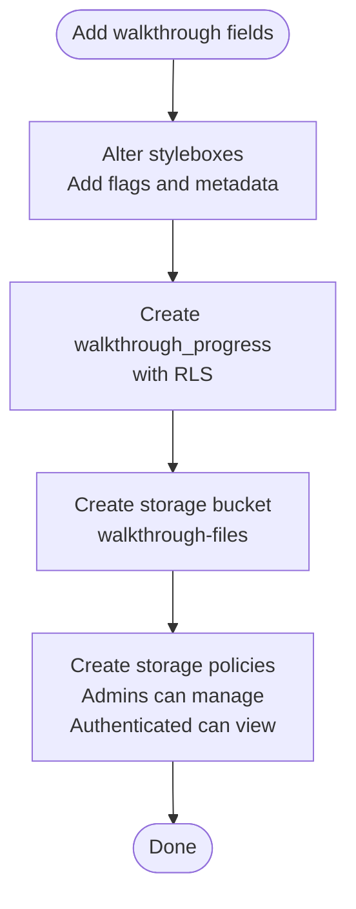

# Migration History & Schema Evolution

<cite>
**Referenced Files in This Document**
- [20251209213954_141af71b-504d-4a68-a16d-b931834b1328.sql](file://supabase/migrations/20251209213954_141af71b-504d-4a68-a16d-b931834b1328.sql)
- [20251209220223_71c698ff-f4d2-4830-bc60-ed7aabd9e86e.sql](file://supabase/migrations/20251209220223_71c698ff-f4d2-4830-bc60-ed7aabd9e86e.sql)
- [20251210080443_ebb4e7b6-ba2c-4901-b275-8562f6a0f005.sql](file://supabase/migrations/20251210080443_ebb4e7b6-ba2c-4901-b275-8562f6a0f005.sql)
- [20251210081453_e347b119-7956-4577-b7ea-2527b6774c18.sql](file://supabase/migrations/20251210081453_e347b119-7956-4577-b7ea-2527b6774c18.sql)
- [20251210082720_87b4e6e5-fead-49a8-9626-79133a1d0496.sql](file://supabase/migrations/20251210082720_87b4e6e5-fead-49a8-9626-79133a1d0496.sql)
- [20251210143034_b4f28643-c0da-49dc-a075-2f4aa7acd21a.sql](file://supabase/migrations/20251210143034_b4f28643-c0da-49dc-a075-2f4aa7acd21a.sql)
- [20251210154227_0704eed3-ff46-4573-b803-c4c7525a7cb4.sql](file://supabase/migrations/20251210154227_0704eed3-ff46-4573-b803-c4c7525a7cb4.sql)
- [20251211154544_b42815ce-a320-401d-85e2-e3e7cb6f8db2.sql](file://supabase/migrations/20251211154544_b42815ce-a320-401d-85e2-e3e7cb6f8db2.sql)
- [20251211155200_4554f09c-8dff-4f0b-8064-8b9a251f6b4e.sql](file://supabase/migrations/20251211155200_4554f09c-8dff-4f0b-8064-8b9a251f6b4e.sql)
- [20251213021429_07d5972a-bd1c-46f7-9370-43be85e04358.sql](file://supabase/migrations/20251213021429_07d5972a-bd1c-46f7-9370-43be85e04358.sql)
- [20251215073741_24a68261-0e95-4f70-a95d-8e2917543565.sql](file://supabase/migrations/20251215073741_24a68261-0e95-4f70-a95d-8e2917543565.sql)
- [20251216074549_151f4e57-a441-43b6-ac79-313fc5250b3c.sql](file://supabase/migrations/20251216074549_151f4e57-a441-43b6-ac79-313fc5250b3c.sql)
- [20251219092544_39ff4b7c-af67-4727-b06b-211f688bcdf4.sql](file://supabase/migrations/20251219092544_39ff4b7c-af67-4727-b06b-211f688bcdf4.sql)
- [20251225032904_731f6ad6-075d-429d-958b-e85d46d93e49.sql](file://supabase/migrations/20251225032904_731f6ad6-075d-429d-958b-e85d46d93e49.sql)
- [20251225042959_58b61b4d-1f17-4666-96b3-211a9f48ed2a.sql](file://supabase/migrations/20251225042959_58b61b4d-1f17-4666-96b3-211a9f48ed2a.sql)
- [20251225045301_9b034f19-b9bf-44ab-972d-c11561800283.sql](file://supabase/migrations/20251225045301_9b034f19-b9bf-44ab-972d-c11561800283.sql)
- [20251225055251_7d80366c-ddc5-40d7-867f-7546d72692b1.sql](file://supabase/migrations/20251225055251_7d80366c-ddc5-40d7-867f-7546d72692b1.sql)
- [20251225055810_71d92a73-36d1-430e-b070-68bbf805250f.sql](file://supabase/migrations/20251225055810_71d92a73-36d1-430e-b070-68bbf805250f.sql)
- [20251225061135_a3487ea9-61ef-47a6-b563-17605c71c34a.sql](file://supabase/migrations/20251225061135_a3487ea9-61ef-47a6-b563-17605c71c34a.sql)
- [20251225062559_5ef1fdb1-c549-4fd8-90c1-bc1db1bb333e.sql](file://supabase/migrations/20251225062559_5ef1fdb1-c549-4fd8-90c1-bc1db1bb333e.sql)
- [20251225062920_ea2b9686-7743-454f-8678-f15a11245fce.sql](file://supabase/migrations/20251225062920_ea2b9686-7743-454f-8678-f15a11245fce.sql)
- [20251225063212_6d120194-2e4a-4cee-bee7-a71b77451020.sql](file://supabase/migrations/20251225063212_6d120194-2e4a-4cee-bee7-a71b77451020.sql)
- [20251226092855_6a9b8fc7-9fbe-4ff3-adcc-2411fc8d8d9a.sql](file://supabase/migrations/20251226092855_6a9b8fc7-9fbe-4ff3-adcc-2411fc8d8d9a.sql)
- [20251231072327_24f6c046-2261-41d6-a0e2-a733e38addd6.sql](file://supabase/migrations/20251231072327_24f6c046-2261-41d6-a0e2-a733e38addd6.sql)
- [20260106072015_8011bca7-38e1-4efc-bc02-8dfafff9a379.sql](file://supabase/migrations/20260106072015_8011bca7-38e1-4efc-bc02-8dfafff9a379.sql)
- [20260106072131_886e6ea3-9831-4920-977c-1ff1fbd2dc3e.sql](file://supabase/migrations/20260106072131_886e6ea3-9831-4920-977c-1ff1fbd2dc3e.sql)
- [20260107070601_80d046a8-b8fa-458f-9862-04eb64bbcf6a.sql](file://supabase/migrations/20260107070601_80d046a8-b8fa-458f-9862-04eb64bbcf6a.sql)
- [20260107070639_92ca6ce5-f12e-4659-9af2-c9026f1e18c2.sql](file://supabase/migrations/20260107070639_92ca6ce5-f12e-4659-9af2-c9026f1e18c2.sql)
- [20260108044609_38199a3a-f6a3-42ea-b892-ae6b88050934.sql](file://supabase/migrations/20260108044609_38199a3a-f6a3-42ea-b892-ae6b88050934.sql)
- [20260108050000_enhance_designer_profiles.sql](file://supabase/migrations/20260108050000_enhance_designer_profiles.sql)
- [20260126000000_add_designer_approval_and_follows.sql](file://supabase/migrations/20260126000000_add_designer_approval_and_follows.sql)
- [20260126010000_add_founding_designers_program.sql](file://supabase/migrations/20260126010000_add_founding_designers_program.sql)
- [20260126020000_fix_all_storage_buckets.sql](file://supabase/migrations/20260126020000_fix_all_storage_buckets.sql)
- [20260126030000_system_optimization.sql](file://supabase/migrations/20260126030000_system_optimization.sql)
- [20260126040000_admin_auth_security.sql](file://supabase/migrations/20260126040000_admin_auth_security.sql)
- [20260126050000_bootstrap_superadmin.sql](file://supabase/migrations/20260126050000_bootstrap_superadmin.sql)
- [20260126060000_isolate_admin_auth.sql](file://supabase/migrations/20260126060000_isolate_admin_auth.sql)
- [20260126070000_enhance_founding_profiles.sql](file://supabase/migrations/20260126070000_enhance_founding_profiles.sql)
- [20260126080000_enhance_founding_submissions_ui.sql](file://supabase/migrations/20260126080000_enhance_founding_submissions_ui.sql)
- [20260126090000_admin_founding_workflow.sql](file://supabase/migrations/20260126090000_admin_founding_workflow.sql)
- [20260126100000_founding_final_refinements.sql](file://supabase/migrations/20260126100000_founding_final_refinements.sql)
- [20260127000000_founding_storage_admin_policy.sql](file://supabase/migrations/20260127000000_founding_storage_admin_policy.sql)
- [20260127010000_enhance_notifications.sql](file://supabase/migrations/20260127010000_enhance_notifications.sql)
- [20260127020000_teams_full_backend.sql](file://supabase/migrations/20260127020000_teams_full_backend.sql)
- [20260127040000_fix_teams_rls_for_preview.sql](file://supabase/migrations/20260127040000_fix_teams_rls_for_preview.sql)
- [20260127230305_create_portfolio_tables.sql](file://supabase/migrations/20260127230305_create_portfolio_tables.sql)
- [20260127230400_deprecate_collections.sql](file://supabase/migrations/20260127230400_deprecate_collections.sql)
- [20260127230500_enhance_portfolio_rls.sql](file://supabase/migrations/20260127230500_enhance_portfolio_rls.sql)
- [20260127240000_product_authenticity_system.sql](file://supabase/migrations/20260127240000_product_authenticity_system.sql)
- [20260127250000_visual_similarity_engine.sql](file://supabase/migrations/20260127250000_visual_similarity_engine.sql)
- [20260129000000_fix_security_vulnerabilities.sql](file://supabase/migrations/20260129000000_fix_security_vulnerabilities.sql)
- [20260130000000_add_delete_account_function.sql](file://supabase/migrations/20260130000000_add_delete_account_function.sql)
- [20260130010000_add_newsletter_unsubscribe_fields.sql](file://supabase/migrations/20260130010000_add_newsletter_unsubscribe_fields.sql)
- [20260130020000_stylebox_creation_enhancements.sql](file://supabase/migrations/20260130020000_stylebox_creation_enhancements.sql)
- [20260130030000_stylebox_storage_and_watermarking.sql](file://supabase/migrations/20260130030000_stylebox_storage_and_watermarking.sql)
- [20260130040000_add_lead_curator_role.sql](file://supabase/migrations/20260130040000_add_lead_curator_role.sql)
- [20260130040001_update_policies_with_lead_curator.sql](file://supabase/migrations/20260130040001_update_policies_with_lead_curator.sql)
- [20260130050000_designer_stylebox_system.sql](file://supabase/migrations/20260130050000_designer_stylebox_system.sql)
- [20260130070000_complete_stylebox_schema.sql](file://supabase/migrations/20260130070000_complete_stylebox_schema.sql)
- [20260131000000_add_product_features_columns.sql](file://supabase/migrations/20260131000000_add_product_features_columns.sql)
- [20260131000001_add_article_features_columns.sql](file://supabase/migrations/20260131000001_add_article_features_columns.sql)
- [20260131000002_update_seed_products_with_features.sql](file://supabase/migrations/20260131000002_update_seed_products_with_features.sql)
- [20260201000000_add_profile_approval_and_feature_flags.sql](file://supabase/migrations/20260201000000_add_profile_approval_and_feature_flags.sql)
- [20260201000001_update_profile_approval_rls.sql](file://supabase/migrations/20260201000001_update_profile_approval_rls.sql)
- [20260201000002_create_profile_approval_logs.sql](file://supabase/migrations/20260201000002_create_profile_approval_logs.sql)
- [20260201000003_add_admin_check_function.sql](file://supabase/migrations/20260201000003_add_admin_check_function.sql)
- [20260201010000_admin_invitations.sql](file://supabase/migrations/20260201010000_admin_invitations.sql)
- [20260201010000_fix_user_product_interactions_rls.sql](file://supabase/migrations/20260201010000_fix_user_product_interactions_rls.sql)
- [20260201020000_fix_newsletter_subscribers_rls.sql](file://supabase/migrations/20260201020000_fix_newsletter_subscribers_rls.sql)
- [20260201030000_fix_marketplace_orders_rls.sql](file://supabase/migrations/20260201030000_fix_marketplace_orders_rls.sql)
- [20260213000000_fix_team_members_rls_recursion.sql](file://supabase/migrations/20260213000000_fix_team_members_rls_recursion.sql)
- [20260213000001_cleanup_seed_data.sql](file://supabase/migrations/20260213000001_cleanup_seed_data.sql)
- [20260214000000_add_designer_to_collections.sql](file://supabase/migrations/20260214000000_add_designer_to_collections.sql)
</cite>

## Table of Contents
1. [Introduction](#introduction)
2. [Project Structure](#project-structure)
3. [Core Components](#core-components)
4. [Architecture Overview](#architecture-overview)
5. [Detailed Component Analysis](#detailed-component-analysis)
6. [Dependency Analysis](#dependency-analysis)
7. [Performance Considerations](#performance-considerations)
8. [Troubleshooting Guide](#troubleshooting-guide)
9. [Conclusion](#conclusion)
10. [Appendices](#appendices)

## Introduction
This document traces the database schema evolution of the Adorzia platform through its migration history. It chronicles the chronological development of table structures, relationships, and business logic implementations across a series of Supabase SQL migrations. The analysis highlights major architectural changes, feature additions, and refactoring efforts, explains the rationale behind structural decisions, and aligns them with platform requirements such as team collaboration, portfolio management, and marketplace integrations. It also addresses backward compatibility considerations, data migration strategies, rollback procedures, lessons learned, and best practices.

## Project Structure
The database schema is managed via a set of ordered SQL migration files under the Supabase migrations directory. Each migration file introduces or modifies schema elements (tables, enums, indexes, policies, triggers) and often seeds initial data. The migrations are timestamp-prefixed and designed to be applied sequentially to evolve the schema over time.

**Diagram sources**
- [20251209213954_141af71b-504d-4a68-a16d-b931834b1328.sql](file://supabase/migrations/20251209213954_141af71b-504d-4a68-a16d-b931834b1328.sql#L1-L461)
- [20251209220223_71c698ff-f4d2-4830-bc60-ed7aabd9e86e.sql](file://supabase/migrations/20251209220223_71c698ff-f4d2-4830-bc60-ed7aabd9e86e.sql#L1-L37)
- [20251210080443_ebb4e7b6-ba2c-4901-b275-8562f6a0f005.sql](file://supabase/migrations/20251210080443_ebb4e7b6-ba2c-4901-b275-8562f6a0f005.sql#L1-L53)
- [20251210081453_e347b119-7956-4577-b7ea-2527b6774c18.sql](file://supabase/migrations/20251210081453_e347b119-7956-4577-b7ea-2527b6774c18.sql#L1-L50)
- [20251210082720_87b4e6e5-fead-49a8-9626-79133a1d0496.sql](file://supabase/migrations/20251210082720_87b4e6e5-fead-49a8-9626-79133a1d0496.sql#L1-L81)
- [20251210143034_b4f28643-c0da-49dc-a075-2f4aa7acd21a.sql](file://supabase/migrations/20251210143034_b4f28643-c0da-49dc-a075-2f4aa7acd21a.sql#L1-L162)
- [20251210154227_0704eed3-ff46-4573-b803-c4c7525a7cb4.sql](file://supabase/migrations/20251210154227_0704eed3-ff46-4573-b803-c4c7525a7cb4.sql#L1-L90)
- [20251211154544_b42815ce-a320-401d-85e2-e3e7cb6f8db2.sql](file://supabase/migrations/20251211154544_b42815ce-a320-401d-85e2-e3e7cb6f8db2.sql#L1-L30)
- [20251211155200_4554f09c-8dff-4f0b-8064-8b9a251f6b4e.sql](file://supabase/migrations/20251211155200_4554f09c-8dff-4f0b-8064-8b9a251f6b4e.sql#L1-L85)
- [20251213021429_07d5972a-bd1c-46f7-9370-43be85e04358.sql](file://supabase/migrations/20251213021429_07d5972a-bd1c-46f7-9370-43be85e04358.sql#L1-L33)
- [20251215073741_24a68261-0e95-4f70-a95d-8e2917543565.sql](file://supabase/migrations/20251215073741_24a68261-0e95-4f70-a95d-8e2917543565.sql#L1-L41)
- [20251216074549_151f4e57-a441-43b6-ac79-313fc5250b3c.sql](file://supabase/migrations/20251216074549_151f4e57-a441-43b6-ac79-313fc5250b3c.sql#L1-L186)
- [20251219092544_39ff4b7c-af67-4727-b06b-211f688bcdf4.sql](file://supabase/migrations/20251219092544_39ff4b7c-af67-4727-b06b-211f688bcdf4.sql#L1-L16)
- [20251225032904_731f6ad6-075d-429d-958b-e85d46d93e49.sql](file://supabase/migrations/20251225032904_731f6ad6-075d-429d-958b-e85d46d93e49.sql#L1-L89)
- [20251225042959_58b61b4d-1f17-4666-96b3-211a9f48ed2a.sql](file://supabase/migrations/20251225042959_58b61b4d-1f17-4666-96b3-211a9f48ed2a.sql#L1-L133)
- [20251225045301_9b034f19-b9bf-44ab-972d-c11561800283.sql](file://supabase/migrations/20251225045301_9b034f19-b9bf-44ab-972d-c11561800283.sql#L1-L86)
- [20251225055251_7d80366c-ddc5-40d7-867f-7546d72692b1.sql](file://supabase/migrations/20251225055251_7d80366c-ddc5-40d7-867f-7546d72692b1.sql#L1-L1)
- [20251225055810_71d92a73-36d1-430e-b070-68bbf805250f.sql](file://supabase/migrations/20251225055810_71d92a73-36d1-430e-b070-68bbf805250f.sql#L1-L1)
- [20251225061135_a3487ea9-61ef-47a6-b563-17605c71c34a.sql](file://supabase/migrations/20251225061135_a3487ea9-61ef-47a6-b563-17605c71c34a.sql#L1-L1)
- [20251225062559_5ef1fdb1-c549-4fd8-90c1-bc1db1bb333e.sql](file://supabase/migrations/20251225062559_5ef1fdb1-c549-4fd8-90c1-bc1db1bb333e.sql#L1-L1)
- [20251225062920_ea2b9686-7743-454f-8678-f15a11245fce.sql](file://supabase/migrations/20251225062920_ea2b9686-7743-454f-8678-f15a11245fce.sql#L1-L1)
- [20251225063212_6d120194-2e4a-4cee-bee7-a71b77451020.sql](file://supabase/migrations/20251225063212_6d120194-2e4a-4cee-bee7-a71b77451020.sql#L1-L1)
- [20251226092855_6a9b8fc7-9fbe-4ff3-adcc-2411fc8d8d9a.sql](file://supabase/migrations/20251226092855_6a9b8fc7-9fbe-4ff3-adcc-2411fc8d8d9a.sql#L1-L1)
- [20251231072327_24f6c046-2261-41d6-a0e2-a733e38addd6.sql](file://supabase/migrations/20251231072327_24f6c046-2261-41d6-a0e2-a733e38addd6.sql#L1-L1)
- [20260106072015_8011bca7-38e1-4efc-bc02-8dfafff9a379.sql](file://supabase/migrations/20260106072015_8011bca7-38e1-4efc-bc02-8dfafff9a379.sql#L1-L1)
- [20260106072131_886e6ea3-9831-4920-977c-1ff1fbd2dc3e.sql](file://supabase/migrations/20260106072131_886e6ea3-9831-4920-977c-1ff1fbd2dc3e.sql#L1-L1)
- [20260107070601_80d046a8-b8fa-458f-9862-04eb64bbcf6a.sql](file://supabase/migrations/20260107070601_80d046a8-b8fa-458f-9862-04eb64bbcf6a.sql#L1-L1)
- [20260107070639_92ca6ce5-f12e-4659-9af2-c9026f1e18c2.sql](file://supabase/migrations/20260107070639_92ca6ce5-f12e-4659-9af2-c9026f1e18c2.sql#L1-L1)
- [20260108044609_38199a3a-f6a3-42ea-b892-ae6b88050934.sql](file://supabase/migrations/20260108044609_38199a3a-f6a3-42ea-b892-ae6b88050934.sql#L1-L1)
- [20260108050000_enhance_designer_profiles.sql](file://supabase/migrations/20260108050000_enhance_designer_profiles.sql#L1-L1)
- [20260126000000_add_designer_approval_and_follows.sql](file://supabase/migrations/20260126000000_add_designer_approval_and_follows.sql#L1-L1)
- [20260126010000_add_founding_designers_program.sql](file://supabase/migrations/20260126010000_add_founding_designers_program.sql#L1-L1)
- [20260126020000_fix_all_storage_buckets.sql](file://supabase/migrations/20260126020000_fix_all_storage_buckets.sql#L1-L1)
- [20260126030000_system_optimization.sql](file://supabase/migrations/20260126030000_system_optimization.sql#L1-L1)
- [20260126040000_admin_auth_security.sql](file://supabase/migrations/20260126040000_admin_auth_security.sql#L1-L1)
- [20260126050000_bootstrap_superadmin.sql](file://supabase/migrations/20260126050000_bootstrap_superadmin.sql#L1-L1)
- [20260126060000_isolate_admin_auth.sql](file://supabase/migrations/20260126060000_isolate_admin_auth.sql#L1-L1)
- [20260126070000_enhance_founding_profiles.sql](file://supabase/migrations/20260126070000_enhance_founding_profiles.sql#L1-L1)
- [20260126080000_enhance_founding_submissions_ui.sql](file://supabase/migrations/20260126080000_enhance_founding_submissions_ui.sql#L1-L1)
- [20260126090000_admin_founding_workflow.sql](file://supabase/migrations/20260126090000_admin_founding_workflow.sql#L1-L1)
- [20260126100000_founding_final_refinements.sql](file://supabase/migrations/20260126100000_founding_final_refinements.sql#L1-L1)
- [20260127000000_founding_storage_admin_policy.sql](file://supabase/migrations/20260127000000_founding_storage_admin_policy.sql#L1-L1)
- [20260127010000_enhance_notifications.sql](file://supabase/migrations/20260127010000_enhance_notifications.sql#L1-L1)
- [20260127020000_teams_full_backend.sql](file://supabase/migrations/20260127020000_teams_full_backend.sql#L1-L1)
- [20260127040000_fix_teams_rls_for_preview.sql](file://supabase/migrations/20260127040000_fix_teams_rls_for_preview.sql#L1-L1)
- [20260127230305_create_portfolio_tables.sql](file://supabase/migrations/20260127230305_create_portfolio_tables.sql#L1-L1)
- [20260127230400_deprecate_collections.sql](file://supabase/migrations/20260127230400_deprecate_collections.sql#L1-L1)
- [20260127230500_enhance_portfolio_rls.sql](file://supabase/migrations/20260127230500_enhance_portfolio_rls.sql#L1-L1)
- [20260127240000_product_authenticity_system.sql](file://supabase/migrations/20260127240000_product_authenticity_system.sql#L1-L1)
- [20260127250000_visual_similarity_engine.sql](file://supabase/migrations/20260127250000_visual_similarity_engine.sql#L1-L1)
- [20260129000000_fix_security_vulnerabilities.sql](file://supabase/migrations/20260129000000_fix_security_vulnerabilities.sql#L1-L1)
- [20260130000000_add_delete_account_function.sql](file://supabase/migrations/20260130000000_add_delete_account_function.sql#L1-L1)
- [20260130010000_add_newsletter_unsubscribe_fields.sql](file://supabase/migrations/20260130010000_add_newsletter_unsubscribe_fields.sql#L1-L1)
- [20260130020000_stylebox_creation_enhancements.sql](file://supabase/migrations/20260130020000_stylebox_creation_enhancements.sql#L1-L1)
- [20260130030000_stylebox_storage_and_watermarking.sql](file://supabase/migrations/20260130030000_stylebox_storage_and_watermarking.sql#L1-L1)
- [20260130040000_add_lead_curator_role.sql](file://supabase/migrations/20260130040000_add_lead_curator_role.sql#L1-L1)
- [20260130040001_update_policies_with_lead_curator.sql](file://supabase/migrations/20260130040001_update_policies_with_lead_curator.sql#L1-L1)
- [20260130050000_designer_stylebox_system.sql](file://supabase/migrations/20260130050000_designer_stylebox_system.sql#L1-L1)
- [20260130070000_complete_stylebox_schema.sql](file://supabase/migrations/20260130070000_complete_stylebox_schema.sql#L1-L1)
- [20260131000000_add_product_features_columns.sql](file://supabase/migrations/20260131000000_add_product_features_columns.sql#L1-L1)
- [20260131000001_add_article_features_columns.sql](file://supabase/migrations/20260131000001_add_article_features_columns.sql#L1-L1)
- [20260131000002_update_seed_products_with_features.sql](file://supabase/migrations/20260131000002_update_seed_products_with_features.sql#L1-L1)
- [20260201000000_add_profile_approval_and_feature_flags.sql](file://supabase/migrations/20260201000000_add_profile_approval_and_feature_flags.sql#L1-L1)
- [20260201000001_update_profile_approval_rls.sql](file://supabase/migrations/20260201000001_update_profile_approval_rls.sql#L1-L1)
- [20260201000002_create_profile_approval_logs.sql](file://supabase/migrations/20260201000002_create_profile_approval_logs.sql#L1-L1)
- [20260201000003_add_admin_check_function.sql](file://supabase/migrations/20260201000003_add_admin_check_function.sql#L1-L1)
- [20260201010000_admin_invitations.sql](file://supabase/migrations/20260201010000_admin_invitations.sql#L1-L1)
- [20260201010000_fix_user_product_interactions_rls.sql](file://supabase/migrations/20260201010000_fix_user_product_interactions_rls.sql#L1-L1)
- [20260201020000_fix_newsletter_subscribers_rls.sql](file://supabase/migrations/20260201020000_fix_newsletter_subscribers_rls.sql#L1-L1)
- [20260201030000_fix_marketplace_orders_rls.sql](file://supabase/migrations/20260201030000_fix_marketplace_orders_rls.sql#L1-L1)
- [20260213000000_fix_team_members_rls_recursion.sql](file://supabase/migrations/20260213000000_fix_team_members_rls_recursion.sql#L1-L1)
- [20260213000001_cleanup_seed_data.sql](file://supabase/migrations/20260213000001_cleanup_seed_data.sql#L1-L1)
- [20260214000000_add_designer_to_collections.sql](file://supabase/migrations/20260214000000_add_designer_to_collections.sql#L1-L1)

**Section sources**
- [20251209213954_141af71b-504d-4a68-a16d-b931834b1328.sql](file://supabase/migrations/20251209213954_141af71b-504d-4a68-a16d-b931834b1328.sql#L1-L461)

## Core Components
This section outlines the foundational schema elements introduced and evolved through the migration history, focusing on tables, enums, triggers, and policies that define platform capabilities.

- Enums
  - Core enums include roles, categories, subscription tiers, statuses, difficulty levels, and notification types. These enums standardize controlled vocabularies across related tables and policies.
  - Examples: app_role, designer_category, subscription_tier, user_status, stylebox_difficulty, content_status, submission_status, publication_status, product_status, payout_status, job_application_status, notification_type, notification_status, team_role.

- Tables
  - User and Access Control: user_roles, profiles, auth_logs, user_badges, user_achievement_badges, achievement_badges.
  - Learning and Career: ranks, designer_scores, foundation_purchases, stylebox_evaluation_scores.
  - Content and Briefs: styleboxes, stylebox_submissions, walkthrough_progress, collection_submissions.
  - Portfolio and Publishing: portfolios, portfolio_publications, publication_reviews, production_queue, marketplace_handoffs, production_logs.
  - Marketplace and Commerce: marketplace_products, product_sales, earnings, payouts.
  - Collaboration: teams, team_members, team_stylebox_submissions.
  - Jobs and Recruitment: jobs, job_applications, saved_jobs.
  - Newsletter and Audit: newsletter_subscribers, admin_logs.

- Triggers and Functions
  - update_updated_at_column(): centralized timestamp maintenance across multiple tables.
  - handle_new_user(): automatic profile creation and rank assignment upon user signup.
  - update_job_application_count(): maintains job application counts based on inserts/deletes.

- Row Level Security (RLS)
  - Extensively applied to all tables to enforce tenant isolation, role-based access, and data ownership. Policies are tailored per entity (e.g., profiles, portfolios, marketplace products, teams).

- Storage Buckets and Policies
  - Dedicated buckets for walkthrough-files, collection-files, and others with granular policies for uploads, downloads, updates, and deletions.

**Section sources**
- [20251209213954_141af71b-504d-4a68-a16d-b931834b1328.sql](file://supabase/migrations/20251209213954_141af71b-504d-4a68-a16d-b931834b1328.sql#L2-L426)
- [20251209220223_71c698ff-f4d2-4830-bc60-ed7aabd9e86e.sql](file://supabase/migrations/20251209220223_71c698ff-f4d2-4830-bc60-ed7aabd9e86e.sql#L1-L37)
- [20251210080443_ebb4e7b6-ba2c-4901-b275-8562f6a0f005.sql](file://supabase/migrations/20251210080443_ebb4e7b6-ba2c-4901-b275-8562f6a0f005.sql#L1-L53)
- [20251210081453_e347b119-7956-4577-b7ea-2527b6774c18.sql](file://supabase/migrations/20251210081453_e347b119-7956-4577-b7ea-2527b6774c18.sql#L22-L30)
- [20251210082720_87b4e6e5-fead-49a8-9626-79133a1d0496.sql](file://supabase/migrations/20251210082720_87b4e6e5-fead-49a8-9626-79133a1d0496.sql#L47-L58)
- [20251210143034_b4f28643-c0da-49dc-a075-2f4aa7acd21a.sql](file://supabase/migrations/20251210143034_b4f28643-c0da-49dc-a075-2f4aa7acd21a.sql#L46-L98)
- [20251210154227_0704eed3-ff46-4573-b803-c4c7525a7cb4.sql](file://supabase/migrations/20251210154227_0704eed3-ff46-4573-b803-c4c7525a7cb4.sql#L47-L90)
- [20251211154544_b42815ce-a320-401d-85e2-e3e7cb6f8db2.sql](file://supabase/migrations/20251211154544_b42815ce-a320-401d-85e2-e3e7cb6f8db2.sql#L6-L30)
- [20251211155200_4554f09c-8dff-4f0b-8064-8b9a251f6b4e.sql](file://supabase/migrations/20251211155200_4554f09c-8dff-4f0b-8064-8b9a251f6b4e.sql#L1-L85)
- [20251213021429_07d5972a-bd1c-46f7-9370-43be85e04358.sql](file://supabase/migrations/20251213021429_07d5972a-bd1c-46f7-9370-43be85e04358.sql#L1-L33)
- [20251215073741_24a68261-0e95-4f70-a95d-8e2917543565.sql](file://supabase/migrations/20251215073741_24a68261-0e95-4f70-a95d-8e2917543565.sql#L1-L41)
- [20251216074549_151f4e57-a441-43b6-ac79-313fc5250b3c.sql](file://supabase/migrations/20251216074549_151f4e57-a441-43b6-ac79-313fc5250b3c.sql#L74-L186)
- [20251219092544_39ff4b7c-af67-4727-b06b-211f688bcdf4.sql](file://supabase/migrations/20251219092544_39ff4b7c-af67-4727-b06b-211f688bcdf4.sql#L1-L16)
- [20251225032904_731f6ad6-075d-429d-958b-e85d46d93e49.sql](file://supabase/migrations/20251225032904_731f6ad6-075d-429d-958b-e85d46d93e49.sql#L1-L89)
- [20251225042959_58b61b4d-1f17-4666-96b3-211a9f48ed2a.sql](file://supabase/migrations/20251225042959_58b61b4d-1f17-4666-96b3-211a9f48ed2a.sql#L7-L48)
- [20251225045301_9b034f19-b9bf-44ab-972d-c11561800283.sql](file://supabase/migrations/20251225045301_9b034f19-b9bf-44ab-972d-c11561800283.sql#L13-L41)
- [20260126000000_add_designer_approval_and_follows.sql](file://supabase/migrations/20260126000000_add_designer_approval_and_follows.sql#L1-L1)
- [20260126010000_add_founding_designers_program.sql](file://supabase/migrations/20260126010000_add_founding_designers_program.sql#L1-L1)
- [20260126020000_fix_all_storage_buckets.sql](file://supabase/migrations/20260126020000_fix_all_storage_buckets.sql#L1-L1)
- [20260126030000_system_optimization.sql](file://supabase/migrations/20260126030000_system_optimization.sql#L1-L1)
- [20260126040000_admin_auth_security.sql](file://supabase/migrations/20260126040000_admin_auth_security.sql#L1-L1)
- [20260126050000_bootstrap_superadmin.sql](file://supabase/migrations/20260126050000_bootstrap_superadmin.sql#L1-L1)
- [20260126060000_isolate_admin_auth.sql](file://supabase/migrations/20260126060000_isolate_admin_auth.sql#L1-L1)
- [20260126070000_enhance_founding_profiles.sql](file://supabase/migrations/20260126070000_enhance_founding_profiles.sql#L1-L1)
- [20260126080000_enhance_founding_submissions_ui.sql](file://supabase/migrations/20260126080000_enhance_founding_submissions_ui.sql#L1-L1)
- [20260126090000_admin_founding_workflow.sql](file://supabase/migrations/20260126090000_admin_founding_workflow.sql#L1-L1)
- [20260126100000_founding_final_refinements.sql](file://supabase/migrations/20260126100000_founding_final_refinements.sql#L1-L1)
- [20260127000000_founding_storage_admin_policy.sql](file://supabase/migrations/20260127000000_founding_storage_admin_policy.sql#L1-L1)
- [20260127010000_enhance_notifications.sql](file://supabase/migrations/20260127010000_enhance_notifications.sql#L1-L1)
- [20260127020000_teams_full_backend.sql](file://supabase/migrations/20260127020000_teams_full_backend.sql#L1-L1)
- [20260127040000_fix_teams_rls_for_preview.sql](file://supabase/migrations/20260127040000_fix_teams_rls_for_preview.sql#L1-L1)
- [20260127230305_create_portfolio_tables.sql](file://supabase/migrations/20260127230305_create_portfolio_tables.sql#L1-L1)
- [20260127230400_deprecate_collections.sql](file://supabase/migrations/20260127230400_deprecate_collections.sql#L1-L1)
- [20260127230500_enhance_portfolio_rls.sql](file://supabase/migrations/20260127230500_enhance_portfolio_rls.sql#L1-L1)
- [20260127240000_product_authenticity_system.sql](file://supabase/migrations/20260127240000_product_authenticity_system.sql#L1-L1)
- [20260127250000_visual_similarity_engine.sql](file://supabase/migrations/20260127250000_visual_similarity_engine.sql#L1-L1)
- [20260129000000_fix_security_vulnerabilities.sql](file://supabase/migrations/20260129000000_fix_security_vulnerabilities.sql#L1-L1)
- [20260130000000_add_delete_account_function.sql](file://supabase/migrations/20260130000000_add_delete_account_function.sql#L1-L1)
- [20260130010000_add_newsletter_unsubscribe_fields.sql](file://supabase/migrations/20260130010000_add_newsletter_unsubscribe_fields.sql#L1-L1)
- [20260130020000_stylebox_creation_enhancements.sql](file://supabase/migrations/20260130020000_stylebox_creation_enhancements.sql#L1-L1)
- [20260130030000_stylebox_storage_and_watermarking.sql](file://supabase/migrations/20260130030000_stylebox_storage_and_watermarking.sql#L1-L1)
- [20260130040000_add_lead_curator_role.sql](file://supabase/migrations/20260130040000_add_lead_curator_role.sql#L1-L1)
- [20260130040001_update_policies_with_lead_curator.sql](file://supabase/migrations/20260130040001_update_policies_with_lead_curator.sql#L1-L1)
- [20260130050000_designer_stylebox_system.sql](file://supabase/migrations/20260130050000_designer_stylebox_system.sql#L1-L1)
- [20260130070000_complete_stylebox_schema.sql](file://supabase/migrations/20260130070000_complete_stylebox_schema.sql#L1-L1)
- [20260131000000_add_product_features_columns.sql](file://supabase/migrations/20260131000000_add_product_features_columns.sql#L1-L1)
- [20260131000001_add_article_features_columns.sql](file://supabase/migrations/20260131000001_add_article_features_columns.sql#L1-L1)
- [20260131000002_update_seed_products_with_features.sql](file://supabase/migrations/20260131000002_update_seed_products_with_features.sql#L1-L1)
- [20260201000000_add_profile_approval_and_feature_flags.sql](file://supabase/migrations/20260201000000_add_profile_approval_and_feature_flags.sql#L1-L1)
- [20260201000001_update_profile_approval_rls.sql](file://supabase/migrations/20260201000001_update_profile_approval_rls.sql#L1-L1)
- [20260201000002_create_profile_approval_logs.sql](file://supabase/migrations/20260201000002_create_profile_approval_logs.sql#L1-L1)
- [20260201000003_add_admin_check_function.sql](file://supabase/migrations/20260201000003_add_admin_check_function.sql#L1-L1)
- [20260201010000_admin_invitations.sql](file://supabase/migrations/20260201010000_admin_invitations.sql#L1-L1)
- [20260201010000_fix_user_product_interactions_rls.sql](file://supabase/migrations/20260201010000_fix_user_product_interactions_rls.sql#L1-L1)
- [20260201020000_fix_newsletter_subscribers_rls.sql](file://supabase/migrations/20260201020000_fix_newsletter_subscribers_rls.sql#L1-L1)
- [20260201030000_fix_marketplace_orders_rls.sql](file://supabase/migrations/20260201030000_fix_marketplace_orders_rls.sql#L1-L1)
- [20260213000000_fix_team_members_rls_recursion.sql](file://supabase/migrations/20260213000000_fix_team_members_rls_recursion.sql#L1-L1)
- [20260213000001_cleanup_seed_data.sql](file://supabase/migrations/20260213000001_cleanup_seed_data.sql#L1-L1)
- [20260214000000_add_designer_to_collections.sql](file://supabase/migrations/20260214000000_add_designer_to_collections.sql#L1-L1)

## Architecture Overview
The schema evolution follows a layered architecture:
- Identity and Access Control: auth.users integration, user_roles, has_role function, and RLS policies.
- Learning and Career: ranks, designer_scores, foundation_purchases, stylebox_evaluation_scores.
- Content and Briefs: styleboxes, stylebox_submissions, walkthrough_progress, collection_submissions.
- Portfolio and Publishing: portfolios, portfolio_publications, publication_reviews, production_queue, marketplace_handoffs, production_logs.
- Marketplace and Commerce: marketplace_products, product_sales, earnings, payouts.
- Collaboration: teams, team_members, team_stylebox_submissions, achievement_badges, user_achievement_badges.
- Jobs and Recruitment: jobs, job_applications, saved_jobs.
- Newsletter and Audit: newsletter_subscribers, admin_logs, auth_logs.

**Diagram sources**
- [20251209213954_141af71b-504d-4a68-a16d-b931834b1328.sql](file://supabase/migrations/20251209213954_141af71b-504d-4a68-a16d-b931834b1328.sql#L18-L461)
- [20251210080443_ebb4e7b6-ba2c-4901-b275-8562f6a0f005.sql](file://supabase/migrations/20251210080443_ebb4e7b6-ba2c-4901-b275-8562f6a0f005.sql#L9-L20)
- [20251210082720_87b4e6e5-fead-49a8-9626-79133a1d0496.sql](file://supabase/migrations/20251210082720_87b4e6e5-fead-49a8-9626-79133a1d0496.sql#L47-L58)
- [20251210143034_b4f28643-c0da-49dc-a075-2f4aa7acd21a.sql](file://supabase/migrations/20251210143034_b4f28643-c0da-49dc-a075-2f4aa7acd21a.sql#L46-L98)
- [20251211155200_4554f09c-8dff-4f0b-8064-8b9a251f6b4e.sql](file://supabase/migrations/20251211155200_4554f09c-8dff-4f0b-8064-8b9a251f6b4e.sql#L1-L19)
- [20251216074549_151f4e57-a441-43b6-ac79-313fc5250b3c.sql](file://supabase/migrations/20251216074549_151f4e57-a441-43b6-ac79-313fc5250b3c.sql#L74-L186)
- [20251225042959_58b61b4d-1f17-4666-96b3-211a9f48ed2a.sql](file://supabase/migrations/20251225042959_58b61b4d-1f17-4666-96b3-211a9f48ed2a.sql#L7-L48)
- [20251225045301_9b034f19-b9bf-44ab-972d-c11561800283.sql](file://supabase/migrations/20251225045301_9b034f19-b9bf-44ab-972d-c11561800283.sql#L43-L86)

## Detailed Component Analysis

### Foundations and Identity (20251209)
- Introduced core enums and identity tables (user_roles, profiles).
- Implemented has_role function to prevent RLS recursion and enable role-based policies.
- Added RLS policies for user_roles, ranks, profiles, and user_badges.
- Created update_updated_at_column trigger and on_auth_user_created trigger for automatic profile provisioning.
- Seeded default ranks with structured requirements.

**Diagram sources**
- [20251209213954_141af71b-504d-4a68-a16d-b931834b1328.sql](file://supabase/migrations/20251209213954_141af71b-504d-4a68-a16d-b931834b1328.sql#L29-L449)
- [20251211154544_b42815ce-a320-401d-85e2-e3e7cb6f8db2.sql](file://supabase/migrations/20251211154544_b42815ce-a320-401d-85e2-e3e7cb6f8db2.sql#L6-L30)

**Section sources**
- [20251209213954_141af71b-504d-4a68-a16d-b931834b1328.sql](file://supabase/migrations/20251209213954_141af71b-504d-4a68-a16d-b931834b1328.sql#L2-L461)
- [20251211154544_b42815ce-a320-401d-85e2-e3e7cb6f8db2.sql](file://supabase/migrations/20251211154544_b42815ce-a320-401d-85e2-e3e7cb6f8db2.sql#L6-L30)

### Walkthrough and Learning System (20251210)
- Added is_walkthrough flag and steps array to styleboxes.
- Introduced walkthrough_progress table with RLS policies for designers and admins.
- Enhanced styleboxes with walkthrough management fields (subscription tier, rank order, dates, versioning, references, feature flag).
- Created storage bucket for walkthrough reference files with policies.

**Diagram sources**
- [20251210080443_ebb4e7b6-ba2c-4901-b275-8562f6a0f005.sql](file://supabase/migrations/20251210080443_ebb4e7b6-ba2c-4901-b275-8562f6a0f005.sql#L1-L53)
- [20251210081453_e347b119-7956-4577-b7ea-2527b6774c18.sql](file://supabase/migrations/20251210081453_e347b119-7956-4577-b7ea-2527b6774c18.sql#L22-L40)

**Section sources**
- [20251210080443_ebb4e7b6-ba2c-4901-b275-8562f6a0f005.sql](file://supabase/migrations/20251210080443_ebb4e7b6-ba2c-4901-b275-8562f6a0f005.sql#L1-L53)
- [20251210081453_e347b119-7956-4577-b7ea-2527b6774c18.sql](file://supabase/migrations/20251210081453_e347b119-7956-4577-b7ea-2527b6774c18.sql#L1-L50)

### Portfolio and Publication Workflow (20251210)
- Introduced publication_source and publication_decision enums.
- Extended portfolio_publications with source tracking, decision workflow, marketplace status, and quality ratings.
- Added publication_reviews table for audit trails and indexes for performance.
- Migrated publication_status to publication_status_v2 and added production_queue, marketplace_handoffs, and production_logs tables.

**Diagram sources**
- [20251210082720_87b4e6e5-fead-49a8-9626-79133a1d0496.sql](file://supabase/migrations/20251210082720_87b4e6e5-fead-49a8-9626-79133a1d0496.sql#L1-L81)
- [20251210143034_b4f28643-c0da-49dc-a075-2f4aa7acd21a.sql](file://supabase/migrations/20251210143034_b4f28643-c0da-49dc-a075-2f4aa7acd21a.sql#L46-L98)

**Section sources**
- [20251210082720_87b4e6e5-fead-49a8-9626-79133a1d0496.sql](file://supabase/migrations/20251210082720_87b4e6e5-fead-49a8-9626-79133a1d0496.sql#L1-L81)
- [20251210143034_b4f28643-c0da-49dc-a075-2f4aa7acd21a.sql](file://supabase/migrations/20251210143034_b4f28643-c0da-49dc-a075-2f4aa7acd21a.sql#L1-L162)

### Security and Policy Refinements (20251210)
- Tightened INSERT policies for auth_logs, notifications, and portfolio_analytics.
- Fixed team_members and teams RLS policies to prevent recursion and ensure correct membership checks.

**Section sources**
- [20251210154227_0704eed3-ff46-4573-b803-c4c7525a7cb4.sql](file://supabase/migrations/20251210154227_0704eed3-ff46-4573-b803-c4c7525a7cb4.sql#L1-L90)

### Profile Enhancements and Foundation Program (20251211, 20251216)
- Added bio and skills to profiles and updated handle_new_user to assign F1 rank automatically.
- Introduced collection_submissions table for initial collection submissions with storage bucket and policies.
- Added newsletter_subscribers table with RLS and indexes.

**Section sources**
- [20251211154544_b42815ce-a320-401d-85e2-e3e7cb6f8db2.sql](file://supabase/migrations/20251211154544_b42815ce-a320-401d-85e2-e3e7cb6f8db2.sql#L1-L30)
- [20251211155200_4554f09c-8dff-4f0b-8064-8b9a251f6b4e.sql](file://supabase/migrations/20251211155200_4554f09c-8dff-4f0b-8064-8b9a251f6b4e.sql#L1-L85)
- [20251215073741_24a68261-0e95-4f70-a95d-8e2917543565.sql](file://supabase/migrations/20251215073741_24a68261-0e95-4f70-a95d-8e2917543565.sql#L1-L41)

### Stylebox Templates and Foundation Mechanics (20251213, 20251216, 20251219)
- Standardized StyleBox template columns (season, collection_size, trend_narrative, visual_keywords, color_system, material_direction, technical_requirements, design_guidelines, evaluation_criteria, submission_deadline, pdf_url, thumbnail_url).
- Enhanced ranks with foundation attributes (min_weighted_score, min_time_in_rank_days, is_foundation, bonus_percentage, price_usd, max_slots, description).
- Introduced designer_scores, foundation_purchases, and stylebox_evaluation_scores tables with RLS and indexes.

**Section sources**
- [20251213021429_07d5972a-bd1c-46f7-9370-43be85e04358.sql](file://supabase/migrations/20251213021429_07d5972a-bd1c-46f7-9370-43be85e04358.sql#L1-L33)
- [20251216074549_151f4e57-a441-43b6-ac79-313fc5250b3c.sql](file://supabase/migrations/20251216074549_151f4e57-a441-43b6-ac79-313fc5250b3c.sql#L74-L186)
- [20251219092544_39ff4b7c-af67-4727-b06b-211f688bcdf4.sql](file://supabase/migrations/20251219092544_39ff4b7c-af67-4727-b06b-211f688bcdf4.sql#L1-L16)

### Rank Reorganization and Team Challenges (20251225, 20251225)
- Reorganized ranks with new names and weighted score thresholds (e.g., Apprentice, Patternist, Stylist, Couturier, Visionary, Creative Director).
- Added team challenge fields to styleboxes and introduced team_stylebox_submissions, achievement_badges, and user_achievement_badges tables with RLS.

**Section sources**
- [20251225032904_731f6ad6-075d-429d-958b-e85d46d93e49.sql](file://supabase/migrations/20251225032904_731f6ad6-075d-429d-958b-e85d46d93e49.sql#L1-L89)
- [20251225042959_58b61b4d-1f17-4666-96b3-211a9f48ed2a.sql](file://supabase/migrations/20251225042959_58b61b4d-1f17-4666-96b3-211a9f48ed2a.sql#L1-L133)

### Jobs and Recruitment System (20251225)
- Introduced job_status, job_type, location_type, and salary_type enums.
- Extended jobs and job_applications with comprehensive fields and added saved_jobs table.
- Implemented application_count trigger and indexes for performance.

**Section sources**
- [20251225045301_9b034f19-b9bf-44ab-972d-c11561800283.sql](file://supabase/migrations/20251225045301_9b034f19-b9bf-44ab-972d-c11561800283.sql#L1-L86)

### Administrative and Operational Enhancements (20260126 to 20260214)
- Founding designers program: approvals, invitations, storage policies, and workflow refinements.
- Teams backend: full team collaboration features with RLS fixes for preview scenarios.
- Portfolio management: deprecation of collections, enhanced RLS, and portfolio tables.
- Product authenticity and visual similarity engine: marketplace integrity features.
- Security hardening: vulnerability fixes, admin auth isolation, and superadmin bootstrap.
- Notification enhancements, storage bucket fixes, and system optimizations.
- Additional features: newsletter unsubscribe fields, stylebox creation enhancements, watermarking, lead curator role, designer-stylebox system, marketplace product/article feature columns, profile approval workflows, admin check functions, and marketplace orders RLS fixes.

**Section sources**
- [20260126000000_add_designer_approval_and_follows.sql](file://supabase/migrations/20260126000000_add_designer_approval_and_follows.sql#L1-L1)
- [20260126010000_add_founding_designers_program.sql](file://supabase/migrations/20260126010000_add_founding_designers_program.sql#L1-L1)
- [20260126020000_fix_all_storage_buckets.sql](file://supabase/migrations/20260126020000_fix_all_storage_buckets.sql#L1-L1)
- [20260126030000_system_optimization.sql](file://supabase/migrations/20260126030000_system_optimization.sql#L1-L1)
- [20260126040000_admin_auth_security.sql](file://supabase/migrations/20260126040000_admin_auth_security.sql#L1-L1)
- [20260126050000_bootstrap_superadmin.sql](file://supabase/migrations/20260126050000_bootstrap_superadmin.sql#L1-L1)
- [20260126060000_isolate_admin_auth.sql](file://supabase/migrations/20260126060000_isolate_admin_auth.sql#L1-L1)
- [20260126070000_enhance_founding_profiles.sql](file://supabase/migrations/20260126070000_enhance_founding_profiles.sql#L1-L1)
- [20260126080000_enhance_founding_submissions_ui.sql](file://supabase/migrations/20260126080000_enhance_founding_submissions_ui.sql#L1-L1)
- [20260126090000_admin_founding_workflow.sql](file://supabase/migrations/20260126090000_admin_founding_workflow.sql#L1-L1)
- [20260126100000_founding_final_refinements.sql](file://supabase/migrations/20260126100000_founding_final_refinements.sql#L1-L1)
- [20260127000000_founding_storage_admin_policy.sql](file://supabase/migrations/20260127000000_founding_storage_admin_policy.sql#L1-L1)
- [20260127010000_enhance_notifications.sql](file://supabase/migrations/20260127010000_enhance_notifications.sql#L1-L1)
- [20260127020000_teams_full_backend.sql](file://supabase/migrations/20260127020000_teams_full_backend.sql#L1-L1)
- [20260127040000_fix_teams_rls_for_preview.sql](file://supabase/migrations/20260127040000_fix_teams_rls_for_preview.sql#L1-L1)
- [20260127230305_create_portfolio_tables.sql](file://supabase/migrations/20260127230305_create_portfolio_tables.sql#L1-L1)
- [20260127230400_deprecate_collections.sql](file://supabase/migrations/20260127230400_deprecate_collections.sql#L1-L1)
- [20260127230500_enhance_portfolio_rls.sql](file://supabase/migrations/20260127230500_enhance_portfolio_rls.sql#L1-L1)
- [20260127240000_product_authenticity_system.sql](file://supabase/migrations/20260127240000_product_authenticity_system.sql#L1-L1)
- [20260127250000_visual_similarity_engine.sql](file://supabase/migrations/20260127250000_visual_similarity_engine.sql#L1-L1)
- [20260129000000_fix_security_vulnerabilities.sql](file://supabase/migrations/20260129000000_fix_security_vulnerabilities.sql#L1-L1)
- [20260130000000_add_delete_account_function.sql](file://supabase/migrations/20260130000000_add_delete_account_function.sql#L1-L1)
- [20260130010000_add_newsletter_unsubscribe_fields.sql](file://supabase/migrations/20260130010000_add_newsletter_unsubscribe_fields.sql#L1-L1)
- [20260130020000_stylebox_creation_enhancements.sql](file://supabase/migrations/20260130020000_stylebox_creation_enhancements.sql#L1-L1)
- [20260130030000_stylebox_storage_and_watermarking.sql](file://supabase/migrations/20260130030000_stylebox_storage_and_watermarking.sql#L1-L1)
- [20260130040000_add_lead_curator_role.sql](file://supabase/migrations/20260130040000_add_lead_curator_role.sql#L1-L1)
- [20260130040001_update_policies_with_lead_curator.sql](file://supabase/migrations/20260130040001_update_policies_with_lead_curator.sql#L1-L1)
- [20260130050000_designer_stylebox_system.sql](file://supabase/migrations/20260130050000_designer_stylebox_system.sql#L1-L1)
- [20260130070000_complete_stylebox_schema.sql](file://supabase/migrations/20260130070000_complete_stylebox_schema.sql#L1-L1)
- [20260131000000_add_product_features_columns.sql](file://supabase/migrations/20260131000000_add_product_features_columns.sql#L1-L1)
- [20260131000001_add_article_features_columns.sql](file://supabase/migrations/20260131000001_add_article_features_columns.sql#L1-L1)
- [20260131000002_update_seed_products_with_features.sql](file://supabase/migrations/20260131000002_update_seed_products_with_features.sql#L1-L1)
- [20260201000000_add_profile_approval_and_feature_flags.sql](file://supabase/migrations/20260201000000_add_profile_approval_and_feature_flags.sql#L1-L1)
- [20260201000001_update_profile_approval_rls.sql](file://supabase/migrations/20260201000001_update_profile_approval_rls.sql#L1-L1)
- [20260201000002_create_profile_approval_logs.sql](file://supabase/migrations/20260201000002_create_profile_approval_logs.sql#L1-L1)
- [20260201000003_add_admin_check_function.sql](file://supabase/migrations/20260201000003_add_admin_check_function.sql#L1-L1)
- [20260201010000_admin_invitations.sql](file://supabase/migrations/20260201010000_admin_invitations.sql#L1-L1)
- [20260201010000_fix_user_product_interactions_rls.sql](file://supabase/migrations/20260201010000_fix_user_product_interactions_rls.sql#L1-L1)
- [20260201020000_fix_newsletter_subscribers_rls.sql](file://supabase/migrations/20260201020000_fix_newsletter_subscribers_rls.sql#L1-L1)
- [20260201030000_fix_marketplace_orders_rls.sql](file://supabase/migrations/20260201030000_fix_marketplace_orders_rls.sql#L1-L1)
- [20260213000000_fix_team_members_rls_recursion.sql](file://supabase/migrations/20260213000000_fix_team_members_rls_recursion.sql#L1-L1)
- [20260213000001_cleanup_seed_data.sql](file://supabase/migrations/20260213000001_cleanup_seed_data.sql#L1-L1)
- [20260214000000_add_designer_to_collections.sql](file://supabase/migrations/20260214000000_add_designer_to_collections.sql#L1-L1)

## Dependency Analysis
The schema exhibits strong cohesion around functional domains and low coupling through shared foreign keys and RLS policies. Key dependency chains include:
- Identity and Access Control: auth.users -> user_roles -> has_role function -> RLS policies.
- Learning and Career: ranks -> profiles -> designer_scores -> foundation_purchases -> stylebox_evaluation_scores.
- Content and Briefs: styleboxes -> stylebox_submissions -> walkthrough_progress -> team_stylebox_submissions.
- Portfolio and Publishing: portfolios -> portfolio_publications -> publication_reviews -> production_queue -> marketplace_handoffs -> production_logs.
- Marketplace and Commerce: marketplace_products -> product_sales -> earnings -> payouts.
- Collaboration: teams -> team_members -> team_stylebox_submissions -> user_achievement_badges.
- Jobs and Recruitment: jobs -> job_applications -> saved_jobs.
- Newsletter and Audit: newsletter_subscribers -> admin_logs -> auth_logs.

**Diagram sources**
- [20251209213954_141af71b-504d-4a68-a16d-b931834b1328.sql](file://supabase/migrations/20251209213954_141af71b-504d-4a68-a16d-b931834b1328.sql#L29-L449)
- [20251216074549_151f4e57-a441-43b6-ac79-313fc5250b3c.sql](file://supabase/migrations/20251216074549_151f4e57-a441-43b6-ac79-313fc5250b3c.sql#L74-L186)
- [20251210143034_b4f28643-c0da-49dc-a075-2f4aa7acd21a.sql](file://supabase/migrations/20251210143034_b4f28643-c0da-49dc-a075-2f4aa7acd21a.sql#L46-L98)
- [20251225042959_58b61b4d-1f17-4666-96b3-211a9f48ed2a.sql](file://supabase/migrations/20251225042959_58b61b4d-1f17-4666-96b3-211a9f48ed2a.sql#L7-L48)
- [20251225045301_9b034f19-b9bf-44ab-972d-c11561800283.sql](file://supabase/migrations/20251225045301_9b034f19-b9bf-44ab-972d-c11561800283.sql#L43-L86)

**Section sources**
- [20251209213954_141af71b-504d-4a68-a16d-b931834b1328.sql](file://supabase/migrations/20251209213954_141af71b-504d-4a68-a16d-b931834b1328.sql#L29-L449)
- [20251216074549_151f4e57-a441-43b6-ac79-313fc5250b3c.sql](file://supabase/migrations/20251216074549_151f4e57-a441-43b6-ac79-313fc5250b3c.sql#L74-L186)
- [20251210143034_b4f28643-c0da-49dc-a075-2f4aa7acd21a.sql](file://supabase/migrations/20251210143034_b4f28643-c0da-49dc-a075-2f4aa7acd21a.sql#L46-L98)
- [20251225042959_58b61b4d-1f17-4666-96b3-211a9f48ed2a.sql](file://supabase/migrations/20251225042959_58b61b4d-1f17-4666-96b3-211a9f48ed2a.sql#L7-L48)
- [20251225045301_9b034f19-b9bf-44ab-972d-c11561800283.sql](file://supabase/migrations/20251225045301_9b034f19-b9bf-44ab-972d-c11561800283.sql#L43-L86)

## Performance Considerations
- Indexes: Strategic indexes on frequently queried columns (e.g., auth_logs, newsletter_subscribers, production_queue, marketplace_handoffs, production_logs) improve query performance.
- Triggers: Centralized update_updated_at_column reduces duplication and ensures consistent timestamps.
- Enums: Controlled vocabularies reduce storage overhead and improve join performance.
- RLS: While essential for security, RLS policies add overhead; ensure policies are selective and leverage indexes where possible.

[No sources needed since this section provides general guidance]

## Troubleshooting Guide
Common issues and resolutions derived from migration history:
- Overly permissive INSERT policies: Tightened auth_logs and notifications policies to restrict system-generated inserts to authenticated users or service roles.
- Team RLS recursion: Corrected team_members and teams policies to prevent infinite recursion and ensure accurate membership checks.
- Storage bucket permissions: Fixed storage policies for walkthrough-files and collection-files to ensure proper access controls.
- Marketplace orders and user interactions: Updated RLS policies for marketplace_orders and user-product interactions to maintain data integrity.

**Section sources**
- [20251210154227_0704eed3-ff46-4573-b803-c4c7525a7cb4.sql](file://supabase/migrations/20251210154227_0704eed3-ff46-4573-b803-c4c7525a7cb4.sql#L1-L90)
- [20260126020000_fix_all_storage_buckets.sql](file://supabase/migrations/20260126020000_fix_all_storage_buckets.sql#L1-L1)
- [20260201010000_fix_user_product_interactions_rls.sql](file://supabase/migrations/20260201010000_fix_user_product_interactions_rls.sql#L1-L1)
- [20260201030000_fix_marketplace_orders_rls.sql](file://supabase/migrations/20260201030000_fix_marketplace_orders_rls.sql#L1-L1)

## Conclusion
The migration history reveals a deliberate, incremental evolution of the Adorzia schema toward a robust, secure, and scalable platform. Major milestones include the establishment of identity and access control, the introduction of learning and career progression systems, the development of portfolio and publishing workflows, the implementation of team collaboration features, and the integration of marketplace commerce. Backward compatibility was maintained through careful schema modifications, data migrations, and policy updates. Lessons learned emphasize the importance of RLS design, storage bucket governance, and iterative improvements to address security vulnerabilities and operational needs.

[No sources needed since this section summarizes without analyzing specific files]

## Appendices

### Timeline of Key Milestones
- Foundations and Identity: Enums, user_roles, profiles, auth_logs, RLS policies, and triggers.
- Walkthrough and Learning System: Stylebox walkthroughs, progress tracking, and storage policies.
- Portfolio and Publication Workflow: Publication lifecycle, production queue, marketplace handoffs, and audit logs.
- Rank Reorganization and Foundation Mechanics: Weighted scoring, foundation purchases, and evaluation metrics.
- Team Challenges and Achievements: Team-stylebox submissions and achievement badges.
- Jobs and Recruitment: Comprehensive job posting, application tracking, and saved jobs.
- Administrative and Operational Enhancements: Founding program, teams backend, portfolio management, marketplace integrity, security hardening, and feature additions.

[No sources needed since this section provides general guidance]